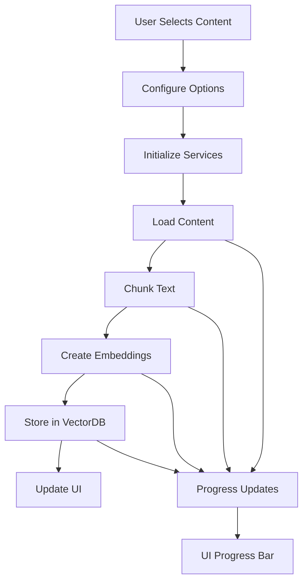

# Embeddings Creation and Modification Windows - Complete Implementation Guide

## Table of Contents
1. [Overview](#overview)
2. [System Architecture](#system-architecture)
3. [Core Components](#core-components)
4. [Embeddings Service API Reference](#embeddings-service-api-reference)
5. [Window Implementation Blueprint](#window-implementation-blueprint)
6. [User Interface Design](#user-interface-design)
7. [Backend Integration](#backend-integration)
8. [Processing Pipeline](#processing-pipeline)
9. [Advanced Features](#advanced-features)
10. [Testing Strategy](#testing-strategy)
11. [Implementation Roadmap](#implementation-roadmap)

## Overview

The Embeddings system in tldw_chatbook provides semantic search capabilities by converting text content into high-dimensional vectors. This guide provides everything needed to implement new Embeddings Creation and Modification windows from scratch.

### Key Capabilities
- **Multi-source Content**: Process chats, notes, media transcripts, character cards
- **Multiple Providers**: Support for HuggingFace, OpenAI, and local models
- **Flexible Chunking**: Various strategies for splitting large documents
- **Collection Management**: Create, update, delete vector collections
- **Real-time Search**: Fast semantic search with citations
- **Memory Efficient**: Smart caching and resource management

### Current Implementation Files
- `UI/SearchEmbeddingsWindow.py` - Current streamlined creation interface
- `UI/Embeddings_Management_Window.py` - Collection management interface
- `UI/Wizards/EmbeddingsWizard.py` - Step-by-step creation wizard
- `RAG_Search/simplified/` - Simplified RAG implementation
- `Embeddings/Embeddings_Lib.py` - Core embeddings factory

## System Architecture

### Component Hierarchy
```
Embeddings System
├── UI Layer
│   ├── Creation Window (New)
│   │   ├── Content Selection
│   │   ├── Model Configuration
│   │   ├── Processing Options
│   │   └── Progress Monitoring
│   ├── Modification Window (New)
│   │   ├── Collection Browser
│   │   ├── Content Editor
│   │   ├── Re-indexing
│   │   └── Statistics View
│   └── Search Interface
│       ├── Query Input
│       ├── Results Display
│       └── Citation Management
├── Service Layer
│   ├── EmbeddingsService
│   │   ├── Model Management
│   │   ├── Embedding Generation
│   │   └── Cache Management
│   ├── VectorStore
│   │   ├── ChromaDB Backend
│   │   ├── Collection Management
│   │   └── Search Operations
│   └── ChunkingService
│       ├── Text Splitting
│       ├── Metadata Preservation
│       └── Overlap Management
└── Data Layer
    ├── Content Sources
    │   ├── Chat Database
    │   ├── Media Database
    │   ├── Notes Database
    │   └── Character Database
    └── Vector Storage
        ├── Collections
        ├── Embeddings
        └── Metadata
```

## Core Components

### 1. EmbeddingsService

The main service for creating embeddings from text:

```python
from RAG_Search.simplified.embeddings_wrapper import EmbeddingsService

# Initialize service
service = EmbeddingsService(
    model_name="sentence-transformers/all-MiniLM-L6-v2",
    cache_size=2,  # Number of models to keep in memory
    device="cpu",   # or "cuda", "mps"
    api_key=None,   # For OpenAI models
    base_url=None   # For custom endpoints
)

# Create embeddings
texts = ["Hello world", "Another text"]
embeddings = service.create_embeddings(texts)  # Returns numpy array
```

### 2. VectorStore

Manages persistent storage of embeddings:

```python
from RAG_Search.simplified.vector_store import ChromaVectorStore

# Initialize store
store = ChromaVectorStore(
    persist_directory="~/.local/share/tldw_cli/embeddings",
    collection_name="my_collection",
    distance_metric="cosine"  # or "l2", "ip"
)

# Add documents
store.add(
    ids=["doc1", "doc2"],
    embeddings=embeddings,
    documents=texts,
    metadata=[
        {"source": "chat", "timestamp": "2024-01-01"},
        {"source": "note", "timestamp": "2024-01-02"}
    ]
)

# Search
query_embedding = service.create_embeddings(["search query"])[0]
results = store.search_with_citations(
    query_embedding=query_embedding,
    query_text="search query",
    top_k=10
)
```

### 3. ChunkingService

Splits large documents into manageable chunks:

```python
from RAG_Search.chunking_service import ChunkingService

chunker = ChunkingService()
chunks = chunker.chunk_text(
    content="Long document text...",
    chunk_size=500,
    chunk_overlap=100,
    method="sentences"  # or "words", "paragraphs", "tokens"
)
```

## Embeddings Service API Reference

### Model Configuration

**Supported Providers and Models:**

| Provider | Model Examples | Configuration |
|----------|---------------|---------------|
| **HuggingFace** | `sentence-transformers/all-MiniLM-L6-v2`<br>`sentence-transformers/all-mpnet-base-v2`<br>`BAAI/bge-small-en-v1.5`<br>`BAAI/bge-base-en-v1.5` | No API key needed<br>Local execution<br>Auto-downloads models |
| **OpenAI** | `openai/text-embedding-3-small`<br>`openai/text-embedding-3-large`<br>`openai/text-embedding-ada-002` | Requires API key<br>Cloud-based<br>Rate limits apply |
| **Local OpenAI-Compatible** | Any model name | Requires base_url<br>Optional API key<br>Custom endpoints |

### Service Methods

```python
class EmbeddingsService:
    def __init__(self, model_name: str, **kwargs):
        """Initialize embeddings service."""
        
    def create_embeddings(self, texts: List[str]) -> np.ndarray:
        """Create embeddings for texts."""
        
    async def create_embeddings_async(self, texts: List[str]) -> np.ndarray:
        """Async version for non-blocking operation."""
        
    def get_model_info(self) -> Dict[str, Any]:
        """Get information about current model."""
        
    def clear_cache(self) -> None:
        """Clear model cache to free memory."""
        
    def get_stats(self) -> Dict[str, Any]:
        """Get usage statistics."""
```

### Chunking Options

```python
chunk_options = {
    'method': 'sentences',     # Chunking strategy
    'max_size': 500,           # Maximum chunk size
    'overlap': 100,            # Overlap between chunks
    'adaptive': False,         # Adaptive chunk sizing
    'multi_level': False,      # Hierarchical chunking
    'language': 'en',          # For language-specific processing
    'preserve_sentences': True,  # Don't split sentences
    'tokenizer': 'gpt2'        # For token-based chunking
}
```

## Window Implementation Blueprint

### Creation Window Structure

```python
from textual.app import ComposeResult
from textual.containers import Container, Horizontal, Vertical, VerticalScroll
from textual.widgets import (
    Button, Label, Select, Input, TextArea, 
    Checkbox, Tree, ProgressBar, DataTable
)
from textual.reactive import reactive

class EmbeddingsCreationWindow(Container):
    """New embeddings creation interface."""
    
    # Reactive state
    selected_content_type = reactive("chats")
    selected_items = reactive(set())
    current_model = reactive("sentence-transformers/all-MiniLM-L6-v2")
    is_processing = reactive(False)
    progress = reactive(0.0)
    
    def __init__(self, app_instance):
        super().__init__()
        self.app = app_instance
        self.embeddings_service = None
        self.vector_store = None
        self.processing_queue = []
        
    def compose(self) -> ComposeResult:
        """Build the UI structure."""
        with Horizontal(classes="main-container"):
            # Left Panel - Content Selection
            with Vertical(classes="content-panel"):
                yield Label("Content Selection", classes="panel-title")
                
                # Content Type Selector
                yield Select(
                    [("chats", "Chats"),
                     ("notes", "Notes"),
                     ("media", "Media"),
                     ("characters", "Characters")],
                    id="content-type",
                    value="chats"
                )
                
                # Search/Filter
                yield Input(
                    placeholder="Filter content...",
                    id="content-filter"
                )
                
                # Content Tree
                with VerticalScroll(classes="content-tree-container"):
                    yield Tree("Available Content", id="content-tree")
                
                # Selection Actions
                with Horizontal(classes="selection-actions"):
                    yield Button("Select All", id="select-all", variant="default")
                    yield Button("Clear", id="clear-selection", variant="default")
            
            # Right Panel - Configuration
            with Vertical(classes="config-panel"):
                yield Label("Embeddings Configuration", classes="panel-title")
                
                # Collection Settings
                with Container(classes="collection-section"):
                    yield Label("Collection Name:", classes="field-label")
                    yield Input(
                        value="my_embeddings",
                        id="collection-name",
                        placeholder="Enter collection name"
                    )
                    
                    yield Label("Description:", classes="field-label")
                    yield TextArea(
                        "",
                        id="collection-description",
                        classes="description-input"
                    )
                
                # Model Selection
                with Container(classes="model-section"):
                    yield Label("Embedding Model:", classes="field-label")
                    yield Select(
                        self._get_model_options(),
                        id="model-select",
                        value="sentence-transformers/all-MiniLM-L6-v2"
                    )
                    
                    # Model Info Display
                    yield Static(
                        "Dimension: 384 | Size: 80MB | Speed: Fast",
                        id="model-info",
                        classes="model-info"
                    )
                
                # Chunking Options
                with Collapsible("Chunking Options", collapsed=False):
                    yield Label("Method:", classes="field-label")
                    yield Select(
                        [("sentences", "Sentences"),
                         ("words", "Words"),
                         ("paragraphs", "Paragraphs"),
                         ("tokens", "Tokens")],
                        id="chunk-method",
                        value="sentences"
                    )
                    
                    with Horizontal(classes="chunk-sizes"):
                        with Vertical():
                            yield Label("Size:", classes="field-label")
                            yield Input(value="500", id="chunk-size")
                        with Vertical():
                            yield Label("Overlap:", classes="field-label")
                            yield Input(value="100", id="chunk-overlap")
                    
                    yield Checkbox("Adaptive chunking", False, id="adaptive-chunking")
                    yield Checkbox("Multi-level hierarchy", False, id="multi-level")
                
                # Processing Options
                with Container(classes="processing-options"):
                    yield Checkbox("Normalize embeddings", True, id="normalize")
                    yield Checkbox("Include metadata", True, id="include-metadata")
                    yield Checkbox("Generate citations", True, id="generate-citations")
                
                # Progress Section
                with Container(classes="progress-section", id="progress-container"):
                    yield Label("Ready to process", id="progress-status")
                    yield ProgressBar(total=100, id="progress-bar")
                    yield Static("", id="progress-details")
                
                # Action Buttons
                with Horizontal(classes="action-buttons"):
                    yield Button("Create Embeddings", id="create-button", variant="primary")
                    yield Button("Cancel", id="cancel-button", variant="default")
    
    def _get_model_options(self):
        """Get available embedding models."""
        return [
            ("sentence-transformers/all-MiniLM-L6-v2", "MiniLM-L6 (Fast, 384d)"),
            ("sentence-transformers/all-mpnet-base-v2", "MPNet Base (Balanced, 768d)"),
            ("BAAI/bge-small-en-v1.5", "BGE Small (Efficient, 384d)"),
            ("BAAI/bge-base-en-v1.5", "BGE Base (Quality, 768d)"),
            ("openai/text-embedding-3-small", "OpenAI Small (API, 1536d)"),
            ("openai/text-embedding-3-large", "OpenAI Large (API, 3072d)")
        ]
```

### Modification Window Structure

```python
class EmbeddingsModificationWindow(Container):
    """Embeddings modification and management interface."""
    
    # Reactive state
    selected_collection = reactive(None)
    selected_documents = reactive(set())
    is_modified = reactive(False)
    
    def compose(self) -> ComposeResult:
        """Build the modification UI."""
        with Horizontal(classes="main-container"):
            # Left Panel - Collection Browser
            with Vertical(classes="collections-panel"):
                yield Label("Collections", classes="panel-title")
                
                # Collection List
                yield DataTable(id="collections-table")
                
                # Collection Actions
                with Horizontal(classes="collection-actions"):
                    yield Button("Refresh", id="refresh-collections")
                    yield Button("Delete", id="delete-collection", variant="error")
            
            # Center Panel - Document Browser
            with Vertical(classes="documents-panel"):
                yield Label("Documents", id="documents-title", classes="panel-title")
                
                # Search within collection
                yield Input(
                    placeholder="Search in collection...",
                    id="doc-search"
                )
                
                # Document List
                with VerticalScroll():
                    yield DataTable(id="documents-table")
                
                # Document Actions
                with Horizontal(classes="doc-actions"):
                    yield Button("Add Documents", id="add-docs")
                    yield Button("Remove Selected", id="remove-docs")
                    yield Button("Re-index", id="reindex-docs")
            
            # Right Panel - Details & Actions
            with Vertical(classes="details-panel"):
                yield Label("Details", classes="panel-title")
                
                # Collection Statistics
                with Container(id="stats-container", classes="stats-section"):
                    yield Static("Select a collection", id="collection-stats")
                
                # Document Preview
                with Container(id="preview-container", classes="preview-section"):
                    yield Label("Document Preview", classes="section-title")
                    yield TextArea("", id="doc-preview", read_only=True)
                
                # Metadata Editor
                with Container(id="metadata-container", classes="metadata-section"):
                    yield Label("Metadata", classes="section-title")
                    yield TextArea("", id="metadata-editor")
                
                # Update Actions
                with Horizontal(classes="update-actions"):
                    yield Button("Save Changes", id="save-changes", variant="primary")
                    yield Button("Revert", id="revert-changes")
```

## User Interface Design

### Layout Principles

1. **Three-Panel Layout**
   - Left: Content/Collection selection
   - Center: Main workspace
   - Right: Configuration/Details

2. **Progressive Disclosure**
   - Basic options visible by default
   - Advanced options in collapsible sections
   - Context-sensitive controls

3. **Visual Feedback**
   - Real-time progress indicators
   - Status messages for operations
   - Visual distinction for selected items

### CSS Styling

```css
/* styles.tcss */
EmbeddingsCreationWindow {
    layout: horizontal;
    height: 100%;
}

.main-container {
    height: 100%;
}

.content-panel {
    width: 30%;
    padding: 1;
    border-right: solid $primary;
}

.config-panel {
    width: 70%;
    padding: 1;
}

.panel-title {
    text-style: bold;
    color: $primary;
    margin-bottom: 1;
}

.content-tree-container {
    height: 1fr;
    border: solid $surface-lighten-1;
    padding: 1;
}

Tree {
    height: 100%;
}

.field-label {
    margin-top: 1;
    color: $text-muted;
}

.model-info {
    color: $success;
    margin: 1 0;
    padding: 1;
    background: $surface-lighten-1;
    border: solid $primary-lighten-2;
}

.progress-section {
    margin-top: 2;
    padding: 1;
    border: solid $primary;
    background: $surface;
}

#progress-bar {
    margin: 1 0;
}

.action-buttons {
    margin-top: 2;
    align: center middle;
}

.action-buttons Button {
    margin: 0 1;
    width: 20;
}

/* Collection Management Specific */
.collections-panel {
    width: 25%;
    border-right: solid $primary;
}

.documents-panel {
    width: 45%;
    border-right: solid $primary;
}

.details-panel {
    width: 30%;
}

DataTable {
    height: 1fr;
    border: solid $surface-lighten-1;
}

.stats-section {
    padding: 1;
    margin-bottom: 1;
    background: $surface-lighten-1;
}

.preview-section, .metadata-section {
    padding: 1;
    margin-bottom: 1;
    border: solid $surface-lighten-2;
}
```

## Backend Integration

### Processing Pipeline Implementation

```python
@work(exclusive=True)
async def process_embeddings(self):
    """Main processing pipeline for creating embeddings."""
    try:
        # 1. Gather selected content
        content_items = self._gather_selected_content()
        self.update_progress(0, f"Processing {len(content_items)} items...")
        
        # 2. Initialize services
        model_name = self.query_one("#model-select").value
        collection_name = self.query_one("#collection-name").value
        
        self.embeddings_service = EmbeddingsService(
            model_name=model_name,
            device=self._detect_device()
        )
        
        self.vector_store = ChromaVectorStore(
            persist_directory=self._get_persist_dir(),
            collection_name=collection_name
        )
        
        # 3. Process each content item
        total_chunks = 0
        all_documents = []
        all_ids = []
        all_metadata = []
        
        for i, item in enumerate(content_items):
            # Update progress
            progress = (i / len(content_items)) * 50  # First 50% for chunking
            self.update_progress(progress, f"Processing: {item['title']}")
            
            # Load content
            content = self._load_content(item)
            
            # Chunk content
            chunks = self._chunk_content(content, item)
            total_chunks += len(chunks)
            
            # Prepare for embedding
            for chunk in chunks:
                all_documents.append(chunk['text'])
                all_ids.append(f"{item['id']}_{chunk['index']}")
                all_metadata.append({
                    'source': item['type'],
                    'source_id': item['id'],
                    'title': item['title'],
                    'chunk_index': chunk['index'],
                    'start_char': chunk['start_char'],
                    'end_char': chunk['end_char']
                })
        
        # 4. Create embeddings in batches
        batch_size = 32
        all_embeddings = []
        
        for i in range(0, len(all_documents), batch_size):
            batch = all_documents[i:i+batch_size]
            progress = 50 + (i / len(all_documents)) * 40  # 50-90% for embedding
            self.update_progress(progress, f"Creating embeddings: {i}/{len(all_documents)}")
            
            # Create embeddings
            embeddings = await self.embeddings_service.create_embeddings_async(batch)
            all_embeddings.append(embeddings)
        
        # Combine all embeddings
        import numpy as np
        final_embeddings = np.vstack(all_embeddings)
        
        # 5. Store in vector database
        self.update_progress(90, "Storing in database...")
        self.vector_store.add(
            ids=all_ids,
            embeddings=final_embeddings,
            documents=all_documents,
            metadata=all_metadata
        )
        
        # 6. Complete
        self.update_progress(100, f"Successfully created {total_chunks} embeddings!")
        self.notify(f"Created embeddings for {len(content_items)} items", severity="success")
        
    except Exception as e:
        logger.error(f"Error creating embeddings: {e}")
        self.notify(f"Error: {str(e)}", severity="error")
    finally:
        self.is_processing = False

def _gather_selected_content(self) -> List[Dict]:
    """Gather all selected content items."""
    content_type = self.selected_content_type
    selected_ids = self.selected_items
    
    items = []
    if content_type == "chats":
        db = CharactersRAGDB()
        for conv_id in selected_ids:
            conv = db.get_conversation(conv_id)
            messages = db.get_messages(conv_id)
            items.append({
                'id': conv_id,
                'type': 'chat',
                'title': conv.get('title', f'Conversation {conv_id}'),
                'content': self._format_chat_messages(messages)
            })
    
    elif content_type == "notes":
        db = CharactersRAGDB()
        for note_id in selected_ids:
            note = db.get_note(note_id)
            items.append({
                'id': note_id,
                'type': 'note',
                'title': note.get('title', f'Note {note_id}'),
                'content': note.get('content', '')
            })
    
    elif content_type == "media":
        db = MediaDatabase()
        for media_id in selected_ids:
            media = db.get_media_item(media_id)
            items.append({
                'id': media_id,
                'type': 'media',
                'title': media.get('title', f'Media {media_id}'),
                'content': media.get('transcript', '') or media.get('content', '')
            })
    
    return items

def _chunk_content(self, content: str, item: Dict) -> List[Dict]:
    """Chunk content based on configured options."""
    method = self.query_one("#chunk-method").value
    chunk_size = int(self.query_one("#chunk-size").value)
    chunk_overlap = int(self.query_one("#chunk-overlap").value)
    
    chunker = ChunkingService()
    chunks = chunker.chunk_text(
        content=content,
        chunk_size=chunk_size,
        chunk_overlap=chunk_overlap,
        method=method
    )
    
    # Add item metadata to each chunk
    for i, chunk in enumerate(chunks):
        chunk['index'] = i
        chunk['source_title'] = item['title']
    
    return chunks
```

### Content Loading Implementation

```python
def _load_chat_content(self, conversation_id: int) -> str:
    """Load and format chat conversation content."""
    db = CharactersRAGDB()
    messages = db.get_messages_for_conversation(conversation_id)
    
    formatted = []
    for msg in messages:
        role = msg.get('role', 'user')
        content = msg.get('content', '')
        timestamp = msg.get('timestamp', '')
        
        formatted.append(f"[{timestamp}] {role}: {content}")
    
    return "\n\n".join(formatted)

def _load_media_content(self, media_id: int) -> str:
    """Load media transcript or content."""
    db = MediaDatabase()
    media = db.get_media_item(media_id)
    
    # Prefer transcript over raw content
    if media.get('transcript'):
        return media['transcript']
    elif media.get('content'):
        return media['content']
    else:
        # Try to extract from chunks
        chunks = db.get_media_chunks(media_id)
        return "\n\n".join([c['text'] for c in chunks])

def _load_note_content(self, note_id: int) -> str:
    """Load note content."""
    db = CharactersRAGDB()
    note = db.get_note(note_id)
    
    content = note.get('content', '')
    
    # Include title as part of content for better context
    title = note.get('title', '')
    if title:
        content = f"# {title}\n\n{content}"
    
    return content
```

## Processing Pipeline

### Complete Processing Flow



### Error Handling

```python
class EmbeddingError(Exception):
    """Base exception for embedding operations."""
    pass

class ModelLoadError(EmbeddingError):
    """Failed to load embedding model."""
    pass

class ChunkingError(EmbeddingError):
    """Failed to chunk content."""
    pass

class StorageError(EmbeddingError):
    """Failed to store embeddings."""
    pass

def handle_embedding_error(self, error: Exception):
    """Centralized error handling for embedding operations."""
    if isinstance(error, ModelLoadError):
        self.notify(
            f"Failed to load model: {error}. Check your internet connection or try a different model.",
            severity="error"
        )
        self.suggest_alternative_models()
    
    elif isinstance(error, ChunkingError):
        self.notify(
            f"Failed to chunk content: {error}. Try adjusting chunk size or method.",
            severity="warning"
        )
        
    elif isinstance(error, StorageError):
        self.notify(
            f"Failed to store embeddings: {error}. Check disk space and permissions.",
            severity="error"
        )
        
    else:
        self.notify(f"Unexpected error: {error}", severity="error")
        logger.exception("Unexpected error in embedding pipeline")
```

## Advanced Features

### 1. Smart Chunking with Context

```python
class SmartChunker:
    """Advanced chunking with context preservation."""
    
    def chunk_with_context(self, 
                          content: str, 
                          chunk_size: int = 500,
                          context_size: int = 50) -> List[Dict]:
        """Chunk with surrounding context for better coherence."""
        base_chunks = self.chunk_text(content, chunk_size)
        
        enhanced_chunks = []
        for i, chunk in enumerate(base_chunks):
            # Add previous context
            if i > 0:
                prev_context = base_chunks[i-1]['text'][-context_size:]
                chunk['prev_context'] = prev_context
            
            # Add next context  
            if i < len(base_chunks) - 1:
                next_context = base_chunks[i+1]['text'][:context_size]
                chunk['next_context'] = next_context
            
            # Create enhanced text with context markers
            enhanced_text = ""
            if 'prev_context' in chunk:
                enhanced_text += f"[...{chunk['prev_context']}]\n\n"
            enhanced_text += chunk['text']
            if 'next_context' in chunk:
                enhanced_text += f"\n\n[{chunk['next_context']}...]"
            
            chunk['enhanced_text'] = enhanced_text
            enhanced_chunks.append(chunk)
        
        return enhanced_chunks
```

### 2. Incremental Updates

```python
class IncrementalEmbeddings:
    """Support for incremental updates to existing collections."""
    
    def update_collection(self, 
                         collection_name: str,
                         new_items: List[Dict]) -> Dict:
        """Add new items to existing collection without re-processing all."""
        store = ChromaVectorStore(
            persist_directory=self.persist_dir,
            collection_name=collection_name
        )
        
        # Get existing IDs to avoid duplicates
        existing_stats = store.get_collection_stats()
        existing_ids = set(existing_stats.get('document_ids', []))
        
        # Filter new items
        items_to_add = [
            item for item in new_items 
            if item['id'] not in existing_ids
        ]
        
        if not items_to_add:
            return {'status': 'no_updates', 'message': 'All items already indexed'}
        
        # Process only new items
        new_embeddings = self._process_items(items_to_add)
        
        # Add to store
        store.add(
            ids=[item['id'] for item in items_to_add],
            embeddings=new_embeddings,
            documents=[item['text'] for item in items_to_add],
            metadata=[item['metadata'] for item in items_to_add]
        )
        
        return {
            'status': 'updated',
            'new_items': len(items_to_add),
            'total_items': existing_stats['count'] + len(items_to_add)
        }
```

### 3. Model Comparison Tool

```python
class ModelComparisonWidget(Container):
    """Compare different embedding models."""
    
    def compose(self) -> ComposeResult:
        yield Label("Model Comparison", classes="title")
        
        # Model selection
        with Horizontal():
            yield Select(
                self._get_model_options(),
                id="model-a",
                classes="model-select"
            )
            yield Select(
                self._get_model_options(),
                id="model-b",
                classes="model-select"
            )
        
        # Test query input
        yield Input(
            placeholder="Enter test query...",
            id="test-query"
        )
        
        # Results display
        with Horizontal(classes="comparison-results"):
            yield DataTable(id="results-a")
            yield DataTable(id="results-b")
        
        yield Button("Compare", id="compare-button")
    
    @on(Button.Pressed, "#compare-button")
    async def compare_models(self):
        """Compare search results from different models."""
        query = self.query_one("#test-query").value
        model_a = self.query_one("#model-a").value
        model_b = self.query_one("#model-b").value
        
        # Create embeddings with both models
        service_a = EmbeddingsService(model_name=model_a)
        service_b = EmbeddingsService(model_name=model_b)
        
        embedding_a = service_a.create_embeddings([query])[0]
        embedding_b = service_b.create_embeddings([query])[0]
        
        # Search with both
        results_a = self.vector_store_a.search(embedding_a, top_k=10)
        results_b = self.vector_store_b.search(embedding_b, top_k=10)
        
        # Display results
        self._display_comparison(results_a, results_b)
```

### 4. Batch Processing Queue

```python
class BatchProcessingQueue:
    """Queue system for processing large amounts of content."""
    
    def __init__(self, max_concurrent: int = 2):
        self.queue = []
        self.processing = []
        self.completed = []
        self.max_concurrent = max_concurrent
        
    async def add_batch(self, items: List[Dict], priority: int = 0):
        """Add items to processing queue with priority."""
        batch = {
            'id': str(uuid.uuid4()),
            'items': items,
            'priority': priority,
            'status': 'queued',
            'created_at': datetime.now()
        }
        self.queue.append(batch)
        self.queue.sort(key=lambda x: x['priority'], reverse=True)
        
    async def process_queue(self):
        """Process queued batches with concurrency control."""
        while self.queue or self.processing:
            # Start new processes if under limit
            while len(self.processing) < self.max_concurrent and self.queue:
                batch = self.queue.pop(0)
                batch['status'] = 'processing'
                self.processing.append(batch)
                asyncio.create_task(self._process_batch(batch))
            
            # Wait a bit before checking again
            await asyncio.sleep(0.5)
    
    async def _process_batch(self, batch: Dict):
        """Process a single batch."""
        try:
            # Process items
            for item in batch['items']:
                await self._process_item(item)
            
            batch['status'] = 'completed'
            batch['completed_at'] = datetime.now()
            
        except Exception as e:
            batch['status'] = 'failed'
            batch['error'] = str(e)
            
        finally:
            self.processing.remove(batch)
            self.completed.append(batch)
```

## Testing Strategy

### Unit Tests

```python
import pytest
from unittest.mock import Mock, patch
import numpy as np

@pytest.fixture
def mock_embeddings_service():
    """Mock embeddings service for testing."""
    service = Mock()
    service.create_embeddings.return_value = np.random.rand(2, 384)
    service.get_model_info.return_value = {
        'name': 'test-model',
        'dimension': 384
    }
    return service

@pytest.fixture
def mock_vector_store():
    """Mock vector store for testing."""
    store = Mock()
    store.add.return_value = None
    store.search.return_value = [
        {'id': '1', 'score': 0.95, 'document': 'Test doc'}
    ]
    return store

class TestEmbeddingsCreation:
    """Test embeddings creation functionality."""
    
    async def test_create_embeddings_success(self, mock_embeddings_service):
        """Test successful embedding creation."""
        texts = ["Hello world", "Test text"]
        embeddings = mock_embeddings_service.create_embeddings(texts)
        
        assert embeddings.shape == (2, 384)
        mock_embeddings_service.create_embeddings.assert_called_once_with(texts)
    
    async def test_chunk_text(self):
        """Test text chunking."""
        chunker = ChunkingService()
        text = "This is a test. " * 100  # Long text
        
        chunks = chunker.chunk_text(
            content=text,
            chunk_size=50,
            chunk_overlap=10,
            method="words"
        )
        
        assert len(chunks) > 1
        assert all('text' in chunk for chunk in chunks)
        assert all('start_char' in chunk for chunk in chunks)
    
    async def test_vector_store_operations(self, mock_vector_store):
        """Test vector store add and search."""
        # Add documents
        mock_vector_store.add(
            ids=['1', '2'],
            embeddings=np.random.rand(2, 384),
            documents=['Doc 1', 'Doc 2'],
            metadata=[{}, {}]
        )
        
        mock_vector_store.add.assert_called_once()
        
        # Search
        results = mock_vector_store.search(
            query_embedding=np.random.rand(384),
            top_k=5
        )
        
        assert len(results) == 1
        assert results[0]['id'] == '1'
```

### Integration Tests

```python
@pytest.mark.asyncio
class TestEmbeddingsWindowIntegration:
    """Integration tests for embeddings window."""
    
    async def test_window_initialization(self):
        """Test window initializes correctly."""
        from textual.app import App
        
        class TestApp(App):
            def compose(self):
                yield EmbeddingsCreationWindow(self)
        
        app = TestApp()
        async with app.run_test() as pilot:
            # Check main components exist
            window = app.query_one(EmbeddingsCreationWindow)
            assert window is not None
            
            # Check panels
            content_panel = window.query(".content-panel")
            assert len(content_panel) > 0
            
            config_panel = window.query(".config-panel")
            assert len(config_panel) > 0
    
    async def test_content_selection(self):
        """Test content selection functionality."""
        app = TestApp()
        async with app.run_test() as pilot:
            window = app.query_one(EmbeddingsCreationWindow)
            
            # Select content type
            await pilot.click("#content-type")
            await pilot.press("down")  # Select notes
            await pilot.press("enter")
            
            assert window.selected_content_type == "notes"
    
    async def test_processing_pipeline(self):
        """Test complete processing pipeline."""
        with patch('EmbeddingsService') as mock_service:
            with patch('ChromaVectorStore') as mock_store:
                app = TestApp()
                async with app.run_test() as pilot:
                    window = app.query_one(EmbeddingsCreationWindow)
                    
                    # Configure
                    collection_input = window.query_one("#collection-name")
                    collection_input.value = "test_collection"
                    
                    # Mock some selected content
                    window.selected_items = {'1', '2', '3'}
                    
                    # Start processing
                    await pilot.click("#create-button")
                    
                    # Wait for processing
                    await pilot.pause(1.0)
                    
                    # Verify services were initialized
                    mock_service.assert_called()
                    mock_store.assert_called()
```

### Performance Tests

```python
@pytest.mark.benchmark
class TestEmbeddingsPerformance:
    """Performance benchmarks for embeddings."""
    
    def test_embedding_speed(self, benchmark):
        """Benchmark embedding creation speed."""
        service = EmbeddingsService(
            model_name="sentence-transformers/all-MiniLM-L6-v2"
        )
        texts = ["Sample text"] * 100
        
        result = benchmark(service.create_embeddings, texts)
        assert result.shape == (100, 384)
    
    def test_chunking_performance(self, benchmark):
        """Benchmark chunking performance."""
        chunker = ChunkingService()
        text = "Large document. " * 10000
        
        result = benchmark(
            chunker.chunk_text,
            content=text,
            chunk_size=500,
            chunk_overlap=100
        )
        
        assert len(result) > 100
    
    def test_memory_usage(self):
        """Test memory usage during processing."""
        import psutil
        import gc
        
        process = psutil.Process()
        initial_memory = process.memory_info().rss / 1024 / 1024  # MB
        
        # Create embeddings for large dataset
        service = EmbeddingsService(
            model_name="sentence-transformers/all-MiniLM-L6-v2",
            cache_size=1  # Minimal cache
        )
        
        for _ in range(10):
            texts = ["Text"] * 1000
            embeddings = service.create_embeddings(texts)
            del embeddings
            gc.collect()
        
        final_memory = process.memory_info().rss / 1024 / 1024
        memory_increase = final_memory - initial_memory
        
        # Should not leak more than 100MB
        assert memory_increase < 100
```

## Implementation Roadmap

### Phase 1: Core Foundation (Week 1)
- [ ] Set up window structure and layout
- [ ] Implement content selection tree
- [ ] Create model selection dropdown
- [ ] Add basic chunking options
- [ ] Implement progress tracking

### Phase 2: Backend Integration (Week 2)
- [ ] Integrate EmbeddingsService
- [ ] Connect to VectorStore
- [ ] Implement chunking pipeline
- [ ] Add content loading from databases
- [ ] Create processing worker

### Phase 3: Advanced Features (Week 3)
- [ ] Add incremental updates
- [ ] Implement batch processing queue
- [ ] Create model comparison tool
- [ ] Add smart chunking with context
- [ ] Implement collection management

### Phase 4: Polish & Testing (Week 4)
- [ ] Complete error handling
- [ ] Add comprehensive logging
- [ ] Write unit tests
- [ ] Create integration tests
- [ ] Performance optimization
- [ ] User documentation

### Implementation Checklist

#### Essential Features
- [ ] Content selection from multiple sources
- [ ] Model selection with info display
- [ ] Chunking configuration
- [ ] Progress tracking
- [ ] Error handling
- [ ] Collection naming and description
- [ ] Basic search functionality

#### Advanced Features
- [ ] Incremental updates
- [ ] Batch processing
- [ ] Model comparison
- [ ] Collection statistics
- [ ] Document preview
- [ ] Metadata editing
- [ ] Re-indexing capability
- [ ] Citation generation

#### Testing Requirements
- [ ] Unit tests for all components
- [ ] Integration tests for workflows
- [ ] Performance benchmarks
- [ ] Memory leak tests
- [ ] Error recovery tests
- [ ] UI interaction tests

## Best Practices

### 1. Resource Management
- Clear model cache when switching models
- Use batch processing for large datasets
- Implement memory monitoring
- Clean up resources on window close

### 2. User Experience
- Provide clear progress feedback
- Show estimated time remaining
- Allow cancellation of long operations
- Save user preferences
- Provide helpful error messages

### 3. Performance Optimization
- Cache frequently used embeddings
- Use async operations for I/O
- Batch database operations
- Implement lazy loading for large lists
- Use incremental updates when possible

### 4. Error Recovery
- Implement retry logic for transient failures
- Save progress for resumable operations
- Provide fallback options for failed models
- Log errors with context for debugging
- Show user-friendly error messages

### 5. Code Organization
- Separate UI from business logic
- Use dependency injection for services
- Implement proper error hierarchies
- Follow reactive programming patterns
- Write comprehensive documentation

## Conclusion

This guide provides a complete blueprint for implementing Embeddings Creation and Modification windows from scratch. The architecture is designed to be:

- **Modular**: Easy to extend and modify
- **Performant**: Handles large datasets efficiently
- **User-friendly**: Clear UI with helpful feedback
- **Robust**: Comprehensive error handling and recovery
- **Testable**: Clear separation of concerns

Follow the implementation roadmap and use the provided code examples as templates. The system is designed to integrate seamlessly with the existing tldw_chatbook infrastructure while providing a modern, efficient interface for embeddings management.

Remember to:
1. Start with the core functionality
2. Test each component thoroughly
3. Add advanced features incrementally
4. Focus on user experience
5. Document your implementation

Good luck with your implementation!