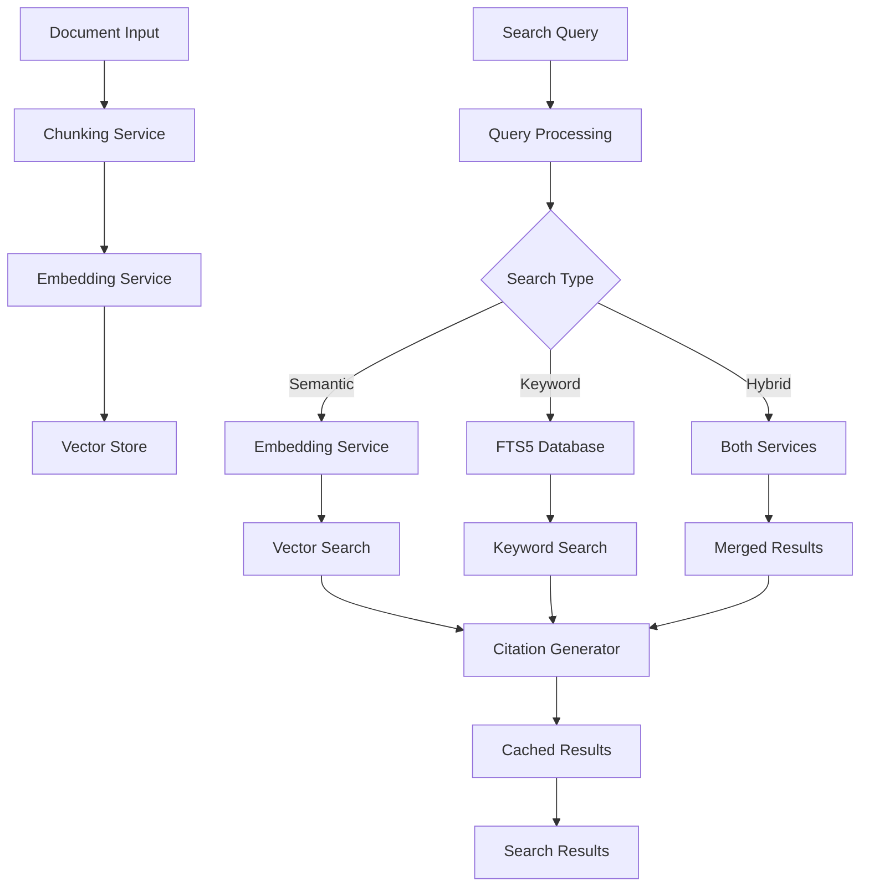

# RAG (Retrieval-Augmented Generation) Pipeline Design

## Table of Contents
1. [Overview](#overview)
2. [Architecture](#architecture)
3. [Core Components](#core-components)
4. [Data Flow](#data-flow)
5. [Architecture Decision Records (ADRs)](#architecture-decision-records-adrs)
6. [API Reference](#api-reference)
7. [Configuration](#configuration)
8. [Security Considerations](#security-considerations)
9. [Performance Optimizations](#performance-optimizations)
10. [Future Enhancements](#future-enhancements)

## Overview

The RAG (Retrieval-Augmented Generation) pipeline in tldw_chatbook provides a sophisticated system for indexing, searching, and retrieving relevant context to augment LLM responses. The implementation emphasizes security, performance, and extensibility while maintaining a clean, modular architecture.

### Key Features
- **Multi-modal Search**: Supports semantic, keyword (FTS5), and hybrid search modes
- **Citation Support**: Tracks source attribution with detailed citations
- **Scalable Architecture**: Handles large document collections with efficient chunking and indexing
- **Security-First Design**: Comprehensive input validation and SQL injection prevention
- **Performance Optimized**: Caching, connection pooling, and batch processing
- **Resilient Operations**: Circuit breakers, exponential backoff, and partial failure recovery

## Architecture

### High-Level Architecture

```
┌─────────────────────────────────────────────────────────────────┐
│                        Application Layer                         │
│  ┌─────────────┐  ┌──────────────┐  ┌────────────────────┐    │
│  │   UI/Chat   │  │   Ingestion  │  │  Search Interface  │    │
│  │   Windows   │  │    Windows    │  │    (RAG Search)    │    │
│  └──────┬──────┘  └──────┬───────┘  └────────┬───────────┘    │
│         │                 │                    │                 │
├─────────┴─────────────────┴────────────────────┴────────────────┤
│                        Event Bus (Textual)                       │
├──────────────────────────────────────────────────────────────────┤
│                      RAG Service Layer                           │
│  ┌─────────────────────────────────────────────────────────┐   │
│  │                    RAGService                            │   │
│  │  ┌─────────────┐  ┌──────────────┐  ┌───────────────┐  │   │
│  │  │  Indexing   │  │   Search     │  │    Cache      │  │   │
│  │  │  Pipeline   │  │   Engine     │  │   Manager     │  │   │
│  │  └─────────────┘  └──────────────┘  └───────────────┘  │   │
│  └─────────────────────────────────────────────────────────┘   │
├──────────────────────────────────────────────────────────────────┤
│                    Infrastructure Layer                          │
│  ┌──────────────┐  ┌───────────────┐  ┌──────────────────┐    │
│  │  Embeddings  │  │ Vector Store  │  │  Database Pool   │    │
│  │   Service    │  │  (ChromaDB)   │  │     (FTS5)       │    │
│  └──────────────┘  └───────────────┘  └──────────────────┘    │
└──────────────────────────────────────────────────────────────────┘
```

### Component Interactions



## Core Components

### 1. RAGService (`rag_service.py`)

The main orchestrator for all RAG operations.

**Key Responsibilities:**
- Document indexing pipeline coordination
- Search request routing and execution
- Cache management
- Metrics collection and reporting

**Design Decisions:**
- Single entry point for all RAG operations
- Async-first design for scalability
- Configurable through `RAGConfig`

### 2. Embeddings Service (`embeddings_wrapper.py`)

Wrapper around the existing embeddings library providing a simplified interface.

**Features:**
- Multi-provider support (HuggingFace, OpenAI, local models)
- Automatic device detection (CPU/CUDA/MPS)
- Circuit breaker protection for resilience
- Memory-efficient batch processing

**Key Methods:**
```python
async def create_embeddings_async(texts: List[str]) -> np.ndarray
def get_embedding_dimension() -> Optional[int]
```

### 3. Vector Store (`vector_store.py`)

Abstraction layer for vector storage with multiple implementations.

**Implementations:**
1. **ChromaVectorStore**: Persistent storage with ChromaDB
2. **InMemoryVectorStore**: Memory-based storage with LRU eviction

**Features:**
- Citation-aware search
- Metadata filtering
- Memory pressure detection
- Collection management

### 4. Search Engine

Implements three search modes:

#### Semantic Search
- Uses vector embeddings for similarity matching
- Configurable score thresholds
- Supports metadata filtering

#### Keyword Search (FTS5)
- SQLite FTS5 full-text search
- SQL injection prevention
- Connection pooling for performance

#### Hybrid Search
- Combines semantic and keyword results
- Configurable weighting (alpha parameter)
- Duplicate removal with citation merging

### 5. Chunking Service (`chunking_service.py`)

Intelligent document chunking with multiple strategies:
- **Word-based**: Respects word boundaries
- **Sentence-based**: Maintains sentence integrity
- **Paragraph-based**: Preserves paragraph structure

**Parameters:**
- `chunk_size`: Target chunk size
- `chunk_overlap`: Overlap between chunks
- `min_chunk_size`: Minimum viable chunk
- `max_chunk_size`: Maximum chunk size

### 6. Citation System (`citations.py`)

Comprehensive citation tracking for source attribution.

**Citation Types:**
- `EXACT`: Direct keyword matches
- `SEMANTIC`: Similarity-based matches
- `KEYWORD`: FTS5 search matches

**Citation Data:**
```python
@dataclass
class Citation:
    document_id: str
    document_title: str
    chunk_id: str
    text: str
    start_char: int
    end_char: int
    confidence: float
    match_type: CitationType
    metadata: Dict[str, Any]
```

### 7. Cache System (`simple_cache.py`)

LRU cache with TTL support for search results.

**Features:**
- Async-safe operations
- Search-type specific TTLs
- Memory-aware sizing
- Detailed metrics

### 8. Database Connection Pool (`db_connection_pool.py`)

Thread-safe SQLite connection pooling.

**Features:**
- Automatic transaction management
- Connection health checking
- WAL mode for concurrency
- Configurable pool sizes

### 9. Circuit Breaker (`circuit_breaker.py`)

Fault tolerance for external service calls.

**States:**
- `CLOSED`: Normal operation
- `OPEN`: Service unavailable, failing fast
- `HALF_OPEN`: Testing recovery

**Features:**
- Exponential backoff
- Configurable thresholds
- Automatic recovery testing

## Data Flow

### Document Indexing Pipeline

1. **Document Input**
   - Validation (size limits, format checks)
   - Metadata extraction

2. **Chunking**
   - Split into overlapping chunks
   - Preserve context boundaries
   - Track chunk positions

3. **Embedding Generation**
   - Batch processing with retry logic
   - Partial failure recovery
   - Circuit breaker protection

4. **Storage**
   - Vector embeddings in ChromaDB/memory
   - Metadata for citation tracking
   - Update indexing statistics

### Search Pipeline

1. **Query Processing**
   - Input validation and sanitization
   - Query length limits
   - Cache lookup

2. **Search Execution**
   - Route to appropriate search type
   - Apply filters and thresholds
   - Generate embeddings if needed

3. **Result Processing**
   - Score-based filtering
   - Citation generation
   - Result deduplication

4. **Caching**
   - Store results with TTL
   - Track cache metrics

## Architecture Decision Records (ADRs)

### ADR-001: Simplified RAG Architecture

**Status**: Accepted  
**Date**: 2024-01-10

**Context**: The original RAG implementation was overly complex with multiple abstraction layers that made it difficult to maintain and debug.

**Decision**: Create a simplified architecture with:
- Single RAGService as the main entry point
- Direct integration with existing services
- Minimal abstraction layers

**Consequences**:
- ✅ Easier to understand and maintain
- ✅ Better performance with fewer layers
- ✅ Simpler debugging and testing
- ⚠️ Less flexibility for swapping components

### ADR-002: Hybrid Search Implementation

**Status**: Accepted  
**Date**: 2024-01-10

**Context**: Users need both precise keyword matching and semantic understanding.

**Decision**: Implement three search modes:
1. Semantic (vector similarity)
2. Keyword (FTS5)
3. Hybrid (weighted combination)

**Consequences**:
- ✅ Better search accuracy
- ✅ User choice in search strategy
- ⚠️ Increased complexity
- ⚠️ Need to maintain two search indices

### ADR-003: Citation System Design

**Status**: Accepted  
**Date**: 2024-01-10

**Context**: Users need to verify information sources for trust and compliance.

**Decision**: Implement comprehensive citation tracking with:
- Multiple citation types (exact, semantic, keyword)
- Character-level position tracking
- Confidence scores

**Consequences**:
- ✅ Full source attribution
- ✅ Regulatory compliance support
- ⚠️ Increased storage requirements
- ⚠️ Additional processing overhead

### ADR-004: Security-First Query Processing

**Status**: Accepted  
**Date**: 2024-01-10

**Context**: RAG systems are vulnerable to injection attacks and path traversal.

**Decision**: Implement multiple security layers:
- FTS5 query escaping with phrase syntax
- Path validation with symlink detection
- Query length limits
- Input sanitization

**Consequences**:
- ✅ Protection against SQL injection
- ✅ Path traversal prevention
- ⚠️ Some FTS5 features unavailable
- ⚠️ Slight performance overhead

### ADR-005: Memory-Aware Vector Store

**Status**: Accepted  
**Date**: 2024-01-10

**Context**: In-memory vector stores can consume excessive memory.

**Decision**: Implement memory pressure detection with:
- Process and system memory monitoring
- Automatic LRU eviction
- Configurable thresholds

**Consequences**:
- ✅ Prevents out-of-memory crashes
- ✅ Graceful degradation
- ⚠️ Potential cache misses
- ⚠️ Monitoring overhead

### ADR-006: Partial Failure Recovery

**Status**: Accepted  
**Date**: 2024-01-10

**Context**: Batch embedding generation can fail for individual items.

**Decision**: Implement retry logic with:
- Individual item retry after batch failure
- Zero embeddings as fallback
- Detailed failure tracking

**Consequences**:
- ✅ Higher success rates
- ✅ Graceful degradation
- ⚠️ Increased complexity
- ⚠️ Potential performance impact

## API Reference

### RAGService API

#### Document Indexing

```python
async def index_document(
    doc_id: str,
    content: str,
    title: Optional[str] = None,
    metadata: Optional[Dict[str, Any]] = None,
    chunk_size: Optional[int] = None,
    chunk_overlap: Optional[int] = None,
    chunking_method: Optional[str] = None
) -> IndexingResult
```

#### Batch Indexing

```python
async def index_batch_optimized(
    documents: List[Dict[str, Any]],
    show_progress: bool = True,
    batch_size: int = 32
) -> List[IndexingResult]
```

#### Search

```python
async def search(
    query: str,
    top_k: Optional[int] = None,
    search_type: Literal["semantic", "hybrid", "keyword"] = "semantic",
    filter_metadata: Optional[Dict[str, Any]] = None,
    include_citations: Optional[bool] = None,
    score_threshold: Optional[float] = None
) -> Union[List[SearchResult], List[SearchResultWithCitations]]
```

### Configuration API

```python
@dataclass
class RAGConfig:
    embedding: EmbeddingConfig
    vector_store: VectorStoreConfig
    chunking: ChunkingConfig
    search: SearchConfig
    query_expansion: QueryExpansionConfig
```

## Configuration

### Example Configuration (TOML)

```toml
[AppRAGSearchConfig.rag]

# Embedding configuration
[AppRAGSearchConfig.rag.embedding]
model = "mxbai-embed-large-v1"
device = "auto"  # auto, cpu, cuda, mps
cache_size = 2
batch_size = 16

# Vector store configuration
[AppRAGSearchConfig.rag.vector_store]
type = "chroma"  # or "memory"
persist_directory = "~/.local/share/tldw_cli/chromadb"
collection_name = "default"
distance_metric = "cosine"  # or "l2", "ip"

# Chunking configuration
[AppRAGSearchConfig.rag.chunking]
chunk_size = 400
chunk_overlap = 100
method = "words"  # or "sentences", "paragraphs"

# Search configuration
[AppRAGSearchConfig.rag.search]
default_top_k = 10
score_threshold = 0.0
include_citations = true
default_search_mode = "semantic"
cache_size = 100
cache_ttl = 3600
# Search-type specific cache TTLs
semantic_cache_ttl = 7200  # 2 hours
keyword_cache_ttl = 1800   # 30 minutes
hybrid_cache_ttl = 3600    # 1 hour
fts5_connection_pool_size = 3
```

### Environment Variables

- `RAG_EMBEDDING_MODEL`: Override embedding model
- `RAG_DEVICE`: Force specific device (cpu/cuda/mps)
- `RAG_PERSIST_DIR`: Override vector store directory
- `RAG_SEARCH_MODE`: Default search mode
- `OPENAI_API_KEY`: API key for OpenAI embeddings

## Security Considerations

### Input Validation

1. **Query Sanitization**
   - FTS5 queries wrapped in phrase syntax
   - Special characters escaped
   - Length limits enforced

2. **Path Validation**
   - Base directory restrictions
   - Symlink detection
   - Path traversal prevention

3. **SQL Injection Prevention**
   - Parameterized queries only
   - Identifier validation
   - Connection pooling with transactions

### Resource Limits

1. **Document Size**: Configurable limit (default 10MB)
2. **Query Length**: Maximum 1000 characters
3. **Result Limits**: Maximum 1000 results per search
4. **Memory Limits**: Automatic eviction on pressure

## Performance Optimizations

### Caching Strategy

1. **Multi-Level Caching**
   - Embedding cache (model-level)
   - Search result cache (query-level)
   - Connection pool cache (database-level)

2. **Cache Configuration**
   - LRU eviction policy
   - TTL-based expiration
   - Search-type specific TTLs

### Batch Processing

1. **Document Indexing**
   - Chunking in parallel
   - Batch embedding generation
   - Bulk vector storage

2. **Failure Recovery**
   - Individual retry on batch failure
   - Partial success tracking
   - Graceful degradation

### Connection Management

1. **Database Pooling**
   - Thread-safe connection pools
   - Automatic health checking
   - Transaction support

2. **Circuit Breakers**
   - Prevent cascade failures
   - Exponential backoff
   - Automatic recovery

### Memory Management

1. **Vector Store**
   - LRU eviction
   - Memory pressure detection
   - Configurable thresholds

2. **Embedding Service**
   - Model caching
   - Batch size optimization
   - Memory monitoring

## Future Enhancements

### Planned Features

1. **Advanced Search**
   - Query expansion with LLMs
   - Re-ranking with cross-encoders
   - Multi-lingual support

2. **Scalability**
   - Distributed vector stores
   - Horizontal scaling support
   - Cloud storage backends

3. **Analytics**
   - Search quality metrics
   - User behavior tracking
   - A/B testing framework

4. **Integration**
   - External knowledge bases
   - Real-time indexing
   - Webhook support

### Extension Points

1. **Custom Embeddings**
   - Plugin architecture for providers
   - Fine-tuned model support
   - Domain-specific embeddings

2. **Search Strategies**
   - Pluggable search algorithms
   - Custom scoring functions
   - Query understanding

3. **Storage Backends**
   - Additional vector databases
   - Cloud storage integration
   - Distributed systems

## Monitoring and Observability

### Metrics

The RAG pipeline exports comprehensive metrics via Prometheus:

- **Indexing Metrics**
  - Documents indexed
  - Chunks created
  - Indexing time
  - Failure rates

- **Search Metrics**
  - Query latency
  - Result counts
  - Cache hit rates
  - Search type distribution

- **System Metrics**
  - Memory usage
  - Connection pool status
  - Circuit breaker states
  - Error rates

### Logging

Structured logging with loguru:
- DEBUG: Detailed operation flow
- INFO: Key operations and state changes
- WARNING: Recoverable issues
- ERROR: Failures requiring attention

### Health Checks

Built-in health check endpoints:
- Embedding service status
- Vector store connectivity
- Database pool health
- Cache effectiveness

## Testing Strategy

### Unit Tests
- Component isolation
- Mock external dependencies
- Edge case coverage

### Integration Tests
- End-to-end pipelines
- Real database operations
- Performance benchmarks

### Security Tests
- Injection attack prevention
- Path traversal validation
- Resource exhaustion

### Load Tests
- Concurrent operations
- Memory pressure scenarios
- Large document handling

---

This document serves as the authoritative technical reference for the RAG pipeline implementation. For specific implementation details, refer to the source code and inline documentation.