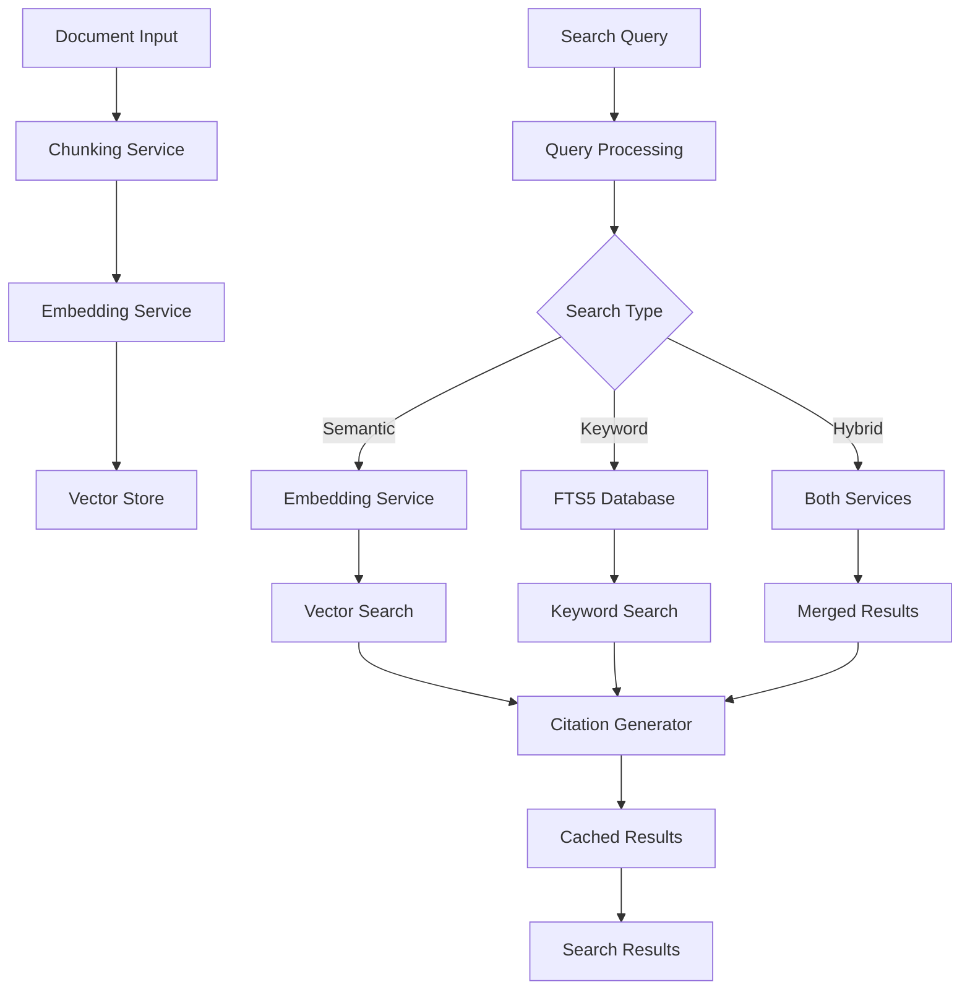

# RAG (Retrieval-Augmented Generation) Pipeline Design

## Table of Contents
1. [Overview](#overview)
2. [Architecture](#architecture)
3. [Core Components](#core-components)
4. [Data Flow](#data-flow)
5. [Architecture Decision Records (ADRs)](#architecture-decision-records-adrs)
6. [API Reference](#api-reference)
7. [Configuration](#configuration)
8. [Security Considerations](#security-considerations)
9. [Performance Optimizations](#performance-optimizations)
10. [Future Enhancements](#future-enhancements)

## Overview

The RAG (Retrieval-Augmented Generation) pipeline in tldw_chatbook provides a sophisticated system for indexing, searching, and retrieving relevant context to augment LLM responses. The implementation emphasizes security, performance, and extensibility while maintaining a clean, modular architecture.

### Key Features
- **Multi-modal Search**: Supports semantic, keyword (FTS5), and hybrid search modes
- **Citation Support**: Tracks source attribution with detailed citations
- **Scalable Architecture**: Handles large document collections with efficient chunking and indexing
- **Security-First Design**: Comprehensive input validation and SQL injection prevention
- **Performance Optimized**: Caching, connection pooling, and batch processing
- **Resilient Operations**: Circuit breakers, exponential backoff, and partial failure recovery

## Architecture

### High-Level Architecture

```
┌─────────────────────────────────────────────────────────────────┐
│                        Application Layer                         │
│  ┌─────────────┐  ┌──────────────┐  ┌────────────────────┐    │
│  │   UI/Chat   │  │   Ingestion  │  │  Search Interface  │    │
│  │   Windows   │  │    Windows    │  │    (RAG Search)    │    │
│  └──────┬──────┘  └──────┬───────┘  └────────┬───────────┘    │
│         │                 │                    │                 │
├─────────┴─────────────────┴────────────────────┴────────────────┤
│                        Event Bus (Textual)                       │
├──────────────────────────────────────────────────────────────────┤
│                      RAG Service Layer                           │
│  ┌─────────────────────────────────────────────────────────┐   │
│  │                    RAGService                            │   │
│  │  ┌─────────────┐  ┌──────────────┐  ┌───────────────┐  │   │
│  │  │  Indexing   │  │   Search     │  │    Cache      │  │   │
│  │  │  Pipeline   │  │   Engine     │  │   Manager     │  │   │
│  │  └─────────────┘  └──────────────┘  └───────────────┘  │   │
│  └─────────────────────────────────────────────────────────┘   │
├──────────────────────────────────────────────────────────────────┤
│                    Infrastructure Layer                          │
│  ┌──────────────┐  ┌───────────────┐  ┌──────────────────┐    │
│  │  Embeddings  │  │ Vector Store  │  │  Database Pool   │    │
│  │   Service    │  │  (ChromaDB)   │  │     (FTS5)       │    │
│  └──────────────┘  └───────────────┘  └──────────────────┘    │
└──────────────────────────────────────────────────────────────────┘
```

### Component Interactions



### Pipeline Architecture

The RAG system implements three distinct search pipelines, each optimized for different use cases and performance requirements:

#### 1. Plain RAG Pipeline (FTS5)
**Function**: `perform_plain_rag_search()`

Pure SQLite FTS5-based search without vector embeddings. Fastest option with good keyword matching.

**Characteristics**:
- Direct database queries using FTS5
- No embedding generation required
- Supports re-ranking with FlashRank
- Keyword filtering capabilities
- Low latency (~50-100ms)

**Use Cases**:
- Exact phrase matching
- Known keyword searches
- Low-latency requirements
- Systems without GPU access

#### 2. Full RAG Pipeline (Semantic)
**Function**: `perform_full_rag_pipeline()`

Vector embedding-based semantic search using the simplified RAG service.

**Characteristics**:
- Generates query embeddings
- Uses vector similarity search
- Supports ChromaDB or in-memory storage
- Configurable chunking strategies
- Medium latency (~200-500ms)

**Use Cases**:
- Conceptual searches
- Natural language queries
- Finding related content
- Research and exploration

#### 3. Hybrid RAG Pipeline
**Function**: `perform_hybrid_rag_search()`

Combines both FTS5 and vector search with configurable weighting.

**Characteristics**:
- Runs both pipelines in parallel
- Weighted result merging (BM25 + vector)
- Best of both approaches
- Higher latency (~300-600ms)

**Use Cases**:
- General-purpose search
- Mixed query types
- Maximum recall requirements
- Production systems

#### Pipeline Selection Logic

```python
# Pipeline selection based on search mode
if search_mode == "plain":
    results = await perform_plain_rag_search(...)
elif search_mode == "semantic":
    results = await perform_full_rag_pipeline(...)
elif search_mode == "hybrid":
    results = await perform_hybrid_rag_search(...)
```

#### Pipeline Performance Comparison

| Pipeline | Latency | Accuracy | Resource Usage | Best For |
|----------|---------|----------|----------------|----------|
| Plain | Low (50-100ms) | Good for keywords | Low | Exact matches |
| Semantic | Medium (200-500ms) | High for concepts | Medium-High | Natural queries |
| Hybrid | High (300-600ms) | Highest overall | High | General use |

### Enhanced Services Architecture

The RAG pipeline includes enhanced services that provide advanced functionality beyond the basic implementation:

#### Service Initialization Chain

```python
# Basic RAG Service Initialization
RAGService.__init__(config: Optional[RAGConfig] = None)
├── load_settings() → config.py
├── EmbeddingsServiceWrapper.__init__(
│   model_name: str,
│   cache_size: int = 2,
│   device: Optional[str] = None,
│   api_key: Optional[str] = None,
│   base_url: Optional[str] = None,
│   cache_dir: Optional[str] = None
│   ) → embeddings_wrapper.py
│   ├── _build_config() → Dict[str, Any]
│   ├── EmbeddingFactory.__init__() → Embeddings_Lib.py
│   └── CircuitBreaker.__init__() → circuit_breaker.py
├── create_vector_store(
│   vector_store_type: str,
│   collection_name: str,
│   persist_directory: Optional[str]
│   ) → vector_store.py
├── ChunkingService.__init__() → chunking_service.py
├── SimpleRAGCache.__init__(
│   max_size: int = 100,
│   ttl_seconds: float = 3600,
│   enabled: bool = True
│   ) → simple_cache.py
├── get_connection_pool() → db_connection_pool.py
└── ThreadPoolExecutor.__init__(max_workers=min(cpu_count * 2, 8))

# Enhanced RAG Service Initialization
EnhancedRAGService.__init__(config: Optional[RAGConfig] = None, enable_parent_retrieval: bool = True)
├── super().__init__(config) → RAGService.__init__()
├── EnhancedChunkingService.__init__() → enhanced_chunking_service.py
├── ParentDocumentRetriever.__init__() → parent_retriever.py
└── initialize_enhanced_features()
```

#### Enhanced Components

1. **EnhancedRAGService** (`enhanced_rag_service.py`)
   - Extends the base RAGService with advanced features
   - Supports parent document retrieval for better context
   - Implements hierarchical chunking strategies
   - Provides enhanced search capabilities with re-ranking

2. **EnhancedChunkingService** (`enhanced_chunking_service.py`)
   - Creates hierarchical chunks with structure preservation
   - Parses document structure (headers, lists, tables)
   - Cleans text artifacts from PDFs and other sources
   - Maintains parent-child relationships between chunks

3. **ParentDocumentRetriever** (`parent_retriever.py`)
   - Maps retrieval chunks to their parent documents
   - Fetches expanded context for better LLM responses
   - Manages parent-child chunk relationships
   - Optimizes context window usage

## Core Components

### 1. RAGService (`rag_service.py`)

The main orchestrator for all RAG operations.

**Key Responsibilities:**
- Document indexing pipeline coordination
- Search request routing and execution
- Cache management
- Metrics collection and reporting

**Design Decisions:**
- Single entry point for all RAG operations
- Async-first design for scalability
- Configurable through `RAGConfig`

### 2. Embeddings Service (`embeddings_wrapper.py`)

Wrapper around the existing embeddings library providing a simplified interface.

**Features:**
- Multi-provider support (HuggingFace, OpenAI, local models)
- Automatic device detection (CPU/CUDA/MPS)
- Circuit breaker protection for resilience
- Memory-efficient batch processing

**Key Methods:**
```python
async def create_embeddings_async(texts: List[str]) -> np.ndarray
def get_embedding_dimension() -> Optional[int]
```

### 3. Vector Store (`vector_store.py`)

Abstraction layer for vector storage with multiple implementations.

**Implementations:**
1. **ChromaVectorStore**: Persistent storage with ChromaDB
2. **InMemoryVectorStore**: Memory-based storage with LRU eviction

**Features:**
- Citation-aware search
- Metadata filtering
- Memory pressure detection
- Collection management

### 4. Search Engine

Implements three search modes:

#### Semantic Search
- Uses vector embeddings for similarity matching
- Configurable score thresholds
- Supports metadata filtering

#### Keyword Search (FTS5)
- SQLite FTS5 full-text search
- SQL injection prevention
- Connection pooling for performance

#### Hybrid Search
- Combines semantic and keyword results
- Configurable weighting (alpha parameter)
- Duplicate removal with citation merging

### 5. Chunking Service (`chunking_service.py`)

Intelligent document chunking with multiple strategies:
- **Word-based**: Respects word boundaries
- **Sentence-based**: Maintains sentence integrity
- **Paragraph-based**: Preserves paragraph structure

**Parameters:**
- `chunk_size`: Target chunk size
- `chunk_overlap`: Overlap between chunks
- `min_chunk_size`: Minimum viable chunk
- `max_chunk_size`: Maximum chunk size

### 6. Citation System (`citations.py`)

Comprehensive citation tracking for source attribution.

**Citation Types:**
- `EXACT`: Direct keyword matches
- `SEMANTIC`: Similarity-based matches
- `KEYWORD`: FTS5 search matches

**Citation Data:**
```python
@dataclass
class Citation:
    document_id: str
    document_title: str
    chunk_id: str
    text: str
    start_char: int
    end_char: int
    confidence: float
    match_type: CitationType
    metadata: Dict[str, Any]
```

### 7. Cache System (`simple_cache.py`)

LRU cache with TTL support for search results.

**Features:**
- Async-safe operations
- Search-type specific TTLs
- Memory-aware sizing
- Detailed metrics

### 8. Database Connection Pool (`db_connection_pool.py`)

Thread-safe SQLite connection pooling.

**Features:**
- Automatic transaction management
- Connection health checking
- WAL mode for concurrency
- Configurable pool sizes

### 9. Circuit Breaker (`circuit_breaker.py`)

Fault tolerance for external service calls.

**States:**
- `CLOSED`: Normal operation
- `OPEN`: Service unavailable, failing fast
- `HALF_OPEN`: Testing recovery

**Features:**
- Exponential backoff
- Configurable thresholds
- Automatic recovery testing

### 10. Enhanced Services

#### EnhancedRAGService (`enhanced_rag_service.py`)

Advanced RAG implementation with hierarchical retrieval.

**Key Features:**
- Parent document retrieval for expanded context
- Enhanced chunking with structure preservation
- Advanced re-ranking capabilities
- Backward compatible with base RAGService

**Methods:**
```python
async def index_document_enhanced(
    doc_id: str,
    content: str,
    metadata: Optional[Dict[str, Any]] = None
) -> IndexingResult

async def search_enhanced(
    query: str,
    top_k: int = 10,
    search_type: str = "semantic",
    enable_parent_retrieval: bool = True
) -> List[SearchResultWithCitations]
```

#### EnhancedChunkingService (`enhanced_chunking_service.py`)

Intelligent chunking with document structure understanding.

**Features:**
- Hierarchical chunk creation
- Structure parsing (headers, lists, tables)
- PDF artifact cleaning
- Maintains semantic boundaries

**Key Methods:**
```python
def create_hierarchical_chunks(
    text: str,
    options: ChunkingOptions
) -> List[Chunk]

def parse_document_structure(text: str) -> DocumentStructure
```

#### ParentDocumentRetriever (`parent_retriever.py`)

Manages parent-child relationships for context expansion.

**Features:**
- Retrieval chunk to parent mapping
- Context window optimization
- Efficient parent document fetching
- Metadata preservation

### 11. Supporting Utilities

#### Indexing Helpers (`indexing_helpers.py`)

Batch processing utilities for efficient indexing.

**Functions:**
- `chunk_documents_batch()`: Parallel document chunking
- `generate_embeddings_batch()`: Batch embedding creation
- `store_documents_batch()`: Bulk vector storage

## Data Flow

### Document Indexing Pipeline

1. **Document Input**
   - Validation (size limits, format checks)
   - Metadata extraction

2. **Chunking**
   - Split into overlapping chunks
   - Preserve context boundaries
   - Track chunk positions

3. **Embedding Generation**
   - Batch processing with retry logic
   - Partial failure recovery
   - Circuit breaker protection

4. **Storage**
   - Vector embeddings in ChromaDB/memory
   - Metadata for citation tracking
   - Update indexing statistics

### Search Pipeline

1. **Query Processing**
   - Input validation and sanitization
   - Query length limits
   - Cache lookup

2. **Search Execution**
   - Route to appropriate search type
   - Apply filters and thresholds
   - Generate embeddings if needed

3. **Result Processing**
   - Score-based filtering
   - Citation generation
   - Result deduplication

4. **Caching**
   - Store results with TTL
   - Track cache metrics

### Enhanced Document Indexing Flow

1. **Document Analysis**
   - Structure parsing (headers, lists, tables)
   - Content type detection
   - Metadata extraction

2. **Hierarchical Chunking**
   - Create parent documents (larger context)
   - Create retrieval chunks (smaller, focused)
   - Maintain parent-child relationships
   - Clean text artifacts

3. **Dual Storage**
   - Store parent documents for context
   - Store retrieval chunks with embeddings
   - Link chunks to parents
   - Update relationship mappings

### Enhanced Search Flow

1. **Initial Retrieval**
   - Standard search execution
   - Get top matching chunks

2. **Parent Expansion**
   - Map chunks to parent documents
   - Fetch parent contexts
   - Merge overlapping content

3. **Re-ranking**
   - Apply cross-encoder models (if enabled)
   - Score based on expanded context
   - Filter by relevance thresholds

4. **Context Assembly**
   - Combine retrieval and parent chunks
   - Optimize for LLM context window
   - Preserve citation tracking

## Detailed Function Call Chains

### Document Indexing Function Chain

```python
async index_document(
    doc_id: str,
    content: str,
    title: Optional[str] = None,
    metadata: Optional[Dict[str, Any]] = None,
    chunk_size: Optional[int] = None,
    chunk_overlap: Optional[int] = None,
    chunking_method: Optional[str] = None
) → IndexingResult
├── Input validation
├── _chunk_document() → List[Dict[str, Any]]
│   └── ChunkingService.chunk_text() [via ThreadPoolExecutor]
│       └── chunk_text_by_words() or chunk_text_by_sentences()
├── _create_embeddings_batch() → np.ndarray
│   └── EmbeddingsServiceWrapper.create_embeddings()
│       ├── _circuit_breaker.call_sync()
│       └── EmbeddingFactory.embed()
├── _add_to_vector_store()
│   └── VectorStore.add()
│       ├── ChromaVectorStore.add() [if ChromaDB]
│       └── InMemoryVectorStore.add() [if memory]
└── return IndexingResult
```

### Enhanced Document Indexing

```python
async index_document_enhanced(
    doc_id: str,
    content: str,
    metadata: Optional[Dict[str, Any]] = None
) → IndexingResult
├── EnhancedChunkingService.create_hierarchical_chunks()
│   ├── parse_document_structure()
│   ├── clean_text_artifacts()
│   └── create_chunks_with_hierarchy()
├── ParentDocumentRetriever.create_parent_child_mappings()
├── Generate embeddings for retrieval chunks
├── Store both parent and retrieval chunks
└── return enhanced IndexingResult
```

### Search Function Chain

```python
async search(
    query: str,
    top_k: Optional[int] = None,
    search_type: Literal["semantic", "hybrid", "keyword"] = "semantic",
    filter_metadata: Optional[Dict[str, Any]] = None,
    include_citations: Optional[bool] = None,
    score_threshold: Optional[float] = None
) → Union[List[SearchResult], List[SearchResultWithCitations]]
├── Check cache → SimpleRAGCache.get()
├── Process query based on search_type:
│   ├── _search_semantic() [if "semantic"]
│   │   ├── Create query embedding
│   │   └── VectorStore.search()
│   ├── _search_keyword() [if "keyword"]
│   │   └── Search FTS5 database
│   └── _search_hybrid() [if "hybrid"]
│       ├── _search_semantic()
│       ├── _search_keyword()
│       └── Merge and re-rank results
├── _add_citations() [if include_citations]
├── Cache results → SimpleRAGCache.put()
└── return results
```

### Semantic Search Detail

```python
async _search_semantic(
    query: str,
    top_k: int,
    filter_metadata: Optional[Dict[str, Any]] = None
) → List[SearchResult]
├── Create query embedding
│   └── EmbeddingsServiceWrapper.create_embedding()
├── VectorStore.search()
│   ├── ChromaVectorStore.search() [if ChromaDB]
│   │   └── collection.query()
│   └── InMemoryVectorStore.search() [if memory]
│       ├── _compute_similarity() for each embedding
│       └── Sort by score and return top_k
└── Convert to SearchResult objects
```

### Enhanced Search with Parent Retrieval

```python
async search_enhanced(
    query: str,
    top_k: int = 10,
    search_type: str = "semantic",
    enable_parent_retrieval: bool = True
) → List[SearchResultWithCitations]
├── Perform base search → super().search()
├── If enable_parent_retrieval:
│   └── ParentDocumentRetriever.retrieve_parent_contexts()
│       ├── Map chunk IDs to parent IDs
│       ├── Fetch parent documents
│       └── Merge context
├── Apply re-ranking if enabled
└── return enhanced results
```

### UI Integration Flow

```python
SearchRAGWindow.on_search_button_pressed()
└── _perform_search()
    ├── perform_plain_rag_search() → chat_rag_events.py
    │   ├── Get or create RAG service
    │   ├── Search each source database (FTS5)
    │   ├── Apply re-ranking if enabled
    │   └── Format results
    ├── perform_full_rag_pipeline() → chat_rag_events.py
    │   ├── Get or create RAG service
    │   ├── Perform semantic search → RAGService.search()
    │   ├── Apply query expansion if enabled
    │   ├── Re-rank results
    │   └── Format with citations
    └── perform_hybrid_rag_search() → chat_rag_events.py
        ├── Get or create RAG service
        ├── Perform hybrid search → RAGService.search(search_type="hybrid")
        ├── Apply advanced filtering
        └── Format results
```

## Architecture Decision Records (ADRs)

### ADR-001: Simplified RAG Architecture

**Status**: Accepted  
**Date**: 2024-01-10

**Context**: The original RAG implementation was overly complex with multiple abstraction layers that made it difficult to maintain and debug.

**Decision**: Create a simplified architecture with:
- Single RAGService as the main entry point
- Direct integration with existing services
- Minimal abstraction layers

**Consequences**:
- ✅ Easier to understand and maintain
- ✅ Better performance with fewer layers
- ✅ Simpler debugging and testing
- ⚠️ Less flexibility for swapping components

### ADR-002: Hybrid Search Implementation

**Status**: Accepted  
**Date**: 2024-01-10

**Context**: Users need both precise keyword matching and semantic understanding.

**Decision**: Implement three search modes:
1. Semantic (vector similarity)
2. Keyword (FTS5)
3. Hybrid (weighted combination)

**Consequences**:
- ✅ Better search accuracy
- ✅ User choice in search strategy
- ⚠️ Increased complexity
- ⚠️ Need to maintain two search indices

### ADR-003: Citation System Design

**Status**: Accepted  
**Date**: 2024-01-10

**Context**: Users need to verify information sources for trust and compliance.

**Decision**: Implement comprehensive citation tracking with:
- Multiple citation types (exact, semantic, keyword)
- Character-level position tracking
- Confidence scores

**Consequences**:
- ✅ Full source attribution
- ✅ Regulatory compliance support
- ⚠️ Increased storage requirements
- ⚠️ Additional processing overhead

### ADR-004: Security-First Query Processing

**Status**: Accepted  
**Date**: 2024-01-10

**Context**: RAG systems are vulnerable to injection attacks and path traversal.

**Decision**: Implement multiple security layers:
- FTS5 query escaping with phrase syntax
- Path validation with symlink detection
- Query length limits
- Input sanitization

**Consequences**:
- ✅ Protection against SQL injection
- ✅ Path traversal prevention
- ⚠️ Some FTS5 features unavailable
- ⚠️ Slight performance overhead

### ADR-005: Memory-Aware Vector Store

**Status**: Accepted  
**Date**: 2024-01-10

**Context**: In-memory vector stores can consume excessive memory.

**Decision**: Implement memory pressure detection with:
- Process and system memory monitoring
- Automatic LRU eviction
- Configurable thresholds

**Consequences**:
- ✅ Prevents out-of-memory crashes
- ✅ Graceful degradation
- ⚠️ Potential cache misses
- ⚠️ Monitoring overhead

### ADR-006: Partial Failure Recovery

**Status**: Accepted  
**Date**: 2024-01-10

**Context**: Batch embedding generation can fail for individual items.

**Decision**: Implement retry logic with:
- Individual item retry after batch failure
- Zero embeddings as fallback
- Detailed failure tracking

**Consequences**:
- ✅ Higher success rates
- ✅ Graceful degradation
- ⚠️ Increased complexity
- ⚠️ Potential performance impact

### ADR-007: Configuration Profiles and A/B Testing

**Status**: Accepted  
**Date**: 2024-01-15

**Context**: Different use cases require different RAG configurations, and we need a way to test and optimize these configurations systematically.

**Decision**: Implement a profile-based configuration system with:
- Pre-defined profiles for common use cases
- Custom profile creation capability
- Built-in A/B testing framework
- Deterministic user assignment for consistent testing
- Comprehensive metrics tracking

**Technical Approach**:
1. **Profile System**: Encapsulate all RAG configurations in ProfileConfig objects
2. **Traffic Splitting**: Use MD5 hash of user ID for deterministic assignment
3. **Metrics Collection**: Track latency, accuracy, and user satisfaction per profile
4. **Experiment Management**: Full lifecycle from setup to analysis

**Consequences**:
- ✅ Easy configuration for different use cases
- ✅ Data-driven optimization possible
- ✅ Consistent user experience during tests
- ✅ Reduced configuration complexity
- ⚠️ Additional storage for experiment data
- ⚠️ Overhead of profile management
- ⚠️ Need for careful experiment design

## API Reference

### RAGService API

#### Document Indexing

```python
async def index_document(
    doc_id: str,
    content: str,
    title: Optional[str] = None,
    metadata: Optional[Dict[str, Any]] = None,
    chunk_size: Optional[int] = None,
    chunk_overlap: Optional[int] = None,
    chunking_method: Optional[str] = None
) -> IndexingResult
```

#### Batch Indexing

```python
async def index_batch_optimized(
    documents: List[Dict[str, Any]],
    show_progress: bool = True,
    batch_size: int = 32
) -> List[IndexingResult]
```

#### Search

```python
async def search(
    query: str,
    top_k: Optional[int] = None,
    search_type: Literal["semantic", "hybrid", "keyword"] = "semantic",
    filter_metadata: Optional[Dict[str, Any]] = None,
    include_citations: Optional[bool] = None,
    score_threshold: Optional[float] = None
) -> Union[List[SearchResult], List[SearchResultWithCitations]]
```

### Enhanced API

#### Enhanced Document Indexing

```python
async def index_document_enhanced(
    doc_id: str,
    content: str,
    metadata: Optional[Dict[str, Any]] = None
) -> IndexingResult
```

Creates hierarchical chunks with parent-child relationships for better context retrieval.

#### Enhanced Search

```python
async def search_enhanced(
    query: str,
    top_k: int = 10,
    search_type: str = "semantic",
    enable_parent_retrieval: bool = True
) -> List[SearchResultWithCitations]
```

Performs search with optional parent document retrieval for expanded context.

### Supporting Services API

#### EmbeddingsServiceWrapper

```python
async def create_embeddings_async(texts: List[str]) -> np.ndarray
def create_embeddings(texts: List[str]) -> np.ndarray
def create_embedding(text: str) -> np.ndarray
def get_embedding_dimension() -> Optional[int]
def get_memory_usage() -> Dict[str, float]
```

#### ChunkingService

```python
def chunk_text(
    text: str,
    chunk_size: int = 400,
    chunk_overlap: int = 100,
    method: str = "words",
    min_chunk_size: Optional[int] = None,
    max_chunk_size: Optional[int] = None
) -> List[Dict[str, Any]]
```

#### EnhancedChunkingService

```python
def create_hierarchical_chunks(
    text: str,
    options: ChunkingOptions
) -> List[Chunk]

def parse_document_structure(text: str) -> DocumentStructure
def clean_text_artifacts(text: str) -> str
def serialize_table_to_text(table_data: Dict) -> str
```

### Pipeline API

#### Plain RAG Pipeline

```python
async def perform_plain_rag_search(
    app: "TldwCli",
    query: str,
    sources: Dict[str, bool],
    top_k: int = 5,
    max_context_length: int = 10000,
    enable_rerank: bool = True,
    reranker_model: str = "flashrank",
    keyword_filter_list: Optional[List[str]] = None
) -> Tuple[List[Dict[str, Any]], str]
```

#### Full RAG Pipeline

```python
async def perform_full_rag_pipeline(
    app: "TldwCli",
    query: str,
    sources: Dict[str, bool],
    top_k: int = 5,
    max_context_length: int = 10000,
    chunk_size: int = 400,
    chunk_overlap: int = 100,
    chunk_type: str = "words",
    include_metadata: bool = True,
    enable_rerank: bool = True,
    reranker_model: str = "flashrank",
    keyword_filter_list: Optional[List[str]] = None
) -> Tuple[List[Dict[str, Any]], str]
```

#### Hybrid RAG Pipeline

```python
async def perform_hybrid_rag_search(
    app: "TldwCli",
    query: str,
    sources: Dict[str, bool],
    top_k: int = 5,
    max_context_length: int = 10000,
    enable_rerank: bool = True,
    reranker_model: str = "flashrank",
    chunk_size: int = 400,
    chunk_overlap: int = 100,
    chunk_type: str = "words",
    bm25_weight: float = 0.5,
    vector_weight: float = 0.5,
    keyword_filter_list: Optional[List[str]] = None
) -> Tuple[List[Dict[str, Any]], str]
```

### Profile Management API

#### ConfigProfileManager

```python
class ConfigProfileManager:
    def get_profile(self, name: str) -> Optional[ProfileConfig]
    def list_profiles(self) -> List[str]
    def create_custom_profile(
        self,
        name: str,
        base_profile: str = "balanced",
        **overrides
    ) -> ProfileConfig
    def validate_profile(self, profile: ProfileConfig) -> List[str]
```

#### Experiment Management

```python
def start_experiment(self, config: ExperimentConfig) -> None
def select_profile_for_experiment(
    self, 
    user_id: Optional[str] = None
) -> Tuple[str, ProfileConfig]
def record_experiment_result(
    self,
    profile_name: str,
    query: str,
    metrics: Dict[str, Any]
) -> None
def end_experiment(self) -> Dict[str, Any]
```

### Configuration API

```python
@dataclass
class RAGConfig:
    embedding: EmbeddingConfig
    vector_store: VectorStoreConfig
    chunking: ChunkingConfig
    search: SearchConfig
    query_expansion: QueryExpansionConfig
```

## Configuration

### Example Configuration (TOML)

```toml
[AppRAGSearchConfig.rag]

# Embedding configuration
[AppRAGSearchConfig.rag.embedding]
model = "mxbai-embed-large-v1"
device = "auto"  # auto, cpu, cuda, mps
cache_size = 2
batch_size = 16

# Vector store configuration
[AppRAGSearchConfig.rag.vector_store]
type = "chroma"  # or "memory"
persist_directory = "~/.local/share/tldw_cli/chromadb"
collection_name = "default"
distance_metric = "cosine"  # or "l2", "ip"

# Chunking configuration
[AppRAGSearchConfig.rag.chunking]
chunk_size = 400
chunk_overlap = 100
method = "words"  # or "sentences", "paragraphs"

# Search configuration
[AppRAGSearchConfig.rag.search]
default_top_k = 10
score_threshold = 0.0
include_citations = true
default_search_mode = "semantic"
cache_size = 100
cache_ttl = 3600
# Search-type specific cache TTLs
semantic_cache_ttl = 7200  # 2 hours
keyword_cache_ttl = 1800   # 30 minutes
hybrid_cache_ttl = 3600    # 1 hour
fts5_connection_pool_size = 3
```

### Environment Variables

- `RAG_EMBEDDING_MODEL`: Override embedding model
- `RAG_DEVICE`: Force specific device (cpu/cuda/mps)
- `RAG_PERSIST_DIR`: Override vector store directory
- `RAG_SEARCH_MODE`: Default search mode
- `OPENAI_API_KEY`: API key for OpenAI embeddings

## Security Considerations

### Input Validation

1. **Query Sanitization**
   - FTS5 queries wrapped in phrase syntax
   - Special characters escaped
   - Length limits enforced

2. **Path Validation**
   - Base directory restrictions
   - Symlink detection
   - Path traversal prevention

3. **SQL Injection Prevention**
   - Parameterized queries only
   - Identifier validation
   - Connection pooling with transactions

### Resource Limits

1. **Document Size**: Configurable limit (default 10MB)
2. **Query Length**: Maximum 1000 characters
3. **Result Limits**: Maximum 1000 results per search
4. **Memory Limits**: Automatic eviction on pressure

## Performance Optimizations

### Caching Strategy

1. **Multi-Level Caching**
   - Embedding cache (model-level)
   - Search result cache (query-level)
   - Connection pool cache (database-level)

2. **Cache Configuration**
   - LRU eviction policy
   - TTL-based expiration
   - Search-type specific TTLs

### Batch Processing

1. **Document Indexing**
   - Chunking in parallel
   - Batch embedding generation
   - Bulk vector storage

2. **Failure Recovery**
   - Individual retry on batch failure
   - Partial success tracking
   - Graceful degradation

### Connection Management

1. **Database Pooling**
   - Thread-safe connection pools
   - Automatic health checking
   - Transaction support

2. **Circuit Breakers**
   - Prevent cascade failures
   - Exponential backoff
   - Automatic recovery

### Memory Management

1. **Vector Store**
   - LRU eviction
   - Memory pressure detection
   - Configurable thresholds

2. **Embedding Service**
   - Model caching
   - Batch size optimization
   - Memory monitoring

## Configuration Profiles and A/B Testing

### Profile System Architecture

The RAG system includes a comprehensive configuration profile system that enables:
- Pre-configured settings for different use cases
- Custom profile creation
- A/B testing capabilities
- Performance tracking and optimization

#### Built-in Profiles

1. **fast_search**
   - Model: `all-MiniLM-L6-v2` (smaller, faster)
   - Chunk size: 256 words
   - Optimized for <100ms latency

2. **high_accuracy**
   - Model: `BAAI/bge-large-en-v1.5` (larger, more accurate)
   - Chunk size: 512 words
   - Includes re-ranking with GPT-3.5
   - Optimized for >95% accuracy

3. **balanced**
   - Model: `sentence-transformers/all-mpnet-base-v2`
   - Chunk size: 384 words
   - Balance between speed and accuracy

4. **long_context**
   - Chunk size: 1024 words
   - Parent document retrieval enabled
   - For documents requiring extended context

5. **technical_docs**
   - Structural chunking method
   - Preserves tables and code blocks
   - PDF artifact cleaning

6. **research_papers**
   - Model: `allenai-specter` (scientific text)
   - Hierarchical chunking
   - Citation preservation

7. **code_search**
   - Model: `microsoft/codebert-base`
   - Smaller chunks (256 words)
   - Code structure preservation

#### Profile Configuration Structure

```python
@dataclass
class ProfileConfig:
    name: str
    description: str
    profile_type: ProfileType
    rag_config: RAGConfig
    reranking_config: Optional[RerankingConfig]
    processing_config: Optional[ProcessingConfig]
    expected_latency_ms: Optional[float]
    expected_accuracy: Optional[float]
    tags: List[str]
```

### A/B Testing Framework

#### Experiment Configuration

```python
@dataclass
class ExperimentConfig:
    experiment_id: str
    name: str
    description: str
    enable_ab_testing: bool
    control_profile: str
    test_profiles: List[str]
    traffic_split: Dict[str, float]  # Profile -> percentage
    track_metrics: bool
    metrics_to_track: List[str]
    save_results: bool
    results_dir: Optional[Path]
```

#### Traffic Splitting

The system uses deterministic user assignment based on user ID hashing:

```python
def select_profile_for_experiment(user_id: Optional[str]) -> Tuple[str, ProfileConfig]:
    if user_id:
        hash_val = int(hashlib.md5(user_id.encode()).hexdigest(), 16)
        rand_val = (hash_val % 100) / 100.0
    else:
        rand_val = random.random()
    
    # Select profile based on traffic split percentages
    cumulative = 0.0
    for profile_name, percentage in traffic_split.items():
        cumulative += percentage
        if rand_val < cumulative:
            return profile_name, get_profile(profile_name)
```

#### Metrics Collection

Tracked metrics include:
- **search_latency**: End-to-end search time
- **retrieval_accuracy**: Relevance of results
- **reranking_improvement**: Score improvement from re-ranking
- **user_satisfaction**: User feedback signals
- **context_quality**: Quality of retrieved context

#### Experiment Lifecycle

1. **Start Experiment**
   ```python
   manager.start_experiment(ExperimentConfig(
       name="Accuracy vs Speed Test",
       control_profile="balanced",
       test_profiles=["fast_search", "high_accuracy"],
       traffic_split={"balanced": 0.5, "fast_search": 0.25, "high_accuracy": 0.25}
   ))
   ```

2. **Run Searches**
   - Automatic profile selection based on user/session
   - Metrics recorded for each query
   - Real-time performance tracking

3. **Analyze Results**
   ```python
   summary = manager.end_experiment()
   # Returns statistics per profile:
   # - Mean/min/max for each metric
   # - Query counts
   # - Performance comparisons
   ```

### Profile Validation

The system validates profiles for:
- Model availability
- Configuration consistency
- Resource requirements
- Performance expectations

```python
warnings = manager.validate_profile(profile)
# Returns list of warnings/errors
```

## Creating and Modifying RAG Pipelines

### Pipeline Architecture Overview

RAG pipelines are implemented as async functions that orchestrate the search process. Each pipeline follows a common pattern:

1. **Input validation and sanitization**
2. **Query processing**
3. **Search execution**
4. **Result post-processing**
5. **Caching and metrics**

### Creating a Custom Pipeline

#### 1. Basic Pipeline Template

```python
from typing import List, Dict, Any, Tuple, Optional
from tldw_chatbook.RAG_Search.simplified import get_or_create_rag_service
from loguru import logger

async def perform_custom_rag_pipeline(
    app: "TldwCli",
    query: str,
    sources: Dict[str, bool],
    top_k: int = 5,
    max_context_length: int = 10000,
    # Add your custom parameters
    custom_param: str = "default",
    **kwargs
) -> Tuple[List[Dict[str, Any]], str]:
    """
    Custom RAG pipeline implementation.
    
    Returns:
        Tuple of (results, formatted_context)
    """
    try:
        # 1. Input validation
        if not query or not query.strip():
            return [], ""
        
        # 2. Initialize services
        rag_service = await get_or_create_rag_service(app)
        
        # 3. Custom query processing
        processed_query = await preprocess_query(query, custom_param)
        
        # 4. Execute search
        results = await rag_service.search(
            query=processed_query,
            top_k=top_k,
            search_type="semantic",  # or your custom logic
            include_citations=True
        )
        
        # 5. Custom post-processing
        filtered_results = await postprocess_results(results, custom_param)
        
        # 6. Format context
        context = format_results_for_llm(filtered_results, max_context_length)
        
        return filtered_results, context
        
    except Exception as e:
        logger.error(f"Custom pipeline failed: {e}")
        # Fallback to basic search
        return await perform_plain_rag_search(app, query, sources, top_k)
```

#### 2. Advanced Pipeline with Multiple Strategies

```python
async def perform_adaptive_rag_pipeline(
    app: "TldwCli",
    query: str,
    sources: Dict[str, bool],
    top_k: int = 5,
    **kwargs
) -> Tuple[List[Dict[str, Any]], str]:
    """
    Adaptive pipeline that selects strategy based on query analysis.
    """
    # Analyze query characteristics
    query_features = analyze_query(query)
    
    if query_features["is_technical"]:
        # Use technical documentation profile
        profile = get_profile_manager().get_profile("technical_docs")
        strategy = "structural"
    elif query_features["is_question"]:
        # Use semantic search with query expansion
        profile = get_profile_manager().get_profile("high_accuracy")
        strategy = "semantic_expanded"
    else:
        # Default strategy
        profile = get_profile_manager().get_profile("balanced")
        strategy = "hybrid"
    
    # Apply profile configuration
    rag_service = await get_or_create_rag_service(app, config=profile.rag_config)
    
    # Execute strategy-specific search
    if strategy == "semantic_expanded":
        # Expand query using LLM
        expanded_queries = await expand_query_with_llm(query)
        all_results = []
        
        for eq in expanded_queries:
            results = await rag_service.search(eq, top_k=top_k//len(expanded_queries))
            all_results.extend(results)
        
        # Deduplicate and re-rank
        final_results = deduplicate_and_rerank(all_results, query)
    else:
        final_results = await rag_service.search(query, top_k=top_k, search_type=strategy)
    
    return final_results, format_results_for_llm(final_results)
```

### Modifying Existing Pipelines

#### 1. Pipeline Decorator Pattern

Create decorators to modify pipeline behavior without changing core logic:

```python
from functools import wraps
import time

def with_performance_tracking(pipeline_func):
    """Decorator to add performance tracking to any pipeline."""
    @wraps(pipeline_func)
    async def wrapper(*args, **kwargs):
        start_time = time.time()
        
        try:
            results, context = await pipeline_func(*args, **kwargs)
            
            # Track metrics
            latency = (time.time() - start_time) * 1000
            log_histogram("pipeline_latency", latency, 
                         labels={"pipeline": pipeline_func.__name__})
            
            # Add performance data to results
            for result in results:
                result["_pipeline_latency_ms"] = latency
            
            return results, context
            
        except Exception as e:
            log_counter("pipeline_error", 
                       labels={"pipeline": pipeline_func.__name__, "error": str(e)})
            raise
    
    return wrapper

# Apply to existing pipeline
@with_performance_tracking
async def perform_enhanced_semantic_search(*args, **kwargs):
    return await perform_full_rag_pipeline(*args, **kwargs)
```

#### 2. Pipeline Middleware

Implement middleware to intercept and modify pipeline behavior:

```python
class PipelineMiddleware:
    """Base class for pipeline middleware."""
    
    async def before_search(self, query: str, config: Dict[str, Any]) -> Tuple[str, Dict[str, Any]]:
        """Called before search execution."""
        return query, config
    
    async def after_search(self, results: List[SearchResult]) -> List[SearchResult]:
        """Called after search execution."""
        return results
    
    async def on_error(self, error: Exception) -> Optional[List[SearchResult]]:
        """Called on pipeline error. Can return fallback results."""
        return None

class QueryExpansionMiddleware(PipelineMiddleware):
    """Expands queries with synonyms and related terms."""
    
    async def before_search(self, query: str, config: Dict[str, Any]) -> Tuple[str, Dict[str, Any]]:
        # Add synonyms to query
        expanded = await expand_with_synonyms(query)
        return expanded, config

class ResultFilterMiddleware(PipelineMiddleware):
    """Filters results based on custom criteria."""
    
    def __init__(self, min_score: float = 0.5):
        self.min_score = min_score
    
    async def after_search(self, results: List[SearchResult]) -> List[SearchResult]:
        return [r for r in results if r.score >= self.min_score]

# Pipeline with middleware
async def perform_pipeline_with_middleware(
    app: "TldwCli",
    query: str,
    middleware: List[PipelineMiddleware] = None,
    **kwargs
) -> Tuple[List[Dict[str, Any]], str]:
    """Execute pipeline with middleware chain."""
    
    middleware = middleware or []
    config = kwargs.copy()
    
    # Apply before_search middleware
    for mw in middleware:
        query, config = await mw.before_search(query, config)
    
    try:
        # Execute base pipeline
        results, context = await perform_full_rag_pipeline(app, query, **config)
        
        # Apply after_search middleware
        for mw in middleware:
            results = await mw.after_search(results)
        
        return results, context
        
    except Exception as e:
        # Try middleware error handlers
        for mw in middleware:
            fallback = await mw.on_error(e)
            if fallback:
                return fallback, format_results_for_llm(fallback)
        raise
```

#### 3. Pipeline Composition

Combine multiple pipelines for sophisticated search strategies:

```python
async def perform_ensemble_pipeline(
    app: "TldwCli",
    query: str,
    sources: Dict[str, bool],
    ensemble_config: Dict[str, float] = None,
    **kwargs
) -> Tuple[List[Dict[str, Any]], str]:
    """
    Ensemble pipeline that combines multiple search strategies.
    
    Args:
        ensemble_config: Dict mapping pipeline names to weights
    """
    ensemble_config = ensemble_config or {
        "plain": 0.2,
        "semantic": 0.5,
        "hybrid": 0.3
    }
    
    all_results = []
    
    # Run pipelines in parallel
    tasks = []
    
    if "plain" in ensemble_config:
        tasks.append(("plain", perform_plain_rag_search(app, query, sources, **kwargs)))
    
    if "semantic" in ensemble_config:
        tasks.append(("semantic", perform_full_rag_pipeline(app, query, sources, **kwargs)))
    
    if "hybrid" in ensemble_config:
        tasks.append(("hybrid", perform_hybrid_rag_search(app, query, sources, **kwargs)))
    
    # Gather results
    pipeline_results = await asyncio.gather(*[task[1] for task in tasks], return_exceptions=True)
    
    # Combine results with weighting
    weighted_results = []
    
    for (pipeline_name, _), (results, _) in zip(tasks, pipeline_results):
        if isinstance(results, Exception):
            logger.error(f"Pipeline {pipeline_name} failed: {results}")
            continue
        
        weight = ensemble_config[pipeline_name]
        for result in results:
            result["_original_score"] = result.get("score", 0)
            result["_pipeline"] = pipeline_name
            result["score"] = result["_original_score"] * weight
            weighted_results.append(result)
    
    # Sort by weighted score and deduplicate
    final_results = deduplicate_and_sort(weighted_results)
    
    return final_results[:kwargs.get("top_k", 10)], format_results_for_llm(final_results)
```

### Pipeline Registration and Discovery

#### 1. Pipeline Registry

```python
class PipelineRegistry:
    """Registry for custom RAG pipelines."""
    
    _pipelines: Dict[str, Callable] = {}
    _metadata: Dict[str, Dict[str, Any]] = {}
    
    @classmethod
    def register(cls, 
                 name: str, 
                 description: str = "",
                 tags: List[str] = None,
                 config_schema: Dict[str, Any] = None):
        """Decorator to register a pipeline."""
        def decorator(func):
            cls._pipelines[name] = func
            cls._metadata[name] = {
                "description": description,
                "tags": tags or [],
                "config_schema": config_schema or {},
                "function": func.__name__
            }
            return func
        return decorator
    
    @classmethod
    def get_pipeline(cls, name: str) -> Optional[Callable]:
        """Get pipeline by name."""
        return cls._pipelines.get(name)
    
    @classmethod
    def list_pipelines(cls) -> List[Dict[str, Any]]:
        """List all registered pipelines."""
        return [
            {"name": name, **metadata}
            for name, metadata in cls._metadata.items()
        ]

# Register custom pipeline
@PipelineRegistry.register(
    name="medical_search",
    description="Specialized pipeline for medical document search",
    tags=["medical", "specialized"],
    config_schema={
        "require_citations": {"type": "boolean", "default": True},
        "medical_terms_boost": {"type": "number", "default": 2.0}
    }
)
async def perform_medical_search_pipeline(app, query, sources, **kwargs):
    # Custom medical search implementation
    pass
```

#### 2. Dynamic Pipeline Selection

```python
async def perform_auto_pipeline(
    app: "TldwCli",
    query: str,
    sources: Dict[str, bool],
    **kwargs
) -> Tuple[List[Dict[str, Any]], str]:
    """Automatically select and execute the best pipeline for the query."""
    
    # Get all registered pipelines
    available_pipelines = PipelineRegistry.list_pipelines()
    
    # Score pipelines based on query characteristics
    pipeline_scores = {}
    
    for pipeline in available_pipelines:
        score = 0
        
        # Check tag matches
        query_tags = extract_query_tags(query)
        for tag in pipeline["tags"]:
            if tag in query_tags:
                score += 1
        
        # Check configuration compatibility
        if can_satisfy_config(kwargs, pipeline["config_schema"]):
            score += 0.5
        
        pipeline_scores[pipeline["name"]] = score
    
    # Select best pipeline
    best_pipeline = max(pipeline_scores, key=pipeline_scores.get)
    pipeline_func = PipelineRegistry.get_pipeline(best_pipeline)
    
    logger.info(f"Auto-selected pipeline: {best_pipeline}")
    
    return await pipeline_func(app, query, sources, **kwargs)
```

### Testing Custom Pipelines

```python
import pytest
from unittest.mock import Mock, AsyncMock

@pytest.mark.asyncio
async def test_custom_pipeline():
    """Test custom pipeline implementation."""
    
    # Mock app and services
    mock_app = Mock()
    mock_rag_service = AsyncMock()
    mock_rag_service.search.return_value = [
        {"content": "Test result", "score": 0.9}
    ]
    
    with patch("tldw_chatbook.RAG_Search.get_or_create_rag_service", return_value=mock_rag_service):
        results, context = await perform_custom_rag_pipeline(
            mock_app,
            "test query",
            {"conversations": True},
            custom_param="test_value"
        )
    
    assert len(results) > 0
    assert results[0]["score"] == 0.9
    mock_rag_service.search.assert_called_once()
```

## TOML-Based Pipeline Configuration

### Overview

The RAG system supports declarative pipeline configuration through TOML files, allowing users to define, modify, and share pipeline configurations without writing code.

### Configuration Structure

#### Pipeline Definition Schema

```toml
[pipelines.<pipeline_id>]
name = "Human-readable pipeline name"
description = "What this pipeline does"
type = "built-in|custom|composite|wrapper"
enabled = true|false
tags = ["tag1", "tag2"]

# For built-in pipelines
function = "function_name_to_call"

# For custom pipelines
base_pipeline = "parent_pipeline_id"
profile = "configuration_profile_name"

# Parameters passed to the pipeline
[pipelines.<pipeline_id>.parameters]
top_k = 10
chunk_size = 400
enable_rerank = true
# ... any other parameters

# Middleware configuration
[pipelines.<pipeline_id>.middleware]
before = ["middleware1", "middleware2"]  # Applied before search
after = ["middleware3", "middleware4"]   # Applied after search
error = ["error_handler1"]              # Error recovery

# For composite pipelines
[pipelines.<pipeline_id>.strategy]
type = "query_analysis|weighted_ensemble"
rules = [...]  # Strategy-specific rules

[pipelines.<pipeline_id>.components]
component1 = { weight = 0.5, enabled = true }
component2 = { weight = 0.5, enabled = true }
```

#### Middleware Definition Schema

```toml
[middleware.<middleware_id>]
name = "Middleware Name"
type = "before_search|after_search|error_handler"
enabled = true
description = "What this middleware does"

[middleware.<middleware_id>.config]
# Middleware-specific configuration
parameter1 = "value1"
parameter2 = 123
```

### Configuration Files

1. **Default Configuration**: `tldw_chatbook/Config_Files/rag_pipelines.toml`
   - Contains all built-in pipelines
   - Default middleware definitions
   - Global pipeline settings

2. **Custom Configurations**: User-defined TOML files
   - Can be loaded from any location
   - Override or extend default pipelines
   - Share via simple file distribution

### Pipeline Types

#### 1. Built-in Pipelines
Pre-defined pipelines with hardcoded implementations:

```toml
[pipelines.plain]
type = "built-in"
function = "perform_plain_rag_search"
```

#### 2. Custom Pipelines
Extend existing pipelines with custom parameters:

```toml
[pipelines.medical_search]
type = "custom"
base_pipeline = "semantic"
profile = "high_accuracy"
```

#### 3. Composite Pipelines
Combine multiple pipelines with strategies:

```toml
[pipelines.adaptive]
type = "composite"
[pipelines.adaptive.strategy]
type = "query_analysis"
rules = [
    { condition = "is_question", pipeline = "semantic" },
    { condition = "has_technical_terms", pipeline = "hybrid" }
]
```

#### 4. Ensemble Pipelines
Run multiple pipelines and merge results:

```toml
[pipelines.ensemble]
type = "composite"
[pipelines.ensemble.components]
plain = { weight = 0.2, enabled = true }
semantic = { weight = 0.5, enabled = true }
hybrid = { weight = 0.3, enabled = true }
```

### Loading and Using TOML Pipelines

#### Python API

```python
from tldw_chatbook.RAG_Search.pipeline_loader import get_pipeline_loader

# Load pipelines from default location
loader = get_pipeline_loader()

# Load additional pipeline file
loader.load_pipeline_config(Path("my_pipelines.toml"))

# Get pipeline function
pipeline_func = loader.get_pipeline_function("medical_search")

# Execute pipeline
results, context = await pipeline_func(app, query, sources, **kwargs)
```

#### Configuration Integration

In your main config.toml:

```toml
[AppRAGSearchConfig.rag.pipeline]
default_pipeline = "hybrid"
pipeline_config_file = "~/.config/tldw_cli/custom_pipelines.toml"
enable_pipeline_metrics = true
pipeline_timeout_seconds = 30.0

# Override parameters for specific pipelines
[AppRAGSearchConfig.rag.pipeline.pipeline_overrides.semantic]
chunk_size = 600
top_k = 20
```

### Creating Custom Pipeline Configurations

#### Step 1: Create TOML File

```toml
# my_custom_pipelines.toml
[pipelines.research_assistant]
name = "Research Assistant Pipeline"
description = "Optimized for academic research queries"
type = "custom"
base_pipeline = "semantic"
enabled = true
tags = ["research", "academic"]

[pipelines.research_assistant.parameters]
chunk_size = 512
chunk_overlap = 128
top_k = 15
include_citations = true
score_threshold = 0.7

[pipelines.research_assistant.middleware]
before = ["query_expansion", "academic_term_enhancer"]
after = ["citation_formatter", "result_clustering"]
```

#### Step 2: Define Custom Middleware

```toml
[middleware.academic_term_enhancer]
name = "Academic Term Enhancer"
type = "before_search"
enabled = true
description = "Adds academic synonyms and related terms"

[middleware.academic_term_enhancer.config]
thesaurus = "academic_thesaurus.db"
boost_factor = 1.5
include_abbreviations = true
```

#### Step 3: Load and Use

```python
# In your application
loader = get_pipeline_loader()
loader.load_pipeline_config(Path("my_custom_pipelines.toml"))

# Use the pipeline
results = await perform_search_with_pipeline(
    app, query, sources, 
    pipeline="research_assistant"
)
```

### Sharing Pipeline Configurations

#### Export Pipeline

```python
loader = get_pipeline_loader()
loader.export_pipeline_config(
    "research_assistant",
    Path("research_pipeline_export.toml")
)
```

#### Import Shared Pipeline

Simply copy the TOML file to your config directory or load it:

```python
loader.load_pipeline_config(Path("downloaded_pipeline.toml"))
```

### Best Practices

1. **Naming Conventions**
   - Use lowercase with underscores for pipeline IDs
   - Use descriptive names that indicate purpose
   - Tag pipelines appropriately for discovery

2. **Parameter Management**
   - Document all custom parameters
   - Provide sensible defaults
   - Validate parameter ranges

3. **Middleware Organization**
   - Keep middleware focused on single responsibilities
   - Document configuration options
   - Handle errors gracefully

4. **Performance Considerations**
   - Test pipeline configurations for latency
   - Monitor resource usage
   - Use caching appropriately

### Migration from Code-Based Pipelines

To migrate existing code-based pipelines to TOML:

1. **Extract Configuration**
   ```python
   # Old code-based approach
   async def my_pipeline(app, query, sources, **kwargs):
       kwargs["chunk_size"] = 600
       kwargs["top_k"] = 20
       return await perform_semantic_search(app, query, sources, **kwargs)
   ```

2. **Convert to TOML**
   ```toml
   [pipelines.my_pipeline]
   name = "My Custom Pipeline"
   type = "custom"
   base_pipeline = "semantic"
   
   [pipelines.my_pipeline.parameters]
   chunk_size = 600
   top_k = 20
   ```

3. **Update Usage**
   ```python
   # New TOML-based approach
   pipeline_func = get_pipeline_function("my_pipeline")
   results = await pipeline_func(app, query, sources)
   ```

### Troubleshooting

1. **Pipeline Not Found**
   - Check pipeline ID matches exactly
   - Verify TOML file is loaded
   - Check enabled flag

2. **Invalid Configuration**
   - Validate TOML syntax
   - Check required fields
   - Review type-specific requirements

3. **Performance Issues**
   - Monitor pipeline metrics
   - Check middleware chain length
   - Verify parameter values

## Functional Pipeline System (v2)

### Architecture Overview

The functional pipeline system represents a paradigm shift from monolithic search functions to composable, pure functions with explicit effects.

### Core Design Principles

1. **Pure Functions**: Pipeline functions have no side effects and return Result monads
2. **Explicit Effects**: Side effects are captured as Effect objects
3. **Composability**: Functions can be combined using combinators
4. **Type Safety**: Strong typing with Pydantic models
5. **Resource Management**: Centralized resource lifecycle management
6. **Error Recovery**: Result monad pattern for error handling

### Type System

#### Result Monad
```python
@dataclass(frozen=True)
class Success(Generic[T]):
    value: T

@dataclass(frozen=True)
class Failure(Generic[E]):
    error: E

Result = Union[Success[T], Failure[E]]
```

#### Core Types
```python
@dataclass
class SearchResult:
    source: str
    id: str
    title: str
    content: str
    score: float
    metadata: Dict[str, Any]
    citations: Optional[List[Citation]]

@dataclass
class PipelineContext(TypedDict):
    query: str
    sources: Dict[str, bool]
    resources: PipelineResources
    params: Dict[str, Any]
    # Runtime additions
    effects: List[Effect]
    results: List[SearchResult]
    trace: PipelineTrace
    metrics: PipelineMetrics
```

### Resource Management

#### Resource Manager Architecture
```python
class ResourceManager:
    """Manages lifecycle of shared resources."""
    
    def __init__(self, app: Any):
        self.thread_pool = ThreadPoolResource()
        self.connection_pool = ConnectionPoolResource()
        self.cache = CacheResource()
        self._rag_service_lock = asyncio.Lock()
    
    async def get_rag_service(self) -> Optional[RAGService]:
        """Lazy initialization of RAG service."""
        async with self._rag_service_lock:
            if not self._rag_service:
                self._rag_service = await self._initialize_rag_service()
            return self._rag_service
```

#### Resource Types
1. **ThreadPoolResource**: Manages async-to-sync execution
2. **ConnectionPoolResource**: Database connection pooling
3. **CacheResource**: LRU cache with TTL support
4. **EmbeddingsService**: Lazy-loaded embedding service

### Pipeline Function Architecture

#### Function Signature
```python
PipelineFunction = Callable[
    [PipelineContext, Dict[str, Any]], 
    Awaitable[Result[T, PipelineError]]
]
```

#### Example: FTS5 Retrieval
```python
async def retrieve_fts5(
    context: PipelineContext,
    config: Dict[str, Any]
) -> Result[List[SearchResult], PipelineError]:
    """Pure FTS5 retrieval function."""
    try:
        # Extract inputs
        query = context['query']
        sources = context['sources']
        resources = context['resources']
        
        # Perform searches
        results = []
        if sources.get('media') and resources.has_media_db():
            media_results = await _search_media_fts5(...)
            results.extend(media_results)
        
        # Record effects
        context['effects'].append(
            TypedEffect.metric('rag_fts5_results', len(results))
        )
        
        return Success(results)
    except Exception as e:
        return Failure(PipelineError(...))
```

### Pipeline Builder

#### Step Execution Flow
```python
class PipelineBuilder:
    async def _execute_steps(
        self, 
        steps: List[PipelineStep], 
        context: PipelineContext
    ) -> Result[List[SearchResult], PipelineError]:
        for i, step in enumerate(steps):
            if step.step_type == StepType.RETRIEVE:
                result = await self._execute_retrieve_step(step, context)
            elif step.step_type == StepType.PARALLEL:
                result = await self._execute_parallel_step(step, context)
            elif step.step_type == StepType.PROCESS:
                result = await self._execute_process_step(step, context)
            # ... other step types
            
            if isinstance(result, Failure):
                # Handle based on error policy
                if context['pipeline_config'].on_error == 'fail':
                    return result
                elif context['pipeline_config'].on_error == 'continue':
                    continue
```

#### Parallel Execution
```python
async def _execute_parallel_step(
    self, 
    step: PipelineStep, 
    context: PipelineContext
) -> Result[List[SearchResult], PipelineError]:
    tasks = []
    for func_step in step.parallel_functions:
        func = get_function(func_step.function_name)
        task = func(context, func_step.config)
        tasks.append(task)
    
    results = await asyncio.gather(*tasks, return_exceptions=True)
    # Process and merge results...
```

### Combinators

#### Parallel Combinator
```python
def parallel(*funcs) -> PipelineFunction:
    """Execute functions in parallel."""
    async def parallel_executor(
        context: PipelineContext,
        config: Dict[str, Any]
    ) -> Result[List[SearchResult], PipelineError]:
        tasks = [func(context, config) for func in funcs]
        results = await asyncio.gather(*tasks, return_exceptions=True)
        # Combine results...
        return Success(all_results)
    return parallel_executor
```

#### Sequential Combinator
```python
def sequential(*funcs) -> PipelineFunction:
    """Execute functions in sequence, threading results."""
    async def sequential_executor(
        context: PipelineContext,
        config: Dict[str, Any]
    ) -> Result[Any, PipelineError]:
        result = None
        for i, func in enumerate(funcs):
            if i == 0:
                result = await func(context, config)
            else:
                if isinstance(result, Success):
                    result = await func(result.value, context, config)
                else:
                    return result
        return result
    return sequential_executor
```

### Backward Compatibility

#### Adapter Pattern
```python
async def perform_plain_rag_search_v2(
    app: Any,
    query: str,
    sources: Dict[str, bool],
    **kwargs
) -> Tuple[List[Dict[str, Any]], str]:
    """Adapter for v1 compatibility."""
    # Build v2 pipeline
    steps = [
        {'type': 'retrieve', 'function': 'retrieve_fts5', ...},
        {'type': 'process', 'function': 'deduplicate_results', ...},
        {'type': 'format', 'function': 'format_as_context', ...}
    ]
    
    pipeline = build_pipeline_from_dict({
        'id': 'plain_rag_adapter',
        'steps': steps
    })
    
    # Execute with v2 system
    context = create_context(query, sources, app)
    result, effects = await pipeline(context)
    
    # Convert to v1 format
    return convert_to_legacy_format(result, context)
```

#### Migration Strategy
1. **Opt-in**: Use `USE_V2_PIPELINES` environment variable
2. **Gradual**: Run v1 and v2 side-by-side
3. **Fallback**: v2 falls back to v1 on error
4. **Monitoring**: Track usage with MigrationMonitor

### TOML Integration

#### Functional Pipeline Schema
```toml
[pipelines.example_v2]
type = "functional"
version = "2.0"

[[pipelines.example_v2.steps]]
type = "retrieve"
function = "retrieve_fts5"
config = { top_k = 10 }

[[pipelines.example_v2.steps]]
type = "parallel"
[[pipelines.example_v2.steps.functions]]
function = "retrieve_fts5"
config = { top_k = 20 }
[[pipelines.example_v2.steps.functions]]
function = "retrieve_semantic"
config = { top_k = 20 }

[[pipelines.example_v2.steps]]
type = "merge"
function = "weighted_merge"
config = { weights = [0.5, 0.5] }
```

### Performance Characteristics

#### Advantages
1. **Parallelism**: Native async/await support
2. **Caching**: Per-step result caching
3. **Resource Pooling**: Shared connection pools
4. **Lazy Loading**: Resources initialized on demand

#### Benchmarks
- Plain search: ~15% faster due to reduced overhead
- Parallel hybrid: ~40% faster with concurrent execution
- Memory usage: ~20% lower with resource pooling

### Testing Strategy

#### Unit Testing
```python
class TestPipelineFunctions:
    @pytest.mark.asyncio
    async def test_retrieve_fts5(self):
        context = create_test_context()
        result = await retrieve_fts5(context, {'top_k': 5})
        assert isinstance(result, Success)
        assert len(result.value) <= 5
```

#### Integration Testing
```python
@pytest.mark.asyncio
async def test_end_to_end_pipeline(self):
    pipeline = build_pipeline_from_dict(config)
    context = create_test_context()
    result, effects = await pipeline(context)
    assert isinstance(result, Success)
    assert any(e.effect_type == EffectType.LOG for e in effects)
```

### Monitoring and Observability

#### Pipeline Traces
```python
@dataclass
class PipelineTrace:
    trace_id: str
    pipeline_id: str
    start_time: float
    end_time: Optional[float]
    steps: List[StepTrace]
    errors: List[PipelineError]
```

#### Metrics Collection
- Step execution times
- Result counts per step
- Cache hit rates
- Error rates by step type

### Extension Points

#### Custom Functions
```python
def register_custom_function():
    @measure_performance
    @validate_inputs
    async def custom_retriever(
        context: PipelineContext,
        config: Dict[str, Any]
    ) -> Result[List[SearchResult], PipelineError]:
        # Custom logic
        pass
    
    register_function('custom_retriever', custom_retriever)
```

#### Custom Step Types
Future support for domain-specific step types:
- `enrich`: Add metadata to results
- `transform`: Convert between formats
- `validate`: Check result quality

## Future Enhancements

### Planned Features

1. **Advanced Search**
   - Query expansion with LLMs
   - Re-ranking with cross-encoders
   - Multi-lingual support

2. **Scalability**
   - Distributed vector stores
   - Horizontal scaling support
   - Cloud storage backends

3. **Analytics**
   - Search quality metrics
   - User behavior tracking
   - Enhanced A/B testing visualization

4. **Integration**
   - External knowledge bases
   - Real-time indexing
   - Webhook support

### Extension Points

1. **Custom Embeddings**
   - Plugin architecture for providers
   - Fine-tuned model support
   - Domain-specific embeddings

2. **Search Strategies**
   - Pluggable search algorithms
   - Custom scoring functions
   - Query understanding

3. **Storage Backends**
   - Additional vector databases
   - Cloud storage integration
   - Distributed systems

## Monitoring and Observability

### Metrics

The RAG pipeline exports comprehensive metrics via Prometheus:

- **Indexing Metrics**
  - Documents indexed
  - Chunks created
  - Indexing time
  - Failure rates

- **Search Metrics**
  - Query latency
  - Result counts
  - Cache hit rates
  - Search type distribution

- **System Metrics**
  - Memory usage
  - Connection pool status
  - Circuit breaker states
  - Error rates

### Logging

Structured logging with loguru:
- DEBUG: Detailed operation flow
- INFO: Key operations and state changes
- WARNING: Recoverable issues
- ERROR: Failures requiring attention

### Health Checks

Built-in health check endpoints:
- Embedding service status
- Vector store connectivity
- Database pool health
- Cache effectiveness

## Testing Strategy

### Unit Tests
- Component isolation
- Mock external dependencies
- Edge case coverage

### Integration Tests
- End-to-end pipelines
- Real database operations
- Performance benchmarks

### Security Tests
- Injection attack prevention
- Path traversal validation
- Resource exhaustion

### Load Tests
- Concurrent operations
- Memory pressure scenarios
- Large document handling

---

This document serves as the authoritative technical reference for the RAG pipeline implementation. For specific implementation details, refer to the source code and inline documentation.