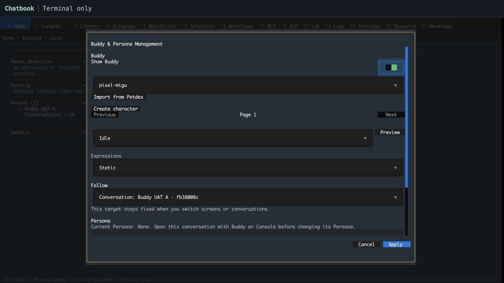
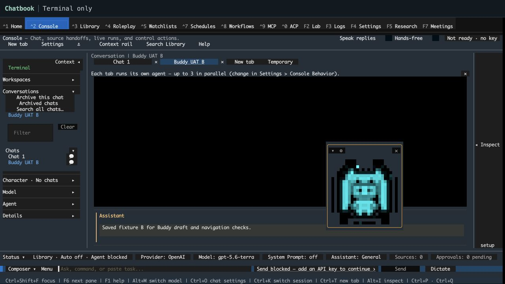
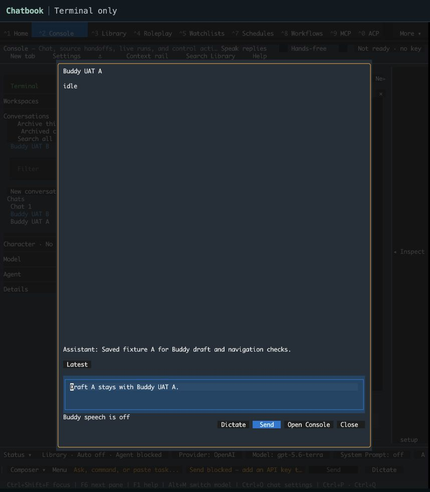
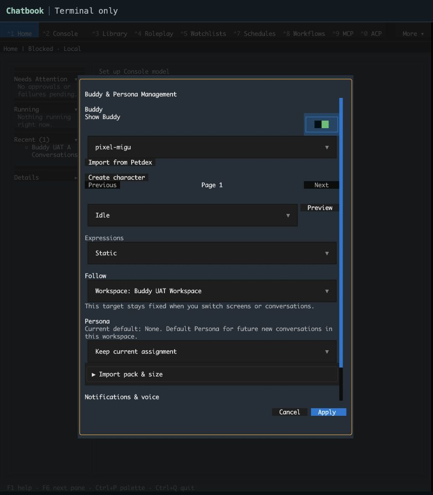
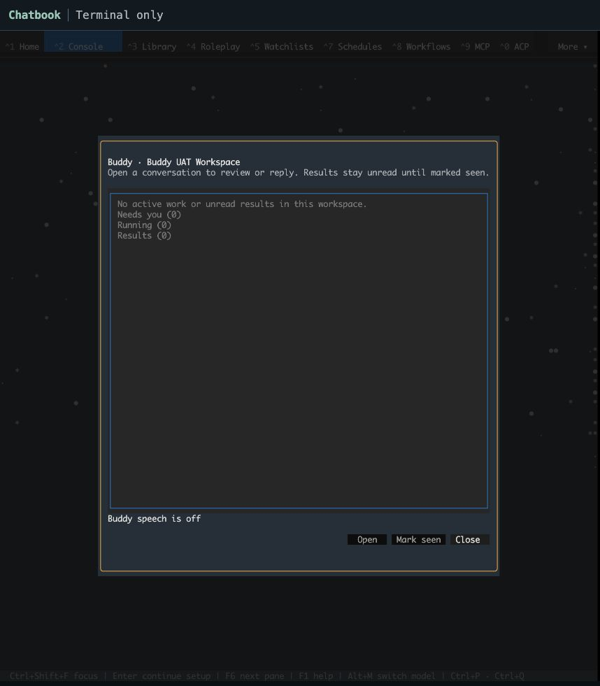
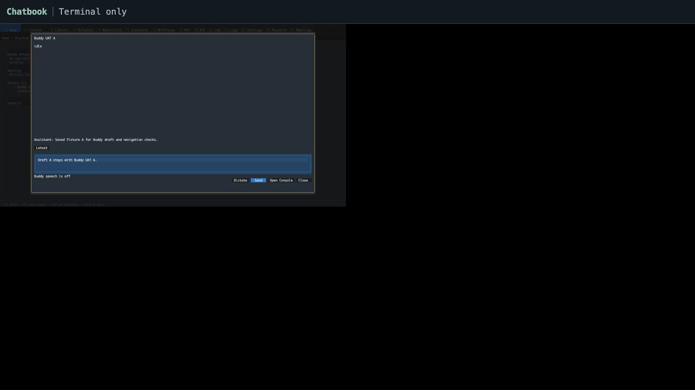
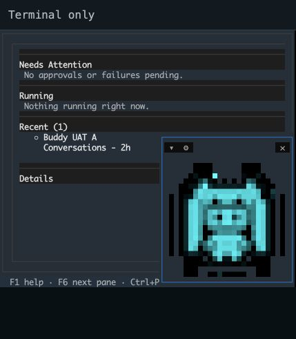
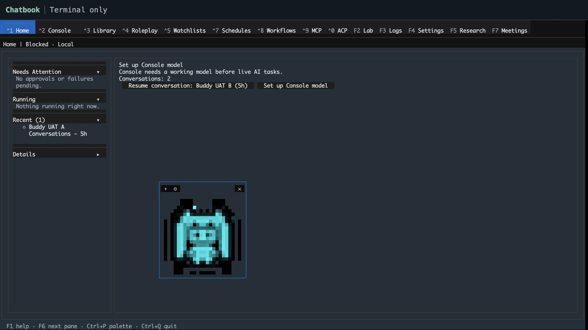

# Chatbook Buddy UAT — 2026-10-03

## Result

Four scoped Chatbook repairs are verified on `codex/chatbook-buddy-uat`, based on dev `01a2020981c6197e5cd9945e5287567ad977edfe`.

1. **Home Resume opened the previous Console selection.** A reused Console now consumes the exact saved navigation target through its existing ordered startup worker before restoring ordinary view state. The original saved identity/history, unrelated Console draft, and independent Buddy owner/draft are preserved.
2. **Restart discarded Buddy's saved owner and Static choice.** The production config loader now copies the existing `[buddy_interaction]` table into application settings. Missing tables remain absent. The real visual controller now uses the existing strict preferences parser, so malformed `animated=0`, empty strings and empty lists retain Dynamic defaults; global reduced-motion still wins.
3. **Opening management first after restart marked the saved owner unavailable.** Management recognizes only its already-bound saved local owner through metadata without loading its transcript or constructing execution services. Presentation-only Apply preserves that binding. Missing, deleted, remote, temporary and repurposed targets remain unavailable; Persona changes still require a live target.
4. **Resume presentation and queued rebuilds could outlive shutdown.** Application shutdown cancels and drains only `console-sync` and `console-resume-navigation-startup` before runtime disposal. The retained shutdown task fences rollback sync, focus, startup and re-arming. Direct shutdown also sets Textual's existing exit flag, matching ordinary Quit and preventing queued rebuilds from mounting after child message pumps stop. Accepted execution keeps its existing runtime disposal policy.

These repair existing behavior under [ADR-139](../../backlog/decisions/139-independent-buddy-conversation-and-workspace-bindings.md), [ADR-147](../../backlog/decisions/147-conversation-archive-and-exact-resume.md), and [ADR-094](../../backlog/decisions/094-console-turn-lifetime-and-navigation-boundary.md). No new schema, provider contract or visual token is introduced. Tasks: TASK-32108.1–32108.4. Command qualification harness repair: TASK-32108.5. Realtime profile and storage teardown repair: TASK-32108.6.

## Rendered Chatbook verification

The supported Textual browser runtime served the actual Chatbook application on loopback port 18770. HOME, config, data, cache and keyring were isolated before imports. Only synthetic conversations were used; no provider request or microphone capture occurred.

- Independent Pixel Migu selection, Dynamic/Static presentation, Home/Library/Console navigation, mouse movement and grip resizing were exercised. Geometry initially saved as x118/y21, width40/height15; later browser resizing visibly kept Buddy available.
- Before repair, Home named saved B but opened the prior empty Console selection. After repair, cold and reused Home Resume selected B and painted B's original saved history.
- Buddy remained bound to saved A while Console displayed B. The exact unsent phrase `Draft A stays with Buddy UAT A.` survived modal closure, screen navigation and reopening on the final build.
- On a fresh final process, management was opened first from Home, before Buddy conversation or Console. It showed **Static**, **Conversation: Buddy UAT A · fb38008c**, and **Current Persona: None** with the live-target instruction. Apply succeeded without model setup. Artwork and geometry were retained.
- The final process's six production module hashes match static verification. Four final screenshots record management-first restart, warm Home Resume, independent Buddy draft behavior and the final visible Buddy.

## Automated verification

**64 unique focused checks passed on final production sources:** 63 in the final combined run, plus the corrected queued-shutdown regression separately. The combined run's one failure expected two empty mounts; Textual correctly skipped mounting entirely under the exit flag. The corrected outcome asserts no mounts, two completed automatic callbacks and no app exception. Product source did not change between these runs.

The final checks cover cold/reused Home identity/history and independent drafts, held ordered Resume during runtime shutdown, queued automatic rebuilds across actual child removal during app shutdown, real-TOML preferences/controller behavior, real-SQLite cold management, management modal/journey behavior, and existing mouse/focus capture guards.

Earlier stages passed 225 Buddy checks, 88 motion/config checks, and 33 Persona-assignment checks. They are recorded as stage-specific evidence, not claimed as one final full-suite run. The held-Resume regression first failed because shutdown returned with its worker RUNNING. The automatic-remount regression first reproduced the exact collapsed-feature `DuplicateIds`, then passed with existing Textual exit admission closed.

All ten changed test files and the management module pass scoped Ruff and formatter checks. All six changed production modules compile. Ruff comparison against base reports 487 existing diagnostics and zero introduced diagnostics after normalizing shifted line references. Whole legacy modules were not mechanically reformatted. `git diff --check` passes.

Independent review found the malformed-motion case and both shutdown gaps, verified the resulting repairs and found no remaining actionable issue. Cold management review also exercised runtime/profile changes and loaded/repurposed slots during metadata I/O; admission failed closed and worker DB connections were closed.

## Workspace and command qualification

**The final targeted group passed all 89 checks in 189.68 seconds.** Fresh and schema 69→75 upgraded profiles render independent artwork without a Persona, retain exact conversation attachment, exercise complete Dynamic frame cycles and Static presentation, and clear an existing workspace Persona default to explicit None. Workspace inbox tests cover read-only opening, focus/selection retention, exact acknowledgement, newer unread receipts, moved owners and failed refreshes. Mounted command tests cover exact-owner sends, drafts, retained questions/approvals, stale owners, busy/attachment refusals, and late voice completion after closure.

The first group passed 79 checks and failed 10. Several controller and full-app cases redirected imported config participants after import. Controller harnesses now retain the admitted bootstrap profile; the three full-app cases use the existing private-profile child before imports and production config writes. The profile correction passed 45 of 47 command checks. The two draft tests supplied only a stalled `stream_chat` gateway, while the default enabled agent bridge used a separate seam; they now explicitly select native streaming through production settings. One saved-owner case then pressed a still-disabled Send button between completed restoration and the next visible projection. Waiting for the actual enabled button preserves the user action and every original assertion. The two focused sends passed, followed by all 89 passing together. No product source or admission guard changed in this phase.

Actual browser interaction also created the disposable **Buddy UAT Workspace**, applied its Buddy binding with default Persona None, and opened its read-only empty inbox. Opening and closing did not acknowledge results. This browser evidence qualifies the empty inbox; populated and running-work cases use controlled controller/receipt fixtures. The two full-app sends prove accepted native-streaming work survives closing Buddy while both Console drafts and the unrelated active selection remain intact. They use a gateway double, so no real provider or default agent execution is claimed.

A separate same-process browser check returned from the workspace binding to saved A. Its original history and exact unsent phrase `Draft A stays with Buddy UAT A.` remained visible. The temporary wide viewport was reset afterward.

These 89 checks and the 64 four-repair checks have no duplicate test identities: **153 unique passing targeted checks on the final product sources**, aggregated across recorded runs. Independent review found no actionable issue in the profile/mode/readiness repairs. The final test module passes Ruff, formatting, compile and whitespace checks. Six separate `command-*.svg` exports record headless fresh/upgrade Static, Dynamic and inbox views; their original/export and repository hashes are recorded separately.

## Realtime and audio qualification

**All 181 focused checks passed in 340.89 seconds with no warnings.** They cover the complete mounted realtime wiring module, plain controllers, microphone tap, loop state machine and production protocol adapter against an owned numeric-loopback WebSocket server. Buddy generation replacement, screen replacement, first-word buffering, late transcripts, barge-in, reconnect-once, playback-end microphone gating, stale completion events and exit cleanup are exercised with synthetic audio and injected devices.

TASK-32108.6 repairs test setup and teardown. Wiring, controller and protocol harnesses keep their collection-time admitted profile. The protocol transport also reads real TLS config, so it needs the same profile lifetime. Its network marker now permits only numeric loopback. All 338 existing assertions and all 74 wiring test bodies remain unchanged.

The initial 109 checks passed 68 and failed 41: seven config-source mismatches and 34 OS sandbox refusals to bind loopback. Allowing the local server exposed 34 more config-source mismatches through TLS settings while the other 75 passed. After profile repairs the expanded group passed 181, but warned of 697 extra descriptors. A native per-case census found SQLite stores held by the unmounted backing application after its lightweight Console host exited. The new local fixture drains the app Console runtime, then closes its evaluation, workspace, library collections and subscriptions stores on their creating UI thread. The four-case census stabilized at 17 descriptors and left no SQLite file records open. The final 181-check session grew from 13 to 16 descriptors; the existing leak detector and threshold were preserved.

The three test modules compile and pass formatting checks. Ruff reports the same 20 legacy diagnostics as their prior source and zero introduced diagnostics. Whitespace checks pass. Independent review found no actionable issue and verified the final executed hashes. Product source is unchanged from the four repairs.

These 181 test identities are disjoint from the previous 153: **334 unique passing targeted checks** now qualify the final product sources, aggregated across recorded runs. This October run is scoped automated qualification. It contains no new human microphone/playback or native Terminal run. Prior acceptance is reconciled below.

Credential preflight read only field presence and the byte fingerprint of the normal config. Its fingerprint stayed unchanged. At the October 3 preflight, there was no OpenAI key in modern/legacy settings or the selected/common environment variable. The preview and tests continue to use isolated profiles; no credentials were copied or saved.

The prior preview process and tab had closed. A fresh supported Chatbook runtime on port 18770 restored Buddy's saved artwork and placement. Opening Buddy selected saved A and showed its original history; closing it returned to Home with Buddy visible. Its six production hashes match the verified sources. The preview is retained for the next UAT step.

[Realtime tests, descriptor census, credential preflight and capture receipts](artifacts/buddy-uat-20261003/realtime-audio-verification.json) retain the failed attempts separately from the final pass. Raw protocol/audio logs and credential values are excluded.

## Acceptance reconciliation — 2026-10-04

The continuation summary incorrectly carried already accepted native geometry and local human voice checks forward as pending. The user confirmed that these checks had already been tested and objected to repeating them. This correction reuses existing evidence and changes no production code.

- [Native move, resize and restored geometry](../../qa/buddy-uat-2026-09-05/native-followup/README.md) were recorded on September 5. Their original limits on exact Git revision and native exit attribution remain intact.
- [Post-fix human voice acceptance](../../qa/buddy-uat-2026-09-05/merged-live-uat/README.md#post-fix-human-voice-acceptance) records run `microphone-20260905-587d0a8874`: Buddy listened, local transcription recognized the phrase, DeepSeek returned a reply, Kokoro played it, and the user confirmed “Yes, clearly.” The original source attribution is preserved.
- The [production OpenAI session probe](../../qa/buddy-uat-2026-09-05/merged-live-uat/codex-oauth-realtime-provider.json) already completed its synthetic reply and returned 105600 output PCM bytes. Its scope excludes microphone input and physical playback.
- The October repairs retain their recorded 334 unique targeted passes. Current product and realtime test hashes match the existing receipts. No test, provider request, microphone capture or playback was repeated for this reconciliation.

The user has now saved an OpenAI key in the isolated UAT profile. Only its presence was checked; no credential value was printed, copied or saved by the agent. Credential availability does not trigger another UAT run.

TASK-32108's fresh/upgraded profile, binding, presentation, navigation, draft, running-work and inbox outcomes are covered by its recorded qualification and repair evidence. Its four acceptance criteria are complete. TASK-31585 AC9 retains its narrower exact-native-revision and full OpenAI human realtime coverage limits as a separate item. Repeating already accepted Buddy checks requires a new failure, a relevant product change or a user request.

[Reconciliation receipt](artifacts/buddy-uat-20261003/acceptance-reconciliation-20261004.json) records the reused evidence hashes and scope. Earlier receipts are unchanged.

## Dev integration — 2026-10-04

The branch now includes dev `7446e3a6270473a5cb248bfe5af3827ded01fff7` through merge `709434b5aff9b3a5c983546a27f9b6c97c7da001`. Only two appended lesson blocks conflicted; both sides were retained. Four repaired product modules also changed on dev, so the relevant Home Resume, shutdown/recompose, loaded config projection and cold saved-owner cases were checked on the merged sources.

**All 22 targeted integration checks passed in 128.77 seconds.** The six production modules compile. Scoped Ruff reports the same 511 diagnostics as current dev and Bandit the same 24 findings, with zero introduced diagnostics after normalizing shifted line references. `git diff --check` passes. Independent review found no actionable issue in either integrated Buddy branch.

The prior 334 unique targeted passes remain attributed to their original tested sources. These 22 repeated cases qualify dev integration and do not increase that unique total. Recorded native geometry and local human voice acceptance remains accepted. No human UAT, provider request, microphone capture, physical playback or full local suite was repeated.

[Separate integration receipt](artifacts/buddy-uat-20261003/dev-integration-20261004.json) records exact source, test-log/JUnit hashes and baseline comparisons. Existing ADR-094, ADR-139 and ADR-147 continue to govern the four repairs; no new ADR is required.

## PR3011 review follow-up — 2026-10-04

The published branch review exposed additional visit-lifetime defects. Started Resume now cancels on suspension and retains its exact target after rollback. A separate owned dispatch worker waits for rollback without blocking the screen message pump; cancellation reaches each owner once, and stale dispatches cannot start work. A newer committed character choice retires old Home targets and drains prior rollback before presentation. Permanent unmount clears the retained request. Shutdown includes the dispatch worker in its existing scoped drain.

Cold ordered Resume now leaves the initial presentation to its canonical opener instead of first painting a default chat. Closing Buddy also makes its deferred transcript scroll inert, preserving its draft and the unrelated Console selection. The warm timer census reads both tracked lists and continues to pin all seven ordinary consumers plus ordered Resume.

**49 unique focused checks passed:** 21 ordered lifecycle/census cases in 108.10 seconds and 28 Home, shutdown, config, saved-owner and close cases in 292.73 seconds. All original Roleplay assertions remain intact; its mounted harnesses use existing private admitted profiles. Isolated negative controls reproduce suspension, stale hedge, repeated cancellation, competing cold sync and dismissed-modal failures. Eight product modules compile. Ruff516/516 and Bandit24/24 comparisons against dev8f83422dde introduce no findings; all four changed test files pass Ruff and formatting. Independent final review found no actionable correctness issue.

The model-validation recommendation was checked against both behavioral consumers. They already use the canonical strict `parse_preferences` contract; immutable bindings and strict booleans reject malformed values while preserving independent defaults. Loader projection remains a deep copy with meaningful section absence. A second validation model would duplicate the existing ADR139 contract without fixing an unsafe consumer.

The earlier334 passes and22 integration repeats remain historical, source-attributed evidence. This fresh49-case qualification covers the review repairs and adds no new human microphone/playback or native claim. Accepted voice/native UAT remains accepted. The [separate review receipt](artifacts/buddy-uat-20261003/pr3011-review-20261004.json) records source hashes, passing runs, valid negative controls and unsuccessful setup/exploratory attempts separately. Existing ADR094/139/147 apply; no new architectural boundary.

Final strict-dev integration merged `8f83422dde2a5b95da648882b8f7e09da5b41f08` cleanly at `6c2e08116e32a351d5e9017ac36092e8d3162664`. All nine repaired Screen methods are AST-identical across the merge. The incoming blocked-send changes are qualified by **nine targeted integration checks passing in 192.36 seconds**, including both controlled Buddy send/draft cases, cold/reused saved identity, shutdown and ordered Resume. Compile and zero-introduced diagnostic comparisons pass again. The [separate final-dev receipt](artifacts/buddy-uat-20261003/pr3011-final-dev-20261004.json) retains exact source and log hashes; these repeated cases are not added to the49-case total.

## Provider integration — 2026-10-04

Merged current dev `49206beea90d35ea9e6842ffa44e4b274db29d8a` cleanly at `ebe2b201bf3259e597d39133493824af71b6b2a9` after its Together discovery and streaming correction. All eight Buddy product modules and fifteen owned test files remain unchanged from `50321d66da58f967de277945c6f2ec7cf29b1d9e`. Incoming provider sources match dev, and only Together's provider record changed.

Both controlled Buddy send and durable-draft cases passed: **2 tests in 72.83 seconds**, using mock replies. Backlog guards pass for4995 records; profile path and diagnostic inventories remain consistent. Independent integration review found no actionable compatibility or lifecycle issue. [Separate provider integration receipt](artifacts/buddy-uat-20261003/pr3011-provider-dev-20261004.json) retains exact tested source and log hashes. These two repeated cases do not increase the earlier49 or334 unique totals. Both1535-pass hosted UI runs retain their original head attribution, and accepted native and human voice evidence remains accepted. Existing ADR094/139/147 apply; this integration creates no new Buddy contract.

## Hosted CI budget follow-up — 2026-10-04

On published `ae297322cd7be531b70192d62e910a4cc068c521`, PR Fast Lane passed 1249 + 135 cases, UI shard1 passed465, and UI shard2 passed all1070 cases in1132.73s. GitHub canceled shard2 during pytest shutdown when its unchanged20-minute job budget expired (1215s including shutdown); its job is canceled, and the required aggregate must reject it. The current-head latency guard passed. These observed passes retain their source attribution and do not establish a green aggregate.

The follow-up reuses PR2918's exact one-line third-shard change, as prescribed by the existing CI capacity task. Every census file still runs exactly once, in census order within its shard. The20-minute cap, minimal dependency set, fail-fast:false and aggregate requirement for every shard to succeed remain unchanged. Existing ADR103 applies; no new ADR boundary. The two targeted CI contract files pass, including real partition commands for1,2,3,5shards and failure enforcement; independent review found no actionable findings. No product, test assertion or human/native/voice UAT change. Fresh hosted results are required for the new publication. Receipt: `artifacts/buddy-uat-20261003/pr3011-ui-shard-budget-20261004.json`.

## Coverage limits and retained attempts

- TASK-32108 is closed against its four recorded qualification outcomes. TASK-31585 AC9 retains the separate exact-native-revision and full application-configured OpenAI human realtime coverage limits. Earlier Chatbook native and local human voice acceptance is preserved; server React evidence remains separate.
- Draft preservation covers navigation and modal closure. No unsent draft durability across process exit is claimed.
- Two older worker-group guards failed in the scoped lifecycle run; unchanged base source reproduces both failures (an existing ungrouped worker and a moved summarize dispatch). The other 11 checks passed, with one existing expected failure. Those unrelated checks are not claimed green.
- Older cold-resume expectations reproduced seven failures with the original base method. Their exploratory edits were removed. The full suite was not run.
- An initial direct initial-mount/recompose experiment reproduced a separate collision, but independent production-path review disproved it as the recorded shutdown fix. Its proposed widget override and test were removed. Final widget code is unchanged.
- Early harness/config-admission, temporary-directory and manually controlled mount attempts were corrected and retained in local logs. The first held-Resume harness blocked a different startup sync worker and was interrupted; the corrected regression holds only the actual ordered worker once so cancellation rollback can finish.

## Receipts

[Source, screenshot and verification hashes](artifacts/buddy-uat-20261003/verification.json) record final sources, earlier-stage attribution, targeted run counts and local log hashes. Screenshots contain synthetic fixtures. Config contents, bootstrap nonce, credentials, raw audio and raw application logs are excluded.

Raw attempts remain under `/private/tmp/chatbook-*20261003*`. Final realtime stage: `chatbook-buddy-realtime-clean`. Final earlier stages: `chatbook-buddy-final-repairs`, `chatbook-queued-shutdown-final`, `chatbook-buddy-final-static`, `chatbook-worker-guard-base-control`, and `chatbook-buddy-workspace-command-qualified` (all with the 20261003 suffix).
