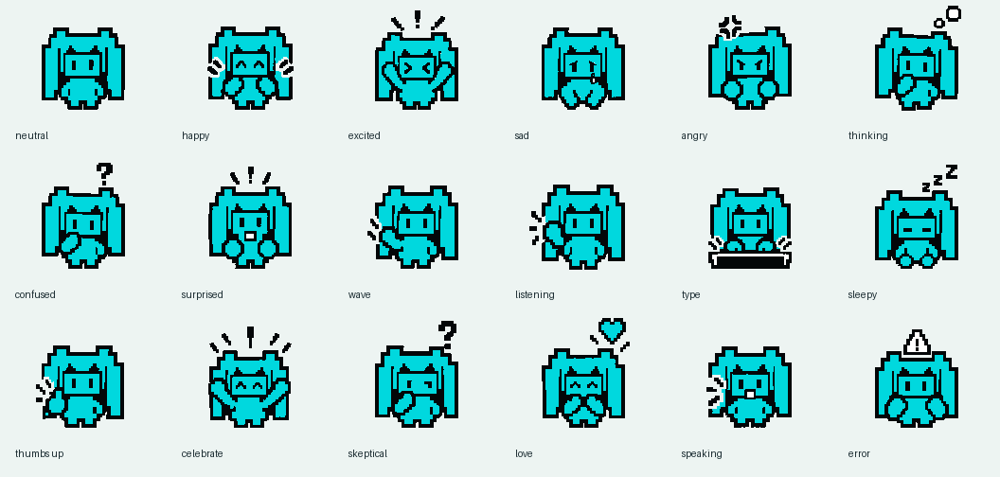

# Persona Buddy — set up Migu, move it, and use it with Console

## What Buddy is for

Buddy is an optional floating companion that reflects activity in Chatbook, such
as listening, thinking, replying, tool work, and approval requests. Start with the
included **pixel-migu** art, or use an active visual pack on another local Persona.

The companion selection and your conversation selection are separate. **Use for
Buddy** chooses the floating Persona; it does not change the current Console
assistant, send a message, grant tool permission, or start a microphone. Use
Console to chat, speak, and review tool requests.

This page covers the terminal application. For the server's browser-based
companion, see the [server Persona documentation](https://github.com/rmusser01/tldw_server/blob/dev/Docs/User_Guides/Server/Personas_User_Guide.md).

## Set up pixel-migu

1. Open **Roleplay** from the navigation bar and choose **Personas**.
2. Select **pixel-migu** in the Library. Fresh local profiles include this Persona
   and its visual pack; no image-generation account or art import is needed.
3. In the **Inspector**, choose **Use for Buddy**. The floating companion appears
   on supported application screens.
4. Open **Console** and send a short text message using a configured provider and
   model. Use the Console transcript and status to confirm the result.

If you want Migu to be the character you chat with as well, select **pixel-migu**
in **Characters** and choose **Start Chat**. Its character expressions and the
floating Persona's animations are separate features.

Buddy accepts a saved, active **local Persona**. A highlighted library row alone
never changes it. For a server-backed Persona, the Inspector says **Save a local
copy first**; work from an eligible local copy before choosing **Use for Buddy**.
An unsaved or inactive Persona must be saved or activated first.

*The image shows the bundled character expression palette. Available Buddy
animations are determined by the Persona Visual pack.*

## Show, fold, close, or disable

Select the Persona currently used by Buddy to manage these Inspector actions:

| Control | Result |
|---|---|
| **Use for Buddy** | Selects this eligible local Persona and enables Buddy. Use it again after disabling. |
| **Show Buddy** | Reopens the selected, enabled Buddy after closing it. |
| **Close Buddy** or the floating **×** | Closes the companion view without deleting the Persona or its pack. |
| **Disable Buddy** | Turns Buddy off. **Use for Buddy** enables it again. |
| Floating fold control | Folds or unfolds the companion. Its tooltip identifies the current action. |

Selection, visibility, folded state, size, and position are saved in the current
Chatbook profile. They are not exported with the character or visual pack.
Switching the Console assistant or browsing another Persona does not silently
replace Buddy. Modal, authentication, and recovery screens may temporarily hide
or cover it.

## Move and resize

- **Move:** press and drag the pet surface, away from its fold and close buttons.
- **Resize:** drag its lower-right edge.
- **Recover placement:** focus Buddy and press **0** to reset its geometry.

Click the pet surface without dragging to focus Buddy, then use the keys below.
Click the Console composer again before typing a message. These keys apply only
while Buddy has focus:

| Key | Action |
|---|---|
| `h` / `j` / `k` / `l` | Move left / down / up / right |
| `H` / `L` | Make narrower / wider |
| `J` / `K` | Make taller / shorter |
| `0` | Reset size and position |
| `c` | Fold or unfold |
| `x` | Close |

The saved position is clamped to the available terminal area. If a drag selects
terminal text, try the keyboard controls and check your terminal's mouse handling.
Earlier native-terminal UAT verified movement, resizing, and saved geometry;
that does not certify every terminal or browser-hosted terminal transport.

## Use voice with Buddy

Configure your conversation provider under **Settings → Providers & Models**.
Configure speech under **Settings → Speech & TTS** and follow the
[Console voice guide](console/attachments-images-voice.md). A visible animation
alone is not proof that a microphone is recording or audio is playing.

Use a TTS provider configured for Chatbook; the historical Kokoro tests below do
not make Kokoro a requirement. Server Persona voice settings and browser speech
choices are separate from Chatbook's speech settings.

Dictation needs the optional microphone and transcription dependencies described
in the Console voice guide. First use may download a speech model and take several
minutes; **Mic…** means preparation, not recording. Dictation stops and transcribes
automatically at 60 seconds.

For a deliberate first test:

1. In Console, enable **Speak replies** if you want spoken output, with an
   available TTS provider and playback device. It speaks new assistant replies;
   enabling it after a reply has finished does not replay that reply.
2. Click **Mic** and wait for **Rec ●** before speaking.
3. Say one short phrase. Click **Rec ●** to stop and transcribe it.
4. Inspect and edit the resulting **draft**, then send it normally. Dictation
   does not send automatically.
5. Read the reply and confirm that you actually hear it if **Speak replies** is on.

For continuous conversation, **Hands-free** starts the configured voice loop;
**Esc** or turning the switch off exits it. Check the Console's capture and
playback indicators when stopping. The optional **Realtime engine** is configured
separately under Speech & TTS; enabling Buddy does not configure its dependencies
or credentials. See the [speech service guide](../Features/Speech-Services-Guide.md)
for engine setup and fallback behavior, and
[OpenAI-compatible TTS](openai-compatible-tts.md) for a compatible speech server.

Chatbook's **Mic → Rec ● → editable draft** workflow differs from the server's
**Start listening → Send now** workflow. The server's 30-second Persona voice
turn limit is not a Chatbook dictation setting.

## Interpret animation and handle approvals

| Appearance | What to check |
|---|---|
| Idle | No higher-priority activity is being displayed. |
| Listening | Check the voice controls for the current capture state. |
| Thinking / speaking | Check Console for generation or speech activity; streamed text can also drive a speaking state. |
| Typing / tool work | Read the current tool activity and its result in Console. |
| Approval / error / offline | Read the actual approval card or diagnostic before taking action. |

The active pack determines which artwork is available. Missing state art may
fall back to another frame. These operational animations do not infer emotion
from every message, and the bundled art does not enable automatic sentiment
selection.

When an approval appears, inspect the tool, inputs, target, and permission in
**Console**, then approve or deny using the actual approval card. Buddy is an
indicator, not an approval control. See
[Agent runs and tools](console/agent-runs-and-tools.md).

## Use your own Persona Visual pack

Open a saved local Persona's editor and find **Persona Visual**. Select a state
to preview it; use **Replace…**, **Clear**, **Add Custom State**, or
**Import Pack…** to prepare a draft. **Save Pack** publishes the changes;
**Cancel Draft** discards the draft. A preview alone does not replace the active
runtime pack. See [Characters and Personas](roleplay-chat-dictionaries/characters-and-personas.md)
for the surrounding editor and import/export workflow.

## Create a character from a Buddy

In a saved local Persona's **Persona Visual** editor, choose **Create character…**.
Save or cancel pending pack edits first. You can also choose **From Buddy archive…**,
or import a `.tldw-persona-vpack` from **Characters → Import** without creating a
Persona first.

The review shows the original creator and artwork terms when the source includes
them. Missing metadata is shown as **unspecified**. Name the new character, optionally
add personality and a greeting, and review each expression mapping. Leave a key
blank to exclude it; at least one expression must map to `neutral`. Conflicting
keys need distinct names or an explicit exclusion.

Choose a portrait state and, optionally, a frame number. The portrait is independent
of the character's expressions. **Preserve animation in created expressions** keeps
supported source timelines; turn it off to create static images. Select **Prepare
preview**, inspect the expressions in Dynamic or Static mode, and review any
conversion warnings before choosing **Create character**. Global animation and
reduced-motion preferences still apply to previews and Console playback.

Creation makes an independent editable local character. Updating or deleting the
source Buddy does not change that copy. Creation leaves the active conversation
and floating Buddy alone. Choose **Open in Console** when you want to start chatting
with the new character, or **Done** to return to the workbench.

Chatbook Actor Pack export preserves the carried artwork terms and conversion
history. The inspected server importer does not support this metadata carrier;
do not rely on a server image import to preserve that history. This workflow accepts
native Buddy archives; importing a Petdex URL is a separate feature.

## Troubleshooting

| Symptom | Next step |
|---|---|
| Buddy never appears | Select a saved active local Persona, use **Use for Buddy**, and leave any modal screen. Check the Inspector's disabled-control explanation. |
| **Show Buddy** is disabled | It is disabled when Buddy is already open. Otherwise, select the Persona currently used by Buddy; if Buddy is disabled, choose **Use for Buddy**. |
| Migu is missing after an upgrade | Check the local source and search filters. Upgrades preserve renamed, customized, and deleted entries; they do not replace your chosen assistant. |
| Buddy changes after selecting another conversation | Selection should remain explicit. Record the source Persona and steps if it changes unexpectedly. |
| Position or size is awkward | Focus Buddy, press **0**, then resize or move it. Try a larger terminal. |
| Text succeeds but no voice is heard | Check TTS setup, assigned/global voice, playback device, and **Speak replies**. Read Console errors; a speaking sprite is not an audio test. |
| Speech recognition is wrong | Stop dictation, edit the draft before sending, and retry with background audio paused. An animation cannot validate transcript accuracy. |
| Buddy remains busy after completion | Check whether another run, tool, approval, or voice session is active. If none is active, record the status and reproduction steps; closing Buddy does not cancel Console work. |

## Verification scope and related guides

The Buddy-to-character workflow above was verified with mounted UI and real local
publication tests on `codex/buddy-import-design`; see the
[conversion verification record](../superpowers/reviews/2026-09-07-buddy-character-conversion-verification.md).

The earlier setup and voice guidance was checked against Chatbook `dev` **307df6c79** on **2026-09-07**
using current controls, existing mounted UI coverage, and recorded September 5
Migu UAT. It is not a claim that every instruction was re-executed in a fresh
physical session for this documentation update. Native dragging and local Kokoro
readback were previously exercised; provider-specific realtime behavior requires
its own configured voice test.

- [First-run setup](First_Run_Setup.md)
- [Characters and Personas](roleplay-chat-dictionaries/characters-and-personas.md)
- [Console voice](console/attachments-images-voice.md)
- [Agent runs and tools](console/agent-runs-and-tools.md)
- [Recorded live-verification lessons](../../backlog/docs/lessons-live-verification.md)
- [Buddy implementation and verification record](<../../backlog/tasks/task-19055 - Add-opt-in-app-wide-floating-Persona-Buddy.md>)
