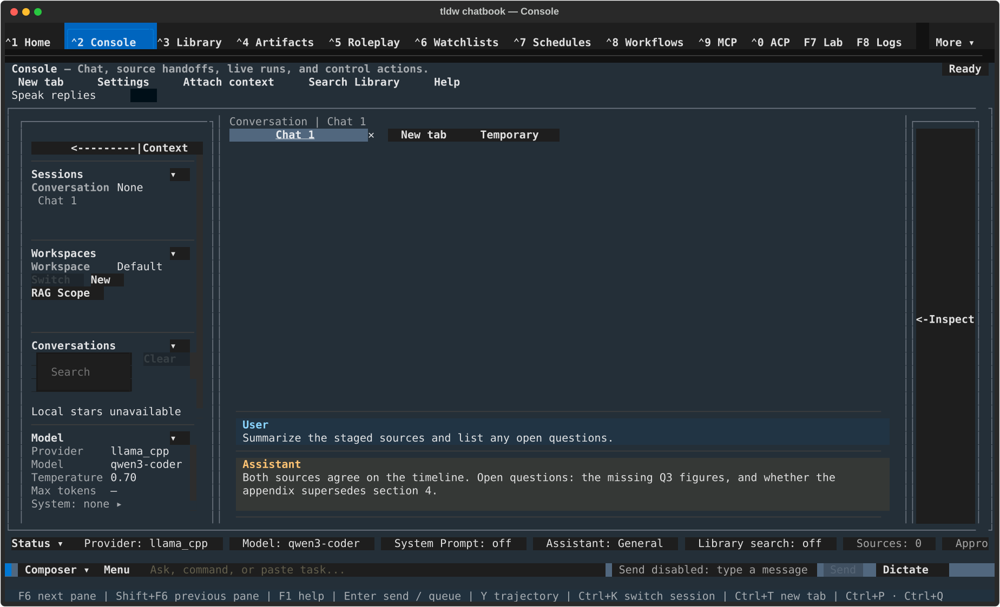

# Console — Chat, source handoffs, live runs, and control actions.

## What this screen is for

Console is the app's chat and agent workbench: you talk to your configured
provider here, stage Library sources and RAG evidence into the
conversation, run agents in parallel tabs, and approve or deny the actions
those runs request. Reach for it to send a message, drive a live run, or
hand work off between your sources and a model. This page is the
orientation tour; the details live on six child pages:

- [Chat basics](console/chat-basics.md) — compose, send, stream, stop, act on messages.
- [Sessions, tabs & workspaces](console/sessions-tabs-workspaces.md) — tab strip, "Switch Session", conversation browser, workspaces.
- [Branching & rewind](console/branching-and-rewind.md) — regenerate variants, edit-and-resend forks, `/rewind`.
- [Attachments, images & voice](console/attachments-images-voice.md) — Attach picker, paste/drop, clipboard images, image generation, dictation.
- [Agent runs & tools](console/agent-runs-and-tools.md) — per-tab runs, fleet markers, approvals, skills, MCP tools.
- [Context & RAG](console/context-and-rag.md) — "Chat Context" viewer, prompts, retrieval scope, staged sources, Library RAG.

## Getting there

- Press **Ctrl+2** from anywhere, or click **Console** in the nav bar.
- **Ctrl+P** → "Switch to Console" in the command palette.
- To land here at launch, set `default_tab = "chat"` under `[general]` in `config.toml`.

## Layout tour

Top to bottom:

- **Header** — the title "Console", the subtitle "— Chat, source handoffs,
  live runs, and control actions.", and a status badge that reads **ready**,
  **running**, or **blocked** depending on the active session.
- **Control bar** — one row of buttons: **New tab**, **Settings**,
  **Attach context**, **Run Library RAG**, **Save Chatbook**, **Help**.
- **Left rail: "Console context"** — sections **Session** (workspace and
  the conversation browser), **Model**, **Agent**, and **Details**. The
  **◂** button in the rail header collapses it; while collapsed, a thin
  **Context ▸** handle on the far left brings it back.
- **Transcript** — titled "Transcript / Event Stream", extended to
  "Transcript / Event Stream | \<session title\>" once a session is active.
  Above it sits the session tab strip: one button per tab (each with a
  **✕** close button) ending in **New tab**.
- **Right rail: "Inspector"** — collapsed by default. Its handle on the
  right edge reads "Inspector" and grows small badges when something needs
  you (pending approvals, an available artifact). Opened, it holds
  **Sources**, the retrieval scope row ("Scope: everything" until you
  narrow it), a run status line, groups such as **Run**, **Tools**,
  **Approvals**, and **Artifacts**, and the **Session Settings** summary.
- **Status chip strip** — one row of chips directly above the composer:
  **Provider**, **Model**, **Assistant**, **RAG**, **Sources**, **Tools**,
  **Approvals**, and — once retrieval is narrowed — **Scope**.
- **Composer row** — the "Composer ▾" collapse toggle, the draft area
  ("Ask, command, or paste task..."), then **Send**, **Mic**, **Attach**,
  and **Save**; a **Stop** button appears between Send and Mic while a
  reply is streaming. You can just start typing from almost anywhere on
  the screen — printable keys go straight into the draft.
- **Footer** — shortcut hints (F6, Shift+F6, F1, Enter, Ctrl+K, Ctrl+T,
  Ctrl+P), a word count, the "Tokens:" counter, and database sizes.

### First run: the "Get started" card

On a brand-new install, an app-level first-run wizard
([First-run setup](First_Run_Setup.md)) offers to set up a provider and
model first — it is skippable, and Settings can do everything later.

If no provider is configured when you open Console, the shell is replaced
by a **Get started** card with three numbered steps — "Connect a provider
(API key or local server)", "Pick a model", "Send your first message" —
marked with ● (current) and ○ (pending) glyphs, plus the note "Composer
unlocks after setup". Its button follows the current step (**Set up
provider**, then **Choose model**) and opens the Console Settings modal.
The composer stays locked until a provider and model are configured; once
they are, the empty transcript reads "Ready — type a message to begin."

## Features & controls

### Control bar

| Control | What it does |
|---|---|
| **New tab** | Creates a Console tab — see [Sessions, tabs & workspaces](console/sessions-tabs-workspaces.md). |
| **Settings** | Opens the "Console Settings" modal (provider, model, tools, and generation). |
| **Attach context** | Stages Library or workspace context — see [Context & RAG](console/context-and-rag.md). |
| **Run Library RAG** | Searches Library evidence before sending — see [Context & RAG](console/context-and-rag.md). |
| **Save Chatbook** | Saves this run as a Chatbook — see [Artifacts](artifacts.md). |
| **Help** | Opens the Console help panel (same as F1). |

### Rails and handles

| Control | What it does |
|---|---|
| **◂** (rail header) | Collapses that rail. |
| **Context ▸** handle | Reopens the collapsed "Console context" rail. |
| **Inspector** handle | Reopens the collapsed "Inspector" rail; shows badges like "1 appr" (pending approvals) or "art" (artifact ready). |
| **Session** section | Workspace controls and the conversation browser — see [Sessions, tabs & workspaces](console/sessions-tabs-workspaces.md). |
| **Model** section | Read-only Provider / Model / Temperature / Max tokens lines plus a **Configure** button that opens Console Settings. |
| **Agent** section | Live run status and the full run log — see [Agent runs & tools](console/agent-runs-and-tools.md). |
| **Details** section | Storage, sync, file tools, server, and handoff status for the workspace. |

### Status chips

| Chip | What it shows |
|---|---|
| **Provider** / **Model** | The active provider and model for this session. |
| **Assistant** / **RAG** | The active assistant; whether retrieval is on for the next send. |
| **Sources** / **Tools** | Staged source count (e.g. "Sources: 0 staged"); tool readiness (e.g. "Tools: 10 ready"). |
| **Approvals** | Pending approvals; press Enter or Space on it to jump to the approval card. |
| **Scope** | Appears when retrieval is narrowed ("Scope: N"); Enter or Space opens the scope picker. |

### Composer

Editing keys, send/stream/stop, attachments, and Mic dictation live in
[Chat basics](console/chat-basics.md) and
[Attachments, images & voice](console/attachments-images-voice.md).
Shell-level: **Composer ▾** collapses the whole row to a single "Composer
hidden" line (with **Expand ▴** at its right, and **Stop** kept available
during a run); **Esc** expands it and returns the caret to your draft.

### Session settings & model selection

The **Console Settings** modal is the one place provider, model, and
generation settings live. Open it from the control bar's **Settings**
button, the Model section's **Configure** button in the left rail, or the
**Session Settings** action in the Inspector. Inside:

- A readiness line up top (e.g. "custom is ready. No API key is required.").
- **Provider and model** — Provider and Model selects, **Custom model** for
  a name the list doesn't offer, **Discover models** to list what a Base
  URL serves, and the **Base URL** field for local/self-hosted endpoints.
- **Sampling** (Temperature, Top P, Min P, Top K, Max tokens, Seed, and
  related knobs), then **Provider-specific**, **Context**, and **Identity**.
- Footer: **Cancel** / **Save as default** / **Save**, under the note "Save
  applies to this session only. Save as default also writes provider +
  streaming defaults to config."

For a faster switch, **Alt+M** opens the quick **Model** popover —
provider, model, and temperature without the full modal.

### Leaving Console during a run

Agent runs are screen-scoped: navigating to any other screen cancels every
in-flight run and denies every pending approval. If runs are active, a
**Leave Console?** dialog warns you first ("N agent runs will be cancelled
if you leave Console. Leave anyway?") with **Leave** / **Stay** buttons,
and a one-time toast on return reports what was cancelled. Details in
[Agent runs & tools](console/agent-runs-and-tools.md) and the
[guide index](index.md#console-agent-runs-are-screen-scoped).

## Common tasks

1. **Set up a provider from the Get started card.** Click **Set up
   provider**, pick a provider in "Provider and model" (for a local server,
   enter its Base URL, then **Discover models**), pick a model, and press
   **Save**. The card's steps tick off and the composer unlocks.
2. **Switch model for just this session.** Press **Alt+M**, choose the
   provider/model, and confirm — or open **Settings** and press **Save**
   (not "Save as default"). Other tabs and future launches are unaffected.
3. **Make today's provider the default.** Open **Settings**, configure
   provider and model, and press **Save as default** — the next launch
   starts there.
4. **Get a distraction-free transcript.** Click **◂** in the "Console
   context" rail header (the Inspector is already collapsed by default);
   click **Composer ▾** to hide the composer too, and press **Esc** to
   bring it back. Reopen the rails from the edge handles.
5. **Find any Console shortcut.** Press **F1** — the help panel lists the
   visible actions, agent/fleet notes, and every shortcut grouped by pane.

## Keyboard & commands

Screen-level keys only — global keys live in the [guide index](index.md).

| Key | Action |
|---|---|
| F1 | Open the Console help panel (actions, agent notes, full shortcut list) |
| F6 / Shift+F6 | Focus the next / previous pane (context rail → transcript → Inspector → composer) |
| Ctrl+K | Open the "Switch Session" conversation finder |
| Ctrl+T | New Console tab |
| Alt+1 … Alt+9 | Jump to Console tab 1–9 |
| Alt+M | Quick "Model" popover |
| Alt+W | "Change Workspace" switcher |
| Alt+V | Paste an image from the clipboard |
| Ctrl+Shift+P | "Chat Context" viewer (what the model will see) |
| Esc | Return focus to the composer (expanding it first if collapsed) |

While Console is the active screen, the command palette (**Ctrl+P**) also
gains "Console: …" entries for these same actions. Slash commands
(`/prompt`, `/system`, `/skills`, `/prefill`, `/generate-image`, `/rewind`)
are covered on the child pages, chiefly [Context & RAG](console/context-and-rag.md) and [Branching & rewind](console/branching-and-rewind.md).

## Related settings & docs

- **Settings ▸ Console Behavior** — parallel-run limit, paste collapse, and
  other Console preferences.
- `config.toml`: `[chat_defaults]` (default provider/model/sampling),
  `[api_settings.*]` (per-provider keys, endpoints, streaming), `[console]`
  and `[console.background_effects]` (paste collapse, ambience),
  `[chat.images]` (attachments), `[general]` `default_tab` (start here).
- Child pages: [Chat basics](console/chat-basics.md) · [Sessions, tabs & workspaces](console/sessions-tabs-workspaces.md) · [Branching & rewind](console/branching-and-rewind.md) · [Attachments, images & voice](console/attachments-images-voice.md) · [Agent runs & tools](console/agent-runs-and-tools.md) · [Context & RAG](console/context-and-rag.md)
- Deep dives: [Speech services](../Features/Speech-Services-Guide.md) (Mic dictation backends) · [Chat dictionaries](../Features/ChatDictionaries-Documented.md).

## Quirks & troubleshooting

- **Status chips look truncated.** They ellipsize to fit the row — hover a
  chip for its full text.
- **The Tools chip says "not loaded".** Tools are counted lazily; the chip
  updates (e.g. to "Tools: 10 ready") after your first send in the session.
- **A run vanished when you switched screens.** Leaving Console cancels
  runs and denies pending approvals — see [Leaving Console during a
  run](#leaving-console-during-a-run). Nothing is ever auto-approved.
- **Console didn't appear on first launch.** The first-run wizard's skip
  path lands on Home; with `default_tab = "chat"` set, the next launch
  opens Console directly.
- **Alt+M does nothing.** Some terminal/multiplexer setups deliver Alt
  chords as a separate Esc + letter, which Console reads as Escape then a
  typed character. The same popover is always reachable via **Ctrl+P** →
  "Console: Change model…".

—
*Verified against dev @ ff435772c — 2026-07-31*
