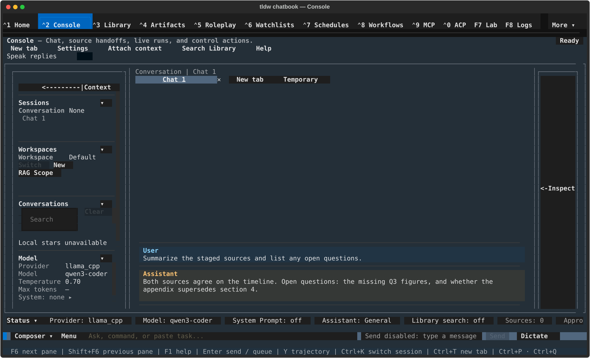

# Console — Chat, source handoffs, live runs, and control actions.

## What this screen is for

Console is the app's chat and agent workbench: you talk to your configured
provider here, stage Library sources and RAG evidence into the
conversation, run agents in parallel tabs, and approve or deny the actions
those runs request. Advanced users can also run an explicitly armed, user-only
raw host command or open a separately armed persistent Terminal without
involving a model. Reach for Console to send a message, drive a live run, hand
work off between your sources and a model, or use a real interactive shell.
This page is the orientation tour; the details live on the child pages below:

- [Chat basics](console/chat-basics.md) — compose, send, stream, stop, act on messages.
- [Sessions, tabs & workspaces](console/sessions-tabs-workspaces.md) — tab strip, "Switch Session", conversation browser, workspaces.
- [Branching & rewind](console/branching-and-rewind.md) — regenerate variants, edit-and-resend forks, `/rewind`.
- [Attachments, images & voice](console/attachments-images-voice.md) — Attach picker, paste/drop, clipboard images, image generation, dictation.
- [Voice & hands-free](console/voice-and-hands-free.md) — hands-free loop, spoken commands, Speak replies, platform setup (incl. Linux players).
- [Video generation, playback & streaming](console/video.md) — `/generate-video`, ephemeral videos & tombstones, in-app playback, `/stream-video`.
- [Agent runs & tools](console/agent-runs-and-tools.md) — per-tab runs, fleet markers, approvals, skills, MCP tools.
- [Canvas](console/canvas.md) — create, revise, inspect, recover, and safely export interactive artifacts.
- [Context & RAG](console/context-and-rag.md) — "Current Context" viewer, prompts, retrieval scope, staged sources, Library RAG.
- [Semantic trace capture](console/semantic-trace-capture.md) — what Capture On saves, Safe/Full views, masking, forks, legacy traces, export, and purge.

## Getting there

- Press **Ctrl+2** from anywhere, or click **⌃2 Console** in the nav bar.
- **Ctrl+P** → "Tab Navigation: Switch to Console" in the command palette.
- To land here at launch, set `default_tab = "chat"` under `[general]` in `config.toml`.

## Layout tour



Top to bottom:

- **Header** — the title "Console", the subtitle "— Chat, source handoffs,
  live runs, and control actions.", and a status badge with the active
  chat's readiness word (see **Readiness words** below), or **Running** while
  a reply is generating. Below 84 columns, where the word does not fit, the
  badge reads **Ready** or **Blocked**.
- **Control bar** — one row of buttons: **New tab**, **Settings**,
  **Context rail**, **Search Library**, **Help**. (**Save as Chatbook**
  lives in the composer's **Menu** button, left of the draft.)
- **Left rail: "Console context"** — separate sections for **Sessions**
  (the active chat), **Workspaces** (named workspaces and their
  conversations), **Conversations** (Default and unassigned conversations),
  **Model**, **Agent**, and **Details**, plus **Character** when character
  avatars are enabled. **Sessions** and **Conversations** start open; the
  rest start collapsed, so the whole rail fits without scrolling on an
  ordinary terminal. The full-width **Context ◂** header button collapses
  the rail; while collapsed, the **Context->** handle on the far left
  brings it back. With focus anywhere in the rail, **Ctrl+Shift+←**
  collapses every section and **Ctrl+Shift+→** expands them all.
  Colour in the rail follows your theme and carries four meanings: the
  theme's **primary** hue marks what you are *in* (the active workspace
  name, the active-chat line, and the selected conversation row); the
  **accent** hue marks a *value* beside its grey label (Temperature,
  Max tokens, Storage, …); **status** colours mark *state* (the Agent line
  while a run is running, done, stuck, or failed, and conversation rows
  whose fleet marker shows a run is running, needs approval, or finished);
  plain grey is labels and help copy. Keyboard focus keeps its own
  separate tint, so "which chat am I in" and "where is focus" never look
  the same. Every built-in theme and any theme saved from
  **Settings ▸ Theme** recolours the rail automatically.
- **Conversation pane** — titled "Conversation", extended to
  "Conversation | \<session title\>" once a session is active.
  Above it sits the session tab strip: one button per tab (each with a
  **✕** close button) ending in **New tab**.
- **Right rail: "Inspector"** — collapsed by default. Its **<-Inspect**
  handle on the right edge grows small badges when something needs you
  (pending approvals, an available artifact). Opened, its full-width
  **Inspect|--------->** header button collapses it, and the body holds
  **Sources**, the retrieval scope row ("Scope: everything" until you
  narrow it), a run status line, groups such as **Run**, **Tools**,
  **Approvals**, and **Artifacts**, the **"Live work sources"** card
  (ask Library sources before sending), and the **Chat settings**
  summary.
- **Staged-evidence strip** — appears at the top of the control deck,
  directly under the conversation pane and above the status chip strip,
  only while Library RAG evidence is staged (or briefly after a send
  consumes it); lists what's staged with an **Un-stage** button — see
  [Context & RAG](console/context-and-rag.md). The prompt-queue shelf
  occupies the same slot while prompts are queued.
- **Status chip strip** — one row of chips directly below the
  conversation pane (and below any staged-evidence or prompt-queue
  strip), above the composer: **Provider**, **Model**,
  **Assistant**, **Library search**, **Sources**, **Tools**,
  **Approvals**, and — once retrieval is narrowed — **Scope**. (Settings ▸
  Console Behavior ▸ **Status row placement** can move this row below the
  composer instead, restoring the older bottom-row layout; the collapse
  choice on its leading **Status ▾** control is remembered across visits
  and restarts.)
  The chips are actions, not just readouts: **Sources** and **Tools** open
  the Inspector rail (the only way to reach it in single-pane mode, where
  the edge handles hide), **Provider**/**Model** open the model picker,
  **Library search** opens the search settings, **Approvals** jumps to the
  pending approval card, and **Scope** opens the scope picker. The **Tools**
  chip only appears once tools are counted for the session (after your
  first send) — before that it stays hidden rather than guessing.
- **Composer row** — a slim one-row bar (it grows with your draft, up to
  eight rows, and shrinks back as the draft empties) marked by a one-column edge on its left that brightens and
  thickens while the composer has focus — the "Composer ▾" collapse toggle, the draft area
  ("Ask, command, or paste task..."), then **Send** and **Dictate** (Attach
  and Save live behind **Menu**); while a reply is streaming Send reads
  **Queue** and a **Stop** button appears at the right end of the row
  (**Ctrl+G** also stops it). **Send** is genuinely disabled whenever a send can't
  go through — nothing typed yet, setup incomplete, or a reply still
  streaming — and the reason shows inline next to it (e.g. "Send blocked —
  choose a model to continue ›"), so you never have to hover to find out
  why. When setup is the blocker, that reason is clickable and opens the
  setup wizard directly.
  You can just start typing from almost anywhere on
  the screen — printable keys go straight into the draft. A physically typed
  `! ` prefix switches to a red raw-host-command state only after the saved
  unlock and per-launch Arm gates; see
  [Chat basics](console/chat-basics.md#raw-cli-user-commands--full-host-authority).
- **Footer** — shortcut hints (F6, Shift+F6, F1, Enter, Ctrl+K, Ctrl+T,
  Ctrl+P), a word count, and database sizes. (Token usage lives in the
  status row's cost chip — e.g. "2.7k tok" — not in the footer.)

### Rail scrolling and focus

Context sections keep complete reading bodies up to their own limits: 15 rows
for Sessions, Model, Agent, and Details; 20 for Workspaces and Conversations;
and 35 for Character. Inspector sections keep a 20-row limit. **▼ more —
scroll** means more content remains inside the current section. In the
Context rail the outer hint names what is below the fold instead — **▼ Agent
· Details · +1** — listing as many hidden sections as fit and counting the
rest, so you can tell whether scrolling reaches what you want. The
Inspector's **▼ more sections — scroll** keeps the generic wording.
See [Reading long Context and Inspector sections](console/context-and-rag.md#reading-long-context-and-inspector-sections)
for pointer and keyboard navigation.

### Terminology

The Console docs use these words consistently:

- **Context rail** — the LEFT rail (workspaces, conversations, model,
  agent, details). Its full name is the "Console context" rail; Alt+C
  toggles it.
- **Inspector** — the RIGHT rail (sources, scope, environment, the run
  inspector, session settings). Alt+I toggles it.
- **Handle** — a collapsed rail's edge tab (**Context ▸** / **◂ Inspect**);
  click it (or use the Alt chord) to reopen the rail.
- **Staged sources** — Library items staged for the next send, listed in
  the Inspector's Sources tray. Staging happens from Library surfaces;
  the "Context rail" control-bar button opens the rail, it does not
  attach anything.
- **Retrieval scope** ("Scope") — the Library items retrieval is narrowed
  to (the Scope row in the Inspector). "Sources" (the kinds searched)
  and "Scope" (the items searched) are different settings.
- **Conversation Inspector** (Ctrl+Shift+P) — the read-only viewer of
  what the model has seen (**Current Context** tab) and is about to see
  (**Next Send** tab). Not the same surface as the Inspector rail.
- **Run inspector** — the run-status groups (Run recipe, Tools,
  Approvals, …) inside the Inspector rail.

### Small terminals

The shell adapts instead of clipping: below 35 rows the header banner hides
(and the control bar gains a small **Ready**/**Running**/**Blocked** marker
so the status identity survives); below 150 columns the Inspector rail
starts collapsed and below 100 columns the left rail starts collapsed too —
these compact collapses are only the default: opening a rail from its
handle (or via the **Sources**/**Tools** chips) works while the viewport can
still keep a usable transcript, and your stored open/closed preference is
kept and restored at wider sizes;
and below 84 columns the workspace switches to a single pane — both edge
handles hide and the transcript takes the full width, so it stays usable
even at 80x24 or 60x18. An explicitly opened rail yields to this rule once
the terminal cannot fit the rail plus a usable transcript (~70 columns for
the Context rail, ~74 for the Inspector); the preference itself survives and
the rail returns when the terminal widens again. When one of these width
rules closes a rail you had open, a one-time notice (once per rail per
session) says which rail collapsed and how to bring it back — the
Context handle for the left rail, **Alt+I** for the Inspector.

The full-width layout on larger terminals remains primary, while short
terminals keep every Context header and complete open section reachable by
scrolling the rail.

### Focus mode

Focus mode (`Ctrl+Shift+F`, or the palette's "Quick Actions: Toggle Focus
Mode") strips the Console down to the conversation: the navigation bar and
the workbench header disappear; the one-line status bar — token count and
key hints — stays. It is the claude-code-style surface for heads-down
coding, and the comfortable shape on a phone over `--serve`, where fine
pointers and function keys are scarce.

- Start chrome-free every launch: set `[general] focus_mode = true`, or
  launch with `--focus` (which also forces the Console as the startup
  screen, overriding `default_tab`; first-run onboarding still comes
  first).
- Leaving is any navigation — a destination hotkey or a palette jump
  lands you on the target screen with normal chrome, and one
  `Ctrl+Shift+F` brings the focused Console back.
- Context usage remains available in the status line (on wide terminals)
  and via `Ctrl+Shift+P`.

### Phone & remote use over `--serve`

Chatbook can serve itself to a browser, which is how the Console becomes
a phone surface: the app runs on your computer (or any box that stays
on), and the phone opens a plain web page — no terminal app needed on
the phone beyond the browser.

**Start the server** (requires the `web` extra: `pip install -e ".[web]"`).
The remote example below assumes you have already configured a dedicated
Chatbook web access token, an exact HTTPS `public_url`, and either direct TLS
or a trusted TLS-terminating proxy as described in the
[Web Server operations guide](../../tldw_chatbook/Web_Server/README.md):

```bash
tldw-cli --serve --host 0.0.0.0 --port 8765
# or equivalently:
python -m tldw_chatbook.app --serve --host 0.0.0.0 --port 8765
```

Both entry points accept the same flags (`--host`, `--port`,
`--web-title`, `--debug`; without `--port` the server binds the
`[web_server]` config's port, default 8000). `--host 0.0.0.0` makes the
server listen on every interface, but Chatbook refuses remote admission unless
the authenticated TLS policy is valid. Open the configured HTTPS `public_url`
in the phone's browser. Keep `--serve` bound to `localhost` when you do not want
remote access; a firewall alone is not a substitute for authentication and
encrypted transport.

**Make it phone-shaped.** Focus mode is the phone surface — press
`Ctrl+Shift+F` from a desktop session first, or launch the server with
`--focus` so every connection starts chrome-free (set
`[general] focus_mode = true` to make that permanent). Below ~70 columns
the rails yield to the transcript automatically, so the conversation is
readable without any setup.

**What works by touch.** The things a soft keyboard cannot reach all
have on-screen routes:

- Sending uses the composer's **Send** button; the composer **Menu**
  gathers the actions desktop reaches through hotkeys.
- Tool approvals are fully tappable (per-call buttons, Approve all /
  Deny all / Submit).
- The control bar's **Hands-free** switch is the touch route into (and
  out of) the voice loop.
- The command palette (`Ctrl+P` — on-screen keyboards can usually
  produce this) is the universal escape hatch; on a phone without
  Escape or function keys, reaching Settings or another screen from
  the palette is the intended path, and any such jump also exits focus
  mode (one `Ctrl+Shift+F` returns to the focused Console).

Nothing about the desktop experience changes: `--serve` simply adds a
second, browser-based way in. Multiple browser tabs are independent
sessions of the same app instance.

### First run: the "Get started" card

On a brand-new install, an app-level first-run wizard
([First-run setup](First_Run_Setup.md)) offers to set up a provider and
model first — it is skippable, and Settings can do everything later.

If no provider is configured when you open Console, the shell is replaced
by a **Get started** card with three numbered steps — "Connect a provider
(API key or local server)", "Pick a model", "Send your first message" —
marked with ● (current) and ○ (pending) glyphs, plus the note "Composer
unlocks after setup". Behind the card, the workbench dims under a still
field of scattered snow glyphs — a purely decorative backdrop that holds
one frame (it re-scatters only when the window resizes) and costs nothing
while the card waits. Its button follows the current step (**Set up
provider**, then **Choose model**) and opens **Chat settings**.
The composer stays locked until a provider and model are configured; once
they are, the empty transcript names what is connected, for example
"Setup complete — OpenAI · gpt-4.1-mini. Ready — type a message to begin."
(a model saved as a file path, as llama.cpp models often are, shows its file
name). That line is the arrival receipt: it shows until your first-ever send,
and nothing about it is sent to the model.

**Arriving from setup.** Finishing first-run setup with **Start chatting**
opens one chat on the saved provider and model, with no notice. Notices that
do appear in Console are drawn below the nav tabs, header and control rows
and the chat tab strip, so they never cover the tab bar, the voice controls,
the readiness badge or the New tab and Temporary buttons.
"A Console turn completed while hidden" appears only when the turn finished
while Console was not on screen, or in a tab you were not viewing. A dialog
open over Console (Switch model, Rename, the command palette) does not count
as hidden.

**Readiness words.** Every model surface — the header's status badge, the
Model section's status line, this card's current step, the
Switch model rows, Chat settings and the Settings test result — says the
same one of four things for the same connection:

| Word | Means |
|---|---|
| **Ready · not tested** | Nothing blocks a send, and nothing has been checked this session. |
| **Ready · reachable 14:01** | A local, URL or custom endpoint answered its model listing at that local time. |
| **Ready · verified 14:01** | The provider accepted a cloud key in an authenticated model listing, or a paid generation test of this model succeeded, at that time. A test of one model never verifies another, and a listing alone never means generation was tested. |
| **Not ready · \<reason\>** | A setup blocker or a known failure, such as "no key", "key rejected", "refused :9099", "timed out" or "no model". A setup blocker is named before a failed test: with no model chosen, a refused server still reads "no model". |

The words carry the state; colour only repeats it (the Model section line
turns red when Not ready). A provider whose model list is public, such as
OpenRouter, stays "Ready · not tested" after its list loads, because the list
proves nothing about your key.

A known connection failure blocks sending too. When a connection test of
this chat's server — **Test connection & list models** in Chat settings, or
the Key check's **Test (t)** in Settings — was refused or timed out, the Console reads,
for example, "Not ready · refused :9099" (the header badge, the Model
section, the Chat settings rows and this card's "Reconnect the
provider server" step), and the composer reads "Send blocked — retry the
connection to continue". **Retry connection** tests that same server again
in place; it opens no settings. If the server now answers, the chat is Ready and Send
unlocks; if not, a "still unreachable" notice says so. A cloud provider's
key check (Settings **t**) that timed out or could not connect is the
exception: the Console never contacts a cloud provider itself, so **Retry
connection** opens **Settings ▸ Providers & Models** at that provider and
says "Press t to test \<provider\> again". Every test sends the
API key a message would use, so a local server started with a key (vLLM's
`--api-key`, for example) is tested with it, and "key rejected" means that
key was refused (a 401). A 403 from any model listing, local or cloud, means
only that the key may not list models: it reads "Ready · not tested" and
never blocks sending. Test results last for this session only, and a test of a
different endpoint or key never changes this chat's readiness.

A second action, **Write a note in Library**, stays available beside it for
as long as the card is showing — it needs no provider, and opens Library's
New note view directly. A local-first user who came for notes is not stuck
behind a provider-only card. A third action joins them when a loopback
server is found on this machine — "Use detected \<provider\> (\<host:port\>)",
naming what it found and where (only `127.0.0.1` and `localhost` are ever
offered, and the endpoint is shown without credentials or scheme). Every
action on the card is drawn as a button with a rounded edge, one under the
other; Tab moves between them and the focused one grows heavy side rails, so
which one Enter will press is visible without reading the text. *(Was "Both
actions" — superseded by task-32558 below: the count contradicted this page's
own task-32555 stamp, which names three.)*

If you land here with a handoff already staged — e.g. from Library's
**Use in Console** on a Search/RAG result or on an open note while a
provider isn't set up yet — the card shows an extra line under
"Get started" naming what's staged and that finishing setup is what
unlocks it (for example,
"Library Search/RAG evidence staged — finish provider setup to use it.").
The handoff itself is never lost: it's the same staged context the
composer-level strip below shows once setup completes.

## Features & controls

### Control bar

| Control | What it does |
|---|---|
| **New tab** | Creates a Console tab — see [Sessions, tabs & workspaces](console/sessions-tabs-workspaces.md). |
| **Settings** | Opens **Chat settings** (provider, model, generation, and context and memory). |
| **Context rail** | Opens the "Console context" rail (source staging is done from Library) — see [Context & RAG](console/context-and-rag.md). |
| **Search Library** | Runs a user-initiated **Manual Search Library** request before sending; it remains available regardless of the conversation's automatic or assistant policy — see [Context & RAG](console/context-and-rag.md#per-conversation-library-controls). |
| **Save as Chatbook** (composer **Menu**) | Saves this run as a Chatbook — see [Artifacts](artifacts.md). |
| **Buddy** (composer **Menu**) | Manage independent Buddy artwork, follow a conversation/workspace, and change Persona settings — see [Buddies](buddies.md). |
| **Help** | Opens the Console help panel (same as F1). |
| **Speak replies** | Speaks new assistant replies in this conversation — see [Voice & hands-free](console/voice-and-hands-free.md). |
| **Hands-free** | Enters/exits the voice conversation loop (same as Ctrl+Shift+H) — the switch is the touch/soft-keyboard route into the mode. See [Voice & hands-free](console/voice-and-hands-free.md). |

For local Kokoro, open **Settings > Speech & TTS** and use **Exact** voice policy
with a Kokoro voice value. If an older configuration shows **Server default**,
choose Exact and save. Selection errors identify the setting or voice profile
that needs attention; correct it before trying speech again. In **Lab > Speech**,
Kokoro's **Automatic (from voice)** language option follows the selected voice.
Automatic reply speech follows Kokoro's **Use ONNX** setting in global Settings.
Speech Lab starts with **Use ONNX** enabled and its switch can explicitly select
PyTorch for a preview.

Kokoro PyTorch uses the official Kokoro v1 runtime and requires Python 3.11 or
3.12. Install `tldw_chatbook[local_tts]`; if English language setup fails, run
`python -m spacy download en_core_web_sm` in that same environment and retry.
Use a v1 `.pth` checkpoint and `.pt` voice packs; an adjacent `config.json` is
used when provided, otherwise the official v1 configuration is cached on first
use. Japanese and Chinese also need `misaki[ja]` and `misaki[zh]`, respectively.
On Apple Silicon, the PyTorch MPS option runs neural inference on the GPU and
Fourier operations on CPU. On Python 3.13 or later, use ONNX.
Oversized non-English phoneme sequences
fail with a request to split the text with newlines, rather than silently losing
the end of the speech.

Kokoro WAV, MP3 and other encoded files are limited to five minutes per request.
For longer speech, shorten the text or choose PCM; an oversized encoded request
fails without playing a truncated file.

### Rails and handles

| Control | What it does |
|---|---|
| **Context ◂** / **Inspect\|--------->** headers | Collapse the open Context or Inspector rail; the entire painted header is the button. |
| **Context->** handle | Reopens the collapsed "Console context" rail when the viewport can retain a usable transcript. |
| **<-Inspect** handle | Reopens the collapsed "Inspector" rail when the viewport can retain a usable transcript; shows badges like "1 appr" (pending approvals) or "art" (artifact ready) — F1 lists this legend. |
| **Sessions** section | Names the active chat. Hovering it shows the durable conversation id. |
| **Workspaces** section | Shows every named workspace with its associated conversations in a native Tree. Its compact strip keeps **Switch**, **New**, and **RAG** together; **Switch** is also the route to Default. Starred conversations sort first within their workspace. |
| **Conversations** section | Independently searches, starts, and resumes only Default and unassigned conversations; favourited entries sort first and are marked beside the title. Each row carries an **\*** that opens its action menu — Favourite, Change status, Archive, Rename, and More ▸ Delete. See [Context & RAG](console/context-and-rag.md#workspaces-and-conversation-ownership). |
| **Model** section | Read-only Temperature / Max tokens / Streaming (On or Off) lines, the chat's readiness word (red only when Not ready), the system-prompt line and **Change  Alt+M**, which opens Switch model. The rows follow the chat through Apply, a new chat and switching chats. The active provider and model are read from the status bar, which shows them at every width. |
| **Agent** section | Live run status and the full run log — see [Agent runs & tools](console/agent-runs-and-tools.md). |
| **Details** section | Storage, sync, file tools, server, and handoff status for the workspace. |
| **Character** section | Appears only when the character-avatar preference is on. Its complete portrait is centered and keeps its aspect ratio; it only scales down to fit and is never stretched, cropped, or enlarged merely to fill the 35-row body. |

### Status chips

| Chip | What it shows |
|---|---|
| **Provider** / **Model** | The active provider and model for this session. The provider shows its display name — "llama.cpp", "OpenAI", or a custom endpoint's own name — never its config key; a long name is shortened with "…" and shows in full when the chip has focus. |
| **Assistant** / **Library** | The active assistant; the Library chip summarizes the two independent conversation controls in plain words, **Auto off/on · Agent access off/on**, for example **Library · Auto off · Agent access off** (its editor labels them **Auto: Never / Automatic** and **Assistant: Blocked / Allowed**). Open it to edit those controls and see whether allowed assistant tools use **Direct / RAG** mode. |
| **Sources** / **Tools** | Staged source count (e.g. "Sources: 0"); tool readiness (e.g. "Tools: 10 ready" — hidden until tools are counted). |
| **Approvals** | Pending approvals; press Enter or Space on it to jump to the approval card. |
| **Scope** | Appears when retrieval is narrowed ("Scope: N"); Enter or Space opens the scope picker. |

### Long conversations

Opening or switching to a long conversation shows the most recent stretch of it
first, rather than mounting the whole history up front — a 500-message session
opens in about a second instead of tens of seconds. Scroll to the top of what is
shown (wheel, Page Up, or the scrollbar) and the previous chunk is prepended
under you, keeping the same message in view; the jump-to-latest pill or a new
send takes you back to the tail. Nothing is deleted: exports, `/rewind`, and the
context sent to the model always use the full history.

Scroll-back no longer stops at the watermarks: the view slides rather than
grows. Once the mounted stretch reaches `prune_low_watermark` (12,000 rows by
default), scrolling further back keeps loading older history while the newest
end of the stretch is set aside the same way — so a very long session stays
reachable by scrolling, at a roughly constant memory cost. One deliberate
exception: a selected message is never set aside, so a selection pinned at
either end of the stretch pauses the sliding in that direction until you
clear it (Esc) — after a jump to an old message, the jumped-to selection
sits at the oldest end, so reading far enough past it eventually pauses the
forward walk the same way (the view stays bounded instead of growing).
Scrolling back down (or a jump to an old message — selecting one far outside
the stretch lands you on a fresh window around it instead of loading
everything in between) walks forward the same way, and the jump-to-latest
pill or a new send always returns you straight to a fresh view of the tail.
Tune it under `[chat_defaults]` in `config.toml`:

- `transcript_window_lines` (144) and `transcript_scrollback_lines` (96) are
  **floors**, not the budget. The window actually used is the larger of the
  floor and your terminal height ×6 (×4 per scroll-back step), so on any
  terminal 24 rows or taller the shipped floors change nothing — raise them
  above `height × 6` to widen the window, or set `transcript_window_lines` to
  `0` to mount the whole history at load, as before.
- `prune_low_watermark` / `prune_high_watermark` bound the mounted view itself
  and keep working with the window disabled. With the window disabled (or with
  watermarks set too small to hold a scroll-back step), sliding is off too:
  history the watermarks pruned is then reachable only via export or a jump,
  as before TASK-15777.

### Composer

The composer is a slim bar that floats one blank line clear of the status
row above and the footer below (compact terminals under 35 rows drop both
gaps). It is exactly as tall as your draft — one row when empty, growing
to eight as text wraps, shrinking back as it empties. The one-column edge
on its left carries its state: muted at rest, ready-green while a draft is
present, and thick focus-blue while the composer has focus.

Editing keys, send/stream/stop, attachments, and Mic dictation live in
[Chat basics](console/chat-basics.md) and
[Attachments, images & voice](console/attachments-images-voice.md).
Shell-level: **Composer ▾** collapses the whole row to a single "Composer
hidden" line (with **Expand ▴** at its right, and **Stop** kept available
during a run); **Esc** expands it and returns the caret to your draft.

### Session settings & model selection

**Chat settings** is the one place provider, model, and generation settings
for one chat live. Open it with **Ctrl+O** from anywhere in
Console, `/settings`, the palette's "Console: Chat settings…", the control
bar's **Settings** button, or the action on the Inspector's **Chat
settings** card. Its title names the chat and counts your unsaved edits ("Chat
settings · Refactor plan · 2 unsaved edits"), and the line under the tabs
says what it changes: "Applies to this chat only · saved with the
conversation · defaults live in Settings ▸ Providers & Models (F4)". It is
150 columns by 22 rows, and the **Model and generation**
view puts tuning first, so at 211x44 the whole view fits without scrolling:

- **Model**: the chat's model and its provider's name, where the pair comes
  from (*this chat*, or *edited \** once you change it here), the readiness
  word and the context window (e.g. "claude-sonnet-4-5 · Anthropic  this chat
  Ready · not tested · 200k context"), then **Change  Alt+M**. When no
  catalog knows the model's window, the row says so in the words Settings ▸
  Providers & Models ▸ Advanced uses: "context unknown". Request estimate
  then ends "(assumed; window unknown)" and the Context view names the
  fallback size budgets use until you enter the real limit there (e.g.
  "unknown, 32,000 assumed"). A long model
  id shows whole; only an id wider than the row is shortened in the middle,
  keeping its start and its end (a GGUF file's quant), and the provider's
  name is never cut. Below 100 columns the row shows only the pair and
  Change; the context window still reads in **Request estimate**. Change is
  the only way to change the model: it opens **Switch model** (below) in pick
  mode over Chat settings, listing the same provider·model pairs, plus any
  models a listing here found. **Enter**
  picks a pair and returns to Chat settings with the draft moved to that
  exact provider and model; nothing is applied until **Apply**. **Esc** returns
  with nothing changed and focus on Change. Pick mode shows no values or
  default actions and cannot pick a NEEDS SETUP row; to use a model the list
  does not have, type its id in **Find** and pick the **TYPED MODEL ID** row.
  **Alt+M** works from anywhere in Chat settings, even in a text field; on
  macOS it needs the Option key set to send Meta, so the **Change** button is
  there for every keyboard.
- The core fields: **Temperature**, **Max tokens**, **Streaming** (On or Off)
  and the reasoning or thinking controls the model takes.
- Then four closed disclosures, each title one row: **Sampling** (Top P, Min P, Top K,
  Seed, Presence penalty, Frequency penalty), **Connection**, **Request
  estimate** and **Your name in this chat**. **Enter** on a title opens it.
  Each closed title already shows its value:
  - **Connection** names the server the chat sends to, where the key comes
    from, and where to change it, for example "Connection ·
    api.anthropic.com · key from env ANTHROPIC_API_KEY · change it in
    Settings ▸ Providers & Models". The key part reads *key from env
    \<variable\>*, *key saved*, *unsaved key* (typed here, not saved yet),
    *key missing* or *no key needed* (*Claude
    subscription* for Anthropic's subscription sign-in, and *key not
    checked* while another problem, such as a missing endpoint, comes
    first); the key itself is never shown, and neither is a user name or
    password written into the server address. A very long server name is shortened with "…" so
    the title stays one row. Typing a new **Endpoint** updates it at once.
  - **Request estimate** shows the estimate, for example "Request estimate ·
    10 / 200,000 tokens".
  - **Your name in this chat** shows the name this chat uses, or the global
    name with "(global default)" when the field is blank.

  Opened, **Connection** holds the **Endpoint** field (only for providers
  that take a server address; other providers show no Endpoint label),
  **Configure credential…** when a key is missing, **Test connection & list
  models**, the paid generation test with its confirmation step, and the
  readiness detail. It has no provider or model picker: a provider is never
  chosen without a model. A models listing reports what the server serves
  ("2 models listed") but never picks a model, even when it lists only one;
  **Change** does, and pick mode then lists the served models too. When the chat is not ready (a missing key, an endpoint to
  set, no model), Chat settings opens with **Connection** already open and
  the fix focused (**Change** when the model is missing). Help that points at
  Settings names **F4**, the key that opens it.

Every field row reads the same way: the label, the value, a word saying
where the value comes from, and one line of help. The words are the ones
**Switch model** uses: *edited \** (changed in this open), *this chat*,
*model default*, *Console Behavior*, *provider* and *built-in*. A blank field
says what a blank sends: "blank = provider default" (nothing is sent, so the
provider's own default applies), and its word reads *provider*; a blank
dropdown, such as **Reasoning effort**, shows *default*. A blank **Temperature** or **Top P** shows
its range instead, because Apply needs a value while the provider accepts the
field. Labels match Settings, for
example **Thinking budget**, and **Budget strategy** and **When limit nears**
under Context.

Fields the selected provider does not accept are hidden, not shown dimmed,
and the **Sampling** title says so on its one row. When their names fit it
names them, for example "Sampling · hidden for llama.cpp: Reasoning summary,
Verbosity, Thinking (this provider does not accept them)"; otherwise it
counts them, for Anthropic
"Sampling · Anthropic does not accept 7 fields (open to list them)". Opened,
**Sampling** lists every hidden field above its rows: "Anthropic does not
accept: Min P, Seed, Presence penalty, Frequency penalty, Reasoning effort,
Reasoning summary, Verbosity." A saved endpoint is judged
as the server type it was saved with, so a llama.cpp endpoint hides what
llama.cpp does not accept. Choosing another model updates the hidden fields,
the title and the list at once. A hidden field takes no focus,
is never sent, is cleared from the chat by **Apply**, and is not written by
**Save as model default**; a value saved for it earlier stays in
`config.toml` untouched. A cleared **Top P** (Custom OpenAI-compatible #2
does not accept it) reads *provider* in the chat's settings summary. A reasoning or thinking control whose support for
this model is not known stays visible, and its help line starts with "Support
not verified for this model."

Focus opens on **Temperature**. **Tab** walks the core fields, the four
disclosure titles and the footer to **Apply to this chat**, never into
a closed disclosure; **Shift+Tab** from Temperature reaches **Change**, then
the view tabs. A focus target that a credential round trip cannot restore
lands on **Change**.
The **Context and memory** view keeps its taller frame and scrolls.
Switching views opens the other view at its top, however far the one you
left was scrolled, so **Context and memory** starts at **Model capacity**
with **Budget strategy** focused, and **Model and generation** starts at the
**Model** row with **Temperature** focused. A chat that is not ready opens on
its fix instead, as it does when Chat settings opens: **Change** when no
model is chosen, or the open **Connection** disclosure's fix (such as
**Configure credential…**) below the tuning rows. Pressing the tab of the
view already shown does nothing.

The footer reads, left to right: the Esc hint (below), **Use saved
defaults**, **Save as model default**, **Default for new chats (Ctrl+N)** and
**Apply to this chat (Ctrl+Enter)**. Each key works from any field. Only
**Save as model default** and **Default for new chats** write
`config.toml`; **Apply to this chat** changes this chat alone and writes no
configuration. **Save as model default** shows only while the draft differs
from the saved defaults, the same test that dims **Use saved defaults**, so
the footer never offers a save beside **Matches saved defaults**. While the
unsaved-changes prompt shows, **Alt+M** and **Ctrl+N** do nothing. The **Context and memory** view has a **Cancel** button in
place of the default actions. The line above the footer that names where a
default goes ("Used by future conversations for Anthropic.") shows only
beside **Save as model default**, so the **Context and memory** view never
shows it.

**Use saved defaults** is how a chat that already holds work picks up
defaults you saved later (a chat nobody has used yet follows them on its
own). It replaces the draft with exactly what a new chat on the same
provider and model would start with: the model's saved defaults, then the
provider's saved Console defaults, then Console Behavior, then the provider's
settings. Any unapplied edit to a generation field or the endpoint is
replaced (an edit to **Your name in this chat** is kept), every
field that now differs from the chat reads *edited \**, and the provider and
model stay as they are. Nothing changes until you **Apply to this chat**.
While the draft already equals those defaults, the button is dimmed and reads
**Matches saved defaults**.

The modal is a dense form: every field, dropdown and button in it (the
**Model and generation** / **Context and memory** tabs included) is one row
tall, with its label on the same row. A thin bar at a field's left edge marks
it as editable; the focused field's bar turns thick, its row fills with the
focus colour and its value turns bold. The bars and the modal's frame are
drawn at 3:1 or more against the background in every theme, so they stay
visible. In an open dropdown or the model list, the highlighted choice is a
solid bar in the theme's primary text colour with its label in the panel
colour, and a focused **Apply to this chat** keeps its colour instead of
dimming; a focused plain button always stands out from the panel at least as much as it does unfocused. Each field is as wide as the value it
holds, not as wide as the window: a number gets 12 columns, a dropdown is as
wide as its longest choice, and text is capped by what it holds (your name in
this chat 32, an endpoint URL 64). The fields keep
their width on a wider terminal. The reasoning and thinking dropdowns
(**Reasoning effort**, **Reasoning summary**, **Verbosity**, **Thinking**)
show their choice, or "default" when none is set. A value saved earlier that
the dropdown does not offer is not dropped silently: "Saved value is
unavailable. Choose one of: …" appears beside the dropdown in the error
colour, and saving waits until you pick a choice. When the form is taller
than the window,
"▼ more — scroll for the rest" sits under it while anything is left below and
disappears once you have scrolled to the bottom; scroll back up and it
returns.

Closing never throws edits away without asking. At its left, the
footer reads "Esc close" while nothing is edited, and "Esc close (asks: 2
unsaved)" once something is, counting edits in both tabs and any carried in
from the **Alt+M** popover. Changing a value back to what the chat already
uses is not an edit. Clearing **Temperature** or **Top P** is one. A chat
whose **Streaming** follows its default shows the value it inherits and where
it comes from; picking On or Off pins it for this chat, which counts as an
edit even when it matches the inherited value. Switching model can return it
to following its default, which counts too.
With edits, **Esc**, a click outside the modal, and
the Context view's **Cancel** open a prompt that names the edited fields ("2 unsaved edits to
this chat: Temperature, Max tokens.") and offers **Apply to this chat**
(Enter), **Discard** (d) and **Keep editing** (Esc). Keep editing puts you
back in the field you were editing. Apply goes through the same path as the
footer's **Apply to this chat** button, so it writes nothing to
`config.toml`; if a value is invalid, the modal stays open with the error
summary. When Apply is unavailable (a run is active, say), the prompt says
so, shows **Apply to this chat** dimmed, and starts on **Keep editing**. A
pending memory reset or a running compaction still asks first, and the
footer says so ("Esc close (asks: memory reset)", "Esc close (asks:
compaction running)"); once you answer that, the unsaved prompt follows.
**Ctrl+Q** stops at the same three, naming each one that applies. With
unapplied edits it asks **Discard changes and quit?** (**Keep editing**
leaves the modal as it was). With only a pending memory reset or a running
compaction nothing you typed is lost, so it asks **Quit now?** instead:
**Quit anyway** keeps the reset (Undo is no longer available) or abandons the
compaction, and **Stay** returns to the modal.

Need another server beyond the built-in providers? **New endpoint…**, next
to **Endpoint**, creates a named custom endpoint without leaving the modal:
pick a template (blank OpenAI-compatible, any provider, or an existing named
entry), adjust family, URL, and models, name it, and **Create**. The entry
is saved to `config.toml` immediately. **Create** then lists the models the
new server serves (the **Connection** status line reads "Listing the models
<name> serves…" meanwhile; if the listing fails, pick mode still opens) and
opens Switch model's pick mode with the entry's name
in **Find**, offering those models beside the ones you named: pick one (or
type a model id after the name) and the chat moves to that pair, after
which the new server's connection is tested; **Esc** keeps the chat's pair.
The `/endpoint` command opens Chat settings with this flow on top and lands
the entry the same way. Unlike a typed-in URL, an entry never trips the "Endpoint not
saved" block, and conversations using it survive restart. Renaming, editing, and deletion
(with a guard that detaches conversations first) live in **F4 ▸ Providers &
Models ▸ Custom endpoints**.

For a faster switch, **Alt+M** opens **Switch model**, a 140-column list of
provider·model pairs; every row is a pair, so you never pick a provider
without a model. Model ids are never shortened: on a very long id, the
row's notes and readiness words give way first. The Provider and Model chips, the rail's **Change  Alt+M**,
the palette's "Console: Switch model…" and `/model` open it too. `/model
<query>` (for example `/model son`) opens it with the query already in
**Find** and the best match highlighted; nothing applies until you press
**Enter**. Focus starts in **Find** and the rows are grouped:

- **PREVIOUS**, highlighted when the list opens, so **Alt+M** then **Enter**
  swaps back to the model you used before.
- **RECENT**, your recently used pairs, with **● CURRENT** on this chat's
  pair and when each was last used.
- **READY PROVIDERS**, the first three models of each provider with no known
  blocker, then an "… N more" row (Enter on it puts the provider's name in
  Find).
- **NEEDS SETUP**, providers with a blocker such as a missing key. **Enter**
  on one never applies it: it closes the list and opens **Settings ▸
  Providers & Models** at that provider, with its key or endpoint field in
  focus. Keys are only ever entered in Settings. A local server that refused
  or timed out is listed first and reads "start it; rechecked on open": the
  fix is outside the app, so **Enter** on it only repeats that hint (the
  group's heading says "Enter opens the fix or explains it"). A cloud
  provider whose key check timed out reads "Enter: open Settings" instead,
  since only **t** there checks it again.
- **NOT RUNNING**, one line naming the local servers you never set up that
  refused: a provider still at its shipped settings (such as TabbyAPI on
  `localhost:8080`) that is not this chat's, the default's or a recent
  chat's provider. They are checked like any other local server, so one
  that is running reads "Ready · reachable" under READY PROVIDERS instead.
  Change a provider's settings or use it, and its refusal is a NEEDS SETUP
  row again.

Each row shows the model, the provider's name, its context size, readiness
and last use. A size no catalog knows reads `?` (unknown), never a guess;
once a chat uses that model, the Context view of Chat settings names the size
it assumes. Readiness comes from your configuration plus any connection test of that provider's connection this
session, in the same words as the rest of the Console: "Ready · not tested",
"Ready · reachable 14:01" once a local server's model listing answered,
"Ready · verified 14:01" once a cloud key was accepted, or "Not ready · no
key" (or another reason, such as "refused :9099" after a refused test).
Opening the list also checks, in the background, each local server it lists
that needs no key and runs on this computer or a private-network address
(llama.cpp, Ollama, vLLM and the like): at most three at a time, each with
the same short timeout as **Test connection**, and a result under 10 seconds
old is reused. The list opens and takes keys at once; the words change as
the answers come in, and a stopped server's "refused" reaches this chat's
status at once, under the open list. A server on a carrier-grade NAT address
(100.64.0.0/10, as some VPNs use) counts as public and is not checked. Cloud providers, a server on a public address or host name, and
any endpoint that would send a key are never contacted automatically.
Typing filters every provider's saved and cached models in memory and
highlights the best match; it never starts a model listing or a network
call. A model id that no list has appears under **TYPED MODEL ID**
for this chat's provider; type a provider's name first ("Ollama qwen3:32b")
to pair the id with that provider. A provider whose list is still loading,
empty or unavailable says so in its own row. Legacy alias providers (such
as "llama.cpp (legacy alias)") only appear when a chat uses them.

Up and Down move the highlight while you type, and from the values too.
Under the list, "Values for <model> · <provider>" names the highlighted pair,
and the row below it shows that pair's **Temperature**, **Max tokens** and
**Streaming** (On or Off), each one row tall. These three are exactly what
the default actions save; Thinking and every other setting stay in Chat
settings. Next to each value is a word saying where it comes from:

| Word | The value comes from |
|---|---|
| `edited *` | an edit you made here, not yet applied |
| `this chat` | this chat's own setting, different from its defaults |
| `model default` | the model's saved defaults (`[api_settings.<provider>.model_defaults.<model>]`) |
| `Console Behavior` | the global fallbacks in **Settings ▸ Console Behavior** (`[chat_defaults]`) |
| `provider` | a setting for the whole provider: Console's saved provider defaults, a custom endpoint's own parameters, or the provider's `[api_settings]` table |
| `built-in` | nothing is set; tldw_chatbook's own default applies (a blank Max tokens means no cap) |

**Tab** from Find moves to Temperature with its value selected, so you can
type over it; Tab again does the same for Max tokens. So switching to a
Sonnet model with Temperature 0.9 and Max tokens 8192 is **Alt+M**, `son`,
**Tab**, `0.9`, **Tab**, `8192`, **Enter**. Once you edit a value or Tab
into the values, the highlight stays on that pair while the list finishes
filling in, except on a **TYPED MODEL ID** row: a listed model that matches
better and arrives later takes the highlight, and your edits move with it.
Typing in Find again picks the best match for the new text. If
you edit a pair, move to another and come back, your edits for the first
pair are still there.

The keys, printed under the values, work while you type in Find:

- **Enter** applies the highlighted pair and its values to this chat only
  ("Applies to: this chat only"), then closes and returns you to the
  composer; nothing is written to `config.toml`.
- **Ctrl+N** makes the highlighted pair the default for new chats, with its
  Temperature, Max tokens and Streaming. **Save as model default** (no key;
  Shift+Tab from Find reaches it) saves those three as the model's defaults.
  Both also apply the pair to this chat. A blank Max tokens removes the
  model's saved cap.
- **Ctrl+O** opens Chat settings on the highlighted pair with your
  unapplied edits, without applying or discarding them.
- **Esc** closes without changing anything. If you edited a value, it asks
  first: "Enter apply · d discard · Esc keep editing". **Ctrl+Q** with edited
  values asks **Discard changes and quit?** (**Keep editing** returns to the
  popover).

Context and compaction settings live in Chat settings only; Apply here
keeps the chat's compaction setting as it is.

Switch model keeps no history of its own. Its **RECENT** group is built
from chats you already have: every open Console chat, temporary chats
included, and your 50 most recently changed saved chats in the global
scope. A workspace chat's model appears there only while that chat is
open, and a model you just applied to a chat counts as used now. A saved chat whose stored settings are damaged, or were written by a
newer version of tldw_chatbook, is left out. The list opens straight away
and RECENT fills in a moment later. **PREVIOUS** is the model you last
switched away from in this chat with Switch model, remembered while the
chat stays open; before that, it is the most recent other model in RECENT.

Switching the provider in the full modal picks that provider's own model:
its `model`, `api_model` or `default_model` in `[api_settings.<provider>]`,
or, for a custom endpoint, the first model listed in that endpoint's entry.
Your default model (`[chat_defaults] model`) only comes along when you switch
to your default provider. A provider with no configured model gets no model,
and Console asks you to choose one. It never borrows another provider's
model. In Switch model a chat with no model has no **● CURRENT** row, and
**Enter** with nothing to apply answers "Choose a model: type to search,
then Enter."

Focusing the **Provider** or **Model** field, by Tab or by a click, keeps
its current value on screen, selected, and opens the full list below it;
the first key you type replaces the value and filters the list, and
**Escape** puts the value back.
In the model list, the model the field holds says **● CURRENT** after its
name and stays listed even when more models match than the list shows;
**Down** from the field highlights it first. When your filter hides it,
**Down** highlights the first match.
The line under the model field counts the list — "1 model available. Type
to filter." or "12 models available. Type to filter." — and when more models
match than the 20 rows the list shows, it says so: "Showing 20 of 57
matching models. Type to narrow the list." A catalog warning takes that
line first: "Current model is not in the latest catalog. Choose another or
keep it.", "Catalog unavailable. Use a configured model or Custom ID." and
"Live catalog unavailable. Showing N configured models." are never replaced
by the count, however long the list.

#### QwenCloud in Console

QwenCloud behaves like the other hosted providers: select it once, use the
normal streaming Console and native function tools, and discover models
through the shared cached catalog. Configure its durable **API mode** in
**F4 ▸ Providers & Models**; it is not a per-session Console override. A run
pins the selected mode and endpoint for every model turn, so changing Settings
mid-run cannot switch its continuation to another API.

- `responses` is the default. It re-sends the required history, does not send
  `previous_response_id` or a provider conversation ID, and does not rely on
  provider-managed session state. It requests `store=false` where the
  compatible endpoint honors it; Chatbook makes no claim about provider
  operational retention or caching.
- `chat_completions` disables preserved-thinking replay because Chatbook does
  not retain private reasoning content.
- Existing Chatbook function tools work through the same approval, execution,
  cancellation, budget, and continuation path in both modes. QwenCloud-hosted
  built-in tools are not exposed.
- The default model is `qwen3.8-max`. Model/mode availability still depends on
  your QwenCloud account; use model discovery or the provider's recovery error
  instead of assuming compatibility from the model name.
- Token usage can be shown even when pricing is unavailable. **Pricing
  unknown** means no verified rate is configured, not zero cost.

Optional live verification makes paid requests and is never part of the
default suite. With `DASHSCOPE_API_KEY` already exported, explicitly opt in:

```bash
TLDW_LIVE_QWENCLOUD=1 .venv/bin/python -m pytest -q \
  Tests/Chat/test_live_qwencloud_api.py
```

The test runs both API modes in isolated temporary config and data profiles,
checks identifying text plus a marker derived from one calculator result, and
does not print the key, prompt, or response. Override the defaults only when
your account requires it with `TLDW_LIVE_QWENCLOUD_MODEL` or
`TLDW_LIVE_QWENCLOUD_API_BASE_URL`.

#### Moonshot Kimi and Z.ai GLM in Console

**Moonshot** and **Z.ai** use their stable provider identities and the ordinary
streaming Console path. They support Chat Completions only—there is no Responses
mode or provider conversation ID. Fresh defaults are `kimi-k3` at
`https://api.moonshot.ai/v1` and `glm-5.2` at
`https://api.z.ai/api/paas/v4`; saved historical models remain usable.
Moonshot's China endpoint and intentional compatible custom endpoints are
configured in **F4 ▸ Providers & Models**.

- Existing Chatbook function tools use the same approval, cancellation,
  execution, budget, and durable recovery loop for both providers. Moonshot
  and Z.ai hosted search, retrieval, code, memory, and other built-in tools are
  not exposed.
- Kimi K3 uses always-on Preserved Thinking. Its retained assistant reasoning
  is private but is replayed when K3 requires it. Other Kimi models follow only
  their curated policy. GLM keeps reasoning for an active or restored function
  tool run with `clear_thinking=false`; ordinary GLM chat clears prior thinking.
- Private continuation data is assistant/variant-owned, bounded, and omitted
  from the visible transcript, logs, summaries, ordinary exports, and usage
  details. It still counts against the context window and is evicted atomically
  with its visible owner.
- **Capture On** preserves the same eligible saved continuation and thinking
  history as **Capture Off**, including subsequent sends. Provider compatibility
  and the conversation's thinking-history policy still determine what is
  replayed; trace masking does not change the provider's selected history.
- Terminal usage reaches Console when the provider returns it. If a selected
  model has no verified rate, **pricing unknown** means cost was not estimated;
  it never means free.
- Model discovery reuses the chat endpoint and credential. Moonshot discovery
  is authenticated; Z.ai is best-effort, so a failed catalog refresh keeps the
  configured/cached models and does not block generation.

If a tool run is interrupted, opening the conversation does not execute
anything. Use **Resume** only after checking the pending calls and approving
them again; Console pins the original provider, model, Chat-Completions
protocol, and normalized base while resolving the current credential. Use
**Take over** to continue visibly without replaying the provider checkpoint, or
**Discard** to clear it. Executing calls remain ambiguous and are blocked;
completed and failed calls are not run again. Invalid endpoint/config errors
must be repaired and saved in Settings before retrying.

Optional live verification is paid and skipped by default. Export the relevant
API key before running either command. Each command starts
a fresh isolated profile, suppresses child output/logging, and proves one real
Calculator result changes the final answer. It requires both the exact opt-in
flag and a nonblank key:

```bash
TLDW_LIVE_MOONSHOT=1 .venv/bin/python -m pytest -q \
  Tests/Chat/test_live_moonshot_zai_api.py -k moonshot

TLDW_LIVE_ZAI=1 .venv/bin/python -m pytest -q \
  Tests/Chat/test_live_moonshot_zai_api.py -k zai
```

Use `TLDW_LIVE_MOONSHOT_MODEL` / `TLDW_LIVE_MOONSHOT_API_BASE_URL` or
`TLDW_LIVE_ZAI_MODEL` / `TLDW_LIVE_ZAI_API_BASE_URL` only when your account
requires an override. The default test suite makes no paid request.

#### Databricks (AI Gateway) in Console

**Databricks** uses its stable provider identity and the ordinary streaming
Console path. It is per-account: set `DATABRICKS_TOKEN` (or a Settings-saved
key) and `api_base_url` to your workspace host — the `/openai/v1` path is
appended automatically; there is no shipped default model. Readiness blocks
sends with actionable copy until both exist.

- Chatbook function tools use the standard approval, cancellation,
  execution, budget, and durable recovery loop for the gateway models that
  support them.
- Model discovery reuses the chat endpoint and credential (authenticated
  `GET {base}/models`); the provider list starts empty because gateway
  availability is workspace-dependent, and a failed refresh keeps configured
  or cached models without blocking generation.
- Terminal usage reaches Console when returned. Unpriced models show
  **pricing unknown**, which never means free.

Optional live verification is paid and skipped by default. It requires a
nonblank `DATABRICKS_TOKEN` and `DATABRICKS_HOST` (for example
`https://adb-1234567890123456.7.azuredatabricks.com`); override the model
with `DATABRICKS_TEST_MODEL` when your account requires it:

```bash
DATABRICKS_TOKEN=… DATABRICKS_HOST=… .venv/bin/python -m pytest -q \
  Tests/Chat/test_live_databricks_api.py
```

The default test suite makes no paid request.

#### Inference clouds in Console

**Together**, **Fireworks**, **Cerebras**, **SambaNova**, **NVIDIA NIM**,
**DeepInfra**, **Nebius Token Factory**, **Novita AI**, **MiniMax**, and the
gateways, hosts, and model makers listed in the Settings guide (Vercel AI
Gateway, ZenMux, Kilo, SiliconFlow, Baseten, GMI Cloud, Ollama Cloud, Upstage,
Arcee AI, Baidu Qianfan, Nous Research, Venice, and Meta, plus Azure
OpenAI, W&B Inference, Cloudflare Workers AI, OpenCode Zen, and Command Code)
run
on the ordinary streaming Console path — set the provider's API key (for
example `TOGETHER_API_KEY` or `NVIDIA_API_KEY`) in Settings and pick a model.
Chatbook function tools use the standard approval and execution loop for the
models that support them, and **Discover models** reuses the chat credential
(authenticated `GET {base}/models`) to fill the provider's empty model list.
Fireworks reasoning is kept private — it never appears in the transcript.
Most of these presets take no reasoning-effort setting, so the settings modal
hides that control for them. For NVIDIA NIM's Qwen3.5 models, **Reasoning
effort** **None** turns thinking off. Fireworks has no **Minimal** level and
sends it as **Low**. When a provider answers 404, the error says to check the model
name and that the key can use it: several providers answer an unknown model,
or a model the key cannot reach, with 404 rather than an auth error. Streamed NVIDIA
NIM replies carry no token counts (NVIDIA does not report streamed usage).
Setup details, env vars, and per-provider notes live in
[Settings — Inference clouds](settings.md#inference-clouds).
**Xiaomi MiMo**, **Tencent TokenHub** (Hy4), **ByteDance Seed (BytePlus)**, and
**StepFun** work the same way; see
[Settings — Model makers' own APIs](settings.md#model-makers-own-apis) for
their env vars and region notes. StepFun runs without function tools.

### Leaving Console during a run

Accepted runs, queues, and pending decisions continue when you navigate to another
screen or open a modal. A hidden decision raises a notice and waits for you; a finite
decision timeout counts only while its card is available to answer. **Stop**, session
close, and application quit retain their cancellation behavior. Details in
[Agent runs & tools](console/agent-runs-and-tools.md) and the
[guide index](index.md#console-runs-continue-during-navigation).

Microphone, playback, and unaccepted speculative voice are view-owned: covering,
suspending, or removing Console stops them, and returning does not restart
Hands-free. A winning voice save already claimed by the runtime continues.
Before archiving a chat or its workspace, stop Hands-free and let its retained
work finish. An archived chat must be restored before it can accept a new reply.
See [Hands-free voice conversation](console/attachments-images-voice.md#hands-free-voice-conversation)
and [ADR-094](../../backlog/decisions/094-console-turn-lifetime-and-navigation-boundary.md).

## Common tasks

1. **Set up a provider from the Get started card.** Click **Set up
   provider**, pick a provider in "Provider and model" (for a local server,
   enter its Endpoint, then **Discover models**), pick a model, and press
   **Save**. The card's steps tick off and the composer unlocks.
2. **Switch model for just this session.** Press **Alt+M**, type part of
   the model's name, and press **Enter** — or open **Settings** and press **Save**
   (not "Save as default"). Other tabs and future launches are unaffected.
3. **Make today's provider the default.** Open **Settings**, configure
   provider and model, and press **Save as default** — the next launch
   starts there.
4. **Get a distraction-free transcript.** Click **<---------|Context** in
   the "Console context" rail header (the Inspector is already collapsed by default);
   click **Composer ▾** to hide the composer too, and press **Esc** to
   bring it back. Reopen the rails from the edge handles.
5. **Find any Console shortcut.** Press **F1** — the help panel lists the
   visible actions, agent/fleet notes, and every shortcut grouped by pane.

## Keyboard & commands

Screen-level keys only — global keys live in the [guide index](index.md).

| Key | Action |
|---|---|
| F1 | Open the Console help panel (actions, agent notes, full shortcut list) |
| F6 / Shift+F6 | Focus the next / previous pane (context rail → transcript → Inspector → composer); F6 lands on each rail's first content control, never its collapse button |
| Tab / Shift+Tab | Move through rail controls and any overflowing section in normal order; sections that fit do not add an extra stop |
| Arrow keys / Page Up / Page Down / Home / End | Scroll within a focused overflowing section |
| n / p (Inspector focused) | Move to the next / previous named Inspector section, without wrapping or taking over editable input |
| Ctrl+K | Open the "Switch Session" conversation finder |
| Ctrl+T | New Console tab |
| Ctrl+G | Stop this tab's run (only while one is running; shown in the footer then) |
| Alt+1 … Alt+9 | Jump to Console tab 1–9 |
| Alt+M | Switch model (provider·model pairs; Enter applies to this chat, Tab edits Temperature and Max tokens, Ctrl+N default for new chats, Ctrl+O Chat settings); `/model <query>` opens it with Find filled in |
| Ctrl+O | Chat settings: every setting for this chat |
| Alt+C | Open or close the Context (left) rail |
| Alt+I | Open or close the Inspector (right) rail |
| Alt+W | "Change Workspace" switcher |
| Alt+V | Paste an image from the clipboard |
| Ctrl+Shift+P | Conversation Inspector (the Current Context / Next Send viewer — what the model will see) |
| Ctrl+Shift+F | Toggle focus mode — the chrome-free Console surface (see above) |
| Ctrl+Shift+H | Optional Hands-free binding when delivered by the terminal; use the visible **Hands-free** switch on macOS. |
| Esc | Return focus to the composer (expanding it first if collapsed) |

While Console is the active screen, the command palette (**Ctrl+P**) also
gains "Console: …" entries for these same actions. Slash commands
(`/prompt`, `/system`, `/skills`, `/prefill`, `/generate-image`, `/steer`,
`/redirect`, `/stop`, `/emergency-stop`, `/rewind`) are covered on the child pages, chiefly [Context & RAG](console/context-and-rag.md) and [Branching & rewind](console/branching-and-rewind.md).

**A slash command stays with its chat.** Commands run in the background, so
the Console keeps answering while one works — looking up a saved prompt,
running `/doctor`'s checks, checking a `/stream-video` URL. A command belongs
to the chat you sent it from. If you switch chats before it finishes, a
command that would change a chat (`/system <name>`, `/prompt <name>`) does
nothing and says so in a warning; send it again from the chat you meant. A
command that only reports (`/doctor`, `/skills`,
`/fewer-permission-prompts`, a failed `/stream-video`) posts its answer in
the chat you sent it from. Anything you type while a command runs stays in
the composer.

**Steering a running turn.** `/steer <guidance>` delivers text into the
*currently running* agent turn — it is read before the next model call, after
the in-flight tool batch finishes, so it never interrupts a tool mid-write.
A plain message typed while a run is active still queues for the next turn
(that default is unchanged); `/steer` is the explicit per-message opt-in.
Steering is refused with a visible notice — never silently dropped — when no
run is active, the run has already finished, the text is empty, or it exceeds
the 4,000-character steering cap.

**Redirecting a running turn.** When the current response is already going
wrong, `/redirect <correction>` — or the **Redirect** button that appears next
to **Stop** while a run is active where the composer row has room for it (it
sends whatever is typed in the composer; **Ctrl+P → Console: Redirect this
tab's run** does the same at any width)
— cuts off the in-flight model response and re-runs the turn: completed tool
results from the turn are kept, the partial text you watched stream stays as
context, and your correction lands as a plain user message. Contrast with
`/steer`, which lets the current response finish and only influences the next
model call. A redirect that arrives while a *tool* is executing degrades to
steering (delivered before the next model call) rather than interrupting the
tool. Plain **Stop** is unchanged: it ends the run, no re-run. Refusal rules
match steering (visible notice; same 4,000-character cap).

**Emergency stop.** `/emergency-stop` is the global brake: it holds **all**
new agent runs and new scheduled dispatches from starting, across the whole
app — in-flight runs and already-dispatched scheduled tasks are left to
finish untouched. The stop is durable (it survives a restart) and
fail-safe: if its state can't be read, the app treats it as stopped rather
than proceeding. Any attempted send while it's active is refused with a
plain notice and how to clear it; `/emergency-stop clear` resumes normal
operation immediately, no restart needed. To end just this tab's in-flight
run, use **Stop**, **Ctrl+G**, or `/stop` instead.

## Related settings & docs

- **Settings ▸ Console Behavior** — parallel-run limit, paste collapse, and
  other Console preferences. **Settings ▸ Privacy & Security** owns the saved
  raw CLI unlock plus independent per-launch Arm/Disarm controls for raw CLI
  and Terminal.
- `config.toml`: `[chat_defaults]` (default provider/model/sampling),
  `[api_settings.*]` (per-provider keys, endpoints, streaming — the modern
  form; an explicit key here now outranks that provider's environment
  variable), `[API]` (legacy `<provider>_api_key` values — still honored,
  lowest precedence of the three, normalized once at load into the same
  credential both this screen's readiness check and Library's RAG Answer
  gate use), `[console]` and `[console.background_effects]` (paste
  collapse, ambience, and the false-by-default shared
  `raw_cli_permitted` unlock; Terminal's arm and sessions are never saved),
  `[chat.images]` (attachments), `[general]` `default_tab` (start
  here) and `focus_mode` (start the Console chrome-free every
  launch — the config-file twin of `--focus`).
- Child pages: [Chat basics](console/chat-basics.md) · [Sessions, tabs & workspaces](console/sessions-tabs-workspaces.md) · [Branching & rewind](console/branching-and-rewind.md) · [Attachments, images & voice](console/attachments-images-voice.md) · [Agent runs & tools](console/agent-runs-and-tools.md) · [Context & RAG](console/context-and-rag.md) · [Text selection & feedback](console/text-selection-and-feedback.md)
- Deep dives: [Speech services](../Features/Speech-Services-Guide.md) (Mic dictation backends) · [Chat dictionaries](../Features/ChatDictionaries-Documented.md).

## Quirks & troubleshooting

- **Status chips look truncated.** They ellipsize to fit the row — hover a
  chip for its full text.
- **The status strip shows no "Context" figure.** While the model's context
  window is unknown the cost chip leaves the context share out (hover it for
  why). It only matters if a send is refused, and then the refusal names the
  fix — see [When a message doesn't fit the model](console/chat-basics.md#when-a-message-doesnt-fit-the-model).
- **A small local model gets a plain request.** The assistant's tool list
  is sized against the context window the send itself uses. When a
  self-hosted server's window is only a guess (no catalog entry, and the
  server didn't report one), it is planned as 4,096 tokens; when the tools
  don't fit, the request carries just your system prompt (with it off,
  "You are a helpful assistant."), any workspace note, and the conversation,
  with no tool instructions. A
  llama.cpp server started with `-c 4096` therefore still answers a first
  "hi". A model with a known, large window keeps its tools, and so does a
  cloud model the catalog doesn't list yet (its provider's window is used).
- **The first reply from a large local model takes minutes.** Loading a
  model and reading the prompt can take a while on CPU. A self-hosted
  provider gets 300 seconds for the *first* token
  (`[chat_defaults] first_token_timeout_seconds`, or
  `TLDW_FIRST_TOKEN_TIMEOUT_SECONDS`); gaps between later tokens keep the
  90-second stall window (`stream_stall_timeout_seconds`). After 15 seconds
  with no answer the reply line reads "Waiting for a reply · 42s · model may
  be loading" (a cloud model's line has no loading hint). The
  composer's **Stop** (Ctrl+G) ends the wait. If the wait runs out, the
  failure says the model may still be loading and names that setting, or
  suggests a smaller model. A cloud model's first token gets the 90-second
  window unless you set `first_token_timeout_seconds`; if it runs out, the
  failure says the provider hasn't started answering and suggests Retry or
  that same setting. Console stops waiting at once, but a local server may
  keep reading the abandoned prompt for up to 30 seconds more, until its
  connection times out.
- **There's no Tools chip before the first send.** Tools are counted lazily,
  so the chip stays hidden until your first send in the session; it then
  reads e.g. "Tools: 10 ready".
- **A run vanished when you switched screens.** Leaving Console cancels
  runs and denies pending approvals — see [Leaving Console during a
  run](#leaving-console-during-a-run). Nothing is ever auto-approved.
- **Console didn't appear on first launch.** The first-run wizard's skip
  path lands on Home; with `default_tab = "chat"` set, the next launch
  opens Console directly.
- **Alt+M does nothing.** Some terminal/multiplexer setups deliver Alt
  chords as a separate Esc + letter, which Console reads as Escape then a
  typed character. Switch model is always reachable via `/model` or
  **Ctrl+P** → "Console: Switch model…".

—
*Verified against working tree — 2026-09-04 (TASK-31429, Context-rail colour
grammar: live tmux captures of the real app on textual-dark, textual-light,
and the Orb apricot theme, colour-decoded from `capture-pane -e`, show the
active-chat line and selected row in each theme's text-primary, label/value
pairs as muted label + text-accent value, and the Agent line in the theme
primary while a real llama-server run was in progress; a mounted rule-match
probe pins the same three resolutions in `test_console_rail_color_grammar.py`).
Verified against working tree — 2026-08-30 (TASK-23193/23195/23196/23197/
23198/23199/23200, Context rail UX pass: the rail's default open set is now
Sessions + Conversations and the whole rail fits at 160x48 with all seven
headers reachable; the header reads **Context ◂**; the outer hint names the
sections below the fold; the Model section no longer repeats the status
bar's provider/model; conversation rows carry an **\*** action menu in place
of the retired star column; and the 118-128 column band no longer evicts the
rail. Measured with the headless UAT harness in `output/ux-review-console/`
across ten terminal geometries, plus layout-containment probes at 118/120/
125/128 columns). Verified against working tree — 2026-08-27 (TASK-23021: the Get started
card's snow backdrop is now a still frame — mounted-harness check on the
real unconfigured ChatScreen: field renders behind the card, no timers, no
repaints between resizes; idle CPU 0.02–0.05% vs 2.0–7.4% with the retired
animation re-emulated, interleaved 15 s windows). Verified against working
tree — 2026-08-25 (TASK-21145: clickable setup-blocked reason; first send never intercepted by the project-instructions folder dialog on a fresh profile). Verified against 4646922ed — 2026-08-04 (PR-4 Task 6 live check, including
a real-provider send round trip). Verified against e2c706303 — 2026-08-06
(PR-T2, docs pass against shipped code/tests, live check pending Task 9):
a legacy `[API] <provider>_api_key` now satisfies this screen's own
readiness check too, and a modern `api_settings.<provider>.api_key` now
outranks that provider's environment variable. Verified against
42b28089f — 2026-08-06 (task-2852: live check on a fresh profile — a
Library Search/RAG handoff staged while locked now shows a receipt line
on the Get started card, and the same handoff on a configured Console
still lands on the unchanged staged-evidence strip). "Long conversations"
verified against the TASK-15455 windowing (PR #1538) plus its reconciliation
delta — shipped tests and an isolated 500-message load probe; not re-checked
live. "Long conversations" sliding scroll-back and bounded far jumps
verified against TASK-15777 — shipped tests plus isolated 400/500-message
mounted probes (scroll-back walks the full history with mounted rows bounded
by the watermarks — measured ~150 rows / height ~600 at the default marks;
a far jump mounted 5 rows instead of 490); not re-checked live. The
head-pinned-selection pause (TASK-16851) verified by shipped tests — a
post-jump walk-down held ≤1100 virtual rows against a 900 high mark where
it previously grew to 1966 and kept growing; not re-checked live. Verified
against the Console bottom-stack de-clutter programme — tasks 17650-17661,
eight merged PRs, dev @ b6036515e — 2026-08-18 (headless painted probes at
150×44 and 150×30, both status-row placements, ready/long-draft/collapsed/
setup-blocked states, plus a staged-sources probe): the control deck below
the conversation is now transient strips (staged evidence, prompt queue)
→ status row → blank → composer (1-8 rows, demand-grown, dense-form left
edge) → blank → footer; the workbench frame closes at the grid's single
border; transcript message rules reach edge to edge at any terminal
width; the footer token counter is retired in favor of the status row's
cost chip; the Status ▾ collapse choice and the status-row placement
setting persist; compact mode (under 35 rows) drops the breathing-room
rows. This page's layout tour re-verified against that build.*

*Verified against fix/library-notes-onboarding — 2026-09-09 (task-32140:
added the "Write a note in Library" action beside the Get started card's
provider steps — needs no provider, opens Library's New note view, and
stays available for the whole time the card is blocking. Widget-level
check in `Tests/UI/test_library_notes_wave_onboarding.py`.)*

*Verified against fix/library-notes-w4-console-handoff — 2026-09-14 (task-32555
AC#1, at 235x52 and 100x30): the Get started card's actions render as bordered
buttons — "Set up provider", "Write a note in Library" and, when one is found,
"Use detected llama.cpp …" — and the focused one is marked by heavy left and
right rails rather than by text styling
(`wave4-caps/console-handoff/handoff-10-console-card`, `11-card-focus`,
`10b-console-card-100x30`). They were `compact` Buttons before, which Textual
renders with `border: none !important`, so all three read as plain text lines
two rows apart.*

*Not verified live — task-32533, 2026-09-14, fix/library-notes-w4-crash.* The
quick **Model** popover's provider picker (**Alt+M**) can no longer be handed a
provider it does not list: an empty or unrecognised provider opens the picker
blank instead of raising `InvalidSelectValueError`, and the same guard now
covers the later re-sync that **Custom ID** plus a keystroke triggers
(`Widgets/select_values.py`, pinned by
`Tests/UI/test_console_model_popover_no_provider.py`). This carries no "Verified
against" stamp on purpose: no profile that can be driven live reaches the broken
state. With no provider configured, **Alt+M** is refused by the setup gate
("Typing is locked until setup finishes — press Enter to continue setup"); with
one configured, the draft always names a provider the picker lists. The evidence
is the three headless pins, not a capture.

*Verified against fix/library-notes-w4-docs — 2026-09-14 (task-32558, the
wave-4 guide sweep). The Get started card's body said "Both actions" while
this page's own task-32555 stamp, in this same "Verified against" section,
named three: a
detected loopback server adds "Use detected \<provider\> (\<host:port\>)"
(`Chat/console_onboarding_state.py:101-153`, loopback-only, scheme and
credentials stripped). Corrected from the source, not from a capture — this
sweep drove no Console profile with a local server running, and does not
claim to have seen the third button.)*

*Verified against feat/model-config-p1-root-fixes — 2026-09-26 (TASK-33001.1,
provider switch picks that provider's own model). Switching llama.cpp to
Anthropic under the shipped `[chat_defaults]` pair (OpenAI /
`gpt-5.6-terra`) used to fill `gpt-5.6-terra`; it now fills Anthropic's own
configured model, or no model with a "Missing model" readiness block. The
evidence is headless: real-path rebase tests in
`Tests/Chat/test_console_settings_apply.py` for both editors' field sets, and
a mounted Conversation settings modal driving the real controller rebase in
`Tests/Chat/test_console_session_settings.py`. Not re-checked live.)*

*Re-verified live on feat/model-config-p1-root-fixes — 2026-09-26
(TASK-33001.1 fix round 1). A scratch profile from the shipped template
(OpenAI / `gpt-5.6-terra` defaults), driven in tmux: in the **Alt+M**
popover, OpenAI → Anthropic filled `claude-sonnet-5`, and Anthropic →
llama.cpp (shipped `model = ""`) left the model field on its "Choose or
search models" placeholder with "No models reported for this provider. Use
Custom ID if needed." **Apply to this chat** showed "Choose a model." and
the chat stayed on OpenAI / `gpt-5.6-terra`; **Defaults…** read "Defaults
target: llama_cpp/No model" and "Unavailable: choose a model first." A
mounted popover test (`Tests/Chat/test_console_session_settings.py`) pins
the same states. The full modal was not driven live.)*

*Verified against feat/model-config-p1-root-fixes — 2026-09-27 (TASK-33001.7,
picker focus and counts). Driven live at 211x44 on a scratch profile
(llama.cpp / `qwen`, users_name `verify_mc33001_t7`): the Conversation
settings modal opened with **Provider** focused and still reading
"llama.cpp", selected, over the open provider list; Tab to **Model** kept
"qwen" painted and selected, with "1 model available. Type to filter."
below; typing `q` replaced it and Escape restored "qwen". A second run
clicked into the Model field (reading `qwen-t7`) and typed `q`: the field
read `q`, a fresh search, not an edit of the value. Before this fix
both fields blanked to their "Choose or search …" placeholders on focus. The
20-row cap line is pinned by mounted picker tests, not seen live.)*

*Verified against feat/model-config-p1-root-fixes — 2026-09-27 (TASK-33001
final fix wave, merged with dev 88b61879b9). The model field's status line
keeps a catalog warning over the 20-row count on focus: before the fix,
focusing the Model field on a catalog of more than 20 models replaced "Current
model is not in the latest catalog…", "Catalog unavailable…" and "Live
catalog unavailable…" with "Showing 20 of N matching models". Pinned by a
widget test with 25 models for each warning
(`Tests/Widgets/test_model_search_picker.py`), not driven live. The rest of
this page's content unchanged from the prior stamp.)*
