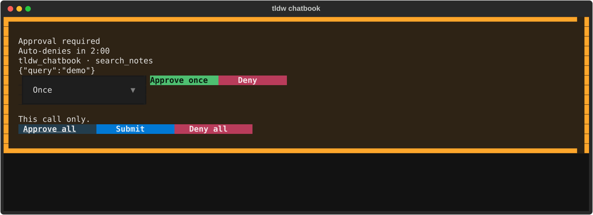

# Agent runs & tools — what happens when a reply uses tools, skills, and sub-agents

## What this page covers

When a Console reply needs more than plain text — running a tool, spawning a
sub-agent, executing a skill, or calling an MCP server — it becomes an *agent
run*. This page covers what you see while a run is in flight, how tool-call
approvals work, how background runs in other tabs surface, and how skills and
MCP tools plug in. For the Console screen itself see [Console](../console.md).

## Getting there

Open Console (**Ctrl+2**) and send a message — runs happen wherever you
chat, no separate mode to enable. The surfaces this page covers: the
transcript's inline tool rows, the **Agent** section in the left "Console
context" rail, the Inspector's status rows, the status chips above the
composer, and the approval and confirm cards that appear above the
transcript.

## Layout tour — what you see during a run

Each Console tab runs its own agent, and a run keeps going in the background
while you're on another tab. The first time you open a second tab (**Ctrl+T**),
a one-time banner spells it out:

> Each tab runs its own agent — up to 3 in parallel (change in Settings >
> Console Behavior).

The number is your configured cap (default 3). Sending past the cap is
refused with a message like "2 agents already running (…). Wait for one to
finish or interrupt it." Runs live only while Console stays open — see
[Console agent runs are screen-scoped](../index.md#console-agent-runs-are-screen-scoped).

**In the reply row itself** — while the turn works, the unfinished
`Assistant` row shows a live activity line in place of its (empty) text, so
a long tool call never looks frozen: `⚙ read_file · 4s` names the tool that
is running and how long it has been running, `Thinking… · 6s` means the
tool finished and the model is composing the next round, and `Generating…`
is the wait for the model's first response of the turn. The elapsed figure
advances while you watch. The line is live-only — it vanishes the moment
the reply's own text arrives, and a conversation you reopen later shows the
completed `Tool` rows below instead. A sub-agent's work never appears here;
it belongs to the **Sub-agents** panel in the left rail.

**In the transcript** — inline `Tool` rows appear between your message and the
reply:

- `⚙ toolname → result preview` — a tool call and a preview of its result,
  truncated with an `… (+N chars)` suffix past the display cap.
- `⤷ spawned sub-agent: …` — the agent delegated work to a sub-agent.
- `⚠ …` — an error summary.

**In the left rail** — expand the **Agent** section (collapsed by default):

- Status line: `Agent: idle`, or `Agent: running · step N` while working.
- One `·`-prefixed line per step.
- A **Sub-agents** panel appears once the reply has spawned at least one
  sub-agent — see [The fleet panel](#the-fleet-panel--three-states) below
  for its three states (collapsed summary, expanded rows, drilled into one
  child), how to cancel a child, and how its token spend shows up.
- **View full log** opens the "Full run log — <run id>" window: the complete,
  untruncated record ("what the model actually saw, before the Console's
  display cap trimmed it"). **Close** or **Esc** dismisses it.

**In the Inspector** (right rail) — the "Status:" line tracks the run
(`Status: Ready` / `Status: Generating…` / `Status: Needs approval` /
`Status: Source blocked` / `Status: Blocked`), and the "Run recipe" row summarizes provider / model /
sources / tools / approvals for the next send.

**In the status chips** (above the composer) — "Tools: N ready" counts the
tools available to the agent (the chip stays hidden until tools are counted,
which happens after your first send), and
"Approvals: N pending" counts tool calls waiting on you. The Approvals chip is
clickable: it jumps you to the pending approval card (with nothing pending it
just says "No approval is pending.").

## Features & controls

### Approvals — tools ask before they run

Nothing is ever auto-approved, and built-in tools always ask first. When the
agent wants to run a tool, the run pauses and an **"Approval required"** card
appears above the transcript:

- Each pending tool call gets a row with a decision select: **Approve once**
  (the default), **Approve for session**, **Always allow**, or **Deny**.
  Built-in tools don't offer "Always allow" — decisions for them last at most
  the session.
- Bulk controls: **Approve all** sets every row to Approve once, **Submit**
  applies each row's selected decision and resumes the run, **Deny all** sets
  every row to Deny.
- When exactly one tool call is pending, the row also gets fast **Approve
  once** and **Deny** buttons that resume immediately, skipping Submit.
- Watch the badges on a row's header: **(definition changed)** means the
  tool's definition differs from what you previously approved; **(high risk)**
  flags reads that could exfiltrate file contents; and a path warning —
  "path outside private scratch and bound Workspace folders; will fail even
  if approved" — means the file path will be rejected regardless of your
  decision.

An armed approval card does not expire — the run waits for your decision
however long you take. Stopping the run or closing the session withdraws a
pending card; nothing else does. If you'd rather have undecided calls
auto-denied on a clock, set `[mcp] approval_timeout_seconds` in
`config.toml` (seconds; `0`, the default, waits indefinitely — the skill
install and run-script confirm cards follow the same rule).

**Always allow** (MCP tools only) is remembered per tool, tied to the tool's
current definition — if the server later changes the tool, the approval card
comes back with a "(definition changed)" badge. Review or change a remembered
allow from the tool's row on the [MCP screen](../mcp.md) 🚧.

With sub-agents running in parallel (see below), more than one approval card
can be pending at once — cards aren't merged across sub-agents: each is
scoped to the one run that raised it, so deciding one card never resolves or
touches another's. Cancelling that sub-agent (see
[Stopping & leaving](#stopping--leaving)) withdraws only its own still-pending
cards; a sibling sub-agent's card, or the parent's, is left exactly as it
was. Within one session, Console shows only one card at a time, oldest-armed
first — a second round arming for the same session while another is still
pending queues silently and mounts its own card only once the earlier round
is decided.

### Interrupted provider tool runs — Resume, Take over, or Discard

For a provider integration that has opted into exact tool continuation, Console
checkpoints private state on the assistant reply that owns it. The checkpoint
can include private model state, tool arguments, and the exact bounded result
returned to the provider. It is not shown in the transcript, search, summaries,
run logs, errors, or usage displays.

Reopening, importing, or syncing a conversation never runs a tool. Instead, an
interrupted card offers recovery actions:

- **Resume** validates the original provider, model, API mode, and normalized
  base URL, resolves the credential from your current Settings/environment,
  and asks for fresh approval before any still-pending call runs. A rotated key
  therefore does not require editing saved continuation data.
- **Take over** is the corresponding explicit action for a checkpoint known to
  have arrived from another device. Sync does not provide a distributed lock;
  confirm the other device is no longer running the turn before taking over.
- **Discard** never executes a tool. It removes the private checkpoint; a blank
  assistant placeholder is removed, while already-visible assistant text is
  kept as ordinary non-resumable history.

A call saved as completed or failed is replayed as recorded and is never
executed again. A call saved as executing is deliberately **ambiguous**: the
side effect may have happened before the result was saved, so Resume is blocked
to avoid repeating it. Discard the interrupted run and start a new turn after
checking the external system.

For local-first Sync v2, each checkpoint change first commits with the message
and its local sync intent, then is projected idempotently into the durable
encrypted outbox. A configured but unavailable or memory-only outbox blocks a
new side effect; Console does not wait for remote acknowledgement. This is
crash recovery, not an exactly-once guarantee across devices, and it makes no
claim about a model provider's own retention or caching.

### Background & parked runs

Tabs with unwatched activity carry a status marker, listed in F1 help:

> Status markers: ● running · ◆ needs approval · ✓ finished · ✗ failed ·
> ◈ sub-agent ended in background — clears once you visit that tab. `Qn`
> is the unsent prompt count.

The `◈` marker is the cross-conversation completion indicator: a
background sub-agent of that conversation finished while you weren't
looking. Unlike the other markers it is **durable** — it survives leaving
Console and even an app restart — and it normally arrives together with
an auto-wake of that conversation's supervisor; see
[When a background sub-agent finishes — auto-wake](#when-a-background-sub-agent-finishes--auto-wake).
A completion that lands while you're on another screen also stages a deep
link: the next time Console opens, it switches you straight to that
conversation's session if it is still open — and when it isn't, the `◈`
marker stays the durable pointer to what finished.

- A background run that hits a tool approval **parks**: its tab gets a `◆`
  badge and you get exactly one toast — "Agent in <tab> (<workspace>) needs
  approval." Switch to that tab to review the card; parked approvals wait,
  they never resolve themselves.
- A background run that ends also toasts once: "Agent in <tab> (<workspace>)
  finished." (or "failed.").
- The left rail pins a fleet summary line whenever other tabs are busy:
  "N other agents running, M waiting for approval."
- Open session tabs show `Qn`, and open conversation rows show `Queue n`,
  without revealing queued text. Switch to that tab to see its queue shelf.
- A successful multi-prompt drain reports one final background completion;
  intermediate queued turns do not add completion toasts or finished markers.

### Named agents

Beyond a plain, generic sub-agent, the supervisor can delegate to a **named
agent definition** — a reusable persona with its own instructions and
optionally a narrower tool list or a different model. Create and manage
definitions in **Settings ▸ Agents** (Troubleshooting group); changes there
apply immediately but only take effect on the **next** reply, never one
already streaming.

- A definition's instructions are **appended** to the built-in sub-agent
  prompt, not swapped in — every sub-agent still starts from the same base
  identity.
- A definition's tools can only **narrow** what the sub-agent inherits from
  the parent (never grant something the parent itself couldn't use); its
  model override stays on the same provider.
- When a reply spawns a named agent, the transcript's `⤷ spawned sub-agent: …`
  marker and the Agent rail's per-sub-agent line both show it as
  `[<name>] <task>` while the run is live. That prefix is a display detail of
  the running turn, not a stored field — a session you reopen after the app
  restarts shows the sub-agent's task text without the `[<name>]` prefix, and
  the drill-in "Sub-agent · \<status\>" view never shows the name either.
- The run log durably records which definition ran, for future audit tooling
  — `agent_runs.agent_definition` (the definition's name) and
  `definition_fingerprint` (a content hash of its instructions, tools, and
  model at spawn time) are written on every named-agent spawn. Neither is
  currently surfaced in **View full log** or anywhere else in the UI.

### Change review — reviewing a turn's file changes

Change Review is **off for every new workspace until you explicitly enable
it** in **Settings > Workspaces**. The global `[change_review] enabled`
setting is only a capability switch; it never opts a workspace in by itself.
If Git, the global capability, or the workspace registry is unavailable, the
toggle is not offered and Console continues without change tracking.

Enabling prepares each bound folder in a bounded background queue. Settings
shows `preparing`, `ready`, or `failed` state and offers a retry for failures;
chat and file tools never wait for that preparation. A turn that starts while
a folder is still preparing or failed continues normally and gets an
alias-only warning explaining that Change Review skipped that folder. The
warning is not a snapshot and cannot enter Review, revert, retention, or
cleanup state.

The privacy tradeoff is explicit: Change Review stores shadow Git history in
the application's data directory, including file contents, for 30 days by
default (or the configured `[change_review] retention_days`). Disabling a
workspace stops new review snapshots but does **not** erase history already
retained; normal retention cleanup still governs that existing history.

When an agent turn edits files, the transcript shows a **turn file card**
directly under that turn instead of a plain summary line: a header with the
counts ("✎ Edited 3 files  +92 −468"), an **expand/collapse-all** toggle, a
**Review** button, then one row per changed file. Press **Enter** or click
a row to expand its diff in place — expanding is per-row and the diff
loads (and is cached) the first time you open it, so collapsing and
reopening a row is instant. Long paths are middle-elided to fit the row
(the start and end stay visible, with `…` in between); the row's tooltip
always shows the full, un-elided path. The card never mutates anything
directly; there is no undo or revert control on it.

The header's chevron toggle expands or collapses every row at once. The
first expand-all loads whatever diffs aren't cached yet one at a time (not
all in parallel), so a turn with many changed files doesn't launch a burst
of concurrent git work — collapsing again just hides the bodies, it never
throws away what was loaded.

Click **Review** (or press **`v`**, unchanged from before the card
shipped) to open the full **Review** screen scoped to *this card's own
turn* — no need to reselect it once the screen opens. Reach the same
screen from the selected transcript row or the run inspector's **Review
changes** action. Revert-all and the other destructive actions live only
on that screen, behind a confirm, never as a one-keystroke action in the
transcript.

#### Leaving feedback on a hunk

Expand a row and each hunk of its diff gets its own block with a small
**✎ note** action beneath it. Click it, type a short note, and press
**Enter** to save (**Escape** cancels without saving). The note renders in
place under that hunk; while it's still unsent it carries a **✕** to
delete it. You can leave more than one note per hunk, and notes on
different hunks and files are independent.

A note you leave doesn't go anywhere by itself — it's picked up
automatically the next time you send a message that the agent runtime
handles (not a plain-provider send with the agent runtime off). At that
point every note still pending across the conversation is bundled into
your message as extra context under a "Diff feedback from the user"
heading, and once the reply is produced a TOOL-role row appears in the
transcript disclosing exactly what was attached, e.g. `📝 Diff feedback
attached — a.py @@ -1,4 +1,6 @@: "use the cached value here"` (one line
per note). A live card is reused in place across transcript syncs and
never reloads its own notes, so on the still-open card the **✕** stays
put even after delivery — pressing it can no longer delete a delivered
note, though. The row only shows the **✕**→`sent` swap the next time the
card is rebuilt from scratch (conversation resume or reopen); at that
point the note is read-only and part of the record.

A note stays pending — and is never silently dropped — whenever it
can't actually reach the model: the run fails before producing a reply
(so nothing was sent — it rides the retry), your send doesn't go through
the agent runtime at all, or you've queued more feedback than fits one
message (older notes go first; anything left over waits for your next
send). Only feedback that genuinely reached the model gets the `sent`
marker and the disclosure row.

If change tracking failed for one of a turn's roots, that failure shows up
as its own plain-text disclosure row next to the card, not inside it — the
same row the transcript rendered before the card shipped. When *every*
root in a turn failed to track, there is nothing left to count, so the
turn gets no card and no summary row at all — only the per-root failure
disclosures. And if a change spans a nested repository the tracker
excluded, the card and the marker row are both silent about it; that
exclusion is visible only in the full **Review** screen (`v`), which reads
it from the stored snapshot.

**`[console] turn_file_cards`** in `config.toml` (default `true`) is a pure
presentation kill switch: set it to `false` to fall back to the original
plain-text marker row (`` ✎ Edited N files  +A −D — review with `v` ``,
byte-identical to the pre-card behavior) — no card, no note UI, no Review
button, no expand-all. `v` and the inspector's Review changes action work
identically either way. Turning the switch off does **not** lose any
feedback you already queued: notes created while the card was on still
auto-attach and deliver on your next agent send, disclosure row included,
exactly as if the switch had stayed on.

The "✎ A sub-agent edited N files after this turn" row (see [Parallel
sub-agents](#parallel-sub-agents-the-fleet) below) renders a card too, and
by design it covers the same run's full set of tracked changes — turn and
post-turn windows alike — the same union the `v` Review screen shows for
that run. It supports notes and Review exactly like a turn's own card.

#### Reviewing or undoing a turn's changed files

Each completed agent turn keeps its own **Edited N files** card in the
transcript. The card is the quickest place to inspect what that turn did:
expand individual files (or all files), read their diffs, leave notes, or
choose **Review** for the full Change Review screen. The historical card
stays in the transcript after an undo so the user can still audit what the
agent changed.

Choose **Undo All** to restore every file changed by that turn. The button
stays disabled until the exact snapshot rows have loaded, then opens the
same confirmation used by Change Review. If a file was edited after the
turn, the confirmation names it and warns that the undo will overwrite
that later work. Cancel leaves the workspace unchanged and makes Undo All
available again; a complete undo labels the card **Undone** while keeping
its rows and **Review** action.

Undo All refuses while an agent run is active or when change tracking is
incomplete. A turn can also contain multiple tracking windows for the same
workspace (for example, overlapping parent/sub-agent activity). The compact
card cannot establish a safe ordering for that case, so it refuses the
inline undo and opens **Review** instead. Ordinary turns spanning different
workspace roots are supported; warnings include the workspace name so
same-named files remain distinguishable.

#### Leaving feedback on a diff line or the whole file

Inside the Review screen, select a file in the tree and press **Enter**
to focus its diff pane, then **↑/↓** move a line cursor over the
rendered diff (Page Up/Down/Home/End keep scrolling natively — only
up/down/`c`/Escape are reclaimed while the pane is focused). Press **`c`**
to comment on the line under the cursor: a one-line input opens under the
pane, **Enter** saves it, **Escape** cancels back to the pane. Press
**`C`** — or the **Comment file** button next to the totals — to leave a
comment on the whole file instead, regardless of where the cursor sits.
The footer spells out the keys: `j/k files · Enter diff · c comment line
· C comment file · Esc back`.

Escape while the pane is focused moves focus to the changed-file tree
rather than dismissing the screen — press Escape again from the tree to
actually leave. That's deliberate: a stray Escape while reading a diff
should never close the whole screen out from under you.

A saved line comment appends a dim `● comment` marker to the end of its
diff line, so it stays visible as you keep reading. The notes strip below
the pane lists every note on the focused file — hunk notes from the
card, file comments, and line comments together — each labeled by kind
(`hunk`, `file`, or `line <index>`) ahead of its text. A note still
pending carries a **✕** to delete it; once delivered to the agent the row
shows `  · sent` instead and drops the delete control — delivered notes
are the record, the same pending-vs-sent rule the card's hunk notes
already follow.

Line and file comments join the exact same auto-attach delivery loop as
hunk notes: everything still pending goes out on your next agent-runtime
send under the "Diff feedback from the user" heading, gets stamped and
disclosed the same way, and survives session resume identically. The
disclosure line is kind-aware — a hunk note still reads `📝 Diff feedback
attached — a.py @@ -1,4 +1,6 @@: "note"`; a whole-file comment reads
`📝 Diff feedback attached — a.py (whole file): "note"`; and a line
comment reads `📝 Diff feedback attached — a.py @@ -1,4 +1,6 @@ line:
"note"` — one line per note, oldest first, byte-identical whether you're
watching it happen live or reading it back after a resume.

#### Git actions in change review

The Review screen's turn selector can carry one more entry above the
recorded turns: **Working tree (current)** — the real, live state of your
repository's working tree, read fresh from disk each time you open it
(**not** a `change_snapshots` row, and not something an agent turn wrote).
Selecting it swaps the file tree and diff pane over from "what this turn
changed" to "what's different right now" — you get **`g` commit**, **`p`
push**, and **`P` open PR** in place of the turn-mode revert/comment keys,
spelled out in the footer while you're in this mode.

**When it appears.** Two things both have to be true:

- The workspace root — a folder bound to this conversation's workspace
  (see [Sessions, tabs & workspaces](sessions-tabs-workspaces.md) for
  where those bindings are set), or the root a recorded turn already
  wrote to — must itself **be** a git repository's toplevel. A folder
  that is merely *inside* a repository (a subdirectory of a real
  checkout) is refused with "workspace is inside a repository — git
  actions need the workspace root to be the repository root"; bind the
  repository's own root instead.
- **`[change_review] git_actions`** in `config.toml` must be on (default
  **`true`** — the feature ships on). Turning it off makes the whole
  `current` entry, and every action below, disappear; nothing else about
  Change Review changes.

With no repository detected at all (or the switch off), the selector only
ever lists recorded turns, exactly as before this feature existed.

**Commit (`g` / the Commit… button).** Opens a checklist built from a
**fresh** read of the working tree taken the moment you press `g` — never
the possibly-stale list you're looking at — with every changed file
pre-checked (uncheck to exclude one). A commit message is required; an
optional "create branch first" field checks out a new branch before
staging. The dialog also shows non-blocking **warnings** — they never stop
the commit — for a detached HEAD ("this commit will not be on any
branch") and for committing straight to `main` or `master`. Committing is
**refused outright before the dialog even opens** while an agent run is
active on that workspace. A repository that is mid merge, rebase, or
cherry-pick is also refused, but at the moment you confirm rather than
before the dialog opens — finish or abort that operation first. (The check
runs then because the repository can enter a merge while the dialog is
open, so checking earlier could only promise something that later stops
being true.)

**Push (`p` / the Push… button).** Always confirms in a dialog first,
naming the repository, the branch, and where it's going — including the
remote's actual **URL**, not just its name. That matters when the
repository redirects pushes to a different host than it fetches from
(`remote.<name>.pushurl`, or `url.<other>.pushInsteadOf`), which is a
perfectly normal setup — fetching over https and pushing over ssh, say.
Those redirects are honoured rather than refused; the dialog simply tells
you where the push will actually land, so the confirmation says as much as
`git remote -v` would. A branch with no
upstream yet gets one set on this push; with an upstream already
configured, push targets exactly that upstream's remote and ref — never
"whatever the repository's push configuration would have done" (see the
no-force guarantee below).
Unlike commit, **push is not refused while an agent run is active** — it
only ships state you (or the agent) already committed and never touches
the working tree, so there is nothing for a concurrent run to collide
with. A credential failure (no non-interactive credential helper or SSH
agent available) reports its own reason with a hint rather than hanging
the app waiting on a prompt that can never appear.

**Open PR (`P` / the Open PR button).** Opens your browser to a
compare/new-merge-request page on **github.com**, **gitlab.com**,
**bitbucket.org**, or **codeberg.org** — whichever the branch's upstream
remote points at. The branch must already be pushed (has an upstream) or
this refuses with "push the branch first". Any other host answers
honestly that PR links only support those four.

**The no-force guarantee.** None of these three actions ever force-pushes
or rewrites history — not `--force`, not `--force-with-lease`, not an
amend. Nor can your repository's own configuration turn one of these
pushes into a force: each push names one exact source and destination ref
on the command line, which supersedes any `remote.<name>.push` refspec or
`push.default` setting in `.git/config` (and a `remote.<name>.mirror`
remote is *rejected* outright rather than silently honoured — git refuses
to combine `--mirror` with a refspec). So exactly one branch is ever
updated, and only as a fast-forward. The one thing a push can add beyond
that branch is tags: with `push.followTags = true` set in your config, git
also publishes annotated tags reachable from the commits you just pushed.
That is additive only — it creates tags the remote does not have and can
never move or delete one it already has. A push that the remote rejects
(e.g. it's behind) reports git's own rejection message rather than
retrying with force; you resolve it from a terminal exactly as you would
any other rejected push.

**What the diff pane shows is your real diff.** The pane never renders a
custom diff driver's output, so a `diff.external` program or a
`.gitattributes` `textconv` driver configured in the repository cannot
substitute its own text for a file's real change, blank the pane for a
file the list shows as changed, or colour-code it into unreadability.

### Parallel sub-agents (the fleet)

Sub-agents the supervisor spawns within a **single reply** no longer run one
at a time — up to a configured number can be live together, each working its
own task concurrently. The Agent rail shows this directly: several
`●`-prefixed sub-agent lines can be running at once (see
[Layout tour](#layout-tour--what-you-see-during-a-run) above).

- **How results come back.** The supervisor has to explicitly collect a
  sub-agent's result before it can use it — spawning one hands back a
  handle, not an answer. It gathers results with its own internal
  `wait_agents` step (optionally for just one sub-agent, to get that one's
  answer back in full rather than sharing a combined budget with its
  siblings) and can check progress without blocking via `check_agents`. This
  is internal turn mechanics, not something you drive — the reply you see
  simply arrives once every sub-agent it waited on has finished, and by then
  it has already folded each result into its answer.
- **Skills still run one at a time.** Running a skill (`$name`) always
  returns that skill's own output directly into the same turn, never a
  fleet handle — skills are not part of the parallel fleet.
- **How many can run at once.** Capped at `[agents] max_live_subagents` in
  `config.toml` (default **3**; no Settings UI switch — hand-edit the file).
  The cap applies to the **conversation**, not to one reply: a sub-agent
  that is still working when its reply finishes keeps holding its slot, so
  the next message you send can only start as many new sub-agents as there
  are free slots left (see [When a sub-agent outlives the
  reply](#when-a-sub-agent-outlives-the-reply)). Be aware of what the cap
  is *not*: it is per conversation **and** per running app, so two
  conversations can each run the full cap at the same time, and nothing
  caps the total across all of them.
  Setting it to `1` turns the fleet off entirely: sub-agents go back to
  running one at a time, synchronously, exactly as before. Trying to spawn
  a sub-agent past the live cap is refused ("live sub-agent limit reached
  (N already running); call wait_agents to collect a finished sub-agent
  before starting another") rather than queued — the supervisor collects
  a finished sub-agent to free a slot, then retries, and the refusal itself
  doesn't count against its per-turn spawn budget. A bad value in the
  config file never stops a run: zero or a negative number floors to `1`
  (fleet off), and anything that isn't a number at all (letters, a blank)
  falls back to the default of `3` (fleet on) — either way the run
  proceeds instead of erroring.

#### The fleet panel — three states

The **Sub-agents** panel inside the Agent rail section has its own header
(title + chevron), independent of the Agent section's own collapse state —
it only appears once the reply has spawned at least one sub-agent, and it
reaches a real terminal status (done/error/stuck/cancelled) for each child
**while the turn is still running**, not only after the whole reply
finishes.

1. **Collapsed** (its default state the first time it appears). Just the
   header: "Sub-agents" plus a right-aligned summary — one status glyph per
   child, in spawn order (e.g. `●●✓`), then "N working, M done". "Working"
   means still running; done/error/stuck/cancelled all count toward "done"
   here.
2. **Expanded** — click the chevron: one two-line row per child.
   - Primary line: status glyph, the child's name/task, and — for a child
     still live in the current process — an elapsed segment (`· 12s`,
     `· 1m 4s`). A historical/resumed row (a conversation reopened after a
     restart, or one this process never ran live) shows no elapsed segment;
     see *Known gaps* below.
   - Secondary line: the child's last step, result, or error text, dimmed,
     with the child's measured token spend appended once it finishes — see
     *Token spend*, below. Both are **transient**: they come from the live
     fleet, so when the whole turn ends every row falls back to the sparser
     historical rendering (name and task only). See *Known gaps*.
3. **Drilled in** — click a specific row: the whole Agent section switches
   to that one child's own view (`Sub-agent · <status> (Back)` plus its own
   step lines), and the Sub-agents panel itself is hidden while you're
   drilled in. **Back** returns to the overview. Each row resolves directly
   to its own run — clicking never cycles you through other sub-agent runs
   first.

**Cancel one child.** Focus a still-running row (Tab into the panel, or
click a row then Tab) and press **Delete** — this cooperatively cancels
just that child and withdraws (denies) any of its own approval cards still
pending; a sibling child keeps running, untouched. A row for a finished,
errored, or already-cancelled child — or any historical/resumed row —
doesn't offer this gesture at all, since there's nothing left to stop.

**Cancel all agents.** While at least one child of the conversation is
live, the rail's Agent section also offers a **Cancel all agents** button
— one press cancels every live child of that conversation, including
survivors of earlier replies, through the same per-child mechanism as the
row's Delete (so each child's pending approval cards are withdrawn too).
The button only appears while something is actually live; a panel full of
finished rows doesn't offer it. See
[Stopping a run vs. stopping its sub-agents](#stopping-a-run-vs-stopping-its-sub-agents)
for how this differs from **Stop**.

**Token spend.** A live child's measured token spend (prompt and
completion combined) appears on its row once it finishes — but only while
some part of the turn is still live; see *Known gaps* for what happens to
the row afterwards. The same figure is folded into the Console cost chip's
token total — the chip's
tooltip breaks it out separately as "Sub-agents: N tok (not priced)". It
never becomes a dollar figure: the measurement is one combined number with
no input/output split, so there is no honest per-model rate to price it
at — an unpriced count was chosen over either fabricating a dollar amount
or discounting the primary transcript's own already-priced total just
because a fleet ran underneath it.

When the **last child of a conversation's fleet finishes**, the whole
turn's provider-reported usage — the reply's own calls plus everything its
sub-agents billed, survivors included — is re-attached to the originating
assistant message's own usage row, saved with the conversation, and the
chip's unpriced sub-agent line falls back to zero. Until that moment a
survivor's post-turn spend shows on the chip line only.

**Known gaps** (filed, not fixed):
- Historical/resumed rows never show elapsed time. The timestamps exist in
  the run database, but the code path that rebuilds a resumed row doesn't
  read them yet (task-15200). The same task also covers `stuck` and
  `cancelled` rows not getting their own status color — they still render
  distinctly by glyph (`⚠`/`✗`), just not by color, so they're
  distinguishable but not visually called out.
- Row detail is transient, not durable. Elapsed time, the secondary line
  and the token count are read from the live fleet, so they exist only for
  a child this app process actually ran. A row for a child that has already
  reached a terminal status is dropped from the panel when your **next**
  message starts, and a conversation you reopen later (or after a restart)
  falls back to the sparser historical rendering — name and task only. A
  child that is *still working* keeps its full row across the reply and
  across later turns; that part changed in fleet PR 3a-1 (task-15200 covers
  restoring the elapsed time and the secondary line from the run database;
  the token count cannot be restored that way at all — `agent_runs` has no
  column for it — so that dimension stays live-only until the schema gains
  one).
- There is no "View all" tail, and expanding the panel does not scroll it
  into view. With a dozen-plus children, or several rail sections open
  above it, you may need to scroll the rail manually to reach the last
  rows (task-15201).

#### Steering a running sub-agent

You — and the supervisor — can send a message to a sub-agent **while it is
still working**, without cancelling or restarting it. Two paths, one
mechanism:

- **You, from the panel.** Drill into a *live* child's row: a compact
  steering input appears in the Agent rail (between the child's view and
  its Back button). Type and press Enter. The child sees your text as a
  user-role message in its own transcript, prefixed
  `[Steering from user]`. The input only exists for a live child's
  drill-in — the overview and a finished child's drill-in never show it
  (a finished child takes no more model turns).
- **The supervisor, mid-turn.** The supervisor has its own internal
  `send_to_agent` step for the same mailbox — its entries arrive prefixed
  `[Steering from supervisor]`, so the child (and its run log) can always
  tell the two sources apart. This works on any live child of the
  conversation, including a survivor an *earlier* reply spawned.

**Queued, honestly.** Steering is not injected mid-thought: it is queued,
and delivered at the child's next model turn — at a safe boundary that
never splits a tool call from its result. Until the child consumes it, the
child's panel row appends `· steering queued (N)` and the drill-in input
shows its own `steering queued (N)` line; both clear when the child picks
the entries up. If the child is inside a long tool call, delivery waits for
that call to return — so "queued" can stand for a while, and that is the
honest state, not a failure.

What steering **never** does:

- It never cancels, restarts, or reorders the child — the run continues
  exactly as it was (the supervisor's `send_to_agent` confirmation says
  so in as many words).
- It never satisfies an approval. If the child is waiting on one of your
  approval cards, the card is completely unaffected — the child only sees
  the steering after you answer the card and its next model turn comes.
- The prefix is applied by the mechanism, never trusted from the text —
  typing your own `[Steering from …]` prefix doesn't impersonate anyone.

One message is capped at 4,000 characters; the panel input refuses an
oversize entry with a note and keeps your draft so you can shorten it.
The **primary** agent has no steering input — you steer it by talking to
it — and inline (non-fleet) sub-agents cannot be steered at all.

#### Continuing a finished sub-agent

Once a child has **finished**, steering is over — but the supervisor can
still follow up: a `send_to_agent` to a finished child starts a **new run
of the same agent, seeded with the finished child's full transcript**, any
steering it never got to read (original labels preserved), and the new
message. This is supervisor-only: the panel watches and steers, it never
launches — ask the supervisor in chat ("ask the researcher to also check
X") and it resumes the child itself.

- **It is a new run, honestly labeled.** The old run is not restarted —
  the supervisor's confirmation names the new run's id, the panel gets a
  fresh row, and the drill-in header of the resumed run reads
  `· resumed from <old run id>`. A resume costs a spawn slot and counts
  against the live cap, exactly like any spawn. Its token figure is the
  new run's own — the finished original's spend stays with the original
  row while it lasts, so a continued task's *combined* spend is never
  shown as one number (task-18311).
- **What can be resumed.** Retention is per-conversation and in-memory:
  the last `[agents] retained_transcripts` finished children (default
  **5**; `0` disables retention entirely) with transcripts up to
  `[agents] retained_transcript_max_chars` (default **200 000**) are kept,
  oldest evicted first. A **cancelled or superseded** child is never
  retained — cancelling is a statement you're done with it. An oversize
  transcript is not retained either (truncating it would silently change
  the agent's memory), and the refusal says so.
- **Restarts forget transcripts.** After an app restart the supervisor is
  told the transcript "does not survive an app restart — spawn a fresh
  sub-agent instead". Cross-restart resurrection is deliberately out of
  scope.
- A second resume of the same finished child forks from the same snapshot
  (the first resume does not consume it).

#### When a sub-agent outlives the reply

The supervisor doesn't have to wait for every sub-agent it started. If it
answers you without collecting one, that sub-agent **keeps working after
the reply finishes** — the turn is over for you, not for it.

What this means in practice:

- **The reply you read does not contain that sub-agent's result.** The
  supervisor answered without it, deliberately. When the sub-agent later
  finishes, its completion **wakes the supervisor**, which acts on the
  result in a fresh, clearly machine-triggered turn — see
  [When a background sub-agent finishes — auto-wake](#when-a-background-sub-agent-finishes--auto-wake)
  below. The finished work itself is always durable in the sub-agent's
  own run record (**View full log**) and in any files it edited.
- **It stays visible.** The **Sub-agents** panel keeps its row — glyph,
  name/task, elapsed — after the reply lands and across the turns that
  follow, and clicking that row still drills into that child. The summary
  keeps counting it under "N working". While only survivors are running,
  a once-a-second tick keeps the elapsed segment advancing on its own and
  paints the row's terminal glyph the moment the child settles; the tick
  stops itself as soon as nothing is live (task-15664).
- **It stays cancellable.** Focus the row and press **Delete** (see
  [The fleet panel](#the-fleet-panel--three-states)). The cancel is
  *cooperative*: the child notices between its own steps, so if it is
  waiting on a model response the row can stay `●` for another several
  seconds before flipping to cancelled — whatever it had produced up to
  that point is kept as its result.
- **Stop doesn't reach it — or any other background sub-agent.** Pressing
  **Stop** cancels the supervisor's *turn*; sub-agents keep working. See
  [Stopping a run vs. stopping its sub-agents](#stopping-a-run-vs-stopping-its-sub-agents)
  for the full contract and the kill switches that *do* reach them.

**What bounds it.** Three separate limits, none of which is a promise the
others make:

- **Wall clock, per child** — `[agents] child_max_wall_seconds` in
  `config.toml` (default **1800**, i.e. 30 minutes). A background child
  gets its own ceiling rather than whatever was left of the turn's.
  The ceiling is checked *between* the child's steps, so a child stuck
  inside a single long provider call is not cut off until that call
  returns.
- **How many at once** — `[agents] max_live_subagents`, which counts
  survivors from earlier messages against the same cap. Per conversation
  and per running app: N conversations can hold N × the cap between them.
- **Tokens, per run** — each child runs against a run token ceiling of
  its own rather than a slice of the parent's remainder, so a fleet's
  worst-case spend scales with the number of children, not with what the
  parent had left.

**Changes it makes to files.** Change review keeps a survivor's edits in
their own record instead of folding them into whatever turn happens to be
running: a turn that ends with children still working gets a
"✎ A sub-agent edited N files after this turn" row, and a turn that
*starts* while an earlier turn's child is still writing is stamped
"⚠ a sub-agent from an earlier turn was still writing during this turn —
some of these changes may be its, not this turn's". Change tracking diffs
a working tree and cannot tell two writers apart, so it discloses the
overlap rather than implying sole authorship.

**If the app restarts.** A child still running when the app exits cannot
survive the process. The next time Console opens the run database (once
per app run), every row left `running` is swept to **error** with the
result "Interrupted by app restart" — so a killed child shows up as
errored, not silently missing. The sweep assumes one app instance per data
directory; a second instance sharing the same directory would flip the
first's genuinely-running rows.

**Honest limits of the current release:**

- A survivor's token spend reaches the cost chip's `Sub-agents: N tok
  (not priced)` line **while some child of the conversation is still
  running**. Once the last child finishes, the spend is folded into the
  assistant message's own usage row, saved with the conversation (it
  survives closing and reopening Console), and included in the JSON
  conversation export's per-message `usage` records. Two limits remain:
  quitting the **app** before the last child finishes loses whatever a
  survivor billed after its turn — that remainder is recorded nowhere
  durable — and the plain-text conversation export contains no token
  figures at all.
- The supervisor can act while you are not watching — deliberately. A
  finished background sub-agent wakes its supervisor and notifies you
  from any screen (see
  [When a background sub-agent finishes — auto-wake](#when-a-background-sub-agent-finishes--auto-wake)),
  and as long as Console is open the wake turn fires immediately rather
  than waiting for you to look at it: acting on results without a human
  keystroke is what auto-wake is for. "Open but not watched" is the
  ordinary case here — a dialog, the command palette or the destination
  menu covering Console, or a different session tab in front. You always
  learn of it: the toast fires the moment the sub-agent finishes, and a
  wake that delivers while you're not viewing that conversation leaves
  the `◈` marker set on it until you view the delivered result. When no
  Console is open at all — before the first Console open after a
  restart, or after you have left Console for another screen — the
  completion is staged durably and delivered when Console next opens.
  *(This paragraph previously promised the wake was "never acted on
  invisibly in the background" while you were elsewhere; corrected
  2026-08-14 — the wake does act, and the `◈` marker is the guarantee
  you find out. A second correction the same day, task-16300: it also
  said the wake fires from "a live Console you navigated away from".
  That described a bug, not a feature — navigating away while a dialog
  was open used to leave the old Console screen running invisibly behind
  the new screen. Leaving Console now genuinely closes it, so a
  completion after you leave is staged, exactly as the "Leaving the
  Console screen" note below has always said.)*

**Turning it off.** Set `[agents] subagents_outlive_turn = false` in
`config.toml`: sub-agents are then settled at the end of the turn that
spawned them, exactly as before this behavior existed. Setting
`max_live_subagents = 1` removes it too, by removing the fleet entirely.

#### Stopping a run vs. stopping its sub-agents

With `[agents] subagents_outlive_turn` on (the shipped default), **Stop
cancels the supervisor's turn only** — sub-agents are not part of the
blast radius. A child that was mid-work when you pressed Stop keeps
working; if the Stop landed while the supervisor was collecting results,
the stopped reply ends with "(The run was cancelled; sub-agents continue
in the background.)". That "continue" connects to
[auto-wake](#when-a-background-sub-agent-finishes--auto-wake): each
survivor's completion wakes the supervisor and delivers its result in a
fresh turn — unless you've set `[agents] autowake_enabled = false`, in
which case "continue" yields a *recorded* completion (toast, `◈` marker,
ledger) that is delivered only when you turn the wake back on. A stopped
turn's survivor is still a first-class fleet member: its row stays live,
it still [drains steering](#steering-a-running-sub-agent), and its pending
approval card — if it was waiting on one — stays waiting for your answer
rather than being denied by the Stop.

The kill switches that **do** stop sub-agents:

- **Delete on a row** — cancels that one child (and denies its pending
  approval cards).
- **Cancel all agents** — the panel button; every live child of the
  conversation, one press.
- **Closing the session** (the tab's destructive close) — a closed
  session's messages are purged, so its fleet dies with it; every live
  child is cancelled through the same per-child path as Cancel all.
  (Navigating away from Console is different — that keeps survivors; see
  [Stopping & leaving](#stopping--leaving).)
- **`[agents] subagents_outlive_turn = false`** — restores the old
  contract wholesale: Stop (and end-of-turn settle) takes the whole tree
  down, exactly as before, and the stopped reply's note reads "(…
  sub-agents were stopped.)" instead.

Quitting the app still takes everything with it — a sub-agent cannot
outlive the process (see "If the app restarts", above).

#### When a background sub-agent finishes — auto-wake

A background sub-agent that finishes after its turn does not sit silent
until you happen to return. Its completion **wakes its supervisor**: a
new turn fires automatically in the conversation that spawned it,
carrying the finished result (read from the sub-agent's durable run
record), and the supervisor acts on it without you sending anything.

What you see, wherever you are:

- **A toast** on whatever screen you're on, naming the conversation and
  the honest outcome — "Background sub-agent finished in “…”.", or for
  several at once "3 background sub-agents in “…”: 2 finished, 1
  failed." Failed and cancelled are always named, never folded into
  "finished".
- **The `◈` marker** on that conversation's tab and sidebar row (see
  [Background & parked runs](#background--parked-runs)). It is durable —
  restart-proof — and clears when you view that conversation. A wake
  that delivers while you're watching that conversation clears it too;
  a wake that delivers while you're anywhere else leaves it set, so the
  marker always points you at a result you haven't seen yet.
- **In the transcript**, a System-class notice row — never a message
  from you. The notice is machine-origin and says so in its own text: it
  opens "[Background sub-agent completion — automated notice]" and
  states verbatim that it "is not user input, and it is not approval or
  consent for anything". No user row is written, and your composer draft
  is never touched or consumed by a wake.

**A woken turn grants nothing.** It is a normal turn under every
existing rule: tool calls still raise their approval cards, risk floors
are unchanged, and nothing in the injected notice can approve, resolve,
or consent to anything — a pending approval card is only ever resolved
by your explicit decision. Every cap (parallel runs, per-child wall
clock, token ceilings) applies to a wake turn unchanged.

**Exactly-once, by ledger.** Every sub-agent run has a durable
wake-delivery stamp in the run database (`agent_runs.wake_delivered_at`
— the ledger). One wake bundles *all* of a conversation's undelivered
completions; each delivered run is stamped only after the wake turn was
actually accepted, and a run whose stamp is set is never announced
again. That is why a restart after a wake has been delivered does not
re-announce anything at the next launch, and why a sub-agent that
finishes *during* a wake turn simply rides the next one. The `◈` mark is
only the trigger and indicator; the ledger is what defines which
completions are still owed.

There is one narrow gap, and it is a deliberate trade rather than an
oversight: the stamp is written *just after* the wake turn is accepted,
so an app that is killed in the instant between those two — or a wake
turn that is still running when you quit — leaves a completion the
ledger still shows as owed. The next launch announces that completion
once more. You may therefore see the same sub-agent result reported
twice; you will never see it lost, and it cannot repeat beyond that one
extra time, because the second delivery does stamp. (Measured on
2026-08-17, both in a test and in a live run.)

**You always win ties.**

- A wake defers while the Console composer holds a non-empty draft — in
  *any* session, not just the one being woken — and fires only once the
  draft is sent or cleared. If the app cannot tell whether you're mid-
  thought, you win.
- A wake also waits like anything else would: it defers while its
  session is busy — streaming, holding a pending approval card, or
  draining a queue — and retries when the session goes idle.
- You cannot queue prompts *behind* a wake turn: queueing rides an
  accepted prompt chain, and a wake starts none. While a wake turn is
  streaming, sending behaves like any other busy moment — it waits.

**Leaving Console no longer parks the supervisor.** A sub-agent that
finishes while you are on Library, Watchlists, or any other screen wakes
its supervisor there and then: the wake turn runs, its result is written
to the conversation, and the `◈` mark stays set so you can see on return
that something happened while you were away. Navigating back shows the
completed turn already in the transcript.

**A wake you were owed is delivered at the next launch, without opening
Console.** Nothing runs while the app is closed — a completion that
lands then is recorded durably (the `◈` mark plus the ledger) and waits.
At the next start, once the app is up and interactive, any conversation
that still carries a `◈` mark *and* still owes a result has its
supervisor woken there and then: the conversation is reopened in the
background, the turn runs, and you find it already in the transcript
with its `◈` still lit when you open Console. Nothing else is woken —
never a conversation without a mark, and never one whose results were
already delivered — and the whole thing is off when `[agents]
autowake_enabled` is off (there is no separate launch switch). If you
have never run a background sub-agent, launch does exactly what it did
before: one indexed check that finds nothing.

If Console is your startup tab, the woken conversation opens as another
tab beside the one you landed on; it never switches you away from the tab
you started in.

One case cannot be delivered and is cleaned up instead: sub-agent work
started in a **temporary (unsaved) chat** belongs to a session that does
not survive the app, so there is no conversation left to wake. Its `◈`
mark is cleared at the next launch rather than left pointing at nothing.
Save the chat before starting long background work you want to come back
to.

A wake turn spends model tokens with no window open — the `◈` mark is
your signal that it did.

**A headless wake that needs approval asks you, wherever you are.** When
a woken turn reaches a tool that requires your approval, a toast names it
on whatever screen you're on ("Agent in “…” needs approval to use a tool.
Open Console to review — nothing runs until you answer."), the session
picks up its usual approval badge, and the round waits for you rather
than expiring. The tool does not run until you answer it. Nothing
auto-approves: navigating away from Console again denies the request (the
same rule as any card you leave unanswered), and so does quitting the
app. If you have set a positive `[mcp] approval_timeout_seconds`, it
still expires the request on schedule — being away does not buy the
request extra time. The shipped default is `0`, which means no deadline:
the request waits for you.

**The card is rendered and answerable the first time you open Console —
no session switch needed.** (Fixed as task-17500, 2026-08-17.) As first
shipped, opening Console in response to that toast showed the card's
"Approval required" title and *nothing else* — no tool row, no arguments,
no Approve/Deny buttons — until you clicked that conversation's session
tab. The cause was an ordering race inside the card itself: its initial
"hide the batch body" step was deferred mount work, and on a real
terminal the fresh Console screen's first paint delivered that hide
*after* the mount-time sync had rendered the round, unrendering it. The
hide is now construction state, so it cannot land on top of a rendered
card.

**While an approval waits, other conversations' owed wakes wait behind
it — by design.** Wake deliveries are serialized app-wide (one delivery
at a time for the whole app), so a pending approval round in one
conversation holds every other conversation's owed wake until you answer
it. Nothing is lost while it waits: the other conversations' `◈` marks
and ledger rows are already durable, and answering (or denying) the
round releases them immediately — observed live as a stalled
conversation delivering the instant a blocked round was denied. This is
the deliberate trade of the app-wide serialization invariant (one
`_delivering` per runtime; see the headless-wake close-out report). With
the card rendering correctly the hold is always answerable, so it lasts
exactly as long as you leave the question open.

One further limitation: if a woken turn arms two approval rounds for the
same conversation, only the most recent one has a card to mount; the
older one still has to be answered, and until it is, it keeps the badge
lit (task-15661).

**Turning the wake off.** Set `[agents] autowake_enabled = false` in
`config.toml` (default `true`; no Settings UI switch) and restart —
`config.toml` is read once at startup, so an edit does not take effect in
an app that is already running. OFF loses nothing: completions are still
recorded and the toast, `◈` marker, and ledger still work — the wake turn
just never fires. Turn it back on and the next trigger (a later
completion, the next Console mount, or the next launch) delivers
everything OFF recorded.

**What the marker looks like after a wake has run.** The `◈` is the
lowest-priority of the session markers, so once a woken turn has finished
in a conversation you were not watching, that session's tab shows the
finished-and-unvisited `✓` instead. Both mean "there is something here
you haven't seen"; viewing the conversation clears either.

### Local file authority

Every live Console Chat owns an independent private temporary scratch space.
No folder setup is required. Relative paths used by Chatbook's built-in file
tools and local `fs_*`/Git tools resolve in that Chat's scratch space unless a
named Workspace explicitly adds authority:

| Console context | Built-in file tools | Local `fs_*` / Git |
|---|---|---|
| Chat in Default | Private scratch only | Private scratch only |
| Named Workspace, no selected project folder | Private scratch plus live explicit folder bindings | Private scratch only |
| Named Workspace, selected project folder | Private scratch plus live explicit folder bindings | The selected binding only |

Workspace folders are optional and start read-only. Approval still applies:
path confinement cannot turn Ask into Allow, bypass a tool kill switch, expose
a protected credential path, or make a read-only binding writable. A denial
outside every allowed root says that Chats do not need a folder and points to a
named Workspace only when access to that external folder is intended.

Scratch belongs to the live tab, not the saved conversation. Two tabs for the
same conversation have different scratch spaces; closing and reopening starts
empty. Retained skill-script output and fallback agent run logs stay with the
owning Chat's scratch instead of a shared container. Normal cleanup is
best-effort deletion, not secure erase. A hard crash can leave unreferenced OS
temporary residue, but a later process never discovers or attaches it.

This boundary describes Chatbook-managed local tools only. Attachments,
Library/RAG content, generated media, provider-hosted tools, and external MCP
servers keep their own storage and authority contracts.

### Project instructions before tools run

When project instructions are enabled for a session, Chatbook treats the
selected folder as both the agent's working directory and its instruction
authority. A root `AGENTS.override.md` takes precedence over `AGENTS.md`;
an empty override falls back to the standard file, while an invalid override
fails closed instead of silently falling back. Instruction text is untrusted
user-level context, never system policy and never permission to bypass tool
approval.

Instructions for deeper folders load lazily when a path-aware tool targets
them. Chatbook walks only the binding-root-to-target chain, composes active
files broad-to-specific, and asks the model to reconsider the unchanged tool
batch before the normal review and execution steps. A content-free context
event names the newly active relative sources and scopes. Parent agents and
sub-agents share the run's 32 KiB nested-source budget, but each receives the
active context on its own model request.

Read-only bindings do not advertise write, edit, or patch tools. Selecting a
different authorized folder, a removed/retargeted binding, byte or token
limits, and unsafe or stale files surface as content-free warnings; they do
not expose file bodies in the transcript or run log. An explicit file-read
tool remains ordinary tool activity, so its result follows the usual review,
logging, and conversation-persistence rules.

### Skills

Skills are reusable instruction packs kept in Library ▸ Skills.

- **Run one** by starting your message with `$name` (arguments can follow:
  `$name your input here`).
- **`/skills`** lists what's installed as `$name — description` lines in the
  transcript. With nothing installed it says: "No skills yet — create them in
  Library ▸ Skills."
- **`/skills <name>`** doesn't run anything — it replies "Run skills by typing
  $name — /skills only lists them."
- A skill that hasn't been reviewed yet refuses to run: "Skill "name" isn't
  trusted (…) — review and approve it in Library ▸ Skills before running it."

When an **agent** (not you) tries something skill-related, a confirm card
appears above the transcript:

- **Skill install** — "An agent wants to install a skill:" with the source
  URL, buttons **Allow** / **Deny**, and the note: "It will be installed
  pending your review and cannot run until you approve it in Library >
  Skills." Allowing installs it, but it still can't run until you review it.
- **Skill script** — "An agent wants to run a script from a skill:" with the
  target and arguments, buttons **Allow once** / **Always allow this skill** /
  **Deny**, and the note: "It runs with a scrubbed environment in a temporary
  folder (not the skill's own folder); only its output comes back." Files the
  script intentionally produces are retained inside the owning Chat's private
  scratch space for that live session.

### MCP tools

Servers you configure on the [MCP screen](../mcp.md) 🚧 surface in Console as
extra tools the agent can call. The Inspector's **MCP** row (under Tools)
shows their state: "N tools ready", or "N servers enabled, not connected" when
servers are configured but unreachable. MCP tool calls go through the same
"Approval required" card as everything else. An external MCP server is not
confined by the Chatbook-local scratch boundary unless that server implements
an equivalent boundary itself; review its arguments and permission policy.

### Web research tools

Console's standard web tools are `web_search` (find links), `web_fetch`
(extract one URL), and `web_crawl` (bounded same-host crawl). They are local
agent tools, not tools supplied by an external MCP server. They are registered
by default. Configure their master switch in **MCP → Tools → Local workspace,
web, and Watchlists tools**, then choose Allow, Ask, or Off for each tool in MCP
Permissions. Console file authority comes from the Chat's private scratch plus
explicit Workspace bindings, not a global confinement-directory field.
`[mcp] expose_local_tools` is only for external MCP clients and does not enable
these tools in Console.

Web-tool results are ephemeral. To persist a page in Library, use **Library →
Import…** and submit its URL; Console does not advertise the retired
`ingest_media` placeholder.

### Library media chunk tools

Console agents get five `library_*` tools for reading ingested media by its
stored chunks — the difference between an agent that walks a book in blind
8,000-character windows and one that asks "where are the chapters?", fetches
Chapter 7 by address, and writes notes from it. `library_get_media_structure`
returns a book's heading tree with per-chapter chunk addresses;
`library_get_media_chunk` fetches one unit **from the chunks already stored
at ingestion** — deterministic and version-stamped; nothing is silently
re-chunked on a read. `library_list_chunk_specs` lists the saved chunking
specs. Items imported with "Chunk content" off degrade honestly: the
structure still shows the chapters, and the fetch error names the way out.

Two of the five write, and only when you opt in from the agent's side:
`library_save_chunk_spec` saves a custom chunking spec, and
`library_rechunk_media` re-chunks one item (an explicit tool call with a
spec — never a side effect of a read). Both run under runtime-policy actions
(`library.templates.save`, `library.media.rechunk`) that can be denied, they
write only your local Library database, and re-indexing the item into the
semantic index is a separate `reindex: true` opt-in. They advertise
themselves as writing tools in the approval card's tool description. Full
contracts: [Local Library Tools](../../Development/Agent-Tools/local-library-tools.md).
The tools ride the same `[console].direct_library_tools` setting as the
other Library tools.

### The study-notes fan-out pattern

A sixth `library_*` tool — and the third that writes — `library_save_note`, closes the student story the
chunk tools set up: *"make me per-chapter notes of this book"* (or
flashcards per section) runs as a fan-out over the ordinary sub-agent
machinery — no special orchestration:

1. **Structure.** `library_get_media_structure(id)` returns the chapter map
   with each chapter's chunk addresses.
2. **Spawn per chapter.** For each chapter the agent spawns a sub-agent
   (`spawn_subagent`, under the usual `[agents]` caps) with a narrow brief:
   fetch the chapter's units by address (`library_get_media_chunk`), derive
   the notes — or Q/A flashcard pairs — and save them with
   `library_save_note`: one note titled per chapter, content starting with
   the provenance header (`source`, `revision`, `chapter`, `chunks`), every
   save naming the same one-level folder for the book (the folder is
   created on first save; concurrent savers converge on one folder).
3. **Fetch and save.** Each sub-agent reuses the chunks stored at
   ingestion — nothing re-chunks behind anyone's back — and its note lands
   in the notes screen, grouped in the book's folder, the moment it is
   saved.
4. **Re-run.** Asked again later (new chapters, a re-chunk), the convention
   is search-first: `library_search_notes(query=<note title>)` finds the
   existing note — the list tool has no folder filter — and the agent
   updates it via `note_id` + `expected_version` instead of creating a
   duplicate.

Flashcards are Q/A markdown inside notes (`Q:`/`A:` pairs) — a deliberate
ruling: the real flashcards data layer has no screen route yet, so notes
are the one output a student can actually see. `library_save_note` is the
third policy-gated writing tool in the `library_*` namespace
(`library.notes.save`); full contract:
[Local Library Tools](../../Development/Agent-Tools/local-library-tools.md).

### Watchlists evidence tools

The same local-tools group provides `watchlists_search_items` and
`watchlists_get_item`. Results are local-first: both tools read the local
Watchlists database, and server Watchlists search is not yet supported. In
server mode they return a non-retryable unsupported result and do not search
the local database. Its logical fields are explicit: `status` is `unsupported`,
`retryable` is `false`, and `message` is exactly `server Watchlists search is
not supported; switch Watchlists to Local before retrying`.

`watchlists_search_items` returns newest-first, source-linked,
collection-aware valid JSON bounded to 30 KiB. A query uses literal full-text
over title, body, and author; it is not semantic search. Blank or absent
`query` browses recent items. Every feed-supplied field is untrusted evidence,
never an instruction.

#### `watchlists_search_items`

| Parameter | Contract |
| --- | --- |
| `query` | Optional string; blank browses newest items; maximum 512 characters and 32 whitespace-delimited terms. |
| `collection` | Optional non-blank name, canonical `local:watchlist:<id>`, or positive local row ID from 1 through 2^63-1; collection names are limited to 256 characters. |
| `source` | Optional non-blank name, configured URL, canonical `local:subscription:<id>`, or positive local row ID; source names or configured URLs are limited to 2,048 characters. |
| `statuses` | Optional non-empty, unique array of at most five values: `new`, `reviewed`, `ingested`, `ignored`, or `error`; absent includes every status. |
| `since` | Optional inclusive effective-date floor in `YYYY-MM-DD` or RFC 3339 form, normalized to UTC. |
| `limit` | Optional integer; defaults to 10 and accepts 1 through 50. |
| `cursor` | Optional non-blank opaque string of at most 2,048 characters returned by a prior call with the same normalized filters. |

Exact case-insensitive scope names win; otherwise one unique partial name is
accepted and ambiguous names return bounded candidate IDs. Collection and
source scopes intersect; source integer IDs use the same 1 through 2^63-1
range. Numeric strings remain names. Unknown parameters are rejected.
Booleans are not accepted as integer IDs or limits.

For “all,” follow `next_cursor` until `has_more` is `false`; one call never
removes the page bound. Continuation excludes later inserts but is not snapshot
isolation: updates, deletions, and collection-membership changes can alter
later pages.

#### `watchlists_get_item`

| Parameter | Contract |
| --- | --- |
| `item_id` | The required canonical `local:watchlist_item:<positive integer>` ID returned by search; maximum 40 characters. |

The item integer is limited to 1 through 2^63-1. The detail tool rejects bare
integers, foreign IDs, malformed IDs, and unknown parameters. Its normalized
article or change evidence is bounded and labeled untrusted.

Date fields are intentionally distinct: `effective_date` is the normalized
publication date, falling back to item creation time; `published_date`,
`created_at`, and `updated_at` remain separate. Source `last_checked` and
`last_successful_check` remain separate, too.

URL paths are authorized Watchlists metadata under the same explicit tool
permission; userinfo, query, and fragment are removed from every returned URL.
Only absolute HTTP(S) URLs with a host are returned. In Console, Ask can show
an approval card. External MCP additionally requires `[mcp]
expose_local_tools` to be true and each per-tool permission must be Allow; Ask
is refused because a headless client cannot show that card. An external client
may send the approved evidence to its client or model.

### Stopping & leaving

- **Stop** (appears next to Send while a run is active) stops **this tab's
  run only** — other tabs keep going, and (with the shipped
  `[agents] subagents_outlive_turn = true`) so do this run's own
  sub-agents: Stop cancels the supervisor's turn, not its fleet — see
  [Stopping a run vs. stopping its sub-agents](#stopping-a-run-vs-stopping-its-sub-agents)
  for the contract and the sub-agent kill switches (per-row Delete,
  Cancel all agents, closing the session, the config switch). The partial
  reply is `[stopped]` and a System row records "Response stopped by
  user." If that tab has queued prompts, they pause. Choose **Retry
  stopped** to retry the stopped turn before continuing, or **Resume
  next** to keep the stopped turn and continue with the next prompt.
- **Closing a session tab** is destructive — its messages are purged — so
  it takes that session's fleet with it: every live sub-agent, survivors
  included, is cancelled as part of the close (a survivor would otherwise
  outlive its own conversation, with no row left to cancel it from).
- Leaving the Console screen is different: after the "Leave Console?" confirm,
  every in-flight **turn** is cancelled and every pending or parked approval is
  denied — never approved. One thing survives the leave: a background
  sub-agent that already outlived its turn **keeps running** — its result
  lands durably, you get the completion toast + `◈` marker wherever you
  are, and the staged wake is claimed when Console next mounts (see
  [auto-wake](#when-a-background-sub-agent-finishes--auto-wake)). The next
  Console mount reports both fates honestly: "N agent runs were cancelled
  when you left Console." and/or "… sub-agents kept running in the
  background when you left Console — you'll be notified as they finish."
  The warning also counts queued sessions and unsent
  prompts. Staying leaves the queue and manager focus untouched; leaving
  clears process-memory queues. Closing one tab uses the same count-aware
  warning for that tab, and quitting the app reports the whole fleet. Details in
  [Console agent runs are screen-scoped](../index.md#console-agent-runs-are-screen-scoped).

### Agent run budget — how long and how expensive one reply may get

Every agent run is bounded by five limits, all in **Settings ▸ Console
Behavior ▸ Agent run budget**. A "run" is one message you send, from your
prompt to the agent's final reply — however many tool rounds that takes.

| Limit | Default | What it bounds |
|---|---|---|
| Token budget (per run) | 25,000,000 | Prompt + completion tokens spent by one run |
| Wall-clock limit | 86,400 s (24 h) | How long one run may take end to end |
| Per-tool-call limit | 3,600 s (1 h) | How long a *single* tool call may take |
| Model turns | 2,000 | Tool-calling rounds per message |
| Steps | 25,000 | Individual loop steps (a tool round costs 3) |

Changes apply to your next message — no restart.

**The token budget is the one that actually stops a long run.** This is the
least obvious thing on this page, so it is worth stating plainly: the whole
conversation is re-sent to the provider on *every* turn, so cost does not
grow with the number of turns, it grows with the *square* of it. A run
whose rounds add roughly 800 tokens each will exhaust a 25M budget somewhere
around turn 250 — nowhere near the 2,000-turn cap. That is expected. The
turn and step limits are backstops sized so they never become the surprise
limiter; spend is the real governor.

That same arithmetic is why raising the token budget alone rarely buys many
more turns: at ~800 tokens a round, the prompt at turn 250 is already about
200k tokens, which is where a 200k-context model stops accepting it anyway.
If you want genuinely long runs, the knob that changes the shape of the
problem is `[agents] run_log_evict_enabled` (below), not a bigger number
here.

**Sub-agents inherit these limits rather than sharing them.** Each
sub-agent gets its own full token budget, so one message that spawns two
helpers can spend about three times the number you set. Their wall-clock is
the exception — that comes from `[agents] child_max_wall_seconds`, so
raising the run's wall limit does not extend theirs.

**The token budget counts what a turn cost, not what it sent.** When your
provider serves part of the prompt from its cache — which Anthropic does by
default, and a long agent run is almost entirely cache reads by
construction — those tokens are billed at roughly a tenth of the uncached
rate, and the budget now counts them at roughly a tenth too. Cache *writes*
cost more than uncached input and are counted at their own higher rate. A
model with no published rates gets no discount. Output tokens are counted
one-for-one regardless, so the budget's strictness on output is unchanged.

In practice this means a cached run goes considerably further on the same
number than the raw token count would suggest — which is the point, since
the raw count was never what you were being charged.

**Raise the per-tool-call limit if you are running long tools.** A 24-hour
run budget will not save a crawl, ingest, or build that takes longer than
the per-tool-call ceiling; that is the limit that kills it. Lowering this
one below about 186 seconds is the risky direction — a call reported as
timed out may still be running, and an MCP tool can end up executing twice.
Setting it to 0 removes the ceiling but not Stop: cancellation is still
polled every 0.5 s while a tool runs, so pressing Stop interrupts the wait
(even though the tool's own thread may finish in the background).

**Setting the token budget to 0 means unlimited, and costs you your only
safety net.** The loop detector only catches a tool called repeatedly with
*identical* arguments; a loop that varies anything — an incrementing offset,
a slightly reworded query — walks straight past it. At a 2,000-turn cap the
token budget is the last thing standing between a stuck agent and an
unbounded bill.

**If you lower the step budget, lower it deliberately.** A tool round costs
3 steps (think, call, result) and the closing reply costs 1, so N turns need
`3*(N-1)+1` steps. Set steps below that and runs stop on "step budget
exhausted" well before your turn limit — Settings warns you when the two
disagree. The runtime-wide maximum is 199,999 steps; that ceiling keeps the
control, trace, capture-diagnostic, and lifecycle storage-index bands disjoint.
The other run-budget ceilings are unchanged.

## Common tasks

1. **Run two agents in parallel.** Send a prompt, press **Ctrl+T** for a new
   tab, and send another. The first tab's strip entry shows `●` while its run
   continues; when it finishes unseen the marker flips to `✓` (cleared when
   you visit the tab).
2. **Approve a tool call once.** When the "Approval required" card appears
   with a single pending tool, click its fast **Approve once** button — the
   run resumes immediately.
3. **Deny a risky tool call.** On the card, check the row's badges (e.g.
   "(high risk)"), set its select to **Deny** (or click the fast **Deny**
   button when it's the only row), then **Submit** if needed. The agent
   continues without that tool result.
4. **Check what a finished background run did.** Open its tab, expand the
   **Agent** rail section, skim the step and sub-agent lines, then click
   **View full log** for the untruncated record.
5. **Run a skill.** Type `/skills` to see what's installed, then send
   `$name` (plus any input after it). If it refuses as untrusted, approve it
   in Library ▸ Skills first.

## Keyboard & commands

| Key / command | Action |
|---|---|
| `/skills` | List installed skills in the transcript |
| `/skills <name>` | Points you at the `$name` form (never runs) |
| `$name …` | Run a skill, with everything after the name as its input |
| Enter / Space (on the Approvals chip) | Jump to the pending approval card |

Approval-card decisions are mouse-driven (or Tab to a control and press
Enter). Tab-fleet keys (Ctrl+T, Alt+1…9, Ctrl+K) are covered in
[Sessions, tabs & workspaces](sessions-tabs-workspaces.md).

## Related settings & docs

- **Settings > Console Behavior** — "Max parallel agent runs" (saved as
  `console.max_parallel_runs`; raising it is allowed without limit) and
  "Tool result display cap" (how much of a tool result the transcript
  preview shows). This caps parallel **tabs**, a different knob from
  `[agents] max_live_subagents` below, which caps parallel **sub-agents
  within one reply**.
- **Settings > Console Behavior > Agent run budget** — the five limits on
  one run: token budget, wall-clock, per-tool-call, model turns, and steps
  (saved as `console.agent_max_total_tokens`,
  `console.agent_max_wall_seconds`, `console.agent_max_tool_call_seconds`,
  `console.agent_max_model_turns`, `console.agent_max_steps`). Steps have a
  runtime-wide maximum of 199,999; the other four retain their existing
  ranges. See [Agent run budget](#agent-run-budget--how-long-and-how-expensive-one-reply-may-get)
  above for why the token budget, not the turn cap, is what stops a long run.
- **`[agents] run_log_evict_enabled`** in `config.toml` — whether older
  rounds are trimmed out of what gets re-sent to the provider each turn
  (default `false`). This is the companion knob to the token budget: with
  it off, every turn re-sends the whole conversation and spend grows
  quadratically. It is off by default deliberately — a weaker model whose
  recent turns are trimmed tends to redo work it already did and end
  `stuck`, which is worse than overflowing the window. Turn it on for a
  model you trust to search its own run log. No Settings UI switch.
- **`[agents] max_live_subagents`** in `config.toml` — how many sub-agents
  of one conversation may run at once, counting any still working from an
  earlier message (default 3; `1` disables the fleet). No
  Settings UI switch; see [Parallel sub-agents](#parallel-sub-agents-the-fleet)
  above.
- **`[agents] child_max_wall_seconds`** in `config.toml` — how long one
  background sub-agent may keep working, in seconds (default `1800`).
  Checked between the child's steps, so it does not interrupt a provider
  call already in flight. No Settings UI switch; see [When a sub-agent
  outlives the reply](#when-a-sub-agent-outlives-the-reply) above.
- **`[agents] subagents_outlive_turn`** in `config.toml` — whether a
  sub-agent may keep working after the reply that spawned it finishes
  (default `true`). This is also the Stop-semantics switch: `true` means
  Stop cancels the supervisor's turn only, `false` restores
  Stop-kills-the-whole-tree and settles every sub-agent at the end of its
  own turn (see [Stopping a run vs. stopping its
  sub-agents](#stopping-a-run-vs-stopping-its-sub-agents)). No Settings UI
  switch.
- **`[agents] retained_transcripts`** and
  **`[agents] retained_transcript_max_chars`** in `config.toml` — how many
  finished sub-agents per conversation stay resumable in memory (default
  `5`; `0` disables continuation) and the largest transcript that will be
  retained (default `200000`). See [Continuing a finished
  sub-agent](#continuing-a-finished-sub-agent). No Settings UI switch.
- **`[agents] autowake_enabled`** in `config.toml` — whether a background
  sub-agent finishing after its turn wakes its supervisor (default
  `true`). `false` still records every completion (toast, `◈` marker,
  delivery ledger); only the wake turn is suppressed, and flipping back
  to `true` delivers what was recorded. No Settings UI switch; see
  [When a background sub-agent finishes — auto-wake](#when-a-background-sub-agent-finishes--auto-wake)
  above.
- **Settings > Agents** — create and manage the named agent definitions the
  supervisor can delegate to; see [Named agents](#named-agents) above.
- **`[console] turn_file_cards`** in `config.toml` — whether a turn's file
  changes render as the expandable card described in [Change
  review](#change-review--reviewing-a-turns-file-changes) above, or the
  original plain-text marker row (default `true`, card on). No Settings UI
  switch.
- [Library ▸ Skills](../library/skills.md) — create, import, review, and
  approve skills.
- [MCP](../mcp.md) 🚧 — servers, tools, and permissions.
- [Console agent runs are screen-scoped](../index.md#console-agent-runs-are-screen-scoped)
  — what leaving Console does to runs and approvals.
- [Console](../console.md) — the screen itself.
- [Context & RAG](context-and-rag.md#project-instructions) — status states,
  first-use consent, budgets, and the exact Next Send inspection boundary.

## Quirks & troubleshooting

- **Inline tool markers vanish after your next action.** The `⚙` / `⤷` / `⚠`
  rows are display-only: the next send, variant swipe, or delete rebuilds the
  thread view and drops them (task-570). The Agent rail summary and **View
  full log** keep the durable record.
- **Tool results are previews.** Transcript markers truncate at the display
  cap; the full text is always in "Full run log — <run id>".
- **No Tools chip before your first send.** The Tools chip in the status
  strip stays hidden until tools are counted (after your first send in a
  session); it then reads "Tools: N ready".
- Tab status markers clear as soon as you visit the tab — a missing `✓` just
  means you already looked.

—
*Verified against dev @ ff435772c — 2026-07-31. Named agents section added
against dev @ 3dd3e7431 — 2026-08-09 (fleet PR-1: driven live — Console
delegated to a real named definition, the transcript showed the
`[researcher]` sub-agent marker, and the reply visibly honored the
definition's instructions; the rest of this page's content unchanged from
the prior stamp). Parallel sub-agents section, concurrent-approval-card
scoping, and the `max_live_subagents` knob added @ d21a91649 — 2026-08-10
(fleet PR2a Task 8: driven live — a single reply spawned two sub-agents at
once, both appeared in the Agent rail with their own handle ids and
results, the reply incorporated both, `sqlite3` showed two terminal child
run rows, and Stop mid-fleet cancelled two live children with zero rows
left `running`; the rest of this page's content unchanged from the prior
stamp). Fleet panel (three states, per-row drill-in and cancel, token
spend) added @ 41cfc5ca4 — 2026-08-11 (fleet PR2b Task 6: driven live —
the collapsed summary showed `2 working, 0 done`, expanding gave one
two-line row per child, a row flipped `● -> ✓` while the turn banner still
read Running, and clicking the second row drilled straight into that
child. Two checks NOT confirmed live and reported as such: Delete-to-cancel
(lost the race against child completion across ~7 attempts; covered by
passing tests) and a durable token figure on a finished row — which
surfaced the transience now documented under Known gaps). "When a
sub-agent outlives the reply", the per-conversation/per-process cap
wording, and the two Known-gaps corrections added @ d87bef16d —
2026-08-11 (fleet PR3a-1 Task 7: driven live against a real Anthropic
model on an isolated scratch profile. Confirmed by pane and by
`agent_runs`: a child was still `running` when its reply rendered
"STARTED" and its primary row read `done`; it reached `done` 31.7s later
with a 6,104-character result; a whole later turn ran start-to-finish
while it stayed `running`, never `superseded`; the Sub-agents panel showed
`● 1 working, 0 done` with the child's row after the turn returned and
again after a later turn; focusing that row and pressing Delete flipped it
to `cancelled` ~18s later with its partial text preserved; SIGKILL with a
child live, then relaunch, left its row `error` / "Interrupted by app
restart"; and hovering the cost chip showed `Sub-agents: 1.8k tok (not
priced)`. One thing found and NOT fixed here: a still-working row's
elapsed segment froze at `· 1s` for a child a minute old until something
else repainted the rail — task-15664, fixed in fleet PR 3a-2 by the
survivor tick described above.) Auto-wake, the cross-screen completion
indicator, the kill switch, user-wins-ties, and the restart story
verified @ e38e62a2f — 2026-08-13 (fleet PR3a-2 Task 7: driven live
against a real Anthropic model on an isolated scratch profile. Confirmed
by pane and by both databases: a survivor's completion woke its
supervisor with the machine-origin System notice (verbatim "not user
input" marking, fenced result, truncation note for a long result) and a
reply that referenced the child's result, `agent_runs.wake_delivered_at`
stamped once per delivered run; the wake fired while another Console
session was in view; a completion landing while on Library toasted there
by conversation name, staged durably (mark + NULL stamp), and the wake
ran at the next Console mount with the mark cleared after delivery;
`autowake_enabled = false` recorded everything (toast, `◈` badge, mark,
owed ledger row) and fired nothing over a watched quiet window, and the
owed wake was delivered after flipping back on; a non-empty composer
draft held a due wake back for the full 50s it existed and the wake fired
seconds after the draft cleared; SIGKILL with a wake owed left the mark
and the NULL stamp in place, relaunch swept the mid-run child to `error`
/ "Interrupted by app restart", and the owed wake was delivered exactly
once with no previously-stamped run re-announced. Found and NOT fixed
here, filed as follow-ups: a wake turn's UI can go stale until the
session is next viewed (stuck `●` on the tab, an unpainted reply row, a
misleading "finish provider setup" composer state — the delivery itself
was always correct and durable); one deferred wake's notice labeled a
`done` child "running"; and after a restart the staged wake's `◈` badge
did not render on the sidebar row, with delivery waiting on the next
retry trigger rather than on opening the conversation.) The off-view
delivery contract (the honest-limits correction above and the `◈`
clear-semantics rewrite) verified @ 9144b235e — 2026-08-14
(wake-integrity arc, tasks 15970/15971: driven live against a real
Anthropic model on an isolated scratch profile. Confirmed by pane and by
both databases: a draft typed with real keys DURING the spawning turn
held a due wake back for the full ~90 seconds it existed (child `done`
with a NULL `wake_delivered_at` stamp throughout) and clearing the draft
delivered it within ~2 seconds; a completion landing while the
conversation was not in view was DELIVERED immediately (stamped while a
palette covered Console and another session tab was active) and left the
`◈` marker set on the conversation's tab, which cleared — mark row gone —
the moment the conversation was activated and viewed; and restart staging
still held: SIGKILL with a wake owed left mark + NULL stamp in place, the
relaunch rendered `◈` on the sidebar row before the conversation was
opened, and one click on that row delivered the owed wake exactly once,
stamped ~2s later. Every one of the five sub-agent runs in the session's
ledger ended stamped exactly once.) The "navigated away from" clause in
the honest-limits bullet corrected @ HEAD — 2026-08-14 (task-16300,
documentation-only for this page: navigating away from Console under an
open dialog used to leave the old Console screen resident and running,
and the bullet had described that leak as intended behavior. Navigation
now unmounts the outgoing screen, so leaving Console stages. Pinned by
`Tests/UI/test_screen_residency.py`; the live off-view evidence above is
unaffected — it was gathered with a palette covering an open Console and
a different session tab active, not by navigating away.) The "Change
review" section added @ 6fc069cc0 — 2026-08-15 (turn file card feature:
docs-only pass against shipped code and the whole-module test run —
`Tests/Chat/test_console_turn_file_entries.py`,
`Tests/UI/test_console_turn_file_card.py`,
`Tests/UI/test_console_turn_file_card_factory.py`,
`Tests/UI/test_console_native_chat_flow.py`, and
`Tests/UI/test_console_internals_decomposition.py`, 457 passed — not an
interactive live-tmux walkthrough of the card itself. The card is a pure
presentation layer over TASK-1972's existing change-review subsystem; the
`[console] turn_file_cards` kill switch reverts to the pre-card plain-text
marker row byte-for-byte, confirmed by
`test_summary_row_stays_plain_marker_when_disabled`.) The "Change review"
section rewritten @ HEAD — 2026-08-17 (TASK-16800 V1.5: the annotate/
feedback loop, the `Review` button, the expand/collapse-all chevron, and
middle-elided paths — every claim checked against the shipped code in
`Widgets/Console/console_turn_file_card.py`,
`Chat/console_agent_bridge.py`'s `run_reply` attach/stamp/disclosure seam,
and `Chat/console_display_state.py`'s `render_diff_feedback_block`/
`format_diff_feedback_disclosure`/`middle_elide_path`, then confirmed by
the whole-module test run — `Tests/UI/test_console_turn_file_card.py`,
`Tests/UI/test_console_turn_file_card_notes.py`,
`Tests/UI/test_console_turn_file_card_factory.py`,
`Tests/UI/test_change_review_screen.py`,
`Tests/Chat/test_console_diff_hunks.py`, and
`Tests/Chat/test_console_diff_feedback_delivery.py`, 91 passed — again a
docs-only pass, not an interactive live-tmux walkthrough. The kill-switch
claim ("pending notes still deliver with the switch off") is pinned by a
new bridge-level test,
`test_kill_switch_off_does_not_prevent_note_delivery`, which forces
`[console] turn_file_cards = false` and confirms the attach/stamp/
disclosure seam is entirely unaffected — it never reads that switch.)*

*Live turn-activity line added against dev @ feea06193 — 2026-08-16.
Verified by execution, not by a tmux walkthrough: a real
`ConsoleAgentBridge` ran a real `agent_runtime` turn whose tool call was
held in flight on an Event, and the MOUNTED transcript row was read back —
before the change it rendered the bare word `Assistant` (the row is
`status='pending'`, `content=''`, so even the old `Generating…` copy never
applied to it); after, it renders `Assistant  ⚙ calculator · <1s` and
advances to `· 5s` on the next poll
(`Tests/UI/test_console_turn_activity_line.py`, 26 passed). Not
live-walked in a terminal — the states and the elapsed are covered by that
suite plus mutation testing; the rest of this page's content is unchanged
from the prior stamp.*

*The one-card-at-a-time-per-session sentence added @ HEAD — 2026-08-19
(task-15661, PR0 parked-payload re-key: documentation-only for this page.
A second same-session approval round used to evict the first's card from
the pre-PR0 shared slot; the round-keyed FIFO map now leaves it mounted
and queues the new round's card invisibly behind it until the head
resolves. The rest of this page's content is unchanged from the prior
stamp.)*

*Headless-wake sections (auto-wake off-screen, wake at launch, headless
approval, the kill switch) re-verified against dev @ 524194c15 —
2026-08-17, task-15860 close-out. **Driven live in tmux** against a real
Anthropic model (`claude-sonnet-5`) on an isolated scratch profile, with
every claim below checked against the app's own ChaChaNotes and
`agent_runs` databases rather than the pane alone:*

- *a sub-agent finishing while a **different Console session** was
  displayed woke its supervisor there — app-wide toast, `◈` mark set on
  the unwatched conversation, a machine-origin SYSTEM notice and a reply
  that used the child's result, and no USER row;*
- *a sub-agent finishing while the user sat on **Library** delivered a
  full supervisor turn with Console unmounted; the `◈` mark survived the
  delivery and cleared only on return, where the delivered turn was
  already in the transcript;*
- *a completion owed from a previous process was delivered **at the next
  launch with Console never opened** (landing tab Library, no composer
  ever constructed), stamped the ledger, and a second relaunch watched for
  60s re-announced nothing;*
- *`autowake_enabled = false` recorded the mark, the toast and the ledger
  row and fired no wake turn; turning it back on delivered exactly what
  OFF had recorded.*

*Two things that pass could NOT confirm: the headless approval card
mounted empty until you clicked the session tab (filed then as
task-17500, **since fixed — see the re-verification stamp below**), and
the live activity line's `⚙ <tool> · Ns` state was not observable in a
real run — every tool call in the session started and finished inside
the same second (per the app's own Trajectory view), while the one long
wait, an approval, renders `Thinking… · Ns`. The advancing elapsed
itself was seen live (`Generating…` → `Thinking… · 1s` … `· 18s`).*

*Headless-approval card re-verified against dev @ ee6c3d709 +
fix/task-17500 — 2026-08-17. **Driven live in tmux** on an isolated
scratch profile with a real Anthropic model, repeating the close-out's
failing scenario: a risk-tagged `write_file` in a wake turn armed with
the user on Library; the app-wide toast fired there; opening Console
painted the FULL card the first time — `Built-in · write_file (high
risk)`, the arguments, `Approve once / Deny` and the bulk buttons — with
no session switch, and it stayed complete for the whole observation
window (minutes, vs. the pre-fix pane that was title-only and stable
that way). Answering through the rendered control is pinned by the
automated first-open suite (a press on the painted button resolves the
round); in the tmux rig the round was ended through the documented
quit-denies path, and nothing was written to disk while it waited.*

*Chip position re-verified against dev @ b6036515e — 2026-08-18
(task-17662: the status chips sit above the composer since the
bottom-stack programme; a Settings ▸ Console Behavior toggle can move
them below).*

*Steering, continuation and the new Stop contract added against dev @
cf5db6f50 — 2026-08-18 (fleet PR 3b close-out). **Driven live in tmux**
on an isolated scratch profile against a real Anthropic model
(`claude-sonnet-5`): the drill-in steering bar accepted a typed message
and the child's own run record carried it as
`[Steering from user] …` and obeyed it; the supervisor's `send_to_agent`
returned the "queued; … delivered before its next model turn … was not
cancelled or restarted" copy verbatim and the child's record carried
`[Steering from supervisor] …`; `send_to_agent` to a FINISHED child
answered "resumed … as a NEW run: started …, seeded with its retained
transcript (35 messages)" and the resumed child's drill-in header read
`Sub-agent · running · resumed from <old id>`; a Stop mid-`wait_agents`
printed "(The run was cancelled; sub-agents continue in the
background.)" and its survivor finished `done` (never `cancelled`) and
auto-woke the supervisor; a message steered while an approval card was
pending sat visible as `steering queued (1)` beside `Approvals: 1
pending` and reached the child only after the round was answered;
**Cancel all agents** killed two live children in one press and left the
rail on the next sync; and closing the session cancelled its live child
immediately. The rest of this page's content is unchanged from the prior
stamps.*

*The Review screen's diff-line/whole-file commenting was added in
TASK-18060 on 2026-08-20. That task also introduced a cross-turn Changed
files list in the Inspector; TASK-22305 retired that duplicate surface and
kept file inspection, notes, Review, and direct Undo All on each turn card.*

*"Git actions in change review" added @ `3e3497555`, re-verified @
`d0f385b80` after the arc's final fix wave, on
`feat/console-review-git-modes` (based on dev @ `2a74a7b31`) — 2026-08-21
(TASK-16801 arc B, Task 9: the `Working tree (current)` entry, its
appearance conditions, commit/push/PR, and the no-force guarantee. Every
claim checked against the shipped code — `Workspaces/git_workspace.py`'s
`detect_git_workspace` (the inside-a-repository refusal literal),
`commit_selected` (run-active refusal,
in-progress-merge/rebase/cherry-pick refusal, pathspec add+commit,
`_commit_warnings`' detached-HEAD/main-master copy), `push_current`
(never passes `--force`/`--force-with-lease`, sets upstream via
`push -u` only when `info.upstream is None`, `_push_failure_detail`'s
credential-hint classifier), `pr_compare_url` (the four supported hosts
and the `push the branch first` refusal), and
`UI/Screens/change_review_screen.py`'s `BINDINGS` (`g`/`p`/`P`),
`git_actions_enabled` (the `[change_review] git_actions` kill switch,
default on), `action_git_commit`/`action_git_push`/`action_git_pr` (push
is deliberately NOT gated on `run_active()`, unlike commit).
Docs-only pass, not an interactive live-tmux walkthrough, confirmed by
the arc's regression sweep —
`Tests/UI/test_change_review_push_ui.py`,
`Tests/UI/test_change_review_commit_ui.py`,
`Tests/UI/test_change_review_current_mode.py`,
`Tests/UI/test_change_review_screen.py`,
`Tests/UI/test_change_review_git_provider.py`,
`Tests/UI/test_console_modal_dismissal.py`,
`Tests/UI/test_change_review_opener_roots.py` (new, T9's own opener-wiring
pin), and `Tests/Workspaces/`, 624 passed in 260.12s — plus a
`--collect-only` sweep of the whole `Tests/` tree, 52,273 collected with
zero collection errors. Three paragraphs changed in the final fix wave:
the no-force guarantee now also states that repository CONFIG
(`remote.<name>.push` superseded, `remote.<name>.mirror` rejected,
`push.default` irrelevant) cannot turn one of these pushes into a force —
true only because `push_current` now carries an explicit fully-qualified
refspec — with the one honest exception, `push.followTags`, verified
additive-only against real git (a re-pointed `v9` was NOT pushed over the
remote's existing `v9`); the rename/staged-deletion "Known limitation"
paragraph was DELETED, because `commit_selected` now filters the add
pathspec to worktree-present paths and both gestures commit; and a new
"What the diff pane shows is your real diff" paragraph records the
machine-safe diff flags (`--no-ext-diff`/`--no-textconv`/`--no-color` at
both `git diff` sites, matching `Tools/git_tool_impls.py`'s precedent),
without which `diff.external` rendered `TOTALLY FABRICATED DIFF OUTPUT`
and a constant-output textconv driver rendered 0 bytes for a file the
same read counted as `1 1`. One correction against this task's own brief: the
brief described the live workspace root as driven by `[console]
workspace_root`; that config key is not Console authority. The mounted
Console derives external roots from the conversation's explicit Workspace
folder bindings (`Tools/workspace_file_roots.py`'s `folder_binding_roots`),
and ADR-082 later removed the compatibility controller's config/cwd fallback
as well: every Console Chat now starts from private scratch. This page
describes that current authority source; see
[Sessions, tabs & workspaces](sessions-tabs-workspaces.md) for where folders
are optionally bound. One
thing this pass could NOT verify:
whether `current` mode is reachable at all from a conversation on the
**Default** workspace, since `Workspaces/registry_service.py` refuses
runtime bindings ("Default workspace does not allow runtime bindings")
and always reads back zero for it — a recorded turn's own tracked root
is the only candidate left there, so a brand-new Default-workspace
conversation with no turns yet may show no `current` entry; this is a
pre-existing characteristic of the change-tracking roots this arc reused
verbatim, not something Task 9 changed, and it is not re-verified live
here.)*

*Git-actions placement corrected @ TASK-19703 — 2026-08-22: the mid-merge/rebase/cherry-pick refusal was documented here as happening "before the dialog even opens", which is true of the active-run refusal but not of this one — it fires when you confirm. Not driven live; corrected by reading the shipped code (`commit_selected`'s `in-progress-check` step) against this page's claim, and the design spec was amended to match rather than the code changed (a pre-modal check could only be advisory, since the repository can enter a merge while the dialog is open).*

*Push-destination disclosure added @ TASK-19701 — 2026-08-22: the confirm dialog now names the remote's effective push URL. Not driven live; verified against real repositories in tests configured with `remote.<name>.pushurl` and with `url.<other>.pushInsteadOf`, plus a control with no redirect.*

*"Library media chunk tools" section added @ `1a392f1c4` — 2026-08-21
(chunking-agent-tools Task 6). Not driven live in tmux: the section
documents tool contracts, and every claim is verified against the
descriptor table (`Library/library_tool_contract.py`), the service
(`Library/local_media_chunk_tool_service.py`), and the end-to-end story
test (`Tests/Library/test_agent_chunk_student_story.py`, which ingests a
real fixture book through the real parse → persist → chunk-rows pipeline
and reads Chapter 7 back from the stored chunks). The rest of this page
is unchanged from the prior stamp.*

*"The study-notes fan-out pattern" section added — 2026-08-23
(student-workflow Task 2). Not driven live in tmux: the pattern rides
machinery this page already documents (`spawn_subagent` and the `[agents]`
caps, verified above in the sub-agent sections) plus the
`library_save_note` contract, verified against the descriptor table, the
save handler (`Library/local_library_tool_service.py`), the policy
registration (`library.notes.save.local` in
`runtime_policy/registry.py`), and the story test — which now runs the
whole loop (structure → chunk fetches → provenance-headered save →
re-read → search-based re-run update → Q/A flashcard note) against real
databases. The rest of this page is unchanged from the prior stamp.*
