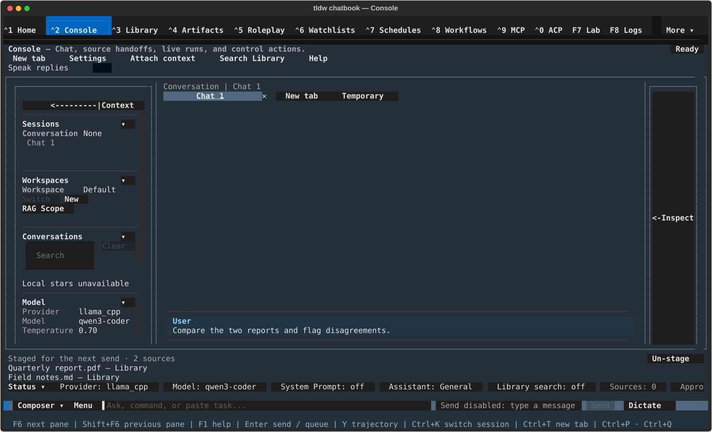

# Console: attachments, images & voice — files, pictures, image generation, and dictation in the composer

## What this page is for

How to get files and images into a Console message, what happens to each
kind of file, how images in replies are displayed and saved, how to generate
images with `/generate-image`, and how to dictate into the draft with the
**Mic** button. For the composer's text-editing basics, see
[Chat basics](chat-basics.md); for the screen as a whole, see
[Console](../console.md).

## Getting there

Everything on this page lives in the Console composer — the input strip at
the bottom of the Console screen (**Ctrl+2**). The buttons referenced here
are **Send**, **Mic**, **Attach**, and **Save**, to the right of the draft.

## Layout tour

With a file staged, the composer shows a **📎** indicator between the draft
and the buttons — `📎 photo.png · 184 B` for one file, or `📎 3 files` for
several — the **Attach** button relabels to **Attach +**, and a **✕**
button appears for clearing what's staged. While dictating, a status chip
(for example `● 0:07` plus the words heard so far) appears in the same area.

## Features & controls

### Three ways to attach a file

1. **Attach** button — opens the **"Select File to Attach"** picker, with
   file-type filter rows: **All Supported Files**, **Image Files**,
   **Document Files**, **E-book Files**, **Text Files**, **Code Files**,
   **Data Files**, and **All Files**.
2. **Paste or drop a file path** — dropping a file onto the terminal window
   (or pasting its path) attaches it instead of inserting the path as text.
   The file must exist, live under your home folder, and match one of the
   picker's file types. Dropping several files attaches only the first
   ("Attached first 1 of N dropped files.").
3. **Alt+V** — pastes an image straight from the OS clipboard (staged as
   `clipboard-YYYYmmdd-HHMMSS.png`). Files copied in a file manager (e.g.
   Finder's Copy) also work and are attached in order until the limit.
   With nothing usable on the clipboard you get "No image on the clipboard."

No slash command attaches files. The **Attach context** action in the top
control bar is different — it opens the "Console context" rail (source
staging is done from Library — see [Context & RAG](context-and-rag.md)),
not the file picker.

### What "attach" actually does — images vs. everything else

- **Images** become true attachments: they stay out of your text, show up
  on the **📎** indicator, and are sent to the model as an image.
  Toast: "<name> attached".
- **Text, code, data, document, and e-book files are not attached** — the
  file's text is inserted **into your draft** as a compact `📄 name` tag
  (the full content is what actually gets sent), with the toast
  "<name> inserted as text (not attached)".

### Limits

| Limit | Value |
|---|---|
| Attachments per message | 5 — at the cap: "Attachment limit reached (5 per message). Remove one to attach another." |
| Image file size | 10 MB by default; change with `max_size_mb` under `[chat.images]` in config.toml |
| Any other file | 100 MB (fixed) |
| Image formats | `.png`, `.jpg`, `.jpeg`, `.gif`, `.webp`, `.bmp`, `.tiff`, `.tif`, `.svg` are offered — but see the `.tiff`/`.svg` quirk below |

### Managing staged attachments

- The **📎** indicator names a single staged file with its size; two or
  more collapse to a count (`📎 3 files`).
- **Attach +** stages another file (its tooltip tracks the count).
- **✕** removes **everything** staged at once — toast "Attachment cleared".
  There is no per-file removal; to drop one of three, clear all and
  re-attach the two you want.

### Vision check before sending

If an image is staged but the current model can't accept images, Send is
blocked with: "Console send blocked: <model> can't accept images. Remove
the attachment, switch to a vision model, or mark this model as
vision-capable under [model_capabilities.models] in config.toml."

### Images in replies and messages

Select a message that carries an image (click it, or `j`/`k`) and use its
action row:

- **View** — cycles how the image renders inline: pixels → graphics →
  hidden.
- **Save Image** — writes the message's images to disk; the default folder
  is `save_location` under `[chat.images]` in config.toml (`~/Downloads`).

### Generating images — `/generate-image`

Type `/generate-image [:backend] [@style] <prompt>` in the composer to run
an image-generation batch; with no prompt it composes one from the
conversation. Insert an `@style` token with the **"Insert image style"**
picker (command palette: **"Console: Insert image style…"**). A generation
message shows an **Image Generation** card; when a batch produces several
variants, browse them with **<** / **>** and press **keep** to make the
browsed variant the message's canonical image. If nothing is set up you
get: "No image generation backend configured. Set
[image_generation].default_backend, or use /generate-image :backend
<prompt>."

### Voice dictation — the Mic button

The **Mic** button walks through four states:

| Button reads | Meaning | Pressing it |
|---|---|---|
| **Mic** | Idle | Starts dictation |
| **Mic…** | Preparing the speech model | Cancels ("Dictation cancelled.") |
| **Rec ●** | Recording | Stops and transcribes |
| **STT…** | Transcribing | Disabled — wait for the text |

A status chip beside the draft tracks progress: "◌ Preparing microphone…",
then `● 0:07` with the latest recognized words while recording, then
"◌ Transcribing…". The finished text is inserted **into your draft** — it
is never sent automatically, so you can edit before pressing Enter.

- **First run:** "Preparing the speech model for the first time. The first
  run downloads it and can take several minutes. Nothing is being recorded
  yet — the microphone opens once the model is ready."
- **Length cap:** a capture stops itself at 60 seconds — "Dictation limit
  reached; transcribing the captured audio."
- **Requires optional extras.** Without a microphone backend: "Microphone
  support isn't installed. Install with: pip install
  'tldw_chatbook[speech_recording]'". Without a speech-to-text provider:
  "No speech-to-text provider installed. Install with: pip install
  'tldw_chatbook[transcription_faster_whisper]'".
- Provider, model, and language come from the `[transcription]` section of
  config.toml (defaults: faster-whisper, English). Only local providers
  are used — audio never leaves your machine.

## Common tasks

1. **Attach an image and ask about it** — click **Attach**, pick the image
   in "Select File to Attach" (the **Image Files** filter helps), confirm
   the `📎` indicator appears, type your question, press Enter.
2. **Paste a screenshot** — take the screenshot to the clipboard, focus the
   composer, press **Alt+V**, then send with a question.
3. **Insert a text file into your draft** — attach it any of the three
   ways; it lands in the draft as a `📄 name` tag with the toast
   "… inserted as text (not attached)". Add your instructions around it.
4. **Clear staged attachments** — click **✕** next to the buttons; the
   toast "Attachment cleared" confirms everything staged was removed.
5. **Dictate a message** — click **Mic**, wait for the chip to show `● 0:00`,
   speak, click **Rec ●** to stop, wait for "◌ Transcribing…" to finish,
   then edit the inserted text and press Enter.

## Keyboard & commands

| Key / command | Action |
|---|---|
| Alt+V | Paste an image from the clipboard |
| `/generate-image [:backend] [@style] <prompt>` | Generate an image for this session |

Dictation has no keyboard shortcut — the **Mic** button is the only way to
start it.

## Related settings & docs

- `[chat.images]` in config.toml — `max_size_mb`, `save_location`,
  `supported_formats`, `show_attach_button`, resize options.
- `[transcription]` — dictation provider, model, and language.
- `[image_generation]` — backends and `default_backend` for
  `/generate-image`.
- `[console]` — composer paste-collapse behavior (affects inserted text
  files too).
- Settings ▸ Console Behavior ▸ **Chat images** — toggle for fetching and
  rendering http(s) image links found in replies (off by default; fetching
  a model-suggested link reveals your IP address to that host).
- [Console](../console.md) · [Chat basics](chat-basics.md) ·
  [Context & RAG](context-and-rag.md)

## Quirks & troubleshooting

- **Text files are not "attached".** Only images become attachments;
  everything else is inserted into the draft as text. The `📄` tag keeps it
  compact, but it counts toward your message, not the attachment list.
- **✕ is all-or-nothing** — there is no way to remove just one of several
  staged files.
- **`.tiff` and `.svg` appear in the picker but are rejected** when
  actually processed (task-222).
- **Alt+V says "Clipboard images aren't readable on this platform — use
  Attach or drop a file."** — clipboard image capture isn't available in
  this environment; use **Attach** or drop the file instead.
- **Dropping several files attaches only the first** — drop the rest one at
  a time, or copy them and use **Alt+V**, which attaches up to the limit.
- **"No audio was captured from the microphone."** after stopping —
  check the OS microphone permission for your terminal and try again.

—
*Verified against dev @ ff435772c — 2026-07-31*
