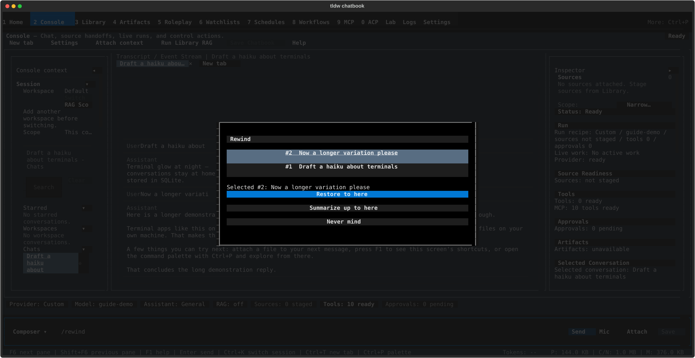

# Branching & rewind — variants, edited resends, and /rewind

## What this is for

Nothing is ever deleted when you regenerate a reply or edit a prompt. The old
answer stays reachable as a *variant*, and your visible conversation shows one
path through your alternatives at a time. This page covers the three surfaces
built on that idea: the ♻ Regenerate action, the "Edit & resend" branch from
the Edit Message modal, and the `/rewind` menu for rolling a session back or
compacting it. Reach for them when a reply isn't what you wanted, when an old
prompt needs a do-over, or when a long session is getting heavy.

## Getting there

These controls live inside the Console transcript and composer — see
[Console](../console.md) for the screen itself and
[chat basics](chat-basics.md) for selecting messages:

- **♻, <, >, Edit** appear in the action row under a *selected* message
  (click a row, or move the selection with `j`/`k`).
- **/rewind** is typed into the composer like any other slash command.

## Features & controls

### Response variants (♻, <, >)

Select an assistant reply and press `r` (or click **♻**) to ask for another
answer to the same prompt:

- A new reply streams in as a fresh variant. The previous answer is not
  deleted — it just steps aside.
- The role label gains a counter when variants exist: **Assistant (2/2)**
  means you're looking at the second of two.
- **<** and **>** buttons appear in the action row. They swipe between
  variants; at either end the button refuses with
  "No response variant in that direction."
- Swiping shows **that branch's continuation**, not just a different
  paragraph: if you kept chatting after variant 1, swiping back to it brings
  its follow-up turns with it, and you land at that branch's latest turn —
  not at the fork.
- After a swipe the same message stays targeted, so repeated presses of
  **<** / **>** keep working without re-selecting the row.
- ♻ only works on assistant replies ("Only assistant messages can be
  regenerated."), and all actions wait for streaming to finish
  ("Wait for response to finish before using message actions.").

### Edit & resend

Select one of **your** messages and press `e` (or click **Edit**) to open the
**Edit Message** modal. Its explanation, verbatim:

> Editing existing transcript message. Save keeps the edit in place; Edit &
> resend forks a new branch and gets a fresh reply.

- **Save** — fixes the text in place. No new reply is generated.
- **Edit & resend** — creates a new branch: your edited prompt is sent and a
  fresh reply streams in. The original prompt and everything that followed it
  stay reachable — your message gains its own "(2/2)"-style counter, and
  **<** / **>** flip between the original and the edited version, each with
  its own replies.
- **Edit & resend** appears only on your own messages; assistant and system
  rows offer plain Save only ("Only your messages can be edited and
  re-sent.").
- Attachments on the original message are carried into the resend.
- Blank content is refused: "Message content cannot be blank."

### The /rewind menu

Type `/rewind` in the composer and press Enter. The **Rewind** menu lists
your earlier prompts newest-first as "#1 …" rows; pick one to reveal three
buttons:

- **Restore to here** — your visible conversation returns to just before
  that prompt, and the prompt's full text is placed back in the composer so
  you can re-send it as-is or edit it first. Nothing is deleted: the rewound
  turns remain reachable as a branch.
- **Summarize up to here** — compresses the turns *before* that prompt into
  a summary for the model. Your visible transcript is untouched; the banner
  "⤵ Earlier turns summarized for context — full history above" marks the
  boundary in the transcript.
- **Never mind** — closes the menu (Esc works too).

With no earlier prompts to go back to, `/rewind` just says
"Nothing to rewind." Restore and Summarize also wait their turn — while a
reply is still streaming they refuse the same way sending does.

## Common tasks

1. **Get a second opinion on a reply.** Select the reply (`j`/`k` or click),
   press `r`. When the new variant finishes, press **<** to compare it with
   the original.
2. **Compare two variants.** With the reply selected, click **<** and **>**
   to flip between them — the label ("Assistant (1/2)", "(2/2)") tells you
   which one you're on, and any follow-up turns swap along with it.
3. **Fix a typo in an old prompt and branch from it.** Select your message,
   press `e`, correct the text, click **Edit & resend**. A fresh reply
   arrives on a new branch; the original stays one **<** away.
4. **Roll the conversation back and re-ask differently.** Type `/rewind`,
   pick the prompt where things went wrong, click **Restore to here**. Edit
   the restored text in the composer and press Enter.
5. **Compact a long session.** Type `/rewind`, pick a prompt that marks
   "everything before this can be squashed", click **Summarize up to here**.
   Keep chatting — the model now sees a summary of the early turns, while
   you still see everything.

## Keyboard & commands

Screen-specific to these features; message selection and the rest of the
action row are covered in [chat basics](chat-basics.md), globals in the
[guide index](../index.md).

| Key / command | Action |
|---|---|
| `r` | Regenerate the selected assistant reply (new variant) |
| `e` | Edit the selected message (**Edit & resend** on your own messages) |
| **<** / **>** | Show the previous / next variant — action-row buttons, click to use |
| `/rewind` | Open the Rewind menu |

## Related settings & docs

- [Console](../console.md) — the screen this all lives on.
- [Chat basics](chat-basics.md) — selecting messages, the full action row,
  composer keys.
- [Context & RAG](context-and-rag.md) — what the model actually sees: how
  the active branch and the summarize boundary shape the next send, and how
  to inspect it.

## Quirks & troubleshooting

- During agent runs, the small inline tool markers under a reply (the
  "⚙ …" / "⤷ …" rows) disappear after your next action — the next send,
  swipe, or delete. The run log in the rail keeps the full record.
  (task-570)
- If a regenerate **fails**, the previous good answer is temporarily out of
  the model's context — it comes back once you swipe (**<**) to it or retry
  the failed variant with **Try**. (task-571)
- **Restore to here** on your very *first* prompt doesn't survive an app
  restart: the conversation comes back at its latest turn. Within the
  running session it works as expected. (task-574)
- There is no "summarize *from* here" yet — you can compress the oldest
  turns and keep the recent ones verbatim, but not the reverse. (task-575)
- `/rewind` is only reachable by typing the command; it isn't in the command
  palette or the message actions yet. (task-576)
- Esc-cancelling the Rewind menu leaves "/rewind" sitting in the composer —
  clear it with `Ctrl+U`. (task-1622)
- In some terminals the **Edit Message** modal's **Cancel** / **Save** /
  **Edit & resend** buttons don't render — the space below the editor stays
  blank — even though they still work: press **Tab** to step onto them
  (Cancel, then Save, then Edit & resend) and **Enter** to activate, or
  **Esc** to cancel. (task-1620)

—
*Verified against dev @ ff435772c — 2026-07-31*
