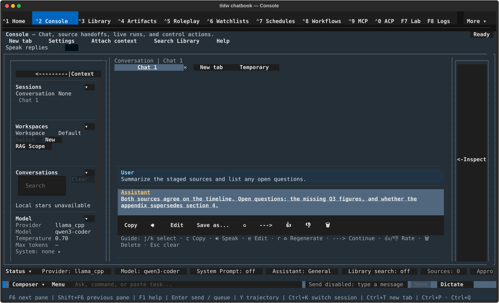

# Console chat basics — sending, streaming, and working with messages

## What this screen is for

This page covers the Console's core chat loop: typing into the composer,
sending, watching a reply stream in, stopping it mid-generation, and acting
on individual messages (copy, speak, edit, save, rate, delete, and more).
For an orientation to the whole screen — rails, tabs, status chips, setup —
start with the [Console overview](../console.md).

## Getting there

Press **Ctrl+2**, click "Console" in the nav bar, or use **Ctrl+P** →
"Switch to Console". Once a provider and model are configured (the
[Console overview](../console.md) covers setup), the composer at the bottom
of the screen is ready — its placeholder reads "Ask, command, or paste
task...".

## Layout tour

- **Transcript** — the scrolling center pane. Each message shows a role label
  (User / Assistant / System / Tool) and the message body; replies still in
  flight carry a status suffix such as "[streaming]".
- **Selected message + action row** — clicking a message (or moving to it
  with j/k) selects it and shows a row of action buttons directly beneath
  it, plus a one-line guide: "Guide: j/k select · c Copy · e Edit ·
  r Regenerate ♻ · ---> Continue · 👍/👎 Rate · 🗑 Delete · Esc clear".
- **Composer** — the input strip at the bottom: the "Composer ▾" collapse
  button, the draft area, and the Send / Mic / Attach / Save buttons. Mic
  and Attach have their own page:
  [attachments, images & voice](attachments-images-voice.md).

## Features & controls

### Composer

- Printable keys go straight into the draft; click anywhere in the draft to
  place the caret; Left/Right and Home/End move it.
- **Enter sends.** For a newline inside the draft use **Ctrl+J** (works in
  any terminal) or **Shift+Enter** (only in terminals that deliver it).
- The draft area grows from one row up to four as your text wraps.
- **Ctrl+A** selects the whole draft; with that full selection active,
  **Ctrl+C** copies it to the clipboard. **Ctrl+U** clears the draft;
  **Ctrl+W** deletes the word left of the caret.
- **PageUp / PageDown** scroll the transcript — the composer never uses
  paging keys.
- **"Composer ▾"** collapses the composer to a one-row strip for more
  transcript space. The strip reads "Composer hidden", joined with " · " to
  whichever of "Generating", "Draft retained", "Attachment retained" apply —
  your draft text is never shown while collapsed. Click **"Expand ▴"** (or
  press **Esc**) to restore it; the caret returns to your draft.

### Large pastes

Pasting more than 50 characters (configurable) collapses the paste into a
single token reading "Pasted Text: N Characters". Press Enter (or click the
token) once to turn it into "Unfurl?", and again to expand the full text in
place; clicking elsewhere resets a pending "Unfurl?" back to the collapsed
token. Whatever the display state, **the full pasted text is always what
sends** — collapsing is purely visual. While the draft contains a paste
token, slash-command parsing is skipped and the draft sends as plain text.
The collapse behavior is set by `collapse_large_pastes` and
`paste_collapse_threshold` under `[console]` in config.toml, also editable
in **Settings > Console Behavior**.

### Sending, streaming, and stopping

- Enter sends the draft. The reply row appears immediately with a dim
  "Generating…" placeholder, then streams in with a "[streaming]" suffix
  until it completes.
- While a run is active a **Stop** button appears between Send and Mic
  ("Stop this tab's run."); the collapsed composer strip gets its own Stop.
  Stopping keeps the partial reply, tagged "[stopped]", and adds a System
  row: "Response stopped by user."
- A reply that errors out is tagged "[failed]", and its action row is a
  single **Try** button that retries it.
- If you scroll up during or after a run, a pill docks at the bottom of the
  transcript so you can jump back: "▼ streaming below — jump to latest",
  "▼ stopped — jump to latest", "▼ reply ready — jump to latest", or
  "▼ checking citations below — jump to latest".
- Assistant replies render markdown (headings, bold, code, italics); your
  own messages — and System/Tool rows — stay exactly as you typed them.

### Selecting a message and its actions

Click a message, or press **j**/**k** (down/up also work) to move the
selection through the transcript. **Enter** shows the selected message's
actions; **Tab**/**Shift+Tab** cycle through the row, **Enter** activates
the focused action, and **Esc** clears the selection. Three shortcuts act
on the selected message directly: **c** Copy, **e** Edit, **r** Regenerate.
While a reply is still generating, every action is disabled with the
tooltip "Wait for response to finish before using message actions."

| Action | What it does | Where it appears |
|---|---|---|
| Copy | Copies the message body to the clipboard. | All messages |
| 🔊 / ⏹ | Speaks the reply aloud; playback starts automatically, and while it plays the button becomes ⏹ to stop ("Stopped speaking."). Text-to-speech provider setup lives in Settings. | Completed assistant replies |
| Edit | Opens the "Edit Message" editor; editing one of your own messages can also fork and resend — see [branching & rewind](branching-and-rewind.md). | All messages |
| Save as... | Choose a destination: Chatbook, Note, Media, or Prompt. Chatbook is available only for assistant replies. | All messages |
| < > | Step between regenerated variants — see [branching & rewind](branching-and-rewind.md). | Messages with variants |
| ♻ | Regenerate — fork another assistant variant for this turn; the old answer is kept, not overwritten — see [branching & rewind](branching-and-rewind.md). | Assistant replies |
| ---> | Continue — extend the selected message with more generated text. | All messages |
| 👍 / 👎 | Rate the message; feedback is stored per message. | All messages |
| 🗑 | Delete, with a two-press confirm: the first press shows "Press Delete again to remove this message.", the second removes the message **and every message under it**. | All messages |
| Try | Retry a failed reply (replaces the whole row on "[failed]" replies). | Failed assistant replies |
| View / Save Image | Cycle how an inline image renders / save the message's images to disk — see [attachments, images & voice](attachments-images-voice.md). | Messages with images |

## Common tasks

### Send your first message
1. Open Console (Ctrl+2) and type into "Ask, command, or paste task...".
2. Press **Enter**. The reply streams in with "[streaming]"; when it
   finishes, the suffix disappears. The session title and tab label take
   the text of your first message.

### Stop a reply mid-stream
1. While the reply shows "[streaming]", click **Stop** (between Send and
   Mic).
2. The partial reply stays, tagged "[stopped]", and a System row reads
   "Response stopped by user." Send again to keep the conversation going.

### Copy a reply
1. Click the reply, or move to it with j/k.
2. Press **c** or click **Copy** — toast: "Copied message to clipboard."

### Retry a failed reply
1. Select the reply tagged "[failed]".
2. Click **Try** — the reply is retried in place.

### Delete a message and its follow-ups
1. Select the message and click **🗑** once — "Press Delete again to remove
   this message."
2. Click **🗑** again. The message and everything beneath it are removed.

### Save a reply as a Note
1. Select the assistant reply and click **Save as...**.
2. Choose **Note** — toast: "Saved message as Note." It appears on the
   Notes screen.

## Keyboard & commands

Composer:

| Key | Action |
|---|---|
| Enter | Send the draft (or advance a focused paste token) |
| Ctrl+J | Insert a newline (works in any terminal) |
| Shift+Enter | Insert a newline (where the terminal delivers it) |
| Ctrl+A | Select the whole draft |
| Ctrl+C | Copy the draft (with the full selection active) |
| Ctrl+U | Clear the draft |
| Ctrl+W | Delete the word left of the caret |
| Home / End | Move the caret to the start / end of the draft |
| PageUp / PageDown | Scroll the transcript |
| Esc | Expand a collapsed composer / return focus to the draft |

Transcript:

| Key | Action |
|---|---|
| j / k (or down / up) | Select the next / previous message |
| Enter | Show the selected message's actions; activate a focused action |
| Tab / Shift+Tab | Cycle through the action row |
| c / e / r | Copy / Edit / Regenerate the selected message |
| Esc | Clear the selection |

## Related settings & docs

- `[console]` in config.toml: `collapse_large_pastes` (default `true`) and
  `paste_collapse_threshold` (default `50` characters) — also editable in
  **Settings > Console Behavior**.
- [Console overview](../console.md) — layout, setup, session settings, help.
- [Branching & rewind](branching-and-rewind.md) — what ♻ and the < >
  variant arrows really do, and their limitations.
- [Attachments, images & voice](attachments-images-voice.md) — the 📎
  indicator, the Attach and Mic buttons, and image messages.
- [Guide index](../index.md) — global navigation keys.

## Quirks & troubleshooting

- **No input history recall** — pressing up/down never cycles through your
  past inputs. Each session keeps its unsent draft when you switch away and
  back, but there is no history browsing.
- **Actions wait for the stream** — every per-message action is disabled
  while a reply is generating. Stop the run first if you need to act on a
  message immediately.
- **Regenerate goes deeper than this page** — ♻ never overwrites the old
  answer; it creates a variant you can step back to with < >. Details and
  known limitations live in [branching & rewind](branching-and-rewind.md).

—
*Verified against dev @ ff435772c — 2026-07-31*
