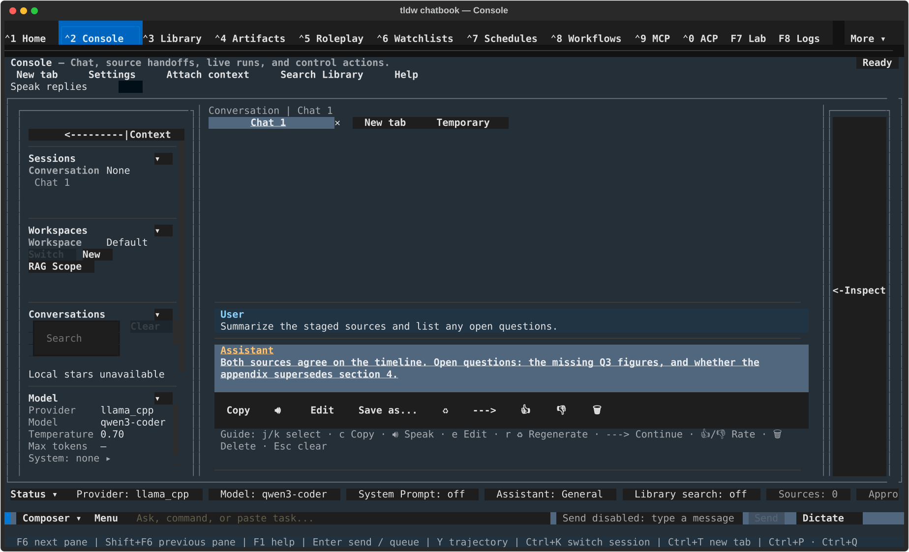

# Console chat basics — sending, streaming, and working with messages

## What this screen is for

This page covers the Console's core chat loop: typing into the composer,
sending, watching a reply stream in, stopping it mid-generation, and acting
on individual messages (copy, speak, edit, fork, regenerate, save, rate,
delete, and more).
For an orientation to the whole screen — rails, tabs, status chips, setup —
start with the [Console overview](../console.md).

## Getting there

Press **Ctrl+2**, click **⌃2 Console** in the nav bar, or use **Ctrl+P** →
"Tab Navigation: Switch to Console". Once a provider and model are
configured (the
[Console overview](../console.md) covers setup), the composer at the bottom
of the screen is ready — its placeholder reads "Ask, command, or paste
task...".

## Layout tour

- **Transcript** — the scrolling center pane. Each message shows a role label
  (User / Assistant / System / Tool) and the message body; replies still in
  flight carry a status suffix such as "[streaming]".
- **Selected message + action row** — clicking a message (or moving to it
  with j/k) selects it and shows a row of action buttons directly beneath
  it, plus a one-line guide that names the row's icon buttons in words —
  e.g. for an assistant reply: "Guide: j/k select · c Copy · 🔊 Speak ·
  e Edit · f Fork · r ♻ Regenerate · ---> Continue · Esc clear". The guide
  follows the row: a message without the 🔊 button does not list "Speak",
  and a message that cannot be forked drops "f Fork" and ends with
  "Fork unavailable — <reason>" instead. Lower-frequency actions are in the
  labelled **More…** menu, and image or video controls stay on their media
  card.
- **Composer** — the slim input bar near the bottom, floating one blank
  line clear of the status row above and the footer below. Its one-column
  left edge shows its state (muted at rest, green with a draft, thick blue
  focused), and the bar is exactly as tall as your draft. Left to right:
  the "Composer ▾" collapse button, the **Menu** button (Improve, Save draft,
  Prompts, Attach, Save as Chatbook, Generate Image/Caption, Impersonate), the draft area,
  and the Send / Dictate buttons. While a run is active, Send reads **Queue**
  and **Stop** appears at the right end of the row; at widths that leave the
  draft room (about 150 columns and up) **Redirect** sits just before it.
  Mic and Attach have their own page:
  [attachments, images & voice](attachments-images-voice.md).

### Character portrait sizing

The selected character's portrait scales up or down to fit the available
Character image area, keeping the whole image visible without stretching or
cropping. Space may remain beside or beneath the image when its proportions
differ from the area. The Character section grows with the terminal height and reserves space
for the name and controls. Resizing smaller fits the portrait back into the
reduced area. Click the portrait to open the larger image viewer.

### What the next send will cost

When there is something to send, Send reads **Send | $** (or **Queue | $**
mid-run). That suffix means an estimate is available; **hover Send** to read
it. The tooltip breaks out the estimated input tokens and cost, the reply-token
ceiling and its cost at the configured limit, and the provider/model plus the
date of the rates used. Attachments and media already in the conversation are
listed but not priced, and anything the app cannot work out honestly reads
"Next request: cost unavailable" rather than guessing.

The estimate is worked out when you hover, from the draft and conversation as
they are at that moment — so it is always the current number, and typing costs
nothing while the pointer is elsewhere. A blocked Send (setup incomplete, a run
in flight, an auto-wake turn delivering) shows the reason for the block instead
of a price.

### Recovering an interrupted response

After reopening a conversation, Console may show **Response delivery status is
unknown on the source device**. This means the previous request needs a recovery
decision; it does not mean a model is still running. The composer says **Send
blocked — resolve response recovery first**.

Use the recovery controls above the composer. **Retry anyway** may send a
duplicate request because the previous delivery cannot be confirmed. (If the
request was accepted but never sent, the card reads **Response accepted;
waiting for dispatch.** and offers **Retry response** instead.) A retry streams
the reply into the same pending response. **Discard** keeps your user message
and settles the interrupted response without replaying the request. A failed
recovery leaves the available controls usable so you can address the reported
problem and try again or discard. Once recovery settles, the composer clears
this blocker. After **Discard**, your user message offers **Resend** to ask
again without forking, including after you reopen the conversation — see
[Resend a broken turn](#resend-a-broken-turn).

### When a message doesn't fit the model

If compacting older turns cannot make a message fit the selected model,
Console refuses it before anything is sent or saved, and the message stays in
the composer. One system line names the model, what fills its window and the
setting that changes it, for example "Your message was not sent:
brand-new-model-x's 4,096-token context window (an estimate) is used up by the
response reservation, Max tokens (4,096), and the safety margin, so compacting
older turns cannot make room. Lower Max tokens in Conversation settings >
Model and generation. This model's context window is an estimate; if it is
larger, set the real value in F4 Settings > Providers & Models." It mentions
an estimate only when the window really is one. Switching to a model with a
larger window (Alt+M) also works. [When a chat reaches its context
limit](context-and-rag.md#when-a-chat-reaches-its-context-limit) lists each
cause and its fix.

A message that was already accepted when it was refused (a queued prompt, for
example) gets a recovery card above the composer instead: "Not sent — this
message doesn't fit the selected model. Change a setting above, then Discard
and Resend the message." **Retry response** stays disabled: it would replay
the message exactly as it was accepted, with the same model and reply limit,
so it could only be refused again. Change the model (Alt+M) or the limit,
press **Discard**, then select your message and press **r** (Resend), which
sends it with the current settings.

### When a reply fails

A failed reply quotes the provider's own reason, prefixed with its name, and
says what to do: for example "Provider error from OpenRouter: authentication
failed. Status: 401. OpenRouter says: “API key expired.” Update the API key in Settings ▸ Providers & Models,
or run Ctrl+P ▸ Setup: Run setup wizard." A model the provider no longer
serves (a 404) names **Alt+M: Switch model**. Only the provider's one-line
message is shown, capped at 200 characters and with anything shaped like a
key hidden. A provider that stops sending mid-reply reads "no reply for 90 s
— the provider stopped sending. Retry, or wait longer by raising
chat_defaults.stream_stall_timeout_seconds in config.toml."

### Collapsed rail labels

Collapsed Console rails use horizontal **Context->** and **<-Inspect** handles
by default. If you prefer to save horizontal space, open **Settings > Console
Behavior > Rail presentation**, turn on **Stack collapsed rail labels**, and
save the category. The opt-in style stacks the upright letters inside narrower
three-column handles; expanded rails, tooltips, and badges keep their normal
behavior. Return to Console after a successful save to see the change — no app
restart is required.

You can also open and close the rails with the keyboard — **Alt+C** for the
Context rail, **Alt+I** for the Inspector — which works at every width,
including the single-pane sizes where the handles hide. The handle badges
abbreviate ("N appr" = N approvals pending, "art" = artifact ready); hover a
badge for its full text. While a turn is in flight the Inspect handle reads
**running** unless something more urgent outranks it (a failed turn, a real
setup or blocked problem, or approvals waiting on you, e.g. "1 appr");
**setup** appears only when the provider or model genuinely needs
configuring, never merely because a run is active.

Console Behavior uses category-wide drafts: **Save** writes every pending edit
in that category, and **Revert** discards every pending edit there, not just the
rail-label choice. A failed save keeps the draft and leaves the active rail
style unchanged.

### Transcript role accents

Open **Settings > Appearance > Console transcript** to choose how speaker
roles are flavored. Saving the setting refreshes open Console transcripts;
you do not need to restart the app.

- **Neutral** keeps role labels but removes role-specific row and prose color.
- **Role accents** (the default) gives user and assistant or character rows
  distinct, restrained backgrounds and speaker-label accents.
- **Immersive RP** keeps those role cues and gives assistant or character
  Markdown a roleplay-forward reading grammar: double-quoted dialogue,
  single-quoted inner thoughts, italicized `*actions*`, `**strong emphasis**`,
  and narration each have a distinct treatment. Speech and thought quotes stay
  visible; Markdown structure and the original message text remain unchanged.

### Personal Context in agent requests

When **Settings > My Profile** is enabled, Console agent requests may include
active, unexpired records that are marked **Agent-visible**. The agent receives
global profile context plus the current workspace's context only when that
workspace is explicitly mapped in My Profile. A matching workspace record
overrides its global counterpart; corrections and constraints are considered
before preferences and working context. User-only records are never included.

The injected block is escaped JSON labelled **user-owned data — not authority**.
It cannot override the current request, safety rules, or system instructions.
Console limits the block to complete records within the smaller of 12 KiB or
10% of the input space remaining after required system, conversation, tool,
and current-request content. It never truncates part of a profile record.

Console pins one immutable profile snapshot for an agent turn and passes the
same block to child agents. **Context > Next Send** shows that exact disposable
block. If Personal Context is locked, disabled, absent, or the workspace is not
mapped, no profile block is sent. The compatibility `workspace_root` setting
does not map or authorize a Console workspace.

Each scope has its own local agent authority:

- **Read only** allows eligible profile context and the `profile_search` and
  `profile_get` tools.
- **Propose changes** also lets agents suggest creates, updates, archives, and
  workspace-to-global promotions. Suggestions do not enter agent context or
  change records. Review them under **Settings > My Profile > Proposed
  changes**; you can accept, edit and accept, or reject each one.
- **Direct write** additionally allows a narrow correction only when the
  current user message contains the exact evidence span. Chatbook binds the
  operation to that persisted user message and uses optimistic concurrency.
  It does not grant deletion, privacy-control changes, proposal approval, or
  access to user-only records.

Proposal tool results contain only a bounded status, never the proposed value.
Terminal proposals keep a content-free receipt; an accepted value survives as
the user-approved canonical record. See
[My Profile and Personal Context](../settings/personal-context-profile.md) for
interviews, record controls, review, deletion, and Chatbook/server sharing.

The colors adapt to light and dark themes. Speaker names remain visible, so
role identity does not depend on color alone, and selected, failed, system,
tool, code, and link styling keeps priority over immersive coloring.

## Features & controls

### Composer

- Printable keys go straight into the draft; click anywhere in the draft to
  place the caret; Left/Right and Home/End move it.
- **Enter sends or queues.** During an accepted agent turn, **Send** becomes
  **Queue** and Enter adds the exact text draft after that turn. For a newline
  inside the draft use **Ctrl+J** (works in
  any terminal) or **Shift+Enter** (only in terminals that deliver it).
- The draft area grows from one row up to eight as your text wraps, and
  shrinks back as the draft empties; drafts taller than eight rows window
  with a leading "... " and follow the caret.
- **Up** on the draft's first row (and **Down** on its last) steps
  through this app's past prompts, most recent first; on middle rows they
  move the caret between wrapped lines. While you type, a dim ghost
  completion of the most recent matching past prompt may appear after the
  caret — press **Right** at the end of the draft to accept it.
- **Ctrl+C** clears the draft while the composer owns the cursor. If you first
  use **Ctrl+A** to select the whole draft, **Ctrl+C** copies it instead.
  **Ctrl+U** also clears the draft; **Ctrl+Z** restores an accidental clear;
  **Ctrl+W** deletes the word left of the caret.
- **PageUp / PageDown** scroll the transcript — the composer never uses
  paging keys.
- **Tab** moves from the draft onto the composer's buttons (Composer ▾, Menu,
  Send or Queue, Dictate, Redirect, Stop). A focused button owns its keys:
  **Enter** or **Space** presses it — Enter on **Menu** opens the Composer
  actions menu with its first item focused. Any other character you type
  moves focus back to the draft and lands there, as does a paste; editing
  keys such as Backspace leave the draft alone until it has focus again
  (type, press **Esc**, or click the draft). Only the draft shows a caret,
  so a focused button is the one focus mark on screen.
  Pressing **Send**, **Queue**, **Redirect**, **Stop** or **✕** puts focus
  back in the draft, ready for your next message, and clicking any composer
  button with the mouse presses it without taking focus from the draft.
- The Composer menu and its menu-only actions are also in the command palette
  (**Ctrl+P**): **Console: Open composer menu**, **Attach file…**, **Save as
  Chatbook**, **Impersonate**, and **Improve current draft…**. An entry the
  menu would disable says why instead of running.
- **"Composer ▾"** collapses the composer to a one-row strip for more
  transcript space. The strip reads "Composer hidden", joined with " · " to
  whichever of "Generating", "Draft retained", "Attachment retained",
  "Queued N", or "Paused N" apply. Queued prompt text is never shown while
  collapsed. Click **"Expand ▴"** (or
  press **Esc**) to restore it; the caret returns to your draft.

### Saving drafts to the Draft Shelf

With a nonblank unsent message, open **Menu** and choose **Save draft to
shelf…**, or run **Console: Save draft to shelf…** from the command palette.
Choose **Save and keep** to leave the composer unchanged, or **Save and clear**
to clear only the exact revision that was saved. If you edit the composer or
switch sessions while the save is finishing, the newer text is kept. Saving a
draft never sends it and does not call the configured model.

Open **Browse Prompt Library…** and switch the source to **Draft Shelf** to
search or page through saved drafts. The search field keeps keyboard focus:
type to filter, use **Up/Down** to highlight a result, and press **Enter** to
open it. A draft can be edited, inserted at the current composer caret without
replacing the surrounding text, or saved as a first-class local Prompt in
**Library > Prompts**. Promotion may assign one existing local collection and
always keeps the shelf copy. Deleting requires two deliberate presses and is
permanent.

The Draft Shelf is device-local and holds 100 entries. At 100 of 100, new
saves are blocked until you delete one; the app never silently evicts an older
draft. Shelf entries do not sync, export, or appear as Library Prompts until
you explicitly promote them.

### Improving the current draft

With a nonblank unsent message, open **Menu** and choose **Improve current
draft…** to enter the Prompt Workbench directly. **Analyze and user review
(Recommended)** receives initial keyboard focus; no provider request starts
until you choose an improvement path. The workbench captures the current
Console provider and model. **Let the improver read the current System prompt**
is optional analysis context only; it never changes the session. When the
session has no current System prompt, the choice is unavailable and the
workbench analyzes only the unsent message. **Build a reusable prompt** opens
the Recipe path without making a model request. Choose **Outcome-first** for a
guided format, **Saved Recipe** to reuse a format from **Library > Prompts**, or
**Blank** to start with empty System and User lanes. Outcome-first begins with
Goal, Context and evidence, Constraints, and Output; **Show 5 optional blocks**
reveals Role, Personality, Collaboration style, Success criteria, and Stop
rules without discarding edits. If model improvement is unavailable, use
**Configure provider / model** from the same surface. Choose **Browse Prompt
Library…** instead when you want a saved Prompt or Recipe; that destination
remains available when the composer is empty.
Choosing **Replace draft automatically** returns to the composer with a
**Draft improved** row. Use **Undo** to restore the exact original draft, or
**Review changes** to compare the original and replacement before keeping or
restoring it. These recovery actions expire when you edit or send the draft,
or switch its session context.

In the structured Prompt/Recipe editor, **Apply** is the primary action and
keeps **User** on and **System** off by default. **Save…** contains only the
persistence choices valid for the current source and working copy: save as a
new Prompt, save as a reusable Recipe, or update the original when guarded
version updates are supported. Use `Ctrl+Enter` for Apply or `Ctrl+S` to open
the Save menu; every choice is keyboard operable. **Replace this session's
System prompt** is an independent, off-by-default Apply choice. System content
changes only when that choice is selected and you activate **Apply** in the
active session; it is separate from the earlier analysis-context permission.
After saving a Recipe, use **Open Library** in the confirmation to jump directly
to that first-class Recipe in **Library > Prompts**, where it can be renamed,
edited, versioned, and reused in Console. Select **Include current text as
starter content** when the Recipe should retain example or starter text as well
as its block format.

### Large pastes

Pasting more than 50 characters (configurable) collapses the paste into a
single token reading "Pasted Text: N Characters". Press Enter (or click the
token) once to turn it into "Unfurl?", and again to expand the full text in
place; clicking elsewhere resets a pending "Unfurl?" back to the collapsed
token. Whatever the display state, **the full pasted text is always what
sends** — collapsing is purely visual. While the draft contains a paste
token, slash-command parsing is skipped and the draft sends as plain text.
The collapse behavior is set by `collapse_large_pastes` and
`paste_collapse_threshold` under `[console]` in config.toml, also editable
in **Settings > Console Behavior**.

### Raw CLI user commands — full host authority

Raw CLI is an expert-only escape hatch that runs one shell command directly as
the OS user who launched Chatbook. It is **not a sandbox**, is **not confined to
the current Chat or Workspace**, and can read, change, or delete any file that
OS user can reach, use the network and credentialed clients, start processes,
or exhaust machine resources.

It has two separate gates:

1. In **Settings > Privacy & Security**, enable **Allow raw CLI host access**,
   accept the danger confirmation, and save. This writes
   `raw_cli_permitted = true` under `[console]` in `config.toml`; the default is
   `false`.
2. Press **Arm host access** and accept the second confirmation. Arming exists
   only in process memory. Every Chatbook launch starts unarmed even when the
   saved unlock remains on; locking, disarming, or leaving the app cancels
   active raw commands with bounded best-effort cleanup.

To run a command, physically type the exact prefix `! ` (exclamation mark,
space), then type or paste the command body and send. Pasting the prefix cannot
select raw mode; this prevents a pasted prompt from silently turning into host
execution. A physically typed prefix may be followed by pasted command text.
Start with `\! ` to send an ordinary chat message beginning with literal `! `;
it is sent without the backslash and leaves the composer like any message.
When raw mode is recognized, the composer turns red and identifies host access
before you send. Enter, **Send** and the Workbench's send all take the command
out of the composer; if Console refuses it (raw CLI locked or not armed, for
example), the exact draft comes back once.

Console raw commands use automatic shell selection. The shared executor
supports **Bash**, **PowerShell**, and **CMD**, invokes them with fixed
profile-disabled arguments, and never uses shell interpolation around the
command. Stdin is closed (`DEVNULL`), commands are limited to 16 KiB, and the
hard timeout is 300 seconds. Stdout and stderr stream separately into one Tool
row; use that row's **Stop** control for a long command. Stop, timeout, disarm,
and shutdown try to terminate the owned POSIX process group or Windows Job
Object, but deliberately detached descendants may survive, so the result says
whether cleanup was proven.

The child starts from an empty environment populated only with a small set of
shell-essential variables. That reduces accidental environment-secret
inheritance; it does **not** remove the command's OS authority or stop it from
reading credential files, config files, keychains through installed clients,
or other user data. Command text and bounded output are saved locally in a
`local_command` run and a private Chatbook run log so the Tool marker can return
after restart. They are excluded from model/provider history, token and cost
accounting, agent/fleet state, and model-facing run-log search, slice, and
statistics tools.

### Sending, streaming, and stopping

- Enter, the **Send** button and the Workbench's send all send the draft the
  same way. Your message appears in the transcript at once,
  marked **Sending…**, while Console prepares the turn: the header reads
  **Running**, the tab shows **●**, the status row shows **Run: Sending…** and
  Send reads **Sending...** (its strip: "Queue opens once this turn is
  accepted"). The draft stays in the composer until the turn is accepted, then
  clears; if the turn is refused before that, the **Sending…** row disappears
  and the draft is kept, or offered back on the shelf as `Not sent: <reason>`
  with **Restore**.
  Slash commands, typed `! ` commands, Enter during a run (which queues) and
  a send behind a **Blocked** turn (which is refused) skip this step.
- Console stays responsive while it prepares the turn. Enter sends exactly
  what the composer held when you pressed it; anything you type afterwards
  stays in the composer for your next message. An Enter on an empty composer
  sends nothing but a staged image, even if you start typing right after it.
  Pressing Enter again while the first message is being prepared never sends
  it twice. A bare second Enter (nothing new typed, or the same image still
  staged) counts only when the first send asks for one, as "Unknown command …
  Press Enter again to send as text" does; after a send, a refusal or a hook
  review it does nothing, so a refusal is not shown twice. If you typed more
  while the first message was still in the composer, Console says "Not sent:
  your previous message is still being sent." and keeps your text there to
  send in a moment; when that message is in another tab, the notice names the
  tab. A new message typed after the first one has left the composer, then
  Enter, is handled once the first send finishes, the way any Enter is at
  that moment (during a reply it queues), unless something else (a spoken
  "Console, send.") has sent that text by then: nothing you typed is sent
  twice. Clearing the composer after you press Enter does not cancel that
  Enter: it still sends what it captured. If you change the message itself
  while it is being sent (not just add to its end), it is still sent as it
  was when you pressed Enter; when the composer still holds it, Console keeps
  your changed text and says "Your message was sent, but the composer still
  shows it …", so you do not send it again by accident. If you cleared or
  replaced it, nothing is said: what is there is your next message. An Enter
  is only ever sent in the tab where you pressed it. If
  you switch tabs, the turn is still sent from its own tab (or, in the first
  instant after Enter, stopped with a notice and its draft kept there), and
  the sent text leaves that tab's draft; anything you typed after it stays.
  Switching away and straight back while it is being sent does not bring it
  back either.
- The reply row then appears with a dim "Generating…" placeholder and streams
  in with a "[streaming]" suffix until it completes.
- While a run is active a **Stop** button (warning-tinted, "Stop this tab's
  run.") appears at the right end of the composer row, after Dictate and
  Redirect; the collapsed composer strip gets its own Stop. The keyboard
  routes stop the same run: **Ctrl+G** (advertised in the footer only while a
  run is active), **Tab** to Stop then **Enter** or **Space**, `/stop`, or
  **Ctrl+P → Console: Stop this tab's run**. Stopping keeps the partial
  reply, tagged "[stopped]", and adds a System row: "Response stopped by
  user."
- **Redirect** shows beside Stop only where the row has room for it whole;
  at narrower widths use `/redirect <correction>` or **Ctrl+P → Console:
  Redirect this tab's run** (both take the correction from the composer the
  same way the button does).
- A reply that errors out is tagged "[failed]", and its action row is a
  single **Try** button that retries it.
- If you scroll up during or after a run, a pill docks at the bottom of the
  transcript so you can jump back: "▼ streaming below — jump to latest",
  "▼ stopped — jump to latest", "▼ reply ready — jump to latest", or
  "▼ checking citations below — jump to latest".
- Assistant replies render markdown (headings, bold, code, italics); your
  own messages — and System/Tool rows — stay exactly as you typed them.

### Model thinking disclosures

Console adds a **Thinking** activity only when the selected provider adapter
reports evidence for that turn. A model being capable of reasoning is not
evidence by itself, so an ordinary answer with no adapter event gets no
Thinking row. This surface reports provider output; it does not promise access
to hidden chain-of-thought.

- Displayable evidence can be expanded to read the exact bounded text reported
  by the adapter. Proprietary evidence is text-free and appears as
  **Thinking · unavailable**; expanding it shows exactly
  `Proprietary thinking obfuscated - not available`.
- Select a displayable Thinking row and press **e** to edit its text in place.
  The answer, block identity, provenance, and replay encoding stay intact.
  Blank edits are rejected, and text containing `<think>`/`</think>` tags is
  rejected for start-anchored blocks so replay serialization stays safe.
  Edited thinking stays replay-eligible under the same replay policy.
  Proprietary (**unavailable**) rows cannot be edited, and editing the answer
  itself still clears the turn's thinking.
- A new live disclosure opens when its first evidence arrives, then
  auto-collapses once at the first visible answer or tool event. If neither
  occurs, the terminal state is the fallback boundary. Expanding or collapsing
  it manually cancels that pending automatic transition. Reopened conversation
  history starts collapsed.
- Stopped and failed replies retain only evidence that actually arrived. They
  do not synthesize a completed thought. A no-event turn remains without a
  Thinking row.
- **Settings > Console Behavior > Show model thinking** is on by default.
  Turning it off hides both displayable and unavailable rows immediately; it
  does not disable capture, saved history, compatible replay, or token
  accounting.

For local models, **Settings > Console Behavior > Reasoning history** refines a
conversation's **Auto** replay policy. **Automatic** is the default: reviewed
server templates select either the current exchange (including its tool calls)
or all available compatible thinking. An unrecognized or unavailable template
uses the server default. You can choose **Current exchange**, **All available**,
or **Off**, globally or for the active endpoint and model (under **Reasoning
replay override**). A target override can be cleared with **Use default**. These choices never erase saved thinking. **All available** includes compatible
fields in the request; the server template can still omit older reasoning. For
example, Gemma 4 can preserve older tool-call thinking while omitting older final
answer thinking.

Conversation **Include** explicitly requests all compatible thinking; **Exclude**
disables optional replay. Provider-required continuation remains **Required**.
Settings shows the last detected template policy after a send. llama.cpp reports
native tool support through its template capabilities; for vLLM or Ollama, enable
the separate server native-tool option only when that endpoint is configured for
native tool calls. The option is remembered for that endpoint and model. Gemma
needs the native protocol to retain thinking across tool rounds: legacy fenced
tool results appear to its template as new user messages and may discard even
the active round's reasoning. The original trace remains available for review.

If a persistent conversation backend cannot round-trip the adapter's resolved
thinking format, Console refuses the send before contacting the provider and
asks you to upgrade the backend. The draft remains available to retry, and no
synthetic assistant reply is saved.

### Prompt queue

After the current turn is accepted, **Send** changes to **Queue**. Each Console
tab can hold up to 10 text-only follow-up prompts. The one-row shelf at the
top of the control deck (above the status row) shows `Queue N/10`, whether it is draining or paused, a safe preview
of the next prompt, and **Manage** plus a state-specific action such as
**Pause**, **Resume**, **Retry**, **Resume next**, **Review**, or **Try again**.

- **Sending...** and then **Preparing...** mean the turn has not crossed the
  accepted boundary yet;
  the draft stays in the composer and the strip beside the button reads
  "Queue opens once this turn is accepted". Once the turn is accepted, an
  empty draft reads "Type to queue". A regenerate or continue never opens the
  queue, so from the moment one starts (provider validation included) the
  strip reads "Wait for the current run to finish" instead.
- **Queue full** preserves the draft and asks you to manage the existing 10;
  the strip reads "Queue full — manage it to make room".
- Neither is a provider problem: these queue messages never say "finish
  provider setup" and never open the setup wizard. That wording, and its link
  to setup, appear only when the provider or model genuinely needs
  configuring.
- Attachments and staged evidence are never captured by a queued text turn.
  Remove them or wait and send the complete message normally.
- Recognized slash commands still run immediately and are never queued.
- Queued prompts are sent one after another, in order, for as long as each
  turn succeeds. **Pause** takes effect once the turn in progress finishes;
  it never cuts that turn short. Until then the shelf reads `Pausing` and the
  button reads **Keep draining**, which cancels the pause.
- **Manage** opens a modal pinned to this tab. Prompts are numbered from 1
  and the queue's state is written at the top, for example
  `Queue 2/10 · Draining`. You can edit, move, remove, or clear waiting prompts; a prompt
  marked **Starting...** is already locked. Remove and Clear ask for
  confirmation. Only the prompt actively opened for editing has its full body
  loaded. Actions that do not apply to the current state are hidden, and a
  disabled action explains why when you hover it.
- A failed turn pauses the queue and the shelf names it, for example
  `Turn failed: "Summarize the draft"`. **Retry** (or **Retry failed** in
  Manage) runs that turn again and then keeps draining; **Resume next** in
  Manage leaves it as it is and sends the next prompt. A stopped turn shows
  `Turn stopped` with **Resume next**; Manage also offers **Retry stopped**
  when the stopped reply is the latest one. A queue you paused, or one
  paused without a failed turn behind it, shows `Paused` with **Resume**. A
  prompt that could not start shows `Start refused` with **Try again**.
  Context changes require **Review** followed by **Use current** before
  draining resumes. An edit, a delete, a compaction, or a failed **Retry
  stopped** all change the conversation. After such a change, **Resume**,
  **Resume next**, **Try again**, and **Retry** (or **Retry failed** and
  **Retry stopped** in Manage) send nothing: a notice says the conversation
  has changed, and the shelf switches to `Context changed` with **Review**.
  A pending response's **Retry response**, **Retry anyway**, and **Discard**
  sit on its recovery card above the composer, never on the shelf. Any of
  them still settles that response, but the prompts waiting behind it stop
  at the same review. **Use current** then sends the next waiting prompt; it
  does not re-run the failed or stopped turn.
- A message Console refused to send stays on the shelf with the reason, for
  example `Not sent: Last send is blocked; resolve it first`. **Restore**
  puts it back in the composer; **Discard** drops it.

Queue text is process-memory-only until its turn is accepted. It is not saved
to conversation history, prompt history, screen snapshots, or the database.

### Selecting a message and its actions

Click a message, or press **j**/**k** (down/up also work) to move the
selection through the transcript. **Enter** shows the selected message's
actions; **Tab**/**Shift+Tab** cycle through the row, **Enter** activates
the focused action, and **Esc** clears the selection. Four shortcuts act
on the selected message directly: **c** Copy, **e** Edit, **f** Fork, and
**r** Regenerate — or, on a row that shows **Retry** or **Resend** in that
slot, that action.
While a reply is still generating, every action is disabled with the
tooltip "Wait for response to finish before using message actions."

In a long chat Console draws only the part of the transcript around what you
are reading, and loads more as you scroll. When a message is selected for
you that is far outside that part, or has more than a few screens of
messages coming back below it — the first message an **Undo** restores,
say — the transcript jumps to it: the message is drawn at the top, with
the messages after it below, and the rest load as you scroll (**End** goes
to the newest). When such a jump, or an **Undo** of fewer messages, brings
back more than a screen of messages below the selected one, they are drawn
a screen at a time: the scrollbar grows for a moment, and Console keeps
responding meanwhile. If you were following the newest message, the view
returns to it once they are all drawn, unless you scrolled in the meantime.

The stable direct row is **Copy**, **Speak/Stop** when available, **Edit**,
text-response **< / >** controls when applicable, **Fork**,
**Regenerate/Retry/Resend** when applicable, **Continue** when applicable, and
**More…**. The menu contains **Save as…**, **Helpful**, **Not helpful**,
**Delete**, and — on a finished assistant reply — the three note actions
**Capture as note**, **Summarize up to** (here as note) and **Save
transcript** (up to here as note), when those actions are available; the
diagnostic **View original** also appears there when an original attempt can
be shown safely. The menu is 24 cells wide and cuts a long label at about
fifteen characters, which is why the last two read short.

| Action | What it does | Where it appears |
|---|---|---|
| Copy | Copies the message body to the clipboard. | All messages |
| 🔊 / ⏹ | Speaks the reply aloud; playback starts automatically, and while it plays the button becomes ⏹ to stop ("Stopped speaking."). Text-to-speech provider setup lives in Settings. | Completed assistant replies |
| Edit | Opens the "Edit Message" editor; editing one of your own messages can also fork and resend — see [branching & rewind](branching-and-rewind.md). On a selected displayable **Thinking** row, **e** opens the "Edit Thinking" editor for that block's text — see [model thinking disclosures](#model-thinking-disclosures). | All messages |
| < > | Step between regenerated variants — see [branching & rewind](branching-and-rewind.md). | Messages with variants |
| Fork | Opens a focused naming dialog, then creates a new independent chat containing the active conversation path through this message, inclusive. Press **f** for the same action — see [branching & rewind](branching-and-rewind.md). | Stable User and Assistant messages |
| ♻ | Regenerate — fork another assistant variant for this turn; the old answer is kept, not overwritten — see [branching & rewind](branching-and-rewind.md). | Assistant replies |
| ---> | Continue — extend the selected message with more generated text. | All messages |
| Retry | Retry a failed reply. | Failed assistant replies |
| Resend | Re-runs a broken turn in place — see [Resend a broken turn](#resend-a-broken-turn). It takes the ♻ slot, and Continue is not offered on that row. | Your last message, only when its turn is broken |
| More… | Opens the captured message's **Save as…**, **Helpful**, **Not helpful**, **Delete** and note actions. Delete removes the message plus every later message under it, so it first asks on the message's own row and offers **Undo** afterwards — see [Delete a message and its follow-ups](#delete-a-message-and-its-follow-ups). | User and Assistant messages with an available overflow action |
| Capture as note | Saves this one reply into Library ▸ Notes: the note is titled with the reply's first line of text (a leading code fence or heading mark is dropped), holds the reply verbatim, and is tagged `console`, `conversation:<id>` and `message:<id>` so it records where it came from. Nothing is sent to a model. | Finished assistant replies (disabled in a temporary chat) |
| View / Save Image | Cycle how an inline image renders / save the message's images to disk. These controls live on the image card — see [attachments, images & voice](attachments-images-voice.md). | Messages with images |
| Play / Save copy | Play a generated video or save its ephemeral bytes. These controls live on the video card. | Generated videos while their bytes remain available |

## Common tasks

### Send your first message
1. Open Console (Ctrl+2) and type into "Ask, command, or paste task...".
2. Press **Enter**. The reply streams in with "[streaming]"; when it
   finishes, the suffix disappears. The session title and tab label take
   the text of your first message.

### Stop a reply mid-stream
1. While the reply shows "[streaming]", click **Stop** (the right end of the
   composer row) or press **Ctrl+G**.
2. The partial reply stays, tagged "[stopped]", and a System row reads
   "Response stopped by user." Send again to keep the conversation going.
   If you stopped it before any text arrived, select your message and use
   **Resend** to ask again.

### Copy a reply
1. Click the reply, or move to it with j/k.
2. Press **c** or click **Copy** — toast: "Copied message to clipboard."

### Retry a failed reply
1. Select the reply tagged "[failed]".
2. Click **Retry** or press **r** — the reply is retried in place.

### Resend a broken turn
When a send fails or gets stuck, select your own message and click
**Resend** (or press **r**). Resend appears only on your **last** message,
and only when its turn is broken:

- the send was refused before it was accepted (for example, the provider was
  not ready);
- it has no reply;
- its reply failed during this session; or
- its reply is empty and was stopped, discarded, or restored as
  "Response failed." after a restart.

A turn that already holds work is not broken, because Resend would throw that
work away:

- a reply with text that you stopped (use **Continue**);
- a reply with text that was restored as failed after a restart (use
  **Continue**);
- text from an earlier reply, for example after **Continue**;
- any tool output, even when the reply failed (a failed reply keeps its own
  **Retry**).

Use **Retry** on a failed reply, or **Edit**, instead.
Resend is not offered while a run is live in the tab (use **Stop** first)
or while a response-recovery card is unresolved (the card's own **Retry
anyway** / **Discard** decide that case).

Resend re-runs the same turn in place. It never forks, creates a sibling, or
copies your message: the failed or empty reply and the failure or stop rows
after it are cleared, and the new reply appears directly under the same
message. A failed reply is retried on the same row. A message that was
refused before it was accepted is sent again with its own text and
attachments as exactly one message; if your composer still holds that same
text, it is cleared, and the shelf's "Unsent turn" copy is used up, so
nothing is left to send twice. If your composer holds different text, or
files you attached after the refusal, Resend asks you to send or clear them
first instead of overwriting them or sending them along.

Every gate a normal send applies still applies — provider readiness, the
image (vision) check for attached images, and skill checks. A backup pause
refuses Resend before anything is cleared. A refused Resend shows the same
message a refused send would, and the turn keeps offering **Resend**.

### Delete a message and its follow-ups
Delete removes the selected message **and every later message under it**,
including later turns on other branches. It always asks first, on the message
itself, and offers Undo afterwards.

1. Select the message, click **More…**, then choose **Delete**. Nothing is
   removed yet: the message's own action row turns into **Delete N messages**
   and **Cancel**, and the line beneath it states the scope — for example
   "Delete this message and 7 later messages?", with "(2 on other branches)"
   added when some of them sit on branches you can't see. Focus moves to
   **Cancel**. The Inspector's Selected Message section repeats the question,
   but you never need it open.
2. Click **Delete N messages** to confirm. **Cancel**, **Esc**, or selecting
   another message clears the confirmation and removes nothing. If the
   messages under it change before you confirm (a new turn arrives under it,
   say), Delete asks again with the new count rather than removing more than
   you saw.
3. A receipt opens straight away. While the delete is being saved it reads
   **Deleting N messages…**; with thousands of messages that can take a
   moment, and the rest of Chatbook keeps responding while it saves
   (redrawing the transcript afterwards can still pause it briefly).
   A save can't be stopped once it starts, so until it finishes **Esc**
   doesn't close the receipt and **Ctrl+Q** says the delete is still being
   saved (press it again to be asked whether to quit anyway). **Quit
   anyway** still gives the save a few seconds to finish before Chatbook
   closes; either way the delete is saved in full or not at all, never
   halfway.
4. Once saved, the receipt reads **Deleted N messages**. **Undo** (focused)
   puts exactly those messages back where they were and returns the
   conversation to the branch you were on; while it works the receipt reads
   **Restoring N messages…** (**Esc** and **Ctrl+Q** wait for it as they do
   for the delete), and it closes when they are back, with the first
   restored message selected. They stay
   restored after you close and reopen the chat. **Done** or **Esc** keeps
   the delete, and from then on it can't be undone in the app. If Undo can't
   finish (the database is busy, say), the messages stay deleted and the
   receipt offers Undo again so you can retry; if something changed them
   after the delete, Undo is refused and the delete stands.

**Conversations saved before branching.** Older versions of Chatbook saved
each message on its own, without a link to the message before it. Console
reads such a conversation as one chain in saved order, so "later messages"
means every message saved after the one you delete. Rows the transcript never
shows, such as a tool result or an empty message saved between them, are
deleted with them, so they leave search and exports too. They are not part of
the count, and Undo puts them back with the rest.

A new first message in such a conversation stays its own branch beside the
old one: an **Edit & resend** of the first message, or a prompt sent after
rewinding to before it, typed or spoken in a voice exchange. Console marks it
when it is saved. Two cases carry no mark, and Console reads them as more
later messages of the old chain:

- a first-message edit or before-first prompt saved by an older version of
  Chatbook, which had no mark to write;
- a copy that arrived without the mark: the mark is kept only in this
  device's saved copy, so sync from another device, export and import, or a
  rewrite by an older version drops it.

Such a branch shows after the older messages, and Delete on one of those
older messages counts it and removes it too. Undo puts it back. Nothing in
the saved conversation tells it apart from an older message whose reply came
later through **Resend**, so Console does not guess.

### Capture a reply into a note
1. Select the assistant reply, click **More…**, then choose
   **Capture as note**.
2. A "Saved to Notes" receipt appears. Click **Open note** to land in the
   Library ▸ Notes editor on that note, or **Stay in Console** to keep
   going — either way the note is already saved (toast: "Saved answer as
   Note.").

The note's title is the reply's first line of text (a leading code fence or
heading mark is dropped), its body is the reply verbatim,
and its keywords are `console`, `conversation:<id>` and `message:<id>` — so
the note says which conversation and which message it came from. This is the
return leg of Library ▸ Notes' **Use in Console**.

### Save a reply as a Note (choosing the destination)
1. Select the assistant reply, click **More…**, then choose **Save as…**.
2. Choose **Note** — toast: "Saved message as Note." It appears in
   Library ▸ Notes. This route titles the note after the CONVERSATION
   ("Console message — \<chat\> (date)") and tags it `console` only; for a
   note that records the exact message, use **Capture as note** above.

### Fork a chat from a message
1. Select a stable User or Assistant message and press **f**, or click
   **Fork**.
2. Type a replacement name, or press **Enter** immediately to accept the
   selected default.
3. The fork opens in its own Console tab. The original stays open and
   unchanged; see [branching & rewind](branching-and-rewind.md) for the exact
   boundary and copied-state rules.

## Keyboard & commands

Composer:

| Key | Action |
|---|---|
| Enter | Send now, queue after an accepted turn, or advance a focused paste token |
| Ctrl+J | Insert a newline (works in any terminal) |
| Shift+Enter | Insert a newline (where the terminal delivers it) |
| Ctrl+A | Select the whole draft |
| Ctrl+C | Clear the draft; copy it instead when the full selection is active |
| Ctrl+U | Clear the draft |
| Ctrl+Z | Undo the last edit, including a cleared draft |
| Ctrl+W | Delete the word left of the caret |
| Home / End | Move the caret to the start / end of the draft |
| Up / Down | Recall past prompts on the draft's first/last row; move the caret between wrapped rows otherwise |
| Right (at the end of the draft) | Accept the dim ghost-text suggestion |
| PageUp / PageDown | Scroll the transcript |
| Esc | Expand a collapsed composer / return focus to the draft |

Transcript:

| Key | Action |
|---|---|
| j / k (or down / up) | Select the next / previous message |
| Enter | Show the selected message's actions; activate a focused action |
| Tab / Shift+Tab | Cycle through the action row |
| c / e / f / r | Copy / Edit / Fork chat / Regenerate the selected message (r runs Retry or Resend when the row shows it instead) |
| Esc | Clear the selection |

## Related settings & docs

### Exchange capture privacy

Provider exchanges use **Safe** capture by default. The Conversation
Inspector and live Trace use `c` for scoped future controls; F4 **Console
Behavior** controls the global On/Off and Safe/Full default. Next-send Full is
one-shot and expires when consumed. Capture Off preserves dormant Full choices
and warns before they resume. Imported Trace stays read-only.

Full can include ordinary semantic text such as Anthropic system/messages/tools,
injected AGENTS/workspace instructions, RAG, and tool arguments/results. It
structurally excludes credential fields, but ordinary text may itself contain
secrets. The 64 MiB capture and 16 MiB blob bounds limit size; compression is
not encryption. Use the per-call governed export profiles, and remember that a
logical purge cannot promise removal from SQLite WAL/free pages, snapshots,
prior exports, or backups. See [Context, RAG, and exchange capture](context-and-rag.md#safe-and-full-exchange-capture).

- `[appearance].console_transcript_style` in config.toml: `neutral`,
  `role_accents` (default), or `immersive_rp` — also editable in
  **Settings > Appearance > Console transcript**.
- `[console]` in config.toml: `stack_collapsed_rail_labels` (default `false`),
  `collapse_large_pastes` (default `true`), and `paste_collapse_threshold`
  (default `50` characters) — also editable in **Settings > Console
  Behavior**.
- [Console overview](../console.md) — layout, setup, session settings, help.
- [Branching & rewind](branching-and-rewind.md) — how **Fork chat**, ♻, and
  the < > variant arrows differ, and their ownership rules.
- [Attachments, images & voice](attachments-images-voice.md) — the 📎
  indicator, the Attach and Mic buttons, and image messages.
- [Guide index](../index.md) — global navigation keys.

## Quirks & troubleshooting

- **History recall is per-app, not per-session** — Up/Down on the
  draft's boundary rows and the ghost-text suggestions draw on prompts
  accepted in this app, newest first, regardless of which session sent
  them. Each session still keeps its own unsent draft when you switch
  away and back.
- **Actions wait for the stream** — every per-message action is disabled
  while a reply is generating. Stop the run first if you need to act on a
  message immediately.
- **Regenerate goes deeper than this page** — ♻ never overwrites the old
  answer; it creates a variant you can step back to with < >. Details and
  known limitations live in [branching & rewind](branching-and-rewind.md).
- **A "[failed]" reply's message reports one status, the real one.** The
  detail text names the HTTP status the provider actually returned — it no
  longer pairs that with a mismatched generic status elsewhere in the same
  message.
- **A request Chatbook stops before sending says so.** If a turn has nothing
  the provider can accept (for example, an Anthropic or Cohere request with no
  user message), the failure says the app could not build the request, that
  it was not sent, and which field failed the check (`messages`). It does not
  report a provider HTTP error, because the provider never saw the request.

—

*Verified against dev @ ff435772c — 2026-07-31. Verified against
9f90e17b8 — 2026-08-06 (PR-T3, docs pass against shipped code/tests).
Composer geometry, history recall, and ghost text re-verified against
dev @ b6036515e — 2026-08-18 (task-17662: keys checked against the
composer's key handling; geometry against the bottom-stack programme's
painted probes). The Send→Queue behaviour described above was re-verified
live against dev @ a71e62e4b — 2026-08-24 (TASK-22000: the page was
correct and the app was not; mid-run the button now reads **Queue**, is
enabled with a draft, and admits a FIFO follow-up that drains after the
current turn).* *The "What the next send will cost" section was added against
dev @ 40ba8fe74d — 2026-08-27 (TASK-23018: the estimate shipped in #2114 was
undocumented and was being re-derived on every keystroke; it is now derived on
hover, and the tooltip content above was read off a live 400-message session).*
*Fork, More…, and media-card action ownership were verified against
TASK-23088's production-shaped provider-free journey on 2026-08-27.*

*Verified against fix/library-notes-w3-capture-console — 2026-09-11
(task-32146 and its fix round 1: **Capture as note** walked live at 235x52 and
100x30 on a seeded profile — More… ▸ Capture as note ▸ "Saved to Notes" ▸
**Open note** landing in the Library note editor; the saved note's keywords
were read back from the database as `console`, `conversation:<id>`,
`message:<id>`. The More… menu contents above were read off that same walk.
Fix round 1: the owner-id sentence this stamp first carried — "Save as… ▸
Note was ALSO saving under an owner id nothing sets, so its notes never
appeared in Library ▸ Notes; both routes now write under the configured notes
identity" — was wrong and is withdrawn — notes have no owner column and
Library ▸ Notes lists every note whatever identity wrote it, so nothing saved
by Save as… ▸ Note was ever missing. What changed is only which identity a
note records as its author: the configured notes identity instead of a
literal nothing sets. Both routes write under it. Also: a captured reply that
opens with a code fence or a heading is now titled by its first line of text,
and Capture as note refuses at dispatch in a temporary chat as well as being
offered disabled. Copy-only correction checked against the notes schema and
list query; no live walk.)*

*Verified against fix/library-notes-wave3-docs — 2026-09-12 (task-32271:
**Capture as note** re-walked on dev 7159fc0b99 at 235x52 and 100x30 on a
seeded profile — More… ▸ Capture as note ▸ "Saved to Notes" ▸ **Open note**
landing in the Library editor with the captured note's Info showing its
`console` / `conversation:<id>` / `message:<id>` keywords; **Save as…** ▸
Note still titles after the conversation; Alt+C and Alt+I open the rails at
235x52.)*
