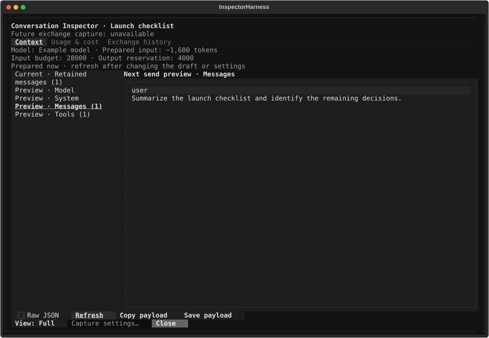

# Console: Context & RAG — controlling and inspecting what the model sees

## What this page is for

Every Console send is assembled from parts you control: system prompt,
history, an optional response prefill, tools, staged sources, and — when
retrieval is on — whatever RAG pulls in. This page covers inspecting that
payload before it goes out, shaping it (`/system`, `/prompt`,
`/prefill`), narrowing retrieval (RAG scope), and tracing a grounded
reply back to its citations.

## Getting there

Open Console with **Ctrl+2**. This page's surfaces: the **Chat Context**
viewer (**Ctrl+Shift+P**), the **Inspector** rail on the right (click its
handle to expand), the status chips above the composer, and the composer
for `/prompt`, `/system`, and `/prefill`.

## Layout tour

Where this page's controls live:

- **The "Chat Context" viewer** (captured above) — a window over the
  screen, opened with **Ctrl+Shift+P**.
- **The Inspector rail** (right edge) — the "Sources" tray at the top, the
  retrieval-scope row beneath it, the "Prefill" rows when one is armed, the
  "Live work sources" card, and the "Chat Dictionaries" / "World Books"
  blocks at the bottom.
- **The status chips** above the composer — "RAG: on/off", "Sources: N
  staged", and the "Scope: N" chip once retrieval is narrowed.
- **The composer** — where `/prompt`, `/system`, and `/prefill` are typed;
  the left rail's Model section carries the clickable `System:` line.

## Features & controls

### The "Chat Context" viewer (Ctrl+Shift+P)

Press **Ctrl+Shift+P** to open **Chat Context** — a read-only snapshot of
what the model has seen and is about to see. The header carries an
approximate token count (e.g. `(~1234 tokens)`) when a draft-based
estimate exists; mid-stream a warning reads "A response is in progress;
snapshot may change." Two tabs:

- **Current** — one collapsed section per transcript message, titled with
  its role and status; expand any to read the exact stored text. Empty
  state: "No conversation context." (The role currently displays in its
  internal form, e.g. "[ConsoleMessageRole.USER] complete" — task-1621.)
- **Next Send** — the payload the next send will carry, as collapsible
  folds: **Model**, **System**, **Messages** (one collapsed `Message N`
  per entry), **Response Prefill** (only while armed, noting "The reply
  will continue from this prefill; the agent loop (tools/MCP) is skipped
  for this send."), **Tools**, and **Staged Sources**.

Footer controls: a **Raw JSON** checkbox, **Refresh** (also the `r` key),
**Copy JSON**, **Save to File** (writes the payload to disk and shows the
path), and **Close** (also `Escape`). Payloads over 1 MiB are not
rendered inline — the viewer shows "Context exceeds 1 MiB. Use Save to
File to view the full payload."

### System prompt

Type `/system` (or use the palette entry **Console: Edit system prompt**,
or click the `System:` line in the left rail's **Model** section — it
ends in a `▸` and reads `System: none` while unset) to open the **Edit
system prompt** modal: "Applies to this session.", the prompt editor, a
**Name** field with a **Save to Library** button for keeping the prompt
in Library, and the buttons **Clear**, **Cancel**, and **Apply**.

`/system <name>` applies a saved prompt's system part directly (exact
name match, then unique prefix); anything else opens the **Apply system
prompt** picker. A saved prompt without a system part is refused with
`Prompt "<name>" has no system part.` — picker rows show " (no system
part)".

### Saved prompts (/prompt)

`/prompt <name>` **replaces your current draft** with the saved prompt's
user text (exact match, then unique prefix). Bare `/prompt`, or an
ambiguous/unknown name, opens the **Insert prompt** picker ("Search
prompts…"; empty state "No saved prompts yet — create them in Library ▸
Prompts."). A large prompt body arrives in the composer as a collapsed
paste token — click it (or press Enter on it) to unfurl.

### Response prefill (/prefill)

A prefill is text the assistant's reply must continue from — useful for
forcing a format ("Here is the JSON:") or an opening tone.

- `/prefill <text>` arms one for the next send only. Confirmation:
  "Prefill armed for next send: '<text>'. The reply continues directly
  from the last character; tool calling is skipped on prefilled sends."
- `/prefill pin <text>` persists it — the confirmation adds "Applies to
  every send, retry, and regenerate until /prefill clear."
- `/prefill clear` removes it ("Prefill cleared.").
- Bare `/prefill` reports status: `Prefill (next send only): '…'`,
  `Prefill (pinned): '…'`, or "No prefill armed."

Prefill text is capped at 4,000 characters. While armed it shows in the
Inspector rows **Prefill (next send only)** / **Prefill (pinned)** and in
the Chat Context viewer's **Response Prefill** fold.

### RAG scope

RAG scope limits retrieval to chosen Library items instead of searching
everything. The Inspector's retrieval-scope row has three states:

- **Scope: everything** + a **Narrow…** button — no scope set.
- **Scope: N items** + **Edit** and **Clear** — a scope is active; a
  **Scope: N** chip also appears in the status strip above the composer
  (click it to reopen the picker).
- **Scope: empty** (alert-styled, + **Narrow…**) — the configured scope
  resolves to nothing (e.g. conversation and workspace scopes don't
  overlap), so retrieval over it would return zero items.

**Narrow…**, **Edit**, and the chip open the **Narrow RAG scope —
<target>** picker: tabs **All** / **Media** / **Notes**, a "Filter by
title…" box, tag chips with "Search tags…", a **Sort:** select
(**Recent** / **Title** / **Type**), an **All** / **Selected** view
toggle, a paged list (**◂ Prev** / **Next ▸**, `▦` media / `✎` note),
bulk **Select all matching** / **Clear shown** (large select-alls ask
**Confirm** / **Cancel**), and a footer with a "N selected of M" count
plus **Save**, **Clear scope**, and **Cancel**.

Scope exists at two levels. The left rail's **RAG Scope** button sets a
**workspace-level** scope ("Narrow RAG retrieval to items in this
workspace"); a conversation's scope then narrows *within* it — items
outside are suffixed "— outside workspace scope", and the effective scope
is the intersection (chip tooltip: `conversation 2 ∩ workspace 5 → 2`).

### Staged sources & Library RAG

The Inspector's **Sources** tray lists context staged for the run, one
row per source with a status word (ready / running / blocked / muted);
empty state: "No sources attached. Stage sources from Library." The
control-bar **Attach context** action opens the "Console context" rail;
the staging itself is done from the Library screen.

To gather evidence *before* sending, use the Inspector's **Live work
sources** card: type a question into "Ask Library sources before sending"
and press **Run Library RAG** (also a control-bar action). It searches
your Library (notes, media, conversations) and stages what it finds.

### Citations

When a reply is grounded in sources, a **Sources (N)** button appears
under it, opening the **Sources** window: `[S1]`-numbered rows, a detail
pane with the matched snippet, an **Open in Library** button (shown when
the source can be opened), and **Close**.

Dim notices under the reply track verification: "Checking citations…",
then "Citations repaired" or "Citations repaired · View original attempt"
(the **View original attempt** message action toggles an inline preview
of the pre-repair text, headed "Original attempt (not selected)"), or
"Citation repair unavailable · Original response kept".

### Chat dictionaries & world books

Chat dictionaries rewrite matching text before it reaches the model;
world books inject lore entries into the prompt when their keywords come
up. A deep dive lives in the Roleplay chat dictionaries guide (coming in
a later guide phase). The Inspector shows what's in play:

- **Chat Dictionaries** — rows marked "from conversation" or "from
  character", with " (shadowed)" and/or " (disabled)" appended; actions
  **Attach dictionary…** / **Detach dictionary…**. Empty state: "No
  dictionaries in play".
- **World Books** — rows showing "N entries" (plus " (disabled)");
  actions **Attach world book…** / **Detach world book…**. Empty state:
  "No world books in play".

## Common tasks

1. **Check exactly what the next send contains** — type your draft, press
   **Ctrl+Shift+P**, open **Next Send**, expand the folds; `r` refreshes.
2. **Set a system prompt for this session** — type `/system`, write the
   prompt, press **Apply**; the rail's `System:` line now previews it.
   Name it and press **Save to Library** first to reuse it later.
3. **Make the reply start with a fixed opening** — type
   `/prefill Here is the summary:` and send; the reply continues from the
   last character. `/prefill pin …` keeps it; `/prefill clear` when done.
4. **Narrow RAG to two documents** — expand the Inspector, press
   **Narrow…** on the scope row, pick the **Media** tab, filter by title,
   click the two items, press **Save**. The strip shows **Scope: 2**.
5. **Open a citation's source in Library** — click **Sources (N)** under
   the reply, select an `[S1]` row, press **Open in Library**.

## Keyboard & commands

| Key / command | Action |
|---|---|
| Ctrl+Shift+P | Open the Chat Context viewer |
| r / Escape (in the viewer) | Refresh the snapshot / close |
| `/prompt [name]` | Replace the draft with a saved prompt (picker when ambiguous) |
| `/system [name]` | Edit the session system prompt, or apply a saved prompt's system part |
| `/prefill [pin\|clear] [text]` | Arm, pin, clear, or report the response prefill |

Mistyping a command shows the full list: "Unknown command /… — available:
/prompt, /system, /skills, /prefill, /generate-image, /rewind. Press
Enter again to send as text."

## Related settings & docs

- `config.toml` `[rag]` (and legacy `[rag_search]`) — retrieval and
  processing settings; covered with the Library/Search pages (not yet
  written).
- Library ▸ Prompts (not yet written) — where saved prompts are created
  and managed.
- [Console orientation](../console.md) — layout tour, rails, and chips.
- [Branching & rewind](branching-and-rewind.md) — how regenerate, edit &
  resend, and "Summarize up to here" change what history the model sees.
- [Guide index](../index.md) — global keys and navigation.

## Quirks & troubleshooting

- **Prefilled sends skip tools.** While any prefill is armed, tool
  calling (including MCP) is skipped for that send — the armed
  confirmation and the viewer's Response Prefill fold both say so.
- **A one-shot prefill can't literally start with `pin `** (or be exactly
  `clear`) — those parse as subcommands. Rephrase, or pin then clear.
- **"Scope: empty" means zero-result retrieval.** The alert-styled state
  warns before you send into it — **Clear** or **Edit** the scope.
- **The viewer's token count is a draft-derived estimate** — a guide, not
  a billing meter.

—
*Verified against dev @ ff435772c — 2026-07-31*
