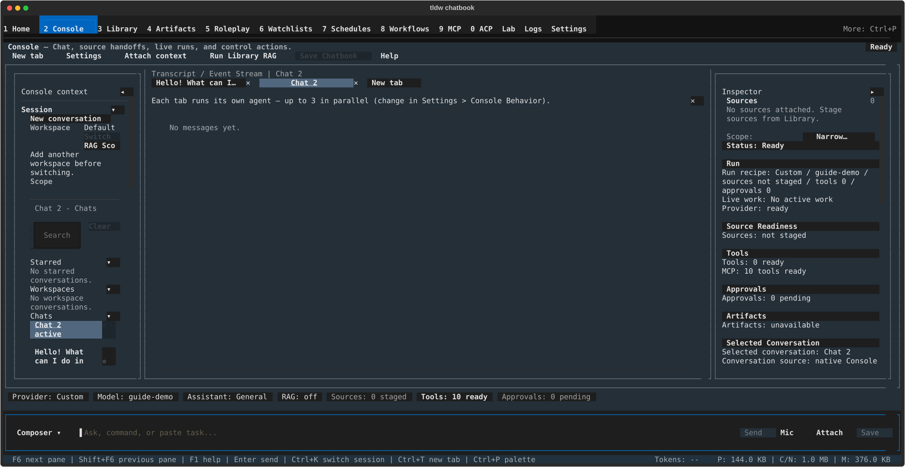

# Console sessions, tabs & workspaces — run several chats side by side and keep them organized

## What this page is for

The Console can hold many conversations at once: tabs run chats (and their
agents) in parallel, the conversation browser in the left rail finds and stars
past chats, and workspaces group related conversations into separate contexts.
Reach for this page when you want a second chat running while the first one
streams, when you need to dig up an old conversation, or when one "Default"
pile of chats stops being enough.

## Getting there

Open the Console screen (see [Console](../console.md) for navigation and the
layout tour). Everything on this page lives in two places:

- The **tab strip** — the row of tabs directly under the
  "Transcript / Event Stream" title above the transcript.
- The **"Console context"** rail on the left — its "Session" section (the
  Workspace block and the "Conversations" browser) and its "Details" section.
  If the rail is collapsed, click the "Context ▸" handle at the left edge to
  open it.

## Layout tour

**Tab strip.** Each open chat is a tab. A tab's label starts out as
"Chat 2"-style and takes the text of the first message you send. Labels are
trimmed to about 19 characters — hover a tab to see the full title. Each tab
has a "✕" close button, and the strip always ends with a "New tab" button.
Tabs that are running an agent show a marker glyph before the label:
● running, ◆ needs approval, ✓ finished, ✗ failed — the mark clears once you
visit that tab (see [Agent runs & tools](agent-runs-and-tools.md)).

The first time you open a second tab, a one-time coach-mark appears under the
strip: "Each tab runs its own agent — up to 3 in parallel (change in
Settings > Console Behavior)." Dismiss it with its "✕". The "3" is the
default limit — the banner shows whatever your configured limit is.

**Session block** (left rail, "Session" section). Shows "Workspace" plus the
active workspace name, with "Switch", "New", and "RAG Scope" buttons, and a
"Scope" line naming the active conversation. "RAG Scope" narrows retrieval to
this workspace's items — see [Context & RAG](context-and-rag.md).

**Conversations browser** (below the Session block). A "Conversations" header,
a "Search conversations" box with a "Clear" button, a "New conversation"
button, and three collapsible groups: "Starred" ("No starred conversations."
when empty), "Workspaces", and "Chats". Each row shows the conversation title
plus a secondary line of `<workspace> - <state> - <age>` (for example
"Chats - active session - 1m"), and ends with a star toggle ("☆" / "★").

**Details section** (left rail, collapsed by default). Status lines for
"Storage", "Sync", "File tools", "Server", and "ACP", plus a "Handoff" list.
On a local-only setup the server lines collapse into one line:
"Server features (sync, handoff, ACP): not configured. Chats stay local."

## Features & controls

### Tabs

| Control | What it does |
|---|---|
| "New tab" (strip or control bar) / Ctrl+T | Opens a fresh chat tab |
| Click a tab | Switches to it; a second click on the active tab opens "Rename Chat Tab" |
| Middle-click a tab | Closes it |
| "✕" on a tab | Closes it; if the tab has messages, a "Close Tab" confirmation warns "This tab has messages that will be lost." and asks "Close it anyway?" — "Close" / "Keep" |
| Alt+1 … Alt+9 | Jumps straight to tab 1–9 |
| Marker glyph (● ◆ ✓ ✗) | That tab's agent-run status — clears when you visit the tab |

Each tab keeps its own unsent draft: switch tabs mid-thought and the
half-typed message is still in the composer when you come back.

### "Switch Session" (Ctrl+K)

A fuzzy finder over your conversations. Type into "Search conversations…" to
filter, press Enter to activate the top result, or move through results with
↑/↓ and press Enter (or click) on the one you want. F2 renames the
highlighted result when it is an open tab. Esc cancels.

### Conversation browser

| Control | What it does |
|---|---|
| "Search conversations" + "Clear" | Filters the row list; "Clear" resets it |
| "New conversation" | Starts a fresh conversation |
| "Starred" / "Workspaces" / "Chats" | Groups; click a header's ▸/▾ toggle to expand or collapse |
| Conversation row | Click to open it in the Console |
| "☆" / "★" | Stars or unstars the conversation — starred rows collect under "Starred" |

### Workspaces

| Control | What it does |
|---|---|
| "Switch" / Alt+W | Opens "Change Workspace" — "Switching changes Console context only; Library and Notes stay globally visible." Click a workspace to activate it; the active one is marked "(current)" and the built-in one is listed as "Default (everyday chats)" |
| "New" | Creates a workspace (named "Workspace 1", "Workspace 2", …) and switches to it |
| "Rename" (in the switcher) | Opens "Rename Workspace" — edit the name, then "Save" |
| "Archive" (in the switcher) | Opens "Archive workspace?" — "Its conversations stay saved and remain visible in Library; the workspace disappears from the switcher and the Console browser." Confirm with "Archive" |
| "RAG Scope" | Narrows retrieval to this workspace — see [Context & RAG](context-and-rag.md) |

The built-in Default workspace has no "Rename" or "Archive" buttons. If you
archive the workspace you are in, the Console switches back to Default.

### Details

Open the "Details" header in the left rail to see where your chats live:
"Storage" (local database status), "Sync", "File tools", "Server", and "ACP"
lines (for example "Sync: Off", "Server: Not configured"), and a "Handoff"
list that reads "No handoff package is ready." until a handoff package
exists. If none of the server features are configured, the section shows the
single summary line quoted in the layout tour instead.

## Common tasks

**Open a second tab and run both**

1. Press Ctrl+T (or click "New tab"). A "Chat 2" tab opens.
2. Send a message — the tab label takes your first message's text, and the
   reply runs independently of the other tab.
3. Switch back with Alt+1 (or click the first tab). A ● marker on the other
   tab means its run is still going; ✓ means it finished while you were away.

**Rename a tab**

1. Click the tab to make it active (skip if it already is).
2. Click it again — "Rename Chat Tab" opens.
3. Type the new name and confirm.

**Find an old conversation**

1. Press Ctrl+K, type a few characters of the title, and press Enter to open
   the top match — or,
2. In the left rail, type into "Search conversations" and click the row you
   want under "Starred", "Workspaces", or "Chats".

**Star a conversation**

1. Find its row in the "Conversations" browser.
2. Click the "☆" at the end of the row. It becomes "★" and the conversation
   is pinned under "Starred". Click "★" to unstar.

**Create and switch to a new workspace**

1. In the "Session" block, click "New" — a "Workspace N" is created and
   becomes active; new chats now land in it.
2. To go back, press Alt+W (or click "Switch") and pick
   "Default (everyday chats)".
3. Optional: in the same switcher, use "Rename" to give the new workspace a
   real name.

## Keyboard & commands

| Key | Action |
|---|---|
| Ctrl+T | New Console tab |
| Ctrl+K | "Switch Session" fuzzy finder |
| Alt+1 … Alt+9 | Jump to tab 1–9 |
| Alt+W | "Change Workspace" switcher |

## Related settings & docs

- **Settings > Console Behavior** → "Parallel agent runs" → "Max parallel
  agent runs" — the cap the coach-mark quotes (config key
  `[console] max_parallel_runs`, default 3).
- [Console overview](../console.md) — the full screen tour.
- [Agent runs & tools](agent-runs-and-tools.md) — what the ● ◆ ✓ ✗ markers
  mean in detail, approvals, and the run log.
- [Context & RAG](context-and-rag.md) — RAG scope and staged context.
- [Guide index](../index.md) — global keys and navigation.

## Quirks & troubleshooting

- On a fresh profile only Default exists, so workspace switching is
  unavailable — the Session block shows "Add another workspace before
  switching." Click "New" first.
- Closing a tab that has messages always asks the "Close Tab" confirmation;
  there is no way to close a non-empty tab silently.
- Tab titles truncate at about 19 characters. Hover the tab for the full
  title.
- The coach-mark only goes away for good when you dismiss it with its "✕" —
  if you close the second tab without dismissing it, it can appear again the
  next time you open one.
- A brand-new conversation can't be starred until it has been sent or saved —
  the star's tooltip says "Send or save this conversation before starring."
- The Default workspace can't be renamed or archived.

—
*Verified against dev @ ff435772c — 2026-07-31*
