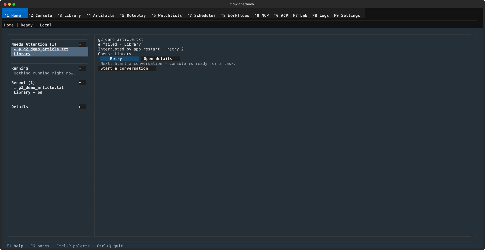
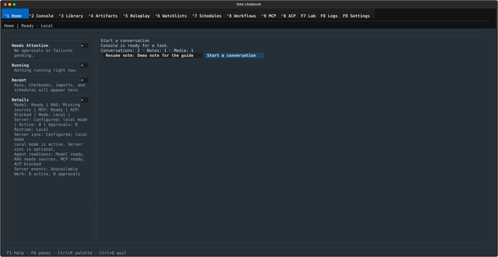
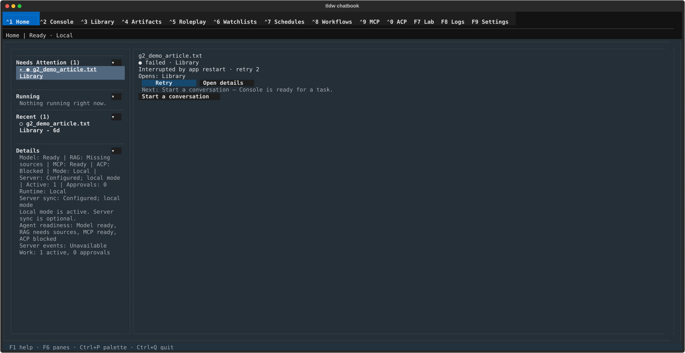

# Home — A triage snapshot of your work, taken when you arrive.

## What this screen is for

Home answers one question: **is anything waiting on you?** It lists work
needing attention (failed imports, items pending a decision, flashcards due),
what is running, and what recently finished — with one suggested next action —
and hands you off to the screen that owns each item. Nothing is created or
edited here.

Two things to know before trusting it:

- **The app does not open on Home.** A normal launch lands on
  [Console](console.md) (the `default_tab` config default); Home greets you
  only on a first run, underneath the setup wizard. Reach it with **Ctrl+1**.
- **Home is a snapshot, not a live dashboard.** It reads your work once, when
  the screen mounts, and never refreshes on its own — an import progressing
  while you watch does not move on screen. Click a row, or leave and come
  back, to re-read (backlog task-2763).

## Getting there

- **Ctrl+1** from anywhere — it works even while a text field has focus.
- Click **⌃1 Home** in the nav bar, or **Ctrl+P** → "Tab Navigation: Switch
  to Home".

## Layout tour

| Region | What it shows |
|---|---|
| **Header line** | "Home \| Ready · Local" — "Ready"/"Blocked" is model readiness (see Quirks — it is optimistic), then "Local", or "Server: \<name\>" when a server is the runtime source. |
| **Rail** (left) | Four collapsible sections — **Needs Attention**, **Running**, **Recent**, **Details** — each headed by its title (plus " (N)" only when it has items) and a **▾**/**▸** toggle. Work items are two-line rows: a status glyph and title, then the owning source and age ("● g2_demo_article.txt" / "    Library - 6d"). The selected row is marked **▸**. Titles longer than 20 characters are cut with "..." — hover for the full title. |
| **Canvas** (right) | The selected item's card: title, a status line ("● failed · Library"), the failure reason when there is one ("Interrupted by app restart · retry 1"), and "Opens: \<screen\>" — plus that item's action buttons. With nothing selected it shows the **next-action card** instead (see below). |
| **Footer** | The global "Ctrl+Q quit \| Ctrl+P palette" hints and the token/DB read-outs — Home adds nothing of its own. |

Section state survives restarts (collapsed/expanded is saved to your config);
**Details starts collapsed**. Empty sections say so in plain words: "No
approvals or failures pending.", "Nothing running right now.", "Runs,
chatbooks, imports, and schedules will appear here."

With nothing needing attention, the canvas *is* the suggestion: a title like
"Start a conversation", the reason ("Console is ready for a task."), a
content-count line ("Conversations: 2 · Notes: 1 · Media: 1" — only non-zero
counts appear), and buttons — **Resume note: \<title\>** (or **Resume
conversation: \<title\>**) and the suggestion itself.

## Features & controls

### What lands in each section

- **Needs Attention** — failed watchlist runs, failed Library import jobs
  (including those marked "Interrupted by app restart" when the app closed
  mid-import), items pending approval, and a synthetic "Flashcards due: N"
  row when Study cards are waiting.
- **Running** — in-flight watchlist runs and Library imports
  (queued / parsing / writing).
- **Recent** — the last 8 finished things: terminal runs, done imports,
  Chatbook artifacts, each with an age ("Library - 6d").

Selecting a row repaints the canvas for that item; the highest-priority item
(approval > failed > running > paused) is selected for you when you arrive.

### The item card's buttons — what each really does

| Button | What it does |
|---|---|
| **Retry** | Real for Library import jobs: "Retry queued for \<file\>." (or "This import job can no longer be retried." for permanent failures — those rows omit the button). For anything else, see the warning below. |
| **Open details** | Navigates to the owning screen — "Opening Library import job details." lands on Library's import queue; a watchlist run opens Watchlists at that run. |
| **Open in Console** | Only offered for watchlist runs and Chatbook artifacts — opens Console following that work. |
| **Approve** / **Reject** / **Pause** / **Resume** | **Decorative today.** Each shows the same warning toast — "\<Label\> is not connected to an active run service yet. Open details or Console to inspect the work." — and changes nothing. Decide approvals on the owning screen. |
| **Review flashcards** | On the "Flashcards due: N" row — opens Study directly at its flashcards section. Study's breadcrumb reads "Home ▸ Study" and Escape returns here, to Home (task-4011). |

### The next-action ladder

The suggestion (and the "Next: \<label\> — \<reason\>" line under an item
card) is the first match in a fixed priority order:

| Priority | Suggestion | Goes to |
|---|---|---|
| 1 | "Set up Console model" — Console needs a working model before live AI tasks. | Settings (effectively never fires — see Quirks, task-2764) |
| 2 | "Review pending approvals" — Agent work is waiting for a decision. | Console |
| 3 | "Review failed schedules" — Scheduled work needs recovery. | Schedules |
| 4 | "Review failed work" — Failed work needs recovery. | the failed item's screen |
| 5 | "Resume active work" — Live work is already running. | Console |
| 6 | "Review notifications" — Unread notifications need review. | **Watchlists** (that is where notifications live) |
| 7 | "Import Library sources" — Library content makes Console and RAG more useful. | Library (its default view, not an import form — task-2765) |
| 8 | "Search your Library" | unreachable today (task-2761) |
| 9-10 | "Start a conversation" / "Start in Console" — Console is ready for a task. | Console |

**The suggestion button can disagree with its own label** when a failed item
is selected — see Quirks (task-2760).

### Details — the readiness read-out

Expanding **Details** shows one dense block: a summary line
("Model: Ready | RAG: Missing sources | MCP: Ready | ACP: Blocked | Mode:
Local | Server: Configured; local mode | Active: 1 | Approvals: 0"), then
"Runtime:", "Server sync:", a one-line explanation ("Local mode is active.
Server sync is optional."), "Agent readiness: …", "Server events: …", and
"Work: N active, N approvals" (plus "Notifications: N unread" when any).
Read it with the Quirks section open: two of the four readiness fields are
hard-coded, and "Model: Ready" is optimistic.

## Common tasks

1. **Recover an import that died with the app.** Reopen the app after a crash
   or quit mid-import: Home's **Needs Attention** lists the job as "● failed ·
   Library" / "Interrupted by app restart". It is already selected — press
   **Retry** ("Retry queued for \<file\>.") and check progress in
   [Library ▸ Import & export](library/import-and-export.md); Home itself
   will not update while you watch (task-2763).
2. **Pick up where you left off.** With nothing urgent, the canvas offers
   **Resume note: \<title\>** / **Resume conversation: \<title\>** — the
   newest of each, ties going to the conversation. Notes open in Library,
   conversations in Console.
3. **Clear flashcards that are due.** The "Flashcards due: N" row's **Review
   flashcards** lands on Study's flashcards section.
4. **See why agent work is blocked.** Expand **Details** for the runtime,
   server, and readiness lines — then verify anything surprising on the
   owning screen, not here (see Quirks).

## Keyboard & commands

**Home defines no keys of its own.** There are no single-letter mnemonics, no
way to select a rail row or press a canvas button from the keyboard beyond
**Tab**/**Shift+Tab** focus-walking, and nothing for a focused field to
swallow (Home has no text fields). What works is global: **Ctrl+1 … Ctrl+0**,
**F7/F8/F9**, **Ctrl+P**, **Ctrl+Q**.

- **F1** here lists only the three inherited bindings (Tab / Shift+Tab /
  Ctrl+C copy) — it does not mention the global navigation keys.
- **F6** shows "No workbench pane focus target is available." — Home has no
  pane cycle.

Palette entries that land here: "Tab Navigation: Switch to Home".

## Related settings & docs

- Where the work comes from: [Library ▸ Import & export](library/import-and-export.md)
  (import jobs), [Watchlists](watchlists.md) 🚧 (runs and notifications),
  [Artifacts](artifacts.md) 🚧 (Chatbooks), Study (flashcards),
  [Console](console.md) (conversations, agent runs).
- [Settings ▸ Providers & Models](settings.md) — what "Model: Ready" *should*
  reflect; [Settings ▸ Storage](settings.md) — where the databases behind the
  counts live.
- `config.toml`: `[home]` → `rail_state.sections` is the only key Home writes
  (which rail sections are expanded). Failures to save it are silent.
- [Guide index](index.md) — global keys and navigation.

## Quirks & troubleshooting

- **It says "Ready" but nothing works.** The header's "Ready" and Details'
  "Model: Ready" only mean the config's provider table is non-empty — the
  shipped default config satisfies that with zero API keys. Console's own
  readiness check is separate and stricter. Set up the provider in
  [Settings](settings.md) regardless of what Home claims (backlog task-2764).
- **"MCP: Ready" and "RAG: Missing sources" never change.** Both are
  hard-coded defaults nothing ever updates — MCP is always "Ready" (even with
  no server), RAG is always "Missing sources" (even fully configured). Only
  the Model and ACP fields are real (backlog task-2761).
- **The suggestion button went somewhere else.** With a failed item selected,
  the button and the "Next:" line can promise one destination (e.g. "Start a
  conversation" → Console) while the click routes by a different rule and
  lands elsewhere (e.g. Library) (backlog task-2760).
- **Approve/Reject/Pause/Resume did nothing.** By design today: they only
  toast "…is not connected to an active run service yet." Decide approvals on
  the owning screen — and note a Console approval waiting on you is **not**
  counted here: Home can show "Approvals: 0" and an empty Needs Attention
  while Console blocks on a decision.
- **An import finished but Home still shows it running.** Home never
  refreshes after it mounts. Click any row, or leave and return, to re-read
  (backlog task-2763).
- **More work exists than the rail shows.** Neither the rail nor the canvas
  scrolls, and there is no overflow cue — on a short terminal, rows past the
  fold are simply invisible and unreachable (backlog task-2762).
- **"Review notifications" opened Watchlists.** Correct, if surprising —
  notifications live on the Watchlists screen.
- **No "Conversations: … · Notes: …" line at all.** Either you truly have no
  content, or the count queries failed silently — the two cases look
  identical, and a failed count also revives the "Import Library sources"
  suggestion for a full Library.

—
*Verified against dev @ 642567627 — 2026-08-10*
