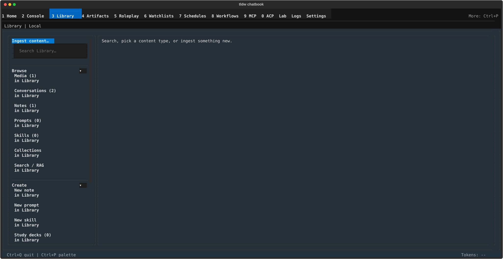

# Library — Your content hub: sources, search, and imports.

## What this screen is for

Library is where everything the app knows about lives: media you've
ingested, conversations from Console, notes, prompts, skills, and
Collections — plus search and RAG over all of it, and the import/export
tools that move content in and out. Reach for it to add source material,
find something you saved, or hand a bundle of sources off to Console or
Study. This page is the orientation tour; the details live on eight child
pages:

- [Media & conversations](library/media-and-conversations.md) — browse ingested media (with the media viewer) and your Console conversations.
- [Notes](library/notes.md) — the notes list, editor, templates, and the Notes sync panel.
- [File Notes](library/file-notes.md) — the folder-backed File Notes workspace and its Session Git panel.
- [Prompts](library/prompts.md) — saved prompts: list, editor, import, and Console insert.
- [Skills](library/skills.md) — skill packs: import, editing, and the trust/approval flow.
- [Collections](library/collections.md) — local Collection records for saved content.
- [Search & RAG](library/search-and-rag.md) — the Library Search/RAG canvas, evidence, and the Console handoff.
- [Import & export](library/import-and-export.md) — the Import media flow and the Export chatbook canvas.

## Getting there

- Press **Ctrl+3** from anywhere, or click **Library** in the nav bar.
- **Ctrl+P** → "Switch to Library" in the command palette.
- Old destination names still work: typing **notes**, **prompts**,
  **skills**, **ingest**, **research**, **media**, **search**, **study**,
  **writing**, or **conversation** into the palette routes to Library —
  those former screens now live inside it. The palette also offers
  "Library — Skills", which lands directly on the Skills row.

## Layout tour

- **Header line** — reads **Library | Local**, or **Library | Server:
  \<label\>** when a server runtime is configured.
- **Left rail**, top to bottom:
  - the **Ingest content…** button ("Open the ingest canvas to add
    Library content.");
  - the **Search Library…** box — submitting it always lands on the
    Search / RAG canvas and runs your query;
  - three sections — **Browse** (Media, Conversations, Notes, Prompts,
    Skills, Collections, Search / RAG), **Create** (New note, New prompt,
    New skill, Study decks, Flashcards, Quizzes), and **Import / Export**
    (Import media, Export). Each row is two lines: the title with its
    count, then "in Library". The selected row is marked **▸**, and the
    Flashcards row shows "due: N" instead of a plain count;
  - a **Details** section, collapsed by default (see below). Section
    headers toggle open (**▾**) and closed (**▸**).
- **Canvas** (the right pane) — there are no tabs here: the canvas swaps
  to match whichever rail row is selected. Before you pick one it shows
  the landing copy: "Search, pick a content type, or ingest something
  new."
- **Footer** — minimal; a "u — use Library context in Console" hint
  appears only while the Search / RAG row is selected.

One special case: selecting **Notes** adds a **Database | Files** strip
above the workbench. **Files** swaps the entire Library shell for the
File Notes workspace — see [File Notes](library/file-notes.md).

## Features & controls

### Left rail

| Control | What it does |
|---|---|
| **Ingest content…** | Opens the Import media canvas — see [Import & export](library/import-and-export.md). |
| **Search Library…** | Type a query and press Enter: lands on the Search / RAG canvas and runs it — see [Search & RAG](library/search-and-rag.md). |
| **▾** / **▸** (section headers) | Open or collapse that rail section. |

### Browse rows

| Row | Opens | Details on |
|---|---|---|
| **Media** | The media list and viewer. | [Media & conversations](library/media-and-conversations.md) |
| **Conversations** | Your Console conversations, with preview and "Open in Console". | [Media & conversations](library/media-and-conversations.md) |
| **Notes** | The notes list/editor, plus the Database \| Files source strip. | [Notes](library/notes.md) |
| **Prompts** | The prompts list and editor. | [Prompts](library/prompts.md) |
| **Skills** | The skills list, editor, and trust panel. | [Skills](library/skills.md) |
| **Collections** | Library Collections (local records). | [Collections](library/collections.md) |
| **Search / RAG** | The Library Search/RAG canvas. | [Search & RAG](library/search-and-rag.md) |

### Create rows

| Row | What it does |
|---|---|
| **New note** | Opens the note-creation canvas: **Blank note** or a pick from "From a template" — see [Notes](library/notes.md). |
| **New prompt** | Opens a fresh prompt editor — see [Prompts](library/prompts.md). |
| **New skill** | Opens a fresh skill editor — see [Skills](library/skills.md). |
| **Study decks** / **Flashcards** / **Quizzes** | Hand-off canvases that open the Study screen — see the next section. |

### Import / Export rows

| Row | What it does |
|---|---|
| **Import media** | The full ingest flow: path or URL, pre-flight check, per-type options, queue — see [Import & export](library/import-and-export.md). |
| **Export** | The "Export chatbook" canvas: package local content into a portable file — see [Import & export](library/import-and-export.md). Disabled in server mode. |

### Details

Collapsed by default; click the **Details** header to open it.

| Group | Contents |
|---|---|
| **Status** | A "Runtime · Local" (or "Runtime · Server: \<label\>") line, and a counts row: "Notes N · Media N · Conversations N". |
| **Workspace** | "Active · \<workspace name\>" and "Handoff · \<summary\>" lines. |
| **Actions** | The buttons below, plus the note "Server sync WIP · local only". |

| Action | What it does |
|---|---|
| **Create local workspace** | "Create a local-only workspace and make it active. Server sync and ACP handoff remain WIP." |
| **Import sources** | Shown only while you have no workspace-eligible sources: "Open Library Import/Export to add workspace-eligible sources." |
| **Use in Console** | Stages a snapshot of your local Library sources ("Local Library Sources") into Console and takes you there. When it can't run yet, its tooltip says why — "Stage Library source context after Library finishes loading." or "Stage Library source context after adding notes, media, or conversations." |

### Study, Flashcards & Quizzes hand-offs

**Study is its own screen** — reach it any time via **Ctrl+P** → "Study".
The three Create rows in Library don't host study content; each shows a
small hand-off canvas that snapshots your Library sources and opens Study
with them. Their purpose lines:

- **Study decks** — "Plan study decks from Library sources."
- **Flashcards** — "Generate or review cards from Library sources."
- **Quizzes** — "Generate or resume quizzes from Library sources."

Each canvas shows the same five elements: the purpose line, a "Carries
forward: …" line naming up to three source titles (then "and N more."),
the ownership note "Generation and review run in Study.", a readiness
line ("Source snapshot is ready.", or a prompt to import sources or
create notes first), and a **Continue in Study** button ("Open \<X\> with
the current Library source snapshot, or globally when none is
available.").

## Common tasks

1. **Find anything you've saved.** Type into the **Search Library…** box
   and press Enter — you land on the Search / RAG canvas with results
   grouped as "Evidence · top 5 per source". Narrow with the **Sources**
   scope toggles ([Search & RAG](library/search-and-rag.md)).
2. **Ingest your first file.** Click **Ingest content…**, enter a file
   path or URL (or **Browse…**), review the pre-flight summary and
   options, then press **Start ingest**. The item appears under
   **Media** — full walkthrough in [Import & export](library/import-and-export.md).
3. **Create a note.** Click **New note** in the Create section, pick
   **Blank note** or a template under "From a template", and start
   typing — notes autosave (the meta line ends in "saved"). **‹ Back to
   list** returns you to the notes list.
4. **Hand your Library snapshot to Console.** Open the **Details**
   section, then under **Actions** press **Use in Console** — Console
   opens with a "Local Library Sources" snapshot staged as context.
5. **Open Study with your sources.** Select **Study decks**,
   **Flashcards**, or **Quizzes** in the Create section, check the
   "Carries forward:" line, and press **Continue in Study**.

## Keyboard & commands

Screen-level keys only — global keys live in the [guide index](index.md).

| Key | Action |
|---|---|
| u | Use Library context in Console — only while the Search / RAG row is selected (the footer hint appears only there) |

Escape and Ctrl+S are bound only inside the skill editor (back to list /
save) — see [Skills](library/skills.md).

## Related settings & docs

- `config.toml`: `[library]` (ingest backend, last directory, and scan
  limit) and
  `[library.ingest_options]` (per-type ingest options, persisted by the
  ingest canvas); `[library.search]` (recent-search history); `[notes]`
  (notes auto-save and sync); `[file_notes]` (File Notes root folder);
  `[rag]`, `[rag_search]`, and `[embedding_config]` for retrieval and
  embeddings.
- Child pages: [Media & conversations](library/media-and-conversations.md) · [Notes](library/notes.md) · [File Notes](library/file-notes.md) · [Prompts](library/prompts.md) · [Skills](library/skills.md) · [Collections](library/collections.md) · [Search & RAG](library/search-and-rag.md) · [Import & export](library/import-and-export.md)
- Deep dives: [Notes bidirectional sync](../Features/notes_bidirectional_sync.md) · [Transcription](../Features/TRANSCRIPTION.md) (audio/video ingest backends).

## Quirks & troubleshooting

- **A rail count shows "(N+)".** The count was sampled rather than fully
  tallied — there are at least N items; open the row for the real list.
- **Export is greyed out.** In server mode the Export row is disabled:
  "Export packages local content only." Switch to a local runtime to
  export a chatbook.
- **Pressing "u" does nothing.** The shortcut only works while the
  Search / RAG row is selected — select it (or use the **Search
  Library…** box) first.
- **Clicking Study decks / Flashcards / Quizzes "leaves" Library.**
  That's by design — those rows are hand-offs, not Library canvases;
  generation and review run in the Study screen.
- **The palette found "Notes" but opened Library.** The standalone
  Notes, Prompts, Skills, Ingest, and Research screens were retired;
  their names now route to the matching Library row.

—
*Verified against dev @ bd05a692a — 2026-07-31*
