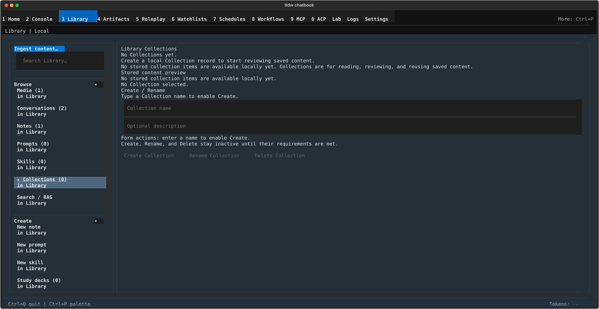

# Library Collections — named records for content you plan to read and review

## What this screen is for

Collections are named containers for saved content. In the panel's own
words: "Collections are for reading, reviewing, and reusing saved content."
Today, though, this surface is early: you can create, rename, and delete
Collection records, but you cannot yet put items into them or read items
from them. The panel states its own status honestly — "Available now:
create, rename, delete records", "Blocked later: item reader, Search/RAG,
Study, Console handoff, server sync", and "Next: collection item adapters
are required before item-level actions unlock." Reach for this panel now
only to stake out named Collections ahead of those features.

## Getting there

Press **Ctrl+3** (or click "Library" in the nav bar, or **Ctrl+P** →
"Library"), then in the left rail's **Browse** section click
**Collections**. The rail row shows the current count.

## Layout tour

The canvas is titled **"Library Collections"**. Top to bottom:

- **Empty state** (before your first Collection) — "No Collections yet.",
  "Create a local Collection record to start reviewing saved content.",
  a "Stored content preview" heading with "No stored collection items are
  available locally yet.", and "No Collection selected."
- **Collections** — the list pane. Each row reads "name - N items"
  (item counts are always 0 today); hovering a row shows its sync status
  as a tooltip. When a server sync profile is present, a short read-only
  status banner appears above the list.
- **Stored collection content** — the detail pane for the selected row:
  "Selected: name", the description (or "No description."), then the
  readiness headings "Item reader readiness" ("Stored item count: …",
  "Authority: …"), "Content use boundary" ("Browse/review remains global;
  active workspace controls staging and manipulation."), "Action status"
  (the available/blocked/next lines quoted above), and "Write Sync Safety"
  ("Review these labels before any future server write promotion." plus
  the sync label), ending with an "Updated … UTC" line.
- **Create / Rename** — the form: "Type a Collection name to enable
  Create.", inputs "Collection name" and "Optional description", the
  status lines "Form actions: enter a name to enable Create." and
  "Create, Rename, and Delete stay inactive until their requirements are
  met.", then the action buttons.

## Features & controls

| Control | What it does |
|---|---|
| "Collection name" | Name for a new Collection, or the new name when renaming. Required; 120 characters max. |
| "Optional description" | Free-text description shown in the detail pane. |
| Create Collection | Adds a Collection record. Enabled once a valid, unused name is typed. |
| Rename Collection | Renames the selected Collection to the typed name. |
| Delete Collection | First press of the two-press delete: it arms deletion and reveals "Confirm delete". |
| "Confirm delete" | Second press: actually deletes the selected Collection (tooltip: "Delete the selected local Collection."). |
| Collection rows | Click to select; the detail pane fills in. Row tooltip shows the sync status label. |

Disabled buttons always carry their reason as a tooltip — for example
"Enter a Collection name.", "A Collection with this name already exists.",
"Select a Collection before renaming it.", or "Select a Collection before
deleting it."

**Sync labels** (shown on row tooltips and under "Write Sync Safety") are
strictly read-only — every detail sentence ends by promising that no
writes will be queued:

| Label | Detail line |
|---|---|
| "Sync: local-only" | "This Collection is local-only. No sync writes will be queued." (the usual state; shown without a detail line in the pane) |
| "Sync: sync-unavailable" | "Sync dry-run is unavailable for this Collection. No writes will be queued." |
| "Sync dry-run: ready" | "Read-only mirror check: N mapped records. No writes will be queued." |
| "Sync dry-run: conflicts" | "Read-only mirror check: N conflicts need review. No writes will be queued." |
| "Sync dry-run: orphaned mappings" | "Read-only mirror check: orphaned local or remote mappings need review. No writes will be queued." |
| "Sync dry-run: unsupported" | "Read-only mirror check unavailable: (reasons). No writes will be queued." |

## Common tasks

1. **Create a Collection** — Open Collections from the rail. Type a name
   into "Collection name" (and a description if you want one); the
   Create Collection button enables. Press it — the new row appears in
   the Collections list as "name - 0 items".
2. **Rename a Collection** — Click its row in the Collections list, type
   the new name into "Collection name", then press Rename Collection.
3. **Delete a Collection** — Click its row, press Delete Collection, then
   press the "Confirm delete" button that appears beside it. Deleting is
   deliberately two presses; nothing is removed on the first press.

## Keyboard & commands

None — this panel has no screen-specific keys or slash commands. Global
keys live in the [guide index](../index.md).

## Related settings & docs

- This panel owns no config.toml keys; Collections are stored locally per
  profile.
- [Library overview](../library.md) — the rail, the other Browse panels,
  and the "Server sync WIP · local only" runtime note.
- [Guide index](../index.md) — global keys and navigation.

## Quirks & troubleshooting

- **Item-level features are not wired yet.** No item reader, no Search/RAG
  over Collections, no Study or Console handoff, no server sync — exactly
  as the panel's "Blocked later" line says. Item counts stay at 0 until
  "collection item adapters" land (the panel's own "Next:" line).
- **Names are capped at 120 characters** ("Collection names must be 120
  characters or fewer."); descriptions are capped at 500. Duplicate names
  are refused ("A Collection with this name already exists.").
- **A greyed-out button explains itself** — hover it and the tooltip gives
  the exact requirement that is not yet met.
- **Sync is display-only.** Every sync label describes a read-only check;
  no state on this panel ever queues a server write.
- If the Collections storage layer fails to load, actions report
  "Library Collections are unavailable."; a failed delete reports
  "Failed to delete Collection."

—
*Verified against dev @ bd05a692a — 2026-07-31*
