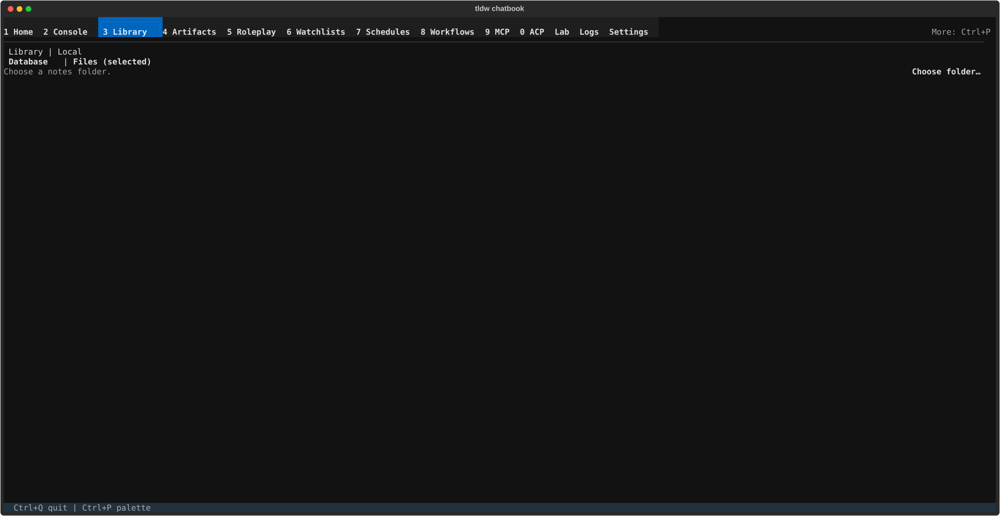

# File Notes — plain files on disk, edited in place

## What this screen is for

File Notes edits ordinary files that live in a folder you choose on disk —
what you see in the editor is exactly what's in the file, and saves write
straight back to it. It is a separate system from [Database notes](notes.md):
nothing here is stored in the Library database, there are no templates or
autosync, and no "Use in Console" handoff. Reach for it when your notes are a
folder of Markdown files (a wiki, a repo's docs, an Obsidian vault) and you
want to read, edit, search, and — if the folder is a Git repository — stage
and commit this session's edits, then publish that exact Chatbook-created
commit to its existing upstream, without leaving the app.

## Getting there

Open [Library](../library.md) (**Ctrl+3**), pick **Notes** in the rail's
Browse section, then use the source strip at the top of the canvas: it reads
**Database** | **Files**. Click **Files** — while the workspace loads you'll
briefly see "Opening File Notes…". Click **Database** to switch back; either
switch first saves any unsaved edits on the side you're leaving.

## Layout tour

- **Folder link row** (top) — before setup the status reads "Choose a notes
  folder." with buttons **Details** and **Choose folder…**. Once linked, the
  status becomes "Linked — \<folder\>" (or "Checking — …" / "Offline — …"
  when the folder can't be verified) and the button relabels to **Change…**.
  **Details** opens the read-only "File Notes folder details" dialog.
- **Navigator** (left) — a "Search file contents…" input, the **Files** tree
  of everything under the linked folder, a **Search results** tree that
  appears only while a query is active, and the **Session Git (N)** button —
  N counts the files changed in this session.
- **Editor pane** (right) — a breadcrumb ("No file selected" until you open
  one; "Recently deleted: \<path\>" right after a delete), a save-status
  label (Idle / Dirty / Saving / Saved / Conflict / Error, sometimes with a
  detail after a dash), a path input with placeholder "relative/path.md",
  two toolbars (**New Move Delete Restore Protect** and
  **Reload Save Copy Refresh**), the text editor itself, and an action-status
  line where results like "Deleted. Restore remains available." appear.
- **Session Git panel** — pressing **Session Git (N)** swaps the whole
  workspace for the staging, commit, and guarded-push panel described below;
  from the row list, **Esc** or **Back to navigator** returns to the files.
  During commit or push, **Esc** follows the phase-specific safe action in the
  keyboard table below.

## Features & controls

### Folder link

| Control | What it does |
|---|---|
| **Choose folder…** / **Change…** | Opens the "Choose File Notes Folder" picker; the choice is saved to `[file_notes] root` in config.toml |
| **Details** | Opens "File Notes folder details" — a read-only status report; **Close** or **Esc** dismisses it |

### Editor toolbar

The path input ("relative/path.md") is the target for **New**, **Move**, and
**Save Copy** — type where you want the file to go, then press the button.

| Control | What it does |
|---|---|
| **New** | Creates an empty file at the typed path and opens it — there is no file picker for creating content |
| **Move** | Moves the open file to the typed path |
| **Delete** | Two-press: first press shows "Click Delete again to confirm.", second deletes ("Deleted. Restore remains available.") |
| **Restore** | Brings back the most recently deleted file |
| **Protect** / **Unprotect** | Toggles protection on the open file ("Protected." / "Unprotected."); every save to a protected file first stores a checkpoint of its previous contents in the local recovery database |
| **Reload** | Re-reads the open file from disk, replacing the editor contents |
| **Save Copy** | Writes the editor text as-is to the typed path; only enabled while the save status is Dirty, Conflict, or Error |
| **Refresh** | Re-scans the folder and rebuilds the **Files** tree |

Saving is automatic — edit and the status walks Dirty → Saving → Saved. If
the file changed on disk underneath you the status shows Conflict; **Reload**
takes the disk version.

### Session Git — stage and commit session edits, then push the exact commit

The panel is headed "Prepare session for commit" with the scope line
"Session paths only · stages complete file state" and the keyboard guide
"Up/Down Select | Tab Actions | Enter Run | Esc Back". Before anything runs
it shows "Repository: not checked" / "Status: NOT CHECKED".

**Trust first.** Press **Trust and check status** and a confirmation dialog
titled "Trust Session Git repository?" appears:

> Repository: \<path\>
>
> Trust lasts only for this application process. Git status and staging may
> execute configured Git filters, including arbitrary programs with side
> effects outside Chatbook.
>
> Continue only if you trust this repository and its Git configuration.

**Cancel** is focused first, so Enter alone runs nothing. Confirming with
**Trust and check status** checks the repository and, from then on, a
**Refresh** button takes the trust button's place.

**Rows.** Each file edited this session gets a row whose second line states
where it stands:

| Row status | Meaning |
|---|---|
| READY TO STAGE · Git: unstaged | Your edit can be staged |
| STAGED · by Chatbook | Already staged from here |
| UPDATE AVAILABLE · newer note edits are not staged | You edited again after staging |
| UPDATE REQUIRED · stage the moved note before unstaging | A move needs restaging first |
| NO ACTION · matches HEAD | The file equals the last commit |
| BLOCKED · already staged outside Chatbook; manage this path in Git, then Refresh | Hands off — you staged it yourself |
| BLOCKED · ignored by Git / Git conflict / Git unavailable | Fix the condition outside Chatbook, then **Refresh** |

With no session edits the panel says "No current-session Git changes."

**Staging and committing.** Use **Stage** / **Unstage** on a row, or
**Stage all (N)** / **Unstage all (N)**. **Commit staged (N)** stays disabled
behind the gate "Stage at least one session note to commit" until something
is staged. It then opens the commit form — **Subject** (placeholder
"Required commit subject") and **Body (optional)** — and **Review commit**
runs a pre-check ("Checking commit...") before showing the review: the
"Exact commit message" as Git will record it, a "Show included notes (N)"
toggle listing every file going in, and branch/identity details. Finish with
**Confirm commit**, or step back with **Edit message** / **Cancel commit**.
If a result comes back uncertain, **Check again** re-checks it.

The commit review states the exact scope — for example, "2 session notes will
be committed; unrelated changes untouched". A successful commit is still
local: Chatbook never starts a push automatically.

#### Guarded push

After a successful guarded commit, the panel can expose
**Review push (1 commit)…** for that exact commit. The candidate exists only
in the current app process. It does not include older commits, commits made
outside Chatbook, or later note edits.

1. Press **Review push (1 commit)…**. Chatbook first checks the candidate and
   the existing upstream using local information only; the panel reads
   "Checking push candidate…" and offers **Cancel check**.
2. Before any network or authentication-helper contact, the
   **Authorize configured destination** dialog shows the sanitized endpoint,
   local branch, full destination ref, transport, and process-only
   authorization scope. **Cancel** has initial focus. **Endpoint Details**
   exposes the complete sanitized destination, while **Authorize and check**
   starts the authorized read-only remote preflight; it does not push. That
   exact-destination authorization also covers final revalidation and the
   reviewed push. Existing approved HTTPS credential helpers or the existing
   SSH agent may run after authorization, but terminal prompts remain
   disabled. The panel then reads "Checking remote before push…" and still
   offers **Cancel check**.
3. Read the immutable review. It identifies the commit and parent transition,
   configured remote and full ref, expected-parent lease, included session-note
   provenance, secure-transport policy, and possible remote effects. The
   included notes are not a new selection: later edits remain local. Local
   pre-push hooks do not run; remote hooks, branch policy, CI, or mirrors may.
4. **Back** has initial focus. Choose **Push 1 commit** only after confirming
   the destination. Chatbook freshly re-checks the candidate, configuration,
   authorization, and remote parent before requesting the one reviewed ref
   update.

You may use **Cancel check** before the network push process starts. Once the
panel says "Pushing 1 reviewed commit…", cancellation is unavailable;
**Back to Files — push continues** lets you keep editing while the owned
operation settles. Reopening **Session Git** reattaches to that same operation
or result without starting another request; the navigator button reports
**Push checking**, **Pushing**, or **Push needs attention** as appropriate.

| Push result | Meaning and next step |
|---|---|
| **Already published** | The destination already points to this commit. Chatbook sent no push. Choose **Back to session**. |
| **Succeeded** | Git accepted the exact update and a final check observed the commit. Choose **Back to session**. |
| **Blocked** | Chatbook refused the check or update before it could prove the exact destination ready. **Review again** starts a fresh proof; follow the displayed recovery copy or use external Git. |
| **Failed with no update currently observed** | Git reported failure, every owned process ended, and a final check still observed the reviewed parent; remote-side work may still occur later. Use **Review again** for a fresh proof, not an automatic retry. |
| **Uncertain** | Chatbook cannot prove whether the destination accepted the update. Do not push again automatically. After all owned processes settle, **Check remote again — no push** queries the original destination without sending another update. |

While owned descendants are settling, **Check remote again — no push** is
disabled with "Owned push descendants are still settling; checking becomes
available after every owned process ends." Once started, recovery reads
"Checking uncertain outcome…" / "This check does not push." and offers
**Back to Files — check continues**.

A query-only check reports **Succeeded** if it observes the candidate, without
claiming what caused the update. Observing the parent leaves the result
**Uncertain** because remote work could still finish. A missing or different
destination ref, or a failed/unprovable query, reports **Needs attention** and
should be inspected with external Git. Changed trust or configuration may
require destination authorization again before a query.

Uncertain-recovery evidence lives only in the current app process. Exiting
Chatbook removes the **Check remote again — no push** attribution; after a
restart, inspect the destination with external Git before taking further
action.

A local refusal, changed destination, deleted or divergent remote branch,
unsupported authentication policy, or lost proof never broadens the push.
Follow the panel's recovery copy and use external Git when the guarded path is
not available.

## Common tasks

1. **Link a notes folder.** Open Files (source strip), press
   **Choose folder…**, pick the folder in "Choose File Notes Folder". The
   status becomes "Linked — \<folder\>" and the **Files** tree fills in.
2. **Create a file.** Type its location — e.g. `ideas/today.md` — into the
   "relative/path.md" input and press **New**. The file is created on disk
   and opened; start typing and it saves automatically.
3. **Find text across files.** Type a query into "Search file contents…" —
   a **Search results** tree appears under the **Files** tree; pick a result
   to open that file. Clear the query and the tree disappears.
4. **Stage and commit this session's edits, then push the exact commit.** Press
   **Session Git (N)**,
   trust the repository if asked, press **Stage all (N)**, then
   **Commit staged (N)**. Fill in **Subject**, press **Review commit**,
   confirm the exact message and "unrelated changes untouched" scope, then
   press **Confirm commit**. For the resulting local commit, press
   **Review push (1 commit)…**, inspect **Endpoint Details**, choose
   **Authorize and check**, review the exact destination and parent lease, and
   finally choose **Push 1 commit**. If the result is **Uncertain**, use
   **Check remote again — no push** instead of pushing again.
5. **Restore a deleted file.** After a delete the breadcrumb shows
   "Recently deleted: \<path\>" — press **Restore** and the file is back on
   disk and in the tree.

## Keyboard & commands

| Key | Action |
|---|---|
| Up / Down (Session Git panel) | Select a row |
| Tab (Session Git panel) | Move into the selected row's actions |
| Enter (Session Git panel) | Run the highlighted action |
| Esc (Session Git panel) | Step back safely: row list → Files; commit form → cancel; commit review → edit message; candidate/remote check → cancel; push review → Back; active push/uncertain recovery check → Files while it continues; push result → session |
| Esc (dialogs) | Close "File Notes folder details" or **Endpoint Details**; cancel the repository-trust or destination-authorization dialog |

## Related settings & docs

- **config.toml `[file_notes]`** — `root` is the linked folder; written
  whenever you use **Choose folder…** / **Change…**.
- [Database notes](notes.md) — the Library-stored notes system, with
  templates, the Notes sync panel, and Console handoff. The sync panel there
  mirrors DB notes to a folder; File Notes is different — the files *are*
  the notes.
- [Library](../library.md) — the parent screen; [guide index](../index.md)
  for global keys.
- There is no deeper Docs/Features write-up for File Notes or Session Git —
  this page is the reference.

## Quirks & troubleshooting

- **Per-file caps: 8 MB and 2,000,000 characters.** Edits that would push a
  file past either limit are refused at save time.
- **Staging is session-scoped and whole-file.** Only files touched in this
  session appear in the panel, and staging records each file's complete
  current state — not a partial diff. A path you already staged outside
  Chatbook shows BLOCKED here on purpose: finish it in Git, then **Refresh**.
- **Trust doesn't persist.** The "Trust Session Git repository?" dialog
  returns after every app restart — trust lasts only for the running
  process, by design.
- **Guarded push is deliberately narrow.** It publishes only the exact guarded
  commit created in this app process, to its one existing tracking upstream,
  while that remote branch still points to the reviewed parent. Restarting,
  changing the root/repository, or making a newer guarded commit removes or
  replaces the candidate. Chatbook does not range-push older/ahead commits,
  add or repair remotes/upstreams, create remote branches, browse history or
  remote status, pull, fetch, merge, rebase, manage credentials, or retry
  pushes in the background. Configure and perform those operations with
  external Git.
- **Push requires an admitted secure setup.** Guarded push uses existing
  noninteractive HTTPS or SSH authentication on POSIX. HTTPS can use the
  existing macOS `osxkeychain` helper; SSH requires safe standard
  `known_hosts` trust and an existing SSH agent. It does not read default
  private-key files, follow custom SSH routing, or prompt. Git LFS-managed
  candidate paths, unsupported transport/configuration, missing or unsafe
  trust material, and Windows execution block; use your external Git or
  Git/LFS workflow in those cases.
- **Local remote-tracking state may remain stale after success.** The guarded
  operation updates only the approved remote ref; it does not fetch or update
  the local remote-tracking ref. Refresh that state later with external Git if
  you need it.
- **No Console handoff.** Unlike Database notes, media, and prompts, this
  workspace has no "Use in Console" — copy text out manually if you need it
  in a chat.
- **Structural actions wait during Git work.** While a stage, unstage, commit,
  push check, push, or uncertain recovery owns Session Git, root changes and
  other structural/Git actions remain gated. Ordinary editing and autosave stay
  available. Retry structural work after the operation or recovery settles.
- **Search and Restore need the recovery database.** Both are backed by a
  local index; if it can't be opened you'll see "Recovery unavailable:
  \<error\>", search falls back to a slower direct scan, and **Restore** may
  be unavailable.

—
*Verified against dev @ 949e2ef73 — 2026-08-01*
