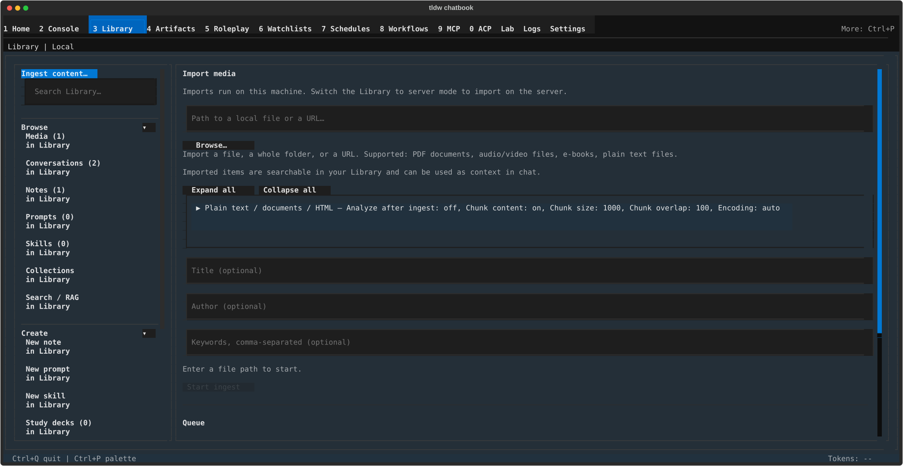

# Library Import & Export — getting content in, packaging it out

## What this screen is for

These are the Library's two doorways. **Import media** turns files, folders,
and URLs into Library media — checked before they run, queued while they
run, and searchable afterwards. **Export chatbook** packages your local
media, conversations, and notes into a single portable `.zip` (a
"chatbook") you can archive or share. Come here when you want the app to
know about a document, a recording, or a web page — or when you want to
carry your content somewhere else.

## Getting there

Press **Ctrl+3** for Library (see [the Library overview](../library.md)),
then either:

- Click **"Ingest content…"** — the primary button at the very top of the
  left rail — to land on Import media directly.
- In the rail's **Import / Export** section, click **"Import media"** or
  **"Export"**.

Scoped exports also arrive here on their own: pressing **"Export…"** or
**"Export selected"** in the Media, Notes, or Conversations panels opens
the same Export chatbook form, pre-limited to that content (see
[Media & Conversations](media-and-conversations.md)).

In server mode the **Export** rail row is disabled, with the tooltip
"Export packages local content only."

## Layout tour

**Import media**, top to bottom:

- **Header** — "Import media", then a target line ("Imports run on this
  machine." / "Imports run on the server."). When a server is available, a
  switch button ("Import on the server" ↔ "Import on this machine")
  follows the line.
- **Path field** — "Path to a local file or a URL…", with "Browse…" and
  (once something is typed) "Clear". On a fresh visit, two orientation
  lines sit below: "Import a file, a whole folder, or a URL. Supported:
  PDF documents, audio/video files, e-books, plain text files." and
  "Imported items are searchable in your Library and can be used as
  context in chat."
- **Pre-check summary** — as soon as you enter a path the form shows
  "Checking…", then replaces it with a type breakdown ("1 PDF document,
  2 audio/video files"), a size estimate ("3 files · 1.2 MB"), any
  "⚠" warnings about missing tooling, and — if some files can't be
  handled — "2 unsupported files will be recorded as failures."
- **Options** — "Expand all" / "Collapse all", then one fold per detected
  content type, titled with its current settings (for example "Plain text
  / documents / HTML — Analyze after ingest: off, Chunk content: on, …").
  Each fold ends with "Reset to defaults".
- **Metadata** — "Title (optional)", "Author (optional)", "Keywords,
  comma-separated (optional)". These apply to everything in the import.
- **Start** — a quiet gate line ("Enter a file path to start.") and the
  "Start ingest" button.
- **Queue** — the "Queue" heading, a per-state count line while jobs
  exist ("1 parsing · 2 queued · 1 done"), one line per job with action
  buttons underneath, "Clear finished", and a collapsed "Recent ingests"
  fold listing the last finished jobs. Empty state: "No ingest jobs yet."

**Export chatbook** is a single form: the "Export chatbook" header, a
scope line ("Everything: 128 media · 542 conversations · 87 notes", or
"Notes · 87 items" when you arrived scoped; "Counting…" while it tallies),
the "Export name" and "Description (optional)" fields, a "quality: … ▸"
button with the helper "original copies full media files into the zip"
(shown only when media is in scope), "Choose destination…" above "No
destination chosen", and the "Export chatbook" submit button. A "Cancel"
button appears while an export is running.

## Features & controls

| Import control | What it does |
|---|---|
| "Browse…" | Opens the "Import Media" file picker (remembers your last folder). Folders and URLs are typed or pasted into the path field instead. |
| Pre-check warnings ("⚠ …") | Name a missing optional package, what it's needed for, and the install command that fixes it. |
| "Choose a file…" / "Retry" | Offered under pre-check errors — pick a different path, or re-run the check after a network hiccup. |
| Per-type options | PDF documents: "PDF engine" (pymupdf / pymupdf4llm / docling) and "Enable OCR". Audio & video: "Transcription provider" (default / parakeet-onnx / faster-whisper), "Local Parakeet model folder", "Transcription model" (tiny–large), "Language", "Include timestamps", "Speaker diarization". E-books: "Extraction method" (filtered / markdown / basic), "Include table of contents". Plain text / documents / HTML: "Analyze after ingest", "Chunk content", "Chunk size", "Chunk overlap", "Encoding". Web pages (URLs): "What to fetch", "Maximum pages", "Maximum depth". |
| "Install verified Parakeet v2 INT8 (630.6 MiB)…" | In the Audio & video fold, enabled when the provider is parakeet-onnx. Opens a consent dialog listing Source, Revision, License, Download size, and Destination, ending "All four files are checked against pinned sizes and SHA-256 digests before the bundle becomes usable." Buttons: "Cancel" / "Install". |
| "Start ingest" | Queues everything the pre-check found. If warnings are outstanding, the "Some files may fail to ingest:" dialog appears first (see below). |
| Queue rows | "● queued / parsing / writing · name" while working, "✓ done · name · 4s" on success, "✗ failed · name · reason" (plus " · retry 1" after a retry) on failure, "⊘ cancelled · name" when stopped on purpose. Server jobs carry an " · on server" suffix. |
| Row actions | "Open in Library" (done, local) jumps to the new media item; "View on server" (done, server); "Show details" shows the full error; "Retry" re-queues a failed job; "Cancel" stops an in-flight server job; "Dismiss" removes a failed row. |
| "Clear finished" | Removes all done and failed rows at once. |

The guardrail dialog — "Some files may fail to ingest:" — lists each
problem as "- <package> (N files): <what needs it>" with a
"Copy install command" button per line, then "Cancel" and
"Start ingest anyway". Starting anyway is safe: affected files simply fail
individually and show up as ✗ rows you can retry after installing.

| Export control | What it does |
|---|---|
| "Export name" | Pre-filled "Library export 2026-07-31" (today's date); becomes the chatbook's display name. |
| "quality: thumbnail ▸" | Cycles thumbnail → compressed → original. Only "original" copies full media files into the zip; the others keep the package small. |
| "Choose destination…" | Opens "Choose Export Destination". Whatever you pick is normalized to end in `.zip`; if that file already exists, an "Overwrites <name>" note appears (informational — exporting proceeds and replaces it). |
| "Export chatbook" | Enabled once counting has finished, the scope is non-empty, and a destination is chosen. "Nothing to export in this scope." appears when the scope is empty. |
| "Cancel" | Visible only while an export is running; stops it. |

## Common tasks

1. **Import one file** — Click "Ingest content…", press "Browse…", pick the
   file, wait for the type breakdown, then press "Start ingest". When the
   row reads "✓ done", press "Open in Library" to view it.
2. **Import a whole folder** — Type or paste the folder's path into the
   path field (the "Browse…" picker selects single files only). Review the
   breakdown and size estimate — folder scans stop at 1,000 files and note
   " · more files not shown" — then press "Start ingest".
3. **Import from a URL** — Paste the address into the path field. A link to
   a video site imports as audio/video; a PDF link as a PDF; other pages
   under "Web pages", where "What to fetch" / "Maximum pages" / "Maximum
   depth" control how much gets scraped. Press "Start ingest".
4. **Fix a "may fail to ingest" warning** — Press "Start ingest", and in
   the "Some files may fail to ingest:" dialog press "Copy install
   command", then "Cancel". Quit the app, run the copied command in the
   environment the app is installed in, relaunch, and start the import
   again — the warning is gone.
5. **Export your notes as a chatbook** — In the rail click Browse ▸ Notes,
   press "Export…" above the list. On the "Export chatbook" form confirm
   the scope line says "Notes · N items", adjust the name, press "Choose
   destination…", pick where the `.zip` goes, then press "Export chatbook".
6. **Retry a failed job** — Find the "✗ failed" row in the Queue and press
   "Retry"; the new attempt shows a " · retry 1" suffix. No Retry button
   means the failure is permanent (unsupported type or missing file) — fix
   the source and start a fresh import, and use "Dismiss" to drop the row.

## Keyboard & commands

Neither form has screen-specific shortcuts. **Escape** closes the
"Some files may fail to ingest:" and Parakeet install dialogs. Global keys
live in the [guide index](../index.md).

## Related settings & docs

`config.toml` keys, all under `[library]`:

| Key | What it remembers |
|---|---|
| `ingest.backend` | Whether imports target this machine or the server. |
| `ingest.last_directory` | The folder "Browse…" opens in next time. |
| `ingest_options.<group>.<field>` | Every per-type option, saved when you start an ingest (e.g. `ingest_options.generic.chunk_size`). |
| `ingest_directory_scan_limit` | Folder scan cap (default 1000). |

"Chunk size" is kept between 100 and 5000 — values outside that range are
pulled back to the nearest bound when the import starts.

Deep dives: [TRANSCRIPTION.md](../../Features/TRANSCRIPTION.md) covers the
audio/video transcription providers and their optional extras. See also
[the Library overview](../library.md) and
[Media & Conversations](media-and-conversations.md) for what happens to
imported items afterwards.

## Quirks & troubleshooting

- **Unsupported files become ✗ rows on purpose.** Anything the pre-check
  can't classify is still queued and "recorded as a failure", so a big
  folder import tells you exactly what was skipped instead of silently
  dropping files. These rows offer "Dismiss" but not "Retry".
- **The Queue remembers past sessions.** Finished and failed jobs are kept
  between launches. A job still running when you quit comes back as
  "✗ failed · … · Interrupted by app restart" and stays retryable; work
  that was mid-parse is not resumed automatically.
- **"Analyze after ingest" is off, "Chunk content" is on — by design.**
  Analysis costs an LLM call per document, which a folder import shouldn't
  trigger unasked. Chunking is local and cheap, and without it imported
  documents never show up properly in search and RAG — leave it on.
- **Transcription may need optional extras.** The default audio/video
  provider needs its packages installed; the pre-check warns you and the
  guardrail dialog hands you the install command. The curated Parakeet
  model is a separate one-press download from the options fold.
- **Export is local-only.** In server mode the rail's Export row is
  disabled ("Export packages local content only.") — switch the Library
  back to local to package content.
- **"Show details" is your first stop on a confusing failure** — it opens
  the full error behind the shortened reason on the row.

—
*Verified against dev @ bd05a692a — 2026-07-31*
