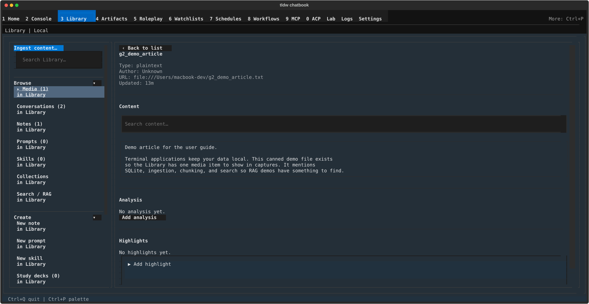

# Library Media & Conversations — browsing source material and staging it into Console

## What this screen is for

These two Library panels are where you browse what the app has collected:
**Media** holds everything you have ingested (documents, transcripts, web
pages), and **Conversations** lists every chat you have had in Console. Both
are read-mostly browsers — you come here to re-read content, search inside
it, mark it up, and hand pieces of it to Console as context or package them
into a chatbook. Both panels share one interaction grammar, so learning one
teaches you the other.

## Getting there

Press **Ctrl+3** (or click "Library" in the nav bar, or **Ctrl+P** →
"Library"), then in the left rail's **Browse** section click **Media** or
**Conversations**. Each rail row shows its count. The selected row's canvas
fills the center of the screen.

## Layout tour

Both list canvases follow the same shape, top to bottom:

- **Toolbar** — the panel heading with a count ("Media (3)"), plus
  "Export…" and "Select". Media adds a cycling "type: All ▸" filter;
  Conversations instead has a "Filter conversations… (Enter)" text box.
- **Row list** — one two-line row per item: the title with a **▸** marker,
  then a dimmer second line (Media: type and age; Conversations:
  "3 messages - 4h"). Hovering a row shows its full title as a tooltip.
- **Preview block** — appears under the list once a row is selected: a few
  summary lines plus one action ("Open in viewer" for media, "Open in
  Console" for conversations).

Opening a media item swaps the list for the **media viewer** (pictured
above): "‹ Back to list", the title, metadata lines, then the "Content",
"Analysis", and "Highlights" sections, and an action row at the bottom.

## Features & controls

### The shared select / export grammar

- **"Select"** switches the list into select mode: every row gains a **☑/☐**
  checkbox, and a strip appears showing "N selected", "Select all N shown",
  "Clear", and "Export selected". The button relabels to **"Done"** to exit;
  entering or leaving select mode clears the selection.
- **"Export…"** (hidden while selecting) exports the whole current scope —
  for Media that means the current type filter — and **"Export selected"**
  exports just the checked rows. Both open the same "Export chatbook" form,
  covered in [import & export](import-and-export.md).

### Media list

| Control | What it does |
|---|---|
| "type: All ▸" | Cycles through All plus each media type present in your Library. While filtered, a status line reads "2 of 5 · type: pdf". |
| "Export…" / "Select" | The shared grammar above; Export… is scoped to the active type filter. |
| Row press | Selects the row and shows the preview (title, "Type: …", "Updated: …"). |
| "Open in viewer" | Opens the selected item in the media viewer. |

Empty states: with nothing ingested, "No media in your Library yet. Ingest
something to see it here."; with a filter that matches nothing, "No media
of type 'pdf'."

### Media viewer

- **Metadata** — lines for "Type:", and when present "Author:", "URL:",
  "Keywords:", "Updated:".
- **"Content"** — the stored text ("No stored content." when empty), with a
  "Search content…" box above it. Typing a query shows "Match 1 of 4
  matches" (or "No matches") and a "◀ Prev" / "Next ▶" pair that steps
  through highlighted matches, wrapping at either end.
- **"Analysis"** — a stored analysis text you can view and edit ("Edit
  analysis", or "Add analysis" when empty; "No analysis yet." otherwise).
  This section only edits text — it never calls a model; analysis is
  produced at ingest time (the "Analyze after ingest" option) or written by
  hand here.
- **"Highlights"** — saved quotes from this item ("No highlights yet." when
  empty). Expand the collapsed **"Add highlight"** section, fill "Quote"
  (required), optionally "Note (optional)" and "Color (optional)", and
  press "Add highlight". Each saved highlight shows the quote with a
  color swatch, its color/note details, and a "✕ Delete" button.
- **Action row**:

| Button | What it does |
|---|---|
| "Edit" | Opens an inline form (Title, Author, URL, Keywords) with "Save" / "Cancel". |
| "Use in Console" | Stages this item as context for your next Console message. |
| "Read it later" ↔ "Remove from read-it-later" | Toggles the item on your read-it-later list. |
| "Open in Media manager" | Leaves Library and jumps to the separate Media screen. |
| "Delete" | Two-step: shows "Delete this media? This moves it to trash." with "Delete" / "Cancel". |

### Conversations

| Control | What it does |
|---|---|
| "Filter conversations… (Enter)" | Type and press Enter to filter by title substring (case-insensitive, over the loaded list). Status shows "2 matches for 'demo'". |
| Row press | Selects the row and shows the preview (title, "Messages: N", "Updated: age"). |
| "Open in Console" | Stages the conversation as **source context** in Console — see below. |
| "Export…" / "Select" | The shared grammar; export packages conversations into a chatbook. |

Empty state: "No conversations yet. Chat in Console and it appears here."
There is no create, rename, or delete here — this panel treats your chats
as source material, not sessions.

**"Open in Console" does not resume the chat.** It hands the conversation
to Console as staged context, pre-filling the prompt "Use this conversation
as source context for my next question." — your next message continues in
the *current* Console session, grounded by the old conversation. To switch
back into a past session and keep chatting in it, use Console's own
conversation rail instead; that one resumes sessions, this one quotes them.

## Common tasks

### Filter media by type
1. In **Media**, click "type: All ▸" — each press cycles to the next type.
2. The list narrows and the status line reads e.g. "2 of 5 · type: pdf".
   Cycle back around to "type: All ▸" to clear.

### Open a media item and search inside it
1. Click a row, then "Open in viewer".
2. Type into "Search content…". The status shows "Match 1 of N matches" and
   the matches are highlighted in the content.
3. Step through with "◀ Prev" / "Next ▶"; the current match is emphasized.

### Highlight a passage
1. In the viewer, scroll to **Highlights** and expand "Add highlight".
2. Paste the passage into "Quote"; optionally add "Note (optional)" and a
   color name or hex value in "Color (optional)".
3. Press "Add highlight" — it appears in the list with a ● swatch.

### Stage a conversation as Console context
1. In **Conversations**, click a row, then "Open in Console" in the preview.
2. Console opens with the conversation staged and the prompt "Use this
   conversation as source context for my next question." ready to go — edit
   or replace it, then send.

### Export selected items as a chatbook
1. Click "Select", check the rows you want ("Select all N shown" grabs the
   whole visible list), then "Export selected".
2. The "Export chatbook" form opens — name, destination, and options are
   covered in [import & export](import-and-export.md).

## Keyboard & commands

Nothing screen-specific: these panels are mouse/arrow-driven buttons and
inputs. The only key worth naming is **Enter** to submit the
"Filter conversations… (Enter)" and "Search content…" boxes. Global
navigation keys live in the [guide index](../index.md).

## Related settings & docs

- Neither panel owns any config.toml keys; media arrives via
  [import & export](import-and-export.md) (Import media, including the
  "Analyze after ingest" and chunking options that shape what the viewer
  shows).
- Both panels are retrieval sources for
  [Search / RAG](search-and-rag.md) — the "Media" and "Conversations"
  scope toggles there search exactly what you browse here.
- Console's **Save as...** action can file a reply into Media; the viewer's
  "Read it later" toggle feeds the same reading list used elsewhere in the
  app.
- [Library overview](../library.md) — the rail, the other panels, and how
  the pieces fit together.

## Quirks & troubleshooting

- **Highlight colors must parse.** "Color (optional)" accepts standard
  color names or hex values (e.g. `yellow`, `#ffcc00`); anything else is
  saved but renders as plain text with no tint on the swatch.
- **"Open in Media manager" leaves Library.** It jumps to the separate
  Media screen — press Ctrl+3 to come back.
- **Conversations shows at most 75 rows**, newest first, and the filter
  only matches within what is loaded. Very old conversations may not
  appear; find them via [Search / RAG](search-and-rag.md) instead.
- **"Open in Console" can refuse with "Copy or link blocked Library
  sources into the active workspace before using them in Console."** The
  handoff requires the conversation to be eligible for the active
  workspace; until your sources are linked into it, staging is blocked
  (the same gate guards the other "Use in Console" actions).
- **No conversation delete here** — by design, this panel never modifies
  chats. Manage sessions from Console itself.
- **"Media item is unavailable."** — the item was removed while you had it
  open (for example from the Media screen); the viewer drops back to the
  list.

—
*Verified against dev @ bd05a692a — 2026-07-31*
