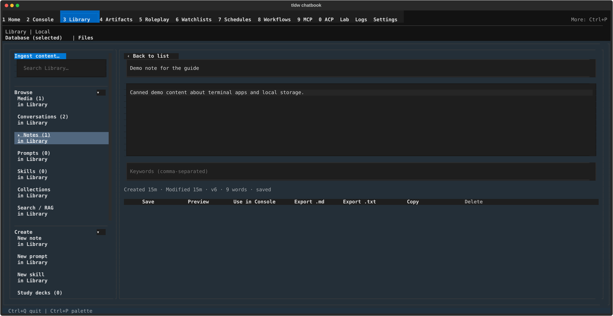

# Library notes — write, sync, and reuse notes stored in your Library

## What this screen is for

The Notes canvas is where you create and edit the notes stored in your
Library: quick captures, meeting notes, research summaries — anything you
want to keep, search, and later hand to the Console as context. Notes
autosave as you type, can be started from templates, imported from files,
exported as Markdown or text, and mirrored to a folder on disk with the
built-in sync panel. For the rail, landing canvas, and the other Library
sources, start with the [Library overview](../library.md).

## Getting there

Press **Ctrl+3** to open Library, then click **Notes** in the rail's
"Browse" section (the row shows a live count). **Ctrl+P** → "Switch to
Library" works too. To jump straight into writing, click **New note**
under the rail's "Create" section.

## Layout tour

- **Source strip** — a "Database | Files" toggle above the canvas. This
  page covers the Database side; see below for Files.
- **Notes list** — the default view: a "Notes (N)" header, the
  "Filter notes… (Enter)" field, a toolbar (sort / Sync / Import note /
  Export… / Select), and one row per note showing its title and age.
- **Editor** — opens when you click a note: title, body, keywords, a meta
  line with the autosave status, and an action row.
- **New note view** — opens from the rail's "New note": a "Blank note"
  button plus a "From a template" list.
- **Notes sync panel** — opens from the toolbar's "Sync" button: folder,
  direction, conflict policy, auto-sync, and an activity log.

### Database vs. Files

The strip above the canvas switches between two different notes worlds.
**Database** (this page) keeps notes inside the Library itself. **Files**
swaps the whole canvas for the File Notes workspace, which edits plain
files under a folder you choose and has its own Session Git panel — see
[File notes](file-notes.md).

## Features & controls

### Notes list

| Control | What it does |
|---|---|
| "Filter notes… (Enter)" | Type and press Enter to filter; the status line then reads "filter: \<text\> · N results". |
| "sort: Newest ▸" | Cycles the order: Newest → Oldest → Title. |
| "Sync" | Opens the Notes sync panel (below). |
| "Import note" | Opens a file picker, "Import Note (TXT, MD, JSON, YAML)". The imported file becomes a new note. |
| "Export…" | Opens the "Export chatbook" canvas scoped to notes — bundle notes into a .zip. |
| "Select" / "Done" | Toggles select mode: rows grow ☑/☐ checkboxes, and a row appears with "N selected", "Select all N shown", "Clear", and "Export selected". "Export…" hides while selecting. |

With no notes at all, the list reads "No notes yet. Create one to see it
here."

### Editor

| Control | What it does |
|---|---|
| "‹ Back to list" | Returns to the list (your text is already saved — see autosave below). |
| Title, body, keywords | The note's fields; keywords are comma-separated. |
| Meta line | Created/Modified/version plus the autosave status: "N words · saved", "saving…", "changed elsewhere", or "save failed". |
| "Save" | Saves immediately, without waiting for autosave. |
| "Preview" / "Edit" | Toggles the body between editing and rendered Markdown. |
| "Use in Console" | Hands the note to the Console as staged context, with the suggested prompt "Use this note as context and help me work with it." |
| "Export .md" / "Export .txt" | Saves the note to a file you pick; success shows "Note exported successfully to \<name\>". |
| "Copy" | Copies the note to the clipboard as Markdown — "Note copied to clipboard as markdown!" |
| "Delete" | Asks inline first: "Delete this note? This cannot be undone from Library." — confirm with "Delete" or back out with "Cancel". |

**Autosave** runs about two seconds after you stop typing; the meta line
flips to "saving…" and back to "saved". If the same note was changed
somewhere else while you were editing, a banner appears: "This note
changed elsewhere — Overwrite saves your text; Reload discards it." —
pick **Overwrite** or **Reload**.

### New note view

"Blank note" creates an empty note and drops you in the editor. The
"From a template" list pre-fills title, body, and keywords; each row shows
the template name with the title the note will get. Available templates:
Brainstorming session, Bug report, Code review, Daily journal entry,
Meeting notes, Project planning, Research notes, Todo list.

### Notes sync panel

Mirrors notes between a folder on disk and the Library ("Mirror notes
between a folder on disk and the Library.").

| Control | What it does |
|---|---|
| "‹ Back to notes" | Returns to the list. |
| folder + "Browse…" | The folder to mirror; Browse opens "Select Notes Sync Folder". |
| "direction: … ▸" | Cycles through "Bidirectional", "Disk → Library", and "Library → Disk". |
| "conflicts: … ▸" | Cycles the conflict policy through "Newer wins", "Disk wins", and "Library wins". |
| "auto-sync: every 5m ✓/○" | Toggles a background sync every five minutes. |
| "Sync now" | Runs a sync immediately; the button reads "Syncing…" while it runs. |

The status line below reports "idle", "syncing · 3/12",
"done · no changes", "done · N changes · M conflicts", or
"failed · \<reason\>", and an activity log keeps the last 20 entries,
most recent first.

## Common tasks

### Create a note from a template
1. In the rail, click **New note** under "Create".
2. Under "From a template", click **Meeting notes** (or any other row).
3. The editor opens pre-filled; just start typing — autosave handles the
   rest.

### Import a Markdown file as a note
1. In the notes list, click **Import note**.
2. Pick the file in the "Import Note (TXT, MD, JSON, YAML)" dialog.
3. The new note appears at the top of the list; open it to edit.

### Set up folder sync
1. In the notes list, click **Sync**.
2. Enter a folder (or click **Browse…**), then set "direction" and
   "conflicts" by clicking them until they show what you want.
3. Click **Sync now** and watch the status line; optionally turn on
   "auto-sync: every 5m" to keep it running every five minutes.

### Use a note in Console
1. Open the note and click **Use in Console**.
2. You land in the Console with the note staged as context and the
   prompt "Use this note as context and help me work with it." ready to
   send or rewrite.

### Export a note as Markdown
1. Open the note and click **Export .md**.
2. Choose a destination in the "Export Note as Markdown" dialog — the
   toast confirms "Note exported successfully to \<name\>".

## Keyboard & commands

| Key | Action |
|---|---|
| Enter (in "Filter notes… (Enter)") | Apply the filter |

That is the only screen-specific key — everything else here is
click-driven. Global navigation keys live in the [guide index](../index.md).

## Related settings & docs

- `[notes]` in config.toml — the sync panel reads and writes these:
  `sync_direction` (default `bidirectional`), `sync_conflict_resolution`
  (default `newer_wins`), `auto_sync` (default `false`), and
  `sync_directory` (default `~/Documents/Notes`).
- [Notes bidirectional sync](../../Features/notes_bidirectional_sync.md) —
  deep dive on the sync engine behind the panel.
- [File notes](file-notes.md) — the "Files" side of the source strip.
- [Library overview](../library.md) — the rail, landing canvas, and the
  other Library sources.

## Quirks & troubleshooting

- **Import failures are deliberately unspecific** — whatever goes wrong
  (unreadable file, unsupported content, a file over the ~8 MB guard),
  the message is always "Could not import that file." Check the file's
  type and size if it keeps failing.
- **Sync never asks about conflicts** — there is no "ask me" policy by
  design; conflicts are always resolved by the "conflicts" setting, and
  the count is reported in the status line afterwards.
- **Notes rows have no ▸ marker** — unlike media rows, note rows show
  only the title and age; they still open on click.
- **Notes cap at 2,000,000 characters** — longer content is rejected
  rather than truncated.

—
*Verified against dev @ bd05a692a — 2026-07-31*
