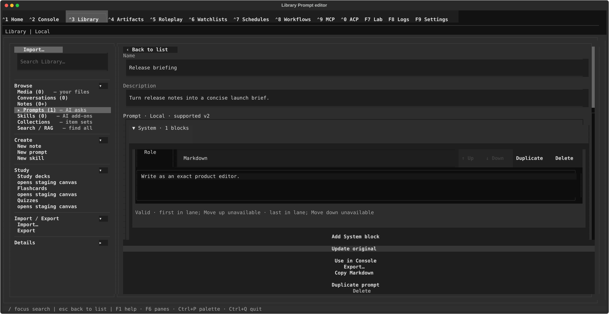

# Library prompts — save and reuse system and user prompts

## What this screen is for

The Prompts canvas stores Prompts and Recipes with a name, description,
keywords, author, and reusable System/User blocks. A Prompt can go directly to
Console; a Recipe first becomes an unsaved Prompt copy for review. You can also
apply saved Prompts from Console with `/prompt` and `/system`. For the rail,
landing canvas, and the other Library sources, start with the
[Library overview](../library.md).

## Getting there

Press **Ctrl+3** to open Library, then click **Prompts** in the rail's
"Browse" section (the row shows a live count). **Ctrl+P** →
"Tab Navigation: Switch to Library" works too. To jump straight into writing one, click
**New prompt** under the rail's "Create" section.

## Layout tour

- **Prompts list** — the default view: a "Prompts (N)" header, the
  "Filter prompts… (Enter)" field, a toolbar ("sort: Newest ▸" /
  "sort: Name ▸" and "Import…"), and one row per prompt showing its name
  with the description and age underneath. Empty states: "No prompts
  yet." / "No prompts match your filter."
- **Import row** — appears inline under the toolbar when you press
  "Import…": a "File or folder path…" field, then "Browse…", "Import",
  and "Cancel", with an outcome line underneath.
- **Editor** — opens when you click a Prompt or Recipe (or create one):
  "‹ Back to list", identity fields, editable System/User blocks, compiled
  previews, keywords, author, a muted meta line ("Modified 4h · v2"; "New
  prompt" before the first save), a save-status line, and a persistent action
  area. Its groups are primary save, content actions, then lifecycle actions.

## Features & controls

### The prompts list

| Control | What it does |
|---|---|
| Filter prompts… (Enter) | Type and press **Enter** to filter; matches the name and description |
| sort: Newest ▸ / sort: Name ▸ | Click to toggle between newest-first and alphabetical |
| Import… | Opens the inline Import row (below) |
| A prompt row | Opens that prompt in the editor |

### Importing prompts

Press **Import…**, enter a path, press **Import**. The path can be a
single file or a whole folder; **Browse…** opens a file picker for the
single-file case only — a folder path must be typed by hand. Supported
formats: `.json`, `.yaml`, `.yml`, `.md`, and `.txt`.

The outcome line reports, for example, "2 imported · 1 skipped
(duplicate name)", adding "· 1 failed" when a file could not be parsed.
A prompt whose name already exists is always **skipped** — imports never
overwrite or rename. A bad path shows "Could not find that file or
folder."

### The prompt editor

- **Name** — required, and unique across all prompts (up to 300
  characters).
- **Description** — what the prompt is for; shown under the name in the
  list.
- **System and User blocks** — structured Prompts and Recipes expose their
  blocks for editing. The compiled previews below them show the exact System
  and User Markdown produced by those blocks.
- **Compatibility artifacts** — an unsupported structured definition is
  read-only. If its lanes can be recovered, **Convert and save as new Prompt**
  creates a detached, editable Prompt working copy: **Save Prompt** is enabled,
  the meta line reads "New prompt · Unsaved changes", and the original artifact
  is untouched.
- **Recipe starter content** — controls whether the current block text is
  included when saving a new Recipe.
- **Keywords (comma-separated)** and **Author**.

Nothing autosaves here — use **Save Prompt**, **Save Recipe**, or **Update
original**. While you have unsaved edits the meta line shows an "Unsaved
changes" marker, and leaving the editor (Back, another row, another screen) is
blocked until you save or resolve the edit. The save-status line reports the
outcome:

- "Saved."
- "Name already in use — pick another or open the existing prompt." —
  with an **Open existing** button that discards your edit and opens the
  prompt holding that name.
- "A deleted prompt holds this name — restore it or choose another."
- "Couldn't save this prompt. Try again."

If the Prompt or Recipe changed elsewhere while you edited, the editor shows
the conflict explanation and replaces the normal actions with **Save as new**
and **Reload**. Reload restores the current version; Save as new keeps your
blocks in a new item.

### The action area

| Control | What it does |
|---|---|
| Save Prompt / Save Recipe / Update original | Saves the current Prompt or Recipe (explicit save only) |
| Use in Console | For a saved, clean Prompt, appends its compiled User text to the Console composer and switches there. For an editable Recipe, creates a detached unsaved Prompt copy in the editor; nothing is applied. |
| Export… | Saves this Prompt or Recipe as a Markdown file ("Export Prompt as Markdown" dialog) |
| Copy Markdown | Copies the exact live Markdown working copy, including unsaved create, duplicate, conversion, and block edits: System/User text plus applicable structured Prompt/Recipe metadata. Success follows a clipboard write; unavailable or failed clipboard support shows a warning or error. |
| Duplicate prompt | Opens a new unsaved copy named "<name> (copy)" with all fields prefilled |
| Delete | Opens a confirmation before discarding the saved Prompt or Recipe; if the editor is dirty, it also warns that the unsaved working copy will be discarded |

For a Prompt, **Use in Console** works differently from the notes and media
actions: instead of staging a source for retrieval, it appends compiled User
text to the current Console draft — never replacing it. It refuses a dirty
Prompt ("Save your changes before using this prompt in Console.") and a
system-only Prompt. For an editable Recipe, the action stays in Library and
converts the Recipe into a detached unsaved Prompt copy for review; it does not
stage text, change the saved Recipe, or switch to Console.

### Where prompts surface in Console

In the Console composer, `/prompt <name>` replaces the draft with a
saved prompt's user text, and `/system <name>` applies its system part
to the session; Console's "Edit system prompt" modal can also save a new
prompt to the Library. See
[Console: Context & RAG](../console/context-and-rag.md).

## Common tasks

1. **Create a prompt** — click **New prompt** in the rail's "Create"
   section, fill in **Name** and the System and/or User blocks, then press
   **Save Prompt**; the status line reads "Saved."
2. **Import a folder of prompts** — press **Import…**, type the folder's
   path into "File or folder path…" (Browse… only picks single files),
   press **Import**, and read the "N imported · N skipped" outcome.
3. **Use a prompt in Console** — open it, press **Use in Console**; you
   land in Console with its user text added to the composer. (Or, from
   Console, type `/prompt <name>`.)
4. **Duplicate and tweak** — open a Prompt or Recipe, press **Duplicate prompt**,
   rename the "<name> (copy)" editor that opens, adjust the blocks, then use the
   enabled save action — the original is untouched.
5. **Export a Prompt or Recipe as Markdown** — open it, press **Export…**, pick a
   location in the "Export Prompt as Markdown" dialog; a notice confirms
   "Prompt exported successfully to <file>".

## Keyboard & commands

| Key | Action |
|---|---|
| Enter (in the filter field) | Apply the prompts filter |

`/prompt` and `/system` are Console commands, documented in
[Console: Context & RAG](../console/context-and-rag.md).

## Related settings & docs

- No `config.toml` keys belong to this panel.
- [Library overview](../library.md) — the rail, counts, and the other
  sources.
- [Library skills](skills.md) — skills are also created and imported
  from the rail, but go through a trust review before use.
- [Console: Context & RAG](../console/context-and-rag.md) — `/prompt`,
  `/system`, and the "Insert prompt" picker.
- [Guide index](../index.md) — global keys and navigation.

## Quirks & troubleshooting

- **Imports skip duplicates silently by design** — a name that already
  exists (even on a deleted prompt) is counted as "skipped (duplicate
  name)", never overwritten or auto-renamed.
- **The filter ignores keywords** — it matches only the name and
  description, so a keywords-based search will come up empty.
- **Size caps**: names up to 300 characters; the system prompt, user
  prompt, and description up to 2,000,000 characters each.
- **No bulk export yet** — Export… lives in the editor and exports one
  prompt at a time; exporting all prompts at once is an open backlog
  item (task-197).

—
*TASK-202 behavior and this guide were reverified after the final review
corrections on 2026-08-08. Verification is tied to the branch history rather
than a self-referential documentation SHA.*
