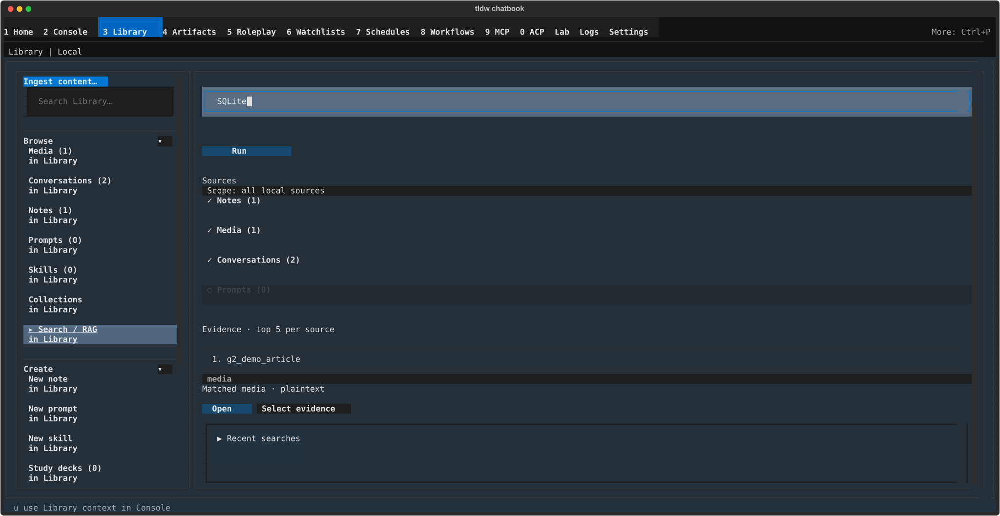

# Library Search/RAG — query your sources and stage the evidence in Console

## What this screen is for

One query across everything in your Library — notes, media, conversations,
and prompts — instead of filtering each list separately. Results come back
as evidence rows with snippets and citations; open a hit in its own editor
or viewer, or select it and send it to Console as grounding for a chat.
Two modes: **Search** (keyword matching, always available) and **RAG
Answer** (semantic retrieval, needs embeddings support installed).

## Getting there

Two ways, both inside the Library screen (**Ctrl+3** — see
[Library](../library.md)):

- Click the **"Search / RAG"** row in the rail's **Browse** section.
- Type into the rail's **"Search Library…"** box and press Enter — you land
  on this canvas in **Search** mode and the query runs immediately.
  (Submitting the box empty just opens the canvas.)

## Layout tour

Top to bottom on the main canvas:

- **"Library Search/RAG"** — the canvas title.
- **Query row** — the **"mode: Search ▸"** button (click to cycle to
  "mode: RAG Answer ▸" and back), the query box ("Ask or search Library
  sources"), and **Run** (reads "Searching…" while a search is in flight).
  A one-line status sits underneath.
- **"Sources"** — the scope block: a "Scope: all local sources" summary line
  and one toggle per source type — ✓/○ **Notes**, **Media**,
  **Conversations**, **Prompts**, each with its count, e.g. "✓ Media (1)".
- **"Evidence · top 5 per source"** — the result rows (anatomy below).
- **"Recent searches"** — a collapsible fold of your recent queries.

## Features & controls

### Running a query

Type into "Ask or search Library sources" and press Enter or **Run**. The
gates are gentle: with no query the status line reads "Enter a question or
search query."; with every source toggled off it reads "Select at least one
source." Those are quiet nudges, not errors. Real failures are louder — a
**"Blocked | <reason>"** callout plus a recovery block spelling out Why /
Next / Recovery / Owner.

The **"mode: … ▸"** button cycles between the two modes; switching resets
the current results.

- **Search** — keyword matching over your sources; works with nothing extra
  installed.
- **RAG Answer** — semantic retrieval. If embeddings support isn't
  installed, the run blocks as "RAG unavailable" with the next step
  "Install embeddings support or switch mode to Search" and the recovery
  pointer "Settings > RAG". Installed but nothing indexed yet? The block is
  "Index empty" — "The semantic index has no content yet" — with the
  recovery "Ingest content to index it automatically, run a semantic index
  backfill, or switch mode to Search".

### Sources scope

The four toggles decide where the query looks: ✓ is in scope, ○ is
excluded; click to flip. A source whose count is (0) is disabled. If your
Library is empty, the scope block takes over entirely: "No Library sources
yet — import media or create notes, then search." with an **"Open Import
media"** button ([Import & export](import-and-export.md)).

### Evidence rows

Each hit is one block:

- **Title** — numbered, e.g. "1. g2_demo_article", with a relevance score
  appended when one applies (`| score 0.812`).
- **Badge line** — the source type first (e.g. "media"), then a workspace
  name when it isn't "all workspaces", a citation count ("2 citations")
  when the hit carries citations, and "excluded from context" when the row
  can't be used in the active workspace.
- **Snippet** — the matched text, or "No snippet available."
- **"Citations: …"** — the citation labels, when present.
- **Actions** — **Open** (jumps to the item in its own Library surface: the
  media viewer, notes editor, prompt editor, or that conversation) and
  **Select evidence**. On a selected row the button reads **"Selected
  evidence"** and an inline **"Use in Console"** button appears beside it.

Before any search the region shows "No evidence yet. Run Search/RAG to
populate results." A search with no matches reports "No evidence matched
the current query" and suggests "Revise the query or broaden the source
scope".

### Recent searches

The "Recent searches" fold keeps your last 10 queries and persists them
across restarts. "Select an entry to run it again." — each entry re-runs
that exact query; **"Clear history"** empties the list. The fold closes
itself when results land and opens itself when a search comes back empty.

### Sending evidence to Console

Press **Select evidence** on the best row (it relabels to **"Selected
evidence"**), then press the row's inline **Use in Console** button — or
the `u` key — and Console opens with the evidence staged as live work
labeled **"Review evidence in Console"**; the snippet, citations, and
source identity travel with it. See [Console: Context &
RAG](../console/context-and-rag.md) for the staged-sources side.

### Not the same screen as "Search"

A separate, older **Search** screen also exists: open the command palette
(**Ctrl+P**) and pick **"Search"** ("Search and RAG over your library.").
It has **Search / Saved / History / Maintenance** tabs; the **Maintenance**
tab is where semantic *indexing* is managed ("Start Indexing", index
statistics). The Library canvas on this page searches; it does not manage
indexes — if RAG Answer mode reports an empty index, go there to backfill.

## Common tasks

1. **Search everything, fast** — type your words into the rail's "Search
   Library…" box and press Enter. You land here with results.
2. **Narrow the scope to media only** — under "Sources", click **Notes**,
   **Conversations**, and **Prompts** so they show ○, leaving "✓ Media";
   run again.
3. **Open an evidence hit** — press **Open** on its row; you jump straight
   to that item's editor or viewer in Library.
4. **Send evidence to Console** — press **Select evidence** on the best
   row, then the inline **Use in Console** (or press `u`). Console opens
   with "Review evidence in Console" staged.
5. **Re-run a recent search** — expand "Recent searches" and click the
   entry ("Select an entry to run it again.").
6. **Ask a question instead of matching keywords** — click
   **"mode: Search ▸"** so it reads "mode: RAG Answer ▸", then run; if the
   run blocks, follow the recovery copy.

## Keyboard & commands

| Key | Action |
|---|---|
| Enter (in the query box) | Run the search |
| `u` | Use Library context in Console — only while the "Search / RAG" rail row is selected; the footer hint appears here and nowhere else in Library |

## Related settings & docs

- **Settings ▸ RAG** — search mode, citation style, chunking, top-k, and
  embedding-model defaults for RAG retrieval.
- `config.toml`:
  - `[library.search]` → `history` — the persisted "Recent searches" list.
  - `[rag]` (with `[rag.retriever]`, `[rag.chroma]`, …) — retrieval and
    processing settings; `[rag_search]` — legacy, kept for compatibility.
  - `[embedding_config]` — embedding models and cache. (There is no
    `[embeddings]` section — the table is named `embedding_config`.)
- [Library](../library.md) — the rail, the other Browse canvases, and
  getting around.
- [Import & export](import-and-export.md) — ingesting content so there is
  something to search.
- [Console: Context & RAG](../console/context-and-rag.md) — where
  handed-off evidence lands.
- [Guide index](../index.md) — global keys and navigation.

## Quirks & troubleshooting

- **"top 5 per source" is fixed here.** The tunable top-k in Settings ▸
  RAG does not change this canvas.
- **The scope summary line never changes.** "Scope: all local sources" is a
  fixed label — the ✓/○ toggles are the real record of what's in scope.
- **Workspaces and Collections can't be searched yet.** They exist as
  source types, but retrieval doesn't reach them, so no toggle appears for
  either.
- **RAG Answer mode needs embeddings support.** Without it, runs block with
  "Install embeddings support or switch mode to Search" — Search mode
  always works.
- **`u` works only on this row.** Elsewhere in Library the key does
  nothing, and the footer hint disappears.
- **Citations don't flow into generated answers yet.** Evidence carries
  its citation labels into the Console handoff, but answer generation and
  saved-artifact citation persistence are still downstream work.
- **A hit's conversation may vanish between searching and opening** — if it
  was deleted since the search, **Open** notifies "Conversation is
  unavailable."

—
*Verified against dev @ bd05a692a — 2026-07-31*
