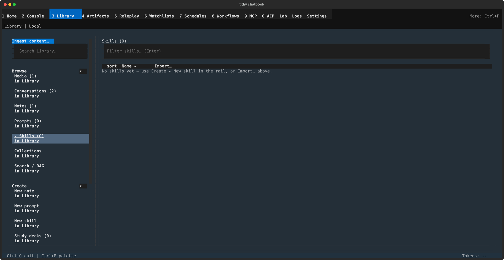

# Library Skills — create, import, review, and trust reusable skills

## What this screen is for

A skill is a reusable instruction pack — a `SKILL.md` body plus optional
supporting files — that you run in Console by starting a message with
`$name` (see [Agent runs & tools](../console/agent-runs-and-tools.md)).
This Library panel is where skills live: create and edit them, import them
from files, folders, or URLs, and — the part nothing else does — review and
approve them in the trust panel. A skill that isn't trusted refuses to run
in Console, and this is the screen that fixes that.

## Getting there

Press **Ctrl+3** (or **Ctrl+P** → "Library"), then in the left rail's
**Browse** section click **Skills** (the row shows its count). To start a
new skill, use the rail's **Create ▸ New skill** instead — it opens the
editor in create mode.

## Layout tour

The list canvas, top to bottom:

- **Heading** — "Skills (N)".
- **Trust header** — one line stating the current trust posture, with an
  action button when there is something to do (both hidden while the list
  is empty). The lines and their buttons are listed under Features below.
- **Filter** — "Filter skills… (Enter)".
- **Toolbar** — "sort: Name ▸" / "sort: Status ▸" (Status puts
  needs-review skills first) and "Import…".
- **Rows** — one per skill: **⚠ name** (blocked — needs review before use)
  or **✓ name** (usable), with a dimmer description line underneath.
- **Empty state** — "No skills yet — use Create ▸ New skill in the rail,
  or Import… above." (a filter with no matches shows "No skills match your
  filter." instead).

Clicking a row opens the **editor**, with the **Trust** panel below it —
the canvas scrolls, so the trust panel may sit below the fold.

## Features & controls

### Trust header (list)

| Line | Action button |
|---|---|
| "Skill trust isn't set up — set it up to review and use skills." | **Set up skill trust** |
| "Skill trust needs to be set up again after an update." | **Set up skill trust** |
| "Skill trust is temporarily unavailable — try again." | **Retry** |
| "Skill trust is locked for this session." | **Unlock** |
| "Skill trust can't be verified — set it up again." | **Set up skill trust** |
| "N skill needs review before use." / "N skills need review before use." | **Review** (opens the first blocked skill's editor) |
| "Skill trust: ready." | — |

A standalone **Reset skill trust…** button appears next to the header for
the locked and set-up-again states. It two-step confirms with "Reset skill
trust? Every skill will need re-approval. Your skills are not deleted."
(**Reset** / **Cancel**).

### Importing

**Import…** opens an inline row: an input with placeholder "SKILL.md file
or skill folder path… or GitHub/zip URL", plus **Browse…** (pick a
SKILL.md file), **Browse folder…** (pick a skill folder), **Import**, and
**Cancel**. A `http(s)://` value fetches the skill from that URL.

- Success: `Imported "name" · re-review it in the trust panel`, with a
  follow-up button `Review "name"…` that jumps straight to its trust
  panel. **Every import lands trust-pending** — it cannot run until you
  review and approve it.
- Failures you may see: "Could not find that file or folder.", "No
  SKILL.md found in that folder.", "Could not read that file.",
  "Unsupported file type.", "Skill import is unavailable.", and
  `Skipped — a skill named "name" already exists.`

### Editor

| Field / control | Notes |
|---|---|
| Name | Create mode hints "lowercase letters, numbers, hyphens (e.g. code-review)". For an existing skill the field is disabled: "Rename isn't supported — create a new skill instead." |
| Description | Optional; when blank: "No description set — lists show the skill's first body line automatically. Type here to set your own." |
| Argument hint | Optional usage hint shown to invokers. |
| Allowed tools | Input, "Allowed tools (comma-separated)". |
| "User can invoke: yes/no ▸" | Toggle — whether `$name` works for you. |
| "Agent can invoke: yes/no ▸" | Toggle — whether the agent may use it as a tool. |
| "Runs in: inline (this conversation) ▸" / "Runs in: fork (sub-agent) ▸" | Toggle between running in your conversation or a sub-agent. |
| Model override | Disabled: "Not applied in v1 — shown for SKILL.md round-tripping only." |
| Body | The skill's instructions (the SKILL.md content). |
| Supporting files | Read-only list ("name (N bytes)"; "No supporting files." when empty). |

Warnings appear above the actions when they apply: `Name shadows a
built-in command/tool ("name") — it will not be invocable as /name or as
an agent tool.` and `Saving marks this skill "needs review" — re-approve
it in the trust panel after saving.`

Actions: **Save**, **Discard changes** (enabled once you have edits), and
**Delete** (hidden in create mode). Delete confirms inline with
`Delete "name"? This removes the skill's directory and cannot be undone.`
(naming the supporting files too, when it has any). Save status lines:
"Saved.", "A skill with this name already exists.", "Skill name must use
lowercase letters, numbers, and hyphens.", "This skill is blocked by trust
review — approve it in the trust panel before saving.", or "Couldn't save
this skill. Try again." If the skill changed elsewhere while you were
editing, a banner offers one way out: "This skill changed elsewhere —
Reload discards your edit and refetches it." with a **Reload** button.
Leaving with unsaved edits is refused: "Unsaved skill changes — Save or
Discard changes first."

### Trust panel

Below the editor, the **Trust** section shows the skill's state on one
line — "Trust: trusted", "Trust: not initialized", "Trust: locked",
"Trust: changed since trusted baseline", "Trust: new untrusted file",
"Trust: trusted file missing", "Trust: manifest cannot be verified",
"Trust: unsupported file path" — with the changed file names in
parentheses when something differs from the trusted baseline.

- **First run** — before anything else works you see: "Local skill trust
  hasn't been set up yet. Set a trust passphrase to start reviewing and
  approving local skills — current local skill files become the trusted
  baseline." **Set up skill trust** opens the "Set Up Local Skill Trust"
  dialog, which asks for a new passphrase twice. Later sessions unlock
  with the "Unlock Local Skill Trust" dialog instead.
- **Review changes** — captures the changed files and shows their current
  content, one `── filename ──` block per file (binaries show
  `(binary file — N bytes, sha256 …)`; removed files show `(deleted — no
  longer on disk)`). The preview caps at 20 files and 4,000 characters per
  file; anything past a cap ends with "… truncated (N chars total) — open
  the file on disk to read the rest." or "… N more files omitted — open on
  disk to review."
- **Approve** — enabled only after a review is captured. It asks for your
  passphrase ("Approve Reviewed Skill Version": "Enter the local skill
  trust passphrase to make the reviewed files the new trusted baseline.").
  If the files changed again in between: "Skill files changed after the
  review was captured, so it was discarded. Press Review changes again,
  then Approve."
- **Unlock** — enabled only while trust is locked for the session.
- **Scripts** — the panel states either "Scripts: you are asked to confirm
  each time this skill runs a script." or "Scripts: this skill may run its
  bundled scripts without asking. Any change to its files cancels this
  automatically." A standing grant (given from Console's confirm card) can
  be withdrawn here with **Revoke script access**.

## Common tasks

1. **Create a skill.** Rail **Create ▸ New skill**, type a name (lowercase
   letters, numbers, hyphens), write the Body, **Save** (or Ctrl+S). Then
   scroll to the Trust panel, **Review changes**, **Approve**, and enter
   your passphrase — now `$name` runs in Console.
2. **Import from a GitHub URL.** In the list, click **Import…**, paste the
   URL into the input, click **Import**, then click the `Review "name"…`
   follow-up to review and approve it.
3. **Set up skill trust.** Click **Set up skill trust** (in the list
   header or a skill's Trust panel), choose a passphrase in "Set Up Local
   Skill Trust", and enter it twice. Existing skill files become the
   trusted baseline.
4. **Review and approve a changed skill.** Open the skill (the list marks
   it **⚠**; the header's **Review** button jumps to the first one), press
   **Review changes**, read the per-file blocks, press **Approve**, and
   enter your passphrase.
5. **Revoke script access.** Open the skill, scroll to Trust, check the
   "Scripts:" line, and press **Revoke script access** — Console goes back
   to asking on every script run.

## Keyboard & commands

| Key | Action |
|---|---|
| Ctrl+S | Save the skill — only while the skill editor is open |
| Esc | Back to the skills list — only while the skill editor is open |

Both keys act only inside the skill editor; elsewhere in Library they pass
through (Esc also cancels the passphrase dialogs).

## Related settings & docs

- [Agent runs & tools](../console/agent-runs-and-tools.md) — running
  skills with `$name`, listing them with `/skills`, and the agent-side
  install/script confirm cards. When Console refuses a skill as untrusted,
  this panel is where you approve it.
- [Skills script execution](../../Features/Skills-Script-Execution.md) —
  deep dive on how bundled scripts run and are sandboxed.
- [Library](../library.md) — the surrounding screen; [Prompts](prompts.md)
  are the simpler cousin (inserted text, no trust or execution).
- This panel owns no `config.toml` keys; trust lives in a local,
  passphrase-protected store on this machine. Guide index:
  [index](../index.md).

## Quirks & troubleshooting

- **Renaming isn't supported.** The Name field is locked on existing
  skills — create a new skill and delete the old one instead.
- **Every import needs review**, even one you wrote yourself on another
  machine — imports always land trust-pending, and saving any edit marks
  the skill "needs review" again. This is by design.
- **Trust is per-machine and passphrase-based.** Approvals don't travel
  with the skill files. If you forget the passphrase, **Reset skill
  trust…** starts over — every skill drops back to needing re-approval,
  but "Your skills are not deleted."
- **The review preview is not a diff** — it shows current file content
  as-is (the trust store keeps fingerprints, not old text), capped at 20
  files / 4,000 characters each.
- **"Trust: manifest cannot be verified"** — the panel says "The local
  skill trust manifest can't be verified, so this skill stays blocked.
  Reset skill trust to start over -- your skills themselves are not
  touched."
- **"Trust: unsupported file path"** — the skill has nested folders or
  links; the panel names the on-disk location to open, flatten, and
  re-check.
- **Model override does nothing yet** — it is kept only so SKILL.md files
  round-trip without losing the field.

—
*Verified against dev @ bd05a692a — 2026-07-31*
