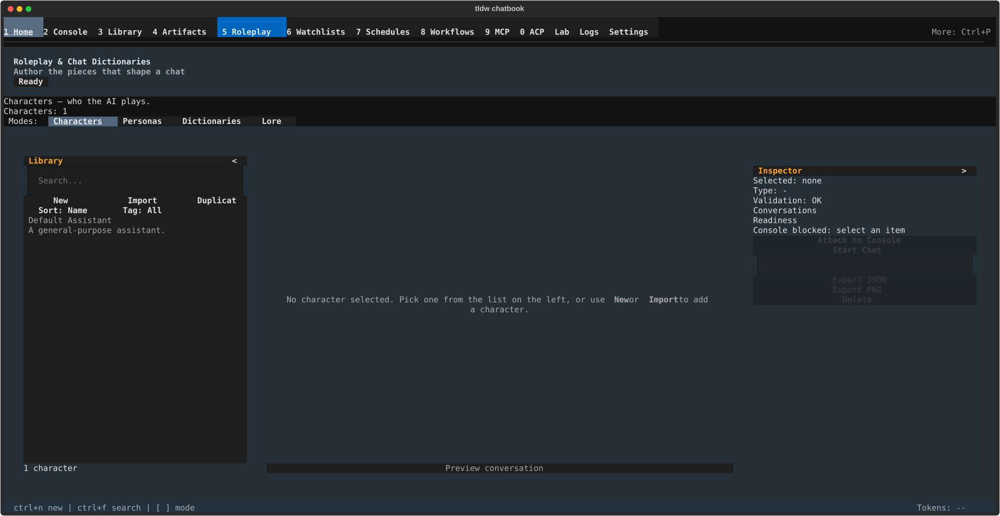

# Roleplay & Chat Dictionaries — Author the pieces that shape a chat

## What this screen is for

This is the workshop for everything that shapes how a chat sounds and what
it knows: **characters** (who the AI plays), **personas** (assistant
profiles for roleplay and chat), **chat dictionaries** (text find/replace
rules applied to what gets sent), and **lore books** (world facts injected
when a keyword appears). One screen, four modes, one shared layout. Nothing
here talks to a model on its own — you author an item, then hand it to
Console. Reach for it before a roleplay session, or whenever a chat needs
background facts or wording rules it doesn't have yet.

The details live on three child pages:

- [Characters & personas](roleplay-chat-dictionaries/characters-and-personas.md) — character cards, persona profiles, their editors, avatars, and import/export.
- [Lore books](roleplay-chat-dictionaries/lore-books.md) — world books: entries, keywords, budgets, and attachments.
- [Chat dictionaries](roleplay-chat-dictionaries/chat-dictionaries.md) — find/replace rules, the substitution preview, versions, and what Console actually applies.

## Getting there

- Press **Ctrl+5** from anywhere, or click **5 Roleplay** in the nav bar.
- **Ctrl+P** → "Switch to Roleplay & Chat Dictionaries". Four more palette
  entries land here too: "Character/Persona Management: Create New
  Character", "Character/Persona Management: Show All Characters",
  "Character/Persona Management: Open Character Tab", and "Quick Actions:
  New Character Chat".
- Old destination names still find it: typing **ccp**,
  **conversations_characters_prompts**, **characters**, or **roleplay**
  into the palette all route here.

## Layout tour

Top to bottom:

- **Header** — the title **Roleplay & Chat Dictionaries**, a subtitle that
  normally reads "Author the pieces that shape a chat" (it changes while
  you edit — "New character", "Editing \<name\>", and " - unsaved" when
  there are unsaved edits), and a status badge reading **Ready** or
  **Blocked**.
- **Purpose line** — one line describing the active mode; it is the same
  text as that mode's chip tooltip, and it changes every time you switch
  modes.
- **Status row** — "Characters: N" in Characters mode, "Personas: N" in
  Personas mode, and "Mode: Dictionaries" / "Mode: Lore" in the other two.
- **Modes:** — the chip strip. All four modes are live; none is a
  placeholder.

| Chip | Its tooltip (and the purpose line) |
|---|---|
| **Characters** | "Characters — who the AI plays." |
| **Personas** | "Personas — assistant profiles for roleplay and chat" |
| **Dictionaries** | "Dictionaries — text find/replace rules." |
| **Lore** | "Lore — world facts injected on keywords." |

Below the chips sit three panes:

- **Library** (left rail) — the searchable list of items in the current
  mode, with its **New** / **Import** / **Duplicate** buttons. The **<**
  button in its header collapses it to a slim **Library** handle; click the
  handle to bring it back.
- The **centre pane** — the detail view or editor for whatever you
  selected. Empty until you pick something.
- **Inspector** (right rail) — what's selected, whether it validates, its
  saved conversations, and the actions that send it to Console. Its
  header's **>** button collapses it to an **Inspector** handle.

Both rails start open. **F6** and **Shift+F6** cycle focus through the
panes (handle → Library → centre → Inspector → handle).

## Features & controls

### The Library rail

| Control | What it does | Shown in |
|---|---|---|
| **Search...** | Filters the list as you type. In Characters mode it searches the whole library, not just the page you're on. | every mode |
| **New** | Creates a new item in the current mode. ("Create a new item in this mode.") | every mode |
| **Import** | Opens a file picker; the tooltip names the accepted formats per mode — "Import a character card (PNG or JSON).", "Import a dictionary (JSON or Markdown).", "Import a world book (JSON)." | Characters, Dictionaries, Lore — **hidden in Personas** |
| **Duplicate** | Copies the selected item. ("Duplicate the selected item.") | Characters, Dictionaries, Lore — **hidden in Personas** |
| **Sort: Name** | Cycles the list order — Name → Recent edit → Recent add (plus Relevance while a Characters search is running). ("Cycle the list sort order.") | Characters, Personas — **hidden in Dictionaries and Lore** |
| **Tag: All** | Opens the "Filter by tag" picker. ("Filter characters by tag.") | **Characters only** |

Below the list:

- **Empty states** name the way out: "No characters yet - use New or
  Import to add one.", "No personas yet - use New to add one." (Personas
  has no Import), and the same "use New or Import" wording for "No
  dictionaries yet - …" and "No lore books yet - …".
- **The count line** reads "12 characters" (singular at one — "1
  character"), "3 of 12 characters" while a filter is on, or "Showing 7
  character matches from full library" when a search reaches past the
  current page.
- **A page bar** replaces the count line once Characters or Personas pass
  50 items — "1-50 of 137 characters", with **<** and **>** either side.
  Dictionaries and Lore never paginate.
- Highlighting a row doesn't select it — press Enter or click. In
  Dictionaries mode, **Space** turns the highlighted dictionary on or off.

### The Inspector

| Row | Shows |
|---|---|
| **Selected:** | The selected item's name, or "Selected: none". |
| **Type:** | "character", "persona", "dictionary", or "lore" — or "Type: -" with nothing selected. |
| **Validation:** | "Validation: OK", a list under "Validation errors:", or "Validation: editing..." while an editor is open. |
| **Conversations** | Saved chats for this item — "Loading conversations..." then the list, or "No saved conversations." |
| **Readiness** | Whether the Console actions will work right now (see below). |

Which action buttons appear depends on what you selected:

| Selection | Attach to Console | Start Chat | Export JSON | Export PNG | Delete |
|---|---|---|---|---|---|
| Character | shown | shown | shown | shown | shown |
| Persona | shown | shown | shown | hidden | shown |
| Dictionary | hidden | hidden | hidden | hidden | shown |
| Lore book | hidden | hidden | hidden | hidden | shown |
| Nothing selected | shown, disabled | shown, disabled | shown, disabled | shown, disabled | shown, disabled |

The **Readiness** line is the single source of truth for why a Console
action won't fire:

- "Console ready" — both actions will work.
- "Console blocked: select an item" — nothing is selected yet.
- "Console blocked: select a character or persona" — a lore book is
  selected; only characters and personas go to Console.
- "Console blocked: attach arrives in a later update" — a dictionary is
  selected.
- "Console blocked: unsaved edits" — save (or discard) first.
- "Start Chat blocked: \<reason\>" — the selection is fine, but the chat
  provider the handoff would use isn't ready. Attach still works; Start
  Chat doesn't. The header badge reads **Blocked** in this state too.

### Sending to Console

Both actions stage a card built from the item's full record (its name,
description, personality, scenario, and system prompt) — they don't send
anything by themselves.

- **Attach to Console** stages it as context for your next message, with
  the suggested prompt "Use \<name\> to guide the next response." Console
  confirms with "Staged in Console." This stays available even when the
  provider isn't ready — you're only staging.
- **Start Chat** opens Console on a fresh chat with the suggested prompt
  "Respond as \<name\>." and confirms with "Chat staged in Console." It
  refuses to run while the provider is unready.

### Leaving with unsaved edits

Switching modes, changing selection, or pressing Escape in an editor with
unsaved work first raises the **Unsaved Changes** dialog, naming the item
and asking whether to close it. **Keep Open** returns you to the editor;
**Close Without Saving** discards the edits and continues (Escape is the
same as Keep Open). Deleting an item with unsaved edits shows two dialogs
in a row — discard first, then the delete confirmation.

## Common tasks

1. **Switch modes.** Click a chip in the **Modes:** strip, or press
   **Ctrl+1** (Characters), **Ctrl+2** (Personas), **Ctrl+3**
   (Dictionaries), or **Ctrl+4** (Lore). With focus outside any text box,
   **[** and **]** step to the previous/next mode.
2. **Create something in the current mode.** Press **Ctrl+N** (or click
   **New** in the Library rail). The new item appears in the list and its
   editor opens in the centre pane; **Ctrl+S** saves characters and
   personas, while dictionaries and lore books have their own Save button.
3. **Find an item.** Press **Ctrl+F** to jump into the **Search...** box
   and type. Press Enter to drop into the results list, then Enter again
   (or click) on a row to open it.
4. **Send a character to Console.** Select the character, check the
   Inspector reads "Console ready", then press **Attach to Console** (or
   **Ctrl+Enter**) to stage it as context, or **Start Chat** to open
   Console on a new chat as that character.
5. **Give the centre pane more room.** Click **<** in the Library header
   and **>** in the Inspector header. Click the **Library** or
   **Inspector** handle to bring either rail back.

## Keyboard & commands

> **On this screen, Ctrl+1 – Ctrl+4 switch *modes*, not screens.** While
> Roleplay & Chat Dictionaries has focus those four chords select
> Characters / Personas / Dictionaries / Lore and do **not** navigate to
> Home, Console, Library, or Artifacts. **Ctrl+5 … Ctrl+0 still navigate
> normally**, as do the nav bar and **Ctrl+P**. (Verified by headless
> probe.)

Screen-level keys only — global keys live in the [guide index](index.md).

| Key | Action |
|---|---|
| Ctrl+1 / Ctrl+2 / Ctrl+3 / Ctrl+4 | Switch to Characters / Personas / Dictionaries / Lore |
| [ / ] | Previous / next mode — **only when focus is not in a text box** (in a text box they type the bracket) |
| Ctrl+N | New item in the current mode |
| Ctrl+F | Focus the **Search...** box |
| Ctrl+Enter | Attach to Console — only with a saved character or persona selected |
| Ctrl+S | Save — character and persona editors only |
| Escape | Back: cancels the open editor, returns from a conversation transcript to the card, or moves focus from the search box to the list. It never leaves the screen. |
| Space | Turn the highlighted dictionary on or off (Dictionaries mode, in the Library list) |
| F6 / Shift+F6 | Next / previous pane |

## Related settings & docs

- Child pages: [Characters & personas](roleplay-chat-dictionaries/characters-and-personas.md) · [Lore books](roleplay-chat-dictionaries/lore-books.md) · [Chat dictionaries](roleplay-chat-dictionaries/chat-dictionaries.md)
- Concept and format deep dives: [World & Lore Books](../Features/World-Lore-Books-Documented.md) · [Chat Dictionaries](../Features/ChatDictionaries-Documented.md) — the data
  model, matching rules, and file formats. Their UI walkthroughs describe
  a retired tab and no longer match this screen.
- `config.toml`: this screen reads no section of its own. The only setting
  it reflects is your chat provider default — what the Readiness line and
  the **Blocked** badge report on.

## Quirks & troubleshooting

- **Pressing [ or ] typed a bracket instead of changing mode.** Those are
  plain characters, so any focused text box takes them first — including
  the name field of an item you just created. Click a mode chip or use
  **Ctrl+1 – Ctrl+4** instead.
- **Ctrl+2 didn't take me to Console.** That's the mode shadowing
  described above. Use the nav bar, **Ctrl+P**, or Ctrl+5 … Ctrl+0.
- **New / Import / Duplicate / Tag are greyed out in Characters mode.**
  You're on a server runtime, where characters are read-only — the buttons
  give no explanation, and the sort button quietly reads "Sort: Server
  order". Export, Edit, and Delete are disabled for the same reason.
  Switch to a local runtime to author characters.
- **The Inspector only offers Delete.** A dictionary or a lore book is
  selected; the Console and export actions apply to characters and
  personas only.
- **My collapsed rail came back.** Rail collapse lasts for the current
  visit — leaving the screen and returning gives you both rails open
  again.
- **Ctrl+S did nothing.** It only presses Save in the character and
  persona editors. Dictionaries and lore books save from their own Save
  buttons.
- **A mode chip looks "coming soon".** None are any more — all four modes
  are live. Prompts moved out to Library and is no longer a mode here.

—
*Verified against dev @ 207053253 — 2026-07-31*
