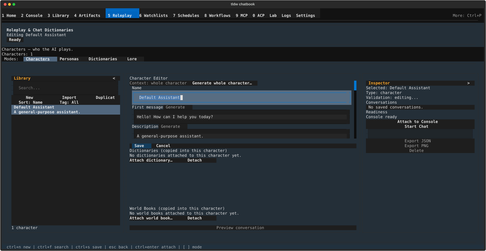
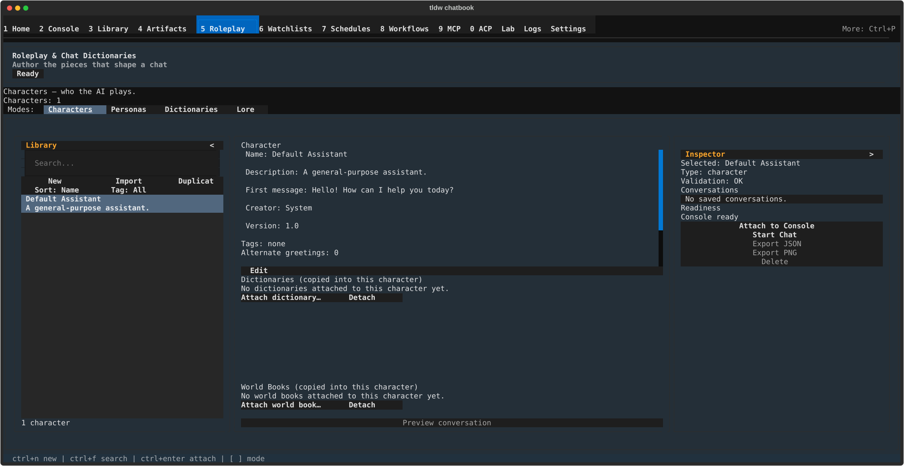

# Characters & Personas — author who the AI plays

## What this screen is for

A **character** is who the AI plays: a name, a description, a personality, an
opening line, and the prompt text that keeps it in role. A **persona** is the
smaller cousin — an assistant profile (name, description, system prompt) you
can stage into a chat without inventing a whole cast member. Both live behind
mode chips on the Roleplay & Chat Dictionaries screen, and both can be handed
to Console with one button. Come here to write, import, illustrate, or hand
off a character; come here for a persona when a full character is overkill.

## Getting there

Press **Ctrl+5** (or **Ctrl+P** → "Roleplay & Chat Dictionaries"), then pick
the **Characters** chip in the Modes strip — it is the mode the screen opens
on. **Personas** is the chip beside it. Once you are on this screen,
**Ctrl+1** and **Ctrl+2** jump to those two modes (they do *not* change
screens here — see [Keyboard & commands](#keyboard--commands)).

## Layout tour

Three panes: the **Library** rail, the centre pane, and the **Inspector**
rail. The rails behave the same in every mode and are described on the
[parent page](../roleplay-chat-dictionaries.md); this page is about the
centre, which shows either **the character card** (read-only, with a single
**Edit** button; "No character loaded. Select one from the library." before
you pick one) or **the character editor**, headed "Character Editor". Below
either sit two docked panels, **"Dictionaries (copied into this character)"**
and **"World Books (copied into this character)"**. The rail's **New**,
**Import** and **Duplicate** act on the current mode; the Inspector's
**Attach to Console**, **Start Chat**, **Export JSON**, **Export PNG** and
**Delete** act on the current selection.

## Features & controls

### The character card

Rows render as "Label: value" and appear only when filled in: **Name**
(falling back to "Unnamed Character"), **Description**, **Personality**,
**Scenario**, **First message** (the greeting the character opens with),
**System prompt**, **Post-history instructions** (text pushed in after the
conversation so far), **Creator**, and **Version** (defaulting to "1.0").
Three rows always show: **"Tags: none"** (or a comma-separated list),
**"Alternate greetings: N"**, and **"Avatar: none"** / **"Avatar: embedded"**;
the first alternate greeting, if any, is previewed underneath. **Edit** opens
the editor, and stays disabled until a saved character is loaded. Below the
rows sit the **Voice & Speech** block (next section) and, in Characters and
Personas modes, the **Preview conversation** pane.

### Voice & Speech

This block appears on both the card and the editor. A picker chooses the
voice this character speaks with — its first option is **"Use global
default"**, meaning the app's normal text-to-speech voice — over four
buttons: **Preview** (hear it), **Create** (make a new voice profile),
**Edit**, and **Remove**. **Edit** reads **"Repair"** instead when the
assigned profile has gone missing.

On a character you have not saved yet the status line reads **"Save/reopen
before assigning."** — save first, reopen the character, then pick a voice.
You may also see **"Loading voice profiles…"** or, after profiles change
underneath you, **"Voice profiles changed; reselect to retry."**

### Preview conversation

In Characters and Personas modes the centre pane ends with a
**Preview conversation** toggle — "Test the selected character or persona
in an ephemeral conversation; nothing is saved." Expand it to try the
character before committing to a real chat:

| Control | What it does |
|---|---|
| Provider line | Names the model that will answer, so you know what you are testing |
| **"Greeting:"** picker | Choose which greeting opens the test — handy once you have alternates |
| "Test message..." | Type the line you want to try |
| **Test Reply** | Sends it and shows the reply in the transcript above |
| **Reset** | Clears the test conversation |
| **Open in Console** | Carries this test into a real Console session — a third route to Console alongside the two Inspector buttons below |
| **Configure** | "Open Settings > Providers & Models to change which provider answers character chats." |

Nothing here is saved: closing the pane or leaving the screen discards the
test exchange.

### Editor — the generation toolbar

| Control | What it does |
|---|---|
| "Context: whole character" ⟷ "Context: field + description" | Click to flip. Tooltip: "How much of the character the model sees when generating a single field" |
| "Generate whole character…" | Opens the concept row. Tooltip: "Draft every empty field from a short concept" |
| Concept row | An input reading "One-line concept, e.g. a drowned-library archivist", plus **Draft** and **Cancel** |
| Per-field **Generate** | Drafts that field alone; reads "Generating…" while it works |

Everything here drafts with the model Console is set to use, and there are two
behaviours worth keeping apart. A **per-field Generate** never writes into the
field: the text arrives in a preview panel titled "Generated {field} - review
before applying" (filling in as it streams) with **Accept**, **Regenerate**
and **Discard** — nothing touches your form until **Accept**.
**Draft** (whole character) writes straight into the form, but only into
fields that are *empty*, so filling a blank card never overwrites text you
already wrote; it reports "Filled N empty field(s)." or "Nothing was filled:
every generated field already has content." Failures read "Could not
generate: …".

### Editor — fields

Primary fields, in form order: **Name** (placeholder "Character name"),
**First message**, **Description**, **Personality**, **System prompt** — each
long one carrying its own **Generate**. **"Advanced ▸"** expands (to
"Advanced ▾") — collapsed every time you open the editor — and holds
**Scenario**, **Post-history instructions** and **Creator notes** (each with
**Generate**); **Creator**, **Version** (defaulting to "1.0") and **"Tags
(comma-separated)"**; and **Alternate greetings**, a real list rather than a
text box — type into the box, press **Add**, then select a row to **Update**,
**Delete**, **Move up** or **Move down**.

### Editor — avatar and expressions

The avatar row reads "Avatar: none" or "Avatar: embedded" ("Avatar:
generating…" while an image is being made), followed by **Upload**,
**✨ Generate** and **Remove**. **Upload** opens "Upload Character Avatar"
(filters for Image Files, PNG Files, JPEG Files, WEBP Files and GIF Files);
files must be **5 MB or smaller** and one of "PNG, JPG, JPEG, WEBP, or GIF",
or you get "Avatar image must be 5 MB or smaller." or "Unsupported avatar
image type…". On success: **"Avatar staged. Save the character to persist
it."** — nothing is stored until you press **Save**. **✨ Generate** needs a
Description first ("Add a description first.") and an image-generation backend
set up in Settings; without one, the toast names the setting to fix.

Below that sits a block headed **Expressions** with a "Style: …" readout and
four buttons — **Style…** (pick the image style), **✨ Generate all**, **Import
set…**, **Export set…** — over one row per expression state (*thinking*,
*speaking*, *error*), each with **Upload**, **✨ Generate** and **Clear**. Those
buttons stay disabled until the character has been saved once ("Save the
character to add expressions."), and exporting a set before saving is refused
too. **✨ Generate all** asks first — "This will overwrite the existing avatar
and/or expression images. Continue?" (**Generate all** / **Cancel**) — and
reports "{k}/{N} generated.".

### Editor — saving and validation

The footer lists problems under **"Validation errors:"** — **"name:
required"** and **"image exceeds 5 MB"** both block **Save** (the offending
row is outlined in red), while **"greeting N is blank"** is only a *warning*
and never blocks the save.

**Save** persists and toasts **"Character saved."** (failures read "Save
failed: …"); the editor stays open on the saved character so you can keep
working. **Cancel** leaves it. Either way, unsaved edits raise the
**"Unsaved Changes"** dialog — 'The tab "{name}" has unsaved changes. Are you
sure you want to close it?' with **Close Without Saving** / **Keep Open**.

**Creating, duplicating, deleting.** **New** in the Library rail (or
**Ctrl+N**) opens a blank editor with the cursor in Name. **Duplicate** copies
the selection — description, personality, scenario, greetings, tags, avatar
and all — as **"{name} (copy)"**, then "(copy 2)", "(copy 3)"…, with **no
confirmation**. **Delete** (Inspector) confirms with **"Delete {name}? This
cannot be undone here."** (**Delete** / **Cancel**) and reports "Deleted."

### Importing and exporting a card

**Import** in the Library rail opens **"Import Character Card"** with filter
groups "Character Cards", "JSON Files", "Card Images (PNG/WebP)", "Markdown
Files" and "All Files". What actually reads: **PNG cards** carrying the
standard embedded card data (older and v3 flavours), **WebP cards** carrying
it in their EXIF comment, and **text cards** — `.json`, `.yaml`, `.md` — as
raw JSON, as front matter, or as a fenced JSON block; common exports from
other apps are converted on the way in, and other image types are refused
("Use PNG or WebP cards."). A file that parses but holds no card is refused
with **"Import failed: the file did not contain a valid character card."**;
anything else that goes wrong gives one deliberately plain message:
**"Character import failed; verify the file and retry."**

On success: **"Character imported."**, and the list jumps to the new row; if
the card carried a lorebook the toast gains **" Lorebook '{name}' attached
(N entries)."** If that name already existed you get **"Character already
existed; selected it. Re-importing does not update an existing character."**
— delete the old character first, or import under a different name.

If the card also carries a voice profile, importing can ask you two
questions: **"Imported voice profile conflict"** (Cancel / Reuse / Create
copy) when a profile of that name already exists, and **"Apply imported
voice?"** (Keep current / Apply voice) when the character you are importing
over already has one.

**Exporting.** The Inspector offers **Export JSON** (characters and personas)
and **Export PNG** (characters only), opening "Export as JSON" / "Export as
PNG" with the name pre-filled; the JSON export carries the avatar. A
checkbox, **"Include assigned voice profile"**, sits between **Start Chat**
and **Export JSON** — tick it to carry this character's voice with the
export. It stays greyed out until the character has a voice assigned
("Assign a voice profile before including it."). Results read "Exported to
the selected destination." or "Export failed. The selected item was not
written." Refusals: "Select a saved
item before exporting." and "PNG export is only available for characters.";
with unsaved edits both buttons are disabled, tooltipped "Save before using
this action; the selection has unsaved edits."

### Handing a character to Console

Two Inspector buttons, and they are not the same thing (a third route,
**Open in Console**, lives in the Preview conversation pane above and
carries your test exchange with it):

| | **Attach to Console** | **Start Chat** |
|---|---|---|
| Staged prompt | "Use {name} to guide the next response." | "Respond as {name}." |
| Toast | "Staged in Console." | "Chat staged in Console." |
| Blocked when the model isn't ready? | No | Yes — "Start Chat blocked: {reason}" |

Both carry the character's Name plus its non-empty Description, Personality,
Scenario and System prompt. **Attach** only stages context for you to send
later, so it stays available even when the model isn't ready; **Start Chat**
opens a chat, so it waits for a ready model. The Inspector's readiness line
says which — "Console ready", "Console blocked: select an item", or the
reason. Neither works on an unsaved selection.

### Dictionaries and World Books copied into a character

The **"Dictionaries (copied into this character)"** panel lists the chat
dictionaries travelling with this character (columns "dictionary" and
"entries"), with **Attach dictionary…** and **Detach**, and reads "No
dictionaries attached to this character yet." when empty. Each attached
dictionary is a **snapshot** — editing the original later does *not* update
the copy; re-attach to refresh. See [Chat dictionaries](chat-dictionaries.md).

The **"World Books (copied into this character)"** panel is identical for lore
(columns "world book" and "entries", **Attach world book…** / **Detach**) and
carries the same snapshot warning. See [Lore books](lore-books.md).

### Personas

Switch to the **Personas** chip. A persona is deliberately thin: the card is
headed **"Persona Profile"** and shows **Name**, **Description** and **System
prompt** with an **Edit** button. The **"Persona Editor"** holds **Name**
(placeholder "Persona name"), **Description**, **System prompt**,
**Personality traits**, **Mode** — two choices, "session_scoped" and
"persistent_scoped", shown exactly like that; the value is stored with the
persona, but nothing in the app reads it today — and an **Enabled** switch
that starts on, over **Save** / **Cancel**. Save toasts "Persona saved.", and
the unsaved-changes dialog behaves as it does for characters. What is
*missing* compared to characters: **no Import**, **no Duplicate** (both hidden
in this mode) and **no Export PNG** — only Export JSON. Attach to Console and
Start Chat stage the persona's Description and System prompt the same way.

### Placeholders in your text

Character text traditionally uses placeholders, and this app resolves them —
but **nothing in the app tells you so**: no tooltip or hint on this screen
mentions them, so this guide is where you learn them.

- `{{char}}`, `{{character}}`, `{{persona}}` and `<CHAR>` all become the
  **character's** name.
- `{{user}}`, `{{random_user}}` and `<USER>` become **your** name.

Note the trap: `{{persona}}` resolves to the *character*, never to you. In the
previews on this screen, `{{user}}` comes out as the literal word "User".

## Common tasks

1. **Write a character from a one-line concept.** Library rail **New** (or
   **Ctrl+N**) → **"Generate whole character…"** → type the concept, e.g. a
   drowned-library archivist → **Draft**. Read what landed in each field, fix
   what you dislike, **Save**.
2. **Add an alternate greeting.** **Edit** → **Advanced ▸** → type it into the
   box under "Alternate greetings" → **Add** → order it with **Move up** /
   **Move down** → **Save**.
3. **Give the character a picture.** **Edit** → **Upload** on the avatar row →
   pick a PNG/JPG/WEBP/GIF under 5 MB → **Save** (nothing is stored until you
   do). Or **✨ Generate**, once the Description is written.
4. **Import a character card.** Characters mode → **Import** → choose a PNG,
   WebP or JSON card. The new character is selected for you; if a lorebook
   came with it, the toast says so.
5. **Start a chat as the character.** Select it, then Inspector →
   **Start Chat** ("Chat staged in Console."). If it is blocked, read the
   readiness line and fix the model — or use **Attach to Console** instead.
6. **Make a persona.** **Personas** chip (**Ctrl+2**) → **New** → fill in
   Name, Description and System prompt → **Save**.

## Keyboard & commands

| Key | Action |
|---|---|
| Ctrl+N | New character (or new persona, in Personas mode) |
| Ctrl+F | Jump to the Library rail's search box |
| Ctrl+S | Save — works in both the character editor and the persona editor |
| Escape | Cancel the open editor (the **Cancel** path, unsaved guard included) |
| Ctrl+Enter | Attach the selection to Console (does nothing when Attach is unavailable) |
| Ctrl+1 / Ctrl+2 | Switch to the Characters / Personas mode |

**Ctrl+1 – Ctrl+4 do not change screens here** — they switch modes. To leave,
click a nav label, press **Ctrl+P**, or use Ctrl+5 … Ctrl+0.

## Related settings & docs

- [Roleplay & Chat Dictionaries](../roleplay-chat-dictionaries.md) — the
  parent screen: the Modes strip, the Library rail, the Inspector, and the
  unsaved-changes guard.
- [Chat dictionaries](chat-dictionaries.md) and [Lore books](lore-books.md) —
  the two things you can copy into a character;
  [Chat basics](../console/chat-basics.md) — where an attached or started
  character gets used;
  [World & lore books](../../Features/World-Lore-Books-Documented.md) — the
  lore format (its walkthrough describes a retired screen; concepts only).
- **There is no feature deep-dive for character cards.** Nothing else in the
  documentation covers the card format, the editor, or the import paths —
  this page is it.
- Guide index: [index](../index.md).

## Quirks & troubleshooting

- **Duplicate has no confirmation** — one click makes "{name} (copy)".
- **Re-importing does not update an existing character** — the import is
  skipped with "Character already existed; selected it." Delete the old one
  first, or rename before importing.
- **Import failures are deliberately vague** — check the file is a PNG/WebP
  card with embedded data, or valid JSON/YAML.
- **Expression buttons need a saved character** ("Save the character to add
  expressions."); the avatar buttons do not.
- **Blank greetings warn but don't block** — the save goes through, and an
  empty greeting simply does nothing in a chat.
- **Connected to a server, the character actions go quiet.** New, Import,
  Duplicate, Edit, Export and Delete disable themselves with no explanation
  on screen. Nothing is broken — those actions are local-only.
- **Alternate greetings are a list, not a text box** — several typed in at
  once become *one* greeting; press **Add** for each.

—
*Verified against dev @ 8b7fa5eb6 — 2026-07-31*
