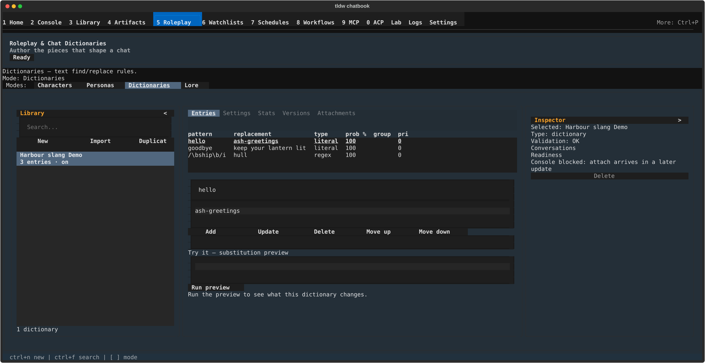

# Chat dictionaries — find/replace rules applied to your message before it reaches the model

## What this screen is for

A chat dictionary is a named list of find/replace rules. Attach one to a
conversation (or to a character) and every message you send is rewritten on its
way out — "Meridian" becomes "Meridian, the sunken clock-tower city"; a
shorthand becomes a full instruction. Use it to keep terminology consistent
without retyping it.

The mental model in one line: **your text goes in, the rewritten text goes to
the model, and your saved transcript keeps what you actually typed.** Only the
last message you sent is rewritten — earlier history, the system prompt and the
reply are untouched — and a message starting with a slash command is skipped.
For lore that is *injected* rather than substituted, see the parent
[Roleplay & Chat Dictionaries](../roleplay-chat-dictionaries.md) page.

## Getting there

Press **Ctrl+5** to open **Roleplay & Chat Dictionaries**, then click
**Dictionaries** in the "Modes:" strip — or press **Ctrl+3**, which picks that
mode while this screen is open (here **Ctrl+1**–**Ctrl+4** select modes instead
of switching screens). The descriptor above the rail then reads "Dictionaries —
text find/replace rules."

The Library rail lists your dictionaries; before you have any it reads "No
dictionaries yet - use New or Import to add one." Each row shows the name with
"{N} entries · on" (or "· off") underneath, over a count line reading "{N}
dictionaries". Highlight a row and press **Space** to switch that dictionary on
or off without opening it.

## Layout tour

- **Library rail** (left) — "Search...", the **New**, **Import** and
  **Duplicate** buttons, then the dictionary rows.
- **The detail pane** (centre) — five tabs: **Entries**, **Settings**,
  **Stats**, **Versions**, **Attachments**, over a status line reporting the
  outcome of whatever you just did.
- **"Try it — substitution preview"** (below the tabs, this mode only) — a
  sample-text box, a **Run preview** button, the before/after result.
- **Inspector** (right) — for a dictionary it offers only **Delete**; its
  readiness line reads "Console blocked: …" because dictionaries are attached to
  a conversation, not started as a chat.

## Features & controls

### The Entries tab

The table lists the rules in application order under the columns **pattern**,
**replacement**, **type**, **prob %**, **group** and **pri**. A switched-off
rule is dimmed and its pattern cell ends in "off". Click a row (or arrow onto
it) to load it into the form below.

| Control | What it does |
|---|---|
| Pattern | The text to look for |
| Regex pattern (switch) | Off = literal text; on = a regular expression |
| Probability % | How often the rule fires, 0–100 (default 100) |
| Group | Optional group name; see below |
| Max repl. | How many matches in one message get replaced (default 1) |
| Entry enabled (switch) | Turns this one rule off without deleting it |
| Case-sensitive (literal keys) (switch) | Match capitalisation exactly — literal patterns only |
| Priority | Which rule wins inside a group (higher wins) |
| The large box | The replacement text |
| Add / Update / Delete | Add a new rule, save the highlighted one, remove it |
| Move up / Move down | Reorder the highlighted rule |

How the rules behave:

- **Literal vs regex.** A literal pattern matches whole words only, so "cat"
  does not fire inside "catalogue". With **Regex pattern** on you write an
  expression, or write it in the `/pattern/flags` form yourself with the flags
  `i` (ignore case), `m` (multi-line) and `s` (dot matches newlines).
  Case-sensitivity applies to literal patterns only — for a regex use `/i`.
- **Probability** is a percentage roll per message: 100 always fires, 25 fires
  about a quarter of the time, 0 never fires. **Max repl.** caps replacements
  within one message, so "1" leaves the second and later mentions alone.
- **Groups are mutually exclusive.** Give several rules the same group name and
  only one fires per message — the one with the highest **Priority**. Rules with
  no group all fire independently.

Editing is immediate: **Add**, **Update**, **Delete** and the move buttons write
straight to the dictionary. The line above the form shows problems first — "A
pattern is required (an empty pattern can never fire).", "Probability must be a
whole number 0-100.", "Max replacements must be a positive whole number.",
"Priority must be a whole number.", and "Select an entry row first."

### The advisory list under the entries

Below the buttons sits a list of findings about the rules you have written, each
reading like `[probability_zero] hello — Probability 0 means this entry can
never fire.` These **warn, they never block** — a dictionary with findings still
saves and still runs. Click one to jump the table to the rule it is about:

- "Pattern does not compile; the engine will treat it as a literal."
- "Case-sensitive is ignored for regex entries; use the /i flag instead."
- "Same pattern and type as an earlier entry; only one will usually fire."
- "Probability is not a number; the editor will display 100% until it is fixed."
- "Probability 0 means this entry can never fire."

### The Settings tab

**Name** and a description box; a strategy select (**sorted_evenly** — the
default, alphabetical by pattern; **character_lore_first**;
**global_lore_first**) deciding the order rules are considered in when the
budget is tight; **Token budget** (default 1000), a cap on how much replacement
text one message may pull in; and an **Enabled** switch for the whole
dictionary. Press **Save settings** to commit — the status line answers "Saved."
or "A name is required." **Export JSON** and **Export Markdown** sit here too,
under the note "Exports read the last saved state."

### Stats, Versions and Attachments

**Stats** summarises the loaded dictionary: "Entries: N", "Types — literal: N ·
regex: N · disabled: N", "Approx. replacement tokens: N", a "Priority:
min..max" line when any rule uses one, and "Dictionary enabled: yes/no".

**Versions** is the history, newest first, under **rev**, **action**, **name**
and **created** — a revision per settings save and per entry change. **View**
prints that revision's summary below the table; **Revert…** asks "Revert to
revision {n}? Current settings and entries are replaced." first, and is itself
recorded as a revision. **Attachments** lists the conversations this dictionary
is live in ("Not attached to any conversation yet." until it is), with **Attach
to conversation…** (a searchable picker) and **Detach**.

### "Try it — substitution preview"

Type a sample message into the box and press **Run preview** (or **Ctrl+Enter**
from that box): the pane shows your text before and after with the changed spans
marked. The status line reads "No differences - no entry changed the sample." or
"Changed spans highlighted below."; before you pick a dictionary it prompts
"Select a dictionary to preview substitutions." Underneath, a summary counts
"{fired} fired · {skipped} skipped · {used}/{budget} tokens", adding "· over
budget" when the replacements did not fit; then one line per rule that fired
(`pattern → replacement · ×2 · 14 tok`); then the near-misses and why:

- "skipped: lost group scoring" — another rule in the same group won.
- "skipped: probability roll — re-running may differ" — the dice said no.
- "skipped: cooldown or delay" — a timed effect held it back.
- "skipped: token budget" — the budget ran out before this rule.
- "skipped: disabled" — the rule is switched off.
- "replacement failed — see logs"
- "no replacement — text changed by an earlier entry"

### Importing and exporting

**Import** in the rail opens the **Import Dictionary** picker for `.json` and
`.md` files up to 10 MB ("Import failed: file is larger than 10 MB." above
that). A name already in use is imported anyway as "{name} (imported)",
announced as "Name in use - imported as '…'."

**Export JSON** is the full backup — every field round-trips. **Export
Markdown** is lossy and says so first: "Markdown keeps only pattern and
replacement text. These fields are DROPPED: regex/type, probability, group, max
replacements, timed effects, enabled, case-sensitivity, priority. Use JSON for a
full backup." with **Export anyway** / **Cancel**. Markdown *import* drops the
same fields — pattern and replacement, nothing else.

### Attaching a dictionary so it actually does something

A dictionary does nothing until it is attached *and* enabled:

- **To a conversation** — the **Attachments** tab here, or Console's own attach
  action. A live link: edit the dictionary later and the conversation gets it.
- **To a character** — the **Dictionaries (copied into this character)** panel
  on the character card (see
  [Characters & personas](characters-and-personas.md)). That copy is a
  **snapshot**: editing the source dictionary afterwards does *not* change what
  the character carries. Re-attach to refresh it.

When both apply, an **enabled conversation dictionary shadows a character
dictionary of the same name** — the conversation's version wins and the
character's copy is skipped; a *disabled* conversation dictionary does not claim
the name, so the character's copy applies. How that shows up at send time — the
Inspector's **Chat Dictionaries** block, the "from conversation" / "from
character" rows, the " (shadowed)" and " (disabled)" markers (Console shows the
marker, not the rule above), and Console's **Attach dictionary…** /
**Detach dictionary…** — is documented in
[Console ▸ Context & RAG](../console/context-and-rag.md).

## Common tasks

1. **Create a dictionary and add one rule.** Press **New** (or **Ctrl+N**); you
   land on **Settings** with the name focused — type a name, press **Save
   settings**. Open **Entries**, type the text to find into **Pattern** and the
   replacement into the large box, press **Add**.
2. **Check what it will do.** Type a sentence containing the pattern into the
   "Try it — substitution preview" box, press **Run preview**. The after-text
   shows the change and the summary confirms "1 fired".
3. **Make a rule fire only sometimes.** Highlight it, set **Probability %** to
   e.g. `25`, press **Update**. Re-run the preview a few times — when it does
   not fire you will see "skipped: probability roll — re-running may differ".
4. **Turn one rule off without deleting it.** Highlight it, switch **Entry
   enabled** off, press **Update**; its row dims and ends in "off".
5. **Attach it to a conversation.** Open **Attachments**, press **Attach to
   conversation…**, search, select the row, press **Attach**. It is live for
   that conversation's next send.
6. **Back it up.** On **Settings** press **Save settings**, then **Export
   JSON**; the status line reports where the file was written.

## Keyboard & commands

| Key | Action |
|---|---|
| Ctrl+3 | Switch to Dictionaries mode (while this screen is open) |
| Ctrl+N | New dictionary |
| Ctrl+F | Focus the rail's search box |
| Space | Turn the highlighted dictionary row on/off |
| Ctrl+Enter | Run the substitution preview (from the "Try it" box) |

**Ctrl+S does not save a dictionary.** Use **Save settings** for the Settings
tab; entry edits save the moment you press **Add**, **Update**, **Delete** or a
move button. Elsewhere on this screen Ctrl+Enter is the attach-to-Console
shortcut, which does nothing while a dictionary is selected.

## Related settings & docs

- [Chat dictionaries — concepts & file format](../../Features/ChatDictionaries-Documented.md)
  — the deep dive on pattern matching, groups, timed effects, budgets and the
  Markdown file format, plus worked example dictionaries. Two caveats: its UI
  walkthrough describes a retired tab, not this workbench; and the
  `[group]key: value|33` syntax it shows is **not** parsed by the current
  importer — Markdown import keeps pattern and replacement only.
- [Characters & personas](characters-and-personas.md) — the "Dictionaries
  (copied into this character)" panel.
- [Console ▸ Context & RAG](../console/context-and-rag.md) — attaching,
  detaching and inspecting dictionaries from a live chat.
- [Roleplay & Chat Dictionaries](../roleplay-chat-dictionaries.md) — the
  screen's other three modes.
- [Guide index](../index.md) — global keys and navigation.
- `config.toml` `[ChatDictionaries]` — legacy keys (including
  `enable_chat_dictionaries` and `chat_dictionary_replacement_strategy`) that
  this path does **not** read. Attached plus enabled is what decides whether a
  dictionary applies.

## Quirks & troubleshooting

- **A preview can fire rules a real send drops.** The preview uses the
  dictionary's own **Token budget** and strategy; the Console send path uses a
  fixed 500-token budget and `sorted_evenly`. If a rule shows in the preview but
  not in the reply, check the token count against 500.
- **Timed effects have no editor fields.** Cooldown, delay and sticky exist in
  the format and survive JSON export/import and **Duplicate**, but nothing here
  sets them — the preview can still report "skipped: cooldown or delay" for an
  imported rule.
- **The entry list reloads after every change.** Rules are tracked by position,
  so adding, deleting or moving one refreshes the whole table and the row you
  were on may shift.
- **Preview results are not repeatable below 100% probability** — by design; the
  skip reason says so.
- **Leaving the screen drops your dictionary selection** — re-select it when you
  come back (task-488).
- **Exports read the last saved state.** Press **Save settings** before
  exporting or your latest Settings edits will not be in the file.
- **One dialog at a time.** While an import, export, attach or detach dialog is
  open, pressing another of those buttons does nothing.
- **"Save failed: the dictionary changed since it was loaded. Reselect and try
  again."** — something else changed it (another view, or Space on the rail
  row). Re-select the dictionary and redo the edit.

—
*Verified against dev @ 207053253 — 2026-07-31*
