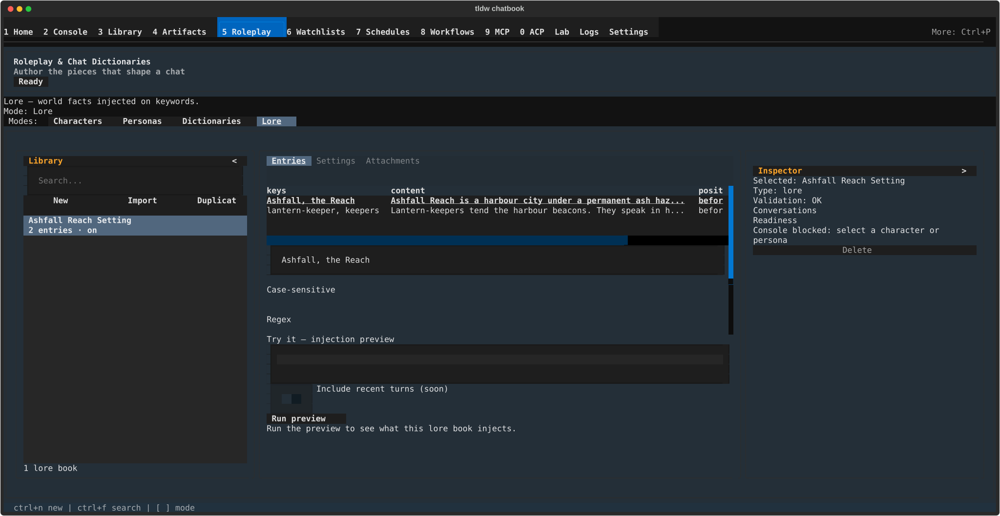

# Lore — world facts injected on keywords

## What this screen is for

A lore book (also called a world book) is a bundle of short facts about your
world — a city, a faction, a piece of history — that only reach the model when
they are relevant. Each entry carries keywords; before a reply is sent the
recent text is scanned for them, and every entry whose keywords appear is
injected into the prompt at the position you chose, in priority order, until
the book's token budget runs out. Reach for Lore when a character's background
is too big for one card, or when several conversations share a world.

## Getting there

Press **Ctrl+5** to open Roleplay & Chat Dictionaries, then click the **Lore**
chip in the mode strip (or press **Ctrl+4** — on this screen Ctrl+1 to Ctrl+4
pick the four modes instead of switching screens). The line above the rail
confirms it: "Lore — world facts injected on keywords." With no books saved
yet, the rail reads "No lore books yet - use New or Import to add one."

## Layout tour

- **Library rail** (left) — one row per book: its name plus a meta line
  reading "3 entries · on" (or "· off" when the book is switched off). The
  "Search..." box filters by name only, and Lore never paginates, so there is
  no "Sort:" or "Tag:" button. The toolbar carries **New**, **Import**, and
  **Duplicate**.
- **Detail** (centre) — three tabs: **Entries**, **Settings**, and
  **Attachments**, plus a status line underneath that reports the result of
  whatever you just did.
- **Try it — injection preview** (below the tabs) — a sample-text box and a
  **Run preview** button that shows exactly what this book would inject.
- **Inspector** (right) — for a lore selection it shows "Type: lore",
  "Console blocked: select a character or persona", and a single **Delete**
  action; Console handoffs are a character/persona feature.

## Features & controls

### Entries tab

The table lists every entry with the columns **keys**, **content**,
**position**, **priority**, and **enabled**. Content is shortened to about
sixty characters. Disabled rows are dimmed and show "no" under **enabled**.
Clicking a row — or just moving the highlight onto it with the arrow keys —
loads it into the form below.

| Control | What it does |
|---|---|
| "Keys (comma-separated)" | The trigger words. Any one of them matching fires the entry. |
| Position | Where the text lands in the prompt: "Before character", "After character", "At start", or "At end". Defaults to "Before character". |
| "Priority" | 0–100. Higher priority survives the token budget first and is injected first. Values outside the range are pulled back into it. |
| "Entry enabled" switch | Off keeps the entry in the book but stops it firing. |
| "Case-sensitive" | Off by default — "Cairn" and "cairn" both match. |
| "Selective" | Requires a second keyword too: the entry fires only if a primary key **and** one of the secondary keys appear. Turning it off greys out the secondary keys box. |
| "Secondary keys (comma-separated)" | The second half of a "Selective" match. Ignored while "Selective" is off. |
| "Regex" | Treats every key as a pattern instead of plain text. |
| Content box | The text that gets injected. |
| "Add" / "Update" | Save a new entry, or overwrite the highlighted one. |
| "Delete" | Removes the highlighted entry. |
| "Move up" / "Move down" | Reorder entries; the order breaks ties between entries of equal priority. |

Two things to watch. **"Add" and "Update" do nothing at all when either the
keys box or the content box is empty** — no error, no toast; fill both in.
And with **"Regex"** on, patterns are checked before they are saved: capped at
500 characters ("Regex pattern is too long (max 500 characters)."), rejected
when malformed ("Invalid regex: …"), and rejected when they nest one repeat
inside another ("Regex pattern is too complex (nested quantifiers can hang
matching).").

### Settings tab

Holds the book-level fields: **Name**, a description box, **"Scan depth"**
(default 3 — how many recent messages the keyword scan looks back over),
**"Token budget"** (default 500 — the ceiling on everything this book
injects), a **"Recursive scanning"** switch (lets one entry's content trigger
another entry), and an **"Enabled"** switch for the whole book. **Save
settings** writes them; a blank name is refused with "A name is required."
**Export** writes the book out as JSON. Type anything non-numeric into "Scan
depth" or "Token budget" and it quietly reverts to 3 and 500 with no warning,
so re-open the tab to check what was actually saved.

### Attachments tab

Attaching a book to a conversation is what makes it fire during real chats.
Until you do, the tab reads "Not attached to any conversation yet." **Attach
to conversation…** opens a picker titled "Attach to conversation" with a
"Search conversations…" box; **Detach** removes the highlighted one.
Conversations with no title show as "(untitled)".

### Try it — injection preview

Type a line of sample dialogue, then click **Run preview** (or press
**Ctrl+Enter** while the preview pane has focus).

- The status line reads "Injected content shown below, grouped by position."
  when something fired, or "No entries fired - nothing was injected." when
  nothing did. An empty box gets "Type some sample text first."
- Below it, the injected text is grouped under the headings **Before
  character**, **At start**, **At end**, and **After character**.
- A diagnostics line summarises the run: "2 fired · 1 near-miss · 180/500
  tokens", with " · over budget" appended when the budget was blown.
- Then one row per fired entry (its keys, a snippet, its priority and token
  cost) and one dim row per near-miss explaining why it did not fire.

The **"Include recent turns (soon)"** switch is deliberately disabled, with
the tooltip "Scanning recent conversation turns arrives in a later Lore
cycle." **The preview only ever scans the text you typed into the sample
box** — never real conversation history — so a book that depends on words
spoken several turns ago looks quieter here than it is in a live chat.

### Import and export

**Import** opens a picker titled "Import World Book". JSON only, and files
over 10 MB are refused with "Import failed: file is larger than 10 MB." Three
shapes are understood: this app's own exports, the character-book array form
found inside character cards, and SillyTavern "World Info" files — including
their "key", "keysecondary", "caseSensitive" and "disable" field names and
their numbered positions. Bad files are rejected before anything is written,
naming the entry ("Entry 3 has no keys."). If the name is already taken the
book is imported under a new one: "Imported 'Ashfall'. Renamed to avoid a name
clash." Export lives on the Settings tab.

### Attaching a book to a character

A character can carry its own copy of a book. On a character's card or editor,
the panel **"World Books (copied into this character)"** offers **Attach world
book…** and **Detach**. The wording is literal: what gets stored is a
**snapshot**. Editing the original book afterwards does *not* update the
character's copy — detach and re-attach to pick up changes. Importing a
character card that ships with a lorebook attaches one automatically
("Lorebook 'Ashfall' attached (12 entries)."). See
[Characters and personas](characters-and-personas.md).

## Common tasks

### Create a world book and add its first entry
1. In Lore mode, click **New** (or press **Ctrl+N**). A book called "Untitled
   world book" appears and the Settings tab opens with the name selected.
2. Type a real name and click **Save settings**.
3. Switch to the **Entries** tab, type your trigger words into "Keys
   (comma-separated)", write the fact in the content box, and click **Add**.

### Check that an entry actually fires
1. In the "Try it — injection preview" box, type a sentence containing one of
   the entry's keywords.
2. Click **Run preview** (or press **Ctrl+Enter**).
3. Read the diagnostics line. A near-miss row tells you why it did not fire —
   usually a keyword that never appeared, or a missing secondary key.

### Make one entry win when the budget is tight
1. Highlight the entry in the table.
2. Set "Priority" higher than its rivals (0–100) and click **Update**.
3. Run the preview again — entries survive the budget in priority order, so
   the raised entry should move up the fired list.

### Attach a book to a conversation
1. Open the **Attachments** tab and click **Attach to conversation…**.
2. Find the conversation with "Search conversations…" and confirm with
   **Attach**. The toast reads "Attached to conversation."

### Import a SillyTavern world info file
1. Click **Import** in the rail toolbar.
2. Pick the JSON file in the "Import World Book" dialog.
3. Open the new book's Entries tab and spot-check a few rows — positions and
   the disabled flag are translated on the way in.

## Keyboard & commands

| Key | Action |
|---|---|
| Ctrl+N | Create a new lore book |
| Ctrl+F | Jump to the rail's "Search..." box |
| Ctrl+Enter | Run the injection preview (when the preview pane has focus) |

**Ctrl+S does not save here.** It only reaches the character and persona
editors; in Lore mode it does nothing, so use **Save settings** on the
Settings tab and **Add** / **Update** on the Entries tab. Global navigation
keys live in the [guide index](../index.md), with the Ctrl+1–Ctrl+4 caveat
noted on [Roleplay & Chat Dictionaries](../roleplay-chat-dictionaries.md).

## Related settings & docs

- [World & lore books](../../Features/World-Lore-Books-Documented.md) — the
  concepts and file-format deep dive: the entry model, the four positions,
  recursive scanning, token budgets, and SillyTavern compatibility are all
  accurate. **Its UI walkthrough is out of date** — it describes a retired tab
  and buttons ("Create World Book", "Load Selected") that no longer exist, and
  it predates the priority field, the "Regex" toggle, the injection preview,
  the Attachments tab, and the 10 MB import cap. Read it for the format; read
  this page for the screen.
- [Roleplay & Chat Dictionaries](../roleplay-chat-dictionaries.md) — the
  parent screen, its four modes, the rail and the Inspector.
- [Characters and personas](characters-and-personas.md) — the character side
  of the "World Books (copied into this character)" panel.

## Quirks & troubleshooting

- **Nothing is ever "always on."** Every entry is keyword-triggered; there is
  no constant or always-injected entry type. To approximate one, give the
  entry a keyword that your world uses constantly.
- **Scan depth and token budget are per book, not per entry.** One noisy
  entry can eat the whole budget and starve the rest; the fix is priority,
  shorter content, or splitting the world across two books.
- **The preview does not see your chat history.** "Include recent turns
  (soon)" is disabled, so previews scan only your sample text — a real reply
  scans the last few messages as well, up to "Scan depth".
- **Character copies are frozen.** A book attached to a character is a
  snapshot; edits to the source never reach it.
- **Blank keys or blank content make Add and Update silent no-ops.** If a
  click seems to have done nothing, check both boxes are filled.
- **Non-numeric depth or budget values vanish.** They fall back to 3 and 500
  without a message.
- **"Change failed: the lore book changed since it was loaded. Reselect and
  try again."** — the book was edited elsewhere. Click another book and click
  back to reload it, then redo the edit.

—
*Verified against dev @ 207053253 — 2026-07-31*
