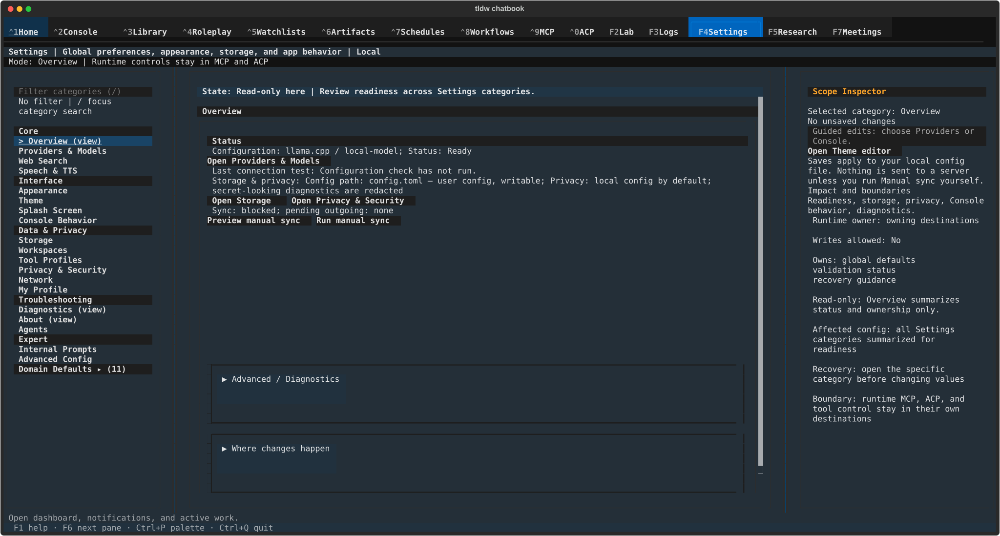
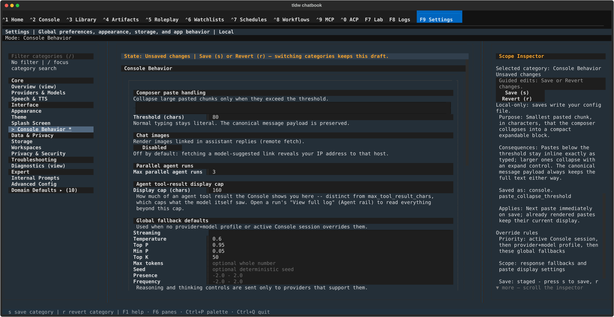

# Settings — Saved defaults for providers, appearance, storage, and app behavior.

## What this screen is for

Settings edits **saved defaults**. It is not a control room: nothing here starts
a run, drives a chat, or manages a live server — those stay on
[Console](console.md), MCP, and ACP. Reach for it to point the app at a provider
and model, pick its default voice, change how it looks, move where your
databases live, create workspaces, or repair a broken configuration.

Learn this before anything else: **five save models coexist here**, and every
category tells you which one it is using. The **State banner** pinned to the top
of the middle pane leads with a badge naming the model, so read the badge before
you change anything. Some pages need you to press **s**; some save the moment
you touch them; some are read-only and point you elsewhere.

## Getting there

- **Press F9 from anywhere** — it works even while a text field has focus.
  Settings is the last of thirteen destinations: the first ten get
  **Ctrl+1 … Ctrl+0**, and the remaining three get function keys — the nav
  bar labels say so ("F7 Lab", "F8 Logs", "F9 Settings").
- **Click "F9 Settings" in the nav bar.** On a narrow window a "More ▾"
  button appears at the right edge and opens a menu listing every
  destination — pick "F9 Settings" there; when everything fits, no button
  shows. Once Settings opens, the strip scrolls so the highlighted
  "F9 Settings" tab stays visible (task-4024).
- **Ctrl+P** → "Tab Navigation: Switch to Settings", or "Settings &
  Preferences: Open Settings Tab". Typing **stats** also surfaces the Settings
  entry, because "stats" is one of this screen's legacy route names — but the
  similarly-named "Settings & Preferences: Show Database Stats" opens the
  separate Statistics screen, not Settings.
- Other screens deep-link in with a category preselected — e.g. the app's own
  pointer, "Settings ▸ Diagnostics ▸ Run setup wizard."

## Layout tour

| Region | What it shows |
|---|---|
| **Header line** | "Settings \| Global preferences, appearance, storage, and app behavior \| Local". |
| **Mode strip** | "Mode: \<category\>" — on Overview only, it adds "\| Runtime controls stay in MCP and ACP". |
| **Category rail** (left, untitled) | A filter box ("Filter categories (/)"), a status line, then group headings — **Core**, **Interface**, **Data & Privacy**, **Troubleshooting**, **Expert** — with one row per category. The sixth heading is a button, "Domain Defaults ▸ (10)": that group is **collapsed by default** — click it (▸ becomes ▾) to show its ten rows; it opens itself while you are on one of them or while the filter has text. A row is marked **>** when it is the one you are on, **(view)** when the page is read-only, and **\*** when it holds unsaved changes. |
| **Detail pane** (middle, untitled) | The category's page, with the **State banner** pinned above it; everything below the banner scrolls. |
| **Scope Inspector** (right) | Who owns this setting and what saving it touches. Pinned at the top: "Selected category: \<title\>", "Unsaved changes" or "No unsaved changes", a one-line guided-action hint, the **Save (s)** and **Revert (r)** buttons (only on the seven draft categories — Overview shows **Open Theme editor** instead), and the note "Local-only: saves write your config file." Below: field guides and the "Runtime owner", "Writes allowed", "Owns", and "Recovery" rows. "▼ more — scroll the inspector" appears when there is more below. |
| **Footer** | This category's live shortcut hints (see [Keyboard & commands](#keyboard--commands)). |

Moving around: **click** a rail row, or **Tab** from the nav bar to drop focus
into the rail at **Overview**, then **j**/**k** or **↑**/**↓** to move and
**Enter** to open; Tab again walks into the detail pane's fields. **/** focuses
the filter from anywhere; its status line reads "No filter | / focus category
search", "Filter: \<text\> | N matches | Enter opens \<Category\> (\<Group\>)"
(singular "1 match" for a lone hit; when your text named a **setting**, the
target becomes "\<Category\> › \<Field\> (\<Group\>)" — e.g. "reduce motion"
promises "Appearance › Reduce motion (Interface)" — and with more than one
match a "| Next: \<second match with its scope\>" segment disambiguates, so
"theme" shows both the Theme category and Appearance's Theme setting), or
"Filter: \<text\> | 0 matches | Esc clears". **Enter** jumps to the top match
and clears the filter — landing focus **on the matched setting** when your text
named one (typing a category's own name just opens the category); **Esc** just
clears it. The filter knows every rendered setting's visible label, on every
category. Some pages also
carry jump buttons: **Open Providers & Models** and **Open Advanced Config** on
Privacy & Security, five guided-path chips on Advanced Config, and **Open Theme
editor** on Overview and Appearance.

## Features & controls

### How saving works — five models, eight badges

The State banner reads "State: \<badge\> | \<what saving affects\>". Above,
Console Behavior has an edited field, so it reads "State: Unsaved changes |
Save (s) or Revert (r) — switching categories keeps this draft." and the
Scope Inspector's buttons lose their "— no changes" suffix.

| Badge | What it means | Categories |
|---|---|---|
| **Draft — save with s** | Edits are held as a draft; press **s** (or **Save (s)**) to write them. | Providers & Models, Speech & TTS, Appearance, Console Behavior, Storage, Privacy & Security, [RAG](settings/rag.md) |
| **Draft — save/revert below** | Drafted, but the panel has its own **Save** and **Revert**. | Image Gen |
| **Auto-saved** | Written as you make each change; nothing to save. | Splash Screen |
| **Applies immediately** | Each action takes effect at once; no draft to save or revert. | Workspaces, [My Profile](settings/personal-context-profile.md) |
| **Managed in editor** | The editor's own **Apply** / **Save** / **Reset** persist things. | Theme |
| **Per-item Save/Reset** | Each item saves and resets on its own, inside its editor. | Internal Prompts |
| **Validate, then Save** | Save stays blocked until the current text validates. | Advanced Config |
| **Read-only here** | Nothing on the page changes anything; it names the destination that owns it. | Overview, Diagnostics, and the eight view-only Domain Defaults pages |

On the seven **Draft — save with s** categories the banner switches to "State:
Unsaved changes | Save (s) or Revert (r) — switching categories keeps this
draft." **That promise is literal:** no dialog warns you when you leave a
category or the screen with unsaved edits, because the draft is kept — the
**\*** in the rail is how you find it again. (Two exceptions: switching the
active RAG profile prompts — see [RAG defaults](settings/rag.md) — and leaving
Speech & TTS with edits raises its own save/discard dialog instead of keeping
the draft; see that section and Quirks.) A draft that fails
validation shows "State: Needs correction | \<the problem\>" and Save stays
blocked; with nothing pending, the buttons read **Save (s) — no changes** and
**Revert (r) — no changes**. Saving is always local: nothing leaves your machine
unless you run Manual sync from Overview yourself.

### The category map

| Group | Category | What it configures | Save model |
|---|---|---|---|
| Core | **Overview** (view) | Readiness, storage, privacy, Console behavior, diagnostics. | Read-only here |
| Core | **Providers & Models** | Default provider, model, and readiness shared with Console. | Draft — save with s |
| Core | **Speech & TTS** | Application-wide TTS provider, model, voice, format, speed, and per-provider setup. | Draft — save with s (leave prompts) |
| Interface | **Appearance** | Theme, density, and visual defaults shared with the app shell. | Draft — save with s |
| Interface | **Theme** | Full theme editor, custom colors, presets, and live preview. | Managed in editor |
| Interface | **Splash Screen** | Startup splash card selection, defaults, and preview gallery. | Auto-saved |
| Interface | **Console Behavior** | Rail presentation, composer behavior, and chat-flow defaults. | Draft — save with s |
| Data & Privacy | **Storage** | Config path, local databases, and file locations. | Draft — save with s |
| Data & Privacy | **Workspaces** | Create, rename, archive, and bind folders for agent file tools. | Applies immediately |
| Data & Privacy | **My Profile** → [own page](settings/personal-context-profile.md) | Personal and workspace context, interviews, agent proposals, authority, export, and removal. | Applies immediately |
| Data & Privacy | **Privacy & Security** | Secrets, encryption, redaction, local privacy boundaries, and the raw CLI host-access gate. | Draft — save with s |
| Troubleshooting | **Diagnostics** (view) | Config validation, logs, and troubleshooting signals. | Read-only here |
| Troubleshooting | **About** (view) | Version, license, and project links. | Read-only here |
| Troubleshooting | **Agents** | Named sub-agent definitions the Console supervisor can spawn. | Applies immediately |
| Expert | **Internal Prompts** | The system prompts the app uses internally (RAG, web search, agents, summarization, more). | Per-item Save/Reset |
| Expert | **Advanced Config** | Raw TOML view and expert configuration editing. | Validate, then Save |
| Domain Defaults | **RAG** → [own page](settings/rag.md) | Source search, retrieval, citations, snippets, and Console evidence defaults. | Draft — save with s |
| Domain Defaults | **Image Gen** | Image generation backend defaults for SwarmUI, OpenRouter, and other backend models. | Draft — save/revert below |
| Domain Defaults | eight **(view)** pages | Defaults owned by another destination — [table below](#domain-defaults--the-eight-view-only-pages). | Read-only here |

### Core — Overview

A read-out grouped as **Provider readiness**, **Storage**, **Privacy**,
**Server, sync, workspace, and handoff**, **Manual sync**, and **Where changes
happen** (one line each for what Settings, Console, MCP, ACP, and sync own),
plus three buttons.

| Button | What it does |
|---|---|
| **Switch Source / Server** | Opens "Switch Runtime Source": a **Server URL** box, a masked **API token** box, and **Test Connection**, **Use Local**, **Activate Server**, **Cancel**. Activating validates the URL, saves it, rebinds the app, and prepares the sync profile for this device; failures leave the previous source active and say so. |
| **Preview manual sync** | Lists pending Notes/Chat changes without sending anything. Needs an active server profile ("Manual Sync requires an active server profile."). |
| **Run manual sync** | Applies the previewed changes to the server — only when you press it. |

### Core — Providers & Models

The biggest page, and where to start.

| Group | What's in it |
|---|---|
| **Connect** | **Provider** (a searchable list grouped Cloud / Local / Custom, plus "Manual / custom provider"), **Manual** (only when you pick that), **Model** (suggests discovered names), and **Endpoint**, checked when you leave the box: "Enter a full http:// or https:// URL, e.g. http://127.0.0.1:9099/v1." |
| **Credentials** | **API key** (masked), **Clear saved key**, and **Env var**. A status line names the source in plain words — "API key source: local config key saved", "…: env:\<VAR\>", "…: missing; set \<VAR\> or paste a local key" — with the page's own advice: "Env vars are safer for shells, shared machines, and CI. This field stores the variable name, not the secret." |
| **Model discovery** | **Discover models** queries the endpoint, **Save selected** keeps the ones you tick, **Clear** drops the discovered list. |
| **Automatic refresh** | **Auto-refresh model lists on startup**, **Refresh after (hours):**, and per-provider **auto-refresh** / **save to config** boxes. These **write immediately** (not part of the draft) and govern a *startup* refresh, so a change shows up on the next launch. |
| **Generation defaults** (collapsed) | Around fourteen sampling and transport fields — temperature, top-p/top-k, token caps, seed, penalties, reasoning and thinking controls, streaming — that apply **only to the provider + model above**. Each states its range in its placeholder and its own error text; fields a provider doesn't support are hidden, not greyed. Global fallbacks live under Console Behavior. |

**Test Provider** — "Runs a local readiness check; URL-based local providers
also get a short live endpoint probe." It tests your *draft*, so you can check
before saving; the result ends "status=ready" or "status=blocked", and the probe
reports "reachable", "reachable (N models)", or a named failure ("timeout",
"connection refused", "HTTP \<status\>"). A successful **Save** deliberately
clears the previous verdict — run **Test Provider** again afterwards.

#### QwenCloud

Choose **QwenCloud** to reveal its provider-scoped **API mode** field. The two
saved values are exactly `responses` and `chat_completions`; **Responses** is
the default when the setting is absent. The embedded model and endpoint are
`qwen3.8-max` and
`https://dashscope-intl.aliyuncs.com/compatible-mode/v1`. Set
`DASHSCOPE_API_KEY`, or save a local key in this page. If your account provides
a workspace-specific regional compatible-mode endpoint, replace the shared
international (Singapore) base with that regional base. A compatible custom
HTTP(S) base is also allowed; QwenCloud never borrows another provider's URL
or credential.

The mode changes only QwenCloud's external wire protocol:

| Mode | Behavior and parameter limits |
|---|---|
| **Responses** (`responses`, default) | Re-sends canonical history on every turn; it does not send `previous_response_id` or conversation IDs and does not rely on provider-managed session state. It requests `store=false` where the compatible endpoint honors it, without making a claim about provider operational retention or caching. Supported generation fields are temperature, top-p, maximum output, and reasoning effort `none`, `minimal`, `low`, `medium`, `high`, `xhigh`, or `max`. Maximum output must be at least 16. Seed, penalties, response format, stop, `n`, log probabilities, verbosity, and reasoning summary are intentionally omitted. |
| **Chat Completions** (`chat_completions`) | Sends `preserve_thinking=false` because Chatbook does not store private `reasoning_content` for exact replay. It supports temperature, top-p/top-k, maximum completion tokens, seed, presence penalty, stop, text/JSON-object response format, `n`, log probabilities, and reasoning effort. Tool requests require `n=1`; min-p, frequency penalty, logit bias, user identifiers, reasoning summary, verbosity, Anthropic thinking fields, and prompt-caching fields are intentionally omitted. |

These lists are fail-closed: generic settings outside the selected mode's
allowlist are not forwarded. A model can still reject a supported mode or
parameter; Chatbook does not infer compatibility from its name.

For existing function tools in either mode, `tool_choice` may be unset,
`auto`, or `none`. Chatbook rejects `required`, a forced function/name, and
object-shaped choices before network I/O even if an upstream API supports
additional choices.

Existing Chatbook function tools use the ordinary Console agent runtime in
both modes, including structured continuation. QwenCloud-hosted built-in tool
types (such as hosted search or code execution) are excluded. **Discover
models** and startup refresh use the same disk TTL cache, configured fallback,
50-model selector cap, and full searchable catalog as other cloud providers;
an empty or failed refresh does not erase the configured/cached fallback.

Usage is still counted when the API returns it. If Chatbook has no verified
price for the selected QwenCloud model, the Console says **pricing unknown**;
it does not invent a dollar amount or treat unknown pricing as free.

Recovery is fail-closed:

- If **API mode** is invalid, sending and saving stay blocked. Open the field,
  choose **Responses** or **Chat Completions**, then save.
- If `api_settings.qwencloud` is not a TOML table, this page reports that the
  provider settings are invalid and cannot repair the table in place. Open
  **Advanced Config**, replace the malformed value with an
  `[api_settings.qwencloud]` table, set a valid `api_mode`, then **Validate Raw
  TOML**, **Save Raw TOML**, and **Reload Config** under Diagnostics.

#### Moonshot Kimi and Z.ai GLM

Choose **Moonshot** or **ZAI** without changing their saved provider identity.
They use Chat Completions only, so neither provider shows an **API mode**
selector.

| Provider | Fresh default | Credential | General endpoint | Reasoning effort values |
|---|---|---|---|---|
| Moonshot / Kimi | `kimi-k3` | `MOONSHOT_API_KEY` | `https://api.moonshot.ai/v1` | exactly `low`, `medium`, `high`, or `max` — accepted for the whole Kimi series (`kimi-k3-turbo`, `kimi-k2.6`, `kimi-latest`, …), not just the default; the Settings selector offers this curated list for every Kimi-series id |
| Z.ai / GLM | `glm-5.2` | `ZAI_API_KEY` | `https://api.z.ai/api/paas/v4` | exactly `none`, `minimal`, `low`, `medium`, `high`, `xhigh`, or `max` — accepted for GLM 5.2 and newer family releases; the Settings selector offers this curated list for every such release |

Moonshot can instead use the China base `https://api.moonshot.cn/v1` or a
validated custom compatible base. Z.ai's coding-only
`https://api.z.ai/api/coding/paas/v4` endpoint is not the general Chat default;
save the general endpoint or an intentional custom compatible gateway here.
Explicit historical IDs such as `moonshot-v1-128k` and `glm-4.5` remain
selected and editable. Settings does not guess their capabilities: its help
asks you to verify reasoning support instead of silently replacing the model.

The provider/model profile owns the visible reasoning selector. Versioned
Kimi models (K3, K2.x) do not receive legacy sampler fields — the API
rejects non-default values for them; their requests use the documented
common output/stop/format/function-tool subset. `kimi-latest` and the
historical Moonshot families retain their curated sampler surface. GLM 5.2
and newer accept their documented sampler and reasoning fields. For function tools, Moonshot accepts an unset choice,
`auto`, `none`, `required`, or an exact configured function selection; Z.ai
accepts only an unset choice or `auto`. Unsupported choices and values block
before network I/O.

Preserved Thinking is always on for the versioned Kimi reasoning family
(K3, K2.x — every member returns private reasoning; `kimi-latest` does not
and is excluded). Required Kimi reasoning and active or
restored GLM function-tool reasoning are kept in bounded assistant-owned
private continuation checkpoints. They are excluded from visible transcripts,
logs, summaries, ordinary text/Markdown exports, and usage records, but their
tokens still consume the shared context budget. Private-aware JSON/Chatbook
exports show a warning. Ordinary GLM chat clears prior thinking; no separate
Z.ai thinking selector is exposed.

**Discover models** uses authenticated `GET {base}/models` for Moonshot and a
best-effort request for Z.ai. Both reuse the exact normalized base and current
credential that chat would use. Failures keep configured/cached IDs, never
block an otherwise ready Z.ai chat, and never infer reasoning/tool support from
a discovered name. The selector stays capped at 50 while the model picker can
search the full cached list; the disk cache contains IDs and timestamps only.
Usage is recorded when returned. **Pricing unknown** means Chatbook has no
verified rate for that model, not that the call is free.

If Test Provider reports invalid settings, keep exactly one canonical
`[api_settings.moonshot]` or `[api_settings.zai]` table, remove normalized
duplicates, enter a nonblank model and an absolute HTTP(S) base without
credentials in the URL, then correct timeout/retry/streaming types in
**Advanced Config**. Test the draft again before saving.

### Core — Speech & TTS

Application-wide speech and text-to-speech defaults — which TTS provider
speaks by default, with what model, voice, output format, and speed — plus
per-provider setup. The pane opens with its scope in a banner: "You are
editing application-wide Speech & TTS defaults. The Speech Studio can keep
separate Studio preferences without changing these values.", and an **Open
Speech Lab** button, because this pane deliberately does *not* talk to any
server: "Settings reuses accepted in-memory observations only. Open Speech
Lab to test the server or refresh models and voices." Right below that
button, a note points at the two surfaces this pane does not manage: "Voice
profiles are managed in Lab > Speech > Voice Profiles — open Speech Lab,
above, to get there. Per-character voices are assigned in the Roleplay
character editor's Voice & Speech section, not here." Ordinary **Save**
"validates and persists locally. Use Speech Lab for connection tests,
discovery, generation, and playback."

| Card | What's in it |
|---|---|
| **Global defaults** | A status line ("Global default selection: … — effective source …"), the default voice-profile row, **Default TTS Provider** (audio.cpp, OpenAI, ElevenLabs, Kokoro, Chatterbox, Higgs, AllTalk), model policy (**Exact** with an "Exact model ID" box / **First available**), voice policy (**Exact** / **Server default**), **Output format** (MP3 / Opus / AAC / FLAC / WAV), and **Speed** ("0.25 - 4.0"). Capability limits are stated inline — "audio.cpp requires WAV output and speed 1.0." — and validated before Save. |
| **Provider setup** | A **Configure Provider** picker for editing any provider's setup without switching the default ("Configure Provider does not change the Default TTS Provider."). Credentials get Set / Replace / Clear dialogs: the editor "starts empty", stores "a local config secret; an environment variable is safer and more portable", and Clear "removes only the local-config value. It cannot change a process environment variable." |
| **Configuration inspector** | Read-out of the selected setup and where each value comes from ("Selected provider setup source: …"). |
| **Realtime engine** | "Optional low-latency voice engine for the Console's hands-free loop (Ctrl+Shift+H)." — a switch plus its engine fields; off means the record → transcribe → reply → speak pipeline is used as before. |

Buttons: **Save**, **Revert**, **Restore Non-secret Defaults** ("Non-secret
defaults restored in the draft; choose Save to persist them." — credentials
are left alone), **Open Speech Lab**.

**This is the one draft category that will not let you walk away silently.**
Leaving Speech & TTS with unsaved edits raises "Unsaved global Speech & TTS
settings — Save these application-wide changes before continuing, or discard
them?" with **Cancel** / **Discard and continue** / **Save and continue** —
the draft is resolved, not kept (see Quirks: the State banner still claims
otherwise, task-2708).

### Interface — Appearance

"Settings owns launch visual defaults. Open the Theme category for full theme
editing and deeper visual preview." **Global visual defaults** holds **Theme**,
**Palette limit (themes)**, **Web font size (px)**, and **Density**; **Motion
and scrolling** holds **Animations** and **Smooth scrolling**, each a button
whose label is its state (Enabled / Disabled). **Shared Library rail**
remembers whether the rail and destination Items panes are open. **Automatic
width** follows the 3:13 Library-to-canvas proportion, bounded to 24–34 cells.
**Custom width** enables explicit preferences (Library 24–48, Items 32–72);
ordinary layouts may temporarily shrink the rail to preserve 40 content cells,
and adaptive readers may collapse or prioritize panes. **Reset layout** restores
both panes open, automatic width, a 31-cell dormant Library preference, and
40-cell Items preferences. Below 64 columns, ordinary routes show either the
rail or canvas and provide **‹ Library** (or **< Library** with ASCII glyphs)
to return. Responsive compression, collapse, resizing, and mode changes are
temporary and never saved.
**Preview and boundary**
summarises what a save will touch. **Preview** applies runtime-safe values for
this session only and persists nothing ("Appearance preview applied for this
session only.") — it is the only way to see *this pane's* theme selection
without restarting.
Some launch-only fields are less immediate than they look (see
[Quirks](#quirks--troubleshooting)); Library layout changes refresh mounted
Library readers after a successful save.

### Interface — Theme

A full editor with its own save model. **Theme Library**: a **Name** box (live
for anything but the two Textual built-ins), a **Dark theme** On/Off toggle,
the **New / Clone / Delete / Export** row, and a **Themes** tree that lists
**Your themes** first and open, then **Built-in**, then the **Shipped themes**
catalog collapsed. Selecting a theme in the tree only loads it for editing; it
never changes the running app. **Actions** come next: **Apply** applies the
palette **for this session only** and writes nothing; **Save** stores it as a
TOML file in your profile's `themes/` folder and registers it at once, so it
appears in **Appearance** → **Theme** and in the palette's "Theme: Switch
to…" list without a restart (built-ins can't be overwritten, and saving over
another saved theme asks first); **Reset** reloads it as last saved; **Generate
from Primary** derives a palette from the primary colour; **Set as launch
default** writes the saved theme's name to `general.default_theme` so it
loads at startup. **Color Palette** is ten hex boxes, Primary through Error,
each with a swatch showing the colour and its hex; an invalid value marks the
box and the swatch reads "invalid". **Color Presets** fill the colour chosen in
the **Presets fill** box (Primary by default), by click or by focusing a swatch
and pressing Enter or Space. The **Live Preview** is a Console-shaped stub that
repaints as you type. **New** starts a theme from the palette currently loaded;
**Clone** does the same and appends `_copy` to the name. **Delete** removes a
saved theme after confirmation; **Export** writes it to your Downloads folder
and asks before replacing an earlier export.

### Interface — Splash Screen

Auto-saved. Under **Startup defaults**, **Default card**, **Enabled**, **Show
progress**, and **Skip on keypress** save the moment you change them, while
**Duration (s)** and **Animation speed (x)** save when you press **Enter** in
the box. **Gallery** lists every card with a live preview — **Play selected**
replays it, **Set as default** points the startup card at it. Everything here
takes effect **at the next launch**; the gallery preview is the only in-session
feedback.

**Skip on keypress** does what it says as of TASK-21591: with it on (the
default), any key pressed while the splash is up dismisses it and boot
continues immediately. That key is consumed by the splash and does nothing
else — pressing `F9` mid-splash skips to the app's normal startup screen
rather than jumping to Settings, and `ctrl+q` mid-splash dismisses the splash,
so quitting takes a second press. Turn the setting off and the splash always
runs its full **Duration (s)**, with keys routed exactly as before. Before the
fix the setting was inert: the splash was never focused, so it never saw a key.

### Interface — Console Behavior

Drafted, with one exception.

| Group | What's in it |
|---|---|
| **Model thinking presentation** | **Show model thinking** is on by default and applies immediately. Off hides displayable and **Thinking · unavailable** rows only; capture, persistence, replay policy, and token accounting continue unchanged. This is a device-local presentation preference, not a request for hidden chain-of-thought. |
| **Rail presentation** | **Stack collapsed rail labels** is off by default, so the collapsed handles read **Context ▸** and **Inspector** horizontally. Turn it on to use narrower three-column handles with the letters stacked upright. Save the category, then return to Console to see the new style; no restart is required. |
| **Status row placement** | An **Above composer**/**Below composer** toggle, above by default: where the Console status-chip row (Provider, Model, Tools, …) sits relative to the composer input. Writes immediately — no save, no draft — and takes effect when you return to Console. |
| **Composer paste handling** | An Enabled/Disabled toggle plus **Threshold (chars)** (1–100000): "Collapse large pasted chunks only when they exceed the threshold." Normal typing stays literal and the message actually sent is unchanged. |
| **Chat images** | One Enabled/Disabled toggle, off by default: "Render images linked in assistant replies (remote fetch)." and "Off by default: fetching a model-suggested link reveals your IP address to that host." Like Status row placement, **this control writes immediately** — pressing it takes effect at once ("Linked images in replies will now render."), with no save and no draft. |
| **Parallel agent runs** | **Max parallel agent runs**, read live, so it applies to the running app once saved. |
| **Agent tool-result display cap** | **Display cap (chars)** (20–2000): how much of a tool result Console shows *you*, which is not what the model saw. Open a run's "View full log" to read past it. |
| **Global fallback defaults** | The same ~14 sampling and transport fields as Providers & Models, but app-wide: "Used when no provider+model profile or active Console session overrides them." Precedence runs active session, then provider + model profile, then these. |
| **Background effects** | An Enabled/Disabled toggle, **Background effect** (None / Snow / Rain / Matrix), **Scope**, **Intensity**, and **Frame rate** (1–12). |

Two honest limits: fallbacks reach **new or default sessions**, not a
conversation already open; and "Workbench (advanced)" under **Scope** is
silently downgraded — "Workbench scope is not available in this build; using
Transcript scope."

The current conversation's **Thinking history replay** control lives in its
Console settings, because Auto/Include/Exclude is durable conversation state,
not a device presentation setting. **Save as default for new conversations**
copies that optional value to `console.thinking_history_policy_default` for
future conversations only. An effective **Required** state is derived from
mandatory provider continuation, is read-only, and never replaces the saved
optional default.

**Save (s)** and **Revert (r)** apply to every unsaved Console Behavior edit
together, including Rail presentation. A failed save keeps the draft and leaves
the active Console rail style unchanged.

### Data & Privacy — Storage

Eight path boxes under **Database paths (configured)** — **Base data
directory**, **ChaChaNotes DB**, **Prompts DB**, **Media DB**, **Research DB**,
**Writing DB**, **Library Collections DB**, **Workspaces DB** — each validated
on save with a message naming the field ("\<Field\> must end with .db, .sqlite,
or .sqlite3."). **Check Storage** verifies each draft path's parent folder
without touching anything: "Storage safety: no files were created, moved, or
reconnected." Two things to internalise:

1. **Saving here needs a restart** — "Storage defaults saved. Restart Chatbook
   to use saved paths." Settings writes the configuration only; it never moves a
   file, creates a folder, or reconnects a database.
2. **Configured is not active.** The boxes show what is configured; **Active
   files (resolved this session)** below them shows what this session is really
   using. They legitimately differ when a user profile is set, because a profile
   relocates the defaults under its own folder.

### Data & Privacy — Workspaces

No draft — every action applies as you make it, and each is reversible
("unarchive, rename again, or set active"). **Create workspace…** opens the
same creation dialog Console and Library use (see
[Console sessions, tabs & workspaces](console/sessions-tabs-workspaces.md#workspaces)
for the full walkthrough): a name prefilled "Workspace N", an optional list
of folders to bind (validated as each is added; **Browse…** opens a directory
picker), and a "Switch to this workspace" checkbox, checked by default —
here, unlike the old inline row, checking it activates the workspace
immediately on Create. Escape cancels the dialog with nothing created.
**Show archived** widens the list; each row shows the workspace's name and
its bound-folder count ("N folders"); click a row to open its card. A
folder you add that contains a `.SKILLS/` project skills folder is
annotated "— contains N project skill(s)" in the list, and creation is
followed by a chained import prompt for it — see
[Project skills](library/skills.md#project-skills-skills).

Folders are optional. Every Console Chat already has an independent private
temporary scratch space; a named Workspace with no folders remains fully usable
in scratch-only mode. Bind a folder only to let local file tools reach that
external directory. `[console] workspace_root` is retained for compatibility
outside this Console authority path and never grants a Console Chat access.

| Control | What it does |
|---|---|
| **Rename** | Renames the selected workspace (the box above it is pre-filled). |
| **Set active** | Makes it the active workspace; replaced by "This workspace is active." when it already is. Console doesn't switch immediately, but picks up the change and switches its own session to match the next time you visit it. |
| **Archive** | Confirms first: "Archive \<name\>? Its conversations stay saved and remain visible in Library; the workspace disappears from the switcher and the Console browser." |
| **Unarchive** | Returns an archived workspace to the list. It does *not* activate it. |
| **Add folder** / **Remove** | Bind a folder for agent file tools (new bindings are read-only), or unbind it. |
| **Allow write** / **Read-only** | Flips a bound folder's access; the button is labelled with the state you would move to. |

The built-in **Default** workspace has no controls at all: "Chats in the
built-in Default workspace use private scratch. Create a named Workspace only
to bind external folders."

### Data & Privacy — Privacy & Security

A read-out of your privacy posture: whether config encryption is on, whether
redaction is active, how many sensitive fields and provider secrets exist
(counted, never shown), how many referenced environment variables are actually
set, and your skill-trust status. **Check Privacy** recomputes it; **Open
Providers & Models** and **Open Advanced Config** are jump buttons. Encryption
and credentials remain read-only here; change secrets in Providers & Models or
Advanced Config.

The exception is the unmistakable **DANGER!!! RAW CLI HOST ACCESS** section.
**Allow raw CLI host access** drafts the persistent
`[console] raw_cli_permitted` unlock. Enabling it opens a warning that says the
command has the OS user's full filesystem, process, and network authority, may
read credential files despite the scrubbed environment, may leave detached
descendants after cleanup, and persists bounded command/output locally. Confirm
and **Save** before **Arm host access** becomes available. Arm asks again and
applies only to this launch; it is never written to config, and restart always
returns to Unlocked/not armed. **Disarm host access** is immediate. Saving the
unlock Off also disarms and starts bounded cleanup of any active raw command.

Unlocking and arming also makes the model-facing `shell_exec` tool eligible,
but only while local tools are enabled and the global model-tool kill switch is
Off. This is not a silent model grant: MCP ▸ Tools exposes raw shell as **Ask or
Off only**, and even a hand-edited Allow value is treated as Ask. Each model
command must show its full command and host-authority warning for **Run once**,
**Allow all raw shell commands for this Console session**, or **Deny**, unless
that live Console session already has the temporary session grant. Disarm,
locking raw CLI, shutdown, or restart clears every such grant. By contrast, a
physically typed `! ` command is a direct user action: once armed, it executes
without a model approval card and is not controlled by the model-tool kill
switch. See [Raw CLI: direct user commands and model `shell_exec`](console/agent-runs-and-tools.md#raw-cli-direct-user-commands-and-model-shell_exec)
for the complete boundary.

The same saved unlock also enables a separate **Arm Terminal** control. Its arm
is independent: arming Terminal does not arm raw `!` commands or model
`shell_exec`, and arming raw CLI does not arm Terminal. Both arms live only for
this Chatbook launch. Terminal starts a normal interactive account shell, so
startup profiles may restore secrets and commands despite the scrubbed initial
environment; shell history and other side effects can be written anywhere the
OS user can access. The selected Workspace or home directory is only the
starting directory, never confinement. Disarming Terminal immediately blocks
new input and begins bounded cleanup of every retained Terminal session.

Terminal is user-only: it never registers a model tool and its input, output,
screen, names, or paths are not added to conversation history, run logs,
exports, or reconnect state. There is no `terminal_armed` config field. Current
builds support POSIX PTYs on macOS/Linux and fail closed on Windows; a qualified
Windows boundary requires a new or superseding ADR.

### Troubleshooting — Diagnostics

Three buttons, no fields. Pressing **t** runs the first two together.

| Button | What it does |
|---|---|
| **Validate Config** | Parses your configuration file strictly and reports "valid" or "invalid - \<error\>", with secrets redacted out of the error. |
| **Reload Config** | Validates, then loads the file into the running app. |
| **Run Setup Wizard** | Re-runs the guided first-run setup — see [First run setup](First_Run_Setup.md). |

### Troubleshooting — About

The installed version, the license (AGPLv3+), a short feature list, and the
project links (GitHub, documentation, issues). Read-only. Clicking a link
opens it in your system browser and confirms with a notification; nothing on
this page writes config.

### Troubleshooting — Agents

Named sub-agent definitions the Console supervisor can spawn (Ctrl+2 ▸ ask it
to delegate). A definition is a reusable persona: a name, a one-line
description the supervisor reads when deciding who to delegate to, and
instructions — plus optional narrowing of tools and model. It opens with a
one-line scope note: "Named sub-agents the Console supervisor can spawn.
Changes apply immediately (stored in agent_runs.db, not config.toml) and take
effect on the next reply."

| Field | What it does |
|---|---|
| **Name** | A lowercase slug (letters, digits, hyphens; starts with a letter; max 64 chars). `general` and `subagent` are reserved and rejected. |
| **Description** | One line the supervisor reads when choosing a definition (max 200 chars). |
| **Instructions (appended to the sub-agent prompt)** | **Your text is added to, not swapped for, the built-in sub-agent prompt** — the child still starts from the same base identity every sub-agent gets, with your instructions appended after it. |
| **Model override** | Empty inherits the parent's model. A non-empty value replaces the model on the **same provider/endpoint** the parent used — it does not switch providers, and nothing here validates the string against that provider's model list. |
| **Tools (comma-separated; empty = inherit all; names only narrow, never grant)** | Empty means the sub-agent inherits every tool the parent could use. A non-empty list can only remove names from that inherited set — an intersection, never a union — so listing a tool the parent doesn't have access to has no effect. The always-available runtime control tools (`spawn_subagent`, `find_tools`, and similar) aren't ordinary catalog tools and are silently dropped from whatever you type here. If every name you list turns out unavailable (typo'd, or simply not one the parent has), the narrowing can reach zero — the child spawns with no tools at all rather than falling back to the inherited set. |
| **Enabled** | Off keeps the definition saved but out of the supervisor's roster and the spawn schema. |

Buttons: **New** (clears the form for a fresh definition), **Save** (create or
update, depending on whether a definition is selected in the list), **Delete**
(soft-deletes the selected one — re-creating or re-enabling it here restores
it). A status line under the buttons reports the outcome, including any
validation error verbatim.

**This is not a draft category.** Unlike the six "Draft — save with s"
categories, Agents writes straight to the database on every Save or Delete —
there is no **s**/**r** cycle and nothing to revert. Definitions are read once
per conversation turn, so an edit takes effect on the **next** reply, never
the one already streaming.

Past around 20 **enabled** definitions the status line adds a warning —
"N enabled definitions — every one rides the spawn schema each turn; consider
disabling some." — because every enabled definition's name and description
ride the model's context on every turn; it's advisory, not a hard limit.
Needs a saved (non-temporary) profile database — an in-memory or unsaved
session shows a notice instead of the panel.

### Expert — Internal Prompts

The system prompts the app uses internally. Filter with "Search prompts…", then
press a prompt to open its editor. A row can carry **[● customized]** (you have
overridden it) or **[⟳ default changed]** (the shipped default moved *under*
your override — worth opening to compare against "Shipped default"). The editor
shows the description, required placeholders, where it applies, the text, a
preview, and the shipped default, with **Save**, **Reset to default**, and
**Cancel**. Each prompt saves and resets on its own.

### Expert — Advanced Config

Raw configuration editing, gated: "Raw TOML bypasses guided validation and
should be used only for expert edits." Five chips at the top — **Providers &
Models**, **Console Behavior**, **Storage**, **Privacy & Security**,
**Diagnostics** — jump to the guided page instead, and a status line tracks
state: "Last validated: not validated" / "current text" / "stale after edits".

| Button | What it does |
|---|---|
| **Validate Raw TOML** | Checks the editor text. |
| **Load Backup** | Loads the backup copy into the editor **without saving it** — a preview you still have to validate. Pressing it authorizes that request to replace the text already in the editor. If you press it again before the earlier read finishes, only the newest request can change the editor, result line, or validation state; older results and errors are ignored. Successful repeats report the ordinary loaded-preview result rather than claiming unsaved edits were kept. If you carry on typing after the newest press, your edits still win: the result line reads "not applied — the editor changed while the backup was loading; unsaved edits were kept". Press **Load Backup** again once you have finished typing. |
| **Save Raw TOML** | Blocked until the text you are looking at is the exact text that last validated. Writes atomically, keeping a `.bak` backup of the previous file, then reloads. |

### Domain Defaults — Image Gen

Drafted, but with its **own Save and Revert buttons** at the bottom of the panel
rather than the inspector pair.

| Group | What's in it |
|---|---|
| **Backends** | Every backend with a Configured / Not configured badge, an On/Off box, a **★ Default** marker, and a **Test** button that probes the values currently in the form (edited-but-unsaved counts) and writes nothing — the badge becomes "Reachable", "Reachable (auth unverified)", "Auth failed", "Binary found", or a named "Unreachable: …". Only one probe runs at a time. |
| **Backend settings** | A collapsible section per backend: base URL, default model, timeout, and a key or token where one applies. Non-secret boxes show the value that will actually be used as their placeholder, so an empty box never hides anything. Secret boxes are masked, never pre-filled, name their source below ("env: \<VAR\>", "local config key saved", "keyring", "missing"), and each has a **Clear** that removes the locally saved key while leaving environment and keyring sources intact. |
| **Generation defaults** | Batch size, variant caps, and the context-LLM options. |
| **Style templates** | A read-only count in this version. |

### Domain Defaults — the eight view-only pages

Eight categories exist so the destination is findable from Settings. Each is a
read-only page saying "Settings mode: View only - shows current defaults and
status" and "Writes allowed: No - change this in \<Destination\> instead", plus
a note on what would have to exist before Settings could own a default.

| Category | Owner destination | What is still missing |
|---|---|---|
| **Artifacts** (view) | [Artifacts](artifacts.md) 🚧 | Export/default controls wait on a persisted preference contract. |
| **Roleplay** (view) | [Roleplay & Chat Dictionaries](roleplay-chat-dictionaries.md) | Display/browsing preferences only — never which user profile is active. |
| **Skills** (view) | Skills — now [Library ▸ Skills](library/skills.md) | Defaults wait on a persisted import/attach policy. |
| **Schedules** (view) | [Schedules](schedules.md) 🚧 | Waits on a dedicated settings adapter. |
| **Watchlists** (view) | [Watchlists](watchlists.md) 🚧 | Waits on persisted polling/notification settings. |
| **Workflows** (view) | [Workflows](workflows.md) 🚧 | Waits on a persisted execution-safety contract. |
| **MCP Defaults** (view) | [MCP](mcp.md) 🚧 | Server-first defaults only; tools stay in MCP. |
| **ACP Defaults** (view) | [ACP](acp.md) 🚧 | Waits on a persisted runtime/session preference contract. |

## Common tasks

1. **Point the app at a provider and check it works.** Open **Providers &
   Models**, pick your **Provider**, type or discover a **Model**, then fill in
   **Endpoint** for a local server or **API key** (or **Env var**) for a cloud
   one. Press **Test Provider** *before* saving — it tests your draft. When the
   result ends "status=ready", press **s**, then run **Test Provider** once
   more: saving clears the previous verdict on purpose.
2. **Change what the app sounds like.** Open **Speech & TTS**, pick a
   **Default TTS Provider**, set model and voice policy (or an exact ID),
   choose **Output format** and **Speed**, then press **s** or **Save**.
   Saving only validates and stores the defaults — to actually hear a voice,
   test a connection, or refresh a provider's model list, press **Open Speech
   Lab**; this pane never contacts a server.
3. **Change the theme and make it stick.** Open **Appearance**, choose a
   **Theme**, press **Preview** for a look (this session only), then **s** to
   save the draft — the theme is applied at the next launch. If you built the
   theme yourself in the **Theme** editor, press **Save** there and then **Set
   as launch default**; saved themes also appear in **Appearance** → **Theme**
   as "<Name> (saved)".
4. **Move a database to a new location.** Open **Storage**, edit that database's
   path box, and press **Check Storage** — you want "ready", not "missing,
   create before restart" (Settings will not create the folder for you). Press
   **s**; the banner confirms "Storage defaults saved. Restart Chatbook to use
   saved paths." Move the file yourself, then restart: until you do, the app
   keeps using the old one, which is what **Active files (resolved this
   session)** is showing you.
5. **Create a workspace and optionally give an agent a folder.** Open **Workspaces** and
   press **Create workspace…**. In the dialog, keep the prefilled name (or
   type your own). Press **Create** immediately for a scratch-only Workspace,
   or enter a folder path and press **Add folder** first — it is validated and
   bound read-only. Leave "Switch to this workspace" checked to activate the
   new Workspace in the same step. If you added a folder and the agent needs
   to write there, open the Workspace card and press **Allow write** on that
   folder's row. Every step applies immediately; nothing to save.
6. **Repair a configuration you broke.** Open **Diagnostics** and press
   **Validate Config** — the error names the problem, with secrets redacted. Fix
   it in the guided pages if you can. If not, open **Advanced Config**, press
   **Load Backup** to pull the previous `.bak` copy into the editor, press
   **Validate Raw TOML**, and only then **Save Raw TOML** (disabled until the
   text on screen is the text that validated). Finish with **Reload Config** on
   Diagnostics if the app has not picked it up.
7. **Re-run the first-run setup.** Open **Diagnostics** and press **Run Setup
   Wizard** — see [First run setup](First_Run_Setup.md).

## Keyboard & commands

Screen-level keys only — global keys live in the [guide index](index.md).

**Read this first:** these are bare letter keys, so **a focused text box
swallows them** — typing `s` in a field types an "s". The app's answer is to
**press Esc first**, which releases the field; the footer even relabels its
hints as "Esc, s" while a field has focus. Only then do the letters work.

| Key | Action |
|---|---|
| s | Save this category — only on the seven **Draft — save with s** categories |
| r | Revert this category — same seven. On Theme, Splash Screen, Internal Prompts, and Workspaces it answers "Use the editor's own buttons for this category" |
| t | Run this category's check. The footer names the real verb: **test provider**, **validate config**, **check storage**, **check privacy**, **preview appearance**, **check index**. Only Providers & Models, Diagnostics, Storage, Privacy & Security, Appearance, and RAG have one |
| / | Focus the category filter from anywhere on the screen. Pressing it again while the filter has focus re-selects the text rather than typing a slash |
| Esc | Release a focused field; or, when the filter has text, clear the filter |
| Tab | From the nav bar, drop focus into the rail at **Overview**; then walk on into the detail pane |
| j / k / ↑ / ↓ | Move up and down the rail (while a category row has focus) |
| Enter | Open the focused category; in the filter, jump to the top match; on an action button, press it |
| a / c / b | RAG only — set active, clone, backfill. See [RAG defaults](settings/rag.md) |

**F6 does nothing on this screen.** Settings has no pane-cycle target, so it
only shows a notice — use **Tab**, the rail keys, or the mouse. **F1** opens
the active category's help: a "How this category works" section (its save
contract, scope, runtime owner, whether writes are allowed, boundary, and
recovery — the same contract the State banner and Scope Inspector carry)
followed by the category's working shortcut keys, with the RAG-only keys shown
only while on RAG. Every category has a non-empty help body; one without
category-specific keys says so.

Command palette (**Ctrl+P**) entries that land here: "Settings & Preferences:
Open Settings Tab" opens the screen; "Settings & Preferences: Show Database
Stats" opens database size and statistics; "Setup: Run setup wizard…" is the
same wizard as the Diagnostics button; and "Settings & Preferences: Open Config
File" **only tells you where the file is** ("Config file location: …") — it does
not open an editor.

## Related settings & docs

- Child page: **[RAG defaults](settings/rag.md)** — profiles, the built-in
  read-only trap, the index and **Backfill**, and the `a`/`c`/`b` keys.
- Screens these defaults feed: [Console](console.md) (provider, model, sampling
  fallbacks, paste handling, linked images, parallel runs), [Library](library.md)
  and [Library ▸ Search & RAG](library/search-and-rag.md) (retrieval defaults),
  [First run setup](First_Run_Setup.md).
- `config.toml` sections these pages write: `[chat_defaults]` (provider, model,
  global sampling fallbacks), `[api_settings.<provider>]` (endpoint, key,
  env-var name, per-model generation profiles), `[model_catalog]` (automatic
  refresh), `[app_tts]` (Speech & TTS defaults, per-provider setup, and the
  default voice profile), `[general]` + `[appearance]` + `[web_server]`
  (Appearance), `[splash_screen]`, `[console]` and `[chat.images]` (Console
  Behavior, including `show_model_thinking` and the new-conversation
  `thinking_history_policy_default`; `[console] raw_cli_permitted` is the
  Privacy & Security raw CLI unlock), `[database]` (Storage),
  `[image_generation]`,
  `[internal_prompts]`, `[encryption]`, and `[rag.service]` (which RAG profile
  is active). Workspaces are the exception — they live in their own database,
  not in `config.toml`.

## Quirks & troubleshooting

- **"s" typed a letter instead of saving.** A text box had focus. Press **Esc**,
  then **s**. The footer tells you this is happening: its hints read "Esc, s".
- **"s" did nothing at all.** That category is not one of the seven draft
  categories — read the State banner badge and use the control it names.
- **Four Appearance fields are less than they appear.** **Animations** and
  **Smooth scrolling** are saved but **nothing in the app reads them yet**.
  **Palette limit (themes)** is read only by a legacy window, not the command
  palette. **Web font size (px)** applies to the browser terminal when you serve
  the app over the web — it changes **nothing** in the TUI.
- **The theme didn't change after saving.** The Appearance **Theme** field is
  applied once, at launch; **Preview** shows it this session. Two other routes
  do apply a theme immediately: the Theme editor's **Apply** (this session
  only), and the command palette's "Theme: Switch to \<name\>", which applies
  it *and* rewrites the launch default. A theme you **Save** in the Theme
  editor is stored and registered but not applied — press **Set as launch
  default** there, or pick it in **Appearance**.
- **A splash change had no effect.** All splash settings are startup-only.
  Separately, **Animation speed (x)** is saved to a place this page does not
  read back, so it looks unchanged when you return (backlog task-2706).
- **Privacy & Security cannot edit encryption or credentials.** Those rows are
  still read-only. Its raw CLI unlock is the deliberate exception: it uses the
  category's Save/Revert draft, while Arm/Disarm changes process memory only.
- **"Open Config File" didn't open anything.** By design — that palette command
  only prints the file's location.
- **A Console setting didn't take.** Global fallbacks reach *new or default*
  sessions; a conversation already open keeps what it resolved, and a session or
  provider+model setting outranks them. Rail presentation is different: after a
  successful Save, return to a freshly opened Console screen to see it; no app
  restart is required.
- **Save Raw TOML is greyed out.** You edited the text after validating it.
  Press **Validate Raw TOML** again — until you do, the status line says "Last
  validated: stale after edits".
- **A category still shows "\*" after you left it.** Deliberate: drafts survive
  switching categories and leaving the screen, and no dialog warns you, so the
  **\*** is the reminder. Go back and press **s** or **r**. (Speech & TTS is
  the exception — it never leaves a **\*** behind, because leaving it forces
  the save/discard choice.)
- **Speech & TTS's State banner promises what the category won't do.** While
  its draft is dirty the shared banner reads "…switching categories keeps this
  draft." — but leaving Speech & TTS raises "Unsaved global Speech & TTS
  settings" and the draft is saved or discarded, never kept (backlog
  task-2708).
- **The Scope Inspector looks truncated.** Scroll it — "▼ more — scroll the
  inspector" at the bottom means there is more below.

—
*Verified against dev @ 39232202b — 2026-08-06. Core — Speech & TTS's
scope-banner note refreshed against dev @ 7f23e0263 — 2026-08-07 (voice
profiles slice 4: added pointer-note copy verbatim from
`speech_tts_settings_panel.py`; not re-driven live, the rest of this page's
content unchanged from the prior stamp). Troubleshooting — Agents section
added against dev @ 3dd3e7431 — 2026-08-09 (fleet PR-1: driven live —
created, selected, edited, and disabled a real definition in a scratch
profile, fixing a rendering defect on the Name/Description/Model
override/Tools fields found along the way; the rest of this page's content
unchanged from the prior stamp).*
*Interface — Theme rewritten against fix/theme-editor-ux @ 9997d086b4 —
2026-09-04 (tasks 31250-31259, 31279 and 31280: driven live in a scratch profile — a theme
saved in the editor now registers at once, appears in Appearance → Theme and
the palette, and loads at the next launch via **Set as launch default**;
swatches, the Dark toggle and the preset target are painted; Actions sit above
the palette; the rest of this page's content unchanged from the prior stamp).*
*Verified against dev @ 642567627 — 2026-08-10 (task-4024: driven live at
80 and 120 cols — opening Settings from the nav bar's "More ▾" overflow
menu now leaves the strip scrolled so "F9 Settings" is visible and
highlighted, and it stays that way; the rest of this page's content
unchanged from the prior stamp).*
*Console Behavior — Status row placement added against TASK-17652 —
2026-08-17 (mounted-settings test drives the toggle both ways and reads
the live config; headless Console probes verified both placements render;
the rest of this page's content unchanged from the prior stamp).*
*Verified against feat/workspace-create-modal @ 64a07a3d7 — 2026-08-17
(task-18704: Data & Privacy ▸ Workspaces' inline "type a name, press
Create" row is retired — **Create workspace…** now opens the same shared
creation dialog Console and Library use, with a prefilled name, optional
validated folder bindings, and a "Switch to this workspace" checkbox that
here defaults to activating the workspace on Create, unlike the old
inline flow; the walkthrough's step 5 updated to match; the rest of this
page's content unchanged from the prior stamp).*
*Verified against feat/project-skills-import @ 964cb04df — 2026-08-18
(task-18705: a bound folder containing `.SKILLS/` now annotates its row
"— contains N project skill(s)" in the creation dialog, followed by a
chained import prompt after Create; the rest of this page's content
unchanged from the prior stamp).*
*Verified against feat/task-18310-activation-seam @ c9892736f — 2026-08-20
(task-18310: **Set active**'s row gained a one-sentence note that Console
doesn't switch immediately but reconciles its own session against the
registry the next time you visit it; the rest of this page's content
unchanged from the prior stamp).*
*Providers & Models — Moonshot Kimi / Z.ai GLM rows updated against
TASK-19170 — 2026-08-20 (the reasoning-effort selector and the Preserved
Thinking note now follow the family predicates: any Kimi-series id gets the
curated `low/medium/high/max` list and any GLM ≥ 5.2 release the full GLM
list, verified by mounted-settings tests driving `kimi-k2.6` and `glm-5.3`;
preserved thinking is documented for the versioned Kimi family per wire
probes, with `kimi-latest` excluded; the rest of this page's content
unchanged from the prior stamp).*
*Advanced Config — Load Backup's row updated against TASK-19559 and
TASK-19872 — 2026-08-29 (backup loads are latest-request-wins while preserving
the original protection for typing after the newest press. Deterministic,
bounded worker-start and callback-return handshakes verified both overlapping
completion orders, a newest-success-then-stale-old-error sequence, ordinary
serial repetition, and genuine typing; removing the ordering guard or typing
guard made its respective cases fail. The rest of this page's content is
unchanged from the prior stamp).*
*Interface — Splash Screen's row updated against TASK-21591 — 2026-08-25
(**Skip on keypress** shipped default-true and could not fire: `SplashScreen`
is a `Container`, Textual routes a key to the focused widget and bubbles it
upward, and nothing focused the splash. It now takes focus when the skip is
enabled, and consumes the dismissing key so a navigation key pressed during
startup cannot also act on the app being booted. Verified in a real terminal,
not only under Pilot: against a 25 s splash, Space 23 ms after the first
painted frame dismissed it and boot completed; `F9` at the same moment
dismissed it and left the app on Home, not Settings; and with the setting off
the same key left the splash up for its full 20 s. The rest of this page's
content unchanged from the prior stamp.)*

*Verified against feat/settings-ux-critique-burndown @ c38314a26 — 2026-08-28
(TASK-23104/23108/23109/23110: the State banner renders exactly once per
category with exactly one "State:" segment (domain pages and Overview used to
show it doubled and self-colliding); unexpected model-discovery and RAG
backfill failures now surface plain-language status/toast copy with a next
step instead of raw exception text; F1 help gained the per-category contract
body described above; and "/" search gained setting-level coverage with the
scoped "Enter opens … (Group)" / "Next: …" echo line. Driven live headless:
"reduce motion" surfaced "Appearance › Reduce motion (Interface)" and Enter
landed focus on the control; "theme" echoed both scoped matches. The rest of
this page's content unchanged from the prior stamp.)*
