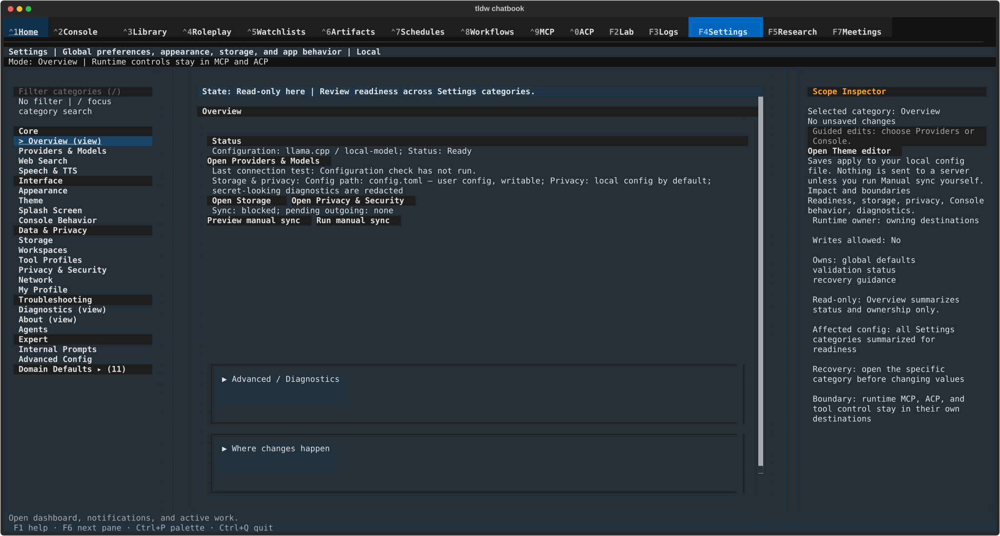
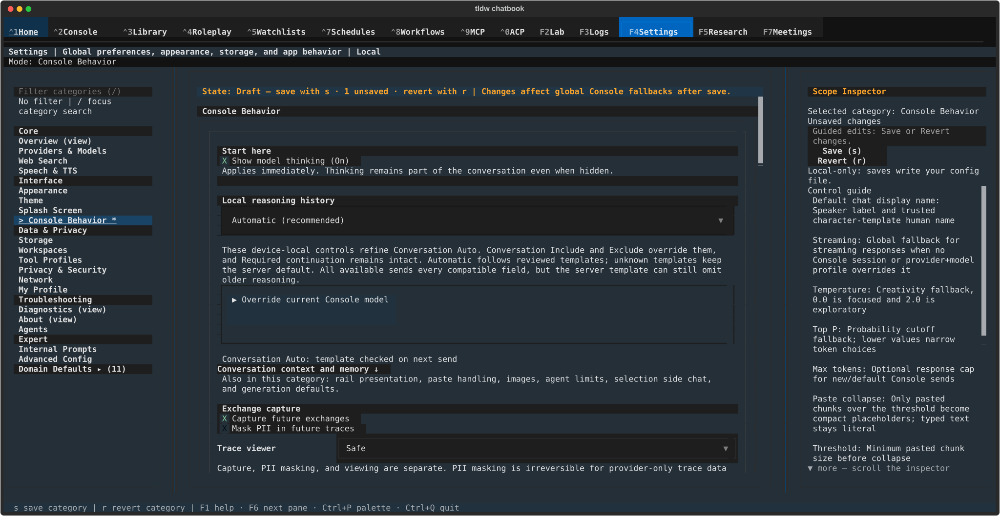

# Settings — Saved defaults for providers, appearance, storage, and app behavior.

## What this screen is for

Settings edits **saved defaults**. It is not a control room: nothing here starts
a run, drives a chat, or manages a live server — those stay on
[Console](console.md), MCP, and ACP. Reach for it to point the app at a provider
and model, pick its default voice, change how it looks, move where your
databases live, create workspaces, or repair a broken configuration.

Learn this before anything else: **five save models coexist here**, and every
category tells you which one it is using. The **State banner** pinned to the top
of the middle pane leads with a badge naming the model, so read the badge before
you change anything. Some pages need you to press **s**; some save the moment
you touch them; some are read-only and point you elsewhere.

## Getting there

- **Press F4 from anywhere** — it works even while a text field has focus.
  Settings is the thirteenth of fifteen destinations: the first ten get
  **Ctrl+1 … Ctrl+0**, and the remaining five continue onto the function-key
  row from its left end — **F2**, **F3**, **F4**, **F5**, then **F7** (F6 is
  reserved for pane cycling) — the nav bar labels say so ("F2 Lab", "F3
  Logs", "F4 Settings", "F5 Research", "F7 Meetings").
- **Click "F4 Settings" in the nav bar.** On a narrow window a "More ▾"
  button appears at the right edge and opens a menu listing every
  destination — pick "F4 Settings" there; when everything fits, no button
  shows. Once Settings opens, the strip scrolls so the highlighted
  "F4 Settings" tab stays visible (task-4024).
- **Ctrl+P** → "Tab Navigation: Switch to Settings", or "Settings &
  Preferences: Open Settings Tab". Typing **stats** also surfaces the Settings
  entry, because "stats" is one of this screen's legacy route names — but the
  similarly-named "Settings & Preferences: Show Database Stats" opens the
  separate Statistics screen, not Settings.
- Other screens deep-link in with a category preselected — e.g. the app's own
  pointer, "Settings ▸ Diagnostics ▸ Run setup wizard."

## Layout tour

| Region | What it shows |
|---|---|
| **Header line** | "Settings \| Global preferences, appearance, storage, and app behavior \| Local". |
| **Mode strip** | "Mode: \<category\>" — on Overview only, it adds "\| Runtime controls stay in MCP and ACP". |
| **Category rail** (left, untitled) | A filter box ("Filter categories (/)"), a status line, then group headings — **Core**, **Interface**, **Data & Privacy**, **Troubleshooting**, **Expert** — with one row per category. The sixth heading is a button, "Domain Defaults ▸ (10)": that group is **collapsed by default** — click it (▸ becomes ▾) to show its ten rows; it opens itself while you are on one of them or while the filter has text. A row is marked **>** when it is the one you are on, **(view)** when the page is read-only, and **\*** when it holds unsaved changes. The row with keyboard focus also shows a thick bar at its left edge, in the theme's primary text colour. |
| **Detail pane** (middle, untitled) | The category's page, with the **State banner** pinned above it; everything below the banner scrolls. |
| **Scope Inspector** (right) | Who owns this setting and what saving it touches. Pinned at the top: "Selected category: \<title\>", "Unsaved changes" or "No unsaved changes", a one-line guided-action hint, the **Save (s)** and **Revert (r)** buttons (only on the seven draft categories — Overview shows **Open Theme picker** instead), and the note "Local-only: saves write your config file." Below: field guides and the "Runtime owner", "Writes allowed", "Owns", and "Recovery" rows, one after another with no blank line between them. "▼ more — scroll the inspector" appears when there is more below. Focusing a field scrolls the inspector to that field's whole Focused field guide, and resizing the window keeps the guide in view. From 134 columns wide the inspector is at least 36 columns (below about 186 columns the detail pane gives up the width); on a narrower window the detail pane keeps its width first, and at 100 columns or fewer the inspector is hidden. |
| **Footer** | This category's live shortcut hints (see [Keyboard & commands](#keyboard--commands)). |

Moving around: **click** a rail row, or **Tab** from the nav bar to drop focus
into the rail at **Overview**, then **j**/**k** or **↑**/**↓** to move and
**Enter** to open; Tab again walks into the detail pane's fields. **/** focuses
the filter from anywhere; its status line reads "No filter | / focus category
search", "Filter: \<text\> | N matches | Enter opens \<Category\> (\<Group\>)"
(singular "1 match" for a lone hit; when your text named a **setting**, the
target becomes "\<Category\> › \<Field\> (\<Group\>)" — e.g. "reduce motion"
promises "Appearance › Reduce motion (Interface)" — and with more than one
match a "| Next: \<second match with its scope\>" segment disambiguates, so
"theme" shows both the Theme category and Appearance's Theme setting), or
"Filter: \<text\> | 0 matches | Esc clears". **Enter** jumps to the top match
and clears the filter — landing focus **on the matched setting** when your text
named one (typing a category's own name just opens the category); **Esc** just
clears it. The filter knows every rendered setting's visible label, on every
category. Some pages also
carry jump buttons: **Open Providers & Models** and **Open Advanced Config** on
Privacy & Security, five guided-path chips on Advanced Config, **Open Theme
editor** on Overview, and **Open Theme** (which lands on the Theme picker) on
Appearance.

## Features & controls

### How saving works — five models, eight badges

The State banner reads "State: \<badge\> | \<what saving affects\>". Unsaved
edits keep the badge and add a count. Above, Console Behavior has one edited
field, so it reads "State: Draft — save with s · 1 unsaved · revert with r |
Changes affect global Console fallbacks after save." and the Scope
Inspector's buttons lose their "— no changes" suffix. The count is the number
of fields that differ from their saved values: it goes up as you edit and down
when you set a field back by hand.

| Badge | What it means | Categories |
|---|---|---|
| **Draft — save with s** | Edits are held as a draft; press **s** (or **Save (s)**) to write them. | Providers & Models, Web Search, Speech & TTS, Appearance, Console Behavior, Storage, Privacy & Security, [RAG](settings/rag.md) |
| **Draft — save/revert below** | Drafted, but the panel has its own **Save** and **Revert**. | Image Gen |
| **Auto-saved** | Written as you make each change; nothing to save. | Splash Screen |
| **Applies immediately** | Each action takes effect at once; no draft to save or revert. On Theme, **Use** / **Try** / **Revert** and, for your own themes, **Rename** / **Delete** / **Export** act at once from the picker, and **Save** / **Save as…** in the editor (behind **Clone** / **New** / **Edit**) store a theme file. | Workspaces, [My Profile](settings/personal-context-profile.md), Theme |
| **Per-item Save/Reset** | Each item saves and resets on its own, inside its editor. | Internal Prompts |
| **Validate, then Save** | Save stays blocked until the current text validates. | Advanced Config |
| **Read-only here** | Nothing on the page changes anything; it names the destination that owns it. | Overview, Diagnostics, and the eight view-only Domain Defaults pages |

On the **Draft — save with s** categories an edit turns the banner into
"State: Draft — save with s · 2 unsaved · revert with r | \<what saving
affects\>". Providers & Models leaves out "revert with r", because its scope
fills the row; Speech & TTS shows its leave rule in place of the scope;
Image Gen and Video Gen keep "Draft — save/revert below"; Advanced Config
reads "State: Validate, then Save · 1 unsaved | Draft kept when you leave; use
raw editor controls.". Switching categories keeps the draft: no dialog warns
you when you leave a category or the screen with unsaved edits — the **\*** in
the rail is how you find it again. (Two exceptions: switching the
active RAG profile prompts — see [RAG defaults](settings/rag.md) — and leaving
Speech & TTS with edits raises its own save/discard dialog instead of keeping
the draft; see that section and Quirks.) A draft that fails
validation keeps its badge and count and names the problem — "State: Draft —
save with s · 1 unsaved | Needs correction: \<the problem\>" — and Save stays
blocked; with nothing pending, the buttons read **Save (s) — no changes** and
**Revert (r) — no changes**. Saving is always local: nothing leaves your machine
unless you explicitly run a network action, such as Manual sync from Overview
or **Test saved settings** in Web Search.

### Web Search: first setup and additional backends

Open **F4 → Web Search** under **Core**, or filter categories by a provider
name such as Brave, Serper, or SearXNG.

1. Choose **Default search backend**. Basic and deep search use this saved
   preference; a per-search override remains temporary. Selecting a default
   also opens that backend's fields.
2. Enter the required API key, IDs, or SearX instance URL. Saved secrets stay
   hidden: an empty replacement field keeps the saved key. **Clear local…**
   stages removal. The source line identifies environment variables, which
   take precedence over local values and are not removed by Clear.
3. **Save (s)** writes all staged Web Search changes together. At compact
   terminal sizes, scroll to **Save all search settings**. While typing in an
   input, Tab out before using the single-letter shortcut. **Revert (r)** asks
   before discarding the category's draft. Provider and category switching keep
   drafts, including masked replacements. Leaving and reopening Settings also
   preserves **Configure backend** and an in-progress save. Reopen Web Search
   to see its saved or failed result; a failed write keeps the draft. If the
   result says **Saved to disk**, restart the app before searching: the file was
   written, but runtime refresh failed.
4. Read the local setup status, then choose **Test saved settings**. The test
   sends **tldw chatbook** to the configured backend and may use API quota. It
   does not generate an AI answer. Save or revert all Web Search edits before
   testing. A successful test applies only to that saved setup; edits or
   navigation invalidate the displayed result. Request retries can extend the
   test duration. If you leave while a test is running, it finishes in the
   background and its result is discarded. A second test remains unavailable
   until the earlier request finishes.

For experienced users, **Configure backend** prepares any of the ten
integrations without changing the default. Incomplete setups can be saved;
the page continues to identify missing requirements. No automatic provider
fallback occurs. A successful save does not prove authentication or quota.

DuckDuckGo needs the `websearch` optional dependencies and no API key.
SearX/SearXNG needs an instance that permits JSON searches; local and LAN
endpoints are supported. Bing is retained for legacy configuration but its
retired API cannot pass setup. Google Custom Search is restricted to existing
customers, and the current Kagi integration uses its deprecated v0 API. The
page links to each backend's setup guide and displays these restrictions.

### The category map

| Group | Category | What it configures | Save model |
|---|---|---|---|
| Core | **Overview** (view) | Readiness, storage, privacy, Console behavior, diagnostics. | Read-only here |
| Core | **Providers & Models** | Default provider, model, and readiness shared with Console. | Draft — save with s |
| Core | **Web Search** | Shared basic/deep search default, backend credentials, local setup checks, and explicit saved-settings test. | Draft — save with s |
| Core | **Speech & TTS** | Application-wide TTS provider, model, voice, format, speed, and per-provider setup. | Draft — save with s (leave prompts) |
| Interface | **Appearance** | Density and visual defaults shared with the app shell, plus a read-only theme row that links to the Theme picker. | Draft — save with s |
| Interface | **Theme** | A filterable picker of every theme (yours, shipped, built-in) with live preview, Use/Try/Revert, Edit/Rename/Delete/Export for your own, and an editor behind Clone/New/Edit. | Applies immediately |
| Interface | **Splash Screen** | Startup splash card selection, defaults, and preview gallery. | Auto-saved |
| Interface | **Console Behavior** | Rail presentation, composer behavior, and chat-flow defaults. | Draft — save with s |
| Data & Privacy | **Storage** | Config path, local databases, and file locations. | Draft — save with s |
| Data & Privacy | **Workspaces** | Create, rename, archive, and bind folders for agent file tools. | Applies immediately |
| Data & Privacy | **My Profile** → [own page](settings/personal-context-profile.md) | Personal and workspace context, interviews, agent proposals, authority, export, and removal. | Applies immediately |
| Data & Privacy | **Privacy & Security** | Secrets, encryption, redaction, local privacy boundaries, and the raw CLI host-access gate. | Draft — save with s |
| Troubleshooting | **Diagnostics** (view) | Config validation, logs, and troubleshooting signals. | Read-only here |
| Troubleshooting | **About** (view) | Version, license, and project links. | Read-only here |
| Troubleshooting | **Agents** | Named sub-agent definitions the Console supervisor can spawn. | Applies immediately |
| Expert | **Internal Prompts** | The system prompts the app uses internally (RAG, web search, agents, summarization, more). | Per-item Save/Reset |
| Expert | **Advanced Config** | Raw TOML view and expert configuration editing. | Validate, then Save |
| Domain Defaults | **RAG** → [own page](settings/rag.md) | Source search, retrieval, citations, snippets, and Console evidence defaults. | Draft — save with s |
| Domain Defaults | **Image Gen** | Image generation backend defaults for SwarmUI, OpenRouter, and other backend models. | Draft — save/revert below |
| Domain Defaults | eight **(view)** pages | Defaults owned by another destination — [table below](#domain-defaults--the-eight-view-only-pages). | Read-only here |

### Core — Overview

Overview leads with configuration readiness, the last connection test (its
leading row, then its Endpoint row, so it says whether the endpoint was
reached), storage/privacy, and sync status. Its "Status:" is the same
readiness word the Console shows for the default provider and model, test
results included: after a refused test it reads "Not ready · refused :9199",
never "Ready". **Open Providers & Models**, **Open Storage**,
and **Open Privacy & Security** take you to the corresponding settings. Use
**Tab** to reach each action; the detail pane scrolls to the focused control,
and paired actions stack at compact widths.

**Advanced / Diagnostics** holds server, workspace, handoff and manual-sync
details. **Where changes happen** explains which destination owns each change.
**Backup & Restore** opens the separate backup workflow.

| Button | What it does |
|---|---|
| **Switch Source / Server** | Opens "Switch Runtime Source": a **Server URL** box, a masked **API token** box, and **Test Connection**, **Use Local**, **Activate Server**, **Cancel**. Activating validates the URL, saves it, rebinds the app, and prepares the sync profile for this device; failures leave the previous source active and say so. |
| **Preview manual sync** | Lists pending Notes/Chat changes without sending anything. Needs an active server profile ("Manual Sync requires an active server profile."). |
| **Run manual sync** | Applies the previewed changes to the server — only when you press it. |

### Core — Providers & Models

The biggest page, and where to start.

| Group | What's in it |
|---|---|
| **Connect** | One row per fact, each with a **Source** word and a one-line help. **Provider** is one row and one Tab stop: it shows the chosen provider, and typing in it filters the list that opens under it by display name or ID (Up/Down move, **Enter** chooses or a click on a row does, **Esc** keeps the current provider and leaves the field, so **s**, **r** and **t** work next). The list leads with **Configured** providers (a key saved in config or set in your shell, or an endpoint you changed), then Cloud and Local, with Custom & legacy aliases last. It uses the display names Console shows — **Google Gemini**, **Mistral AI**, **Custom OpenAI-compatible**; legacy aliases say so, as in **llama.cpp (legacy alias)**, and stay selectable — and ends with **Enter provider ID**, which opens **Manual** for a custom key. For **Anthropic** a **Sign in with** row comes just above it: **API key** or **Claude subscription**. The subscription uses the credential Claude Code already holds (the macOS Keychain, or `~/.claude/.credentials.json`); Chatbook reads it, never stores or refreshes it, and requests bill your Claude plan rather than API credits. While it is chosen, **API key** and **Env var** stay visible but disabled, so switching back loses nothing, and the API key row's Source word reads **subscription** beside "Checking Claude subscription credential…" and then "Credential source: Claude subscription (not verified)", or says the credential is missing or expired and to log in with Claude Code. It follows the choice as soon as you make it, before Save; like any field here it is an unsaved edit until **Save**. **API key** is masked and says where the key comes from: **saved in config**, **from env var**, or **missing** (**edited \*** or **cleared \*** until you save); **Clear** removes a saved key. **Env var** says whether the variable is **set in shell**, with "safer: keeps keys out of config.toml". A keyless local provider (llama.cpp, oobabooga, vLLM, …) ships with an env var *name* ("if you set one on the server"); saving it with that variable unset records "no credential", so the credential check ignores the name even if you export the variable later (type the name into **Env var** to use it). The name is the shipped default, so it is back in the file and in **Env var** after the next restart, and still ignored. A variable that holds a key, a name you typed, or an explicit env-var choice you saved before is kept. **Endpoint** (**config**, **built-in** or, for a local server, **not set**) is checked when you leave the box: "Enter a full http:// or https:// URL, e.g. http://127.0.0.1:9099/v1." Connect ends in one **Key check** row: this provider's readiness word, in the Console's words ("Ready · not tested", "Ready · verified 14:01", "Not ready · no key"), and **Test (t)**. |
| **Default model for new chats** | **Model** is a searchable list of this provider's models, with its Source word. Focus it (or type) and the list opens under it, grouped by where each ID came from — **Served now** (what **Discover models** just listed), **Current catalog**, **Saved fallback** — with the saved default marked **● CURRENT** and highlighted. Typing narrows the list; **Down** moves into it and **Enter** chooses. Choosing a model stages it as the default for new chats even when one is already set (save with **s**); it does not add the model to the provider's saved list — only **Save selected** does that. For an ID no list holds, press **Custom ID** (shown while the field has focus) and type it; it must be one line of at most 256 characters. **Esc** drops an unfinished search, keeps a typed Custom ID, and leaves the field. An ID that is not valid is never kept: leaving the field puts the previous model back and says so. Changing the provider switches the list to that provider and stages its own default model. Under Model, **Applies to** says who the choice reaches: "new chats (Ctrl+T, temporary, workspace).", then the open Console chat by name and the provider · model it will use — "Open chat “Chat 1” is unused and will use OpenAI · gpt-4.1." when it has no messages and no edited settings, "Open chat “Refactor plan” keeps Ollama · qwen3:32b." when it holds work, or "No Console chat is open." |
| **Model discovery** | **Discover models** queries the endpoint, **Save selected** keeps the ones you tick, **Clear** drops the discovered list. |
| **Automatic refresh** | **Refresh on startup**, **Refresh after (hours)**, and per-provider **refresh** / **save to config** boxes. These **write immediately** (not part of the draft) and govern a *startup* refresh, so a change shows up on the next launch. |
| **Session summary on quit** | **Show session usage summary when quitting** and **Summary duration (seconds)** (1–30, default 3). These **write immediately**. When enabled, confirming a quit (Ctrl+Q) briefly shows total session tokens and elapsed session time before the app exits; any key skips it. Off by default. |
| **Generation defaults** (collapsed) | Around fourteen sampling and transport fields — temperature, top-p/top-k, token caps, seed, penalties, reasoning and thinking controls, streaming — that apply **only to the provider + model above**. Each states its range in its placeholder and its own error text, and focusing one shows its plain-language help and range in the inspector. A field is shown only when the selected provider + model request actually carries it; the rest are hidden, not greyed, and one line names them (for Anthropic: "Hidden for Anthropic: Min P, Seed, Presence penalty, Frequency penalty, Reasoning effort, Reasoning summary, Verbosity."). For llama.cpp and other strict local templates the **Reasoning effort** list leaves out levels the request would drop, such as "minimal"; a value saved before stays selected as "minimal (not supported here)" until you change it. Global fallbacks live under Console Behavior. |

Use **Tab** to reach the discovered-model list, arrow keys to move, and
**Space** to check a model. Checked rows, and the **Served now** rows in Model,
survive leaving this category and returning within Settings. **Save selected** immediately appends those exact
model IDs to that provider’s saved list. If Model is empty, the first newly
saved ID fills it as an unsaved draft; an existing Model value is kept.
**Clear** removes discovered results (and their **Served now** rows in Model),
while keeping the saved list. A failed save or clear keeps the checked rows for retry.
Changing provider, endpoint or credentials clears the old results; a delayed
operation cannot replace the new form’s results or Model value.

Open **Generation defaults** to edit overrides for the selected provider and
model. Supported controls remain reachable with **Tab**; unsupported controls
are hidden. "Supported" is the same answer Console uses: the provider's
capability rules (reasoning and thinking follow the model, e.g. a Claude model
that rejects a fixed thinking budget hides **Thinking budget**) narrowed to the
fields that provider's request actually sends. A value saved earlier for a
field that is now hidden stays in `config.toml` untouched, and it is never
sent. Searching **/** for a hidden field (say "seed" with Anthropic) opens
this category and says the field is hidden for this provider and model. Leave
an override blank and save to remove it and inherit the
fallback. Invalid or non-finite numbers keep the draft for correction. **Revert**
lets you keep editing or discard the draft. The section remembers whether
you opened or closed it while moving between Settings categories; resizing or
editing keeps the active generation field in view.

Automatic refresh shows whether changes are saving, saved, or could not be saved.
If a write fails, your choices remain visible when you leave this category and
return; choose **Retry** after making the config file writable.

**Session summary on quit** is a farewell screen, not a dashboard: after you
confirm a quit, the app briefly overlays a small card with the session's
token total and elapsed time, then exits. Any keypress skips it immediately,
and the screen auto-dismisses after the configured duration either way — it
appears only after shutdown cleanup has finished, so it never delays saving
or exit. Token totals are exact where the provider reports usage; char-based
estimates fold in (marked "includes estimates") when it doesn't. Embeddings
are not counted. The toggle and duration write to the
`[session_summary]` section of `config.toml` and default to off.

The refresh interval accepts fractional hours; **0** refreshes on every launch.
Empty, negative, and invalid values explain how to recover without replacing
the saved interval. Changing these controls does not record startup consent.

**Test (t)** on the Key check row (click it, or press **t**; it is not a Tab
stop, so Tab goes from Endpoint to Model) checks your current draft
before saving, then lists the provider's models. Nothing is generated and
nothing is saved. A URL-based
local provider gets a short model-listing probe, sent with the draft's API key
when it has one (a server started with a key is tested with it, never
without), and it is listed even before you choose a model, since the list is
how you find one. As for a cloud provider below, only a 401 reads "key
rejected"; a 403 means the key may not list models and blocks nothing. A cloud provider gets one model listing at the endpoint a
send would use, with the key a send would use (saved, from the env var, or
typed and not yet saved). That listing is the key check: "Ready · verified
14:01" with "key accepted (*N* models listed) · generation not tested", or
"Not ready · key rejected" after a 401, or its own reason for a timeout
("timed out") or a failed connection. Any other answer checked nothing: a 403
(this key may not list models, which says nothing about chatting), a 404, a
429, a server error, or a list with no model in it. It reads "model listing
unavailable", stays "Ready · not tested" and never blocks sending. Only **t** sends it: opening Settings,
typing, saving, the Console and the model switcher never contact a cloud
provider, and the paid one-token test stays a separate, confirmed action. Two
cases are not key checks. OpenRouter's model list is public, so it reads
"models listed; key not checked" and stays "Ready · not tested". A provider
with no non-billable listing (for example Google) says "No non-billable key
check is available" and sends nothing, as does a provider with no model list
in `[providers]`. The same holds when a send would not go where the listing
would: Hugging Face (its sends still take the endpoint from the legacy `[API]`
section) and, for OpenAI, Cohere, Google, Groq, OpenRouter and DeepSeek
(their sends read only `api_base_url`), an endpoint saved under another key or
behind a blank `api_base_url`. Moonshot (Kimi) and Z.AI sends use the first
endpoint key that is set, and so does their listing. A missing, placeholder
or blank key is reported as missing
and nothing is sent. If the listing cannot run at all (for example while
Chatbook uses a server), the result says "Key not checked" and records
nothing. The result's rows appear in the inspector's **Key** block, under
what **t** checks, so a result never pushes the card down. The result leads
with a **Readiness** row, which the Key check row repeats, in the same
words the Console uses for that connection ("Ready · not tested",
"Ready · reachable 14:01", "Ready · verified 14:01" or "Not ready ·
\<reason\>", see [Console](console.md); with no model chosen it reads "Not
ready · no model" even when the listing failed), then five labelled rows, one fact
each: **Config** (configured, or not ready), **Key** (saved in config, from
env var *NAME*, or missing; never the key itself), **Endpoint** (the address
without any user name, query or fragment, plus the model-listing outcome),
**Model** and **Generation**. Below the Readiness row, the row with the
problem comes first and says what to do next: a missing key leads with
"Key missing — enter one in the API key field or set *NAME*", a Databricks
profile without a workspace URL leads with the Endpoint row, and an
unreachable server leads with, for example, "model listing failed
(connection refused) — start the server or check the URL". The toast says the
same in one line. While another setting blocks the provider, the Key row says
"not checked until the provider is ready" rather than guessing. Until a cloud
key is checked, the Key row says the key is present but not verified, and
Generation says not tested; after a 401 it says "key rejected", as the
Readiness row does. With the Endpoint field empty, the Endpoint row
names the address the field shows, for example "https://api.openai.com/v1
(provider default)". A successful model listing does not prove that
generation works. Running it again replaces the previous probe result: while
the new probe runs the Endpoint row says "checking the model listing", and
each fact appears once. If the tested values change, run **Test (t)**
again. The last result for the saved connection is kept for the rest of the
session, whichever surface ran it: leave Settings and return, and the rows show
it, including a **Test connection & list models** run in Chat settings of the
same provider, endpoint and key. Nothing is saved; after a restart every
connection reads as not tested.

Model and Endpoint edits stay as a draft when you visit another destination and
return to Settings. Use **Tab** to move between fields. While typing, press
**Esc**, then **s** to save or **r** to revert. Revert asks first: **Keep editing**
retains the draft; **Discard changes** restores the saved values. When the
discarded draft changed the provider, model, endpoint, API key or env var, it
also marks the last Test result stale and discards a check still running; a draft
that changed only generation defaults such as Temperature keeps the result.
Saving writes the provider settings locally and clears the unsaved marker; it does not test
the endpoint. Reopening this page shows the saved model and endpoint. The save
result and its toast say what the save reaches: "new chats and open chats
nobody has used yet take them; chats with work keep their own settings (change
them in Console with Alt+M)". The State line says the same in one row:
"Applies to new and unused open chats · used chats keep theirs (Console:
Alt+M)". Focusing the **Provider** control shows its Purpose in the
inspector: "Sets the provider new chats start with; open chats nobody has used
yet follow it."; **Model** reads the same way for the model.

The inspector for this page reads top to bottom:

- **Applies to**: new chats (yes); unused open chats follow the saved
  default; chats with work keep their own (switch there with **Alt+M**); and
  the model defaults also reach chats that switch to this model.
- **Next new chat will use**: the provider · model and the core values
  ("T 0.7 · max 8192 · stream On") a new chat gets from the saved config. While
  the page has unsaved edits it adds "Unsaved edits apply only after save (s)."
- **Focused field guide**: the focused field's name, help, commit model and
  range. Its config key is not printed there: it sits in the closed **config
  key** disclosure under the guide ("Saved as: …"), together with the
  endpoint key, the provider catalog, the credential policy, how to enter a
  provider the catalog lacks, and where sampling fallbacks live. Opening the
  disclosure keeps describing the field you were on.
- **Key**: what **t** checks and the last check's rows.

A clean form follows changes to the saved default provider, model and endpoint
when you return. An unsaved edit stays attached to the provider and model you
were editing, even if another action changes the defaults. This also applies
to API mode, credential-source and generation-profile edits. **Discard changes**
loads the latest saved defaults. New Console chats take the saved defaults, and
so does an open chat you have not touched yet: no messages and no edited
settings. It follows the next time Console shows it, even when its provider
already reads Ready, and Console tells you if its provider changed. A chat that
holds any work keeps its own settings; to give it the new defaults, open
**Chat settings** (**Ctrl+O**) in that chat, choose **Use saved defaults**,
then **Apply to this chat**. That applies them to the one chat and writes
nothing to `config.toml`.

#### QwenCloud

Choose **QwenCloud** to reveal its provider-scoped **API mode** field. The two
saved values are exactly `responses` and `chat_completions`; **Responses** is
the default when the setting is absent. The embedded model and endpoint are
`qwen3.8-max` and
`https://dashscope-intl.aliyuncs.com/compatible-mode/v1`. Set
`DASHSCOPE_API_KEY`, or save a local key in this page. If your account provides
a workspace-specific regional compatible-mode endpoint, replace the shared
international (Singapore) base with that regional base. A compatible custom
HTTP(S) base is also allowed; QwenCloud never borrows another provider's URL
or credential.

The mode changes only QwenCloud's external wire protocol:

| Mode | Behavior and parameter limits |
|---|---|
| **Responses** (`responses`, default) | Re-sends canonical history on every turn; it does not send `previous_response_id` or conversation IDs and does not rely on provider-managed session state. It requests `store=false` where the compatible endpoint honors it, without making a claim about provider operational retention or caching. Supported generation fields are temperature, top-p, maximum output, and reasoning effort `none`, `minimal`, `low`, `medium`, `high`, `xhigh`, or `max`. Maximum output must be at least 16. Seed, penalties, response format, stop, `n`, log probabilities, verbosity, and reasoning summary are intentionally omitted. |
| **Chat Completions** (`chat_completions`) | Sends `preserve_thinking=false` because Chatbook does not store private `reasoning_content` for exact replay. It supports temperature, top-p/top-k, maximum completion tokens, seed, presence penalty, stop, text/JSON-object response format, `n`, log probabilities, and reasoning effort. Tool requests require `n=1`; min-p, frequency penalty, logit bias, user identifiers, reasoning summary, verbosity, Anthropic thinking fields, and prompt-caching fields are intentionally omitted. |

These lists are fail-closed: generic settings outside the selected mode's
allowlist are not forwarded. A model can still reject a supported mode or
parameter; Chatbook does not infer compatibility from its name.

For existing function tools in either mode, `tool_choice` may be unset,
`auto`, or `none`. Chatbook rejects `required`, a forced function/name, and
object-shaped choices before network I/O even if an upstream API supports
additional choices.

Existing Chatbook function tools use the ordinary Console agent runtime in
both modes, including structured continuation. QwenCloud-hosted built-in tool
types (such as hosted search or code execution) are excluded. **Discover
models** and startup refresh use the same disk TTL cache, configured fallback,
50-model selector cap, and full searchable catalog as other cloud providers;
an empty or failed refresh does not erase the configured/cached fallback.

Usage is still counted when the API returns it. If Chatbook has no verified
price for the selected QwenCloud model, the Console says **pricing unknown**;
it does not invent a dollar amount or treat unknown pricing as free.

Recovery is fail-closed:

- If **API mode** is invalid, sending and saving stay blocked. Open the field,
  choose **Responses** or **Chat Completions**, then save.
- If `api_settings.qwencloud` is not a TOML table, this page reports that the
  provider settings are invalid and cannot repair the table in place. Open
  **Advanced Config**, replace the malformed value with an
  `[api_settings.qwencloud]` table, set a valid `api_mode`, then **Validate Raw
  TOML**, **Save Raw TOML**, and **Reload Config** under Diagnostics.

#### Moonshot Kimi and Z.ai GLM

Choose **Moonshot AI** or **Z.ai** without changing their saved provider identity.
They use Chat Completions only, so neither provider shows an **API mode**
selector.

| Provider | Fresh default | Credential | General endpoint | Reasoning effort values |
|---|---|---|---|---|
| Moonshot / Kimi | `kimi-k3` | `MOONSHOT_API_KEY` | `https://api.moonshot.ai/v1` | exactly `low`, `medium`, `high`, or `max` — accepted for the whole Kimi series (`kimi-k3-turbo`, `kimi-k2.6`, `kimi-latest`, …), not just the default; the Settings selector offers this curated list for every Kimi-series id |
| Z.ai / GLM | `glm-5.2` | `ZAI_API_KEY` | `https://api.z.ai/api/paas/v4` | exactly `none`, `minimal`, `low`, `medium`, `high`, `xhigh`, or `max` — accepted for GLM 5.2 and newer family releases; the Settings selector offers this curated list for every such release |

Moonshot can instead use the China base `https://api.moonshot.cn/v1` or a
validated custom compatible base. Z.ai's coding-only
`https://api.z.ai/api/coding/paas/v4` endpoint is not the general Chat default;
save the general endpoint or an intentional custom compatible gateway here.
Explicit historical IDs such as `moonshot-v1-128k` and `glm-4.5` remain
selected and editable. Settings does not guess their capabilities: its help
asks you to verify reasoning support instead of silently replacing the model.

The provider/model profile owns the visible reasoning selector. Versioned
Kimi models (K3, K2.x) do not receive legacy sampler fields — the API
rejects non-default values for them; their requests use the documented
common output/stop/format/function-tool subset. `kimi-latest` and the
historical Moonshot families retain their curated sampler surface. GLM 5.2
and newer accept their documented sampler and reasoning fields. For function tools, Moonshot accepts an unset choice,
`auto`, `none`, `required`, or an exact configured function selection; Z.ai
accepts only an unset choice or `auto`. Unsupported choices and values block
before network I/O.

Preserved Thinking is always on for the versioned Kimi reasoning family
(K3, K2.x — every member returns private reasoning; `kimi-latest` does not
and is excluded). Required Kimi reasoning and active or
restored GLM function-tool reasoning are kept in bounded assistant-owned
private continuation checkpoints. They are excluded from visible transcripts,
logs, summaries, ordinary text/Markdown exports, and usage records, but their
tokens still consume the shared context budget. Private-aware JSON/Chatbook
exports show a warning. Ordinary GLM chat clears prior thinking; no separate
Z.ai thinking selector is exposed.

**Discover models** uses authenticated `GET {base}/models` for Moonshot and a
best-effort request for Z.ai. Both reuse the exact normalized base and current
credential that chat would use. Failures keep configured/cached IDs, never
block an otherwise ready Z.ai chat, and never infer reasoning/tool support from
a discovered name. The selector stays capped at 50 while the model picker can
search the full cached list; the disk cache contains IDs and timestamps only.
Usage is recorded when returned. **Pricing unknown** means Chatbook has no
verified rate for that model, not that the call is free.

If the key check (**t**) reports invalid settings, keep exactly one canonical
`[api_settings.moonshot]` or `[api_settings.zai]` table, remove normalized
duplicates, enter a nonblank model and an absolute HTTP(S) base without
credentials in the URL, then correct timeout/retry/streaming types in
**Advanced Config**. Test the draft again before saving.

#### Databricks (AI Gateway)

**Databricks** serves the external models configured on your workspace's AI
Gateway through the OpenAI-compatible Chat Completions surface, with your
Databricks token as the credential. There is no API mode selector.

| Credential | Workspace base URL | Default model |
|---|---|---|
| `DATABRICKS_TOKEN` (or a Settings-saved key) | your workspace host, e.g. `https://adb-1234567890123456.7.azuredatabricks.com` | none shipped |

Databricks is per-account, so Settings ships no endpoint or model. Set
`api_base_url` to your workspace host; the `/openai/v1` path is appended
automatically when you paste the bare host, and a full
`https://<workspace-host>/openai/v1` URL is kept exactly as entered. A pasted
terminal `/chat/completions` URL is rejected with guidance. Readiness reports
the provider blocked until both the token and the workspace URL exist; the
blocked-send copy names the exact setting, section, and an example host.

The provider model list starts empty because gateway model availability is
workspace-dependent. Fill it with **Discover models** (authenticated
`GET {base}/models` reusing the chat credential) or by seeding
`[providers].Databricks` manually. Function tools are exposed for the
gateway models that support them. Model-specific pricing is usually
workspace-configured; unpriced models show **pricing unknown**, which means
no verified rate, not a free call.

If the key check (**t**) reports invalid settings, keep exactly one canonical
`[api_settings.databricks]` table, set the token and an absolute HTTP(S)
workspace URL without credentials in the URL, then correct
timeout/retry/streaming types under **Advanced Config**. Test the draft again
before saving.

#### Inference clouds

**Together**, **Fireworks**, **Cerebras**, **SambaNova**, **NVIDIA NIM**,
**DeepInfra**, **Nebius Token Factory**, **Novita AI**, **MiniMax**, the
gateways and hosts **Vercel AI Gateway**, **ZenMux**, **Kilo Gateway**,
**SiliconFlow**, **Baseten**, **GMI Cloud**, and **Ollama Cloud**, and the
model makers **Upstage**, **Arcee AI**, **Baidu Qianfan**, **Nous Research**,
**Venice**, and **Meta (Muse Spark)** are
engine presets: each one is
a provider registry record served through the shared strict hosted-provider
engine (the same path Databricks uses), not a per-provider adapter. There is
no API mode selector for any of them. Save stores each one's key, model and
base URL in its own `[api_settings.<provider>]` table, and the first-run
setup wizard's Provider step offers the same presets.

| Provider | Default base URL | Credential env var |
|---|---|---|
| **Together** | `https://api.together.xyz/v1` | `TOGETHER_API_KEY` |
| **Fireworks** | `https://api.fireworks.ai/inference/v1` | `FIREWORKS_API_KEY` |
| **Cerebras** | `https://api.cerebras.ai/v1` | `CEREBRAS_API_KEY` |
| **SambaNova** | `https://api.sambanova.ai/v1` | `SAMBANOVA_API_KEY` |
| **NVIDIA NIM** | `https://integrate.api.nvidia.com/v1` | `NVIDIA_API_KEY` |
| **DeepInfra** | `https://api.deepinfra.com/v1/openai` | `DEEPINFRA_API_KEY` |
| **Nebius Token Factory** | `https://api.tokenfactory.nebius.com/v1` | `NEBIUS_API_KEY` |
| **Novita AI** | `https://api.novita.ai/openai/v1` | `NOVITA_API_KEY` |
| **MiniMax** | `https://api.minimax.io/v1` | `MINIMAX_API_KEY` |
| **Vercel AI Gateway** | `https://ai-gateway.vercel.sh/v1` | `AI_GATEWAY_API_KEY` |
| **ZenMux** | `https://zenmux.ai/api/v1` | `ZENMUX_API_KEY` |
| **Kilo Gateway** | `https://api.kilo.ai/api/gateway` | `KILO_API_KEY` |
| **SiliconFlow** | `https://api.siliconflow.com/v1` | `SILICONFLOW_API_KEY` |
| **Baseten** | `https://inference.baseten.co/v1` | `BASETEN_API_KEY` |
| **GMI Cloud** | `https://api.gmi-serving.com/v1` | `GMI_API_KEY` |
| **Ollama Cloud** | `https://ollama.com/v1` | `OLLAMA_API_KEY` |
| **Upstage** | `https://api.upstage.ai/v1` | `UPSTAGE_API_KEY` |
| **Arcee AI** | `https://api.arcee.ai/api/v1` | `ARCEE_API_KEY` |
| **Baidu Qianfan** | `https://qianfan.baidubce.com/v2` | `QIANFAN_API_KEY` |
| **Nous Research** | `https://inference-api.nousresearch.com/v1` | `NOUS_API_KEY` |
| **Venice** | `https://api.venice.ai/api/v1` | `VENICE_API_KEY` |
| **Meta (Muse Spark)** | `https://api.meta.ai/v1` | `META_API_KEY` |

All except MiniMax, Upstage, and Baidu Qianfan are **discovery-first**: no
models ship in the config because each account serves a different catalog.
The provider model list starts empty — fill it with **Discover models** (an authenticated
`GET {base}/models` that reuses the chat credential) or by seeding the
provider's `[providers]` entry (for example `[providers].Together`) manually.
Until a model is set, readiness blocks sends with the model named as the
missing piece. **MiniMax** documents no models route, so its list ships
seeded with the models its API reference names (`MiniMax-M3`,
`MiniMax-M2.7`, …) and is not refreshed automatically. Upstage and
Baidu Qianfan ship seeded the same way (see the notes below).

SambaNova, NVIDIA NIM, DeepInfra, Nebius, Novita, and MiniMax were set up
from each provider's public API documentation rather than from a recorded
response, so an unexpected field in
a real reply fails with a protocol error instead of being passed through.
If that happens, please report the provider and the error.

Function tools are exposed for the models that support them. Reasoning
differs by provider. Most of these presets take no reasoning-effort setting,
so Console hides that control for them rather than offering a level the
request would refuse. Two exceptions: NVIDIA's Qwen3.5 models (below), and
**Fireworks**, which takes **None**, **Low**, **Medium**, **High** and
**X-High**. Fireworks has no **Minimal** level, so a **Minimal** choice is sent
as **Low**, its lightest. Whether a model honours
the level varies: some Fireworks models always reason. **Fireworks** returns
reasoning in a separate field that Chatbook keeps private: it stays off the
live stream and out of transcripts, and is sent back on tool turns as
Fireworks requires. **NVIDIA NIM**, **Nebius**,
**Novita**, and **MiniMax** reasoning models get the same private treatment;
Novita and MiniMax are asked to return reasoning separately so it never
leaks into the reply text as `<think>` tags. **SambaNova** documents reasoning
inline as `<think>` text on non-streaming replies (streamed replies send it in
a separate field, which is dropped); this preset does not split the inline
form out of the reply text.

**NVIDIA NIM** streams do not report token usage, so streamed NVIDIA replies
show no token counts. Nebius and MiniMax treat a `content_filter` finish as
a provider error rather than a partial reply.

**NVIDIA NIM's Qwen3.5 models think on every turn by default.** Set
**Reasoning effort** to **None** to turn thinking off; any other level leaves
it on, because NVIDIA offers on/off rather than levels. Other NVIDIA models
take no reasoning setting.

If a reasoning model spends its whole **Max tokens** budget thinking, the
turn stops before any reply and the error says the max-tokens limit was
reached. Raise **Max tokens** and send again; the request is not retried
automatically, because it would stop the same way.

GitHub Models and Hyperbolic are not offered: both services retired their
hosted inference APIs in 2026.

The gateways, hosts, and model makers added from the Hermes and oh-my-pi
comparison follow the same rules. A few notes:

- **Upstage** and **Baidu Qianfan** document no models route, so their lists
  ship seeded from each API reference and are not refreshed; enter any other
  model as a **Custom model**. Qianfan keys are the whole `bce-v3/ALTAK-...`
  string and require Baidu Cloud real-name verification.
- **Vercel AI Gateway** and **ZenMux** are asked to leave reasoning out of
  replies (their reasoning format is a list the strict parser rejects).
- **Meta's SDKs** read `MODEL_API_KEY`; this preset reads `META_API_KEY` so an
  unrelated key with that generic name is never sent to Meta. Set
  `api_key_env_var = "MODEL_API_KEY"` in `[api_settings.meta]` to use Meta's
  name. Meta accepts only automatic tool choice.
- **Nous Research** ships with function tools off until its response format
  is verified against a live call.
- **SiliconFlow** China users set `api_base_url` to
  `https://api.siliconflow.cn/v1`.
- **Kilo Gateway** reports a failure after the reply has started as a
  provider error rather than a cut-off reply.

If the key check (**t**) reports invalid settings, keep exactly one canonical
`[api_settings.<provider>]` table (for example `[api_settings.together]`), set the API key (or its env var), and leave
the shipped `api_base_url` unless your account documents a different one.
Test the draft again before saving.

#### Model makers' own APIs

These four presets reach a model maker directly. They cover the makers in
OpenRouter's most-used top 15 that had no first-party provider here (Meta is
absent because its Llama API was retired in July 2026; xAI is deliberately not
offered). Like the inference clouds, each one is set up from the provider's
public documentation, so an unexpected field in a real reply fails with a
protocol error instead of being passed through.

| Provider | Default base URL | Credential env var | Models |
|---|---|---|---|
| **Xiaomi MiMo** | `https://api.xiaomimimo.com/v1` | `MIMO_API_KEY` | seeded (`mimo-v2.6-flash`, `mimo-v2.6-pro`, …) |
| **Tencent TokenHub** | `https://tokenhub-intl.tencentcloudmaas.com/v1` | `TOKENHUB_API_KEY` | Discover models (Hy4 is `hy4-preview`) |
| **ByteDance Seed (BytePlus)** | `https://ark.ap-southeast.bytepluses.com/api/v3` | `ARK_API_KEY` | seeded (`seed-2-0-lite-260228`, `seed-1-8-251228`) |
| **StepFun** | `https://api.stepfun.ai/v1` | `STEPFUN_API_KEY` | Discover models |

- **Seeded lists go stale.** MiMo and BytePlus document no usable
  models route, so their lists ship with the models the docs name and are
  never refreshed. For a model that isn't listed, enter its exact ID as a
  **Custom model**. On BytePlus that includes your own `ep-…` endpoint IDs,
  and each model must first be activated in the BytePlus console.
- **Xiaomi MiMo** sends your key in an `api-key` header rather than
  `Authorization: Bearer`, because that is the header MiMo documents.
- **Tencent TokenHub** is Tencent Cloud's international model gateway. It
  serves Tencent's Hy4 preview (not available on the older, China-only
  Hunyuan API) plus DeepSeek, GLM, and Kimi models. For the US region set
  `api_base_url` to `https://tokenhub-us.tencentcloudmaas.com/v1`; for the
  Chinese mainland, `https://tokenhub.tencentcloudmaas.com/v1`.
- **ByteDance Seed** keys are tied to a region. A China (Volcengine Ark) key
  does not work against the international host; China users set
  `api_base_url` to `https://ark.cn-beijing.volces.com/api/v3`.
- **StepFun** ships with function tools off: its documentation shows
  tool calls arriving with a `stop` finish, which the strict engine rejects.
  China users set `api_base_url` to `https://api.stepfun.com/v1`. If you keep
  your key in `STEP_API_KEY` (the name StepFun's own samples use), set
  `api_key_env_var = "STEP_API_KEY"` in `[api_settings.stepfun]`.
- Reasoning from MiMo, TokenHub, and BytePlus models stays private (kept off
  the live stream, like Z.ai) and is sent back to the provider on later
  turns, which TokenHub and MiMo require for multi-step tool use. StepFun's
  reasoning field is dropped. A `content_filter` finish from MiMo, TokenHub,
  or BytePlus is reported as a provider error; a `repetition_truncation`
  finish from MiMo or TokenHub ends the reply normally.
- MiMo and BytePlus streams may arrive without token counts; the reply still
  completes.

#### Azure, W&B, Cloudflare, OpenCode Zen, and Command Code

Five more presets from the Hermes and oh-my-pi comparison, set up the same
way (public documentation, strict replies). Two of them need a URL that
belongs to your account, like Databricks: until you set `api_base_url`, the
provider shows as not ready and names the URL it needs.

| Provider | Base URL | API key env var |
| --- | --- | --- |
| **Azure OpenAI** | your resource host, e.g. `https://my-resource.openai.azure.com` (`/openai/v1` is added) | `AZURE_OPENAI_API_KEY` |
| **W&B Inference (CoreWeave)** | `https://api.inference.wandb.ai/v1` | `WANDB_API_KEY` |
| **Cloudflare Workers AI** | `https://api.cloudflare.com/client/v4/accounts/<account-id>/ai/v1` | `CLOUDFLARE_API_TOKEN` |
| **OpenCode Zen** | `https://opencode.ai/zen/v1` | `OPENCODE_API_KEY` |
| **Command Code** | `https://api.commandcode.ai/provider/v1` | `COMMANDCODE_API_KEY` |

- **Azure OpenAI** uses the v1 API with your resource key. Models are your
  **deployment names**: add each one as a **Custom model** (Azure's model list
  names base models, not deployments, so there is no Discover models).
  Requests send `max_completion_tokens`, which newer deployments require.
  Content-filter annotations are accepted; a reply Azure stops for content
  filtering is reported as a provider error. Deployments using
  **Asynchronous Filter** mode are not supported — use the default filter
  mode. Microsoft Entra ID tokens are not supported; use the resource key.
- **W&B Inference** fills its model list with **Discover models**. To bill a
  specific team and project, set `project = "team/project"` in
  `[api_settings.wandb]`; it is sent as the `OpenAI-Project` header, and
  nothing is sent when it is unset (W&B then uses your default project).
- **Cloudflare Workers AI** needs an API token with **Account > Workers AI >
  Read**. Put your account id (from the Cloudflare dashboard) in the URL
  above. The list ships with current Workers AI models (`@cf/...`); enter any
  other as a **Custom model**. To route through a named AI Gateway, set
  `gateway_id` in `[api_settings.cloudflare]` (sent as `cf-aig-gateway-id`).
  The `gateway.ai.cloudflare.com` compatibility endpoint is not used: it
  takes two credential headers, while this REST endpoint needs only the token.
- **OpenCode Zen** serves each model on one API style, and Chatbook uses the
  Chat Completions one, so its list ships with the Zen models that support it
  (DeepSeek, GLM, Kimi, MiniMax, Qwen Max, and the free models). GPT, Claude,
  Gemini, and the Qwen Flash/Plus models are on other API styles and are not
  offered. **OpenCode Go** is not offered either: it is a subscription meant
  for coding agents and requires a per-conversation session header.
- **Command Code** needs its Provider plan (or a GOAT, Pro, Max, or Team
  plan). Its Claude models are served only on the Messages API, so they are
  not in the list. Streams always include token usage.

#### Custom endpoints

A **custom endpoint** is a named endpoint entry you can template off any
provider — a localhost llama.cpp, a GPU box on the LAN, a rented
OpenAI-compatible server — saved in `config.toml` under
`[custom_endpoints.<slug>]`. Each entry runs as one of three families and
behaves exactly like that built-in provider pointed at another origin:

| Family | Behavior |
|---|---|
| **llama.cpp** | The direct llama.cpp path, with llama-style base-URL normalization. |
| **OpenAI-compatible** | The strict hosted-provider engine (see below) pointed at your URL — the same engine Databricks and the inference clouds use. |
| **Ollama** | The Ollama path, including its model-discovery fallback. |

Entries show in the Console provider list under their display name (their
provider id is `custom-ep:<slug>`), each with its own cached model list.
Sampling and generation settings are never copied from a template — they
stay governed by the per-provider defaults chain. Credentials follow the
usual precedence — `api_key_env` (a variable name; the safer form) wins over
a stored `api_key` — and endpoint displays never show the key.

**The strict engine behind OpenAI-compatible.** OpenAI-compatible
custom-endpoint entries — the `custom-ep:<slug>` registry entries — execute
through the shared strict hosted-provider engine rather than the old
per-provider handler. The built-in `custom`/`custom_2` slots are not part
of this swap: they keep the legacy handler regardless of the switch below.
The base URL, credential, saved sessions, and reasoning behavior are
unchanged — what changed is response validation and request strictness:

- **Tolerant parsing, only where long-tail servers proved it.** Unknown
  shape-safe extra fields at the top level of a response or stream event are
  ignored; unknown extra keys on a choice or message are ignored when their
  value is `null`; and exactly two non-null choice extras are allowlisted
  (`logprobs` as an object or null, `stop_reason` as a scalar). Anything
  else that deviates from the OpenAI shape — a malformed `choices` list, a
  message that is not an object, a broken tool call — still fails closed
  with a clear error instead of returning a half-parsed reply.
- **Keyless servers keep working.** An entry with no credential sends no
  `Authorization` header at all (the engine's keyless mode); an entry with
  a resolved key sends it as a bearer token, exactly as before.
- **Your `[api_settings.custom]` fallbacks still apply**, including the
  defaults when the section is silent: `streaming = false` and
  `max_tokens = 4096` (plus timeout/retry values). Sampler and generation
  keys (`temperature`, `top_p`, `top_k`, `min_p`, `max_tokens`, `seed`,
  `stop`, `response_format`, and the legacy `temp`/`maxp`/`topk`/`minp`
  spellings) are read from the section, and explicit per-send values win.
- **Stricter request handling than the legacy path.** Sampler values are
  validated to the `[0, 1]` range — an out-of-range `temperature` is
  rejected with an error instead of forwarded. When no `[api_settings.custom]`
  value supplies a temperature, the payload omits the sampler entirely (the
  server default applies) — the legacy path sent `temperature = 0.7`.
  `top_logprobs` without `logprobs = true` is an error (the legacy path
  silently dropped it).
  String spellings like `streaming = "true"` are no longer coerced — use a
  real boolean. And the section-level `tools`, `tool_choice`, `logit_bias`,
  `presence_penalty`, `frequency_penalty`, `n`, and `user` keys are no
  longer read from the config section on this path (per-send values still
  work); move any pinned section values into the chat defaults chain.
- **Rollback switch.** If a long-tail server misbehaves under the engine,
  set `custom_endpoints_use_engine = false` under `[console]` in
  `config.toml` to return every OpenAI-compatible custom-endpoint entry to
  the legacy handler. The built-in `custom`/`custom_2` slots never execute
  through the engine, so the switch does not affect them. It defaults to
  `true`; any value other than an unquoted `true`/`false` (for example
  `"false"` in quotes) also selects the legacy handler and logs a warning; flip it only to isolate a suspected engine regression, and please
  report the server's response shape so the tolerant profile can be widened
  with evidence.

**Creating one.** In Chat settings, the **New endpoint…**
button sits with **Endpoint** (it appears for providers that take a base
URL, and whenever named endpoints exist). It opens "New endpoint from
template": pick a template — the "OpenAI-compatible (blank)" starter, any
provider, or an existing named entry (as a duplicate) — adjust the prefilled
**Family**, **Endpoint**, and **Models**, give it a **Display name** (the
slug is derived from the name), and press **Create**. The entry is written
to `config.toml` immediately; the modal lists the models the new server
serves and opens Switch model's pick mode on the entry, so the chat moves
only once you pick one of its models (see the Console guide's Chat
settings). **Cancel** leaves config untouched. Because entries are durable config, selecting one never trips
the "Endpoint not saved" block, and conversations using them survive
restart.

This page's **Custom endpoints** section manages them. Each row reads
*name · family · safe URL · model count*, with three actions:

| Action | What it does |
|---|---|
| **Rename** | Changes the display name only — the slug (the id conversations reference) never changes. |
| **Edit** | Rewrites **Endpoint**, **Env var**, and **Models**. Existing conversations re-resolve the URL on their next send. |
| **Delete** | Blocked while any conversation still uses the entry: the status line names them and reveals **Detach references**, which keeps each conversation's current endpoint as conversation-only and then deletes the entry. Switching those conversations' provider first also unblocks it. |

An entry can also be your saved default provider. Settings then names it by
its display name, and its readiness is the family's readiness plus the
entry's own `api_key_env` rule. Providers & Models shows the entry's own
facts, read-only: **Endpoint** is the entry's base URL, the inspector's
**config key** disclosure gives its **Endpoint key** as
`custom_endpoints.<slug>.base_url`, and the credential line names where the
key comes from — **env var `<NAME>` (this endpoint)**, **saved in this
endpoint**, or **none required by this endpoint** (never the key itself, and
never the family's own `[api_settings]` key). **Test (t)** checks the
same facts and names the entry's URL. Providers & Models cannot save a named
endpoint, so its Model, Endpoint, API key, Env var, Context window, Generation
defaults, and model discovery controls are disabled for one; **Edit this
endpoint in Custom endpoints** opens the entry's editor below. Picking
another provider enables those controls again.

If the entry's `api_key_env` is not a valid environment variable name (for
example `gpu-key`, hand-edited into `config.toml`), the entry stays listed
but is not ready: Overview reads **Not ready · check settings** and
the credential line says the endpoint's credential env var name is invalid.
Fix it with **Edit ▸ Env var** (letters, digits, and underscores, not
starting with a digit). A stored key on the entry still works meanwhile.

If the entry the default names no longer exists (for example, it was removed
from `config.toml` by hand), Overview reads **Not ready · unsupported**
and Providers & Models reads **Not ready · endpoint not found; choose another
provider**. Pick another provider, or recreate the endpoint.

A hand-edited default that is not a provider id at all — `custom-ep:` with
no slug, `foo:bar`, or an uppercase `CUSTOM-EP:<slug>` (endpoint ids are
lowercase) — reads **Not ready · unsupported**. Pick a provider in
Providers & Models.

The two built-in Custom OpenAI-compatible slots (`custom`, `custom_2`) are
listed below the entries once they have a configured endpoint, each with a
one-way **Convert to named endpoint** action: it creates a registry entry
from the slot's URL and models and leaves the slot untouched. Converting
carries an env-var reference but **not** the slot's stored API key — set an
env-var reference via **Edit ▸ Env var** (and export that variable), or the
converted endpoint will fail authentication.

### Core — Speech & TTS

Application-wide speech and text-to-speech defaults — which TTS provider
speaks by default, with what model, voice, output format, and speed — plus
per-provider setup. The pane opens with a two-line scope banner — "Editing
application-wide Speech & TTS defaults — Speech Studio preferences stay
separate." and "Voice profiles: Speech Lab (open it from the actions below).
Per-character voices: the Roleplay character editor." — because this pane
deliberately does *not* talk to any server: "Settings reuses accepted
in-memory observations only. Open Speech Lab to test the server or refresh
models and voices." Ordinary **Save** "validates and persists locally. Use
Speech Lab for connection tests, discovery, generation, and playback."

| Card | What's in it |
|---|---|
| **Global defaults** | A status line ("Default voice setup: …"), the default voice-profile row, **Default TTS provider** (audio.cpp, OpenAI, ElevenLabs, Kokoro, Chatterbox, Higgs, AllTalk), model policy (**Exact** / **First available**), **Model value** — a dropdown of the provider's known models plus **Custom…** for an exact ID (a saved unknown ID stays selectable as "(custom)"), voice policy (**Exact** / **Server default**), **Voice value** — a dropdown of the provider's known labeled voices plus **Custom…**, with a **Browse in Speech Lab** button beside it to preview voices first, **Output format** (MP3 / Opus / AAC / FLAC / WAV), and **Speed (0.25-4.0)**. Capability limits are stated inline — "audio.cpp requires WAV output and speed 1.0." — and validated before Save. Save also refuses a format other than WAV while OpenAI is the default provider and its Base URL ends in `/tts` (pocket-tts's own API, which returns WAV only; see [OpenAI-compatible TTS](openai-compatible-tts.md)). |
| **Provider setup** | A **Configure provider** picker for editing any provider's setup without switching the default ("Configure provider does not change the Default TTS provider."), plus a "Current status: …" readiness line. Local providers (Kokoro, Chatterbox, Higgs) open with their install/readiness fact inline — "Local Kokoro: not installed — install the extra 'tldw_chatbook[local_tts]' and restart Chatbook first." — and the Kokoro form names its model files ("kokoro-v0_19.onnx (~300 MB) plus voices.json") with a pointer to the download utility. Credentials get Set / Replace / Clear dialogs: the editor "starts empty", stores "a local config secret; an environment variable is safer and more portable", and Clear "removes only the local-config value. It cannot change a process environment variable." Chatterbox and Higgs group their fields into collapsible sections (Compute and generation / Voice and processing / Streaming, and Model and voice / Compute / Generation). |
| **Configuration inspector** | Read-out of the selected setup and where each value comes from ("Selected provider setup source: …"). |
| **Realtime engine** | "Optional low-latency voice engine for the Console's hands-free loop (Ctrl+Shift+H)." — a switch plus its engine fields; off means the record → transcribe → reply → speak pipeline is used as before. Also the pipeline loop's tuning knobs: **Send delay (seconds)** (blank keeps the 1.5s default) and **Acoustic barge-in (headphones)** (voice-interrupt a spoken reply; no echo cancellation, headphones expected) — see [Voice & hands-free](console/voice-and-hands-free.md). |

Buttons: **Save**, **Revert**, **Restore Non-secret Defaults** (draft-only;
its tooltip and the result line name exactly what resets — global defaults
and the selected provider, with saved credentials and environment-owned
values untouched), **Open Speech Lab**.

The Voice value dropdown shares a row with **Browse in Speech Lab** when
there is room; narrow forms stack them. Both remain reachable with Tab.

**This is the one draft category that will not let you walk away silently.**
Leaving Speech & TTS with unsaved edits raises "Unsaved global Speech & TTS
settings — Save these application-wide changes before continuing, or discard
them?" with **Cancel** / **Discard and continue** / **Save and continue** —
the draft is resolved, not kept, and the State banner says so: "leaving
Speech & TTS resolves this draft: save or discard first" (task-2708).

### Interface — Appearance

"Settings owns launch visual defaults. Open the Theme category for full theme
editing and deeper visual preview." **Global visual defaults** leads with a
read-only **Theme** row — "\<Launch theme\> (launch default) · active: \<Active
theme\>" (or "launch default missing: \<id\> · active: …" if that theme is no
longer registered — the Theme picker shows the same case above its list, as
"Launch default missing: \<id\> — Use any theme to fix it") — and an **Open
Theme** button that jumps straight to the
Theme picker, highlighting the launch default (not whatever's merely active,
if the two differ); Appearance itself no longer sets or saves a theme. Below that:
**Palette limit (themes)**, **Web font size (px)**, and **Density**; **Motion
and scrolling** holds **Character expressions**, an **Animations** checkbox,
and **Reduce motion**, **ASCII glyphs**, and **Smooth scrolling** toggles. **Shared Library rail**
remembers whether the rail and destination Items panes are open. **Automatic
width** follows the 3:13 Library-to-canvas proportion plus five cells, bounded to 29–39 cells
when space allows.
**Custom width** enables explicit preferences (Library 24–48, Items 32–72);
ordinary layouts may temporarily shrink the rail to preserve 40 content cells,
and adaptive readers may collapse or prioritize panes. **Reset layout** restores
both panes open, automatic width, a 36-cell dormant Library preference, and
50-cell Items preferences. Below 64 columns, ordinary routes show either the
rail or canvas and provide **‹ Library** (or **< Library** with ASCII glyphs)
to return. Responsive compression, collapse, resizing, and mode changes are
temporary and never saved.
**Preview and boundary**
summarises what a save will touch. **Preview** checks the draft — density and
the other non-theme fields — and persists nothing ("Appearance defaults are
valid; Save persists them. Try themes in Settings ▸ Theme."). It no longer
touches the theme: to try a theme without saving, use **Try** on the Theme
picker instead.
Some launch-only fields are less immediate than they look (see
[Quirks](#quirks--troubleshooting)); Library layout changes refresh mounted
Library readers after a successful save.

### Interface — Theme

Theme now opens on a **picker**, not the editor. Every theme, including one
you save, gets frame lines and field edges at 3:1 or more against its own
backgrounds: when a theme loads, Chatbook works that colour out from its
surface colours. It does the same for a focused button's fill, so a focused
button never blends into its card more than the same button unfocused. A
**Filter themes** box
narrows the list live, by theme name or id (not by group words such as
"built-in" or "shipped" — the group headings already sort by those). Below it, one grouped,
scrollable list holds every theme: **YOUR THEMES**, **SHIPPED**, then
**BUILT-IN** (the themes that come with the Textual framework) — each group's heading shows a count
while you're filtering (e.g. "SHIPPED (12)"); the headings are bold, muted
text, not greyed-out rows. Every row paints a seven-colour
strip plus word markers, never colour alone: **active** on the theme running
right now, **launch** on the configured launch default, and **overrides
shipped** / **overrides built-in** when one of your saved themes shadows a
theme of the same id. Two themes whose names read the same (Textual's
`solarized-dark` and the shipped `solarized_dark`) are told apart by their
origin — "Solarized Dark · built-in" and "Solarized Dark · shipped" — and
only fall back to the id when both come from the same group. Each row stays
on one line: when the list is too narrow (e.g. at 80x24), the row keeps at
least ten cells of the name and gives up the rest in this order — "overrides
built-in" shortens to "overrides", then that marker goes, then the strip drops
to three colours, then **launch** goes; **active** always stays. Only then is
the name cut short with "…". Whatever the highlighted row had to shorten or
drop is spelled out on the line under the list — e.g. "launch default ·
overrides built-in" — so it stays visible even when the preview card is
scrolled out of view; the line is blank when the row already shows it all.
Moving the
highlight (mouse, **↑**/**↓** or **j**/**k**)
repaints the **preview card** on the right — a title line ("\<name\> ·
dark/light · yours/shipped/built-in", the origin named once even for a
name like "Solarized Dark · built-in") and a live swatch preview — without
touching the app you're actually using. The list takes all the height the
detail pane has (at full-screen sizes it no longer stops at 24 rows), and the
highlighted row is filled in the theme's primary text colour as well as bold.
When the picker is narrower than 100 columns (a mid-width terminal), the card
moves below the list instead of squeezing both. If the configured launch default no
longer exists (its file was deleted or renamed outside the app), a notice
appears above the list — "Launch default missing: \<id\> — Use any theme to
fix it" — the same wording Appearance's summary row uses; using any theme
clears it.

Entering Theme — from the rail or Appearance's **Open Theme** — puts focus
in the list, so these keys work at once.

**Keys**, active while the list has focus: **Enter** (or the **Use this
theme** button) — switch to the highlighted theme now *and* save it as the
launch default; **t** — **Try** it for this session only, without saving
anything; **c** — **Clone**, **n** — **New**, both of which open the full
editor below, pre-loaded from the highlighted theme; **i** — **Import…**,
which prompts for an external theme file's path; **↑** on the list's very
top row returns focus to the filter box instead of wrapping to the bottom.
When the highlighted theme is one of **yours**, three more keys work: **e** —
**Edit** it in place (no `_copy` suffix, unlike Clone), **r** — **Rename**,
and **Delete** — remove it. These three, plus **Export**, have no effect on a
shipped or built-in theme (Clone or New it first to make your own copy).
While the list has focus the footer lists these keys; **F1** lists them too.
**F6** / **Shift+F6** cycle focus through rail → detail pane → Scope Inspector
as everywhere else on this screen. With no match, the list shows "No themes
match '\<text\>'" with a **Clear filter** button under it, the preview card
is empty, and Enter does nothing; **New** (**n**) still works and starts from
the theme you are running. Clearing the filter (the button, or deleting the
text) returns the highlight to the theme you had before filtering, or else to
the active theme.

A **Try** or **Use** reveals a **Revert** button labelled "Revert to \<theme\>"
— the theme that was active before that change (chained across repeated
Try/Use, so one Revert always lands back where you started); it disappears
once pressed. Renaming a theme the pending Revert would return to makes it
return to the new name instead, and deleting that theme drops the Revert
button, so it never targets a theme that no longer exists. When a persisted Use captures a moment where the active theme
and the launch default already disagreed (e.g. an earlier Try left the
active theme unsaved), the label also names the launch default: "Revert to
\<theme\> (launch: \<launch theme\>)". If that earlier launch default is no
longer a registered theme (the "Launch default missing" case), Revert does not
write it back: the label reads "Revert to \<theme\> (launch unchanged)" and
the saved launch default stays as it is. The Revert button hides whenever
pressing it would change nothing — its theme is already the one running and
the launch default would not change (e.g. you switched back by hand). Switching back to a
theme you used recently in this session (Revert, or returning to an earlier row) is
faster than the first switch to it: the app keeps the styling it built for your last
four themes. Toasts name what happened: Try says
"Trying \<name\> for this
session"; Use switches at once and saves the launch default in the
background, then says "\<name\> is now your theme (was: \<previous\>)" (quitting
waits for that save to finish; a Revert or palette switch right after Use
drops that toast, since it no longer holds — and Revert, too, saves in the
background and always lands after Use's save); if saving
the launch default fails, Use still applies the theme for the session and
says so ("\<name\> applied; the launch default was not saved") — nothing
crashes and Revert stays available. If the save lands but the in-process
config cache fails to refresh, Use's toast instead adds "; configuration
refresh failed — reopen Settings to refresh". One shared helper builds this
toast, so the command palette's "Switch to \<theme\>" command — which also
persists like Use — shows the exact same wording, cache-refresh warning
included.

The card's buttons come in three groups, a blank row apart: switching —
**Use this theme** and **Try**, with **Revert** under them when it applies;
creating — **Clone**, **New** and **Import…**; and, for **your themes** only,
**Edit**, **Rename**, **Export** and **Delete**. Each group is one row when the
card is at least 48 columns wide; on a narrower card (always at compact
width) every button takes its own full-width row. The your-theme group is
visible only when the highlighted theme is one of yours (a shipped or built-in theme shows neither
the row's buttons nor its keys; Clone or New it first). An empty YOUR THEMES
group shows a disabled "(none yet)" row instead. The themes folder is read in
the background: the first time the picker opens, YOUR THEMES shows a disabled
"Loading your themes…" row until the read finishes, and after a file action
or Back from the editor the previous list stays up until the new one arrives.
File actions (Save, Save as…, Rename, Delete, Import…, Export) also read and
write in the background, and so do **Edit** on one of your themes and the
editor's **Reset** (they read the theme file): after Edit the picker stays up
until the file is read and the editor then opens on that theme (opening
another theme or leaving Theme first cancels the older open, Back cancels a
Reset still reading, and editing again before it lands skips the Reset with
a notice, keeping your new edits) — so the screen stays responsive with many saved
themes; they run one at a time, and a second one started meanwhile waits for
the first — even one started after you left Theme and came back. Leaving
Theme or quitting mid-action does not cut it short — including an action
you confirmed in its dialog. Quitting waits up to five seconds in all for
running file actions and the launch-default save together, and starts no new
file action ("Theme file action not started: the app is quitting"). An action finishes only its own file once you have moved on
(Back, or opened another theme): it does not change what the editor now shows,
and if it would have needed a confirmation it skips it and says so ("Did not
delete '\<name\>': the theme editor changed meanwhile. Delete it again.").
Leaving the editor while a Save is still running does not ask about unsaved
changes: Back and leaving wait for the Save, and stay in the editor, edits
kept, if it fails (its toast says why) or asks to overwrite.
**Edit** opens the full
editor on the saved file, in place — unlike Clone, it does not append
`_copy`. **Rename** and **Delete** ask first, and every theme dialog names
the theme as the list shows it together with its file ("'Warm Paper'
(warm_paper.toml)"): Rename opens a name prompt ("Rename theme 'Warm Paper'
(warm_paper.toml)"); a name already in use ("Name taken: '\<new\>'") or an
invalid one shows its reason inside the prompt, which stays open with what
you typed so you can correct it. Renaming your launch default updates the
saved launch default to the new name without changing the theme you are
running (if it is the running theme, the app follows it to the new name). **Delete** confirms ("Delete the saved theme
'\<Name\>' (\<file\>.toml)? This removes the theme file and cannot be undone."),
and when the theme is in use the dialog says what happens next: "It is your
current and launch theme; the app will switch to Textual Dark and launch
with it.", "It is your launch theme; the app will launch with Textual Dark
from now on.", or "It is your current theme; the app will switch to your
launch theme, \<Name\>." (Textual Dark if that launch theme is missing). If the
deleted theme is both the launch default and the one on screen, the launch
default and the running theme both reset to Textual Dark and the toast says
so; if it is the launch default but not the one on screen, only the launch
default setting resets to Textual Dark — the running theme is left alone —
and the toast says "launch default reset to Textual Dark"; if it was merely
active (not the launch default) it switches to your launch default instead;
and either way, deleting a saved theme that reuses a shipped or built-in
name (say `nord`) brings the original back. **Export** asks where to write
the saved file, prefilled with `~/Downloads/<name>_theme.toml`. The path must
be absolute, end in `.toml`, and be in a folder that already exists (only the
Downloads folder is created if missing) other than the themes folder — however
it is spelled (`..`, a symlinked folder, a different letter case); a
folder, symlink or other non-file at that path is refused. Each refusal shows
inside the prompt, which keeps what you typed. An existing file is replaced
only after an "Overwrite export" confirmation;
on success the card shows "Exported to \<full path\>" with a **Copy path**
button (copies the path to the clipboard and confirms "Path copied") — the
row clears the next time you highlight a different theme.

A saved file that can't be read — invalid TOML (the card names the line
and column, e.g. "not valid TOML (line 3, column 1)"), a missing or unparseable
primary colour, a `[colors]` key that isn't one of the ten base colours, a
colour that isn't `#RGB`, `#RRGGBB` or `#RRGGBBAA` ("invalid colour 'secondary'"), or
a name containing control characters ("name has control characters"), a
name starting with a reserved prefix ("reserved name"), a symlinked or
hard-linked file ("not a regular file"), or a second file claiming a name
another file already holds ("duplicate of '\<name\>'"; the app uses the
later file) — is not hidden: it appears under YOUR THEMES as "\<name\> (unreadable)", with
the reason as both a short label on the card — shown in place of the preview,
which a broken file can't paint — and every disabled button's tooltip. It is listed even when its file name matches a shipped or Textual
theme (a corrupted `nord.toml` shows as "Nord (unreadable)" beside Nord).
Use, Try, Clone, New, Edit, Rename and Export are all disabled on that row;
pressing one of their keys shows the reason instead. Only **Delete** works,
so a broken file can always be cleared — except a symlinked (even a
dangling symlink) or hard-linked one, which the app never writes through or
replaces: Delete, Save, Save as, Import and Rename onto that name all say
"'\<name\>.toml' is a link, not a regular file; remove it outside the app".
Such a file is also skipped at startup, so it never registers a theme —
a linked `nord.toml` shows only as "Nord (unreadable)" under YOUR THEMES,
next to the shipped Nord it would otherwise have replaced. That one file no
longer makes the whole themes folder read as unavailable. Control characters in anything a
theme file puts on screen — an error, a key, a value — show as `?`.

**Import…** (the button beside New, or the **i** key) brings a theme file
from outside the app into YOUR THEMES. A modal ("Import theme — full path to a .toml file") prompts for its path —
typed, pasted (quoted or not), or dropped from Finder or a terminal, which
unescapes every backslash-escaped character a drop pastes on macOS
(`My\ \&\ Theme.toml`). The file must be a real `.toml` under 64 KB with a valid
`[colors].primary`, using only the ten base colour keys — a stray
`variables` or `dark` entry under `[colors]`, a colour that isn't `#RGB`,
`#RRGGBB` or `#RRGGBBAA` (the editor's own rule: "background: 'blue' is not
#RGB, #RRGGBB or #RRGGBBAA" — no names or `rgb(…)`), invalid TOML, or a name that isn't
filename-safe, contains `[`, contains control characters, or starts with
`custom_` or `unreadable:` each refuse with a specific reason and write
nothing. The reason shows inside the Import prompt, which stays open with
the path you typed; invalid TOML names the parser's line and column ("File
is not valid TOML (line 3, column 1)"). A `[variables]` entry that isn't a colour
(or `auto NN%`, or a text style) is dropped with a warning instead, the same
as Save. Importing a name you already have asks first ("Replace the saved
theme '\<Name\>' (\<file\>.toml)?"); Cancel leaves the existing file byte-for-byte
unchanged. On success the picker highlights the new theme and shows
"Imported '\<name\>'".

**Clone**, **New** or **Edit** swap in the full editor below, behind a **Back
to themes** button; the editor no longer has its own theme list — the header
says what you're editing ("Editing \<name\> · copy of \<source\>" for Clone,
"· new" for New, "· saved theme" for Edit). It keeps a **Name** box (live for
anything but the two Textual built-ins) and a **Dark theme** On/Off toggle.
**Actions**: **Try** previews the palette **for this session only** and
writes nothing (no Save needed); **Save** stores it as a TOML file in your
profile's `themes/` folder, registers it at once — so it appears in the
picker's YOUR THEMES group and the palette's "Theme: Switch to…" list without
a restart — and returns you to the picker with that theme highlighted (built-
ins can't be overwritten, and saving over another saved theme asks first); if
the theme you just saved is the one currently running, it repaints live so it
is never stale. Save no longer sets the launch default itself — use the
picker's **Use** for that. **Save as…** prompts for a new name ("Save theme
as", pre-filled `\<current\>_copy`) and always confirms an overwrite, even of
the loaded theme's own name, since Save as always means a new file. Save, Save as and Rename refuse a name
starting with `custom_` or `unreadable:` ("names starting with 'custom_' or
'unreadable:' are reserved") — the app uses those prefixes for its own
entries; like
Save, it then returns you to the picker with the new theme highlighted, not
back into the editor. **Reset** reloads it as last saved;
**Generate from Primary** derives a palette from the primary colour. **Color
Palette** is ten hex boxes, Primary through Error, each with a swatch showing
the colour and its hex; an invalid value marks the box and the swatch reads
"Invalid — use #RRGGBB". **Color Presets** fill the colour chosen in the
**Presets fill** box (Primary by default), by click or by focusing a swatch
and pressing Enter or Space. The **Live Preview** is a Console-shaped stub
that repaints as you type; on a wide window it sits beside the palette so
your edits show without scrolling (narrow windows stack it below). A theme cloned from a shipped one keeps that
theme's extra readability colours (muted text, footer keys, input selection)
through Try, Save and Export — they are stored in a `[variables]` table in
the TOML. They are tuned for that palette, so once you change any base
colour or the dark flag they are dropped and derived from your colours
instead. A `[variables]` entry that is not a colour (or `auto NN%`, or a text
style) is skipped with a warning when the theme loads. **Back** — or **Esc**
twice (the first releases the field you're typing in, the second acts as
Back) — returns to the picker; with unsaved edits it asks **Stay**, **Discard**, or **Save**
(Escape stays) — the same prompt appears if you switch to a different
Settings category while the editor is open, or leave Settings altogether
(the tab bar, the command palette or a shortcut) or quit the app, and a Save that needs an
overwrite confirmation or a valid name keeps you on the editor either way.
Changing only the **Name** box counts as an unsaved edit. The editor's
**Try** lasts only while you're in the editor: leaving it any way but
**Save** — **Back** with nothing unsaved, **Discard**, a category switch or
leaving Settings — puts back the theme that was running when you opened
the editor (unless you switched themes elsewhere since, e.g. from the
command palette; that choice stays). After **Save** or **Save as…**, the
saved theme is the one applied, under its saved name.
While the editor has unsaved edits, the rail shows **Theme \***, and the Scope
Inspector's header and its "Unsaved theme changes" row both say so.

While a backup or recovery holds the theme files, YOUR THEMES shows a
disabled "Theme files unavailable while backup/recovery is in progress" row
beneath the saved themes it last listed (they stay grouped as yours), and
Edit, Rename, Delete, Export and Import (list keys and picker buttons alike)
are disabled with that same reason as a tooltip — Use
and Try still work, and so does the editor's Try, but the editor's Save and
Save as are disabled with the same tooltip too, since both write a file. The
card's buttons are bracketed chips — Try, Save, Reset and (on the picker)
Delete keep their colour as label and brackets even when focused — and each
preset swatch is framed by thin side rules that thicken into brackets when it
has focus, so a preset close to the card colour still reads as a cell.

### Interface — Splash Screen

Auto-saved. Under **Startup defaults**, **Default card**, **Enabled**, **Show
progress**, and **Skip on keypress** save the moment you change them, while
**Duration (s)** and **Animation speed (x)** save when you press **Enter** in
the box. **Gallery** lists every card with a live preview — **Play selected**
replays it; **Default card** above the gallery selects the startup card.
A pending write shows **Saving** without moving keyboard focus. A failed file
write restores the saved value; a successful write followed by a configuration
refresh failure keeps the saved value and reports the refresh problem.
Newer text typed while a write is pending stays in the box; press Enter again
after it finishes to save that edit.
These preferences take effect **at the next launch**; the gallery preview is the only in-session
feedback.

**Skip on keypress** does what it says as of TASK-21591: with it on (the
default), any key pressed while the splash is up dismisses it and boot
continues immediately. That key is consumed by the splash and does nothing
else — pressing `F4` mid-splash skips to the app's normal startup screen
rather than jumping to Settings. The one exception is `ctrl+q`: it quits
straight away, splash or not. Turn the setting off and the splash always
runs its full **Duration (s)**, with keys routed exactly as before. Before the
fix the setting was inert: the splash was never focused, so it never saw a key.

### Interface — Console Behavior

Most controls are drafted. Groups marked **applies immediately** save as you edit.

| Group | What's in it |
|---|---|
| **Model thinking presentation** | **Show model thinking** is on by default and applies immediately. Off hides displayable and **Thinking · unavailable** rows only; capture, persistence, replay policy, and token accounting continue unchanged. This is a device-local presentation preference, not a request for hidden chain-of-thought. |
| **Exchange capture** | Capture future exchanges, optional PII masking, and Safe/Full viewing are separate choices. Use **Apply exchange capture** to save; choosing Full requires **View Full** confirmation. See [trace viewer consent and recovery](console/semantic-trace-capture.md#safe-and-full-are-views-of-one-trace). |
| **Rail presentation** | **Stack collapsed rail labels** is off by default, so the collapsed handles read **Context ▸** and **Inspector** horizontally. Turn it on to use narrower three-column handles with the letters stacked upright. Save the category, then return to Console to see the new style; no restart is required. |
| **Status row placement** | An **Above composer**/**Below composer** toggle, above by default: where the Console status-chip row (Provider, Model, Tools, …) sits relative to the composer input. Writes immediately — no save, no draft — and takes effect when you return to Console. |
| **Composer paste handling** | An Enabled/Disabled toggle plus **Threshold (chars)** (1–100000): "Collapse large pasted chunks only when they exceed the threshold." Normal typing stays literal and the message actually sent is unchanged. |
| **Chat images** | One Enabled/Disabled toggle, off by default: "Render images linked in assistant replies (remote fetch)." and "Off by default: fetching a model-suggested link reveals your IP address to that host." Like Status row placement, **this control writes immediately** — pressing it takes effect at once ("Linked images in replies will now render."), with no save and no draft. |
| **Parallel agent runs** | **Max parallel agent runs**, read live, so it applies to the running app once saved. |
| **Agent tool-result display cap** | **Display cap (chars)** (20–2000): how much of a tool result Console shows *you*, which is not what the model saw. Open a run's "View full log" to read past it. |
| **Permission summaries** | **Off** by default. **Fallback (no rationale)** or **Every approval** sends a bounded excerpt of user/assistant conversation text to your designated provider/model for an advisory summary. Mode, provider and model save immediately; summaries do not decide approvals. |
| **Global fallback defaults** | The same ~14 sampling and transport fields as Providers & Models, with the same labels, but app-wide: "Used when no provider+model profile or active Console session overrides them." Precedence runs active session, then provider + model profile, then these. Focusing one shows the same help and range in the **Focused field guide** as the Providers & Models inspector, and the setting it is saved as (`chat_defaults.<field>`). |
| **Local reasoning history** | How much earlier reasoning a local model gets back: **Automatic (recommended)**, **Current exchange**, **All available** or **Off**. **Reasoning replay override** (collapsed) remembers a different choice, and **Native tool support**, for the local model Console is using now; its first line names that provider, model and endpoint, and **Use default** clears the override. |
| **Conversation context & memory** | Automatic/custom context budget; Ask/Automatic/Off compaction; summary representation; **Compact at (%)** and **Reduce context to (%)**; summary token limit; failure behavior and carry-forward mode. **Edit summary prompt** opens the matching Internal Prompts entry. |
| **Background effects** | An Enabled/Disabled toggle, **Background effect** (None / Snow / Rain / Matrix), **Scope**, **Intensity**, and **Frame rate** (1–12). |

The **Show model thinking** result stays beside its checkbox when you reopen
Settings. A failed save restores the previous value; fix the config-file problem
and toggle again to retry. Pending writes keep your latest choice when you leave
Settings. **Saved. Reload settings to refresh.** means the file was saved but
live settings could not refresh; use **Diagnostics → Reload Config** or restart.

Permission-summary results appear inside their group. **Changes not saved** keeps
your edits when you switch categories or reopen Settings; correct the config-file
problem and choose **Retry**. The previously saved choice remains active until a
write succeeds. If the file was saved but live settings could not refresh, restart
Chatbook or reload the configuration before relying on the new choice.

Global sampling fallbacks reach **new chats and untouched open chats**, not a
chat that already holds work. Context defaults follow the conversation's existing override
precedence. The target percentage must stay at least 15 points below the trigger;
invalid ratios and frame rates stay in the draft until corrected or reverted.

Saved background effects apply to the existing Console when you return, including
when a save finishes after leaving Settings. Disabling them stops the animation
without changing transcript content. **Workbench (advanced)** scope falls back
to **Transcript**, with an explanation beside the controls. Frame rates accept
1–12; a non-finite value in a hand-edited configuration loads the default of 6.

The current conversation's **Thinking history replay** control lives in its
Chat settings, because Auto/Include/Exclude is durable conversation state,
not a device presentation setting. **Save as default for new conversations**
copies that optional value to `console.thinking_history_policy_default` for
future conversations only. An effective **Required** state is derived from
mandatory provider continuation, is read-only, and never replaces the saved
optional default.

**Save (s)** and **Revert (r)** apply to every unsaved Console Behavior edit
together, including Rail presentation. A failed save keeps the draft and leaves
the active Console rail style unchanged.

### Data & Privacy — Storage

Eight path boxes under **Database paths (configured)** — **Base data
directory**, **ChaChaNotes DB**, **Prompts DB**, **Media DB**, **Research DB**,
**Writing DB**, **Library Collections DB**, **Workspaces DB** — each validated
on save with a message naming the field ("\<Field\> must end with .db, .sqlite,
or .sqlite3."). **Check Storage** verifies each draft path's parent folder
without touching anything: "Storage safety: no files were created, moved, or
reconnected." Two things to internalise:

1. **Saving here needs a restart** — "Storage defaults saved. Restart Chatbook
   to use saved paths." Settings writes the configuration only; it never moves a
   file, creates a folder, or reconnects a database.
2. **Configured is not active.** The boxes show what is configured; **Active
   files (resolved this session)** below them shows what this session is really
   using. They legitimately differ when a user profile is set, because a profile
   relocates the defaults under its own folder.

### Data & Privacy — Workspaces

No draft — every action applies as you make it, and each is reversible
("unarchive, rename again, or set active"). **Create workspace…** opens the
same creation dialog Console and Library use (see
[Console sessions, tabs & workspaces](console/sessions-tabs-workspaces.md#workspaces)
for the full walkthrough): a name prefilled "Workspace N", an optional list
of folders to bind (validated as each is added; **Browse…** opens a directory
picker), and a "Switch to this workspace" checkbox, checked by default —
here, unlike the old inline row, checking it activates the workspace
immediately on Create. Escape cancels the dialog with nothing created.
**Show archived** widens the list; each row shows the workspace's name and
its bound-folder count ("N folders"); click a row to open its card. A
folder you add that contains a `.SKILLS/` project skills folder is
annotated "— contains N project skill(s)" in the list, and creation is
followed by a chained import prompt for it — see
[Project skills](library/skills.md#project-skills-skills).

Folders are optional. Every Console Chat already has an independent private
temporary scratch space; a named Workspace with no folders remains fully usable
in scratch-only mode. Bind a folder only to let local file tools reach that
external directory. `[console] workspace_root` is retained for compatibility
outside this Console authority path and never grants a Console Chat access.

| Control | What it does |
|---|---|
| **Rename** | Renames the selected workspace (the box above it is pre-filled). |
| **Set active** | Makes it the active workspace; replaced by "This workspace is active." when it already is. Console doesn't switch immediately, but picks up the change and switches its own session to match the next time you visit it. |
| **Archive** | Confirms first: "Archive \<name\>? Its conversations stay saved and remain visible in Library; the workspace disappears from the switcher and the Console browser." |
| **Unarchive** | Returns an archived workspace to the list. It does *not* activate it. |
| **Add folder** / **Remove** | Bind a folder for agent file tools (new bindings are read-only), or unbind it. |
| **Allow write** / **Read-only** | Flips a bound folder's access; the button is labelled with the state you would move to. |

The built-in **Default** workspace has no controls at all: "Chats in the
built-in Default workspace use private scratch. Create a named Workspace only
to bind external folders."

### Data & Privacy — Privacy & Security

The page opens with the **Encryption** card, the one place after setup to
manage the master password that encrypts API keys in config.toml. Its state
line reads "Config encryption: Off — API keys are stored as plain text in
config.toml.", "On — you'll enter your master password when chatbook
starts.", or "On, but locked" when this session started without the password
(saved keys then read as missing until you relaunch and unlock). Three
actions, each gated by a password dialog that opens with its field focused:

| Action | Asks for | What happens |
|---|---|---|
| **Encrypt keys…** | A new master password, twice | Encrypts every saved key. Refused when encryption is already on. The dialog warns that rewriting config.toml drops comments and custom formatting. |
| **Change password…** | Your current master password and the new one (twice) | Re-encrypts the saved keys under the new password. A wrong current password changes nothing. |
| **Turn off encryption…** | Your current master password | Decrypts the saved keys and stores them as plain text again. |

Each action runs in the background and reports its result on the card ("Done:
…", "That password didn't match. Nothing was changed.", or a failure line). A
failed action never leaves config.toml half-written: the previous file is
restored. If restoring it fails too, the card says config.toml may have changed
and the state line shows what the file holds now. **Encrypt keys…** also
refuses when encryption is off but a saved key is still encrypted with an
earlier password; the card names that setting and where to re-enter or clear
it first: Settings ▸ Providers & Models for a provider's API key, Settings ▸
Advanced Config for anything else (a web-search key or a server token, for
example). Startup unlock, the forgotten-password reset
and what happens with a wrong password are described in
[First-Run Setup](First_Run_Setup.md#starting-chatbook-when-your-keys-are-encrypted).

Below it is a read-out of your privacy posture: whether redaction is active,
how many sensitive fields and provider secrets exist (counted, never shown),
how many referenced environment variables are actually set, and your
skill-trust status. **Check Privacy** recomputes it; **Open Providers &
Models** and **Open Advanced Config** are jump buttons. Credentials remain
read-only here; change secrets in Providers & Models or Advanced Config.

The exception is the unmistakable **DANGER!!! RAW CLI HOST ACCESS** section.
**Allow raw CLI host access** drafts the persistent
`[console] raw_cli_permitted` unlock. Enabling it opens a warning that says the
command has the OS user's full filesystem, process, and network authority, may
read credential files despite the scrubbed environment, may leave detached
descendants after cleanup, and persists bounded command/output locally. Confirm
and **Save** before **Arm host access** becomes available. Arm asks again and
applies only to this launch; it is never written to config, and restart always
returns to Unlocked/not armed. **Disarm host access** is immediate. Saving the
unlock Off also disarms and starts bounded cleanup of any active raw command.

Unlocking and arming also makes the model-facing `shell_exec` tool eligible,
but only while local tools are enabled and the global model-tool kill switch is
Off. This is not a silent model grant: MCP ▸ Tools exposes raw shell as **Ask or
Off only**, and even a hand-edited Allow value is treated as Ask. Each model
command must show its full command and host-authority warning for **Run once**,
**All shell · session** (one grant covering every later raw command in this
live Console session), or **Deny**, unless
that live Console session already has the temporary session grant. Disarm,
locking raw CLI, shutdown, or restart clears every such grant. By contrast, a
physically typed `! ` command is a direct user action: once armed, it executes
without a model approval card and is not controlled by the model-tool kill
switch. See [Raw CLI: direct user commands and model `shell_exec`](console/agent-runs-and-tools.md#raw-cli-direct-user-commands-and-model-shell_exec)
for the complete boundary.

The same saved unlock also enables a separate **Arm Terminal** control. Its arm
is independent: arming Terminal does not arm raw `!` commands or model
`shell_exec`, and arming raw CLI does not arm Terminal. Both arms live only for
this Chatbook launch. Terminal starts a normal interactive account shell, so
startup profiles may restore secrets and commands despite the scrubbed initial
environment; shell history and other side effects can be written anywhere the
OS user can access. The selected Workspace or home directory is only the
starting directory, never confinement. Disarming Terminal immediately blocks
new input and begins bounded cleanup of every retained Terminal session.

Terminal is user-only: it never registers a model tool and its input, output,
screen, names, or paths are not added to conversation history, run logs,
exports, or reconnect state. There is no `terminal_armed` config field. Current
builds support POSIX PTYs on macOS/Linux and fail closed on Windows; a qualified
Windows boundary requires a new or superseding ADR.

### Troubleshooting — Diagnostics

Three buttons, no fields. Pressing **t** runs the first two together.

| Button | What it does |
|---|---|
| **Validate Config** | Parses your configuration file strictly and reports "valid" or "invalid - \<error\>", with secrets redacted out of the error. |
| **Reload Config** | Validates, then loads the file into the running app. |
| **Run Setup Wizard** | Re-runs the guided first-run setup — see [First run setup](First_Run_Setup.md). |

### Troubleshooting — About

The installed version, the license (AGPLv3+), a short feature list, and the
project links (GitHub, documentation, issues). Read-only. Clicking a link
opens it in your system browser and confirms with a notification; nothing on
this page writes config.

### Troubleshooting — Agents

Named sub-agent definitions the Console supervisor can spawn (Ctrl+2 ▸ ask it
to delegate). A definition is a reusable persona: a name, a one-line
description the supervisor reads when deciding who to delegate to, and
instructions — plus optional narrowing of tools and model. It opens with a
one-line scope note: "Named sub-agents the Console supervisor can spawn.
Changes apply immediately (stored in agent_runs.db, not config.toml) and take
effect on the next reply."

| Field | What it does |
|---|---|
| **Name** | A lowercase slug (letters, digits, hyphens; starts with a letter; max 64 chars). `general` and `subagent` are reserved and rejected. |
| **Description** | One line the supervisor reads when choosing a definition (max 200 chars). |
| **Instructions (appended to the sub-agent prompt)** | **Your text is added to, not swapped for, the built-in sub-agent prompt** — the child still starts from the same base identity every sub-agent gets, with your instructions appended after it. |
| **Model override** | Empty inherits the parent's model. A non-empty value replaces the model on the **same provider/endpoint** the parent used — it does not switch providers, and nothing here validates the string against that provider's model list. |
| **Tools (comma-separated; empty = inherit all; names only narrow, never grant)** | Empty means the sub-agent inherits every tool the parent could use. A non-empty list can only remove names from that inherited set — an intersection, never a union — so listing a tool the parent doesn't have access to has no effect. The always-available runtime control tools (`spawn_subagent`, `find_tools`, and similar) aren't ordinary catalog tools and are silently dropped from whatever you type here. If every name you list turns out unavailable (typo'd, or simply not one the parent has), the narrowing can reach zero — the child spawns with no tools at all rather than falling back to the inherited set. |
| **Enabled** | Off keeps the definition saved but out of the supervisor's roster and the spawn schema. |

Buttons: **New** (clears the form for a fresh definition), **Save** (create or
update, depending on whether a definition is selected in the list), **Delete**
(soft-deletes the selected one — re-creating or re-enabling it here restores
it). A status line under the buttons reports the outcome, including any
validation error verbatim.

**Bulk reader** fills the form with an unsaved read-only review preset; it does
not create or overwrite a definition until you press **Save**. Its model starts
blank. Choose a cheaper model only when the parent's provider endpoint accepts
that model with the same sampling/thinking settings. The preset's requested
file list is model guidance inside the active workspace, not an extra path
permission boundary. See the [bulk-reader comparison pilot](../Examples/agents/bulk-reader/README.md)
for its synthetic corpus, opt-in evaluator, limits, and manual review steps.

**This is not a draft category.** Unlike the six "Draft — save with s"
categories, Agents writes straight to the database on every Save or Delete —
there is no **s**/**r** cycle and nothing to revert. Definitions are read once
per conversation turn, so an edit takes effect on the **next** reply, never
the one already streaming.

Past around 20 **enabled** definitions the status line adds a warning —
"N enabled definitions — every one rides the spawn schema each turn; consider
disabling some." — because every enabled definition's name and description
ride the model's context on every turn; it's advisory, not a hard limit.
Needs a saved (non-temporary) profile database — an in-memory or unsaved
session shows a notice instead of the panel.

### Expert — Internal Prompts

The system prompts the app uses internally. Filter with "Search prompts…", then
press a prompt to open its editor. A row can carry **[● customized]** (you have
overridden it) or **[⟳ default changed]** (the shipped default moved *under*
your override — worth opening to compare against "Shipped default"). The editor
shows the description, required placeholders, where it applies, the text, a
preview, and the shipped default, with **Save**, **Reset to default**, and
**Cancel**. Each prompt saves and resets on its own.

### Expert — Advanced Config

Advanced Config keeps a raw TOML draft while you switch categories or leave
Settings. Invalid and empty drafts are retained too. The **\*** marker and
**· 1 unsaved** State banner show that the draft has not been saved. Drafts live
only in this running app session; closing the app does not save them.

Expand **Raw editing guide** for shortcuts to Providers & Models, Console
Behavior, Storage, Privacy & Security, and Diagnostics. Prefer their guided
validation when those categories support the setting you need.

| Control | What it does |
|---|---|
| **Validate Raw TOML** | Checks syntax and the top-level TOML table. It does not test backend credentials or connectivity. |
| **Save Raw TOML** | Enabled only after the current text validates and the loaded file still matches. Writes atomically, keeps a `.bak` of an existing file, then refreshes runtime configuration. Newer edits made during a save remain unsaved. |
| **Load Backup** | Loads the backup into the editor without saving it. If you have unsaved work, asks before replacing it. Validate the loaded draft before saving. |
| **Revert Raw TOML** | Reloads the current file. Asks before discarding unsaved work. The **r** shortcut works outside text entry; **Esc** keeps the draft in the confirmation dialog. |

The validation line reads **Not validated**, **Current text validated**, or
**Text changed; validate again**. Editing after validation disables Save.
Background operations retain the draft and finish if you navigate elsewhere.
Recovery buttons stay unavailable until the current operation finishes.

If guided Settings, another process, or a different config profile changes the
file while you have a draft, saving is blocked. Copy any edits you want to keep,
choose **Revert Raw TOML** to load the current file, reapply those edits, then
validate and save. A failed disk write retains your draft. If the file was saved
but a later refresh fails, the status says **Saved to disk** and asks you to
restart. Any newer edits remain unsaved; copy them before restarting. If the
saved file could not be read back, Save stays blocked until **Revert Raw TOML**
reloads it; copy any newer edits before reverting too.

### Domain Defaults — Image Gen

Drafted, but with its **own Save and Revert buttons** at the bottom of the panel
rather than the inspector pair.

| Group | What's in it |
|---|---|
| **Backends** | Every backend with a Configured / Not configured badge, an On/Off box, a **★ Default** marker, and a **Test** button that probes the values currently in the form (edited-but-unsaved counts) and writes nothing — the badge becomes "Reachable", "Reachable (auth unverified)", "Auth failed", "Binary found", or a named "Unreachable: …". Only one probe runs at a time. |
| **Backend settings** | A collapsible section per backend: base URL, default model, timeout, and a key or token where one applies. Non-secret boxes show the value that will actually be used as their placeholder, so an empty box never hides anything. Secret boxes are masked, never pre-filled, name their source below ("env: \<VAR\>", "local config key saved", "keyring", "missing"), and each has a **Clear** that removes the locally saved key while leaving environment and keyring sources intact. |
| **Generation defaults** | Batch size, variant caps, and the context-LLM options. |
| **Style templates** | A read-only count in this version. |

### Domain Defaults — the eight view-only pages

Eight categories exist so the destination is findable from Settings. Each is a
read-only page saying "Settings mode: View only - shows current defaults and
status" and "Writes allowed: No - change this in \<Destination\> instead", plus
a note on what would have to exist before Settings could own a default.

| Category | Owner destination | What is still missing |
|---|---|---|
| **Artifacts** (view) | [Artifacts](artifacts.md) 🚧 | Export/default controls wait on a persisted preference contract. |
| **Roleplay** (view) | [Roleplay & Chat Dictionaries](roleplay-chat-dictionaries.md) | Display/browsing preferences only — never which user profile is active. |
| **Skills** (view) | Skills — now [Library ▸ Skills](library/skills.md) | Defaults wait on a persisted import/attach policy. |
| **Schedules** (view) | [Schedules](schedules.md) 🚧 | Waits on a dedicated settings adapter. |
| **Watchlists** (view) | [Watchlists](watchlists.md) 🚧 | Waits on persisted polling/notification settings. |
| **Workflows** (view) | [Workflows](workflows.md) 🚧 | Waits on a persisted execution-safety contract. |
| **MCP Defaults** (view) | [MCP](mcp.md) 🚧 | Server-first defaults only; tools stay in MCP. |
| **ACP Defaults** (view) | [ACP](acp.md) 🚧 | Waits on a persisted runtime/session preference contract. |

## Common tasks

1. **Point the app at a provider and check it works.** Open **Providers &
   Models**, pick your **Provider**, type or discover a **Model**, then fill in
   **Endpoint** for a local server or **API key** (or **Env var**) for a cloud
   one. Press **Test (t)** *before* saving — it tests your draft. For a
   cloud provider it checks the key with one model listing ("Ready · verified
   *HH:MM*"); for a local server it lists its models, so you can pick one even
   before a model is set. Then press **s**: a result for exactly the saved
   values carries over, so the Console shows the same word.
2. **Change what the app sounds like.** Open **Speech & TTS**, pick a
   **Default TTS Provider**, set model and voice policy (or an exact ID),
   choose **Output format** and **Speed**, then press **s** or **Save**.
   Saving only validates and stores the defaults — to actually hear a voice,
   test a connection, or refresh a provider's model list, press **Open Speech
   Lab**; this pane never contacts a server.
3. **Change the theme and make it stick.** Open **Theme**, type a few letters
   in the filter to narrow the list, highlight a row, and press **Enter** (or
   **Use this theme**) — it switches now and is saved as the launch default in
   one step. To try it first without committing, press **t** (**Try**); a
   **Revert** button appears either way if you change your mind. To build your
   own palette, press **c** (**Clone**) or **n** (**New**) to open the editor,
   adjust the colours, and press **Save** — it stores the file, registers it,
   and returns you to the picker with it highlighted; press **Use** there to
   make it the launch default.
4. **Move a database to a new location.** Open **Storage**, edit that database's
   path box, and press **Check Storage** — you want "ready", not "missing,
   create before restart" (Settings will not create the folder for you). Press
   **s**; the banner confirms "Storage defaults saved. Restart Chatbook to use
   saved paths." Move the file yourself, then restart: until you do, the app
   keeps using the old one, which is what **Active files (resolved this
   session)** is showing you.
5. **Create a workspace and optionally give an agent a folder.** Open **Workspaces** and
   press **Create workspace…**. In the dialog, keep the prefilled name (or
   type your own). Press **Create** immediately for a scratch-only Workspace,
   or enter a folder path and press **Add folder** first — it is validated and
   bound read-only. Leave "Switch to this workspace" checked to activate the
   new Workspace in the same step. If you added a folder and the agent needs
   to write there, open the Workspace card and press **Allow write** on that
   folder's row. Every step applies immediately; nothing to save.
6. **Repair a configuration you broke.** Open **Diagnostics** and press
   **Validate Config** — the error names the problem, with secrets redacted. Fix
   it in the guided pages if you can. If not, open **Advanced Config**, press
   **Load Backup** to pull the previous `.bak` copy into the editor, press
   **Validate Raw TOML**, and only then **Save Raw TOML** (disabled until the
   text on screen is the text that validated). Finish with **Reload Config** on
   Diagnostics if the app has not picked it up.
7. **Re-run the first-run setup.** Open **Diagnostics** and press **Run Setup
   Wizard** — see [First run setup](First_Run_Setup.md).

## Keyboard & commands

Screen-level keys only — global keys live in the [guide index](index.md).

**Read this first:** these are bare letter keys, so **a focused text box
swallows them** — typing `s` in a field types an "s". The app's answer is to
**press Esc first**, which releases the field; the footer even relabels its
hints as "Esc, s" while a field has focus. Only then do the letters work.

| Key | Action |
|---|---|
| s | Save this category — only on the seven **Draft — save with s** categories |
| r | Revert this category — same seven. On Theme, Splash Screen, Internal Prompts, and Workspaces it answers "Use the editor's own buttons for this category" |
| t | Run this category's check. The footer names the real verb: **test provider**, **validate config**, **check storage**, **check privacy**, **preview appearance**, **check index**. Only Providers & Models, Diagnostics, Storage, Privacy & Security, Appearance, and RAG have one. On Providers & Models it lists models without generating: a cloud provider's listing checks the API key, a local server's shows it answers |
| / | Focus the category filter from anywhere on the screen. Pressing it again while the filter has focus re-selects the text rather than typing a slash |
| Esc | Release a focused field; or, when the filter has text, clear the filter |
| Tab | From the nav bar, drop focus into the rail at **Overview**; then walk on into the detail pane |
| ↑ / ↓ | Move up and down the rail (while a category row has focus) |
| j / k | Move up and down the rail — while the rail has focus, or with nothing focused. Inert in the detail and inspector panes, so they never pull focus out of an editor (task-32944) |
| Enter | Open the focused category; in the filter, jump to the top match; on an action button, press it |
| a / c / b | RAG only — set active, clone, backfill. See [RAG defaults](settings/rag.md) |
| F6 | Move to the next pane: category rail, then detail pane, then inspector, then back to the rail. Works from inside a text field and leaves its text alone. Entering the rail lands on the active category's row (on the filter when a search hides that row); the detail pane and inspector land on their first control (an inspector with no control takes focus itself, so the arrow keys scroll it) |
| Shift+F6 | The same ring, backwards |

**F1** opens the active category's help: a "How this category works"
section (its save contract, scope, runtime owner, whether writes are allowed,
boundary, and
recovery — the same contract the State banner and Scope Inspector carry)
followed by the category's working shortcut keys, with the RAG-only keys shown
only while on RAG and Theme's list keys (Enter, t, c, n, i, e, r, Del) listed
for Theme. Every category has a non-empty help body; one without
category-specific keys says so.

Command palette (**Ctrl+P**) entries that land here: "Settings & Preferences:
Open Settings Tab" opens the screen; "Settings & Preferences: Show Database
Stats" opens database size and statistics; "Setup: Run setup wizard…" is the
same wizard as the Diagnostics button; and "Settings & Preferences: Open Config
File" **only tells you where the file is** ("Config file location: …") — it does
not open an editor.

## Related settings & docs

- Child page: **[RAG defaults](settings/rag.md)** — profiles, the built-in
  read-only trap, the index and **Backfill**, and the `a`/`c`/`b` keys.
- Screens these defaults feed: [Console](console.md) (provider, model, sampling
  fallbacks, paste handling, linked images, parallel runs), [Library](library.md)
  and [Library ▸ Search & RAG](library/search-and-rag.md) (retrieval defaults),
  [First run setup](First_Run_Setup.md).
- `config.toml` sections these pages write: `[chat_defaults]` (provider, model,
  global sampling fallbacks), `[api_settings.<provider>]` (endpoint, key,
  env-var name, per-model generation profiles), `[model_catalog]` (automatic
  refresh), `[app_tts]` (Speech & TTS defaults, per-provider setup, and the
  default voice profile), `[general]` + `[appearance]` + `[web_server]`
  (Appearance), `[splash_screen]`, `[console]` and `[chat.images]` (Console
  Behavior, including `show_model_thinking` and the new-conversation
  `thinking_history_policy_default`; `[console] raw_cli_permitted` is the
  Privacy & Security raw CLI unlock), `[database]` (Storage),
  `[image_generation]`,
  `[internal_prompts]`, `[encryption]`, and `[rag.service]` (which RAG profile
  is active). Workspaces are the exception — they live in their own database,
  not in `config.toml`.

## Quirks & troubleshooting

- **"s" typed a letter instead of saving.** A text box had focus. Press **Esc**,
  then **s**. The footer tells you this is happening: its hints read "Esc, s".
- **"s" did nothing at all.** That category is not one of the seven draft
  categories — read the State banner badge and use the control it names.
- **Four Appearance fields are less than they appear.** **Animations** and
  **Smooth scrolling** are saved but **nothing in the app reads them yet**.
  **Palette limit (themes)** is read only by a legacy window, not the command
  palette. **Web font size (px)** applies to the browser terminal when you serve
  the app over the web — it changes **nothing** in the TUI.
- **Appearance no longer has a theme field.** It shows a read-only summary
  (launch default + active theme) and an **Open Theme** button; switching or
  previewing a theme happens on the **Theme** category itself, via **Use**
  (switches and saves the launch default), **t**/**Try** (switches for this
  session only, saves nothing), the Theme editor's **Try** (session only), or
  the command palette's "Theme: Switch to \<name\>" (applies *and* rewrites
  the launch default). A theme you **Save** in the Theme editor is stored,
  registered, and repaints live if it happens to be the theme already
  running, but it is not made the launch default — press **Use** on it from
  the picker (where Save leaves you, highlighted) for that.
- **A splash change had no effect.** All splash settings are startup-only.
  Separately, **Animation speed (x)** is saved to a place this page does not
  read back, so it looks unchanged when you return (backlog task-2706).
- **Privacy & Security cannot edit credentials.** The posture rows are
  read-only. Key encryption is changed through the Encryption card's
  password-gated actions, which apply at once (no Save). The raw CLI unlock is
  the one value that uses the category's Save/Revert draft, while Arm/Disarm
  changes process memory only.
- **"Open Config File" didn't open anything.** By design — that palette command
  only prints the file's location.
- **A Console setting didn't take.** Global fallbacks reach new chats and open
  chats you have not touched; a chat with messages or edited settings keeps
  what it resolved (in that chat, **Chat settings** ▸ **Use saved defaults**,
  then **Apply to this chat**, adopts them), and a session or provider+model
  setting outranks them. Rail presentation is different: after a
  successful Save, return to a freshly opened Console screen to see it; no app
  restart is required.
- **Save Raw TOML is greyed out.** Validate the current text. If the file changed
  elsewhere, keep a copy of your draft, then **Revert Raw TOML** to reload before
  reapplying and validating the edits. Read failures also require a successful reload.
- **A category still shows "\*" after you left it.** Deliberate: drafts survive
  switching categories and leaving the screen, and no dialog warns you, so the
  **\*** is the reminder. Go back and press **s** or **r**. Advanced Config
  uses its own **Validate Raw TOML**, **Save Raw TOML**, and **Revert Raw TOML** controls. (Speech & TTS is
  the exception — it never leaves a **\*** behind, because leaving it forces
  the save/discard choice.)
- **The Scope Inspector looks truncated.** Scroll it — "▼ more — scroll the
  inspector" at the bottom means there is more below.

—
*Verified against dev @ 39232202b — 2026-08-06. Core — Speech & TTS's
scope-banner note refreshed against dev @ 7f23e0263 — 2026-08-07 (voice
profiles slice 4: added pointer-note copy verbatim from
`speech_tts_settings_panel.py`; not re-driven live, the rest of this page's
content unchanged from the prior stamp). Troubleshooting — Agents section
added against dev @ 3dd3e7431 — 2026-08-09 (fleet PR-1: driven live —
created, selected, edited, and disabled a real definition in a scratch
profile, fixing a rendering defect on the Name/Description/Model
override/Tools fields found along the way; the rest of this page's content
unchanged from the prior stamp).*
*Interface — Theme rewritten against fix/theme-editor-ux @ 9997d086b4 —
2026-09-04 (tasks 31250-31259, 31279 and 31280: driven live in a scratch profile — a theme
saved in the editor now registers at once, appears in Appearance → Theme and
the palette, and loads at the next launch via **Set as launch default**;
swatches, the Dark toggle and the preset target are painted; Actions sit above
the palette; the rest of this page's content unchanged from the prior stamp).*
*Interface — Theme amended on fix/theme-harden — 2026-09-24 (tasks 32940-32942:
shipped-theme variables carried, leave guard, backup-pause state; covered by
automated tests, not re-driven live).*
*Verified against dev @ 642567627 — 2026-08-10 (task-4024: driven live at
80 and 120 cols — opening Settings from the nav bar's "More ▾" overflow
menu now leaves the strip scrolled so "F4 Settings" is visible and
highlighted, and it stays that way; the rest of this page's content
unchanged from the prior stamp).*
*Console Behavior — Status row placement added against TASK-17652 —
2026-08-17 (mounted-settings test drives the toggle both ways and reads
the live config; headless Console probes verified both placements render;
the rest of this page's content unchanged from the prior stamp).*
*Verified against feat/workspace-create-modal @ 64a07a3d7 — 2026-08-17
(task-18704: Data & Privacy ▸ Workspaces' inline "type a name, press
Create" row is retired — **Create workspace…** now opens the same shared
creation dialog Console and Library use, with a prefilled name, optional
validated folder bindings, and a "Switch to this workspace" checkbox that
here defaults to activating the workspace on Create, unlike the old
inline flow; the walkthrough's step 5 updated to match; the rest of this
page's content unchanged from the prior stamp).*
*Verified against feat/project-skills-import @ 964cb04df — 2026-08-18
(task-18705: a bound folder containing `.SKILLS/` now annotates its row
"— contains N project skill(s)" in the creation dialog, followed by a
chained import prompt after Create; the rest of this page's content
unchanged from the prior stamp).*
*Verified against feat/task-18310-activation-seam @ c9892736f — 2026-08-20
(task-18310: **Set active**'s row gained a one-sentence note that Console
doesn't switch immediately but reconciles its own session against the
registry the next time you visit it; the rest of this page's content
unchanged from the prior stamp).*
*Providers & Models — Moonshot Kimi / Z.ai GLM rows updated against
TASK-19170 — 2026-08-20 (the reasoning-effort selector and the Preserved
Thinking note now follow the family predicates: any Kimi-series id gets the
curated `low/medium/high/max` list and any GLM ≥ 5.2 release the full GLM
list, verified by mounted-settings tests driving `kimi-k2.6` and `glm-5.3`;
preserved thinking is documented for the versioned Kimi family per wire
probes, with `kimi-latest` excluded; the rest of this page's content
unchanged from the prior stamp).*
*Advanced Config — Load Backup's row updated against TASK-19559 and
TASK-19872 — 2026-08-29 (backup loads are latest-request-wins while preserving
the original protection for typing after the newest press. Deterministic,
bounded worker-start and callback-return handshakes verified both overlapping
completion orders, a newest-success-then-stale-old-error sequence, ordinary
serial repetition, and genuine typing; removing the ordering guard or typing
guard made its respective cases fail. The rest of this page's content is
unchanged from the prior stamp).*
*Interface — Splash Screen's row updated against TASK-21591 — 2026-08-25
(**Skip on keypress** shipped default-true and could not fire: `SplashScreen`
is a `Container`, Textual routes a key to the focused widget and bubbles it
upward, and nothing focused the splash. It now takes focus when the skip is
enabled, and consumes the dismissing key so a navigation key pressed during
startup cannot also act on the app being booted. Verified in a real terminal,
not only under Pilot: against a 25 s splash, Space 23 ms after the first
painted frame dismissed it and boot completed; `F4` at the same moment
dismissed it and left the app on Home, not Settings; and with the setting off
the same key left the splash up for its full 20 s. The rest of this page's
content unchanged from the prior stamp.)*

*Verified against feat/settings-ux-critique-burndown @ c38314a26 — 2026-08-28
(TASK-23104/23108/23109/23110: the State banner renders exactly once per
category with exactly one "State:" segment (domain pages and Overview used to
show it doubled and self-colliding); unexpected model-discovery and RAG
backfill failures now surface plain-language status/toast copy with a next
step instead of raw exception text; F1 help gained the per-category contract
body described above; and "/" search gained setting-level coverage with the
scoped "Enter opens … (Group)" / "Next: …" echo line. Driven live headless:
"reduce motion" surfaced "Appearance › Reduce motion (Interface)" and Enter
landed focus on the control; "theme" echoed both scoped matches. The rest of
this page's content unchanged from the prior stamp.)*

*Verified against `fix/approval-wave-b-card` @ e7409210cc — 2026-09-10
(task-32290): the model `shell_exec` card's session choice is labelled
**All shell · session** (`_RAW_SHELL_DECISION_OPTIONS`), not the longer
sentence this page quoted.*

*Verified against `fix/theme-keyboard-labels` (off dev @ 6ddc582839) —
2026-09-24 (tasks 32943–32946): F6/Shift+F6 cycle the three panes; j/k are
rail-scoped; Appearance labels Textual themes "(Textual)" and only file-backed
themes "(saved)"; the Theme tree's Built-in group lists all Textual themes;
the invalid-colour swatch reads "Invalid — use #RRGGBB". Pinned by pilot tests,
not driven live.*

*Verified against `fix/theme-contrast` @ dev 6ddc582839 — 2026-09-24
(task-32947): Theme card chips, swatch frames and the Dark-theme off glyph
measured from painted cells at 190x55 under textual-dark, textual-light,
gruvbox_dark and solarized_light.*

*Verified against feat/theme-picker-pr1 @ fe8db09bd3 — 2026-09-25 (TASK-32948
PR 1): pinned by pilot tests at 80x24 and 190x55; driven live in a scratch
profile at both sizes — filter plus Enter Enter used a theme, Try then
Revert restored the pre-Try/Use state (chained back through a second
Use), Clone opened the editor and Back with an edit showed the Stay /
Discard / Save prompt, Appearance's read-only row and Open Theme button
landed on the picker, and a full relaunch loaded the theme a prior session
had Used.*

*Verified against `feat/theme-picker-pr2` @ ed7c9f1cc7 — 2026-09-25
(TASK-32948 PR 2, Task 5): the command palette's toast now matches the
picker's wording and gains a cache-refresh-failed warning; Appearance's
Open Theme highlights the launch default, not merely the active theme;
the Revert chip names the launch default too when a persisted change left
it disagreeing with the active theme. Pinned by pilot tests, not driven
live.*

*Verified against `feat/theme-picker-pr2` @ 7690d30c35 — 2026-09-25
(TASK-32948 PR 2, Task 5, fix round 1): the Use toast and the palette's
"Switch to \<theme\>" toast — cache-refresh warning included — now come
from one shared helper (`theme_catalog.use_theme_toast`), so the picker's
own Use button carries the same cache-refresh-failed warning the palette
does; fixes the prior stamp's palette-only framing. Pinned by pilot tests,
not driven live.*

*Verified against `feat/theme-picker-pr2` @ 100ecd9e24 — 2026-09-25
(TASK-32948 PR 2, Task 6): this section's Edit/Rename/Delete/Export
paragraph, the reworked editor actions/header, and the pause copy above are
rewritten for what PR 2 shipped. Driven live in a scratch profile at both
80x24 and 190x55: Clone opened the editor on a copy, editing Primary and
pressing Save wrote the file, returned to the picker with the new theme
highlighted under YOUR THEMES, and showed "Theme '\<name\>' saved"; Rename
prompted and renamed with "Renamed '\<old\>' to '\<new\>'"; Edit re-opened
the saved file in place (header "Editing \<name\> · saved theme", the
edited colour still applied — not a fresh clone); Save as… prompted
"\<name\>_copy" and saved a second file; Use made that theme active and the
launch default ("\<name\> is now your theme (was: Textual Dark)"); Delete
then confirmed and removed it with "Deleted '\<name\>'; launch default and
theme reset to Textual Dark" (AC #8's fallback); Export wrote a
`<name>_theme.toml` file, and the toast named the scratch profile's own
Downloads path. The real `~/.config/tldw_cli/config.toml` mtime and the
real `~/.config/tldw_cli/themes/` directory were checked before and after
both passes and never changed; both Export toasts pointed at the scratch
HOME's Downloads, confirmed on disk, never the real `~/Downloads`.*

*Verified against `feat/theme-picker-pr3` @ fa8b892c97 — 2026-09-25
(TASK-32948 PR 3, Task 3): the picker now shows its own "Launch default
missing: \<id\> — Use any theme to fix it" notice above the list, matching
Appearance's read-only row; Export's card shows "Exported to \<full path\>"
with a Copy path button (copies to the clipboard, "Path copied"), clearing
on the next highlight. Pinned by pilot tests at 80x24 and 190x55, not
driven live.*

*Verified against `feat/theme-picker-pr3` @ abff12e1b4 — 2026-09-25
(TASK-32948 PR 3, Task 5 — this section rewritten as one section for the
finished PR 3 design, covering Import and the unreadable/launch-missing
states this stamp adds, in addition to everything the prior stamps above
already verified). Driven live in an isolated scratch profile at 190x55
and 80x24, splash disabled: importing a valid `.toml` from a typed, quoted
path registered and highlighted it ("Imported '\<name\>'"); importing one
missing `[colors].primary` refused with that exact reason and wrote
nothing; a garbage file dropped straight into the themes directory showed
as "\<name\> (unreadable)" with "not valid TOML" on the card after
reopening Theme, and Delete removed it from disk; using theme A then
Trying theme B, then deleting A (the launch default, not on screen) showed
"Deleted 'a'; launch default reset to Textual Dark" while B stayed active
on screen, confirmed by a fresh highlight afterward — the 2026-09-25 user
decision that a launch-default delete changes only the setting when that
theme isn't the one running; Export then Copy path showed "Exported to
\<full path\>" and "Path copied", with the file confirmed on disk under the
scratch profile's own Downloads; and a theme named `x[/]`, present at
startup so the app's own loader registered it, rendered literally in the
list row, the card title and the Use toast at both sizes, with no
MarkupError. The real `~/.config/tldw_cli/config.toml` mtime and the real
(empty) `~/.config/tldw_cli/themes/` directory were checked before the
first launch and after the last one: unchanged; the real `~/Downloads`
tail was unchanged throughout. One live finding not covered by the section
text above: a theme file dropped into the themes directory while the app
is already running does not appear in the picker's YOUR THEMES group until
either Import (which registers it explicitly) or a restart (which runs the
startup loader) — a bare drop alone needs one of those two to take effect,
which is by design, not a defect.*

*Verified against `feat/theme-picker-pr3` (final-review fixes, off 868e9cc526)
— 2026-09-25 (TASK-32948 R39/R40): Import accepts only `#RGB`/`#RRGGBB`/`#RRGGBBAA`
colours; control characters in a theme file's name refuse it (import) or
list it as unreadable (saved file), and every file-derived error shows them
as `?`; a saved file's colours, like Import's, must be `#RGB`/`#RRGGBB`/`#RRGGBBAA`
or the file is unreadable and skipped at startup (R41); a broken file named
like a shipped theme is listed and deletable;
blocked keys on an unreadable row say why; the Import prompt names what it
wants. Pinned by pilot and unit tests, not driven live.*

*Verified against `feat/theme-picker-pr3` @ 6c8bc4ea65 — 2026-09-25
(TASK-32948 Qodo review fixes, TASK-32949): reserved `custom_`/`unreadable:`
names are refused; a symlinked or hard-linked theme file is one "not a
regular file" row, not an unavailable folder; a second file claiming a name
is a "duplicate of" row; New works with a filter that matches nothing;
leaving Settings or quitting with unsaved theme edits asks Stay / Discard /
Save (one prompt at a time); linked theme files are never replaced and are
skipped at startup (R43). Pinned by pilot and unit tests, not driven live.*

*Verified against feat/model-config-p1-root-fixes @ c28979b31d + TASK-33001.2
— 2026-09-26: Generation defaults show only the rows the provider + model
request carries. Driven live at 211x44 on a scratch profile (Anthropic /
claude-sonnet-4-5): Min P, Seed, Presence and Frequency are hidden and the
summary reads "Hidden for Anthropic: Min P, Seed, Presence, Frequency,
Reasoning, Summary, Verbosity."; Temperature, Top P, Top K, Response max
tokens, Thinking, Think budget and Streaming stay. Fix round 1 (mounted
tests, not driven live): "/" for a hidden field lands in Providers & Models
with "'Seed' is hidden for this provider and model: its requests do not carry
it."; Moonshot and Z.ai reasoning defaults now save. The rest of this page's
content unchanged from the prior stamp.*

*Verified against feat/model-config-p1-root-fixes @ 465f1a5a88 + TASK-33001.3
— 2026-09-26: a second **Test Provider** run on an unchanged llama.cpp draft
shows only the new probe. Driven live at 211x50 on a scratch profile: with the
endpoint down the result read "model listing failed (connection refused) |
model unconfirmed | generation not tested"; with a stub `/v1/models` up, the
next run read "model listing reached | selected model confirmed | generation
not tested", with no failure beside it and "generation not tested" once in the
result and once in the toast. The in-flight "checking" line is pinned by a
mounted test, not seen live. The rest of this page's content unchanged from
the prior stamp.*

*Verified against feat/model-config-p1-root-fixes @ 8e8a2f309f + TASK-33001.4
— 2026-09-26: F6 and Shift+F6 cycle the three panes. Driven live at 211x44 on
a scratch profile: from the nav bar, F6 went to the Overview rail row, then
Backup & Restore in the detail pane, then Open Theme editor in the inspector,
then back to Overview; Shift+F6 walked the same ring backwards. After Down
and Enter opened Appearance, F6 from the Palette limit field moved to the
inspector with the field still reading 1, and the next F6 landed on the
Appearance row. The focus line under the panes and the focus tint named each
stop, and "No workbench pane focus target is available." never appeared. The
rest of this page's content unchanged from the prior stamp.*

*Verified against feat/model-config-p1-root-fixes @ 7335d3edad + TASK-33001.5
— 2026-09-26: an untouched open Console chat follows a Providers & Models
save. Driven live at 211x44 on a scratch profile whose llama.cpp endpoint had
nothing listening, so Console read Ready. Saving Model "qwen-next-d1" here and
returning moved Chat 1's status line from "Model: qwen" to "Model:
qwen-next-d1". After a draft was typed into Chat 1 and Ctrl+T opened Chat 2, a
second save (the field read "qwenqwen-thir" after a key race in the drive)
moved Chat 2 to that model, while Chat 1 kept "qwen-next-d1". The rest of this
page's content unchanged from the prior stamp.*

*Verified against feat/model-config-p1-root-fixes + TASK-33001.7 — 2026-09-27:
endpoint URLs paint exactly as stored, and a keyless save writes no unused
credential routing. Driven live at 211x44 on a scratch profile (llama.cpp,
legacy section carrying the shipped `api_key_env_var = "LLAMA_CPP_API_KEY"`,
variable unset): the Endpoint row's capture holds no zero-width character
(TASK-33001.5's capture of the same row read `http<U+200B>://…`; only
textual-web still gets that invisible autolink break). Saving Model
`qwen-t7` wrote the model, removed `api_key_env_var` and recorded
`credential_source = "none"`; the Env var field then read "No credential
required". The rest of this page's content unchanged from the prior stamp.*

*Verified against feat/model-config-p1-root-fixes + TASK-33001.7 fix round 1
— 2026-09-27: after that save the app was quit, and 12 s later
`config.toml` held the shipped `api_key_env_var` again next to
`credential_source = "none"` (quitting writes the shipped defaults back).
Relaunched from that file through `tldw-serve` in headless Chromium at
212x44, Providers & Models read Env var "LLAMA_CPP_API_KEY" and "API key
source: not required for this provider". The Endpoint row carried the
zero-width autolink break (`http<U+200B>://127.0.0.1:18777`), and hovering
it raised no link. The Conversation settings modal's plain Base URL field
(`http://127.0.0.1:18777`, no break) did underline as a link on hover.*

*Verified against feat/model-config-p1-root-fixes — 2026-09-27 (TASK-33001
final fix wave, merged with dev 88b61879b9). Dev's task-32943 had landed a
second F6 handler for this screen; the merge keeps one (TASK-33001.4's), so
the keys table has one F6 row and one Shift+F6 row. A category whose
inspector holds no control (Theme) takes F6 on the inspector itself rather
than skipping it; pinned by a mounted key-press test, which also checks that
Settings binds Shift+F6 once and leaves F6 to the app. Generation defaults
for a named endpoint (`custom-ep:<slug>`) now hide the rows that endpoint's
family request drops, as Console does (an ollama-family endpoint hides Min
P); pinned by a real-rebase comparison test. Not driven live. The rest of
this page's content unchanged from the prior stamp.*

*Verified against `fix/theme-crit3-lane-b` (off dev @ ae8cb2783c) — 2026-09-27
(TASK-33061/33064/33065): Theme ▸ Revert with a missing launch default,
the hidden no-op Revert, the full-height list and grouped card buttons
(measured in-process at 211x44, 235x52, 150x40, 120x36 and 80x24), and the
highlighted-row fill (measured from painted cells under textual-dark,
textual-light, gruvbox_dark and solarized_light). Pinned by pilot tests,
not driven live.*
