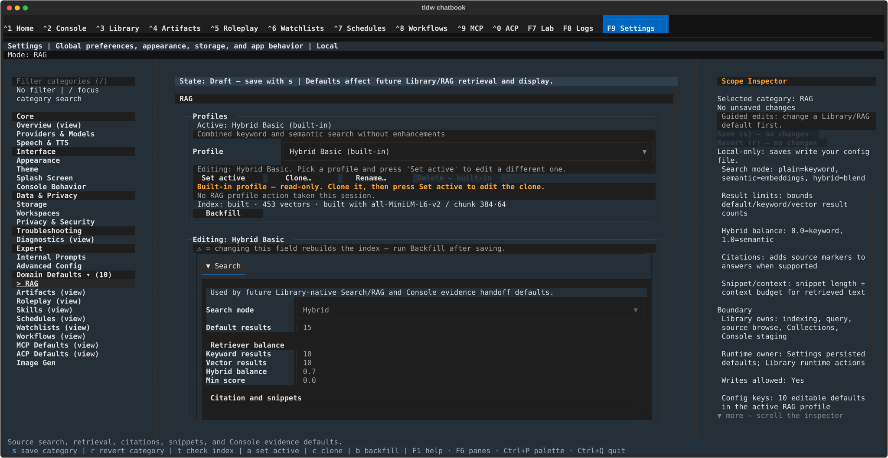

# Settings ▸ RAG — the retrieval-profile workbench

## What this screen is for

Retrieval settings do not live in one flat list — they live in named
**profiles**, and this pane is where you pick, clone, edit, and index them.
Exactly one profile is **active** at a time and that is the one retrieval uses;
your config file stores only a pointer to it. Reach for this pane when semantic
search comes back empty (you need **Backfill**), or when you want to change how
sources are chunked, embedded, ranked, or cited. The profiles that ship with
the app are read-only, so tuning always starts by cloning one.

The active profile's **Search mode** now genuinely drives retrieval, not
just a stored preference: Library's Search/RAG canvas and Console's
Library RAG evidence handoff (manual or auto-retrieve) both resolve it
and route accordingly — a `Plain keyword` profile searches keyword-only,
`Hybrid` blends keyword and vector search, and `Semantic` runs vector
search — see [Library Search/RAG](../library/search-and-rag.md#retrieval-mode-follows-your-rag-profile)
and [Console: Context & RAG](../console/context-and-rag.md#automatic-retrieval-details).

This screen tunes retrieval quality and selects the assistant's Direct/RAG
tool mode; it **does not grant automatic retrieval or assistant Library
access**. Those are independent, device-local **per-conversation Library
controls** on Console's Library chip. Changing a profile or the tool-mode
selector does not alter any conversation's Never/Automatic or Blocked/Allowed
choice.

## Getting there

Open **Settings** — press **F9**, click "F9 Settings" in the nav bar, or
press **Ctrl+P** and pick "Tab Navigation: Switch to Settings". Then pick
**RAG** in the
category rail: click **Domain Defaults ▸ (10)** to expand the group (it is
collapsed by default), then **RAG** — or skip the expanding entirely: press
`/`, type `rag`, press Enter (the filter reveals collapsed rows).

## Layout tour

The detail pane begins with two Console cards. **New Console conversations**
owns the future **Conversation defaults**: **Automatic retrieval**
(`Never` / `Automatic`) and **Assistant access** (`Blocked` / `Allowed`).
These values apply only to conversations created after the next save; use the
Console Library chip to change an existing conversation. **Allowed Library
access** owns the Direct/RAG selector and explains what an Allowed assistant
can use; changing it never grants access by itself.

Below those cards, **Profiles** contains the active profile, picker, lifecycle
buttons, read-only banner, index status, and **Backfill**. A fresh install also
shows the **first-run starter panel** while the **Editing: `<profile>`** field
wall is collapsed. The editing card holds the ⚠ legend and five folds —
**Search**, **Embedding**, **Chunking**, **Vector store**, **Reranking**.

The pinned **State banner** above them reads `State: Draft — save with s |
Defaults affect future Library/RAG retrieval and display.`, switching to
`State: Unsaved changes | …` once you edit a field. **Save (s)** and **Revert
(r)** live in the **Scope Inspector** on the right, which also names the save
targets: the active profile, and the profile pointer in your config file.

## Features & controls

### The Conversation defaults cards

Choose the defaults for future Console conversations, then press **Save (s)**.
**Automatic retrieval** controls whether an ordinary send performs the fixed
Notes, Media, and Conversations search. **Assistant access** controls whether
the assistant receives any Library tool schema. The **Allowed Library access**
checkbox chooses Direct tools or the single Library RAG tool only when access
is Allowed. Existing conversations retain their own device-local choices.

### The Profiles card

| Control | What it does |
|---|---|
| `Active: <name>` | The profile retrieval uses right now. Built-ins read `<name> (built-in)`. An optional description line sits beneath it. |
| **Profile** picker | Lists built-ins first, then your own. **Browsing it only previews** — nothing you pick here becomes editable. The card retitles to `Previewing: <name>` and a banner appears: "Previewing '`<name>`' (read-only) — press Set active to edit it". The caption below it, `Editing: <name>. Pick a profile and press 'Set active' to edit a different one.`, always names the *active* profile. |
| **Set active** (`a`) | Repoints retrieval at the picked profile and makes its fields editable. Reports `Active profile: <name>`, and appends "This change re-points to a new (empty) index — run Backfill." when the new index is missing or empty. Guards: "Choose a profile first." and "'`<name>`' is already active." |
| **Clone…** (`c`) | Opens the name dialog and creates a writable copy. Reports "Cloned to '`<name>`'. Select 'Set active' to edit it." — cloning does **not** activate. |
| **Rename…** | Renames the profile selected in the picker. Built-ins refuse with "Couldn't rename profile: `<reason>`". |
| **Delete** / **Delete — built-in** | Deletes a profile after a confirm. Disabled while a built-in is active, with the reason carried in the label. |
| **Backfill** (`b`) | Builds the semantic index for the active profile. |

A built-in gets its own banner, and every field in the **Editing** card is
disabled while one is active — which is how a fresh install starts:

> Built-in profile — read-only. Clone it, then press Set active to edit the clone.

### The index status line

Sits above **Backfill** and reports the active profile's vector index. It opens
as `Index: checking…`, then settles on one of:

- `Semantic index not built — Semantic search is keyword-only until you
  Backfill.` (or `Hybrid search …`) — the profile's search mode needs vectors
  and none exist yet. **This is the line to watch on a fresh install.**
- `Index: absent — will be created on next backfill` — same absence, but the
  profile is on plain keyword mode so it does not care.
- `Index: <state> · <n> vectors · built with <model> / chunk <size>·<overlap>`
  — a real index, plus what it was built from (the tail is omitted for older
  indexes that never recorded it).

### Backfill

**Backfill** bulk-indexes your media, notes, and conversations into the active
profile's index, in the background — you can keep using the app. It starts with
"Backfill started — this may take a while for large libraries." (pressing it
again meanwhile gives "Backfill is already running.") and ends as one of:
"Backfill complete: `N` indexed, `M` already up-to-date." · "Backfill finished
with problems: `N` indexed, `M` failed. `K` error(s) recorded — details are in
Logs (F8)." · "Backfill failed before finishing (`ErrorType`). Run Backfill
again — completed items are kept. Details are in Logs (F8)." · "Semantic
indexing is unavailable (missing embeddings extras, or disabled in config)." ·
"No local databases are available to backfill." Failure toasts stay plain
language; per-item error detail lands in the log, never in the toast.

### The first-run starter panel

On a fresh install — still on a built-in, no profile of your own, no index —
the field wall is replaced by a card reading "Search already works on
`<profile>`. Clone it to tune retrieval, or run Backfill to enable semantic
results." Its **Clone to tune…** and **Backfill now** buttons do what
**Clone…** and **Backfill** do; the panel goes once you clone or index.

### The Editing card

The legend above the folds explains the field-label markers:

> ⚠ = changing this field rebuilds the index — run Backfill after saving.

**Search**, the only fold open by default, holds ten fields under **Retriever
balance** and **Citation and snippets**: **Search mode** (`Plain keyword` /
`Semantic` / `Hybrid`); **Default results**, **Keyword results**, **Vector
results** (1–100 each); **Hybrid balance**, **Min score** (0.0–1.0 each);
**Include citations**; **Citation style** (`Inline` / `Footnote` / `None`);
**Snippet chars** (50–10000); **Context budget** (1000–1000000). Its caption
confirms the reach — "Drives Library Search/RAG retrieval and Console
evidence handoff defaults." — these are persisted here and consumed the next
time Library or Console runs a query, not applied to what is already on
screen.

The four collapsed folds; the first three rebuild the index, **Reranking** does
not:

- **Embedding** — model ⚠, device, batch size, max length ⚠: what the index is
  built from.
- **Chunking** — chunk size ⚠, overlap ⚠, method ⚠ (`Words` / `Sentences` /
  `Paragraphs`): how source text is split before embedding. The picker offers
  the three text methods; the chunking engine underneath (shared with the
  server) also implements `tokens`, `semantic`, `json`, `xml`,
  `ebook_chapters`, `rolling_summarize`, `propositions`, `fixed_size`, `code`,
  `code_ast` and `structure_aware` for callers that go through the pipeline
  directly — see
  [Import & export](../library/import-and-export.md) for the e-book
  chapter method in the UI.
- **Vector store** — distance metric ⚠ (`Cosine` / `Euclidean (L2)` / `Inner
  product`): how embeddings are compared.
- **Reranking** — **Enable reranking**, **Reranker provider**, **Reranker
  model**, **Rerank results**; "Enabling reranking creates the profile's
  reranker config; disabling it removes that config entirely." With it off
  the three fields dim and gain " (enable reranking to edit)". **Rerank
  results** above **Default results** warns without blocking the save:
  "Rerank results (`n`) exceeds default results (`m`); reranking will not
  see all requested results." **Cost:** stated on the fold itself, directly
  under the toggle and readable before you turn anything on — "Reranking
  scores each result with a separate `<provider>` call — up to `<n>` calls
  per search, or `<n×3>` if calls fail and are retried, billed at that
  provider's rates." — and it tracks the provider and **Rerank results**
  you have staged, so the number you read is the ceiling you would
  actually buy. The `×3` is the retry loop: a failed scoring call is
  retried twice (`max_retries = 2`), on *any* error including a wrong
  credential, so 20 candidates against a provider that is down cost 60
  calls, not 20 (measured). That line describes the **pointwise** strategy
  — the one this toggle creates and the only one these four fields edit;
  the "Reranking is not free" quirk below states all three shapes and what
  each really costs. **Reranker provider** enumerates
  every chat provider this build registers, with the default shown
  explicitly as "openai (default)" — and since TASK-17065 the reranker
  dispatches through that same table, so the name you pick really is the
  provider that gets called and billed. It resolves no credential of its
  own: each provider handler finds its key the usual way (explicit
  `api_settings.<provider>.api_key` over env var over legacy `[API]`), and
  the local providers that need no key at all need none here either. Pick
  one you have not configured and the call fails at search time — you get
  the skipped/degraded line below, never a broken search. **Reranker
  model** blank means the
  reranker's own default model. If the reranker can't run, search results
  still come back — reranking is skipped, disclosed on the results screen
  ([Library Search/RAG](../library/search-and-rag.md#evidence-rows)), and
  never fails the search outright.

### The four dialogs

- **Clone profile** / **Rename profile** — one name box, **Cancel** and
  **Clone** / **Rename**; Enter submits, Esc cancels.
- **Unsaved Library/RAG changes** — "Save your changes before switching the
  active profile, or discard them?" (**Cancel** / **Discard** / **Save**),
  raised only when you press **Set active** with an unsaved draft. Only one
  other unsaved-changes prompt exists in Settings — leaving **Speech & TTS**
  with edits; every other category keeps your draft silently.
- **Delete profile** — 'Delete the "`<name>`" RAG profile? This cannot be
  undone.' (**Cancel** / **Delete**).
- **Re-index required** — the destructive one, raised on **Save** when a ⚠
  field changed and a real index exists: "This change re-points to a new EMPTY
  index — the current index (`n` vectors) stops being used and search returns
  nothing until you run Backfill. Save anyway?" (**Cancel** / **Save anyway**).

### Saving

`s` saves and `r` reverts as in the other draft categories, but the save writes
the **active profile** plus the pointer naming it, not sections of your config
file. Success reads "Library/RAG defaults saved.", gaining " This change
re-points to a new (empty) index — run Backfill." when an index-determining
field moved. Editing a built-in blocks with "Built-in profile is read-only —
Clone to edit."; saving or reverting mid-preview is refused with "Return to the
active profile to save." / "…to revert." `t` re-checks the index rather than
testing a connection ("RAG check started." → "RAG check: `<state>` index ·
`
`") — the footer labels it **check index**.

## Common tasks

1. **Tune retrieval starting from a built-in.** Press **Clone…** (`c`), name
   the copy, confirm. Pick it in the **Profile** picker, press **Set active**
   (`a`) — the fields unlock and the card retitles to **Editing: `<your
   name>`**. Edit, **Save (s)**, then **Backfill** (`b`) if you touched ⚠.
2. **Switch which profile retrieval uses.** Pick it in the picker — note the
   "Previewing …" banner; nothing has changed yet — then press **Set active**
   (`a`). With an unsaved draft the **Unsaved Library/RAG changes** prompt
   comes first: **Save** keeps the edits, **Discard** drops them.
3. **Rebuild the index after changing chunking.** Open the **Chunking** fold,
   adjust **Chunk size ⚠** / **Chunk overlap ⚠** / **Method ⚠**, press **Save
   (s)**, confirm **Save anyway** at the **Re-index required** prompt, then
   press **Backfill** (`b`) and wait for "Backfill complete: …" — the status
   line should now read `Index: … · <n> vectors`.
4. **Enable semantic results on a fresh install.** Press **Backfill now** on
   the starter panel, or **Backfill** (`b`); watch the status line flip off
   "Semantic index not built — …".
5. **Turn on reranking.** With your own profile active, expand **Reranking**,
   read the cost line under the toggle, tick **Enable reranking**, pick a
   **Reranker provider** (or leave "openai (default)"), optionally name a
   **Reranker model** (blank uses the reranker's default), keep **Rerank
   results** at or below **Default results**, and **Save (s)** — no backfill
   needed. Every search this profile runs now issues one extra provider
   call per candidate result — three, if that call keeps failing — at that
   provider's rates, and since TASK-17065 those calls really go out. Before
   that fix reranking silently no-opped for every provider the picker
   offered, so a profile with the toggle already ticked starts spending on
   its next search without you touching anything; untick **Enable
   reranking** to opt out. The tick is not the only door: the built-in
   **Hybrid Full**, **High Accuracy** and **Research Papers** presets carry
   a reranker config of their own, so making one of them active spends too
   (see Quirks). If the
   provider has no credential configured, or the call fails, the search
   still returns, with the reranking line on the results screen saying so.
6. **Delete a profile you no longer want.** With a profile *of your own* active
   (see Quirks), pick the one to remove, press **Delete**, confirm — delete the
   active one and the pointer falls back to a built-in.

## Keyboard & commands

**A focused text field swallows every key below** — typing `b` into **Chunk
size** types a `b`, it does not start a backfill. Press **Esc** first; while a
field has focus the footer relabels the hints as `Esc, s` / `Esc, r` /
`Esc, t`.

| Key | Action |
|---|---|
| `a` | **Set active** — make the picked profile the one retrieval uses and you edit |
| `c` | **Clone…** — open the name dialog for a writable copy |
| `b` | **Backfill** — index media, notes, and conversations into the active profile |
| `s` | Save the profile draft |
| `r` | Revert the profile draft |
| `t` | Check index — re-read the index status line |

`a`, `c`, and `b` exist only on this category.

## Related settings & docs

- [Settings](../settings.md) — the rail, the State banner, how other categories
  save.
- [Library Search/RAG](../library/search-and-rag.md) — where these defaults are
  spent: queries, Search vs RAG Answer modes, evidence rows, Console handoff.
- `config.toml`: `[rag.service]` → `profile` is the pointer naming the active
  profile, and the only RAG value this pane writes into your config file —
  everything else goes into the profile itself. `[embedding_config]` holds the
  embedding models and cache shared with the rest of the app.
- [Guide index](../index.md) — global keys and navigation.

## Quirks & troubleshooting

- **Browsing the picker changes nothing.** It is a preview: the banner says so,
  the title says `Previewing: …`, the fields stay locked. Only **Set active**
  switches what you edit — and **Clone…** does not activate either, hence
  "Select 'Set active' to edit it."
- **Search "works" on a fresh install, but only as keyword search.** The
  built-in default asks for semantic retrieval it has no index for — precisely
  what "Semantic index not built — …" is telling you.
- **Delete tracks the *active* profile, not the previewed one.** It is disabled
  and labeled **Delete — built-in** whenever a built-in is active, even while
  you preview a profile of your own — so set one of your own active first.
  Conversely, with your own profile active the button stays enabled while you
  preview a built-in and fails with "Couldn't delete profile: `<reason>`".
  (backlog task-2707)
- **Search-group defaults are persisted, not live.** Saving them changes what
  the next Library query does, not anything already rendered. **Default
  results** now drives the Library window's "Evidence · top N per source"
  cap (clamped at 50) — see [Library Search/RAG](../library/search-and-rag.md).
- **Reranking is not free — and "one call per result" is only one of three
  shapes.** Every surface that reads this profile (Library, Console
  manual/auto retrieval) pays the cost, not just this pane. Until
  TASK-17065 those calls never actually reached a provider (reranking
  failed and was skipped, for every provider); they do now, so an
  already-ticked profile begins spending on its next search. What ONE
  search costs, measured against the real reranker with the provider seam
  faked (`Tests/RAG_Search/test_reranker_degraded_paths.py` is the same
  seam):

  | Strategy | Calls for ONE search | With the retry loop (`max_retries = 2`) |
  |---|---|---|
  | **pointwise** (this fold's toggle, `Hybrid Full`, `High Accuracy`) | one per candidate, up to **Rerank results** — 20 at the default | up to **×3** — 3 candidates against a failing provider issued **9** calls; 20 issued **60** |
  | **listwise** (`Research Papers`) | exactly **1**, covering at most 10 documents — the fold's line over-states here | up to **3** |
  | **pairwise** (no built-in preset; a hand-written profile only) | a merge sort over the candidates, ≈ `n·log₂n` **comparisons** — **40–69** at `Rerank results` 20, not 20 | up to **×3** (≈200) |
  | **cross_encoder** (no built-in preset; a hand-written profile only) | **0** — it runs a local model, no provider, no credential, no network | n/a |

  The retry loop fires on *any* exception, including a wrong or missing
  credential — the case where the calls buy nothing at all.

- **Reranking has never been shown to improve search here — and the one
  strategy that was measured made it worse on average.** Three of the four
  strategies bill an LLM provider per call, which the local, deterministic
  eval gate cannot run, so their retrieval value is simply unknown
  (TASK-3502 said so explicitly). The fourth, **`cross_encoder`**, runs a
  local model and *can* be measured, so TASK-16965 measured it over the
  60-query golden set against a rule written down before the code was —
  and the answer was **net harmful** [CAVEAT: that averaged row EXCLUDES `scoped` and `negative` (`UNAVERAGED_CATEGORIES`), and `scoped` is where this strategy WINS -- over all 53 ground-truthed queries hybrid REVERSES sign (MRR 0.731 -> 0.806, +0.075). TASK-16965 final review F1.]:

  | | MRR before → after | NDCG@10 | recall@10 |
  <!-- F2 (final review): this MRR is UNBOUNDED-rank, not MRR@10 — arm B's
  reranked lists exceed 10 on 60/60 queries (mean 19.4 semantic, 20.0
  hybrid), so ranks 11–20 are counted. Correcting to @10 shifts the
  deltas only slightly (semantic −0.0169 → −0.0134) and does not change
  the verdict. -->
  |---|---|---|---|
  | semantic | 0.808 → **0.762** | 0.804 → 0.776 | 0.804 → **0.826** |
  | hybrid | 0.812 → **0.787** | 0.817 → 0.805 | 0.848 → **0.870** |

  It is not doing nothing — it rescored 3,621 rows and moved 1,950 of them
  — its effect is just **split down the middle by query type**. Where
  retrieval was already weak it was a large win (hybrid *scoped* queries
  MRR 0.163 → **0.929**; *prompt* 0.022 → 0.200). Where retrieval already
  put the right answer first — paraphrased and vocabulary-mismatch queries,
  both at a perfect 1.000 — the only move available was downward, and four
  queries lost their top spot (1.000 → 0.87–0.94). Averaged, you buy a
  little recall and pay for it in rank quality.

  So `cross_encoder` ships **selectable but recommended nowhere**: no
  built-in profile uses it, no config template sets it, and nothing turns
  it on for you. It is worth trying only if your own searches look like the
  weak half of that split — and then measure, don't assume. The full run,
  per-category tables and the method are in
  `Docs/superpowers/qa/2026-08-17-cross-encoder/report.md`.

- **Three built-in presets rerank without you ticking anything.** Reranking
  is on for a profile whenever that profile carries a reranker config —
  the **Enable reranking** tick is how *your own* profiles get one, not the
  only way one exists. **Hybrid Full** (pointwise, 15 candidates), **High
  Accuracy** (pointwise, 15) and **Research Papers** (listwise, 10) all
  ship with one, all bill `openai` unless you clone and change them, and
  all three are pickable from the profile picker. Selecting one with
  **Set active** is therefore a spend decision, with no checkbox in it.
  The out-of-the-box active profile, **Hybrid Basic**, carries no reranker
  config, so a fresh install spends nothing until you pick or configure
  otherwise. Built-ins are read-only: to run one *without* reranking,
  **Clone…** it and untick **Enable reranking** on the copy.
- **Backfill needs embeddings support.** Without it you get "Semantic indexing
  is unavailable (missing embeddings extras, or disabled in config)." and the
  index never builds; keyword search keeps working regardless. "RAG backfill
  could not start: the shared RAG service is unavailable right now. Try again
  shortly." is different — that one is transient, so press **Backfill** again.
- **The chunking engine clamps instead of scolding.** With `Words`,
  `Sentences` or `Paragraphs`, an overlap at or above the chunk size used to
  be rejected; the engine now clamps the overlap just under the size and
  produces more, smaller chunks instead. (The `tokens` method is the one
  exception — it still raises a clear error when overlap ≥ size.) Every
  chunk is also stamped with the engine version that produced it, and text is
  sanitized before chunking (null bytes and unusual control characters become
  spaces, Unicode is normalized when that doesn't shift offsets) — see
  [Import & export](../library/import-and-export.md).

—
*Verified against dev @ e7b9ebabd — 2026-08-06. Verified against d6b6a738f
— 2026-08-07 (RAG-port P0 live walkthrough on a scratch profile holding a
copy of the real Library DBs): **Set active** on the Profile select writes
`[rag.service] profile` immediately and the "Active:" line follows it —
switched Hybrid Basic → BM25 Only → Hybrid Full → Hybrid Basic, and every
switch changed what the next Library Search/RAG run actually did. The index
line is honest about the switch: Hybrid Basic reads "Index: built · 453
vectors · built with all-MiniLM-L6-v2 / chunk 384·64", and selecting a
profile with a different embedding model immediately reads "Index: absent —
will be created on next backfill" plus "Semantic index not built — Hybrid
search is keyword-only until you Backfill" — which is exactly what the
subsequent search then disclosed.*

*Verified against `feat/rag-3502-reranker-followups` — 2026-08-16
(TASK-3502 AC#1/AC#2, the **Reranking** fold's new **Reranker provider**
Select and its cost line). Verified by mounted-widget tests over the real
`SettingsScreen`, not a live TUI walkthrough: the Select's options are
asserted equal to `chat_api_call`'s own dispatch table, the cost line's
exact sentence is asserted with reranking still OFF, and it is re-asserted
after staging a different provider and rerank top-k
(`Tests/UI/test_settings_rag_profile_region.py`). Copy corrected in the
final-review fix wave (same branch, same date): the picker ENUMERATES the
registered chat providers — measured against the engine, the reranker's
credential path can currently call almost none of them, so the "can
dispatch" / "billed to the provider you picked" phrasing above was an
over-claim and now points at TASK-17065 instead.*

*Verified against `feat/rag-p2a-instrument-renewal` at 0c34be595 —
2026-08-11 (TASK-15020 final review wave, doc-only: correcting the
Quirks bullet above to match B3's already-shipped behavior — **Default
results** drives the Library window's per-source cap, clamped at 50; no
code changed here).*

*Verified against `fix/task-17065-reranker-dispatch` — 2026-08-17 (TASK-17065,
doc-only on this page): the reranker's bespoke credential lookup and its
mis-ordered positional `chat_api_call` are deleted, so the copy above that said
its credential path "reaches far fewer" providers than the picker offers is no
longer true and has been corrected — the reranker now passes no credential and
each provider handler resolves its own. Pinned by
`Tests/RAG_Search/test_reranker_degraded_paths.py` (a seam guard that drives the
real caller and binds through `inspect.signature(chat_api_call)`, plus nine
parametrised provider cells covering the five keyless locals and four remotes).
No live provider call was made; the picker itself was not touched.*

*Verified against `fix/task-17065-reranker-dispatch` — 2026-08-17 (TASK-17065
final-review fix wave, F1/F2): the spend numbers above are MEASURED, not
inferred — counting `chat_api_call` invocations through the real reranker with
the provider seam faked, one `rerank()` at a time. Pointwise with the shipped
retry settings: 9 calls for 3 candidates against an erroring provider, 60 for
20. Pairwise at `Rerank results` 20: 40 calls best case, 69 worst (49–65 across
200 randomised comparison outcomes), matching the merge sort's own bounds.
Listwise: exactly 1 on success, 3 against an erroring provider (the retry rule is strategy-independent). The three built-in presets that carry a reranker config
were read back off `ConfigProfileManager` over an empty profiles dir — Hybrid
Full, High Accuracy, Research Papers, all `openai`; the other nine built-ins,
including the default Hybrid Basic, carry none. The Settings cost line was
changed to disclose the retried ceiling and re-pinned in
`Tests/UI/test_settings_rag_profile_region.py`. No live provider call was made.*

*Verified against `feat/rag-16965-cross-encoder` — 2026-08-17 (TASK-16965,
doc-only on this page): the `cross_encoder` row and the "reranking has never
been shown to improve search here" quirk above are the measurement's own
output, not an estimate. The strategy was implemented as a local
sentence-transformers cross-encoder and run over the 60-query golden set on
the gated eval instrument in two pre-declared arms, against a decision rule
fixed in `Docs/superpowers/plans/2026-08-17-cross-encoder-measurement.md`
BEFORE the strategy was written; the probe reproduced the retrieval census
from its own retrievals and asserted the model actually scored (3,621 rows
scored, 0 failed) so a null could not be faked by a silently-degraded load.
Zero network and zero provider spend, confirmed three ways. Numbers,
per-category tables and the verbatim probe output:
`Docs/superpowers/qa/2026-08-17-cross-encoder/report.md`. `cross_encoder` is
not exposed in this pane — it is a config-file strategy — and no built-in
profile uses it, so nothing on this screen changed behaviour.*

*Verified against the chunking-engine-parity worktree — 2026-08-19
(chunking-engine-parity, doc-only on this page): the chunking engine under
this pane is now the server's engine (vendored, behind a compatibility
shim), verified in `tldw_chatbook/Chunking/Chunk_Lib.py`'s method map and
`tldw_chatbook/RAG_Search/chunking_service.py`'s now-whitelist-free
delegation — every engine method (`words`, `sentences`, `paragraphs`,
`tokens`, `semantic`, `json`, `xml`, `ebook_chapters`, `rolling_summarize`,
`fixed_size`, `code`, `code_ast`, `structure_aware`) routes through for
pipeline callers, while this pane's Method picker still offers the three
text methods. The clamp-vs-raise overlap change and the `tokens` exception
are the shim's `_guard_tokens_overlap` and the engine strategies' clamp
(`tldw_chatbook/Chunking/engine/strategies/paragraphs.py`), pinned by
`Tests/Chunking/`. No live TUI walkthrough; no behavior of this pane's own
controls changed.*

*Verified against feat/settings-ux-critique-burndown — 2026-08-28
(TASK-23108 review round: the Backfill failure toasts documented above changed
shape — the crash toast is plain language with the exception type name and a
next step, and the partial-failure toast reports counts and points at Logs (F8)
instead of embedding the last raw error string. Pinned by
`Tests/UI/test_settings_rag_profile_region.py`'s backfill toast tests; no other
behavior of this pane changed.)*
