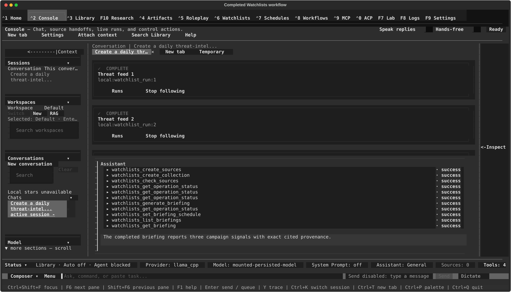

# Quickstart — Turn feeds into a scheduled Watchlist briefing

This walkthrough creates a local Watchlist from RSS or Atom feeds, checks every
source, generates a briefing, and schedules the next briefing every 24 hours.
You will drive the workflow from Console and then verify the same saved records
in Watchlists and Settings.

## Before you start

You need:

- A working provider and model. Complete the [first-run setup](First_Run_Setup.md)
  or configure one under **Settings ▸ Providers & Models**.
- One or more public RSS or Atom feed URLs. Do not put passwords, API keys, or
  other secrets in the URLs.
- A name for the Watchlist, such as `Daily security news`.
- Local Watchlists selected. Console cannot perform this workflow against the
  server Watchlists backend; if a tool reports that server Watchlists are not
  supported, open Watchlists and switch it to **Local**.

Scheduled briefings run inside the app. Keep tldw_chatbook open when you want a
scheduled occurrence to run.

## 1. Ask Console to run the complete workflow

Open **Console** with **Ctrl+2** and paste a request like this, replacing the
name and URLs:

```text
Create a Watchlist named "Daily security news" from these RSS or Atom feeds:

- https://example.com/security.xml
- https://example.org/updates.atom

Check every source and follow each operation receipt until it reaches a terminal
status. Generate a briefing and follow that receipt to completion. Schedule the
briefing every 24 hours. Finally, list and open the completed briefing and
summarize it for me.
```

Keeping the whole request in one message gives the agent the desired end state:
sources, one Watchlist, completed checks, a completed briefing, a saved cadence,
and a readable result.

## 2. Review and approve each tool call

Console pauses before local Watchlists tools run. Read the tool name and its
arguments on the **Approval required** card, then approve only the operation you
expect. A normal run may use these tools:

1. `watchlists_create_sources`
2. `watchlists_create_collection`
3. `watchlists_check_sources`
4. `watchlists_get_operation_status`
5. `watchlists_generate_briefing`
6. `watchlists_set_briefing_schedule`
7. `watchlists_list_briefings`
8. `watchlists_get_briefing`

The exact order and number of status checks can vary. Deny a call if its target
or arguments do not match your request. Keep Console open until the workflow is
finished: leaving Console cancels its active turn and any pending approval.

## 3. Wait for terminal receipts

Creating sources and the Watchlist is immediate, but source checks and briefing
generation run in the background. Their first receipt may say **Accepted** or
show another pending state. That means the work was queued—not that it
succeeded.

The agent should follow every returned operation ID with
`watchlists_get_operation_status` until the receipt is terminal. Do not create a
duplicate source, Watchlist, or schedule merely because a receipt is still
pending. If the agent stops early, ask:

```text
Follow every Watchlists operation receipt from this run to a terminal status,
then show me the final status of each one.
```

A source failure is reported with a safe recovery category such as
authentication required, rate limited, invalid feed, connection failure, or
temporary server error. Fix non-retryable configuration or feed problems before
asking for another check.

## 4. Read the completed briefing

After the briefing receipt completes, the agent lists the saved briefings,
opens a bounded Console projection of the new one, and can summarize what it
received. The response stays below 30 KiB and reports when its fixed Markdown
or provenance budgets truncate content. Follow the selected/cited provenance
continuation cursors when present; use **Watchlists ▸ Artifacts** to read or
export the complete saved briefing when its Markdown was truncated. An empty
briefing can be a valid terminal result when the checks produced no eligible
items; inspect the source Runs before repeating the workflow.



*Completed mounted workflow using redacted demo feeds and a disposable local
profile. The source-check cards are terminal, and the Console tool list ends by
opening the saved briefing.*

## 5. Verify the saved records

Once the Console turn has finished, confirm the result in the dedicated views:

1. Press **Ctrl+6** to open **Watchlists**.
2. Select the new Watchlist and confirm its sources in **Sources**.
3. Open **Runs** and confirm each source check has a terminal result.
4. Open **Artifacts**, select the completed briefing, and confirm the cadence
   reads **Every 24 hours**.
5. Press **F9** to open **Settings**, expand **Domain Defaults**, and open
   **Schedules**. Confirm scheduled briefings are enabled for the app.

Console, Watchlists, and Settings read the same durable local records. You do
not need to recreate anything when moving between them.

## What “Every 24 hours” means

- After a briefing attempt or completion, the next eligibility is **86,400
  seconds after the latest activity**—not a promise to run at local midnight.
  A newly saved schedule with no previous attempt is eligible immediately.
- It runs only while tldw_chatbook is open; there is no separate background
  service.
- The cadence is opt-in for this Watchlist and does not change other
  Watchlists.
- Saving requests an immediate scheduler reload. If the scheduler is stopped or
  does not acknowledge in time, the cadence remains stored and is loaded when
  the scheduler next runs.
- Briefing generation uses the Watchlist's persisted briefing preset. Without
  one, it uses the persisted chat-default provider and model—not whichever model
  happens to be selected in the open Console conversation.

## Troubleshooting

| What you see | What to do |
|---|---|
| Console says **Get started** or the composer is locked | Configure a provider and model under **Settings ▸ Providers & Models**. |
| A tool says server Watchlists search or mutation is unsupported | Open Watchlists with **Ctrl+6**, switch to **Local**, and retry. |
| A run is waiting | Answer the visible approval card. Do not navigate away from Console while the turn is active. |
| A receipt remains pending | Ask the agent to follow that exact operation ID to a terminal status; do not repeat the mutation. |
| A source check fails | Open its Run detail and follow the stated recovery action. Authentication, access, invalid-feed, and safety-policy failures require a change before retrying. |
| The briefing is empty | Check the source Runs and whether any eligible items were found. Empty can be a successful terminal result. |
| The cadence is saved but no briefing runs | Keep the app open, confirm the app-wide scheduling gate in Settings, and confirm a persisted briefing provider/model route is available. |

## Cost and privacy

- Checking feeds makes network requests to the URLs you supplied.
- Generating and summarizing a briefing can consume tokens or incur charges at
  the configured model provider.
- Every local Watchlists mutation initiated through a Console tool remains
  behind Console's explicit approval card. Direct actions in the Watchlists
  screen use that screen's own controls instead.
- Console can read bounded item and briefing projections and reports when they
  are truncated. External MCP clients receive only the deliberately narrower
  Watchlists metadata and operation-receipt surface—not article bodies or
  briefing Markdown.

For deeper reference, see [Watchlists](watchlists.md),
[Schedules](schedules.md), [Console agent runs and tools](console/agent-runs-and-tools.md),
and the [MCP privacy boundary](mcp.md#watchlists-privacy-boundary).

—
*Verified against dev @ 9c0e6a397 — 2026-08-29*
