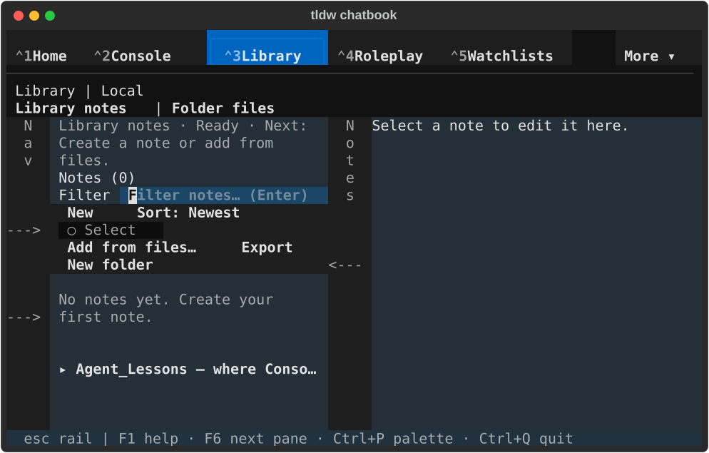
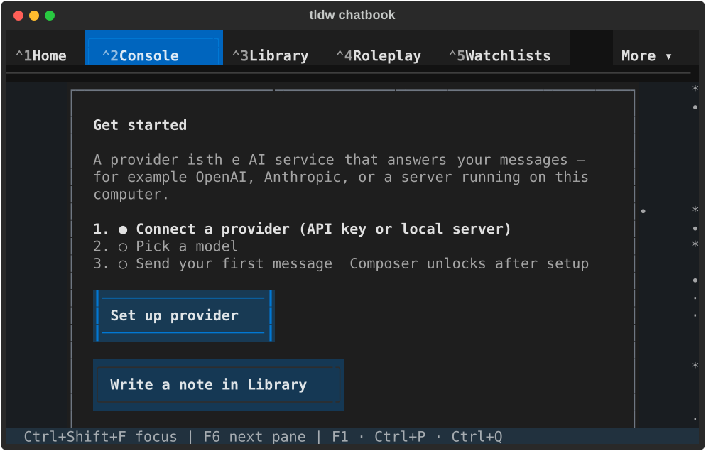
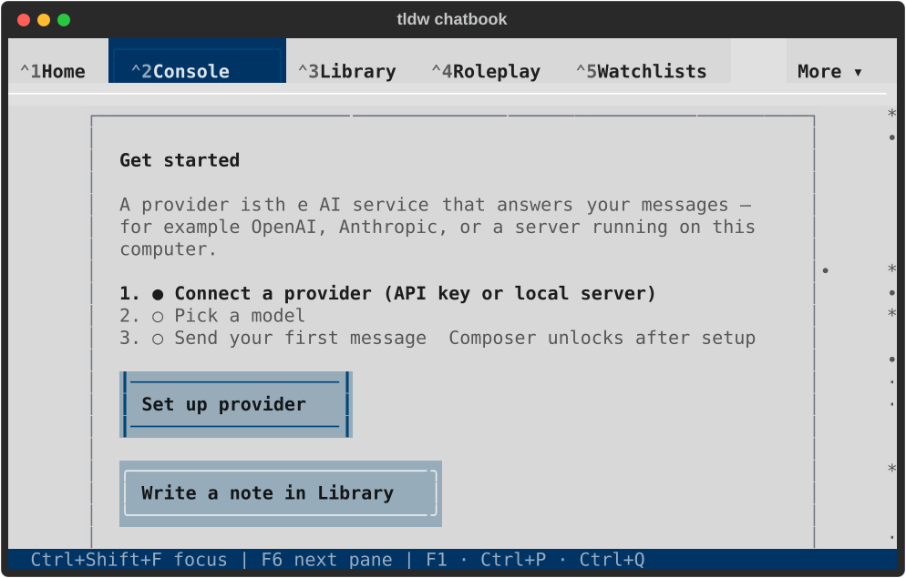
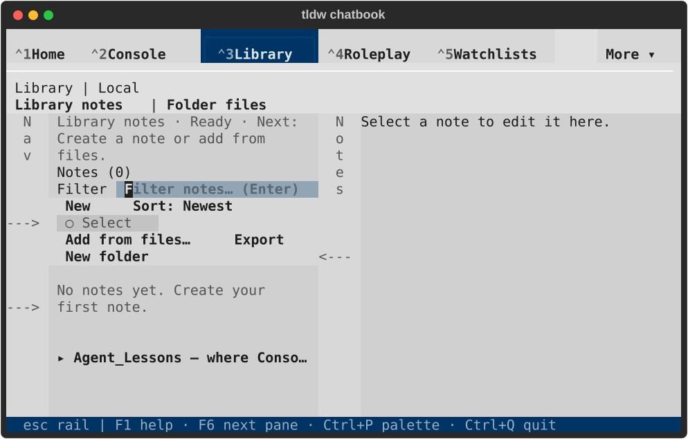
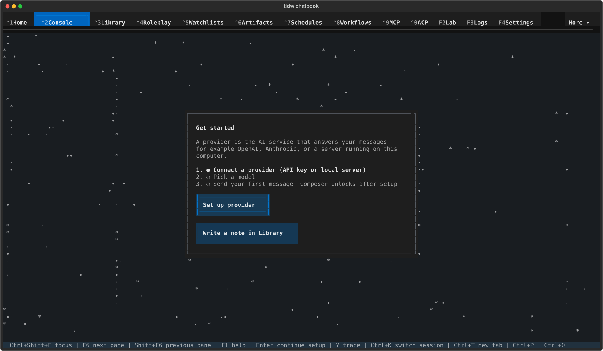
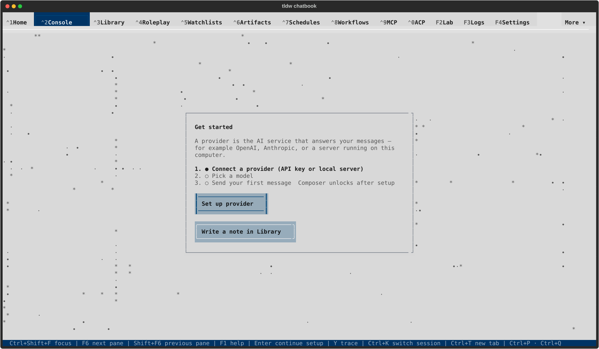
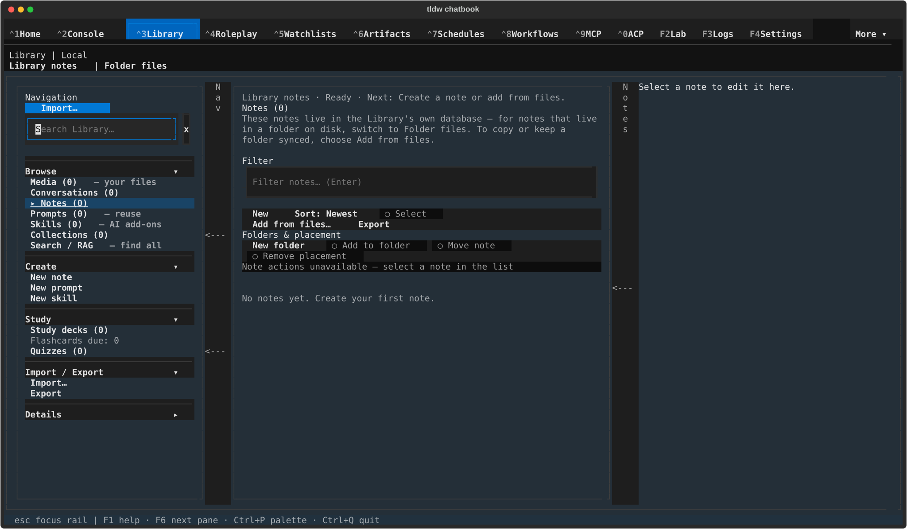
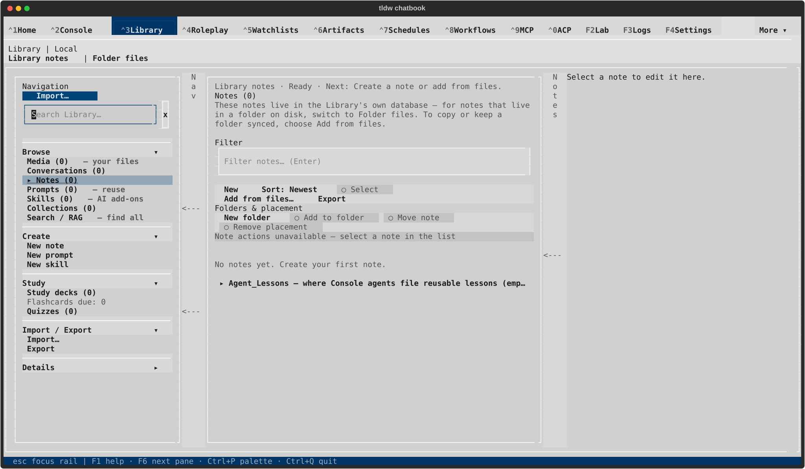

# PR #2704 — refreshed visuals and complete Notes guidance

TASK-32765 repairs the compact Notes status flagged in the earlier
[visual review](../2026-09-17-pr-2704-visual-review/README.md). At 80×24 the
32-column Items pane needs three rows to paint the complete next action.
The two-row cap cropped `files.`. The list authority now uses natural height
with a parent-height maximum; explicitly overriding the inherited maximum
is necessary because removing the feature declaration alone leaves the
screen default's two-row cap. The separate work-pane authority keeps its
existing two-row budget. No token value or product wording changed.

These captures show source base `4a7f0352b405816a9b092ea7d0ac74b2278489ad`
plus this task's CSS repair. Exact source and runner hashes are recorded in
[native-result.json](native-result.json). They show the resolved branch after
all four historical integrations; they are not parent-side merge comparisons.
The [conflict audit](../../reports/2026-09-17-pr-2704-conflict-review.md)
records the choice made in every conflict block.

## Before and after the compact Notes repair

| Before, 80×24 dark | After, 80×24 dark |
| --- | --- |
|  |  |

## Current compact screens — 80×24

| Console, dark | Console, light |
| --- | --- |
|  |  |

| Notes, dark | Notes, light |
| --- | --- |
|  |  |

## Current wide screens — 170×48

## Verification and limits

49 distinct targeted cases passed: four empty/populated × dark/light cases
exercise actual compositor paint through 80→60→64→100→120→170→80 columns,
including New/Add from files labels and visible filter focus; thirteen
existing empty/selected toolbar cases and 32 token/component/bundle/budget
checks also pass. See [layout tests](layout-tests.txt),
[regressions](regressions.txt), and the [original clipping failure](red-paint.txt).
Ruff check/format and whitespace checks pass for the new Python files.
All seven [derived-artifact preflight checks](preflight.txt) pass.
Independent review found no actionable issue and separately passed the
populated/dark regression. No full suite was run.

The test accepts the optional `Library notes ·` prefix: during an existing
resize path the noun can remain below 64 columns, while the complete action
still paints. This repair does not change that pre-existing copy timing.
Two initial test-harness attempts failed at collection/construction (wrong
stylesheet import, then passing a tuple instead of a list); neither was a
product failure. The first CSS attempt still inherited the default maximum
and reproduced the same clipping before the explicit maximum override.

The final real `TldwCli.run(auto_pilot=...)` used an owned tmux terminal and
private HOME/config/data profile `/private/tmp/tldw-32765-native-002`, PID
80452. LinuxDriver, terminal-backed rendering, primary lock ownership,
keyboard navigation/focus, full status paint, and action bounds were checked.
All eight SVGs were inspected through native Quick Look previews. Both
compact Notes captures now include `files.`; wide captures keep the complete
disabled Remove placement label and selection explanation. The first wide
dark frame precedes the automatic empty Agent_Lessons folder appearing.
The compact Console setup card continues below its viewport, as before.
These are navigation/rendering checks; no note edit, sync, provider request,
or full feature qualification is implied.

[Lifecycle evidence](lifecycle.json) records normal return and exit zero,
ten healthy private databases, zero conversations/messages, no application
errors, empty faulthandler output, released instance lock, absent process,
closed owned terminal, and unchanged default-profile fingerprints.
[Capture hashes](capture-manifest.json) retain original/stored identities;
only trailing whitespace was normalized.

[Attempt 001](earlier-run-001.json) is unqualified: the runner pressed F6
before Notes focus settled, failed its assertion, and did not finish after
terminal quit. Its exact owned PID was terminated with SIGTERM (exit 143),
then process/terminal absence, healthy private databases and unchanged
defaults were verified. The final runner waits for controls and initial
focus, checks visible focus after F6, and quits through Pilot's normal key
dispatch. Only attempt 002 is the successful native evidence above.

PR #2704 remains draft. Merging into dev requires the user's explicit green
light after visual review. The wider feature/component review remains open.
