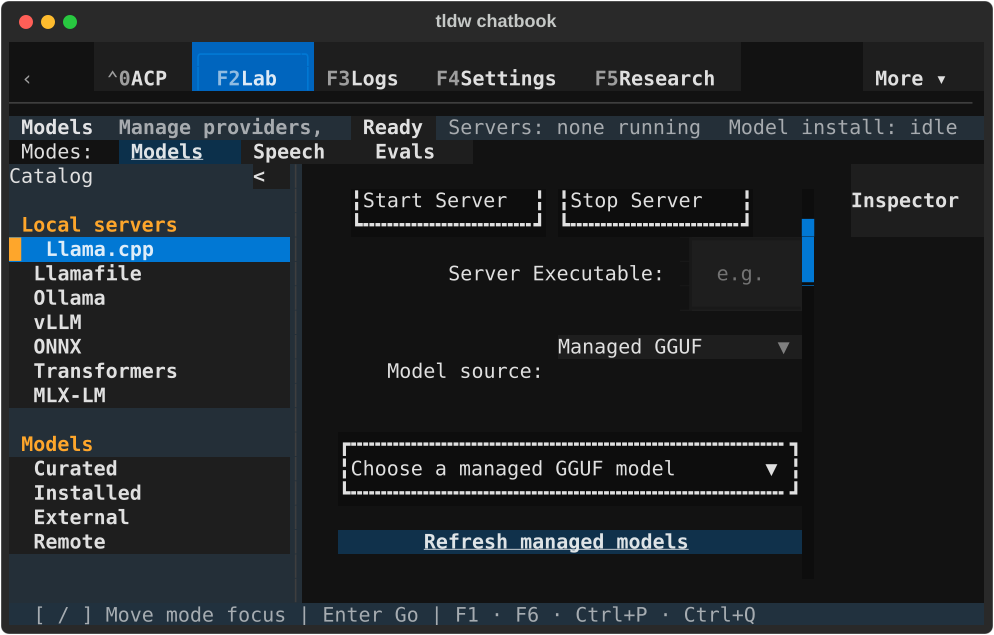
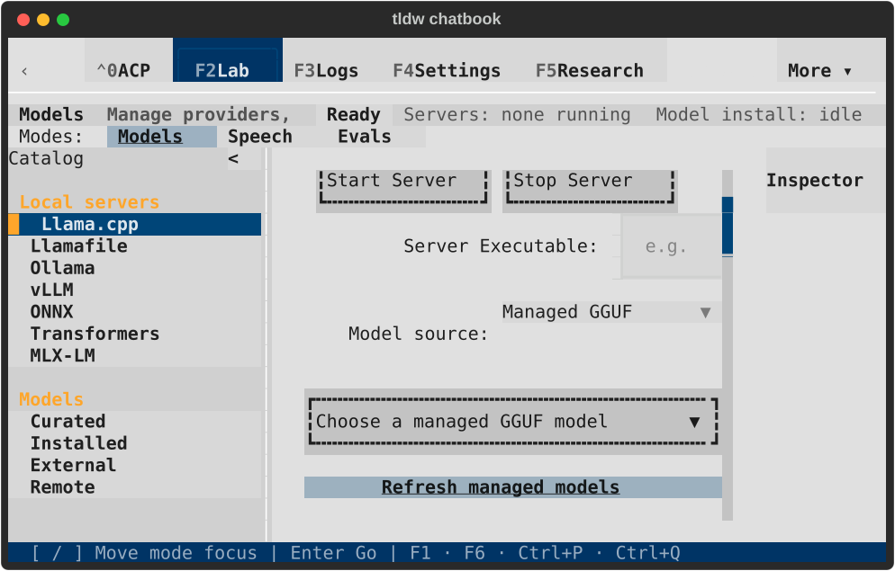
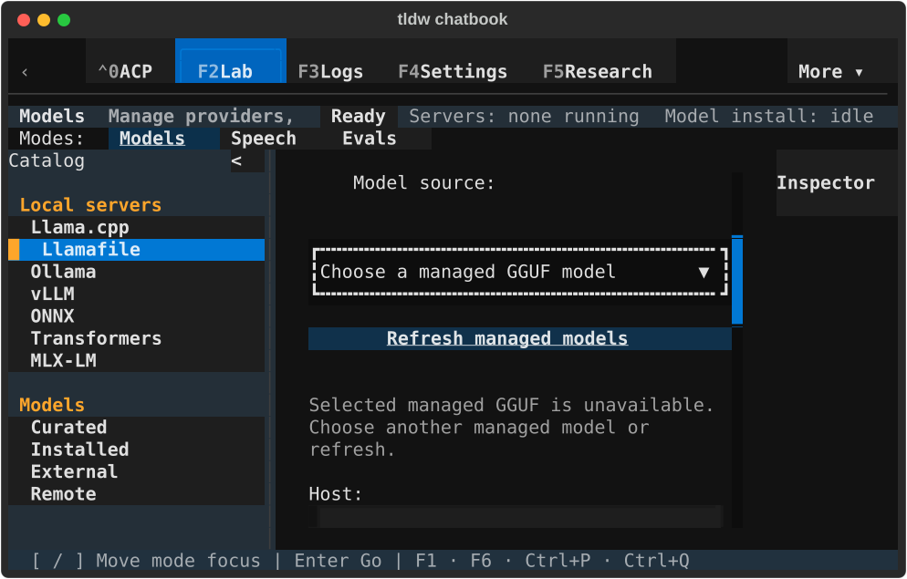
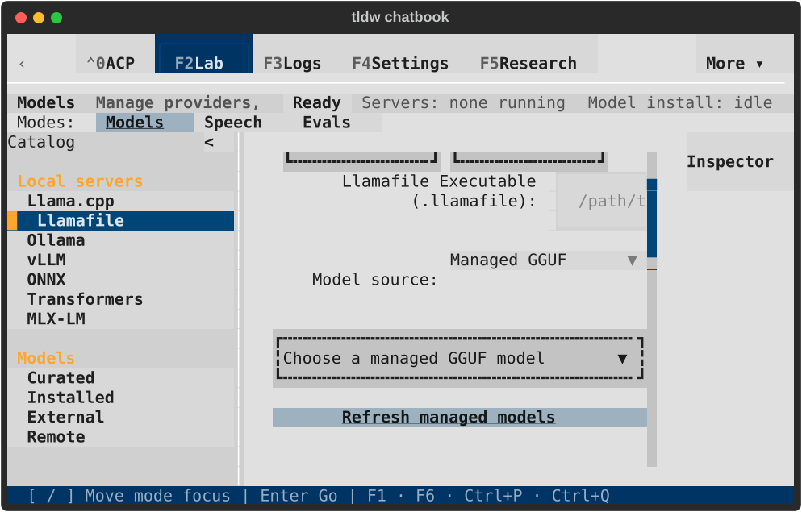

# PR #2704 integration CI repair

The owner approved the conflict choices and Notes/Console gallery at
`156c06f80b`. Pre-merge CI then exposed three regressions. This follow-up
preserves those choices and the existing performance limits.

| Failure | Cause and repair |
| --- | --- |
| Startup module census 1023/1022 | The palette imported the whole Pattern Gallery at startup. Its provider now lives with the other providers in `app.py`; only executing the command imports the gallery screen. Census returns to 1022/1022. |
| Broad CSS selector census 278/274 | Four action/input rules used bare type subjects. Existing unique control IDs now select the same widgets with the same specificity and declarations. Census returns to 274/274. |
| Llamafile keyboard journey at 80×24 | Consolidated section headings gained a second bottom-margin row. Selecting Managed GGUF succeeded but left its selector below the viewport. Restore the previous one-row gap only on the direct llama.cpp and llamafile headings. vLLM and nested snapshot headings retain their existing rules. |

The unchanged GGUF test failed before the repair and passed on the dev
baseline. That baseline is `1c0327b3bb`; its Models source, GGUF test and CSS
trees match the current dev `d8fb4053f9`. The computed-style comparison found
only the section-title margin difference among 221 mounted nodes.

## Verification

- [Final failing-check regressions](final-targets.txt): both provider keyboard
  journeys and both performance ratchets pass (4 tests).
- [Performance module checks](performance.txt): 9 pass; module-count headroom
  is zero and neither limit changed.
- [Gallery commands](gallery-command.txt): discovery and search both defer
  import, mount the real gallery, and return with Escape (2 tests).
- [Governance/build checks](governance.txt): 32 pass.
- [Trust dialogs](trust-dialogs.txt): 12 targeted dismissal/positive cases pass.
- RAG/access/catalog batch: 32 pass; three catalog cases failed because their
  shared-process config source changed before screen creation. The same
  original assertions pass in private processes at all three sizes. Both
  original dark/light gallery snapshot assertions also pass unchanged in
  private processes: [six-case diagnostic run](private-profile-reference-checks.txt).
  The remaining RAG stub failure (`ChatScreen` lacks `_session`) also fails
  on dev with the original assertion in a private process:
  [baseline evidence](rag-stub-dev-baseline.txt). It predates this repair.

The temporary [diagnostic wrapper](diagnostic-wrapper.py.txt) was executed
from `Tests/UI/test_pr2704_gguf_probe.py` and removed after collecting evidence.
It preserves the original assertions and uses the repository's established
private-profile runner; it does not relax production config-source ownership.
No full test suite was run. Independent review found and removed an initial
overly broad Models selector; no findings remain on the final repair.

## Native visual confirmation

Real `TldwCli.run(auto_pilot=...)`, an owned terminal, and a fresh private
profile exercised keyboard selection of Managed GGUF and Tab to Refresh at
80×24 in both themes. The entire managed selector is inside its viewport.
Inventory is intentionally empty, so selection is disabled; these captures
qualify rendering and keyboard access, not model launch/download/inference.

| Provider | Dark | Light |
| --- | --- | --- |
| llama.cpp |  |  |
| llamafile |  |  |

All four rendered SVGs were visually inspected. The native process (PID34292)
returned normally with exit 0. Ten private databases passed integrity checks,
there were no application errors, the instance lock was released, the owned
terminal closed, and the three default-profile fingerprints stayed unchanged.
See [lifecycle](lifecycle.json), [source/runner hashes](native-result.json),
and [capture hashes](capture-manifest.json). The earlier successful run is
retained as `initial-native-result.json`; the final captures additionally
verify full selector containment after Tab.

Governance: existing ADR-150/161 (design language/component ownership) and
ADR-097 (unchanged performance ratchets). No new ADR is required.
