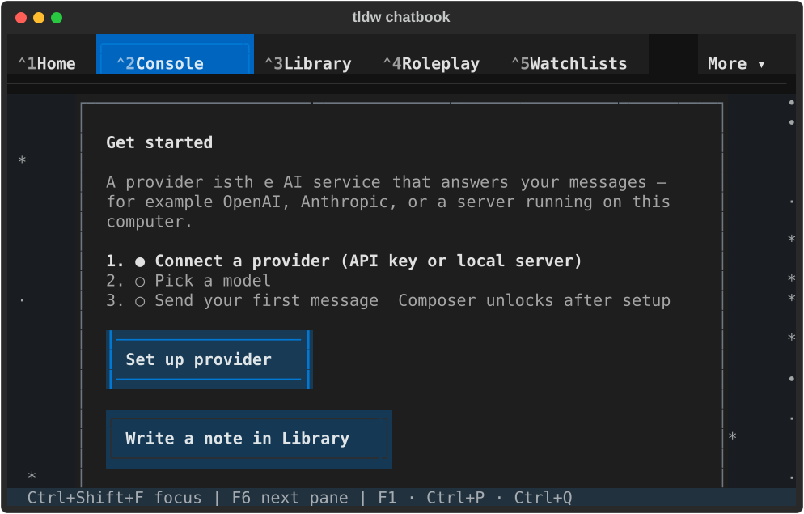
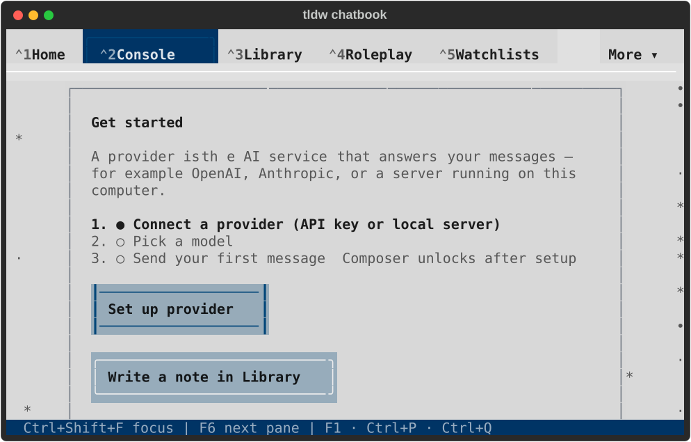
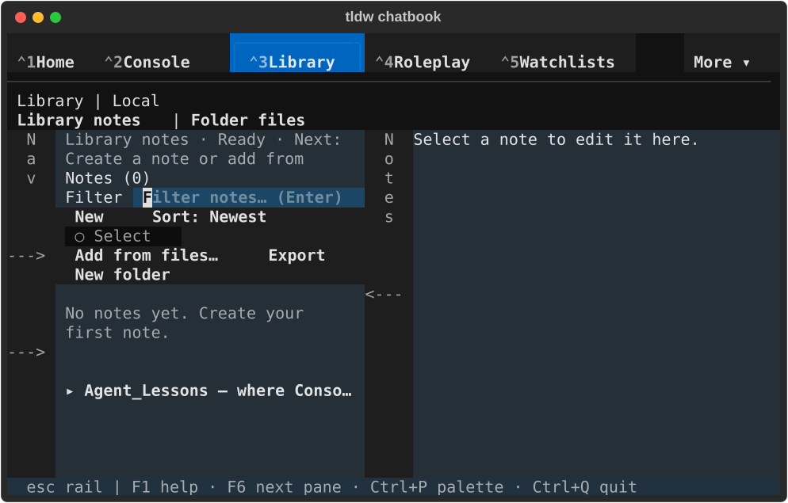
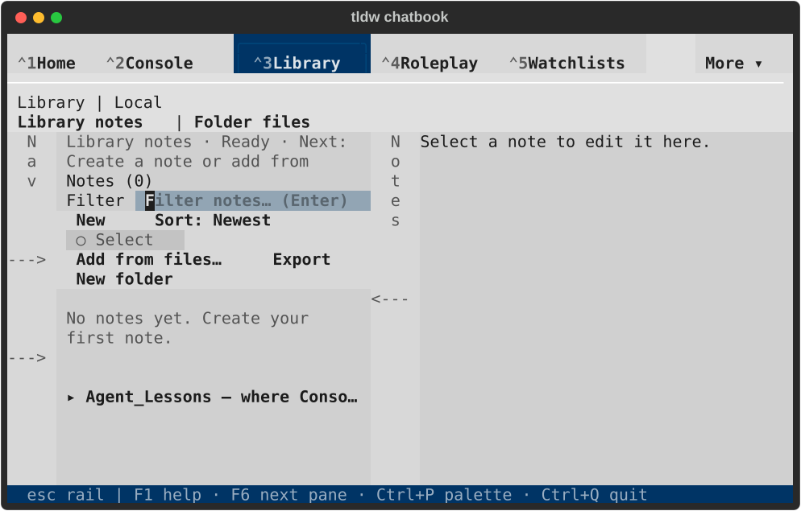
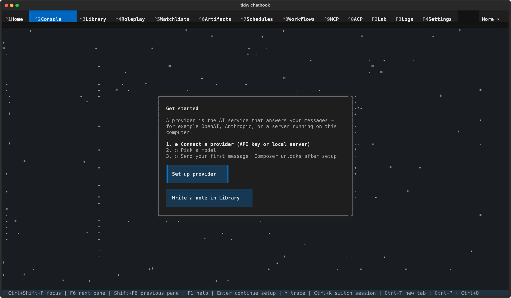
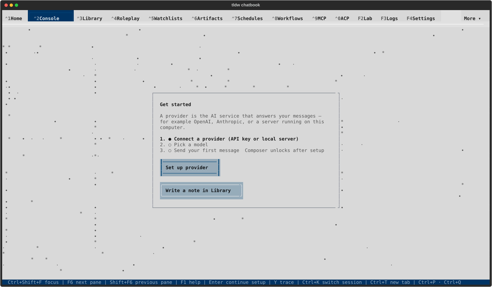

# PR #2704 — current branch visual review

These eight captures show source commit
`7c28855825491047515675c06bb71ff15e59e7eb`, after all four recorded dev integrations
and the subsequent Settings repairs. They are fresh captures of the resolved
branch, not before/after comparisons of its parents. The
[conflict audit](../../reports/2026-09-17-pr-2704-conflict-review.md) names the
selection made for every conflict block.

The existing [native runner](../2026-09-17-component-current-dev/native_check.py)
was rerun without modification in a new private profile. It uses real
`TldwCli.run(auto_pilot=...)` in a tmux PTY, asserts LinuxDriver, terminal-backed
output and the primary instance lock, and navigates Console and Library Notes
with keyboard focus at 170×48 and 80×24 in both themes. No provider request or
note edit is exercised. This is rendering/navigation evidence for these states,
not full feature or merge qualification.

All eight SVGs were visually inspected through native Quick Look PNG previews.
The focused Console setup action and Library search/filter field are visible.
Both wide Notes captures now show the complete disabled `Remove placement`
label. Both compact Notes captures still truncate the introductory next-step
status after `Create a note or add from`; that remains an open visual review
item. The compact Console setup card continues below the visible viewport.
The later Notes frames show the app-created empty `Agent_Lessons` folder; the
first wide dark frame precedes that asynchronous folder appearance.

The process returned normally with exit code zero. The receipt confirms ten
healthy private SQLite databases, zero conversations/messages, no application
errors, empty faulthandler output, released instance lock, absent process,
closed owned tmux session and unchanged default-profile fingerprints.
See [native result](native-result.json), [lifecycle](lifecycle.json), and
[capture hashes](capture-manifest.json). Adjacent `.txt` files preserve actual
terminal paint; stored captures only normalize trailing whitespace.

PR #2704 remains draft. Merging into dev requires the user's explicit green
light after visual review.

## Compact — 80×24

| Console, dark | Console, light |
| --- | --- |
|  |  |

| Library Notes, dark | Library Notes, light |
| --- | --- |
|  |  |

## Wide — 170×48

