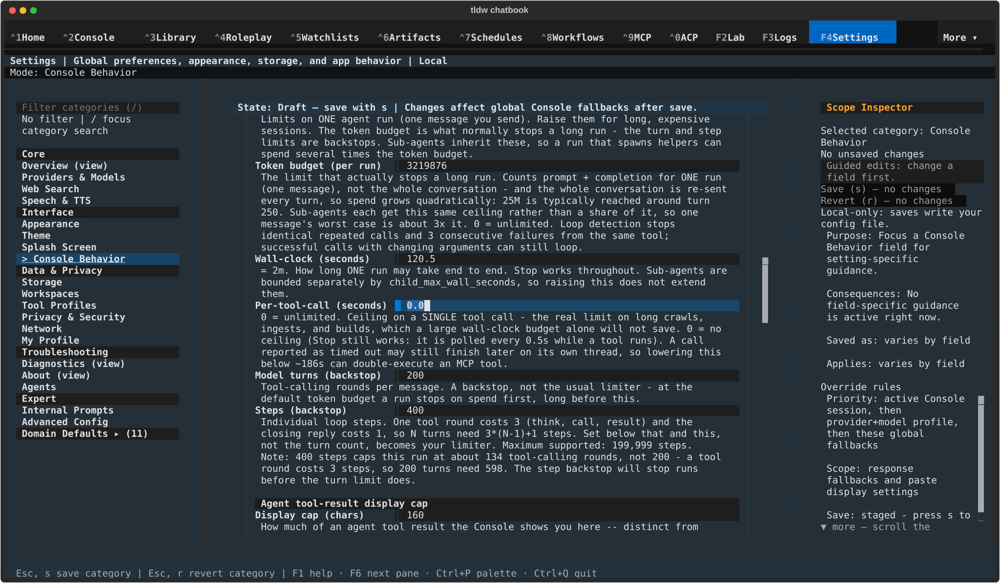
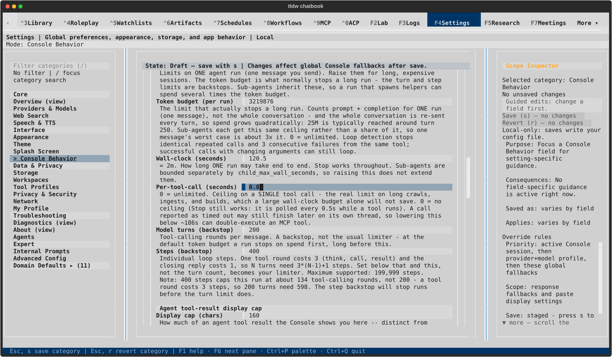
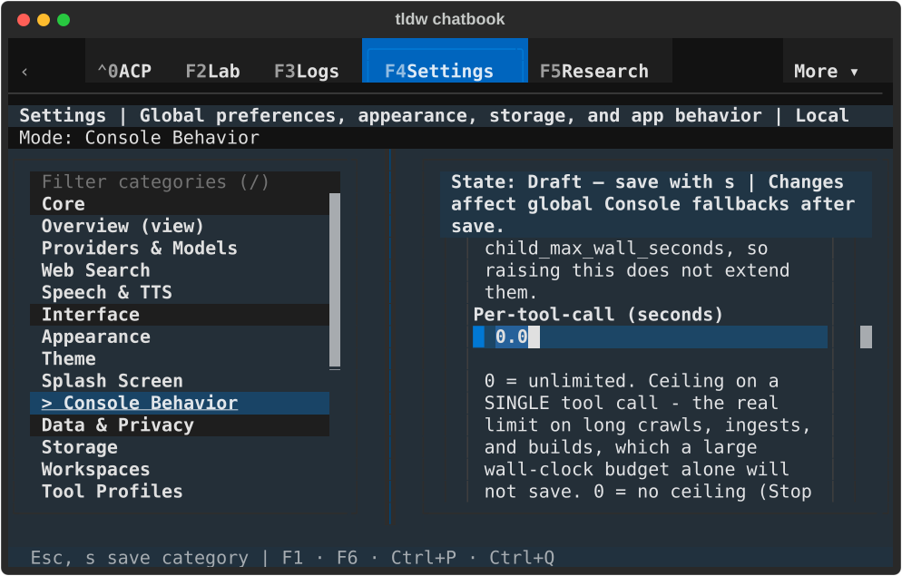
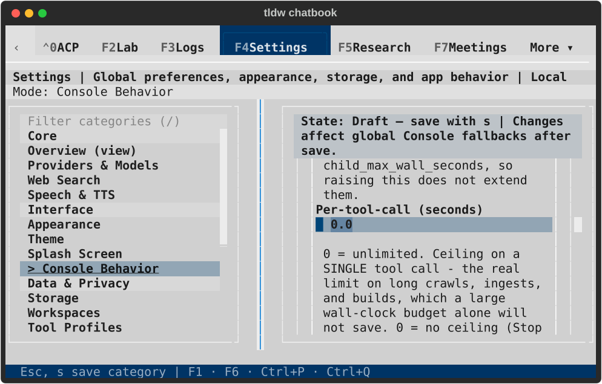
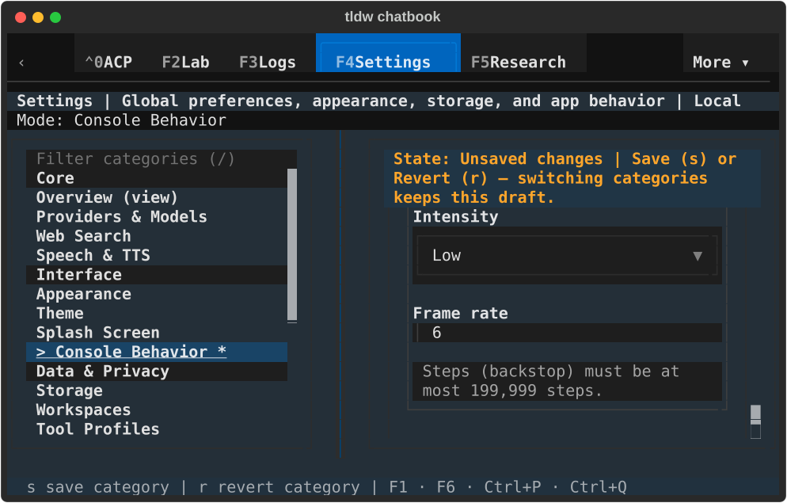
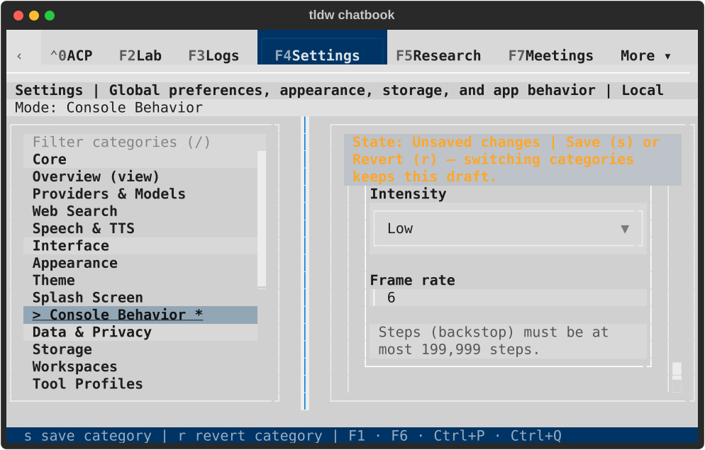
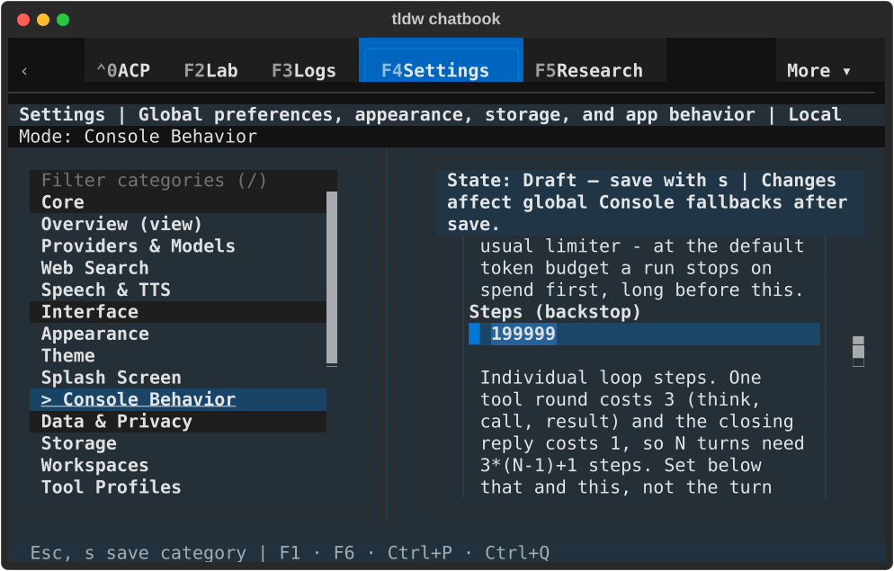
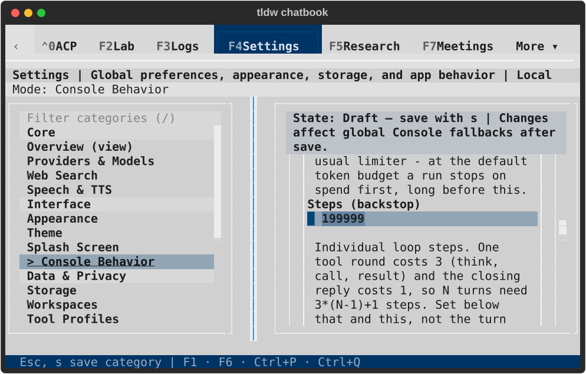

# Console agent-budget Settings — TASK-32766

Settings previously saved 200,000 Steps successfully, while the next runtime
resolution silently used 25,000. Settings now reuses the existing config cap
of 199,999 for loading, validation and help. An invalid edit remains in the
form without writing. A legacy over-limit value displays the effective default.
The runtime/config limits themselves are unchanged.

The wide form also clipped the seconds units from its two time labels. The
shorter labels retain those units within the existing 24-column form pattern.
No stylesheet or design token changes were needed.

## Verification

The mounted over-limit save and legacy-value regressions [both failed](red.txt) before
the production repair. The original budget tests initially errored on config
source ownership; their original assertions are preserved and now run through
the established process-lifetime private-profile helper. Production recovery
admission is unchanged.

- [UI budget regressions](ui.txt): 34 pass (28 original cases and six new
  regression/journey cases). Together with the related checks, 121 distinct
  targeted cases pass.
- [Runtime and design-governance checks](related.txt): 87 pass (56 runtime,
  31 token/component/bundle checks).
- [Static checks](static.txt): test/runner Ruff and formatting pass; fatal
  production checks pass. Full Settings Ruff retains the same 116 baseline
  findings, with no new diagnostics.
- [Backlog guard](backlog-guard.txt) and [diagnostic inventory](diagnostic-guard.txt)
  pass. No full test suite was run.
- Independent read-only review found no production/test correctness issue;
  its stale “No upper bounds” documentation finding is corrected.

The four keyboard journeys cover dark/light at 80×24 and 170×48: invalid
save, visible field labels/values, retained navigation drafts, Revert cancel
and confirm, injected write refusal then real retry, saved-file/app/runtime
agreement for all five fields, maximum Steps, zero/unlimited values, and
same-field focus through resize. Failure injection replaces only the public
writer for the refusal phase; the successful retry uses the real private
config writer and runtime resolver. Save feedback is checked in painted text,
normalizing line wrapping at compact width.

## Native visual confirmation

The [runner](native_check.py) uses real `TldwCli.run(auto_pilot=...)`, an owned
terminal with LinuxDriver and TTY-backed rendering, and a fresh private profile
selected before application imports. Each cell refuses Steps=200000, retains
its draft without a write, saves all five fields, checks the real runtime
resolver, then saves maximum Steps=199999 and unlimited tokens=0. Per-tool-call
zero resolves to the runtime's existing cancellable unlimited deadline.

| Size | Dark | Light |
| --- | --- | --- |
| 170×48, complete time labels |  |  |
| 80×24, complete time label and focus |  |  |
| 80×24, rejected Steps feedback |  |  |
| 80×24, accepted maximum |  |  |

All 12 SVGs were rendered and visually inspected; paired terminal text captures
and [hashes](capture-manifest.json) are retained. Source and runner fingerprints
are in [native-result.json](native-result.json).

The successful process (PID59050) returned normally with exit 0; its exact PID
was absent before closing the owned terminal. All 11 private databases passed
integrity checks, no conversations/messages were created, no application errors
or faulthandler output occurred, the instance lock was reacquired, and all three
default-profile fingerprints stayed unchanged. See [lifecycle.json](lifecycle.json).

The [first attempt](initial-native-result.json) is not counted: its wide cell
passed, then its compact paint assertion ran before the error Toast cleared.
The screenshot showed the readable notification covering the underlying result.
That process returned normally with exit 1 and was confirmed absent before its
terminal closed. The final runner waits for that notification to clear before
checking/capturing the persistent result. No product repair was needed for this
capture timing issue.

These checks qualify Settings persistence and next-run budget resolution.
They do not send provider requests or run a 199,999-step agent. The existing
category-level “Draft — save with s” instruction remains even in a clean form;
the dirty marker, enabled actions and saved receipt reflect actual state. Its
wording remains a broader Console Settings review item.

Governance: existing ADR-080 (trace ownership), ADR-150 and ADR-161
(design language/component patterns). No new ADR is required.
