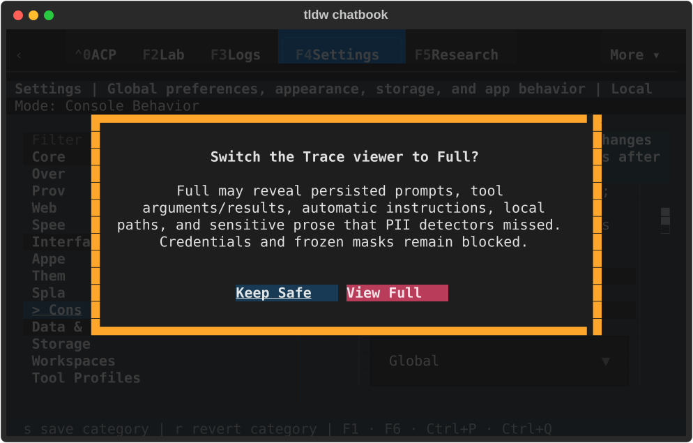
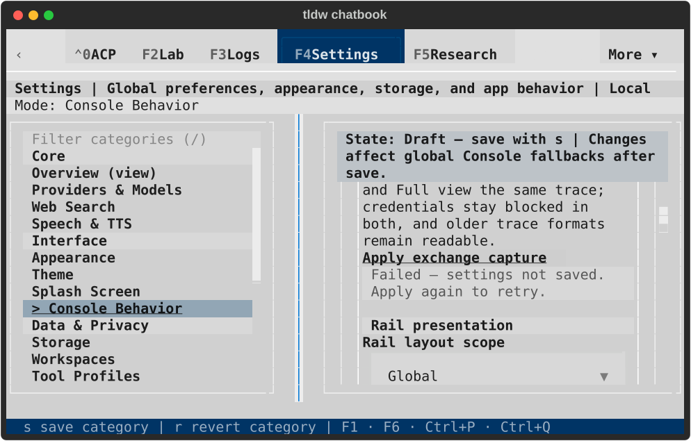

# Full trace-view Settings consent — TASK-32764

The canonical Console Behavior form now opens its real Full-view disclosure,
preserves return focus, saves through the live Console controller and recovers
from failed or stale writes. Capture, PII masking and Safe/Full viewing retain
their separate semantics under ADR-097. No stylesheet or token changed.

This receipt qualifies Settings consent and configuration persistence. It does
not qualify provider execution, trace rendering/export, masking effectiveness,
or the entire Console destination. The broader component review remains open.
PR #2704 stays draft and requires the user's visual review and explicit merge
approval. ADR required: no; this repairs the existing ADR-097 contract and its
owner-thread boundary without changing storage or provider policy.

## Repair and automated evidence

A real keyboard Apply originally raised `NoActiveWorker`: Textual's modal wait
was invoked directly from the button handler. One guarded Settings worker now
owns consent and save admission. Apply remains focusable so the modal restores
focus to the initiating control, while the admission flag rejects duplicate
requests. A cancelled worker or removed Settings screen cannot accept a late
confirmation. Rebuilding Console Behavior refreshes both visible choices and
the policy baseline, including after Diagnostics' **t** reload route.

A subsequent native run exposed a second defect masked by the old mocked
coordinator tests: offloading the whole controller raised `QueueThreadViolation`
when it read the prompt queue. The new async controller entry keeps reservation
and policy snapshots on the owner loop and offloads only configuration writing.
It shares preparation and result mapping with the existing synchronous entry.
Repeated cancellation waits for actual writer settlement before releasing the
reservation; cancellation takes precedence over a late writer error. Closing
the opening session does not misreport a committed global save as a failure.

**59 distinct targeted tests pass:** 26 UI/controller cases in
`ui-controller-final.txt`, one existing synchronous-controller compatibility
case in `sync-compatibility.txt`, and 32 token/component, bundle and boot-byte
checks in `governance.txt`. The five affected UI cases pass again after the final
failure-copy correction (`copy-confirmation.txt`). No full suite was run.

Coverage includes real modal Escape/Keep Safe/View Full at both widths; exact
private TOML and runtime policy; actual Settings recreation; duplicate admission;
write refusal, exception, cache-publication warning, stale consent and retry;
Diagnostics keyboard reload; a cancellation-suppressing late confirmation; a
real controller; repeated cancellation with saved/failed/exception outcomes;
reservation exclusion and reuse; and closure of the original session during a
held write. Delayed/failure tests substitute only the relevant writer or modal
boundary. Native tests below use the real writer and active controller.

All seven derived-artifact guards pass (`preflight.txt`). Diagnostic statements
remain unchanged: Settings 65, controller 78 (`diagnostics-review.txt`). New
Python files pass Ruff check and format; the three large existing owners retain
only inherited findings, with none introduced (`static-large.json`). Source
compilation and diff whitespace checks pass. Independent read-only review is
clear (`review.txt`). After fetching all remotes, the ID scan found TASK-32764
only in this worktree across 314 refs and 29 worktrees (`task-id-scan.json`).

Negative evidence is retained: `red-keyboard.txt` proves the modal crash,
`red-return-focus.txt` proves disabling Apply loses return focus,
`red-recovery-lifetime.txt` includes stale-retry and late-confirmation failures,
`red-diagnostics-keyboard.txt` proves the stale PII control after **t**, and
`red-live-controller.txt` proves the real coordinator save failure. The original
cache-warning fixture in `red-recovery-lifetime.txt` replaced the runtime publish
callback instead of calling it before injecting failure; that case was corrected
and is not independent evidence of a production cache-publication defect.

## Native evidence and visual review

The final run used private profile `/private/tmp/tldw-32764-native-003`, PID
69547. `native-result.json` pins the runner and production source hashes. Real
`TldwCli.run(auto_pilot=...)` used LinuxDriver and terminal-backed rendering in
an owned tmux PTY; private HOME/config/data were selected before app imports.

Each dark/light × 190×55/80×24 cell verified the complete disclosure and both
actions, cancelled without changing the file or Safe view, made the private
config directory read-only, observed actual save refusal, restored permissions,
retried by keyboard and saved Full. It then left for Console, proved Settings
was removed, reopened Settings and read Full again. A newer PII choice made
while consent was open fenced the old request; Diagnostics **t** reloaded the
choices and a fresh confirmation saved Full while preserving PII. Each cell
restored Capture Off, PII Off and Safe. The active controller was real, and the
seven original live database objects remained unchanged. No provider request
was sent.

All twelve final SVGs were visually inspected with native Quick Look previews
and their adjacent terminal-paint text. Both compact themes show the entire
failure receipt, including **Apply again to retry.** Modal content, action
labels and return focus are visible. Saved captures show the restored Full
selection, not a promise that a prior save receipt survives recreation. The
category-wide Draft banner still describes the surrounding staged controls;
the capture group has its own explicit Apply action.

`lifecycle.json` confirms normal app return, exit 0, PID absent, released instance
lock, closed owned terminal, 11 healthy private SQLite databases, zero
conversations/messages, empty faulthandler logs and three unchanged default-file
fingerprints. The four errors are expected `PrivatePathError` write refusals
(one lock-phase, three pre-replacement). Capture manifests retain both original
and whitespace-normalized stored hashes.

The `first-failure/` run stopped on the real-controller save failure, exited 1
and released its resources; its runner was reconstructed with an exact hash
match. The `first-pass/` run passed the behavioral matrix and clean lifecycle
before visual inspection prompted the final obsolete-copy correction. Neither
is presented as the final source's visual confirmation.

| Theme / size | Disclosure | Failed save and retry | Full after reopening |
| --- | --- | --- | --- |
| Dark 190×55 | [View](textual-dark-190x55-consent.svg) | [View](textual-dark-190x55-failed.svg) | [View](textual-dark-190x55-saved.svg) |
| Dark 80×24 | [View](textual-dark-80x24-consent.svg) | [View](textual-dark-80x24-failed.svg) | [View](textual-dark-80x24-saved.svg) |
| Light 190×55 | [View](textual-light-190x55-consent.svg) | [View](textual-light-190x55-failed.svg) | [View](textual-light-190x55-saved.svg) |
| Light 80×24 | [View](textual-light-80x24-consent.svg) | [View](textual-light-80x24-failed.svg) | [View](textual-light-80x24-saved.svg) |

Exchange-capture provider execution and live Trace actions, agent budgets,
backgrounds, context/memory, other Settings categories and the remaining
destinations still require their bounded reviews in the completion ledger.
