# Workspace Change Review — TASK-32771

Change Review now updates preparing, failed and ready rows while Settings stays
open, without rebuilding the workspace form or discarding an unfinished rename.
Consent conflicts and retry outcomes appear beside the action. A retry exception
reports failure instead of claiming no folders need retry. Each toggle uses the
consent revision and requested state captured when the button was pressed, so a
queued Disable cannot become Enable after a background repaint.

The existing opt-in, global availability, bounded preparation, revision checks
and retention rules remain governed by ADR-084. ADR-150/161 govern presentation.
No schema, backend policy or stylesheet changed.

## Targeted evidence

**73 distinct cases pass:** [seven new UI journeys](journey-tests.txt),
[55 related Settings and governance cases](related-and-governance.txt), and
[11 existing consent-service cases](consent-tests.txt). The UI matrix covers
dark/light at 80×24 and 170×48, real registry conflicts, controlled asynchronous
failure/retry/readiness, retained input identity/value/focus, complete painted
receipts, a single scheduled retry, and disable retaining history. Two delayed
read cases fence completion after workspace navigation or modal suspension.
The queued-activation case changes the real registry and repaints between
posting Disable and handling its message; the stale press must remain rejected.

The three original defects first [failed on the baseline](initial-red.txt).
Independent review found the additional queued-activation race in the first
repair; its [red regression](queued-intent-red.txt) now passes. An intermediate
focus repair and a compact fixture expectation are retained in
[focus diagnostics](intermediate-focus.txt) and
[input-scroll diagnostics](input-scroll-diagnostic.txt). The latter incorrectly
expected all of a long value inside a horizontally scrolling Input; the final
fixture uses a short draft while preserving identity/value/focus assertions.

The unchanged backend tests initially stopped at profile ownership before
reaching consent behavior. Applying the existing `private_profile_test` helper
isolates their imports/config; all 11 then pass. Independent AST comparison
confirmed the test bodies and assertions are unchanged. Production ownership
checks were not weakened. [Review](review.md) and [static checks](static.txt)
record no remaining introduced blocker. Settings Ruff findings fall from 116
to 114 with no new code/message diagnostics. No full suite or provider request
was run.

## Native visual review

The [runner](native_check.py) uses actual TldwCli, LinuxDriver and TTY streams,
with fresh private HOME/config/data selected before imports. Each cell has its
own real workspace registry entry, read-only folder binding and synthetic file.
A controlled first initialization failure and retry scheduling exception exercise
recovery. Releasing the second attempt runs the real initializer and shadow Git;
the runner reads the resulting HEAD and exact file content, then disables review
and confirms that history and the original file remain intact. No `.git` is
created in the bound folder. Controls are focused directly before keyboard
activation; this does not qualify every Tab route.

| View | Dark | Light |
| --- | --- | --- |
| Compact consent conflict | 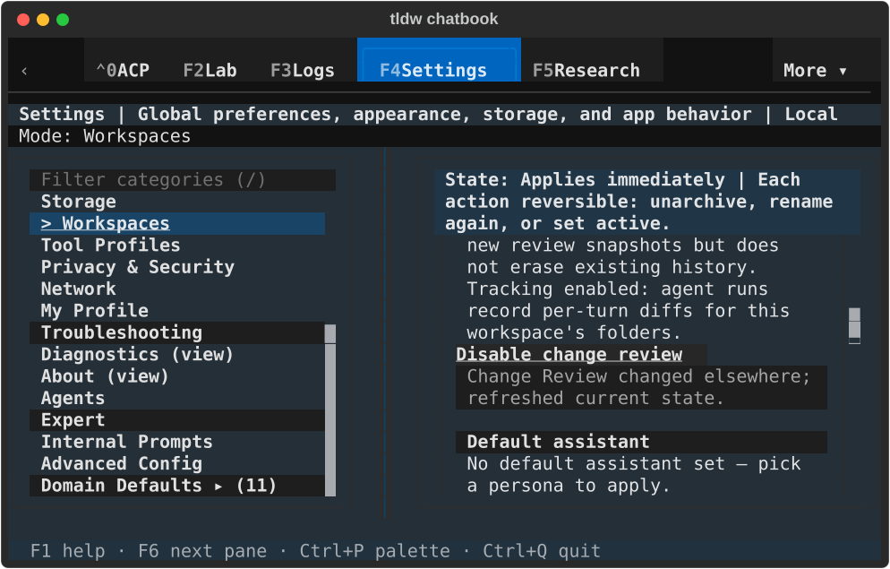 | 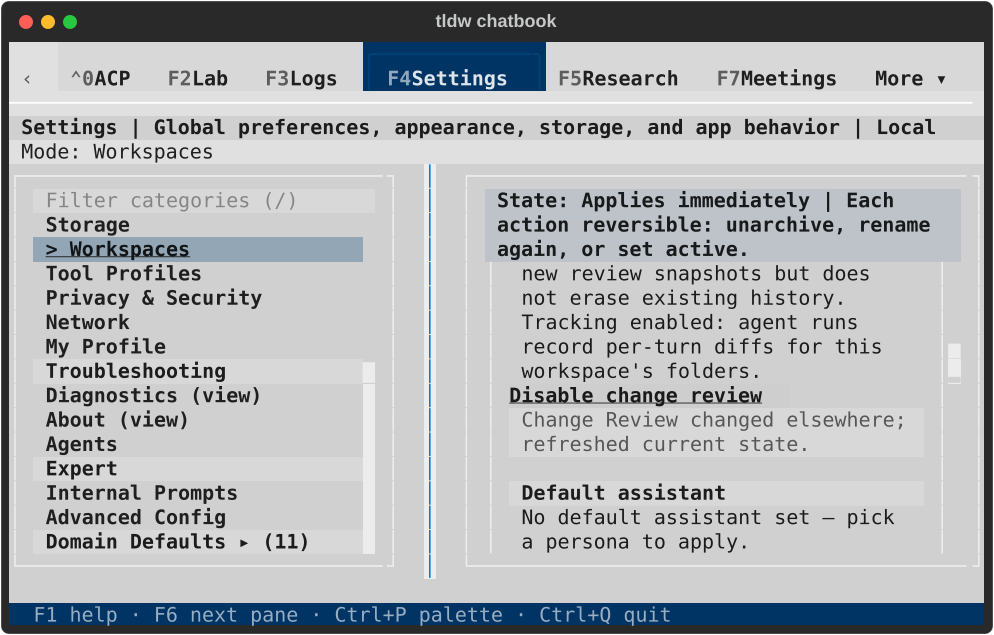 |
| Compact retry failure | 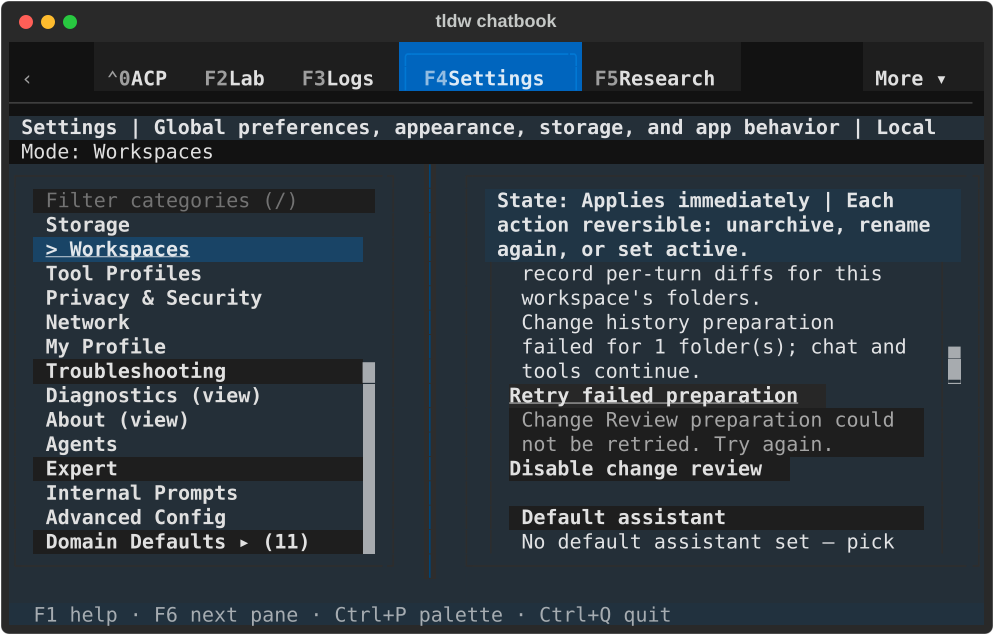 | 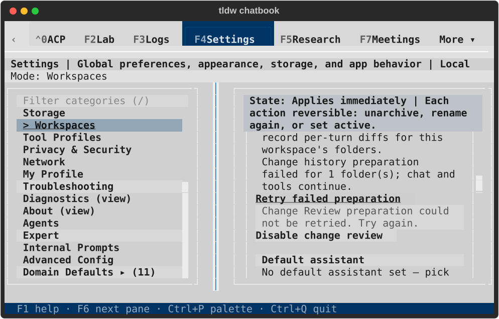 |
| Compact ready after retry | 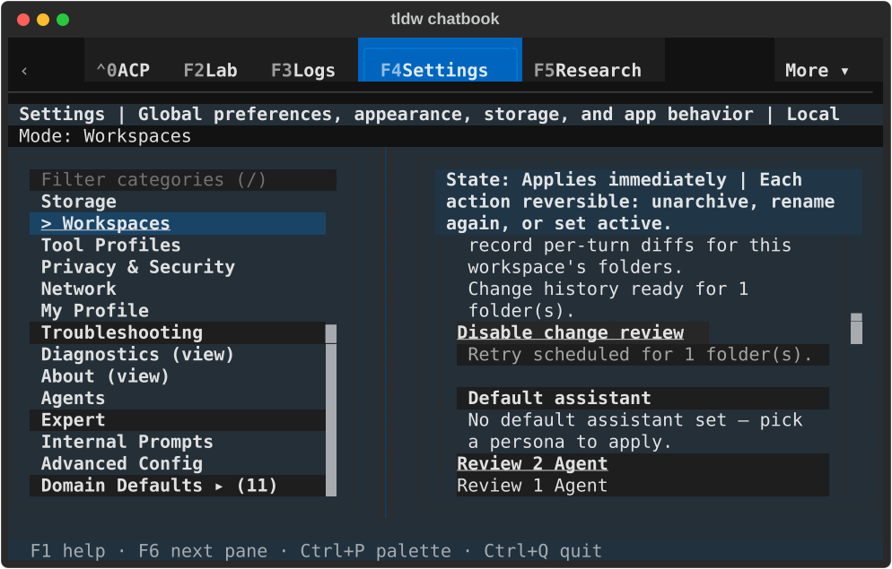 | 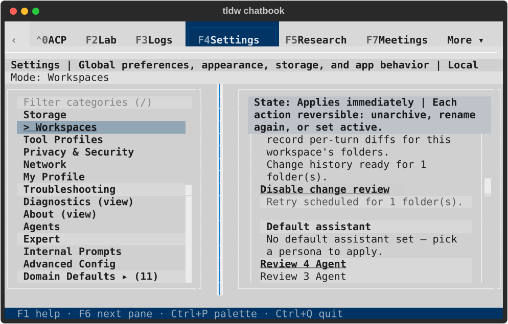 |
| Wide consent conflict | 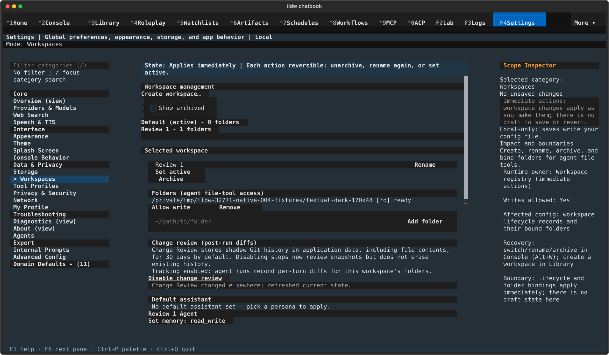 | 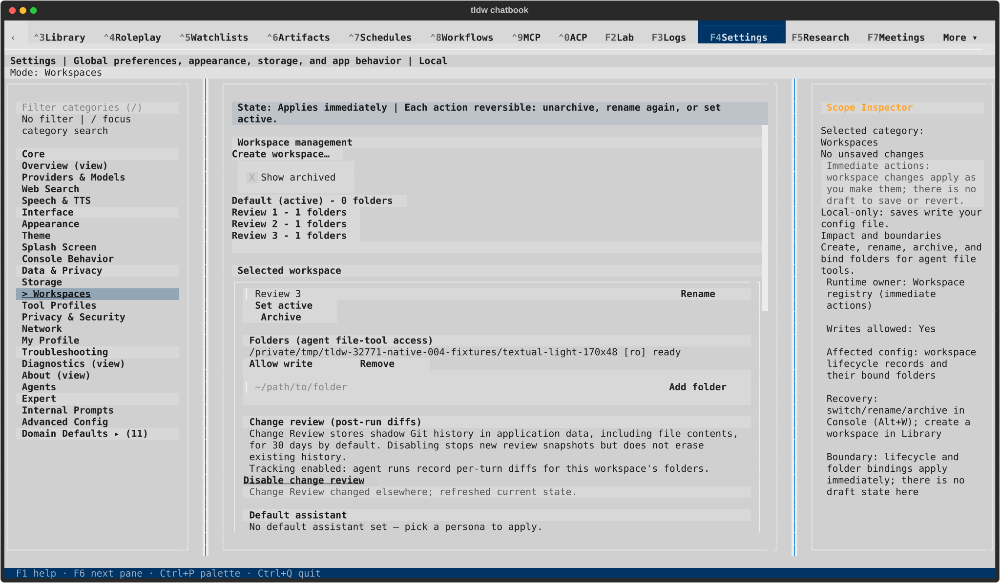 |
| Wide retry failure | 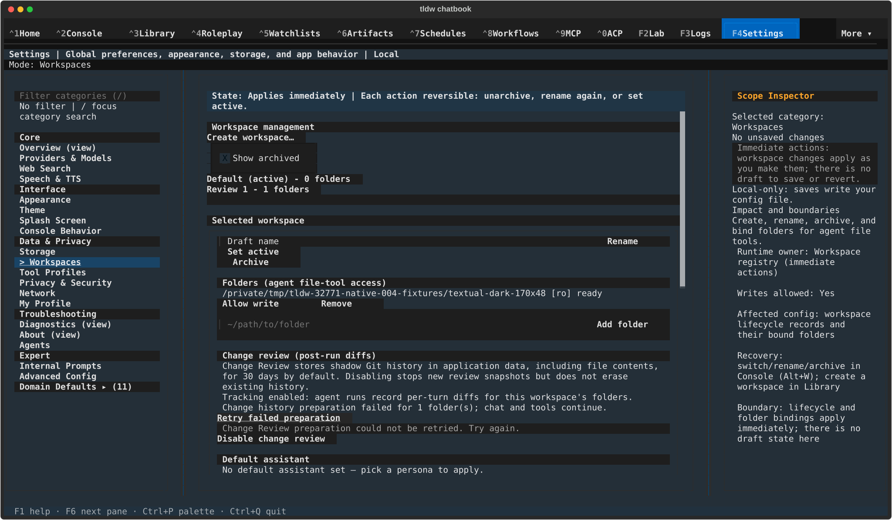 | 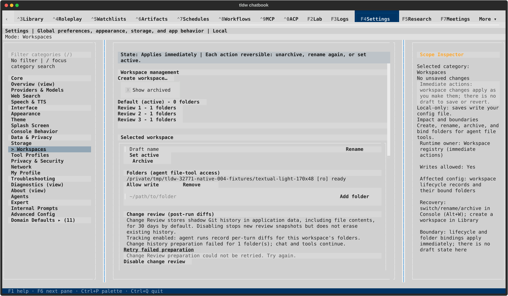 |
| Wide ready after retry |  | 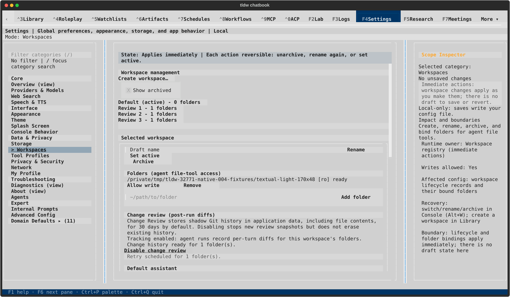 |

All 12 SVGs were rendered and visually inspected. The focused action, complete
local feedback and final ready status are visible in both layouts/themes; the
surrounding form remains scrollable. Run 004, PID 18905, passed four cells and
returned normally after Ctrl+Q with exit 0. The [result](native-result.json),
[capture hashes](capture-manifest.json) and [lifecycle receipt](lifecycle.json)
record matching final production/runner hashes, 11 healthy private databases,
zero durable conversations/messages, no app errors or faulthandler output,
a reacquired instance lock, and unchanged default-profile fingerprints. The
exact process was absent before the owned terminal closed.

Three earlier native attempts ended normally with recorded exit 1: run001 put
the fixture inside protected app storage and was correctly refused; run002
reused a workspace name; run003 added an external fixture without remounting the
workspace list. Their `failed-run*-native-result.json` and lifecycle receipts
remain here. Run004 corrects only that setup: separate sibling fixture folders,
unique names and category navigation before selecting each new entry.

This qualifies Settings consent, readiness and recovery plus initial real shadow
history. Actual Console agent-turn diff/review/revert, native imported-profile
review and complete Create/Rename/Archive/Restore dialogs remain separate
workstream reviews.
