# Console context and background Settings — TASK-32767

Settings now loads infinite background frame rates using the existing default
of 6, paints the complete `Reduce context to (%)` label, and applies saved
background changes to the existing Console. A write finishing after Settings
is removed still publishes its result through the retained application host.

The native review uncovered a second problem: an active effect timer did not
mean visible animation. Textual's transcript strips hid sibling glyphs. The
dedicated effect renderer now occupies a lower, docked child layer in the
transcript viewport, separate from message rows and exports. Its local layer
order survives the Console shell's ancestor layers. Recomposing the transcript
recreates the effect, starts its timer after mount, and stops the removed timer.
Empty-space clicks still clear selection with effects enabled or disabled.

## Targeted verification

**68 distinct targeted cases pass**; repeated runs are counted once:

- [Settings journeys](ui.txt): 10 cases covering real TOML `inf`, `-inf`, `nan`,
  the complete label, four size/theme keyboard journeys, and two live-save
  completion timings. The [later live-save rerun](live-save-final.txt) confirms
  both timings after the renderer moved into the transcript.
- [Background rendering and lifecycle](background.txt): 15 cases. Actual
  compositor glyphs prove messages and particles coexist beneath the production
  `console-shell` ancestor. Selection, negative-space clicks, scrollback,
  reconciliation, recomposition and deferred callback cleanup are checked.
- [Related checks](related.txt): eight original context-control cases, one
  config-normalization case and one appearance integration case. This earlier
  29-case run also includes the original 11 background and eight token cases,
  which overlap other receipts and are not counted twice.
- [Transcript integration](transcript-integration.txt): three cases, including
  the same appearance case plus two pruning/recomposition/scroll regressions.
- [Design and CSS governance](governance.txt): 31 cases after rebuilding the
  generated widget stylesheet. No token values or ratchet allowances changed.
- [Budget integration](budget-integration.txt): two additional successful
  adjacent save/refusal checks, already counted in TASK-32766 rather than the
  68 above.
- [Static checks](static.txt): scoped Ruff and formatting pass; touched legacy
  files introduce no new Ruff diagnostics, retain their recorded baseline
  findings, and pass fatal checks and compilation. [Backlog](backlog-guard.txt)
  and [diagnostic inventory](diagnostic-guard.txt) guards pass.

The four Settings journeys cover dark/light at 80×24 and 170×48: full labels,
keyboard selection and editing, invalid ratio/FPS refusal with drafts retained,
navigation, Revert cancel/confirm, injected write refusal followed by a real
retry, all nine persisted context values and effective policy agreement, the
summary-prompt route, Workbench scope fallback, and same-field resize focus.
Failure injection replaces only the writer during the refused attempt.

The live-save cases retain the actual existing Console and two synthetic
messages. They cover returning after save and removing Settings while the real
private writer is blocked; both publish the saved effect, stop it when disabled,
and preserve transcript identity/text. An unchanged resume retains its timer.
Original tests use the established private-profile helper because their old
config-source ownership failed before reaching their assertions.

Meaningful failures before fixes are retained for [loading/label](red.txt),
[live publication](live-save-red.txt), [late publication](late-save-red.txt),
[paint](paint-red.txt), [click selection](click-red.txt), and
[deferred cleanup](lifetime-red.txt). Independent read-only review found no
remaining blocker after the attachment guard and ancestor-layer regression.
No full test suite or provider requests were run.

## Native visual confirmation

The [runner](native_check.py) uses real `TldwCli.run(auto_pilot=...)`, an owned
terminal, LinuxDriver, and a fresh private profile selected before imports.
Each cell saves all context/effect fields, checks actual controller defaults,
refuses invalid ratio/FPS values, explains Workbench fallback, returns to a
populated Console, observes visible particles and unchanged messages, then
disables the effect and checks its timer stops.

| View | Dark | Light |
| --- | --- | --- |
| Wide context controls | 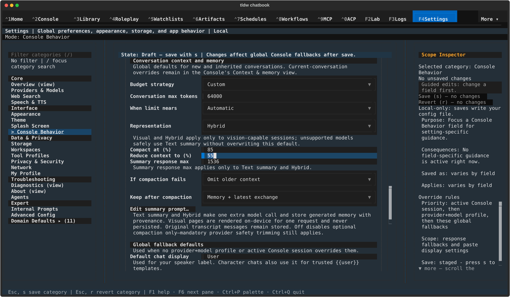 | 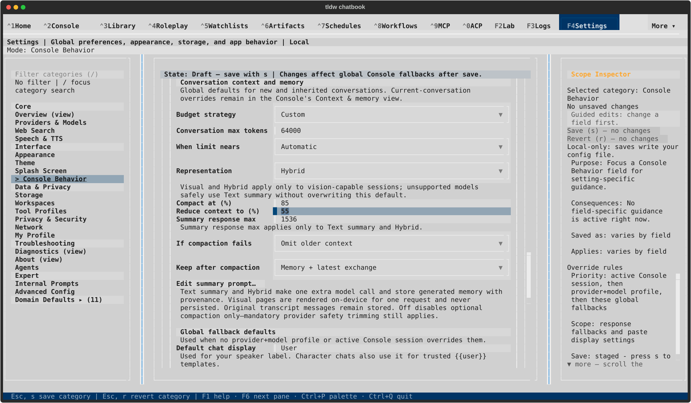 |
| Compact context label and focus | 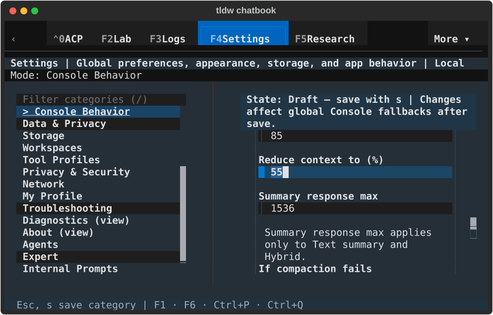 | 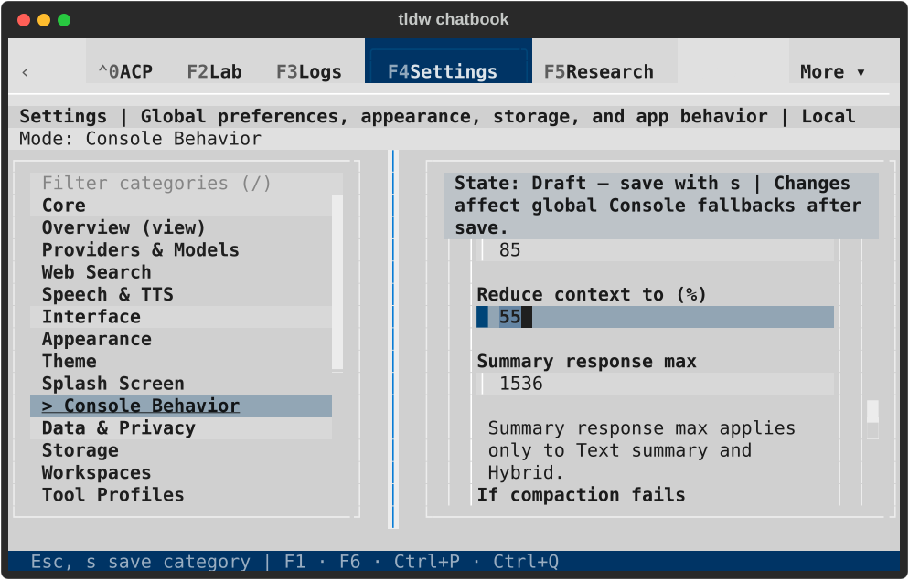 |
| Wide saved effects | 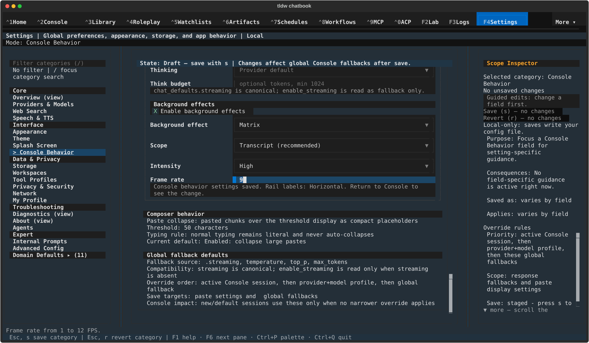 | 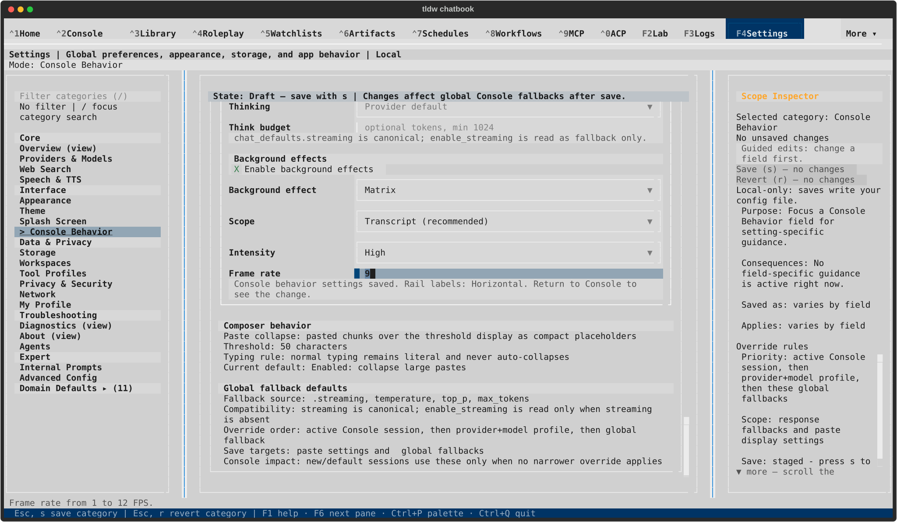 |
| Compact saved effects | 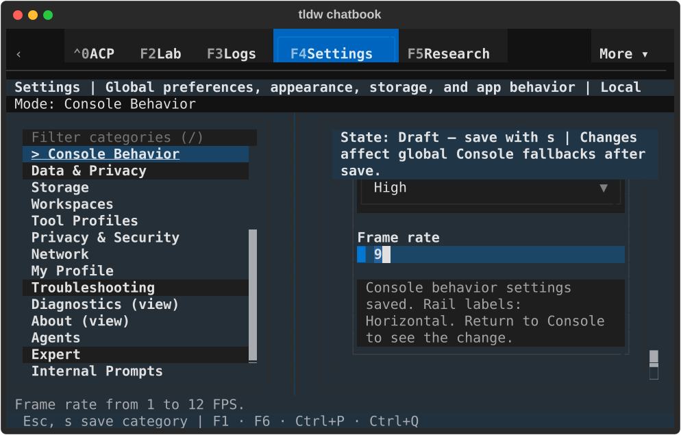 | 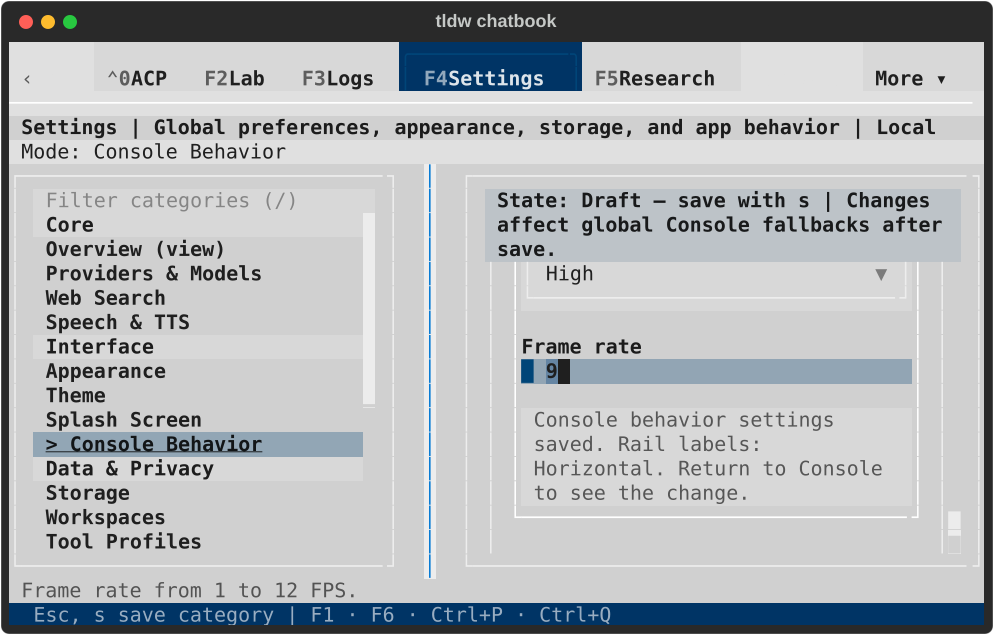 |
| Wide populated Console | 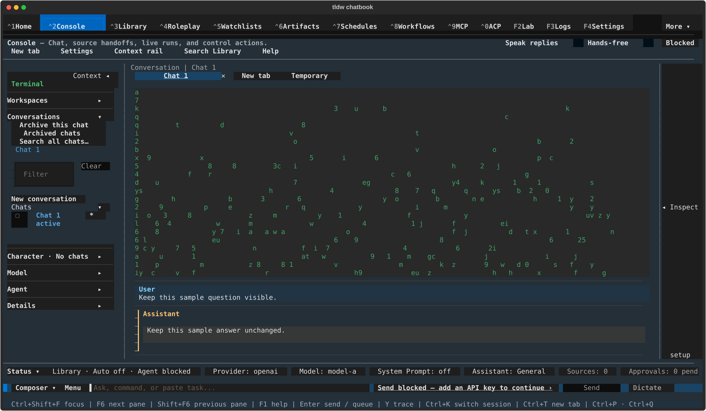 | 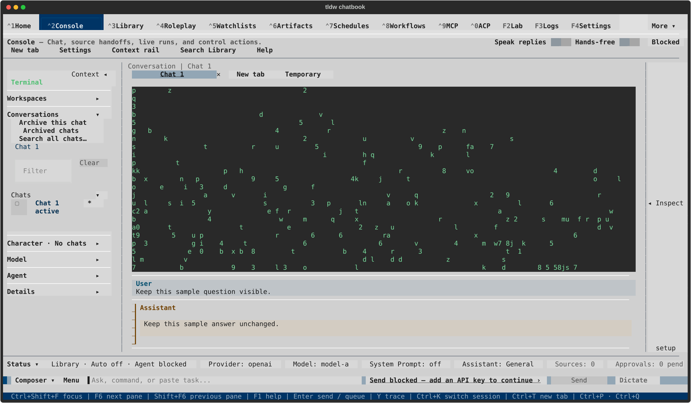 |
| Compact populated Console | 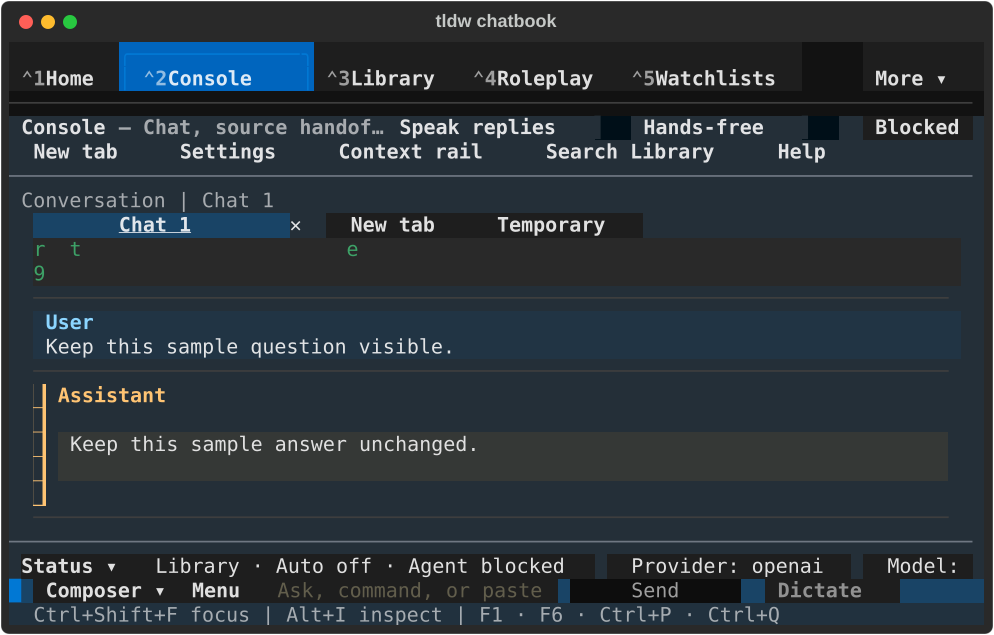 | 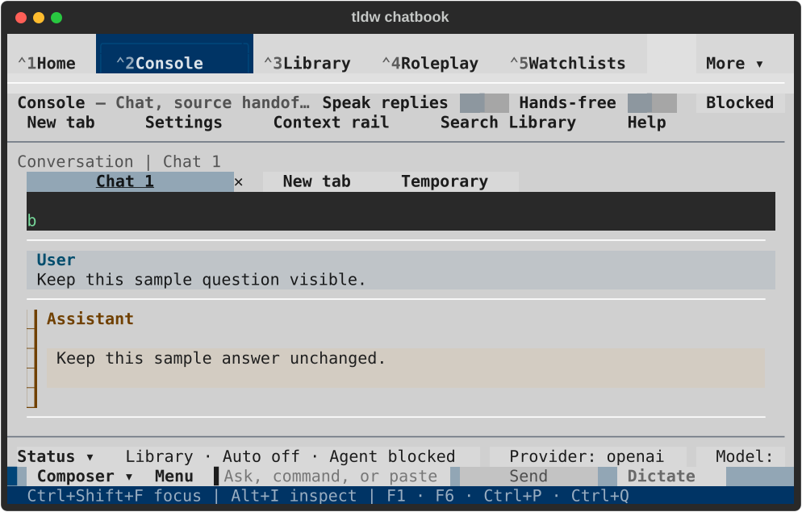 |

All 12 SVGs were rendered and visually inspected. Paired terminal text captures
and [hashes](capture-manifest.json) are retained. Wide cells expose 23 background
rows; compact cells expose two. Message rows remain opaque and readable. Matrix
keeps its existing dark effect canvas in the light theme.

Run009 (PID76009) returned normally with exit 0. Its exact PID was absent before
the owned terminal closed. All 11 private databases passed integrity checks,
the instance lock was reacquired, no application errors or faulthandler output
occurred, and all three default-profile fingerprints stayed unchanged. The two
synthetic messages lived only in memory: durable conversation/message counts
remained zero. See [result](native-result.json) and [lifecycle](lifecycle.json).

The native source hashes precede one final production change: `_sync_timer`
also requires actual attachment. That removal-only guard was verified by the
15-case background run, including the retained callback released after removal.
The [post-capture receipt](post-capture-verification.json) records the exact
source boundary; all other captured production hashes match the final sources.

Earlier attempts are diagnostic evidence, not final qualification. Run001
had a harness validation expectation error; run002 exposed missing live
publication; run003 captured before the error notification cleared; run004
predated the late-save fix; run005 stopped at the private-profile preflight;
run006 used an empty transcript; run007 passed timer assertions while its
populated screenshots exposed the invisible effect; run008 exposed the
ancestor-layer ordering problem. Their named result/lifecycle files remain
alongside representative failure images. Run009 supplies the gallery above.

These checks qualify Settings and local transcript presentation. They do not
exercise a provider's compaction response, live streaming with effects, every
effect/intensity combination, or whole-Console behavior. The category's existing
`State: Draft — save with s` instruction remains present in clean forms; the
dirty marker, enabled actions and saved receipt reflect actual state.

Governance: existing ADR-052, ADR-150, ADR-161 and the approved
[June 2 background-effects design](../../specs/2026-06-02-console-background-effects-design.md).
No new ADR is required: the renderer remains a dedicated presentation layer,
with no change to message ownership, persistence, policy or dependencies.
