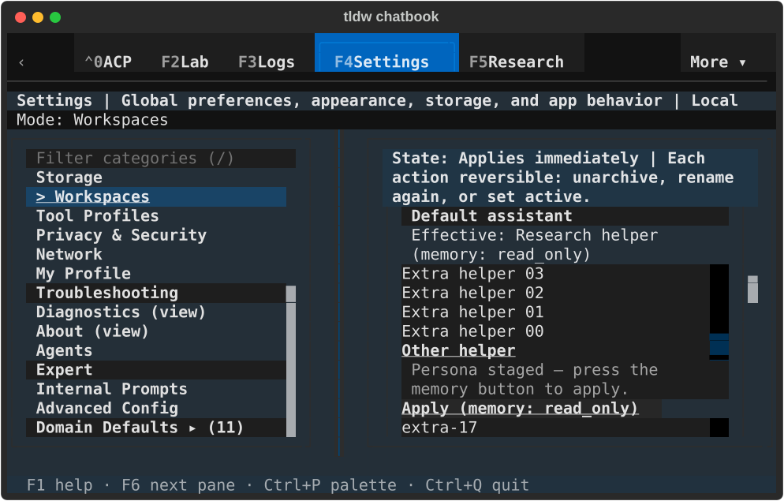
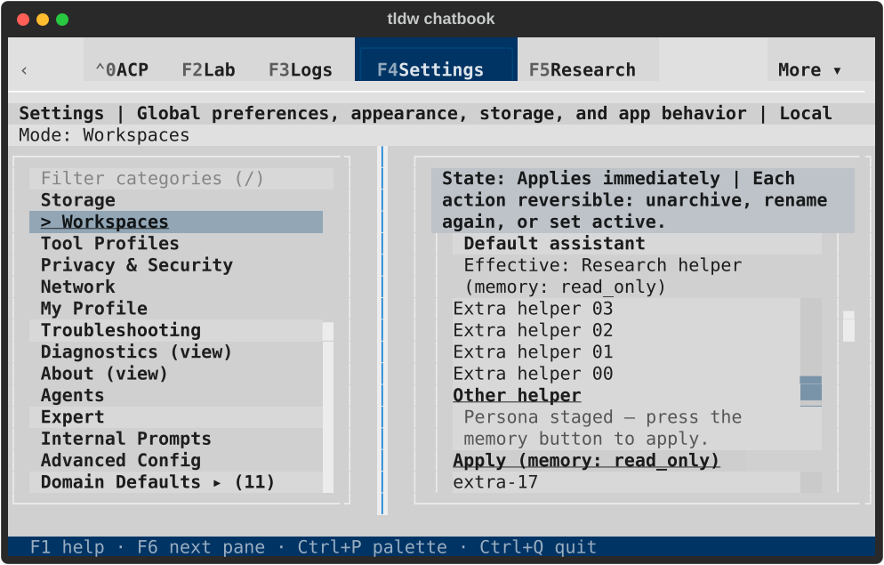
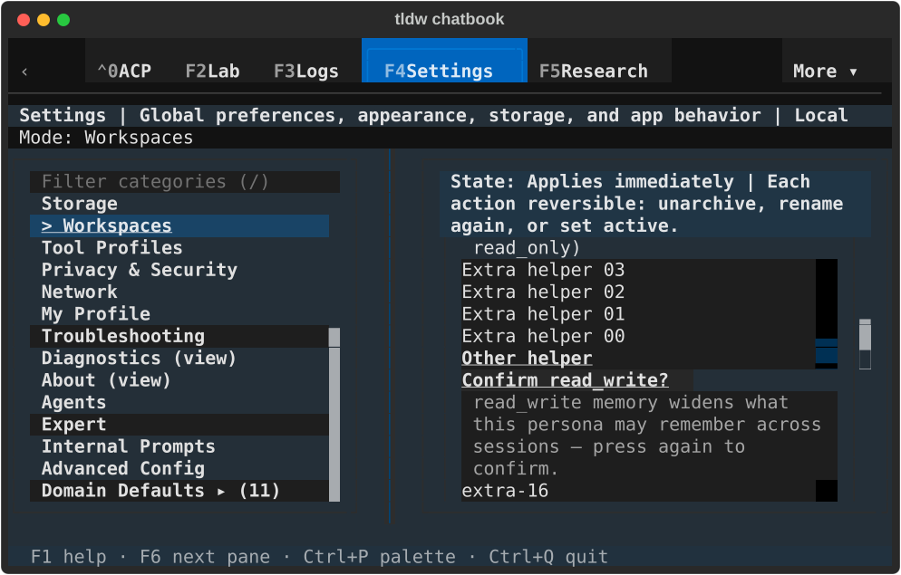
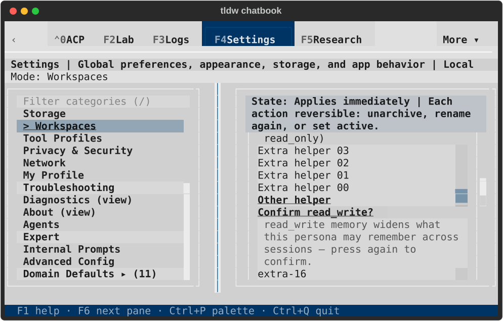
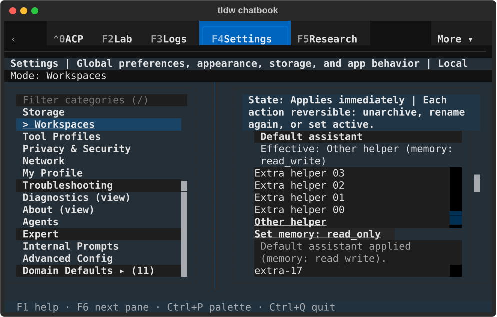
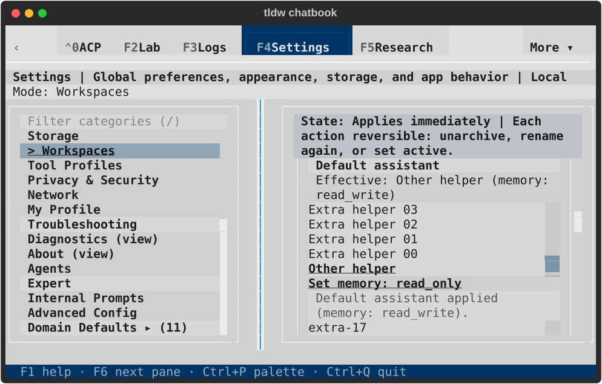
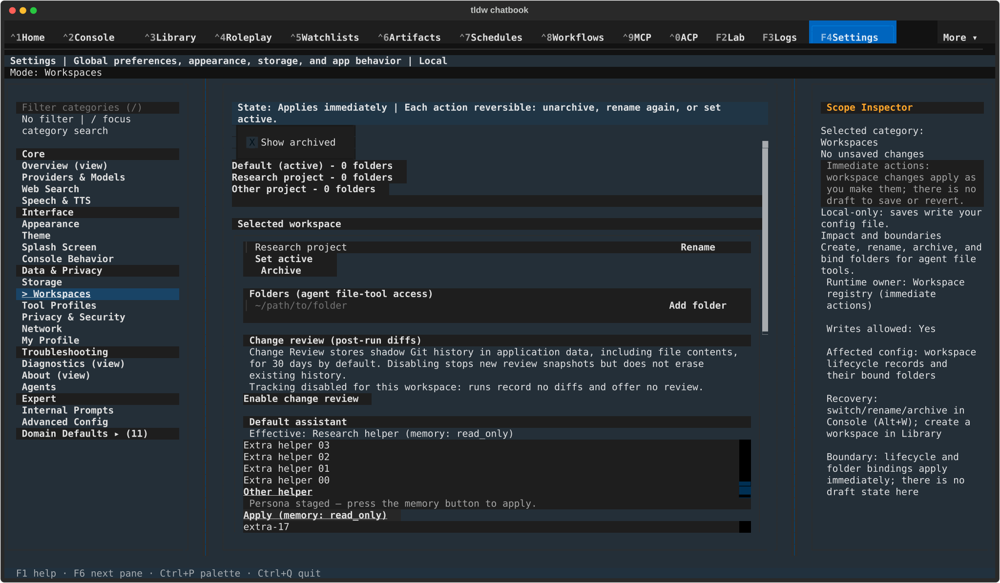
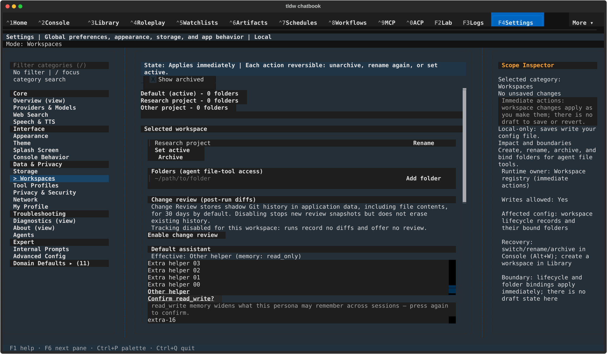
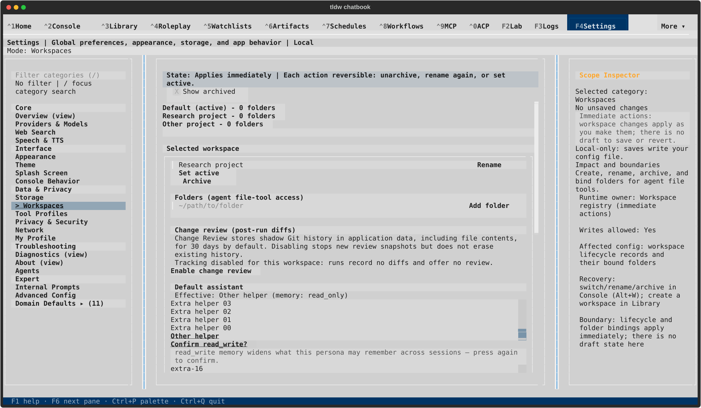
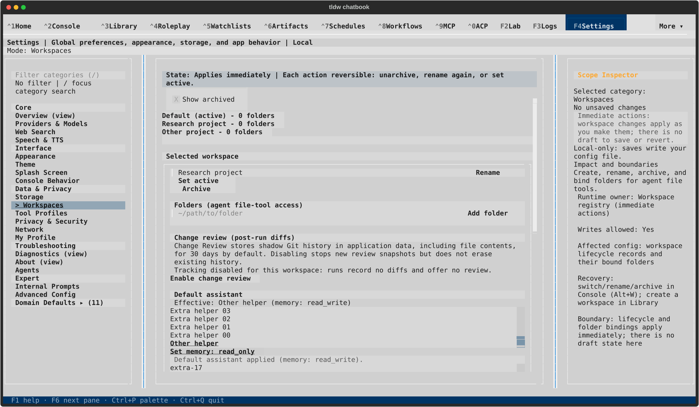

# Workspace assistant defaults — TASK-32769

Changing only a persona now retains the selected tool profile. Changing only a
profile retains the saved persona and memory mode. A new persona still starts
read-only; retaining read-write requires the existing explicit acknowledgement,
and imported profiles retain their separate first-bind review/token boundary.
Selections stay staged until Apply.

Assistant receipts now sit after their originating control. A resize hook handles
multiline text reflow; reveal checks workspace, latest receipt and attached focus
before an immediate scroll. Long pickers are bounded with the existing sizing
token and use row focus colors, avoiding the generic outline that obscured the
first letter of compact options. Only the owning Settings sheet changed and its
generated outputs were rebuilt.

## Targeted evidence

**87 distinct cases pass:** four [keyboard journeys](journeys.txt), 16 [original
assistant cases](original-final.txt), 36 related registry/session cases from the
[52-case related run](related.txt), and 31 [CSS/token/component guards](governance.txt).
Repeated original cases are counted once. The four production-CSS journeys use
22 personas and 23 profiles, real registry reads, keyboard selection/Apply,
read-write acknowledgement, injected refusal/retry, re-selection, profile-first
setup, clear, scoped staging, visible selected text, full receipt/control paint,
and stale/navigation callback checks. Individual controls are programmatically
focused; this is not a qualification of every Tab route through Settings.

Original UI tests now use established private-profile process ownership; their
[baseline](legacy-profile-red.txt) previously failed before UI assertions. The
read-write first-bind fixture now starts from a saved read-write persona: its old
read-only fixture depended on profile selection accidentally widening memory.
It still verifies that acknowledgement and imported-profile review are separate,
with no profile binding before the exact confirmation token is accepted.

Retained failures show [lost fields](field-preservation-red.txt), the [first
keyboard failure](journey-red.txt), [focus/debounce investigation](focus-and-debounce-red.txt),
[clipped confirmation](clipped-confirmation-red.txt), and [overpainted option
text](option-outline-red.txt). The test waits for Textual's normal active-button
interval before a second Enter; production debounce is unchanged. Independent
[review](review.md) also reproduced [deferred scrolling](deferred-scroll-red.txt)
and [tall-picker selection loss](tall-picker-red.txt). Both introduced gaps are
repaired. [Static](static.txt), [diagnostic](diagnostic.txt), and [Backlog
checks](backlog-guard.txt) pass; the legacy Settings module has no new Ruff findings.
No full-suite sweep or provider request was run.

## Native visual review

The [runner](native_check.py) uses actual TldwCli/LinuxDriver and a terminal, with a
fresh private profile selected before imports. Real local Persona, permission
store, registry and Tool Profile guard services create the fixtures, including
20 additional personas/profiles to exercise internal list scrolling. Each cell
stages and applies a persona, changes only a profile in read-only and read-write
modes, confirms memory independently, changes persona back to read-only, clears
the default, and checks attached focus and the responsive next Tab destination.
The wide destination is the impact pane; compact wraps to the visibly focused
Home label. The compact header's outer button chrome is not fully contained, so
that last check qualifies the painted label rather than the entire button box.

| View | Dark | Light |
| --- | --- | --- |
| Compact staged persona |  |  |
| Compact memory confirmation |  |  |
| Compact applied default |  |  |
| Wide staged persona |  |  |
| Wide memory confirmation |  |  |
| Wide applied default |  |  |

Run004 (PID1077) passed all four cells and returned normally after Ctrl+Q, exit0.
All twelve final SVGs were rendered and visually inspected: complete staging and
memory disclosure copy, selected persona text, action labels and applied status
remain readable. Lower controls remain reachable by scrolling. The [result](native-result.json),
[capture hashes](capture-manifest.json), and [lifecycle](lifecycle.json) record the
final source/runner hashes, exact process exit, 11 healthy private databases,
zero durable conversations/messages, no app errors/faulthandler output,
reacquired instance lock and unchanged default-profile fingerprints.

Earlier attempts are diagnostic evidence, with normal shutdown recorded for each.
Run001 exposed feedback hiding the still-focused Clear button ([result](failed-run001-native-result.json),
[state](failed-run001-state.svg), [lifecycle](failed-run001-lifecycle.json)).
Run002 passed the assistant actions but its blanket full-box assertion rejected
the compact header's outer chrome ([result](failed-run002-native-result.json),
[state](failed-run002-state.svg), [lifecycle](failed-run002-lifecycle.json)).
Run003 corrected that check but incorrectly expected compact's Home destination
in wide mode too ([result](failed-run003-native-result.json),
[lifecycle](failed-run003-lifecycle.json)). Run004 uses the observed responsive
destinations and retains full-box assertions for the assistant controls.

The existing confirmation arm surviving a workspace-card roundtrip remains an
explicit follow-up, as do broader assistant/navigation transitions, Change Review
consent/retry and Create/Rename/Archive/Restore modal journeys. Native first-bind
of an imported archive and provider execution are not claimed here. Existing
ADR-079/107/139/150/161 apply; no new authority, schema or architectural decision.
The broader workstream and draft PR merge-approval gate remain open.
