# Workspace memory confirmation — TASK-32770

A read-write acknowledgement now belongs to the exact workspace, saved defaults
and intended persona/profile. Changing workspace cards or categories, or
suspending Settings for another screen, discards the acknowledgement and its old
disclosure. If saved defaults change before the second press, Settings shows a
local outcome and requires a fresh review; it does not apply that stale press.
Ordinary read-only applies and imported-profile first-bind tokens retain their
existing contracts. No schema, authority, registry locking or styles changed.

## Targeted evidence

**95 distinct cases pass:** [27 assistant cases](assistant-tests.txt),
[67 related registry/session and CSS/token/component cases](related-and-governance.txt),
and one additional first-bind cancellation variant from the [two-case follow-up](first-bind-retry.txt).
The unchanged acceptance variant is counted only once. Seven new private-profile
regressions first [failed](regressions-red.txt): workspace/category/modal return
retained the old Confirm label; changed persona/profile could receive read-write
from the stale press; changed memory or cleared defaults lacked the current-state
rejection. They now pass with real registry reads and mounted keyboard controls.

The first-bind cancellation variant keeps staged fields, clears the memory arm,
retains saved values, restores Apply, and requires a new first press followed by
a second press and a fresh exact-token review. The existing delayed-apply cases
continue to preserve newer staging. [Static/guard checks](static.txt) and
[independent review](review.md) pass. Settings retains its 116 existing Ruff
findings with no new code/message diagnostics. No full suite or provider request
was run. One initial related-test invocation used a nonexistent filename and
collected no tests; the corrected 67-case command above is the evidence.

## Native visual review

The [runner](native_check.py) uses actual TldwCli, LinuxDriver and TTY streams,
with fresh private HOME/config/data selected before imports. Real Persona,
permission-store, registry and Tool Profile guard services seed the fixtures,
including 20 extra personas/profiles. Each theme/size cell arms memory, returns
through another workspace and a Settings category, and opens/cancels the real
Create workspace dialog. Each return restores the unarmed action. It then
changes the actual private registry while the card remains rendered, verifies
that the stale second press writes nothing, and completes a fresh two-press
acknowledgement for the new defaults. Returning to read-only remains one press.
Controls are focused directly before keyboard activation; this does not qualify
every Tab route or the complete Create dialog workflow.

| View | Dark | Light |
| --- | --- | --- |
| Compact fresh first press after return | 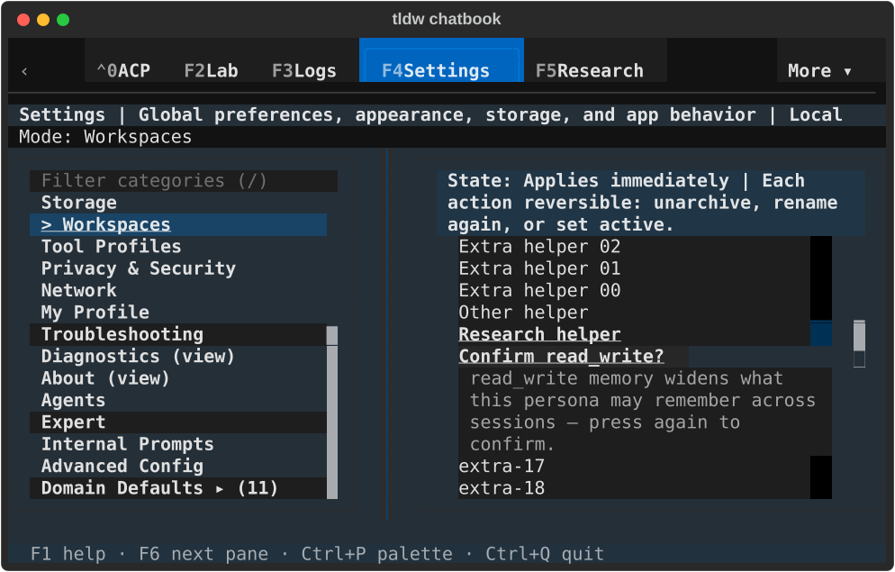 |  |
| Compact changed defaults rejected | 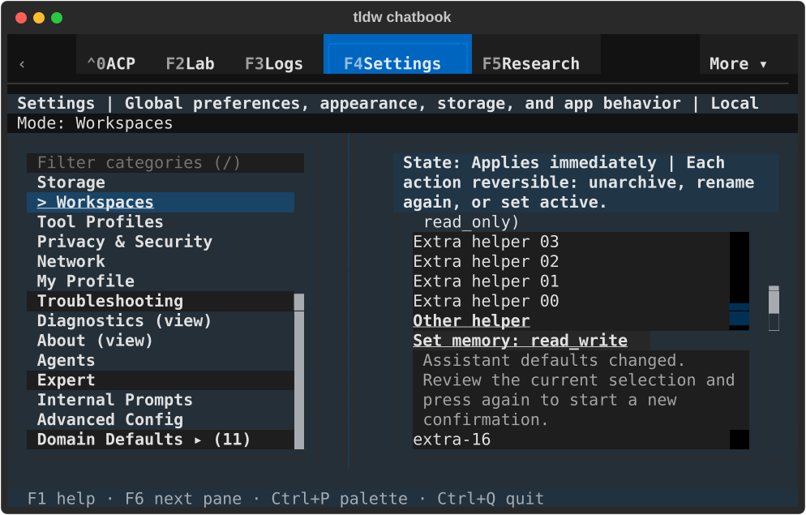 | 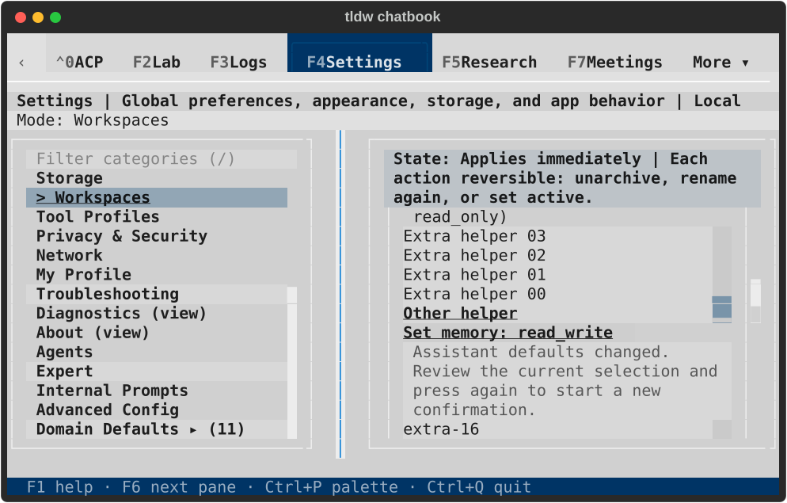 |
| Compact current defaults applied | 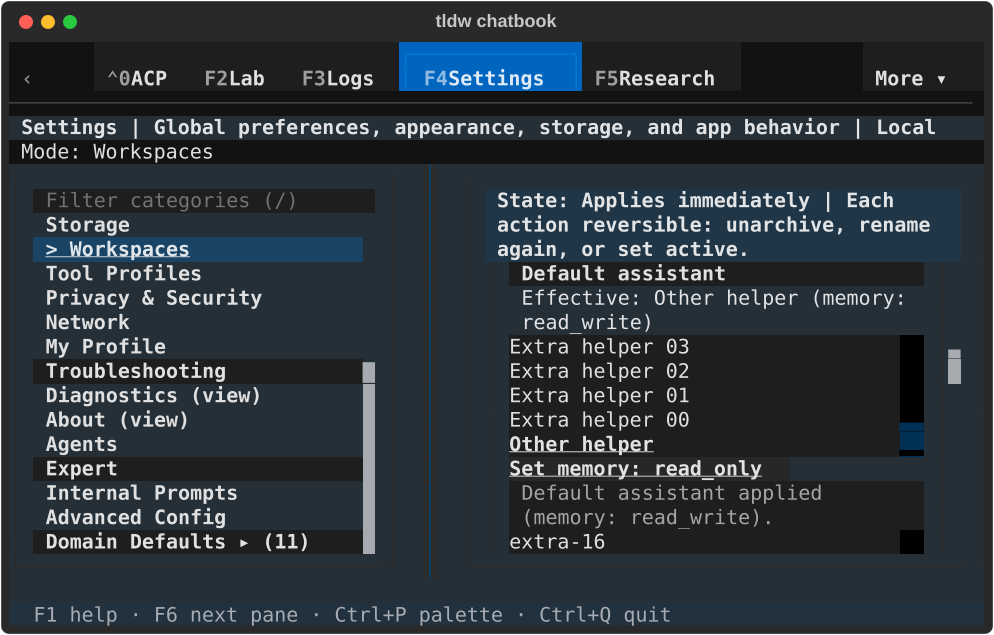 | 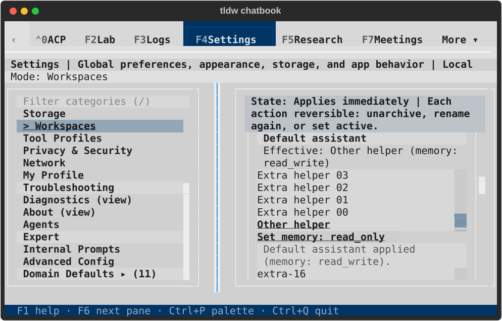 |
| Wide fresh first press after return | 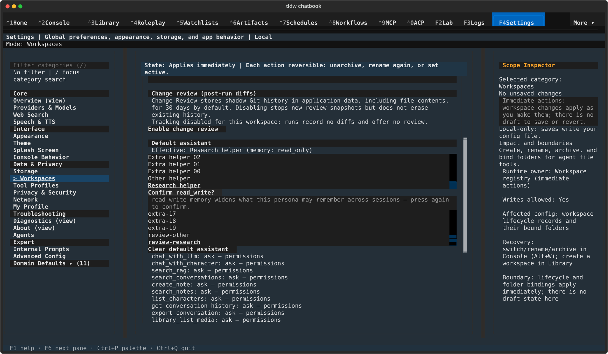 | 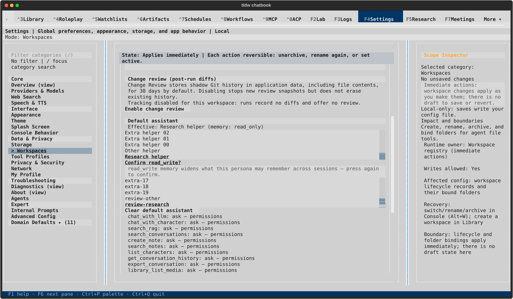 |
| Wide changed defaults rejected | 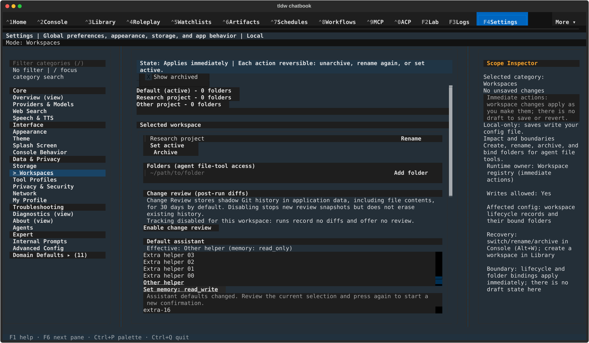 | 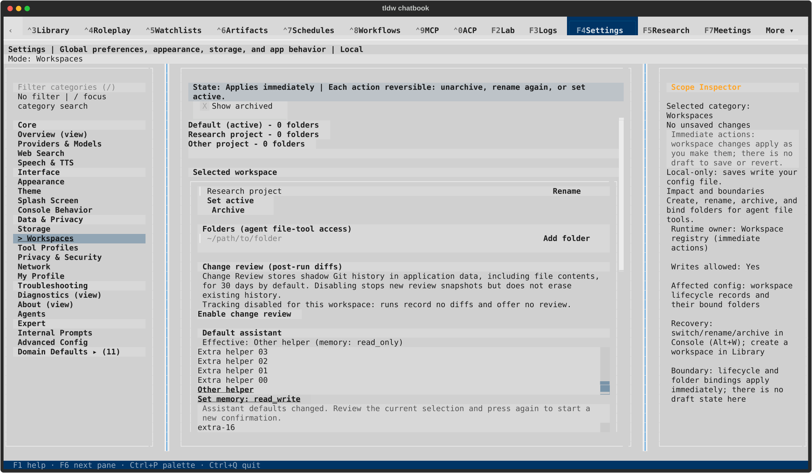 |
| Wide current defaults applied | 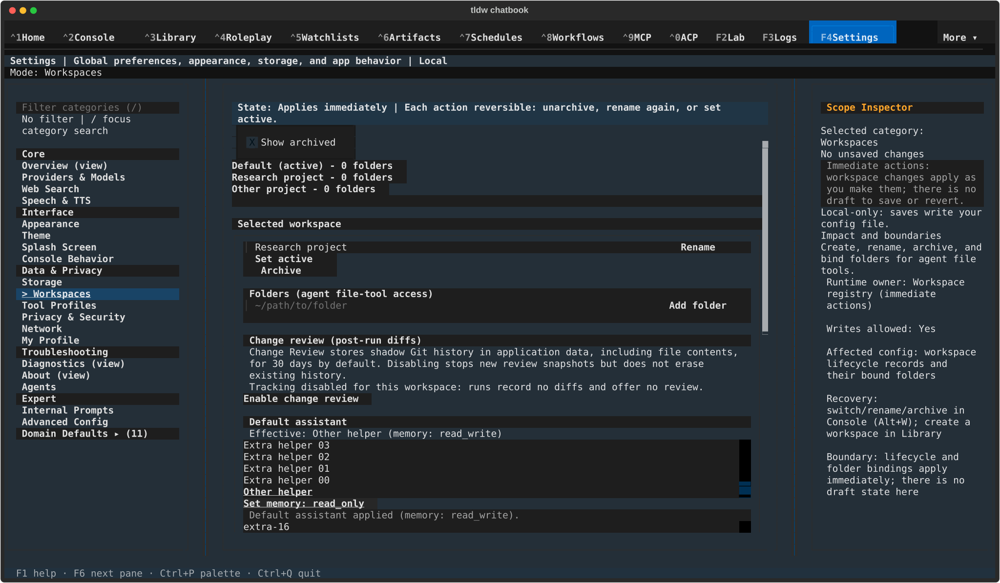 | 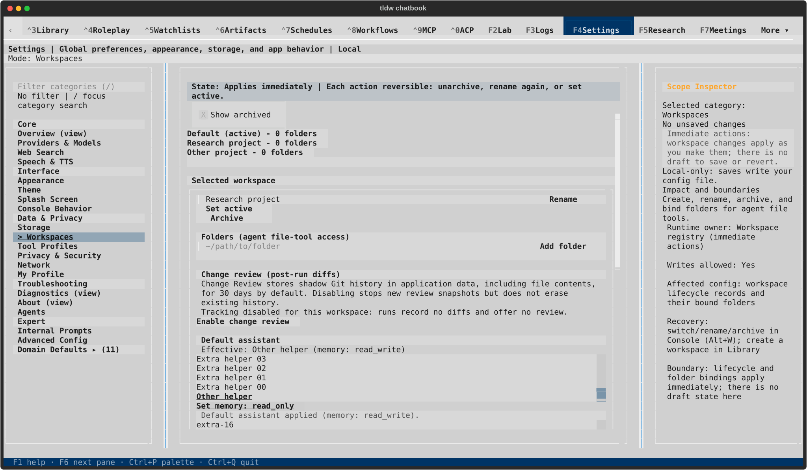 |

All 12 SVGs were rendered and visually inspected. Action labels, selected persona,
wrapped acknowledgement/rejection text and final outcome are readable at 80×24
and 170×48 in both themes; other parts of the form remain scrollable. Run 001,
PID 4542, passed all four cells and returned normally after Ctrl+Q with exit 0.
The [result](native-result.json), [capture hashes](capture-manifest.json), and
[lifecycle receipt](lifecycle.json) establish final production/runner hashes,
11 healthy private databases, zero durable conversations/messages, no app errors
or faulthandler output, a reacquired instance lock and unchanged default-profile
fingerprints. The exact process was absent before its owned terminal closed.

Existing ADR-079/107 govern the acknowledgement and first-bind boundaries;
ADR-150/161 govern presentation. This is a UI acknowledgement check at the second
press, not a new registry transaction/version lock. Native imported-profile
review, Change Review consent/retry and full Create/Rename/Archive/Restore
journeys remain open in the broader feature/component workstream.
