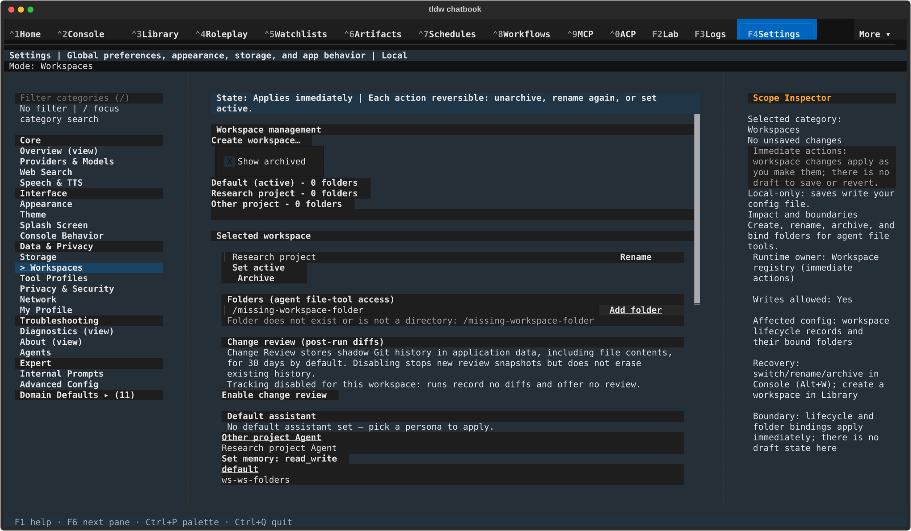
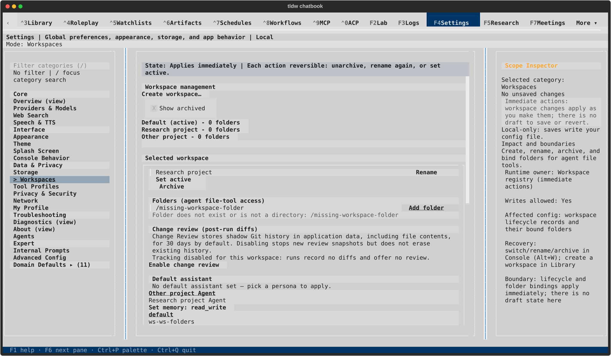
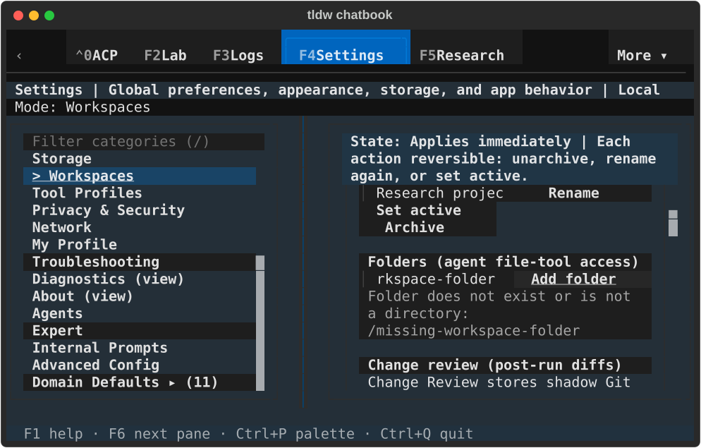
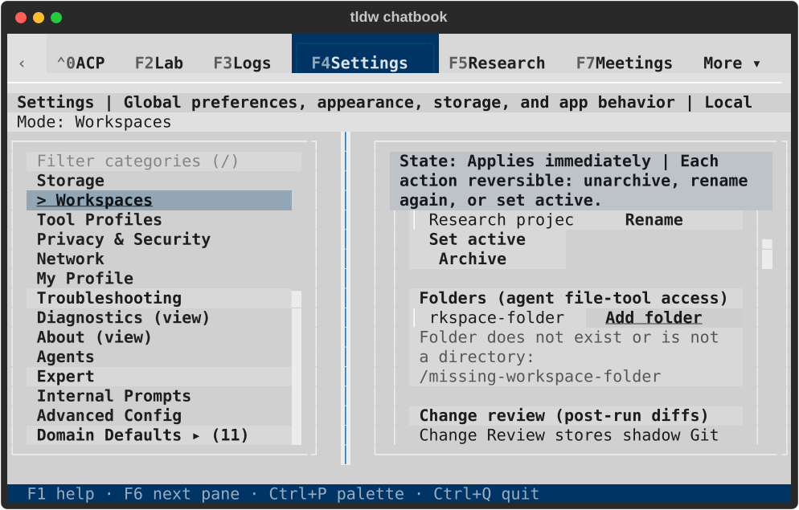
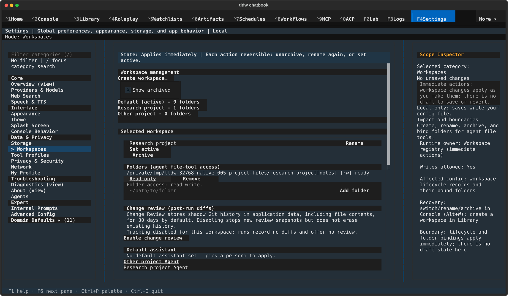
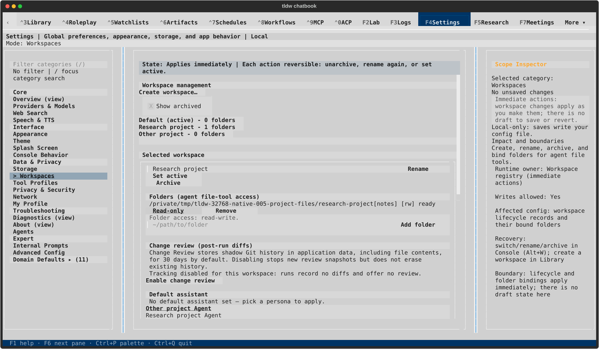
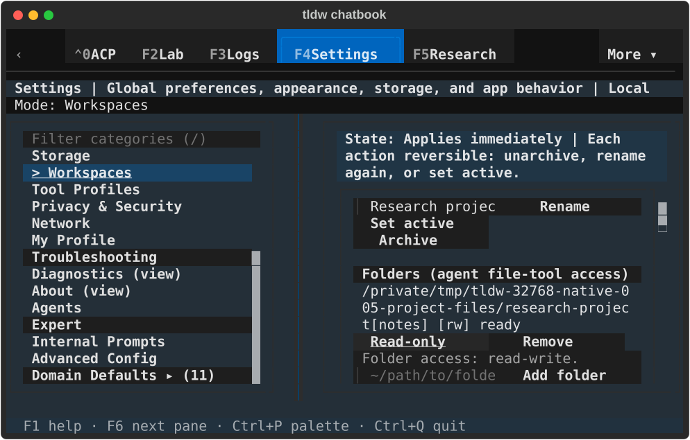
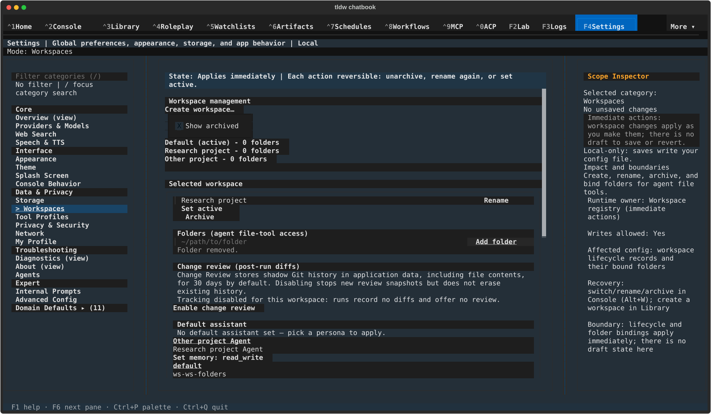
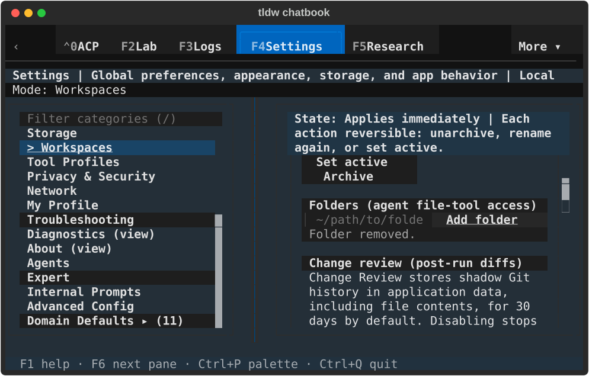
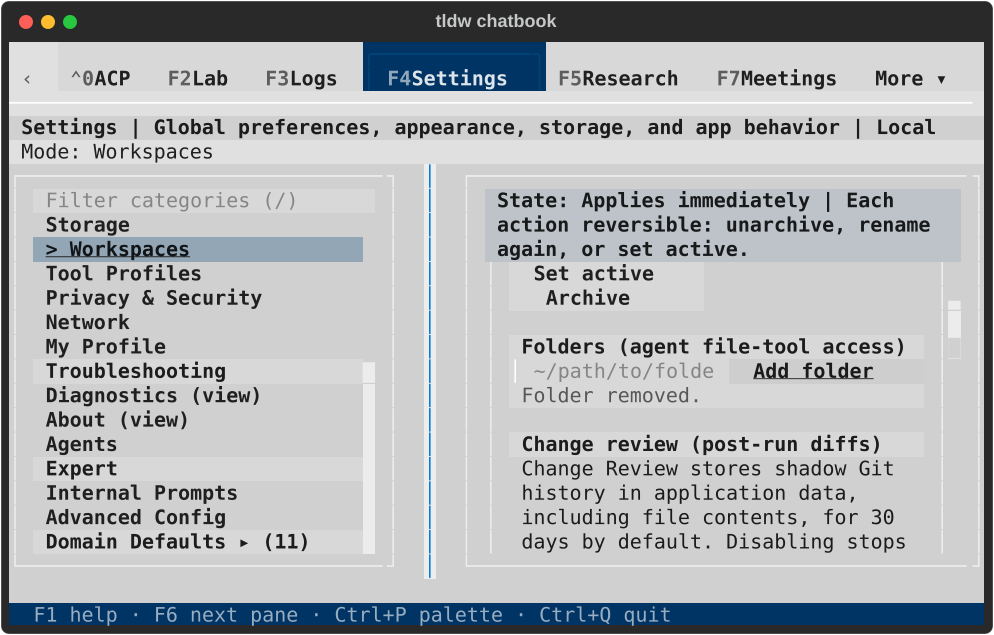

# Workspace folder feedback — TASK-32768

Folder errors and successful add/access/remove outcomes now appear beside their
controls. Bound paths and [ro]/[rw] labels render literally, preserving bracketed
folder names and visible access state after workspace reselection. Invalid or refused adds retain the editable path. The latest receipt
is scoped to its workspace and binding, and its deferred reveal runs only while
the corresponding action still owns focus. Successful removal restores focus
by querying the replacement Add button after the pane rebuild.

The keyboard review also found that the workspace list could shrink to one row
while containing three buttons. Natural height keeps those buttons inside their
parent's bounds so the detail pane can scroll a focused row into view. Only the
owning Settings source sheet changed; the generated Settings sheet was rebuilt.

## Targeted evidence

The four [folder journeys](folder-journeys.txt) cover dark/light at 80×24 and
170×48: missing paths; injected add/access/remove refusals followed by real
retries; fresh registry reads for read-only → read-write → read-only; workspace
switching without leaked feedback; removal without deleting files or changing
the active workspace; replacement control identity, attachment, Tab traversal
and resize focus. They use production CSS, real keyboard editing/actions and a
real private registry. Painted assertions cover bracketed fixture names and
[ro]/[rw] labels after access changes and workspace reselection. Individual controls are programmatically focused; this
is not a qualification of every forward-Tab route through Workspaces.

The [related run](related.txt) contains 20 existing Workspaces cases and 13
CSS/token checks. Original workspace assertions now execute in the established
private-profile process because their earlier ownership mismatch failed before
reaching UI assertions ([baseline](legacy-profile-red.txt)). Two older checks
were repaired: compact Overview now checks its visible Providers & Models
recovery button rather than the intentionally hidden Theme inspector button;
the folder test waits for the replacement binding row before reading its label.
Their earlier failures are retained in [legacy assumptions](legacy-assumptions-red.txt).

The [removal rerun](removal-final.txt) covers the final delayed-focus schedule and
keyboard traversal plus the existing add/access/remove case. Repeated cases
are counted once: **37 distinct targeted cases pass**. The delayed-focus test
holds an old Add focus request until after pane replacement; it proves recovery
cannot depend on old-control timing, without emulating Textual's private prune
implementation. Native run002 supplies the actual during-teardown failure.

Failures before the repairs are retained for [offscreen feedback](red-feedback.txt),
[collapsed list focus](red-list-focus.txt), and [removal focus](red-removal-focus.txt), and [hidden access/path text](red-access-label.txt).
The [before image](before-compact-invalid.svg) is a headless production-CSS
capture, not native evidence. Scoped [static checks](static.txt),
[Backlog IDs](backlog-guard.txt) and [diagnostic inventory](diagnostic-guard.txt)
pass. No new Ruff diagnostics were introduced in the legacy Settings module.
Independent read-only review checked the source changes and the native race.
No full repository sweep or provider requests were run.

## Native visual review

The [runner](native_check.py) uses the actual TldwCli, LinuxDriver and an owned
terminal, with a fresh private profile selected before imports. Two named
workspaces are seeded through the real registry; this does not qualify the
Create modal. The bound folder is an owned temporary sibling outside protected
app data. Each size/theme cell rejects a missing path, adds the real folder as
read-only, changes write access both ways, switches workspace and back, removes
the binding, and verifies the fixture file and active Default remain unchanged.
It asserts full painted feedback, current attached focus and Tab routing.

| View | Dark | Light |
| --- | --- | --- |
| Wide invalid path |  |  |
| Compact invalid path |  |  |
| Wide write access |  |  |
| Compact write access |  |  |
| Wide removal |  |  |
| Compact removal |  |  |

Run005 (PID89635) completed all four cells and returned normally after Ctrl+Q,
with exit 0 and its exact PID absent before the owned terminal closed. All 11
private databases passed integrity checks, the instance lock was reacquired,
no application errors or faulthandler output occurred, durable conversation and
message counts stayed zero, and all three default-profile fingerprints were
unchanged. [Result](native-result.json) and [lifecycle](lifecycle.json) record
these checks. Captured runner and production hashes match the final files.

All 12 final SVGs were rendered and visually inspected. Full errors, bracketed
folder names, [rw] state, action labels and focused controls paint in both themes
and sizes. Paired terminal captures and [hashes](capture-manifest.json) are retained.

Earlier attempts are diagnostic evidence. Run001 correctly refused a test folder
placed inside protected app data ([result](failed-run001-native-result.json),
[lifecycle](failed-run001-lifecycle.json)). Run002 exposed a queued focus request
for the old Add during pane teardown ([result](failed-run002-native-result.json),
[state](failed-run002-state.svg)). Its initial Ctrl+Q did not route; clicking the
live category search restored focus so normal quit could complete. That assisted
cleanup is recorded separately in its [lifecycle](failed-run002-lifecycle.json)
and is not counted as successful keyboard shutdown qualification. Run003 passed
the folder journey and quit cleanly, but inspection exposed Rich markup consuming
[ro]/[rw] labels. Its [result](pre-label-run003-native-result.json) and
[lifecycle](pre-label-run003-lifecycle.json) predate the literal-text correction;
the refreshed final gallery includes bracketed folder names and access assertions.
Run004 also passed ([result](pre-helper-run004-native-result.json),
[lifecycle](pre-helper-run004-lifecycle.json)); run005 refreshes that evidence
against the final runner with explicitly bound helper-loop variables.

This slice covers folder feedback and selection recovery. The 20 existing cases
preserve lifecycle, archive/restore and Change Review behavior within their
fixtures; they do not replace a new native review of those modal journeys.
Workspace assistant defaults, Change Review consent/retry and Create/Rename/
Archive/Restore dialogs remain separate bounded reviews. Folder authority,
storage and immediate commit semantics are unchanged. Existing ADR-028/033/150/
161 apply; no new ADR is needed.
