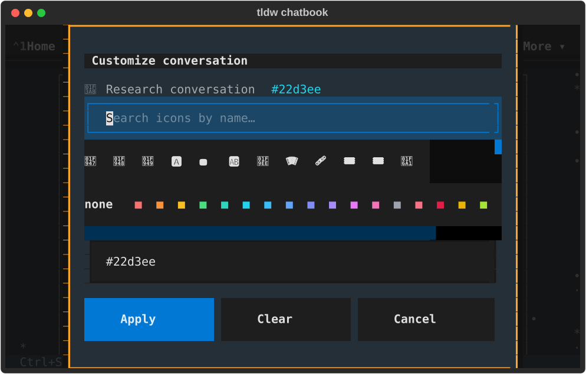
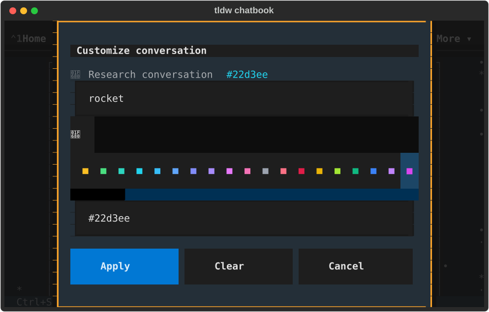
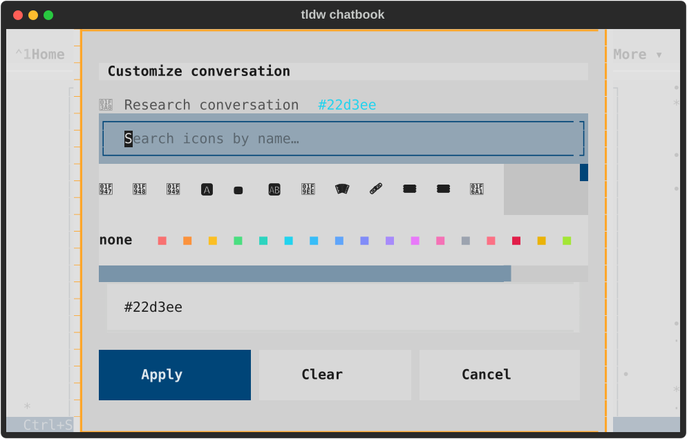
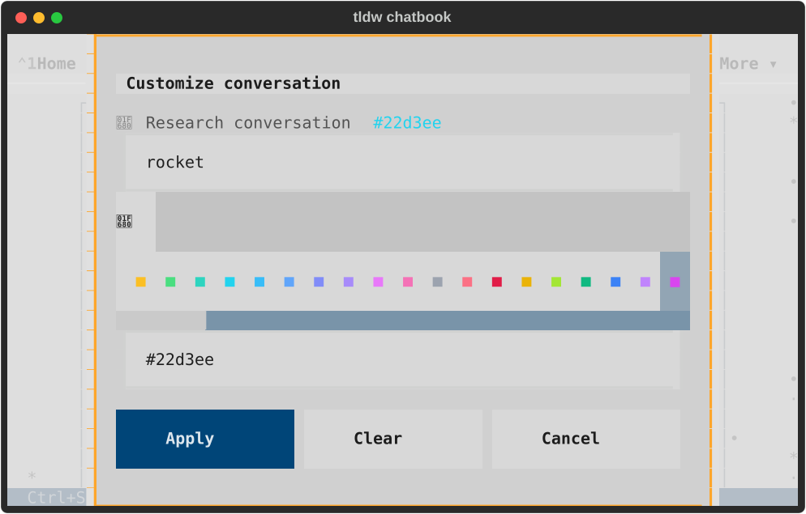
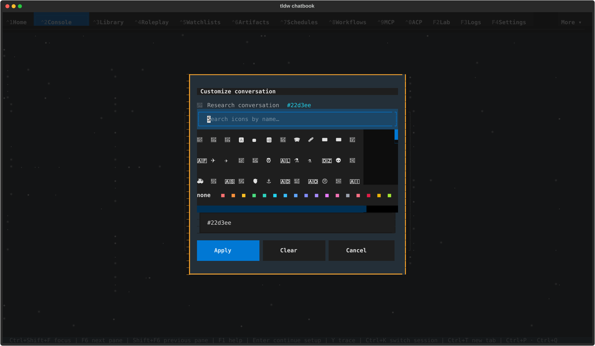
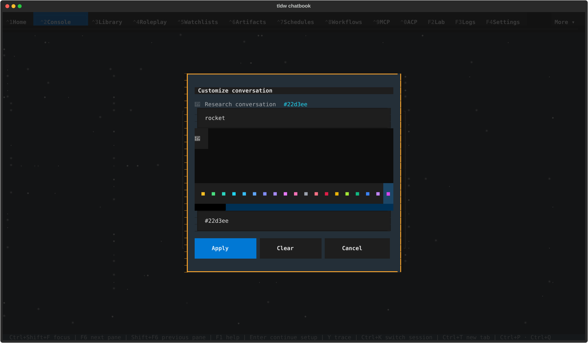
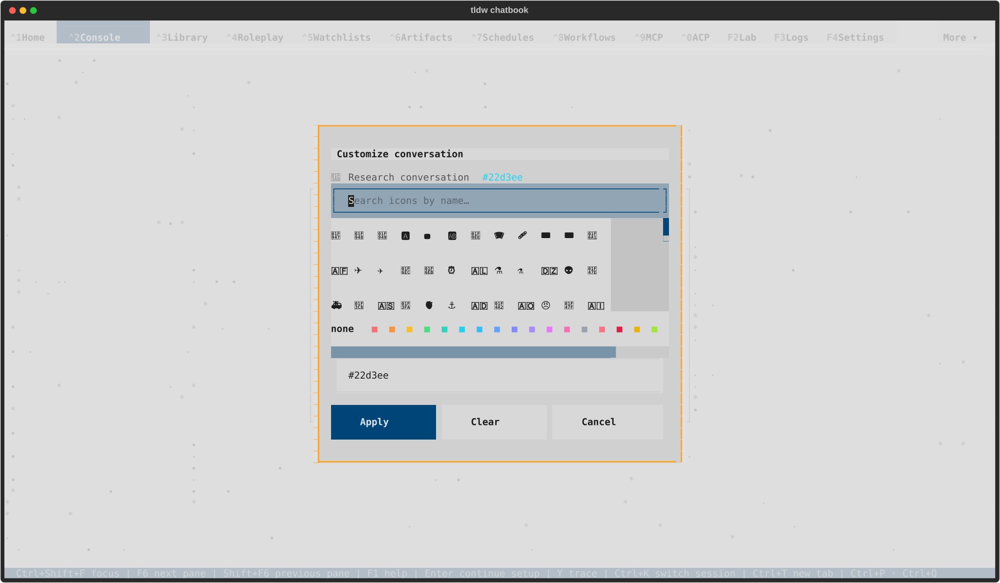
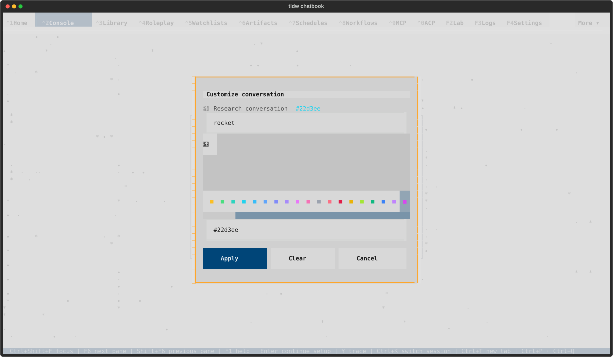

# Appearance visual review — TASK-32816

Eight native captures from the real app and real icon catalog, inspected after
rendering to PNG. Every capture shows the complete Apply/Clear/Cancel row.
Initial views show all twelve icons in the first row and an unwrapped `none`
label. Filtered views retain the full `rocket` query and show keyboard focus on
the revealed final palette swatch. Every draft was cancelled after the capture.

[Verification receipt](README.md) · [source hashes and journey results](native/result.json) · [clean shutdown](lifecycle-002.json)

## Compact 80×24

The [previous dark](../2026-09-18-css-consolidation/native/textual-dark-80x24-appearance.svg)
and [previous light](../2026-09-18-css-consolidation/native/textual-light-80x24-appearance.svg)
captures retain the original clipped action row for comparison.

### textual-dark

### textual-light

## Wide 170×48

### textual-dark

### textual-light

## Scope

The app runs with a private profile and a real LinuxDriver attached to a native
TTY. The dialog is constructed directly with a fixture conversation title and
initial appearance. These captures qualify this dialog's layout, filtering,
keyboard palette reveal, pointer selection and cancellation; they do not claim
a saved conversation's normal entry route or a database appearance write.
Mounted tests separately verify Apply/Clear results. Glyph rendering depends on
the terminal's emoji/font support; existing country-code fallback glyphs remain.
