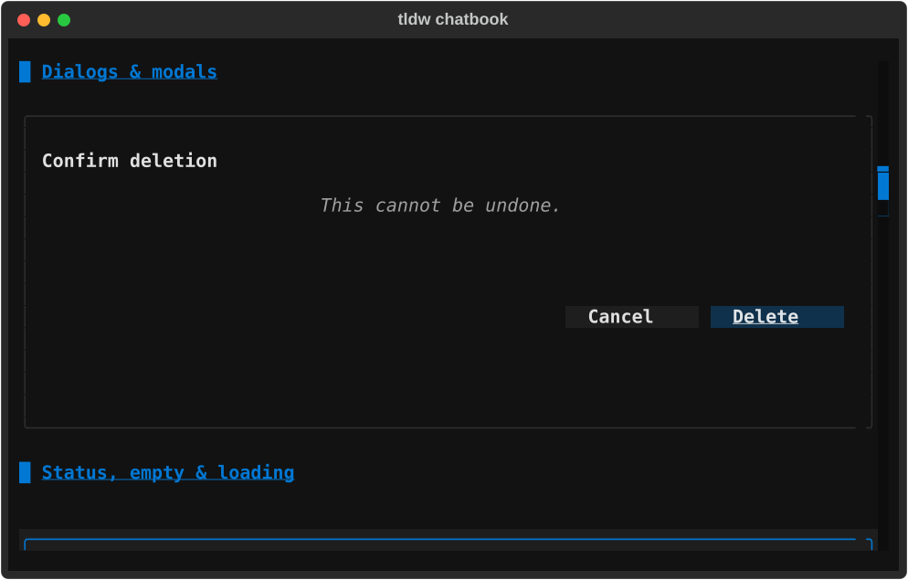
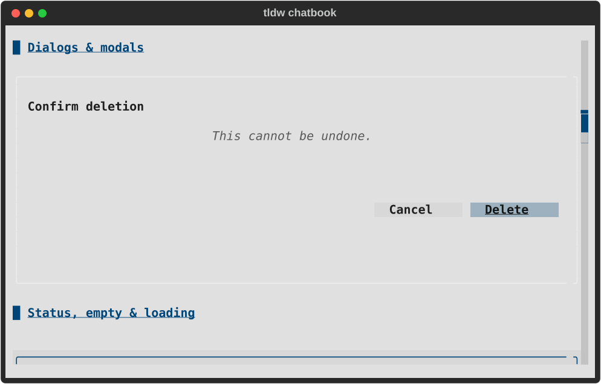
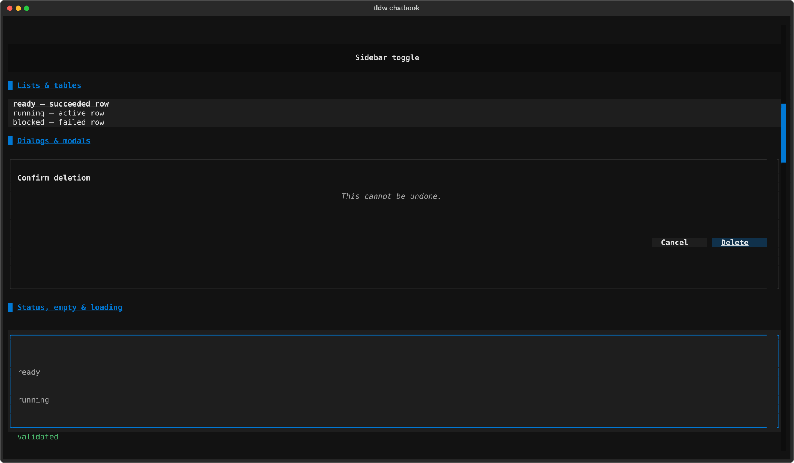
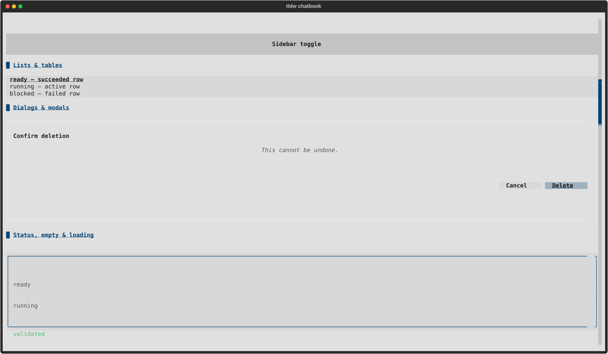
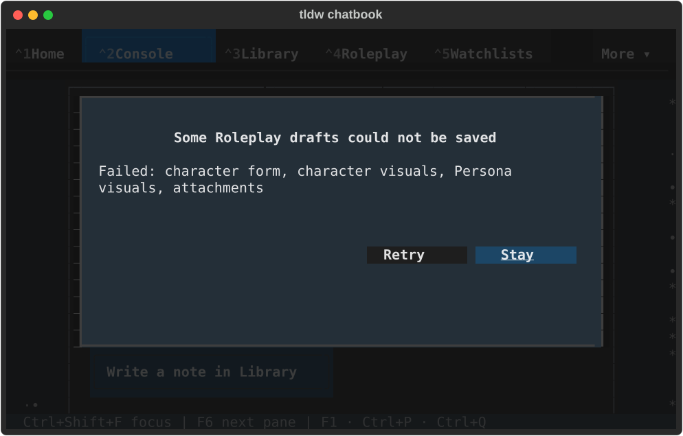
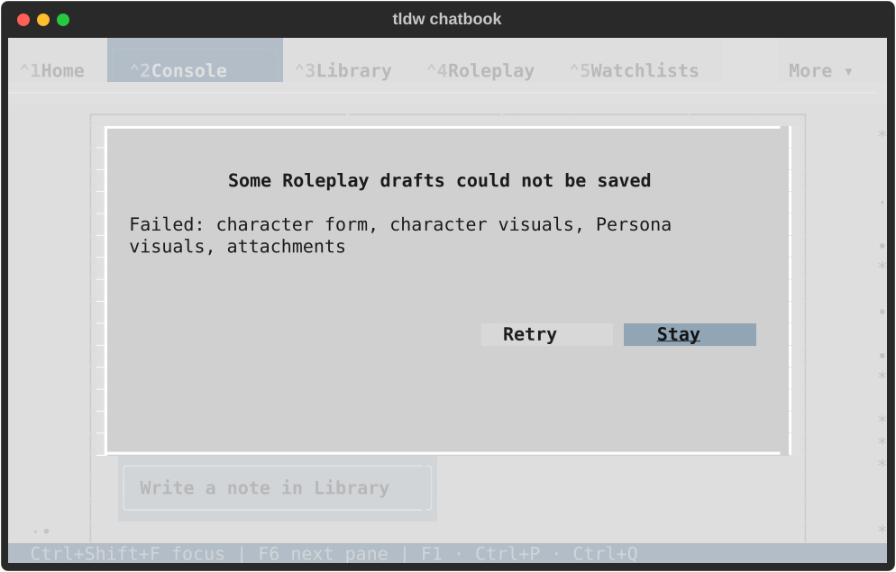
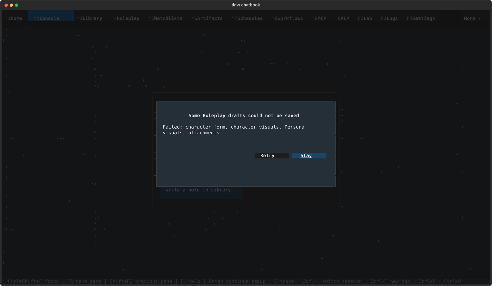
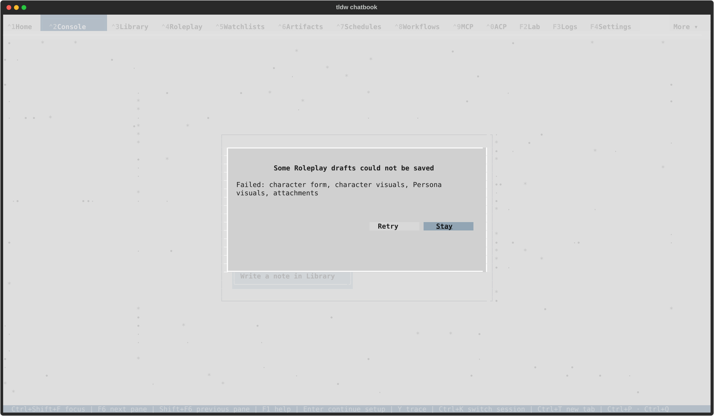

# Shared dialog action alignment visual review

Eight final native captures at 80×24 and 170×48 in both themes, rendered and inspected.
The gallery now honors its documented right alignment; focused Delete stays fully
readable. Roleplay retains its frame, complete failed-domain text and focused Stay
using the same rule. Startup notifications have cleared in these final captures.

The gallery is reached through Ctrl+P search and Enter; Cancel is focused directly
before Tab moves to Delete. Roleplay is opened directly with failure fixtures;
these captures do not claim the normal partial-save entry or actual save workers.

## Pattern Gallery

| Size | Dark | Light |
| --- | --- | --- |
| 80x24 |  |  |
| 170x48 |  |  |

## Roleplay continuity

| Size | Dark | Light |
| --- | --- | --- |
| 80x24 |  |  |
| 170x48 |  |  |

[Verification](README.md) · [Native receipt](native/result.json) · [Lifecycle](lifecycle.json) · [Snapshot change](snapshot-semantic-diff.txt)
