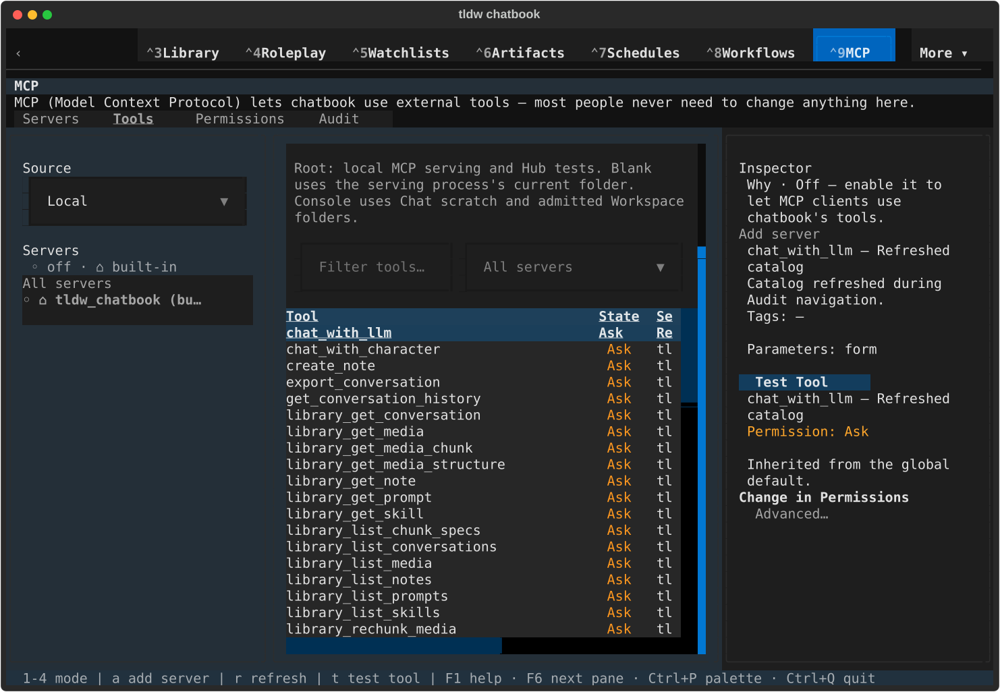
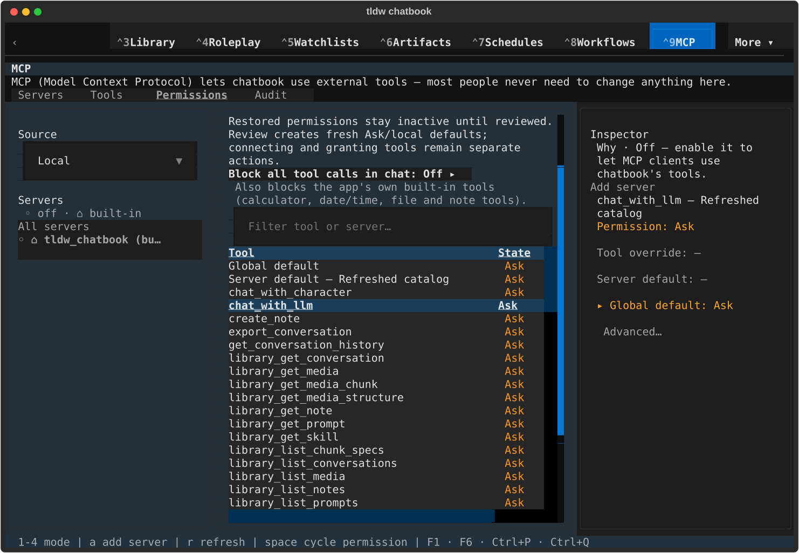
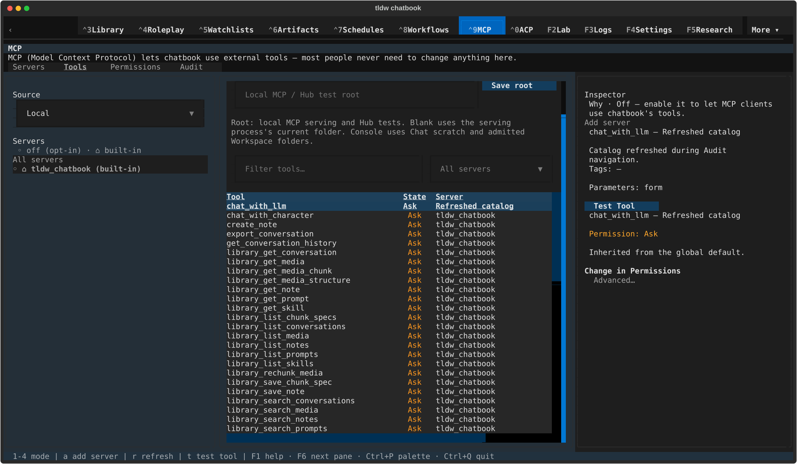
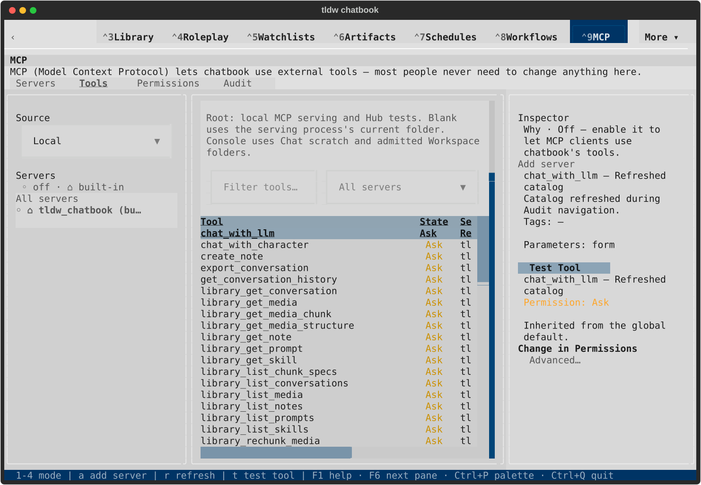
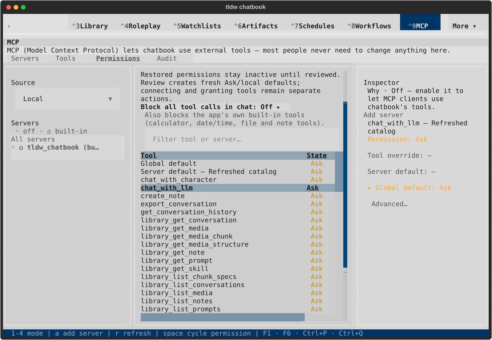

# Audit catalog freshness native gallery

All eight captures were rendered and inspected. See [scope and lifecycle](README.md).

## Dark · 120x40

### Open tool after catalog replacement

[Terminal text](native/textual-dark-120x40-tools.txt)

### Adjust permission after catalog replacement

[Terminal text](native/textual-dark-120x40-permissions.txt)

## Dark · 170x48

### Open tool after catalog replacement

[Terminal text](native/textual-dark-170x48-tools.txt)

### Adjust permission after catalog replacement

[Terminal text](native/textual-dark-170x48-permissions.txt)

## Light · 120x40

### Open tool after catalog replacement

[Terminal text](native/textual-light-120x40-tools.txt)

### Adjust permission after catalog replacement

[Terminal text](native/textual-light-120x40-permissions.txt)

## Light · 170x48

### Open tool after catalog replacement

[Terminal text](native/textual-light-170x48-tools.txt)

### Adjust permission after catalog replacement

[Terminal text](native/textual-light-170x48-permissions.txt)
