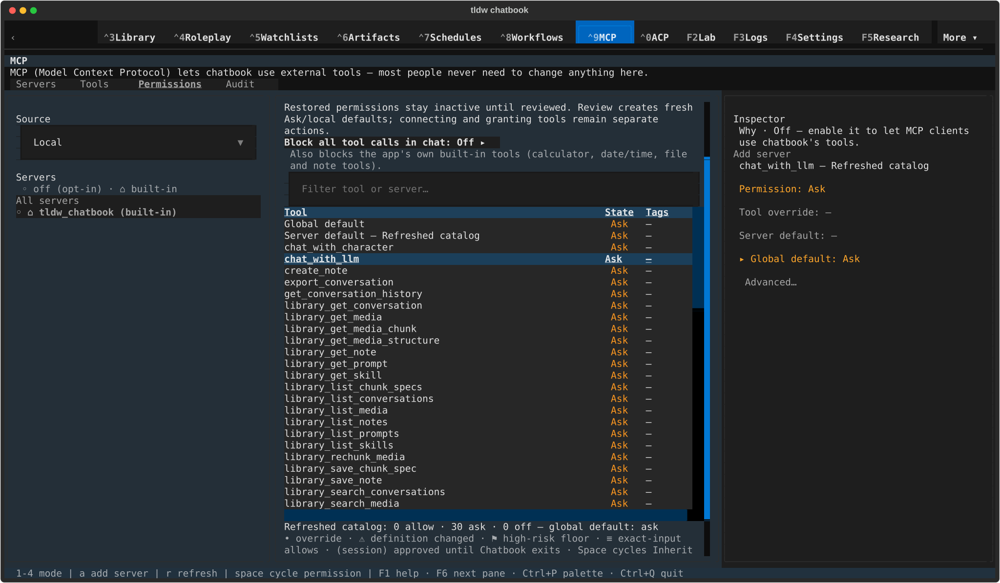
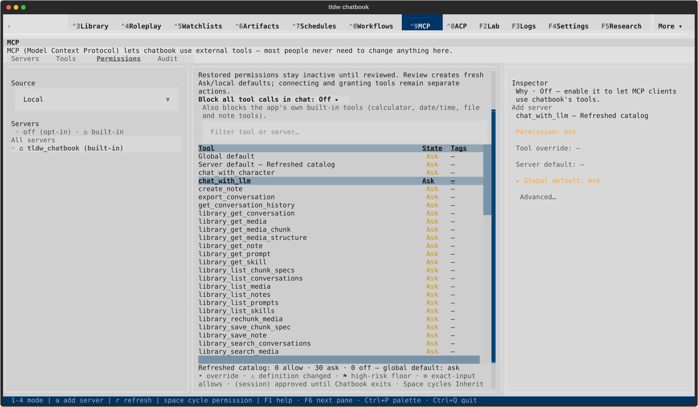

# PR2726 current-dev native gallery

The owner approved this visual/conflict snapshot. [Current closeout evidence](CLOSEOUT.md) records the inherited selector-budget repair, 203 passing targeted checks and pixel-identical modal/Audit replays. Earlier pending-approval and unchanged-source statements below describe the approved snapshot; final-head CI/review still gates merge.

All eight replay captures were rendered and inspected. See [scope and lifecycle](README.md) and [conflict choices](CURRENT-DEV-REVIEW.md).

The first run had an intermittent light-wide table header mismatch. Review the
[affected capture and replay](HEADER-FOLLOWUP.md) too; the replay does not close that follow-up.

## Dark · 120x40

### Open tool after catalog replacement

[Terminal text](current-dev/native/textual-dark-120x40-tools.txt)

### Adjust permission after catalog replacement

[Terminal text](current-dev/native/textual-dark-120x40-permissions.txt)

## Dark · 170x48

### Open tool after catalog replacement

[Terminal text](current-dev/native/textual-dark-170x48-tools.txt)

### Adjust permission after catalog replacement

[Terminal text](current-dev/native/textual-dark-170x48-permissions.txt)

## Light · 120x40

### Open tool after catalog replacement

[Terminal text](current-dev/native/textual-light-120x40-tools.txt)

### Adjust permission after catalog replacement

[Terminal text](current-dev/native/textual-light-120x40-permissions.txt)

## Light · 170x48

### Open tool after catalog replacement

[Terminal text](current-dev/native/textual-light-170x48-tools.txt)

### Adjust permission after catalog replacement

[Terminal text](current-dev/native/textual-light-170x48-permissions.txt)
