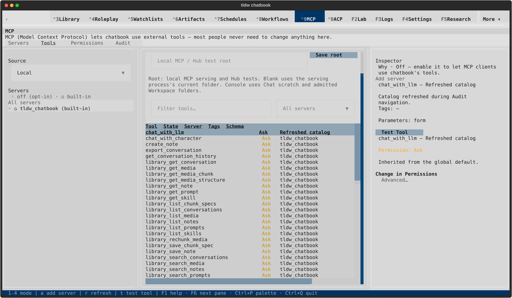
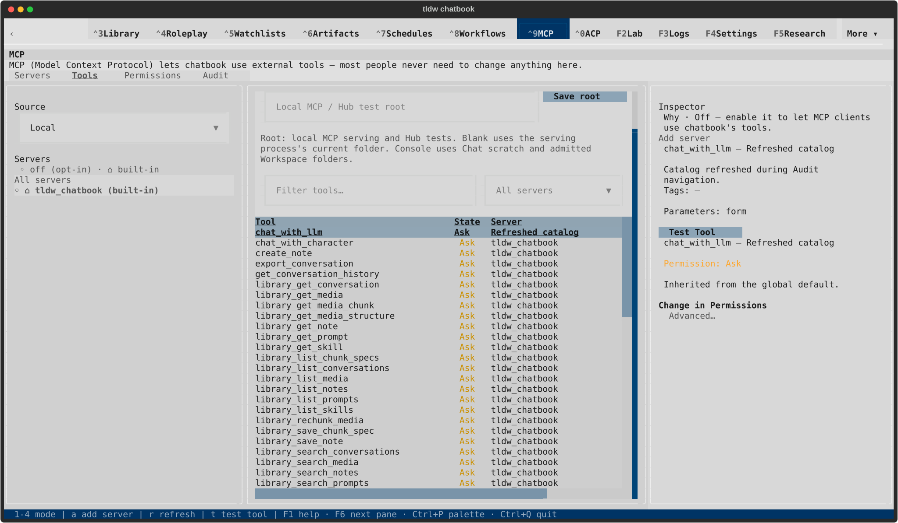

# Intermittent Tools header alignment — retained follow-up

During the first current-dev catalog-freshness journey, the light 170×48 Tools
header painted its labels together at their initial widths while body cells
used measured widths. Both the SVG and terminal text show the mismatch. The
correct `chat_with_llm` row, fresh label/description/schema and permission state
were selected. The other seven destination captures had aligned headers.

An unchanged-source replay in a new private profile produced aligned headers.
This confirms intermittency, not repair. The gallery includes the replay;
this first result remains part of its review, with [terminal text](current-dev/first-run/textual-light-170x48-tools.txt),
[behavioral receipt](current-dev/first-run/result.json) and [lifecycle receipt](current-dev/first-run/lifecycle.json).

Independent read-only triage found a matching cache hazard in Textual 8.2.8:
ToolsMode rebuilds auto-width columns before idle measurement, then Textual
increases widths without clearing header cell/row caches whose keys omit width.
ToolsMode itself is identical to merged dev. This is a plausible cause; baseline
reproduction is still needed to establish attribution and a discriminating
regression. Additional settling alone may not invalidate a cached header.

The bounded follow-up should reproduce painted header/body alignment under
catalog replacement and theme/resize transitions on merged dev, then repair
and verify that behavior separately. No table/layout source changes are hidden
in PR2726. The current catalog navigation qualification does not close this issue.
