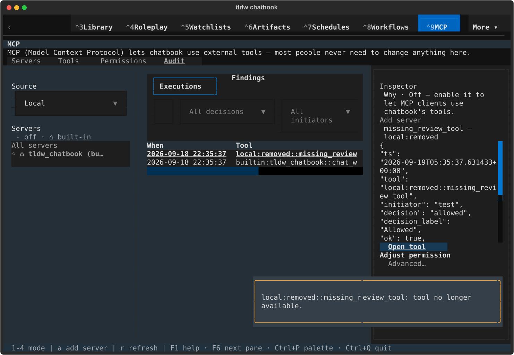
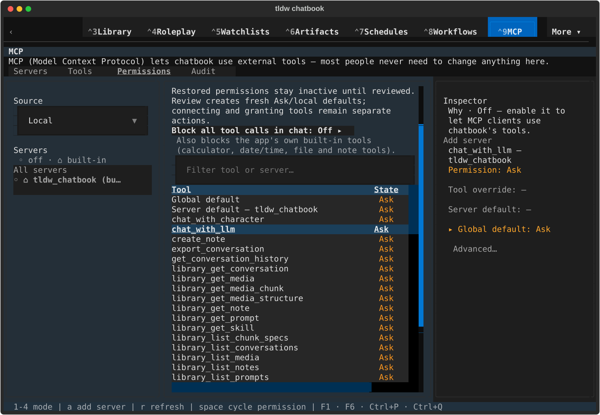
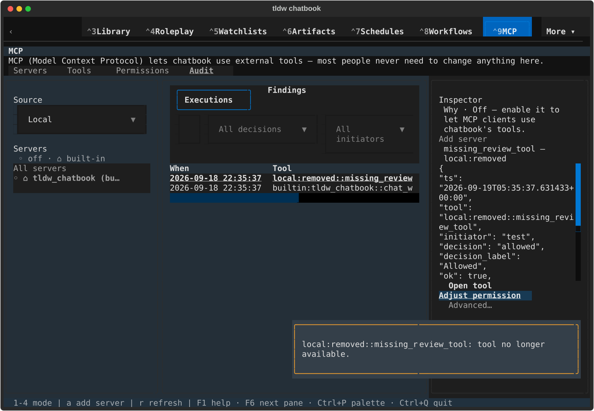
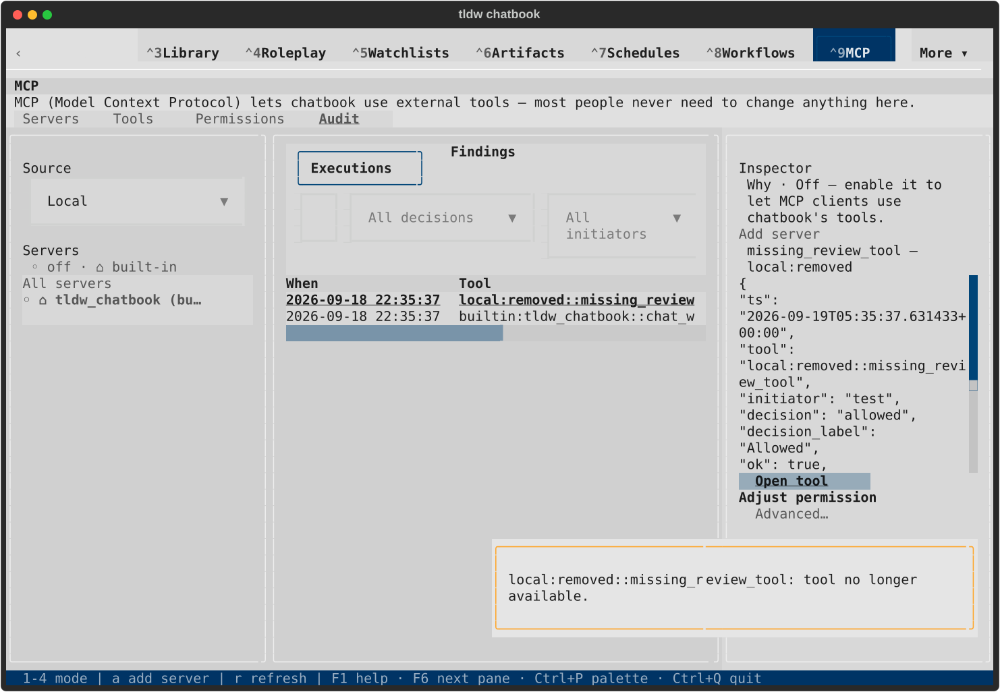
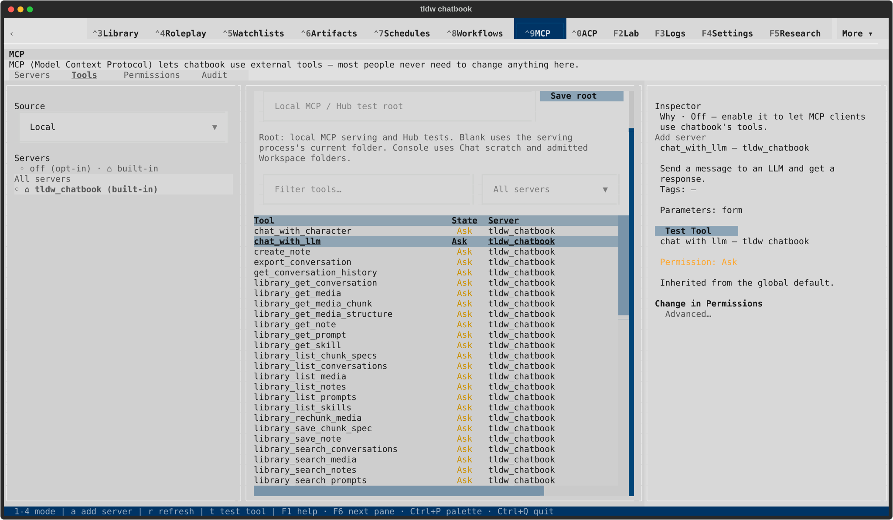
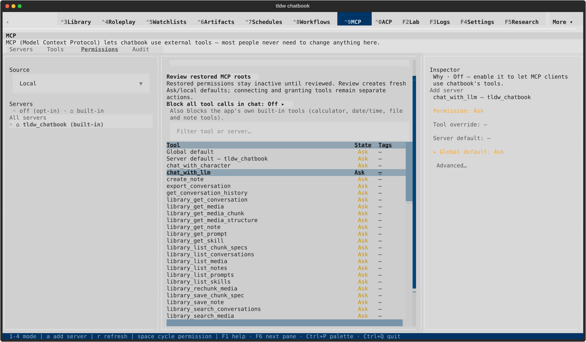
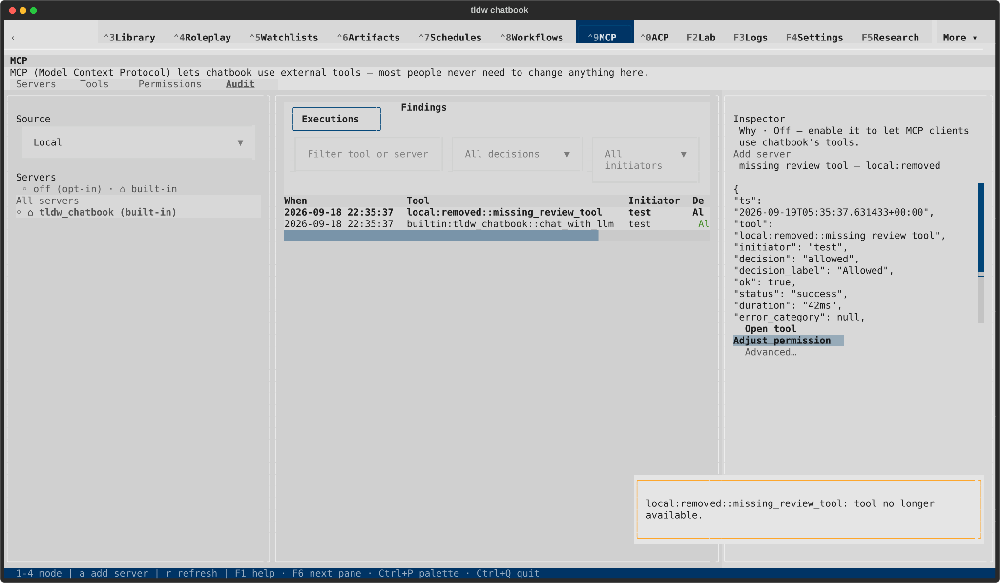

# Audit navigation native gallery

All 16 captures were rendered and inspected. See [scope and lifecycle](README.md).

## Dark · 120x40

### Open tool destination

[Terminal text](native/textual-dark-120x40-tools.txt)

### Open tool unavailable warning

[Terminal text](native/textual-dark-120x40-missing-tools.txt)

### Adjust permission destination

[Terminal text](native/textual-dark-120x40-permissions.txt)

### Adjust permission unavailable warning

[Terminal text](native/textual-dark-120x40-missing-permissions.txt)

## Dark · 170x48

### Open tool destination

[Terminal text](native/textual-dark-170x48-tools.txt)

### Open tool unavailable warning

[Terminal text](native/textual-dark-170x48-missing-tools.txt)

### Adjust permission destination

[Terminal text](native/textual-dark-170x48-permissions.txt)

### Adjust permission unavailable warning

[Terminal text](native/textual-dark-170x48-missing-permissions.txt)

## Light · 120x40

### Open tool destination

[Terminal text](native/textual-light-120x40-tools.txt)

### Open tool unavailable warning

[Terminal text](native/textual-light-120x40-missing-tools.txt)

### Adjust permission destination

[Terminal text](native/textual-light-120x40-permissions.txt)

### Adjust permission unavailable warning

[Terminal text](native/textual-light-120x40-missing-permissions.txt)

## Light · 170x48

### Open tool destination

[Terminal text](native/textual-light-170x48-tools.txt)

### Open tool unavailable warning

[Terminal text](native/textual-light-170x48-missing-tools.txt)

### Adjust permission destination

[Terminal text](native/textual-light-170x48-permissions.txt)

### Adjust permission unavailable warning

[Terminal text](native/textual-light-170x48-missing-permissions.txt)
