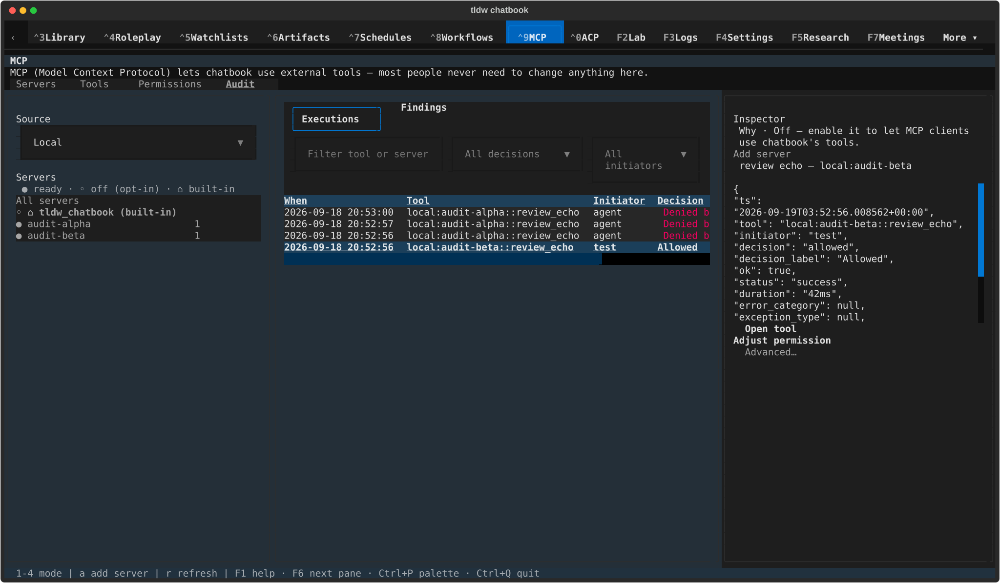
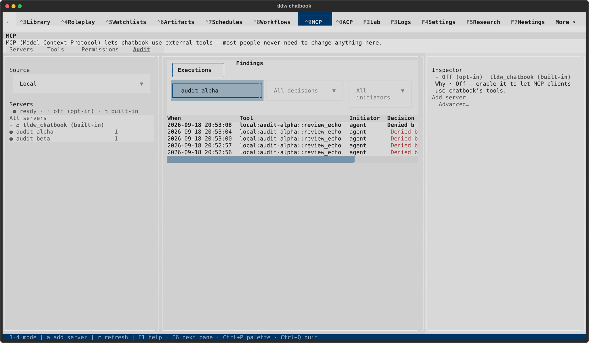
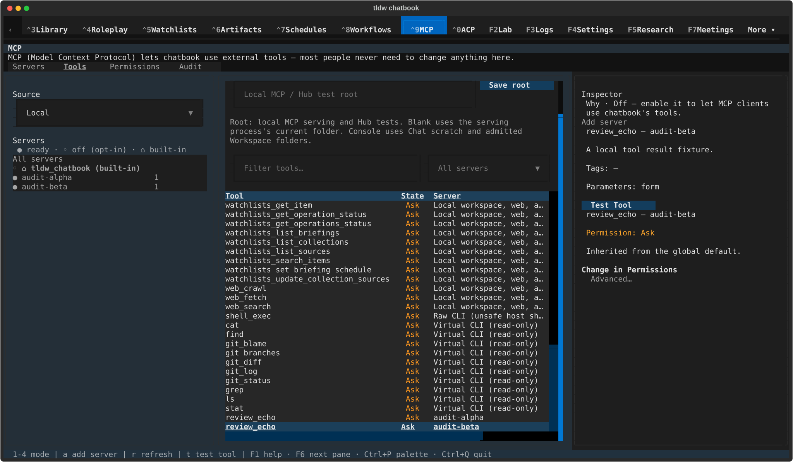
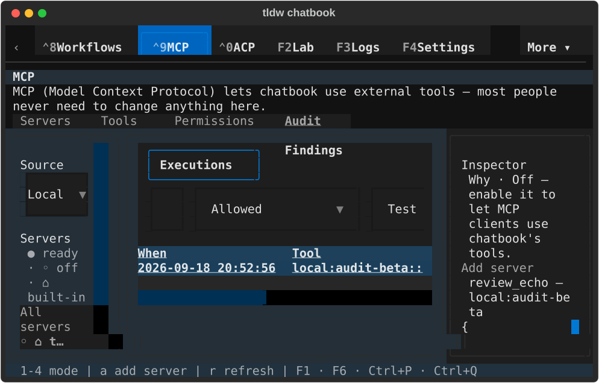
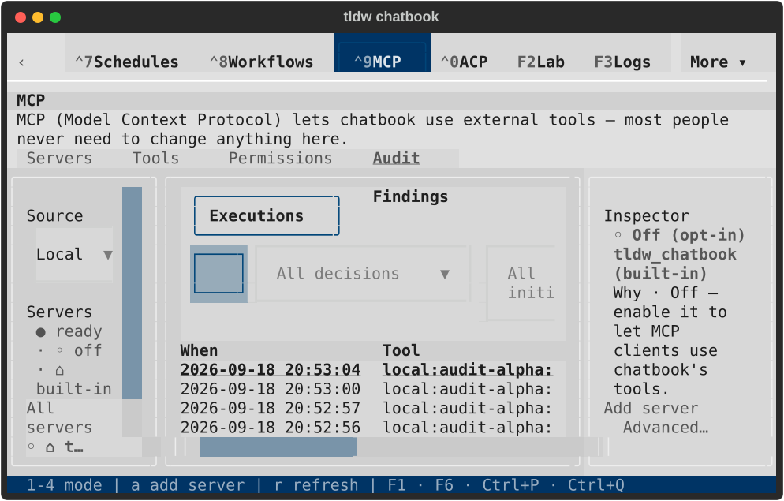

# MCP Audit selection evidence

These are native TldwCli/LinuxDriver captures with synthetic metadata in the real
private execution log. They are not proof of tool execution. All 18 captures were
inspected in dark/light contact sheets, with wide filtered and exact-tool captures
also inspected individually.

The compact captures expose pre-existing filter clipping; that layout remains
open for a separate repair. Compact inspector reachability is in PR #2718.

## Refresh retains the same event

## Filtering removes its detail and drill actions

## Exact same-name tool on the selected server

## Compact state — selection behavior checked, layout still open

