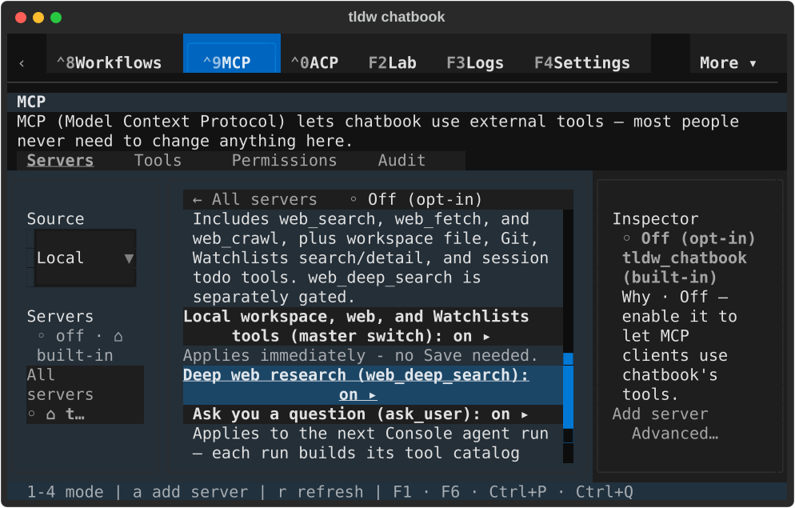
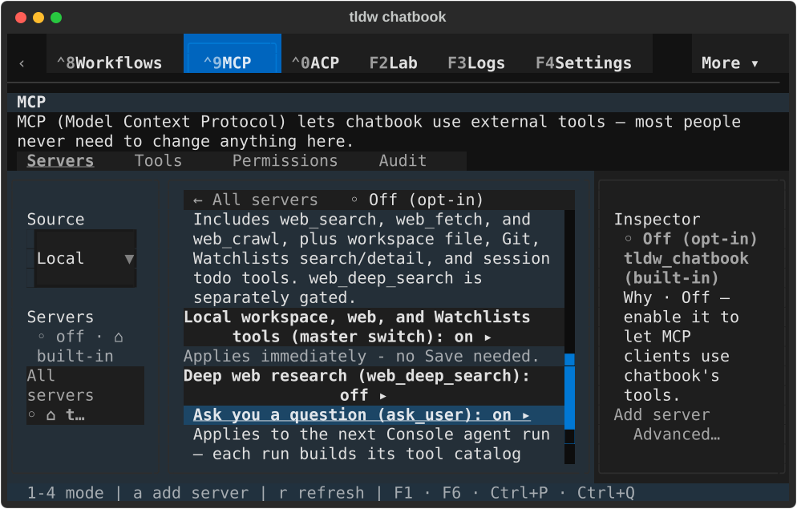
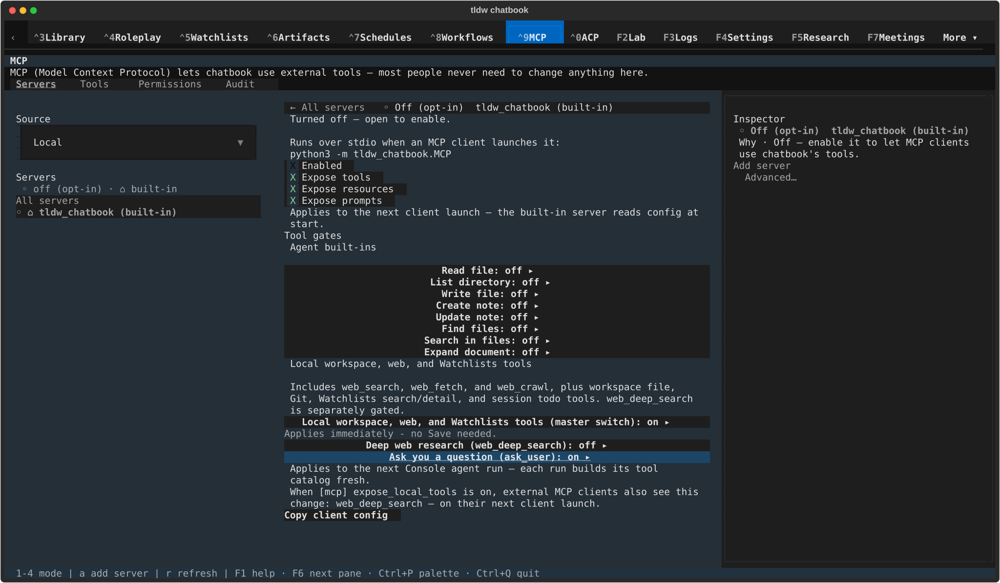
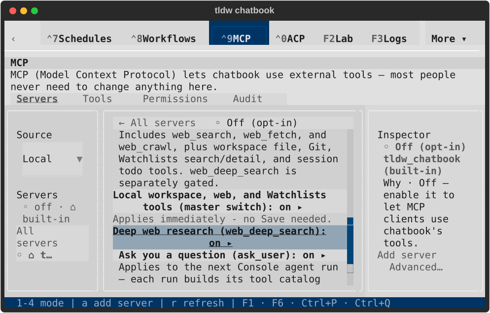
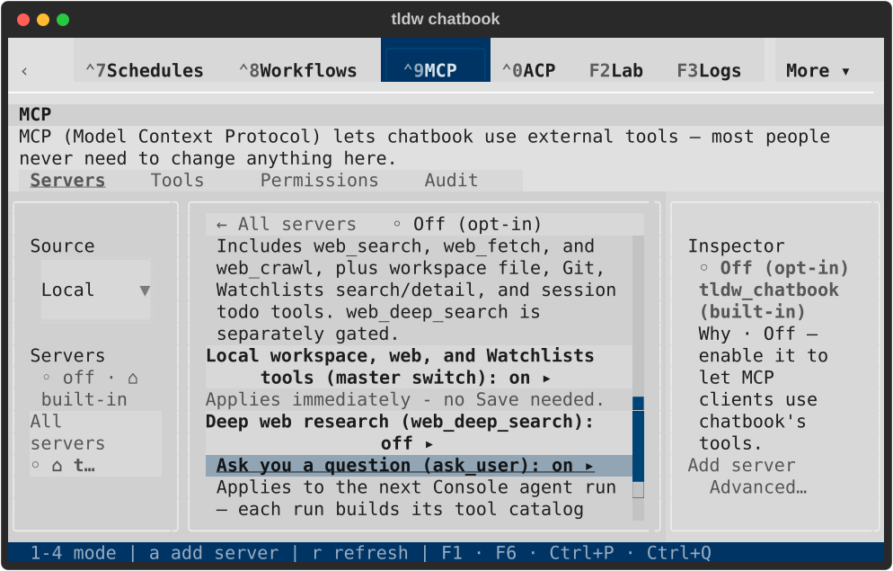
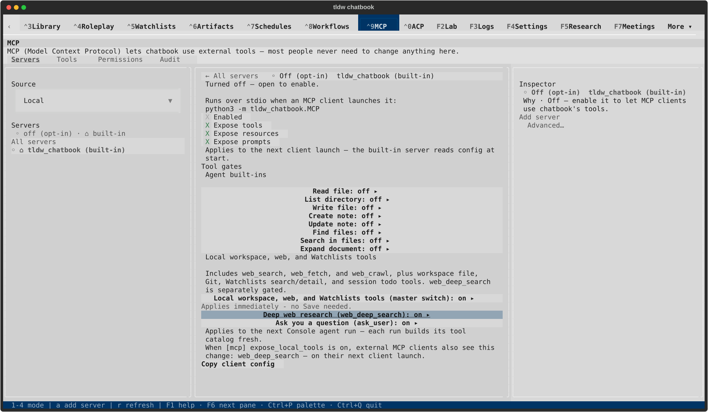
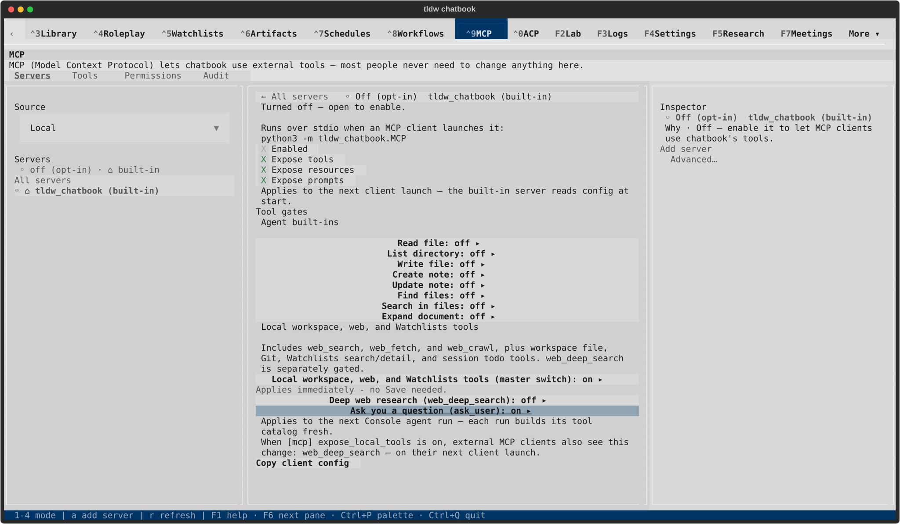

# MCP tool-switch visual review — TASK-32822

Eight native terminal captures, inspected after rendering. Each Deep research view
shows the real private setting saved on; each Ask user view follows its reversal
to off. Compact labels and on/off states remain fully visible.

See [verification and scope](README.md), [source receipt](native/result.json) and
[lifecycle checks](lifecycle.json). Broader MCP workflows remain unqualified.

## textual-dark, 80x24: Deep research on

## textual-dark, 80x24: Ask user focused; Deep research restored off

## textual-dark, 170x48: Deep research on

## textual-dark, 170x48: Ask user focused; Deep research restored off

## textual-light, 80x24: Deep research on

## textual-light, 80x24: Ask user focused; Deep research restored off

## textual-light, 170x48: Deep research on

## textual-light, 170x48: Ask user focused; Deep research restored off

